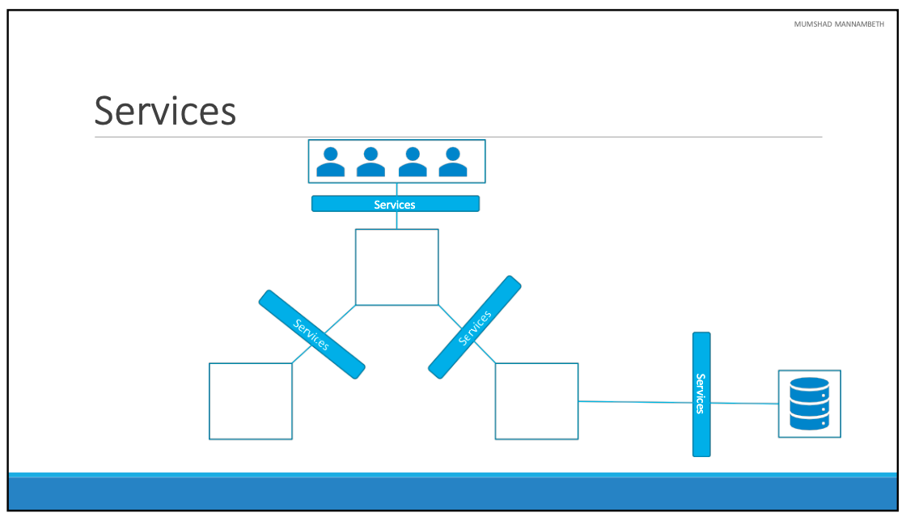
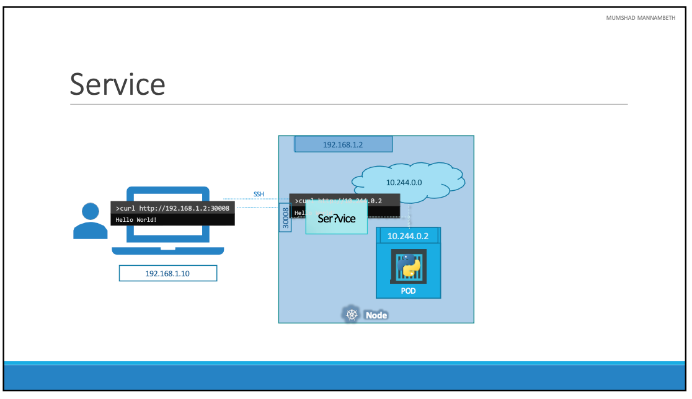
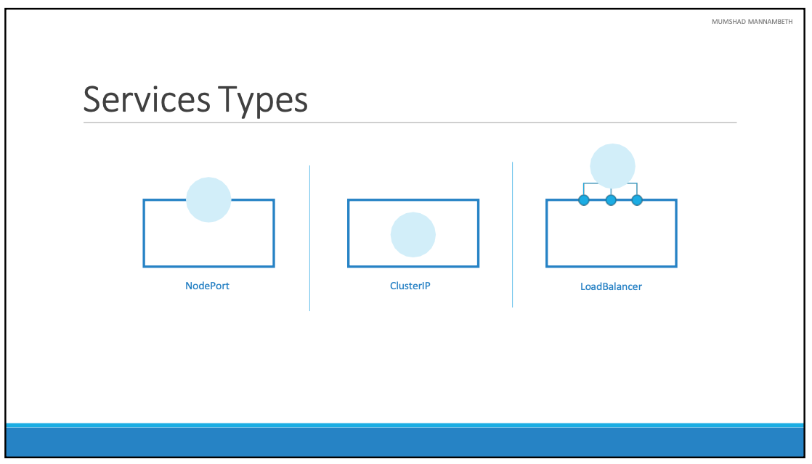
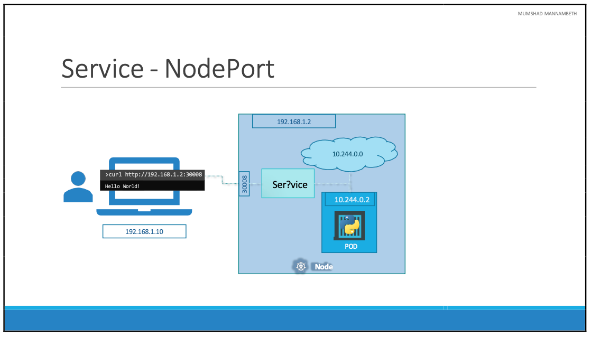
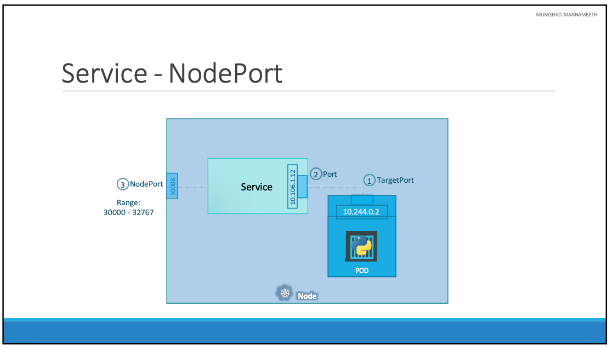
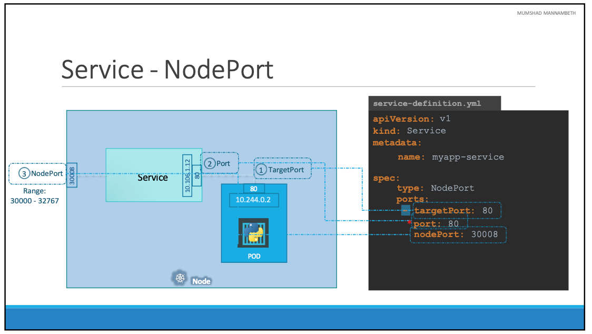
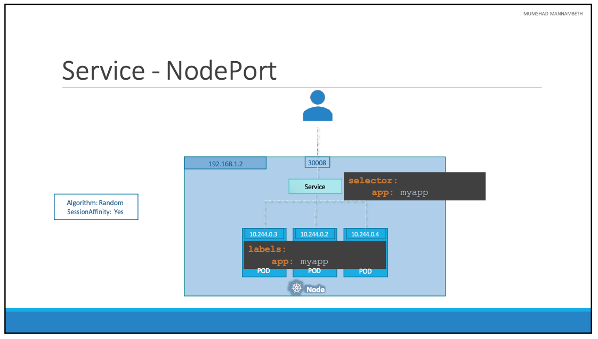
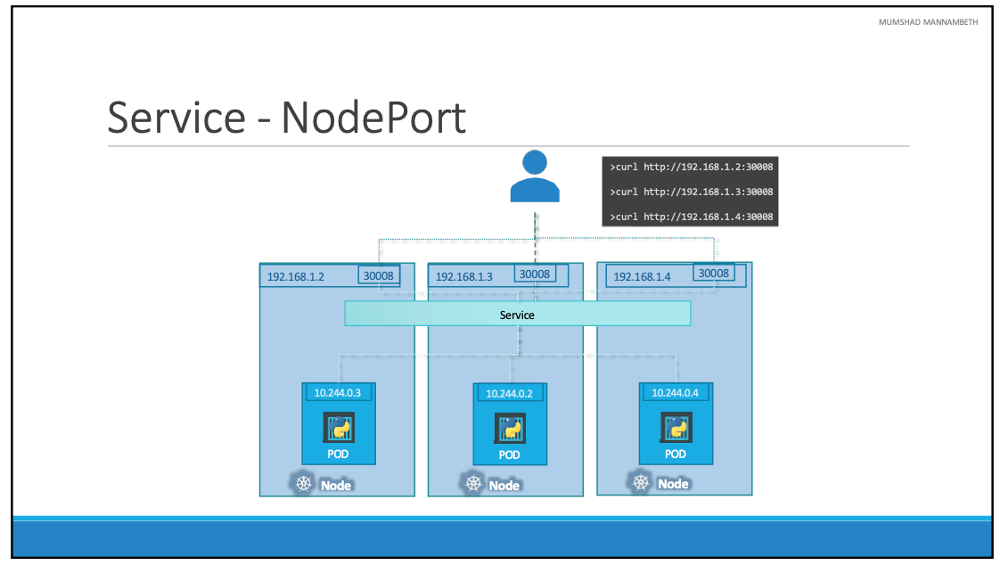
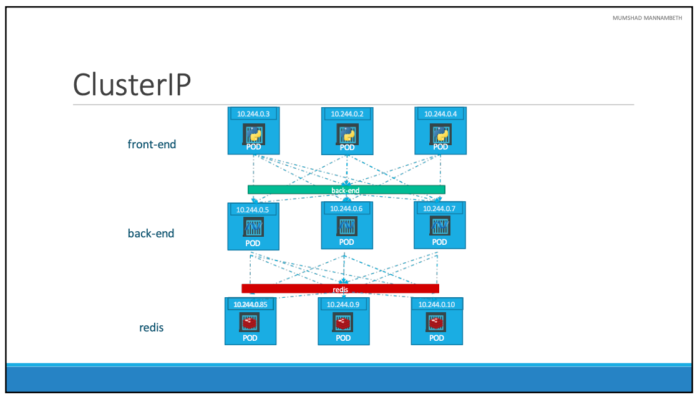
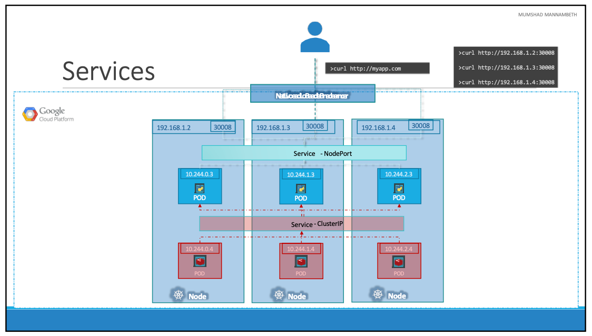

# Services

- 이번 장에서는 **Certified Kubernetes Administrator (CKA)** 을 준비하며 Services에 대해서 알아본다.

---

### Services



- 쿠버네티스 "Services"는 애플리케이션 내부 및 외부의 다양한 구성 요소 간의 통신을 가능하게 한다.
- 애플리케이션을 다른 애플리케이션 또는 사용자와 연결하는 데 도움이 된다.
  예를 들어, 애플리케이션에는 사용자에게 프론트엔드 부하를 제공하는 그룹, 백엔드 프로세스를 실행하고 또 다른 그룹, 외부 데이터 소스에 연결하는 세 번째 그룹과 같은 다양한 섹션을 실행하는 Pod 그룹이 있다.
- 이러한 Pod 그룹 간의 연결을 가능하게 하는 것이 "Services"다. 
- "Services"는 프론트엔드 애플리케이션을 사용자에게 제공하고 백엔드와 프론트엔드 Pod 간의 통신을 돕고 외부 데이터 소스에 대한 연결을 설정하는 데 도움이 된다.
- 따라서 "Services"는 애플리케이션에서 마이크로서비스 간의 느슨한 결합을 가능하게 한다.



- 웹 애플리케이션이 실행 중인 Pod가 배포되어 있다. 
- 쿠버네티스 노드에는 IP 주소가 있으며 `192.168.1.2`가 할당되어 있으며, 노트북에는 `192.168.1.10`이 할당되어 있다.
- 노드의 Pod에는 `10.244.0.2`가 할당되어 있지만 별도의 네트워크이기 때문에 노트북에서 바로 접근할 수는 없다.
- 첫째, `192.168.1.2`로 쿠버네티스 노드에 SSH를 실행하면 curl을 실행하여 Pod의 웹페이지에 액세스할 수 있고 노드에 GUI가 있는 경우 브라우저를 실행하여 `http://10.244.0.2` 주소로 브라우저에서 웹페이지를 볼 수 있다.
- 하지만 이러한 방법은 쿠버네티스 노드 내부에서 실행한 것이며 일반적으로 사용자들이 원하는 사용법은 아니다.
- 노트북에서 노드를 거쳐 웹 컨테이너를 실행하는 Pod까지 요청을 매핑하는 데 도움을 주는 중간 단계가 필요하며 여기서 등장하는 것이 "Services"다.
- 쿠버네티스 "Services"는 이전에 알아보았던 Pod, ReplicaSet, Deployment와 같은 객체다.
- 대표적인 사용 사례로 하나의 노드의 포트를 수신하고 해당 포트의 요청을 웹 애플리케이션을 실행하는 Pod로 전달하는 것이 있다.

#### Services Type



- NodePort는 "Services"가 노드의 포트에서 내부 Pod에 액세스할 수 있도록 한다.
- CusterIP는 클러스터 내부에 가상 IP를 생성하여 프론트엔드 서버 집합에서 백엔드 서버 집합으로의 통신을 가능하게 한다.
- LoadBalancer는 클라우드 공급자에서 서비스에 대한 로드 밸런서를 제공하여, 여러 웹 서버에 로드를 분산할 수 있게 한다.

---

### NodePort



- NodePort는 "Services"가 노드의 포트를 Pod의 포트에 매핑하여 통신하는데 도움을 준다.



- 총 세개의 포트가 있으며 실제 웹 서버가 실행 중인 Pod의 포트는 80이다.
  이를 targetPort라고 하는데, "Services"가 요청을 전달하는 곳이다.
- 두 번째 포트는 Services 자체의 포트이며 간단하게 Port라고 부른다.
- 이러한 용어는 서비스 관점에서 나온 것이며, 서비스는 사실 노드 내부의 가상 서버와 같다.
- 클러스터 내부에는 자체 IP 주소가 있으며 그 IP 주소를 서비스의 클러스터 IP라고 한다.
- 마지막으로 노드 자체의 포트가 있는데, 이를 사용하여 외부에서 웹 서버에 액세스한다.
  이것을 NodePort라고 하며 예시에서는 30008을 사용하고 있다. 허용된 볌위는 30,000 ~ 32,767이다.



- "Services"의 spec 영역에는 "type"과 "ports"가 있다.
- type은 만들려는 "Services"의 유형이며 NodePort, ClusterIP, LoadBalancer가 될 수 있다.
- ports는 배열로 targetPort, port, nodePort를 지정해 주어야 한다. 이 중에서 port만 필 수 필드이며, targetPort는 지정하지 않으면 port와 동일한 것으로 간주되고, nodePort를 지정하지 않으면 30,000 ~ 32,767 범위 내에서 자동으로 할당된다.
- "Services" 생성했지만 어떤 Pod에 연결되는 것인지 지정되지 않았으며, 이것을 지정하기 위해 label과 selector가 사용된다.

```yaml title=service-definition.yml
apiVersion: v1
kind: Service
metadata:
  name: myapp-service
spec:
  type: NodePort
  ports:
    - targetPort: 80
      port: 80
      nodePort: 30008
  selector:
    app: myapp
    type: front-end
```

```yaml title=pod-definition.yml
apiVersion: v1
kind: Pod
metadata:
  name: myapp-pod
  labels:
    app: myapp
    type: front-end
spec:
  containers:
    - name: nginx-container
      image: nginx
```

- selector 아래에 pod를 식별하기 위해 레이블 목록을 제공한다.
- pod-definition.yml 파일을 참고하면 동일한 label이 지정되어 있는 것을 확인할 수 있다.
- 이렇게 지정하고 `kubectl create -f service-definition.yml` 명령어를 실행하면 서비스가 생성된다.



- 운영 환경에서는 고가용성 및 부하 분산을 목적으로 웹 애플리케이션의 여러 인스턴스가 실행된다.
- 이 경우 웹 애플리케이션을 실행하는 여러 개의 유사한 Pod가 있고 모두 동일한 레이블을 가지고 있다.
- 동일한 레이블은 Services 생성 중에 selector로 사용되며, Services가 생성되면 레이블이 일치하는 Pod를 3개 찾는다.
- 다음으로 사용자로부터 오는 외부 요청을 전달하기 위해 모든 3개의 Pod를 자동으로 엔드포인트로 선택한다. 추가 구성을 할 필요가 없다.
- 부하를 분산하기 위해 무작위 알고리즘을 사용하며 Services는 여러 Pod에 부하를 분산하는 내장된 LoadBalancer 역할을 한다.



- Pod가 여러 노드에 분산되어 있는 경우 별도의 노드에 있는 Pod에 웹 애플리케이션이 있으므로 추가 구성을 할 필요가 없다.
- 추가로 구성할 필요 없이 서비스를 생성할 때 쿠버네티스는 자동으로 서비스를 생성해 클러스터 내 모든 노드를 가로지르고 targetPort를 클러스터 내 모든 노드의 같은 노드에 매핑한다.
- 이렇게 하면 클러스터의 모든 노드의 IP와 이 경우 30,008인 동일한 포트 번호를 사용하여 애플리케이션에 액세스할 수 있다.
- 요약하면, 단일 노드에 단일 Pod가 있던 단일 노드에 여러 Pod가 있든 여러 노드에 여러 Pod가 있던 "Services"를 생성하는 동안 추가 단계를 거치지 않고도 서비스는 정확히 동일하게 생성된다.
- Pod가 제거되거나 추가되면 서비스가 자동으로 업데이트되어 매우 유연하게 작동하며, 일단 생성되면 일반적으로 추가 구성 및 변경을 할 필요가 없다.

#### Example

- `kubectl get deployment`, `kubectl get pods` 명령어를 입력하여 실행되고 있는 Deployment를 확인한다.

```bash
NAME               READY   UP-TO-DATE   AVAILABLE   AGE
myapp-deployment   6/6     6            6           3h43m
```

```bash
NAME                                READY   STATUS    RESTARTS   AGE
myapp-deployment-5bc74bc7d5-j4hhh   1/1     Running   0          3h29m
myapp-deployment-5bc74bc7d5-md5n7   1/1     Running   0          3h29m
myapp-deployment-5bc74bc7d5-qvs9t   1/1     Running   0          3h29m
myapp-deployment-5bc74bc7d5-r9qfw   1/1     Running   0          3h29m
myapp-deployment-5bc74bc7d5-xtqg6   1/1     Running   0          3h20m
myapp-deployment-5bc74bc7d5-zkkcr   1/1     Running   0          3h29m
```

- 사용자가 외부에서 접근할 수 있도록 "Services"를 생성하기 위해 "service-definition.yaml" 파일을 생성한다.

```yaml title=service-definition.yaml
apiVersion: v1
kind: Service
metadata:
  name: myapp-service
spec:
  type: NodePort
  ports:
    - port: 80
      targetPort: 80
      nodePort: 30004
  selector:
      app: myapp
```

- `kubectl create -f service-definition.yaml` 명령어를 입력하여 서비스를 생성한다.
- `kubectl get svc` 명령어를 입력하면 정상적으로 "services"가 생성된 것을 확인할 수 있다.

```bash
NAME            TYPE        CLUSTER-IP    EXTERNAL-IP   PORT(S)        AGE
kubernetes      ClusterIP   10.96.0.1     <none>        443/TCP        30h
myapp-service   NodePort    10.97.78.71   <none>        80:30004/TCP   5s
```

- `minikube service myapp-service --url` 명령어를 실행하여 services에서 사용하고 있는 url을 확인할 수 있다.

```bash
http://127.0.0.1:60778
```

---

### ClusterIP



- 풀 스택 웹 애플리케이션은 일반적으로 애플리케이션의 다른 부분을 호스팅하는 여러 종류의 Pod를 갖는다.
- 프론트엔드 웹 서버를 실행하는 여러 Pod, 백엔드 서버를 실행하는 또 다른 Pod, Redis와 같은 Key-Value 저장소를 실행하는 Pod, MySQL과 같은 영구 데이터베이스를 실행하는 또 다른 Pod 등이 있다.
- 프론트엔드 서버는 백엔드 Worker에 연결해야 하고, 백엔드 Worker는 Redis 서비스에 연결해야 한다.
- Pod에는 모두 IP 주소가 할당되어 있지만 IP는 고정되어 있지 않으며 Pod는 언제든지 다운될 수 있으므로 새로운 Pod가 상항 생성된다.
- 따라서 애플리케이션 내에서 내부 통신을 위해 이러한 IP 주소에 의존해서는 안된다.
- 쿠버네티스 Services는 이러한 Pod를 그룹화하고 그룹의 Pod에 액세스하기 위한 단일 인터페이스를 제공한다.
- 예를 들어, 백엔드 Pod를 위해 생성된 서비스는 모든 백엔드 Pod를 그룹화하고 다른 Pod가 이 서비스에 액세스하기 위한 단일 인터페이스를 제공하는 데 도움이 된다.
  요청은 다음 중 하나로 전달된다.
- 마찬가지로 Redis에 대한 추가 서비스를 만들고 백엔드 Pod가 이 서비스를 통해 Redis 시스템에 액세스할 수 있도록 허용한다.
- 이를 통해 쿠버네티스 클러스터에 마이크로서비스 기반 애플리케이션을 쉽고 효과적으로 배포할 수 있다.
- 각 계층은 이제 다양한 서비스 간의 통신에 영향을 미치지 않고 필요에 따라 확장하거나 이동할 수 있다.
- 각 서비스는 클러스터 내부에서 IP와 다른 Pod가 서비스에 액세스하는 데 사용해야하는 이름이 할당되며 이러한 유형의 Services를 "ClusterIP"라고 한다.

```yaml title=service-definition.yaml
apiVersion: v1
kind: Service
metadata:
  name: back-end
spec:
  type: ClusterIP
  ports:
    - targetPort: 80
      port: 80
  selector:
    app: myapp
    type: back-end
```

```yaml pod-definition.yaml
apiVersion: v1
kind: Pod
metadata:
  name: myapp-pod
  labels:
    app: myapp
    type: back-end
spec:
  containers:
    - name: nginx-container
      image: nginx
```

- spec 영역에서 type은 "ClusterIP"로 지정한다.
- ports 영역에서 targetPort는 백엔드가 노출되는 포트이므로 80이 된다. port는 services가 노출되는 포트로 80을 사용한다.
- 특정 Pod에 연결하기 위해서 selector를 사용하였으며 labels로 연결할 수 있다.

---

### LoadBalancer



- `192.168.1.2`, `192.168.1.3`, `192.168.1.4` 총 네개의 클러스터가 있다.
- 애플리케이션은 2계층으로 데이터베이스와 애플리케이션에 액세스할 수 있는 프론트엔드 애플리케이션이 있다.
- 최종 사용자가 실제로 원하는 것은 애플리케이션에 액세스할 수 있는 단일 URL이며 이를 위해 환경에 별도의 로드 밸런서를 설정해야 한다.
- 로드 밸런서 목적으로 새로운 VM을 배포하고 해당 VM에 들어오는 요청을 다음 중 하나로 전달하도록 구성한다.
- 다음으로 사용자가 `http://myapp.com`을 호스팅할 때 이 로드 밸런서를 가리키도록 조직의 DNS를 구성해야 한다.
- 로드 밸런서를 직접 설정하는 것은 쉽지 않은 작업이므로 GCP와 같이 지원되는 CloudPlatform이 있는 경우 제공하는 로드 밸린싱 기능을 사용하는 것이 좋다.
- 대부분의 클라우드는 쿠버네티스와 기본적으로 통합되어 있으므로 손쉽게 사용이 가능하다.

```yaml title=service-definition.yaml
apiVersion: v1
kind: Service
metadata:
  name: front-end
spec:
  type: LoadBalancer
  ports:
    - targetPort: 80
      port: 80
  selector:
    app: myapp
    type: front-end
```

---

### 참고한 강의

- [Kubernetes for the Absolute Beginners](https://www.udemy.com/course/learn-kubernetes)
- [Certified Kubernetes Administrator (CKA)](https://www.udemy.com/course/certified-kubernetes-administrator-with-practice-tests)