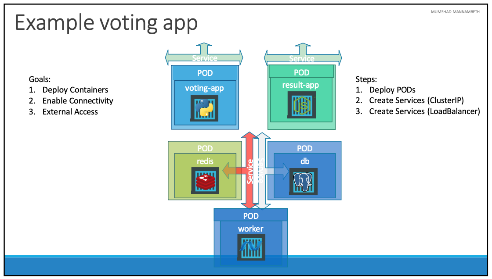
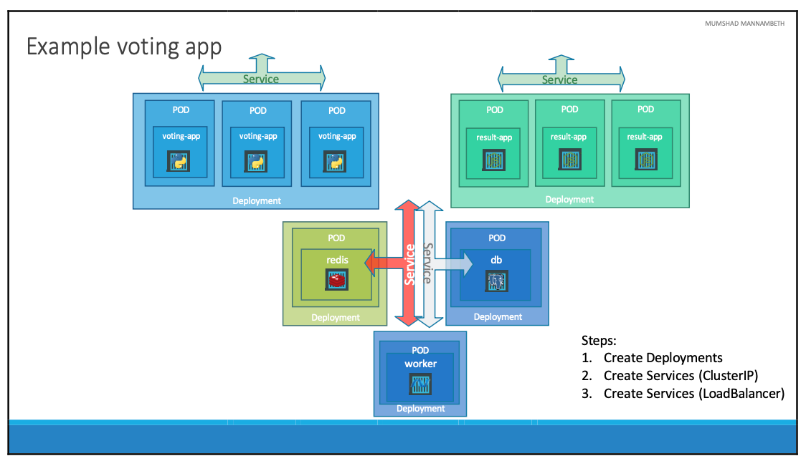

# Microservices

- 이번 장에서는 **Certified Kubernetes Administrator (CKA)** 을 준비하며 마이크로서비스 아키텍처에 대해서 알아본다.

---

### Voting app



- 모든 애플리케이션은 Pod에서 실행되고 Pod를 설정한 이후 애플리케이션간 통신을 설정한다.
- 투표 앱과 결과 앱은 사용자들이 쿠버네티스 외부에서 브라우저로 접근할 수 있어야 한다.
- Redis가 실행되고 있는 Pod는 투표 앱과 Worker 앱이 접근할 수 있어야 한다.
- Postgres가 실행되고 있는 Pod는 Worker 앱과 결과 앱이 접근할 수 있어야 한다.
- Worker 앱에는 접근하는 클라이언트가 없다.
  
- 총 다섯 개의 Pod를 생성하고, 두 개의 ClusterIP 서비스를 생성하며, 두 개의 NodePort 서비스를 생성한다.

#### Example

- 투표 앱을 실행시키기 위해 "voting-app-pod.yaml" 파일을 생성한다.

```yaml title=voting-app-pod.yaml
apiVersion: v1
kind: Pod
metadata:
  name: voting-app-pod
  labels:
    name: voting-app-pod
    app: demo-voting-app
spec:
  containers:
    - name: voting-app
      image: kodekloud/examplevotingapp_vote:v1
      ports:
        - containerPort: 80
```

- 결과 앱을 실행시키기 위해 "result-app-pod.yaml" 파일을 생성한다.

```yaml title=result-app-pod.yaml
apiVersion: v1
kind: Pod
metadata:
  name: result-app-pod
  labels:
    name: result-app-pod
    app: demo-voting-app
spec:
  containers:
    - name: result-app
      image: kodekloud/examplevotingapp_result:v1
      ports:
        - containerPort: 80
```

- Redis를 실행시키기 위해 "redis-pod.yaml" 파일을 생성한다.

```yaml title=redis-pod.yaml
apiVersion: v1
kind: Pod
metadata:
  name: redis-pod
  labels:
    name: redis-pod
    app: demo-voting-app
spec:
  containers:
    - name: redis
      image: redis
      ports:
        - containerPort: 6379
```

- Postgres를 실행시키기 위해 "postgres-pod.yaml" 파일을 생성한다.

```yaml title=postgres-pod.yaml
apiVersion: v1
kind: Pod
metadata:
  name: postgres-pod
  labels:
    name: postgres-pod
    app: demo-voting-app
spec:
  containers:
    - name: postgres
      image: postgres
      ports:
        - containerPort: 5432
      env:
        - name: POSTGRES_USER
          value: "postgres"
        - name: POSTGRES_PASSWORD
          value: "postgres"
```

- Worker 앱을 실행시키기 위해 "worker-app-pod.yaml" 파일을 생성한다.

```yaml title=worker-app-pod.yaml
apiVersion: v1
kind: Pod
metadata:
  name: worker-app-pod
  labels:
    name: worker-app-pod
    app: demo-voting-app
spec:
  containers:
  - name: worker-app
    image: dockersamples/examplevotingapp_worker
```

- Redis Pod의 통신으르 위해 "redis-service.yaml" 파일을 생성한다.

```yaml title=redis-service.yaml
apiVersion: v1
kind: Service
metadata:
  name: redis
  labels:
    name: redis-service
    app: demo-voting-app
spec:
  ports:
    - port: 6379
      targetPort: 6379
  selector:
    name: redis-pod
    app: demo-voting-app
```

- Postgres Pod의 통신을 위해 "postgres-service.yaml" 파일을 생성한다.

```yaml title=postgres-service.yaml
apiVersion: v1
kind: Service
metadata:
  name: db
  labels:
    name: postgres-service
    app: demo-voting-app
spec:
  ports:
    - port: 5432
      targetPort: 5432
  selector:
    name: postgres-pod
    app: demo-voting-app
```

- 외부에서 투표 앱에 접근하기 위해 "voting-app-service.yaml" 파일을 생성한다.

```yaml title=voting-app-service.yaml
apiVersion: v1
kind: Service
metadata:
  name: voting-service
  labels:
    name: voting-service
    app: demo-voting-app
spec:
  type: NodePort
  ports:
    - port: 80
      targetPort: 80
      nodePort: 30004
  selector:
    name: voting-app-pod
    app: demo-voting-app
```

- 외부에서 결과 앱에 접근하기 위해 "result-app-service.yaml" 파일을 생성한다.

```yaml title=result-app-service.yaml
apiVersion: v1
kind: Service
metadata:
  name: result-service
  labels:
    name: result-service
    app: demo-voting-app
spec:
  type: NodePort
  ports:
    - port: 80
      targetPort: 80
      nodePort: 30005
  selector:
    name: result-app-pod
    app: demo-voting-app
```


- 생성한 파일을 쿠버네티스에 적용한다.

```bash
$ kubectl create -f voting-app-pod.yaml
$ kubectl create -f voting-app-service.yaml
$ kubectl create -f redis-pod.yaml
$ kubectl create -f redis-service.yaml
$ kubectl create -f postgres-pod.yaml
$ kubectl create -f postgres-service.yaml
$ kubectl create -f worker-app-pod.yaml
$ kubectl create -f result-app-pod.yaml
$ kubectl create -f result-app-service.yaml
```

- 생성이 완료되었다면 `kubectl get pods, svc` 명령어로 확인한다.

```bash
NAME                 READY   STATUS    RESTARTS   AGE
pod/postgres-pod     1/1     Running   0          7m8s
pod/redis-pod        1/1     Running   0          7m22s
pod/result-app-pod   1/1     Running   0          6m50s
pod/voting-app-pod   1/1     Running   0          9m2s
pod/worker-app-pod   1/1     Running   0          30s

NAME                     TYPE        CLUSTER-IP       EXTERNAL-IP   PORT(S)        AGE
service/db               ClusterIP   10.104.246.194   <none>        5432/TCP       7m3s
service/kubernetes       ClusterIP   10.96.0.1        <none>        443/TCP        43h
service/redis            ClusterIP   10.97.235.94     <none>        6379/TCP       7m15s
service/result-service   NodePort    10.110.92.13     <none>        80:30005/TCP   6m33s
service/voting-service   NodePort    10.108.50.241    <none>        80:30004/TCP   8m55s
```

---

#### Example - using deployment



- 지금까지는 Pod를 직접 생성했지만 지금부터는 Deployment를 사용하여 Pod를 생성해본다.
- 투표 앱을 배포하기 위한 "voting-app-deploy.yaml" 파일을 생성한다.

```yaml title=voting-app-deploy.yaml
apiVersion: apps/v1
kind: Deployment
metadata:
  name: voting-app-deploy
  labels:
    name: voting-app-deploy
    app: demo-voting-app
spec:
  replicas: 1
  selector:
    matchLabels:
      name: voting-app-pod
      app: demo-voting-app
  template:
    metadata:
      name: voting-app-pod
      labels:
        name: voting-app-pod
        app: demo-voting-app
    spec:
      containers:
        - name: voting-app
          image: kodekloud/examplevotingapp_vote:v1
          ports:
            - containerPort: 80
```

- Redis를 배포하기 위한 "redis-deploy.yaml" 파일을 생성한다.

```yaml title=redis-deploy.yaml
apiVersion: apps/v1
kind: Deployment
metadata:
  name: redis-deploy
  labels:
    name: redis-deploy
    app: demo-voting-app
spec:
  replicas: 1
  selector:
    matchLabels:
      name: redis-pod
      app: demo-voting-app
  template:
    metadata:
      name: redis-pod
      labels:
        name: redis-pod
        app: demo-voting-app
    spec:
      containers:
        - name: redis
          image: redis
          ports:
            - containerPort: 6379
```

- Postgres를 배포하기 위한 "postgres-deploy.yaml" 파일을 생성한다.

```yaml title=postgres-deploy.yaml
apiVersion: apps/v1
kind: Deployment
metadata:
  name: postgres-deploy
  labels:
    name: postgres-deploy
    app: demo-voting-app
spec:
  replicas: 1
  selector:
    matchLabels:
      name: postgres-pod
      app: demo-voting-app
  template:
    metadata:
      name: postgres-pod
      labels:
        name: postgres-pod
        app: demo-voting-app
    spec:
      containers:
        - name: postgres
          image: postgres
          ports:
            - containerPort: 5432
          env:
            - name: POSTGRES_USER
              value: "postgres"
            - name: POSTGRES_PASSWORD
              value:
            - name: POSTGRES_HOST_AUTH_METHOD
              value: trust
```

- Worker 앱을 배포하기 위한 "worker-app-deploy.yaml" 파일을 생성한다.

```yaml title=worker-app-deploy.yaml
apiVersion: apps/v1
kind: Deployment
metadata:
  name: worker-app-deploy
  labels:
    name: voting-app-deploy
    app: demo-voting-app
spec:
  replicas: 1
  selector:
    matchLabels:
      name: worker-app-pod
      app: demo-voting-app
  template:
    metadata:
      name: worker-app-pod
      labels:
        name: worker-app-pod
        app: demo-voting-app
    spec:
      containers:
        - name: worker-app
          image: dockersamples/examplevotingapp_worker
```

- 결과 앱을 배포하기 위한 "result-app-deploy.yaml" 파일을 생성한다.

```yaml title=result-app-deploy.yaml
apiVersion: apps/v1
kind: Deployment
metadata:
  name: result-app-deploy
  labels:
    name: result-app-deploy
    app: demo-voting-app
spec:
  replicas: 1
  selector:
    matchLabels:
      name: result-app-pod
      app: demo-voting-app
  template:
    metadata:
      name: result-app-pod
      labels:
        name: result-app-pod
        app: demo-voting-app
    spec:
      containers:
        - name: result-app
          image: kodekloud/examplevotingapp_result:v1
          ports:
            - containerPort: 80
```

- 아래의 명령어를 입력하여 서비스를 실행시킨다.

```bash
$ kubectl create -f voting-app-deploy.yaml
$ kubectl create -f voting-app-service.yaml
$ kubectl create -f redis-deploy.yaml
$ kubectl create -f redis-service.yaml
$ kubectl create -f postgres-deploy.yaml
$ kubectl create -f postgres-service.yaml
$ kubectl create -f worker-app-deploy.yaml
$ kubectl create -f result-app-deploy.yaml
$ kubectl create -f result-app-service.yaml
```

- 정상적으로 생성되었다면 `kubectl get pods, svc` 명령어로 확인한다.

```bash
NAME                                     READY   STATUS    RESTARTS   AGE
pod/postgres-deploy-fb585948b-rrcfw      1/1     Running   0          5m9s
pod/redis-deploy-7456dd8d89-hswxp        1/1     Running   0          15m
pod/result-app-deploy-7d5bc77ff5-ztmwd   1/1     Running   0          10s
pod/voting-app-deploy-77dd96f74d-xblpq   1/1     Running   0          17s
pod/worker-app-deploy-694d98b9d8-bfn9m   1/1     Running   0          3m36s

NAME                     TYPE        CLUSTER-IP       EXTERNAL-IP   PORT(S)        AGE
service/db               ClusterIP   10.102.104.50    <none>        5432/TCP       4m54s
service/kubernetes       ClusterIP   10.96.0.1        <none>        443/TCP        43h
service/redis            ClusterIP   10.103.205.193   <none>        6379/TCP       15m
service/result-service   NodePort    10.98.255.25     <none>        80:30005/TCP   2m12s
service/voting-service   NodePort    10.96.38.243     <none>        80:30004/TCP   15m
```

---

### 참고한 강의

- [Kubernetes for the Absolute Beginners](https://www.udemy.com/course/learn-kubernetes)
- [Certified Kubernetes Administrator (CKA)](https://www.udemy.com/course/certified-kubernetes-administrator-with-practice-tests)