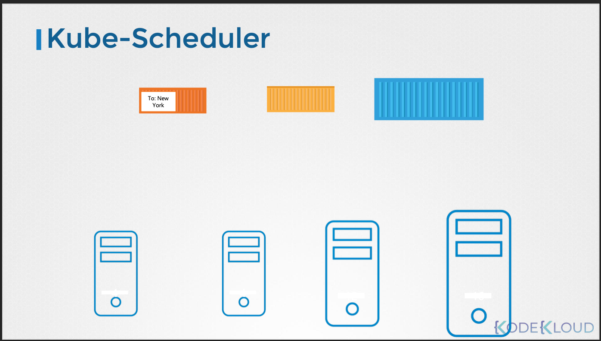

# 주요 구성요소

- 이번 장에서는 **Certified Kubernetes Administrator (CKA)** 을 준비하며 "주요 구성요소"들에 대해서 알아보도록 한다.

---

### ETCD


- ETCD는 쿠버네티스 클러스터의 모든 데이터를 저장하기 위해 사용되는 신뢰할 수 있는 분산 Key-Value 저장소다.

#### Key-Value Store


- 키-값 저장소는 데이터를 "키(Key)"와 "값(Value)"의 쌍으로 저장하는 데이터베이스의 한 형태다. 
- 이는 기존의 관계형 데이터베이스(RDBMS)와는 다른 방식으로 데이터를 관리하며, 다음과 같은 특징을 가진다.


- 키(Key):
  - 데이터를 고유하게 식별하는 역할을 한다.
  - 마치 사전에서 단어와 같은 역할을 하며, 특정 값을 찾기 위한 인덱스 역할을 한다.
  - 일반적으로 문자열을 사용하지만, 다른 데이터 형식을 사용할 수도 있다.
- 값(Value):
  - 실제 데이터 내용을 담고 있다.
  - 단순한 문자열부터 복잡한 JSON, XML 등의 구조화된 데이터까지 다양한 형태를 가질 수 있다.


- 단순성:
  - 데이터 모델이 단순하여 이해하고 사용하기 쉽다.
  - 복잡한 테이블 구조나 관계 설정이 필요하지 않다.
- 높은 성능:
  - 키를 사용하여 데이터를 직접 검색하기 때문에 매우 빠른 읽기/쓰기 성능을 제공한다.
  - 대량의 데이터를 빠르게 처리해야 하는 환경에 적합하다.
- 확장성:
  - 분산 시스템 환경에서 수평 확장이 용이하다.
  - 대규모 데이터 처리 및 트래픽 증가에 유연하게 대응할 수 있다.
- 유연성:
  - 다양한 형태의 데이터를 저장할 수 있어 다양한 애플리케이션 요구사항을 충족할 수 있다.
  - NoSQL 데이터베이스의 한 종류로써 비정형 데이터에 특화되어있다.

#### ETCD in Kubernetes


- etcd 데이터 저장소는 노드, 파드, ConfigMap, Secret, 계정, 역할, 역할 바인딩 등과 같은 클러스터 관련 정보를 저장한다.
- `kubectl get` 명령어를 실행할 때 표시되는 모든 정보는 etcd 서버에서 가져온 것이다.
- 노드 추가, 파드 또는 복제본 세트 배포와 같은 클러스터에 대한 모든 변경 사항은 etcd 서버에서 업데이트된다.
- etcd 서버에서 업데이트된 후에만 변경 사항이 완료된 것으로 간주된다.

#### Installation

- 클러스터 설정 방식에 따라 etcd 배포 방식이 다르다.
  - 처음부터 직접 설정하는 방식
  - kubeadm 도구를 사용하는 방식


- 직접 설정하는 방식
  - etcd 바이너리를 직접 다운로드하여 설치하고 마스터 노드에 서비스로 구성한다.
  - 서비스에 여러 옵션이 전달되며, 그 중 일부는 인증서와 관련된다.
  - 나머지는 etcd를 클러스터로 구성하는 것과 관련된다.
  - `advertised-client-url` 옵션은 etcd가 수신하는 주소이다.
    - 서버의 IP 및 기본 포트인 2379이다.
    - kube API 서버가 etcd 서버에 연결할 때 이 URL을 구성해야 한다.


- kubeadm을 사용하는 방식
  - kubeadm은 kube-system 네임스페이스에 파드로서 etcd 서버를 배포한다.
  - 이 파드 내에서 etcdctl 유틸리티를 사용하여 etcd 데이터베이스를 탐색할 수 있다.
  - 쿠버네티스에 저장된 모든 키를 나열하려면 다음과 같은 `etcdctl get` 명령어를 실행한다.
    - `etcdctl get --prefix /registry/`
  - 쿠버네티스는 특정 디렉토리 구조에 데이터를 저장한다.
    - 루트 디렉토리는 `/registry/` 이며, 그 아래에 미니언 또는 노드, 파드, 복제본 세트, 배포 등과 같은 다양한 쿠버네티스 구성 요소가 있다.


#### HA


- 클러스터에 여러 마스터 노드가 있는 경우 마스터 노드에 여러 etcd 인스턴스가 분산된다.
- 이 경우 etcd 서비스 구성에서 올바른 매개변수를 설정하여 etcd 인스턴스가 서로를 인식하도록 해야 한다.
- `initial-cluster` 옵션은 etcd 서비스의 다른 인스턴스를 지정해야 하는 곳이다.

#### ETCDCTL

- etcdctl 유틸리티는 etcd 데이터베이스와 상호작용하는 데 사용된다.
- ETCDCTL은 버전 2와 버전 3의 두 가지 API 버전을 사용하여 ETCD 서버와 상호 작용할 수 있다. 
- 기본적으로 버전 2를 사용하도록 설정되어 있으며 각 버전마다 명령어 세트가 다르다.
- 예를 들어, ETCDCTL 버전 2는 아래의 명령어를 지원한다.

```bash
etcdctl backup
etcdctl cluster-health
etcdctl mk
etcdctl mkdir
etcdctl set
```

- 버전 3에서는 명령어가 다르다.

```bash
etcdctl snapshot save
etcdctl endpoint health
etcdctl get
etcdctl put
```

- 올바른 API 버전을 설정하려면 환경 변수 `ETCDLCTL_API` 명령을 설정한다.

```bash
export ETCDCTL_API=3
```

- API 버전이 설정되지 않은 경우 버전 2로 설정된 것으로 가정하며, 위에 정리된 버전 3의 명령어는 작동하지 않는다.
- API 버전이 버전 3으로 설정된 경우 위에 정리된 버전 2의 명령어는 작동하지 않는다.

- 그 외에도 ETCDCTL이 ETCD API 서버에 인증할 수 있도록 인증서 파일의 경로를 지정해야 한다.
- 인증서 파일은 아래의 경로의 `etcd-master`에서 사용할 수 있다.

```bash
--cacert /etc/kubernetes/pki/etcd/ca.crt     
--cert /etc/kubernetes/pki/etcd/server.crt     
--key /etc/kubernetes/pki/etcd/server.key
```

- 따라서 명령어가 정상 작동하려면 아래와 같이 ETCDCTL API 버전과 인증서 파일의 경로를 지정해야 한다.

```bash
kubectl exec etcd-master -n kube-system -- sh -c "ETCDCTL_API=3 etcdctl get / --prefix --keys-only --limit=10 --cacert /etc/kubernetes/pki/etcd/ca.crt --cert /etc/kubernetes/pki/etcd/server.crt  --key /etc/kubernetes/pki/etcd/server.key" 
```

---

### kube-apiserver


- `kubectl` 명령은 실제로 kube-apiserver에 요청을 보내는 것이다.
- 요청을 인증 및 검증하고, etcd 클러스터에서 데이터를 검색하여 응답한다.
- `kubectl` 대신 직접 API를 호출하여 요청을 보낼 수도 있다.

#### 파드 생성 과정


1. 요청 인증 및 검증 후, API 서버는 노드에 할당되지 않은 파드 객체를 생성한다.
2. etcd 서버에 정보를 업데이트하고, 사용자에게 파드 생성을 알린다.
3. 스케줄러는 API 서버를 모니터링하여 새 파드를 감지하고, 적절한 노드를 식별하여 API 서버에 알린다.
4. API 서버는 etcd 클러스터에 정보를 업데이트하고, 해당 워커 노드의 kubelet에 정보를 전달한다.
5. kubelet은 노드에 파드를 생성하고, 컨테이너 런타임 엔진에 애플리케이션 이미지 배포를 지시한다.
6. 완료 후 kubelet은 API 서버에 상태를 업데이트하고, API 서버는 etcd 클러스터에 데이터를 업데이트한다.
7. 클러스터의 변경 요청은 이와 유사한 패턴을 따른다.

#### 핵심 기능

- 요청 인증 및 검증
- etcd 데이터 저장소의 데이터 검색 및 업데이트
- etcd 데이터 저장소와 직접 상호 작용하는 유일한 컴포넌트
- 스케줄러, kube-controller-manager, kubelet 등 다른 컴포넌트는 API 서버를 통해 클러스터 업데이트를 수행한다.

#### 설정

- kubeadm을 사용하는 경우, 설정 내용을 알 필요가 없다.
- 직접 설치하는 경우, 쿠버네티스 릴리스 페이지에서 바이너리를 다운로드하고 마스터 노드에 서비스로 구성해야 한다.
- 많은 매개변수가 사용되며, 대부분은 컴포넌트 간 연결 보안을 위한 인증서와 관련된다.
- `--etcd-servers` 옵션은 etcd 서버의 위치를 지정한다.

- **kubeadm을 통한 설치**: `/etc/kubernetes/manifest` 폴더의 파드 정의 파일에서 옵션을 확인할 수 있다.
- **직접 설치**: `/etc/systemd/system/kube-apiserver.service` 서비스 파일을 확인하거나, 마스터 노드에서 실행 중인 프로세스를 검색하여 옵션을 확인할 수 있다.

---

### kube-controller-manager


- Kube Controller Manager는 쿠버네티스 클러스터의 다양한 컨트롤러를 관리하는 핵심 컴포넌트다. 
- 컨트롤러는 쿠버네티스 시스템의 상태를 지속적으로 감시하고, 원하는 상태로 유지하기 위해 필요한 조치를 취하는 프로세스다. 
- 마치 배의 여러 부서가 각자의 역할을 수행하여 배를 안전하게 운항하는 것과 같다.
- 컨트롤러는 쿠버네티스 시스템의 자동화된 관리 기능을 제공한다. 
- 예를 들어, 노드 컨트롤러는 노드의 상태를 감시하여 문제가 발생하면 자동으로 복구 작업을 수행하고, 복제 컨트롤러는 파드의 수를 일정하게 유지하여 애플리케이션의 가용성을 보장한다.

#### Node Controller


- 노드의 상태를 감시하고, 노드가 다운되면 해당 노드의 파드를 다른 노드로 이동시킨다.
- 5초마다 노드의 상태를 확인하고, 40초 동안 응답이 없으면 노드를 'Unreachable' 상태로 표시한다.
- 'Unreachable' 상태가 5분 이상 지속되면 해당 노드의 파드를 다른 노드로 이동시킨다.

#### Replication Controller


- 복제 세트(ReplicaSet)의 파드 수를 원하는 상태로 유지한다.
- 파드가 다운되면 새 파드를 생성하여 복제 세트의 파드 수를 일정하게 유지한다.
- "Node Controller", "Replication Controller" 이외에도 다양한 컨트롤러들이 쿠버네티스 시스템의 다양한 기능을 관리한다.

#### 작동 방식


- Kube Controller Manager는 다양한 컨트롤러를 하나의 프로세스로 실행한다.
- 각 컨트롤러는 쿠버네티스 API 서버를 통해 클러스터의 상태를 감시하고 필요한 조치를 취한다.
- 컨트롤러는 설정 파일에 정의된 규칙에 따라 작동하며, 필요에 따라 사용자 정의 설정을 적용할 수 있다.

#### 설치 및 설정

- 쿠버네티스 릴리스 페이지에서 Kube Controller Manager 바이너리를 다운로드하여 설치할 수 있다.
- `--controllers` 옵션을 사용하여 활성화할 컨트롤러를 선택할 수 있다.
- `--node-monitor-period`, `--node-monitor-grace-period`, `--pod-eviction-timeout` 등의 옵션을 사용하여 컨트롤러의 작동 방식을 사용자 정의할 수 있다.
- kubeadmin을 통해 설치했다면, pod의 manifest파일을 통해 설정을 확인할 수 있으며, 직접 설치했을시, service파일을 통해 설정 값을 확인 할 수 있다.

---

### kube-scheduler


- kube-scheduler는 파드를 어떤 노드에 배치할지 결정하는 역할을 수행한다.
- 실제로 파드를 노드에 배치하는 것은 "kubelet"의 역할이며, scheduler는 배치 "결정만" 담당한다.
- 다수의 노드와 파드가 존재할 때, 적절한 파드를 적절한 노드에 배치해야 한다.
- 노드와 파드의 크기, 리소스 요구사항, 목적지 등이 다를 수 있으므로 최적의 배치가 필요하다.
- 쿠버네티스에서 scheduler는 특정 기준에 따라 파드를 노드에 할당한다.

#### 작동 방식

- scheduler는 각 파드를 검사하여 최적의 노드를 찾는다.
- 최적의 노드를 찾기 위해 두 가지 단계를 거친다.

1. 필터링 (Filtering):
   - 파드의 요구사항을 충족하지 못하는 노드를 필터링한다.
   - 예를 들어, 파드가 요청하는 CPU와 메모리 리소스가 부족한 노드는 필터링된다.
2. 랭킹 (Ranking):
   - 필터링을 통과한 노드들에 대해 우선순위 함수를 사용하여 점수를 매긴다.
   - 예를 들어, 파드를 배치한 후 남는 리소스의 양을 계산하여 점수를 부여할 수 있다.
   - 점수가 높은 노드가 최종적으로 선택된다.




- 예시
  - 파드가 특정 CPU와 메모리 요구사항을 가진다.
  - scheduler는 요구사항을 충족하지 못하는 노드를 필터링한다.
  - 남은 노드들에 대해 남는 리소스 양을 계산하여 점수를 부여한다.
  - 점수가 높은 노드가 파드 배치 대상으로 선택된다.

#### 추가 기능

- scheduler는 사용자 정의가 가능하며, 필요에 따라 자체 scheduler를 작성할 수 있다.
- 리소스 요구사항, 제한, 테인트 및 톨러레이션, 노드 선택기, 어피니티 규칙 등 다양한 기능을 활용하여 세밀한 스케줄링이 가능하다.

#### 설치 및 설정

- 쿠버네티스 릴리스 페이지에서 kube-scheduler 바이너리를 다운로드하여 압축을 풀고 서비스로 실행한다.
- 서비스 실행 시 scheduler 설정 파일을 지정한다.
- kubeadm을 사용하는 경우, kube-scheduler는 kube-system 네임스페이스의 파드로 배포된다.
- 파드 정의 파일(`/etc/kubernetes/manifest/`)에서 scheduler 옵션을 확인할 수 있다.
- 마스터 노드에서 실행 중인 프로세스를 검색하여 scheduler 옵션을 확인할 수도 있다.

---

### kubelet

#### 역할


- kubelet은 쿠버네티스 워커 노드에서 실행되는 에이전트이다.
- 선박의 선장과 같이 노드에서 발생하는 모든 활동을 관리한다.
- 쿠버네티스 클러스터에 노드를 등록하고, 마스터 노드의 지시에 따라 컨테이너를 실행 및 관리한다.
- 정기적으로 노드와 컨테이너의 상태를 마스터 노드에 보고한다.

#### 주요 기능


- **노드 등록**: 워커 노드를 쿠버네티스 클러스터에 등록한다.
- **파드/컨테이너 실행**: 마스터 노드로부터 파드 또는 컨테이너 실행 지시를 받으면 컨테이너 런타임 엔진(Docker 등)에 요청하여 이미지를 다운로드하고 컨테이너를 실행한다.
- **파드/컨테이너 모니터링**: 파드와 컨테이너의 상태를 지속적으로 모니터링하고, 변경 사항을 kube-apiserver에 보고한다.
- **상태 보고**: 노드 및 컨테이너의 상태를 정기적으로 kube-apiserver에 보고한다.

#### 설치

- kubeadm 도구를 사용하여 클러스터를 배포하더라도 kubelet은 자동으로 배포되지 않는다.
- 워커 노드에 kubelet을 수동으로 설치해야 한다.
- 설치 프로그램을 다운로드하고 압축을 해제한 후 서비스로 실행한다.

---

### kube-proxy

#### 역할


- kube-proxy는 쿠버네티스 클러스터 내의 각 노드에서 실행되는 네트워크 프록시이다.
- 파드가 다른 파드에 접근할 수 있도록 네트워크 연결을 관리한다.
- 서비스(Service)를 통해 파드에 접근할 수 있도록 iptables 규칙 또는 IPVS를 설정한다.

#### 파드 간 통신

- 쿠버네티스 클러스터 내의 모든 파드는 서로 통신할 수 있다.
- 이는 클러스터에 파드 네트워크 솔루션을 배포하여 달성된다.
- 파드 네트워크는 클러스터의 모든 노드에 걸쳐 있는 내부 가상 네트워크이며, 모든 파드가 이 네트워크에 연결된다.
- 파드는 파드 네트워크를 통해 서로 통신할 수 있다.
- 파드의 IP는 변경될 수 있으므로 서비스를 통해 파드에 접근하는 것이 권장된다.

#### 서비스 (Service)

- 서비스는 파드를 클러스터 전체에 노출하는 추상화된 방법이다.
- 파드의 IP가 변경되더라도 서비스의 IP는 유지되므로 안정적인 접근을 제공한다.
- 서비스는 실제 컨테이너가 아닌 가상 컴포넌트이며, 쿠버네티스 메모리에만 존재한다.
- 서비스는 파드 네트워크에 참여할 수 없다.

#### 작동 방식

- kube-proxy는 새로운 서비스를 감지하고, 해당 서비스에 대한 트래픽을 백엔드 파드로 전달하는 규칙을 각 노드에 생성한다.
- iptables 규칙을 사용하여 트래픽을 전달하는 것이 일반적인 방법이다.
- 예를 들어, 서비스 IP로 향하는 트래픽을 실제 파드 IP로 전달하는 iptables 규칙을 생성한다.

#### 설치 및 배포

- 쿠버네티스 릴리스 페이지에서 kube-proxy 바이너리를 다운로드하여 서비스로 실행할 수 있다.
- kubeadm 도구를 사용하는 경우, kube-proxy는 각 노드에 데몬셋(DaemonSet) 형태로 파드로 배포된다.
- 데몬셋은 각 노드에 하나의 파드를 항상 배포하도록 보장한다.

---

### 참고한 강의

- [Kubernetes for the Absolute Beginners](https://www.udemy.com/course/learn-kubernetes)
- [Certified Kubernetes Administrator (CKA)](https://www.udemy.com/course/certified-kubernetes-administrator-with-practice-tests)