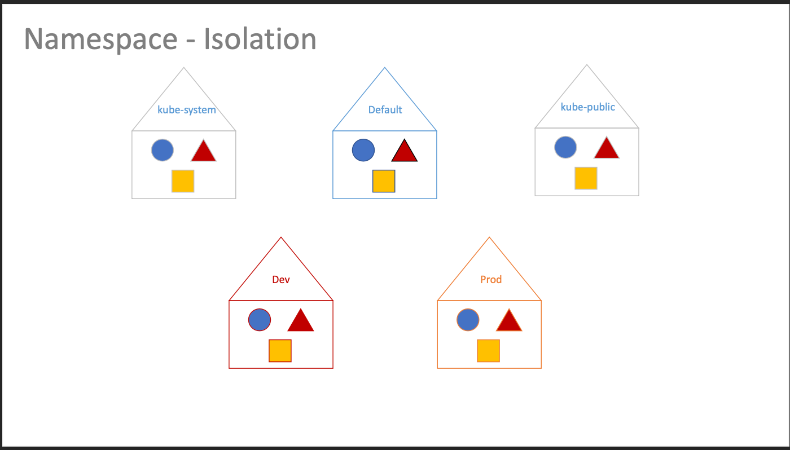
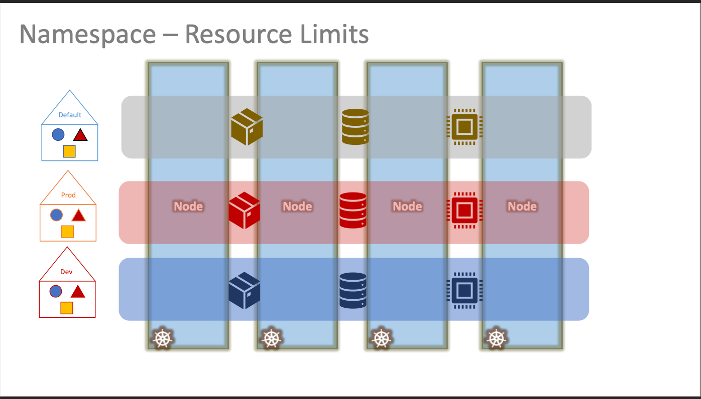
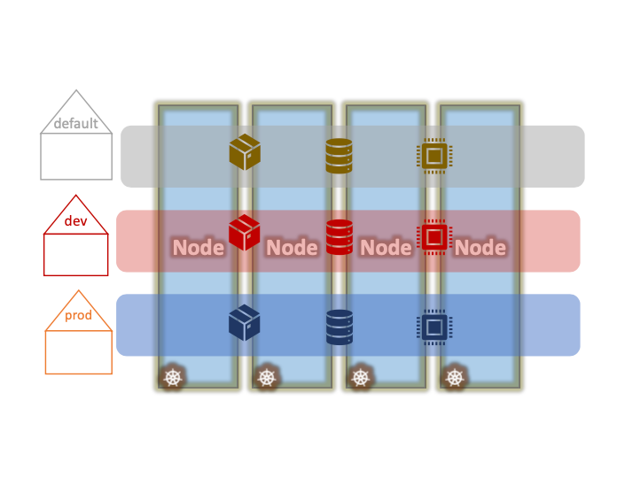

# Namespaces

- 이번 장에서는 **Certified Kubernetes Administrator (CKA)** 을 준비하며 "Namespaces"에 대해서 알아보도록 한다.

---

### Namespaces


- 쿠버네티스 클러스터가 생성되면 자동으로 기본 네임스페이스를 생성한다.
- 내부 목적을 위해 파드와 서비스 세트, 네트워킹 솔리션, DNS 서비스에 요구되는 것들을 설정한다.
- 사용자가 실수로 서비스를 삭제하거나 수정하는 것을 방지하기 위해 클러스터가 시작할 때 `kube-system`이란 이름으로 생성한다.
- `kube-public` 네임스페이스는 모든 사용자가 사용할 수 있어야 할 리소스가 생성되는 곳이다.



- 기업이나 운영 목적으로 쿠버네티스 클러스터를 사용하는 경우 네임스페이스 사용을 고려해야 한다.
- 예를 들어, 개발과 운영 환경에서 같은 클러스터를 사용하고 싶은데 둘 사이의 리소스를 분리한다면 각각의 네임스페이스를 만들어서 운영할 수 있다.
- 개발 환경에서 작업하는 동안에는 운영 환경의 리소스를 실수로 수정할 수 없도록 설정한다.


- 이런 네임스페이스는 각각의 고유한 정책 모음을 할당하여 누가 어떠한 작업을 할 수 있는지 정의할 수 있다.



- 각각의 네임스페이스는 리소스 할당량을 할당할 수도 있다.
- 각 네임스페이스는 일정량을 보장받고 허용된 한도 이상을 사용할 수 없다.


- 같은 네임스페이스의 리소스들은 서로를 단순히 이름으로 참조할 수 있다.
- 이 경우 웹 앱 포트는 단순히 호스트 이름 DB 서비스를 이용해 DB 서비스에 도달할 수 있다.


- 필요하다면 웹 앱 포트는 다른 네임스페이스에서도 서비스에 돨할 수 있다.
  이런 경우 네임스페이스 이름을 서비스의 이름에 추가해야 한다.
- 기본 네임스페이스의 파드에서 개발 환경 네임스페이스의 DB에 연결하려면 서비스 이름을 사용해야 한다.
- 이게 가능한 이유는 서비스가 생성될 때 DNS 항목이 자동으로 이 포맷에 추가되기 때문이다.


#### 운영


- `kubectl get pods`는 모든 파드를 조회하는데 사용되지만 기본 네임스페이스에 있는 파드만 조회된다.
- 다른 네임스페이스에 있는 파드를 조회하려면 네임스페이스 이름을 추가해야 한다.
- 예시에서는 `kubectl get pods --namespace=kube` 명령어를 통해 kube라는 네임스페이스에 있는 파드를 조회한다.

#### 파드 생성

- 파드를 생성하기 위한 정의 파일이 있다고 가정한다.

```yaml title=pod-definition.yaml
apiVersion: v1
kind: Pod
metadata:
  name: myapp-pod
  labels:
    app: myapp
    type: front-end
spec:
  containers:
    - name: nginx-container
      image: nginx
```

- `kubectl create -f pod-definition.yaml` 명령을 통해 파드를 생성하는 경우 기본 네임스페이스에 생성된다.
- `kubectl create -f pod-definition.yaml --namespace=dev` 명령을 통해 dev라는 네임스페이스에 파드를 생성할 수 있다.
- 만약 실행할 때 네임스페이스를 정의하고 싶지 않다면 "pod-definition.yaml" 파일에 `namespace`를 추가할 수 있다.

```yaml title=pod-definition-namespace.yaml
apiVersion: v1
kind: Pod
metadata:
  name: myapp-pod
  namespace: dev
  labels:
    app: myapp
    type: front-end
spec:
  containers:
    - name: nginx-container
      image: nginx
```

#### 네임스페이스 생성

- 네임스페이스를 생성하기 위한 정의 파일이 있다고 가정한다.

```yaml title=namespace-dev.yaml
apiVersion: v1
kind: Namespace
metadata:
  name: dev
```

- `kubectl create -f namespace-dev.yaml` 명령을 통해 dev라는 네임스페이스를 생성할 수 있다.
- 만약 별도의 정의 파일을 생성하고 싶지 않다면 `kubectl create namespace dev` 명령을 통해 dev라는 네임스페이스를 생성할 수 있다.

#### 네임스페이스 변경


- 별도의 설정을 하지 않는 경우 기본 네임스페이스(default)에 있는 리소스만 조회할 수 있다.
  이 경우 컨텍스트가 default로 설정되어 있다고 볼 수 있다.
- 만약 dev 네임스페이스로 컨텍스트를 변경하고 싶다면 `kubectl config set-context $(kubectl config current-context) --namespace=dev` 명령을 사용한다.
- 이렇게 설정되는 경우 기본적으로 dev 네임스페이스에 있는 리소스만 조회할 수 있다.
- 만약 모든 네임스페이스의 파드를 조회하고 싶다면 `kubectl get pods --all-namespaces` 명령을 사용한다.

#### Resource Quota



- 특정 네임스페이스에 리소스의 할당량을 설정할 수 있다.

```yaml title=Compute-quota.yaml
apiVersion: v1
kind: ResourceQuota
metadata:
  name: compute-quota
  namespace: dev
spec:
  hard:
    pods: "10"
    requests.cpu: "4"
    requests.memory: 5Gi
    limits.cpu: "10"
    limits.memory: 10Gi
```

---

### 참고한 강의

- [Kubernetes for the Absolute Beginners](https://www.udemy.com/course/learn-kubernetes)
- [Certified Kubernetes Administrator (CKA)](https://www.udemy.com/course/certified-kubernetes-administrator-with-practice-tests)