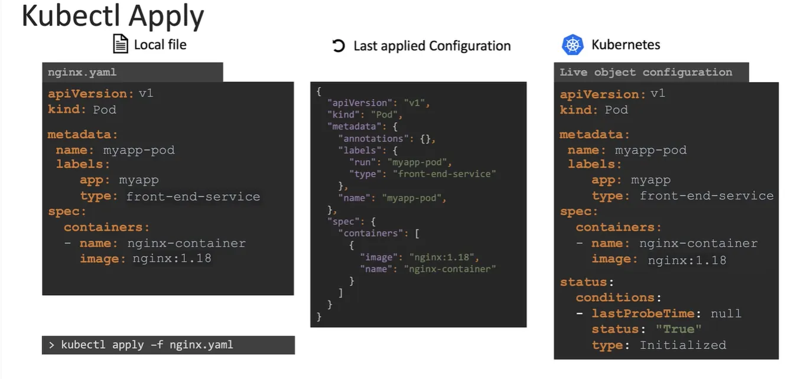

# Imperative vs Declarative

- 이번 장에서는 **Certified Kubernetes Administrator (CKA)** 을 준비하며 "명령적 접근법과 선언적 접근법"에 대해서 알아보도록 한다.

---

### Imperative vs Declarative


- **명령적 접근법(Imperative Approach)**
  - 목적지까지 어떻게 가는지 직접 지시하는 방법이다.
  - 예를 들어, B거리에서 우회전 C거리에서 죄회전해서 D거리에서 우회전하라고 지시하는 방식이다.
- **선언적 접근법(Declarative Approach)**
  - 목적지까지 가는 방법을 지시하는 것이 아니라, 목적지를 지정하고 도착하면 알려달라고 요청하는 방법이다.
  - 예를 들어, A거리로 가라고 지시하는 방식이다.


- 코드로 인프라를 프로비저닝할 때, 무엇을 어떻게 할 것인지 "명령적 접근법" 전부 지정할 수 있다.
- 반면 "선언적 접근법"은 무엇을 할 것인지만 지정하고, 어떻게 할 것인지는 시스템이 알아서 결정하도록 하는 방법이다.
  Ansible, Puppet, Chef, Terraform 등이 이러한 방식을 사용한다.


- 명령적(Imperative) 방식은 쿠버네티스 객체를 관리하는데 필수적인 접근법이다.
  - 객체를 생성, 업데이트, 삭제함으로써 인프라를 요구에 정확히 어떻게 적용할지 지정할 수 있다.
- 선언적(Declarative) 방식은 쿠버네티스 객체를 관리하는데 더 많이 사용되는 접근법이다.
  - 클러스터에서 애플리케이션과 서비스의 예상 상태를 정의하는 파일 집합을 만든다.
  - `kubectl apply` 명령으로 쿠버네티스틑 인프라를 예상 상태로 가져오려면 무엇이 필요한지 구성파일을 읽고 스스로 결정할 수 있다.
  - 선언적 접근에서 kubectl을 실행해 객체를 생성, 업데이트, 삭제하는 명령ㅇ르 적용한다.
  - apply 명령은 기존 구성을 확인하고 시스템에 어떤 변화가 필요한지 확인하고 반영한다.

#### Imperative


- 명령적 접근에는 두 가지 방식이 있다.
- 새로운 객체를 생성하거나 노출하거나 기존 객체를 업데이트, 편집, 스케일하는 명령어를 직접 입력하는 방식이다.
- 이러한 명령들은 yaml 파일을 사용하지 않기 때문에 객체의 생성과 수정을 신속하게 돕는다.
- 하지만 다중 컨테이너 파드의 배포와 같이 복잡한 구성을 만들기 위해서 명령어가 길어지는 불편함이 있다.
- 또한 한번 실행한 명령어를 재사용할 수 없기 떄문에, 해당 객체가 어떻게 만들어졌는지 알아내기 어렵다.


- 불편함을 개선하기 위해여 매니페스트 파일이라고도 불리는 객체 정의 파일을 사용할 수 있다.
- 이렇게 정의된 yaml 파일은 git과 같은 코드 저장소에 저장하고, 필요할 때마다 재사용할 수 있다.


- 특정 객체를 수정할 때, edit 명령을 사용하고 쿠버네티스 메모리 상의 설정을 할 수 있다.
- 하지만 이런 방식으로 수정하는 경우 객체를 생성할 때 사용한 yaml 파일에는 수정사항이 반영되지 않으므로 많은 엔지니어들이 있는 경우에 권장되지 않는 방식이다.
- 이러한 이유로 대부분의 엔지니어들은 yaml 파일을 사용하여 객체를 생성하고 수정하는 방식을 선호한다.
- replace 명령어를 통해 파일의 수정된 부분을 적용할 수 있고, 재실행이 필요한 경우 `--force` 옵션을 사용할 수 있다.

#### Declarative


- 선언적 접근 방법은 우리가 작업해온 동일한 객체 구성 파일을 사용하는 것이다.
- 객체를 직접 생성하는 대신 객체를 관리하기 위해 `kubectl apply` 명령을 사용한다.
- `kubectl apply` 명령은 이미 존재하지 않는 객체를 만들만큼 영리하게 작동한다.
- 적용해야 하는 파일이 여러개인 경우 단일 파일 대신 디렉토리를 경로로 지정할 수 있다.

#### 시험 Tips


- 명령적 접근을 사용하여 최대한 시간을 절약할 수 있다.
- 이미 존재하는 객체의 속성을 수정해야 한다면 `kubectl edit` 명령을 사용하는 것이 가장 빠르다.
- 만약 다중 컨테이너, 환경 변수 명령, init 컨테이너 등을 사용해야 한다면 yaml 파일을 사용하는 것이 가장 효율적이다.
- 이런 식으로 실수를 하면 파일을 쉽게 업데이트해서 다시 적용할 수 있다.

#### 쿠버네티스 명령형 명령어 정리 및 활용법

- 쿠버네티스에서 주로 선언적 방식(정의 파일 사용)으로 작업하지만, 명령형 명령어는 일회성 작업이나 정의 템플릿 생성을 빠르게 처리하는 데 유용하다.

- 주요 옵션:
  - `--dry-run=client`: 명령을 실행해도 리소스가 생성되지 않고, 명령의 유효성만 검사한다
  - `-o yaml`: 리소스 정의를 YAML 형식으로 화면에 출력한다.
  - 이 두 옵션을 조합하여 리소스 정의 파일을 빠르게 생성하고, 필요한 대로 수정하여 리소스를 생성할 수 있다.

- 파드(Pod)
- NGINX 파드 생성:

```bash
kubectl run nginx --image=nginx
```

- 파드 매니페스트 YAML 파일 생성 (실제 생성은 안 함):

```bash
kubectl run nginx --image=nginx --dry-run=client -o yaml
```

- 배포(Deployment)
- 배포 생성:

```bash
kubectl create deployment --image=nginx nginx
```

배포 매니페스트 YAML 파일 생성 (실제 생성은 안 함):

```bash
kubectl create deployment --image=nginx nginx --dry-run=client -o yaml
```

- 4개의 레플리카를 가진 배포 생성:

```bash
kubectl create deployment nginx --image=nginx --replicas=4
```

- 배포 스케일링:

```bash
kubectl scale deployment nginx --replicas=4
```

- YAML 파일로 배포 생성 및 수정:

```bash
kubectl create deployment nginx --image=nginx --dry-run=client -o yaml > nginx-deployment.yaml
```

- 생성된 YAML 파일을 수정하여 레플리카 수 또는 다른 필드를 변경한 후 배포를 생성한다.

- 서비스(Service)

- redis 파드를 6379 포트로 노출하는 ClusterIP 타입의 redis-service 서비스 생성 (파드의 레이블을 셀렉터로 자동 사용):

```bash
kubectl expose pod redis --port=6379 --name redis-service --dry-run=client -o yaml
```

- redis 파드를 6379 포트로 노출하는 ClusterIP 타입의 redis 서비스 생성 (셀렉터는 app=redis로 가정):

```bash
kubectl create service clusterip redis --tcp=6379:6379 --dry-run=client -o yaml
```

(이 명령어는 파드의 레이블을 사용하지 않으므로, 파드의 레이블이 다른 경우 YAML 파일을 수정해야 한다)

- nginx 파드의 80 포트를 노드 30080 포트로 노출하는 NodePort 타입의 nginx-service 서비스 생성 (파드의 레이블을 셀렉터로 자동 사용):

```bash
kubectl expose pod nginx --type=NodePort --port=80 --name=nginx-service --dry-run=client -o yaml
```

- (이 명령어는 노드 포트를 지정할 수 없으므로, YAML 파일을 수정해야 한다)

- nginx 파드의 80 포트를 노드 30080 포트로 노출하는 NodePort 타입의 nginx 서비스 생성 (파드의 레이블을 사용하지 않음):

```bash
kubectl create service nodeport nginx --tcp=80:80 --node-port=30080 --dry-run=client -o yaml
```

(이 명령어는 파드의 레이블을 사용하지 않으므로, YAML 파일을 수정해야 한다)

- 서비스 생성 시 권장 사항:
  - `kubectl expose` 명령어를 사용하는 것이 좋다.
  - 노드 포트를 지정해야 하는 경우, kubectl expose 명령어로 정의 파일을 생성하고 수동으로 노드 포트를 입력한다.

- 요약하면 명령형 명령어는 빠른 작업에 유용하며, `--dry-run` 및 `-o yaml` 옵션을 활용하여 정의 파일을 쉽게 생성하고 수정할 수 있다. 
- 서비스 생성 시에는 `kubectl expose` 명령어를 사용하는 것이 권장된다.

---

### kubectl apply

- `kubectl apply`는 "local configuration file", "live object definition on Kubernetes", "last applied configuration" 파일을 고려하여 어떤 변경을 해야 할지 결정한다.

```bash title=nginx.yaml
apiVersion: v1
kind: Pod
metadata:
   name: myapp-pod
   labels:
      app: myapp
      type : front-end-service
spec:
   containers:
   - name: nginx-conatiner
     image: nginx:1.18
```

- `kubectl apply -f nginx.yaml` 명령을 실행하면 객체가 아직 존제하지 않으면 객체가 생성된다.
- 객체가 생성되면 로컬에서 생성한 것과 유사한 "live object definition"도 생성되지만 객체 상태를 저장하기 위한 추가 필드가 포함된다.

```bash title=live-nginx-configuration 
apiVersion: v1
kind: Pod
metadata:
   name: myapp-pod
   labels:
      app: myapp
      type : front-end-service
spec:
   containers:
   - name: nginx-conatiner
     image: nginx:1.18
status:
  conditions:
  - lastProbeTime: null
    status: "True"
    type: Initialized
```

- 이 방식은 쿠버네티스가 객체를 생성하는 데 사용된 방법에 관계없이 객체에 대한 정보를 보관하는 방법이다.
- 그러나 객체 생성을 위해 `kubectl apply` 명령을 사용하면 추가로 하나의 단계가 도입된다.
- "local object configuration" 파일의 yaml 표현식을 json 형식으로 변환하고 "last applied configuration"으로 사용한다.

```json title=last-applied-configuration
{
  "apiVersion": "v1",
  "kind": "Pod",
  "metadata": {
    "name": "myapp-pod",
    "labels": {
      "app": "myapp",
      "type": "front-end-service"
    }
  },
  "spec": {
    "containers": [
      {
        "name": "nginx-conatiner",
        "image": "nginx:1.18"
      }
    ]
  }
}
```



- 이후 객체를 업데이트하려면 "local object configuration", "last applied configuration", "live object configuration" 세 가지 구성을 비교하여 쿠버네티스의 라이브 객체에 필요한 조정 사항을 결정해야 한다.
- 예를 들어, 로컬 파일에서 nginx 이미지가 버전 1.19로 업그레이드 되었다고 가정한다.
- `kubectl apply` 명령을 실행하면 이 업데이트된 값이 라이브 구성의 해당 값과 비교되고 차이가 있는 경우 라이브 구성이 수정되어 새 값을 반영한다.
- 이후 변경 사항이 있을 때마다 마지막으로 적용된 json 형식이 지속적으로 업데이트되어 항상 최신 상태를 유지한다.


- 예를 들어, 필드가 삭제되었고 유형 레이블이 삭제되었다고 가정한다.
- `kubectl apply` 명령을 실행하면 마지막으로 적용된 구성에는 레이블이 있지만 로컬 구성에는 없는 것을 확인할 수 있다.
- 즉, 해당 필드를 라이브 구성에서 제거해야 함을 의미한다.


- 필드가 라이브 구성에는 존재하지만 로컬 구성과 마지막으로 적용된 구성에는 모두 없는 경우 해당 필드는 변경되지 않는다.
- 그러나 로컬 구성에서 필드가 누락되었지만 마지막으로 적용된 구성에는 존재하는 경우 이 필드는 이전 구성에 있었지만 이번에 제거되었음을 의미한다.
- 이러한 경우 마지막으로 적용된 구성은 귀중한 참조 역할을 하여 로컬 파일에서 제거된 필드를 식별하는 데 도움이 된다.
- 결과적으로 해당 필드는 업데이트된 Spec과의 일관성을 유지하기 위해 라이브 구성에서 제거된다.


- 적용된 구성을 포함하는 json 파일은 쿠버네티스 클러스터 자체의 라이브 객체 구성 내에 저장된다.
- 이는 "last applied configuration"이라는 특정 이름의 주석으로 저장된다.
- 이 주석은 객체에 적용된 가장 최근의 구성을 추적하기 위한 참조 지점 역할을 한다.
- 이 정보를 쿠버네티스 클러스터의 라이브 객체 구성 내에 보관함으로써 시스템은 필요에 따라 구성을 효율적으로 비교하고 업데이트하여 객체 상태를 관리하는 데 있어 일관성과 정확성을 보장할 수 있다.

```yaml
apiVersion: v1
kind: Pod
metadata:
   name: myapp-pod
   annotations:
   kubectl.kubernetes.io/last-applied-configuration:
   {"apiVersion": "v1","kind": "Pod","metadata": {"name": "myapp-pod", "labels": {"app": "my-app","type": "front-end-service"}},"spec": {"containers": [{"name": "nginx-container","image": "nginx:1.18"}]}}
labels:
      app: myapp
      type : front-end-service
spec:
   containers:
   - name: nginx-container
     image: nginx:1.18
status:
  conditions:
  - lastProbeTime: null
    status: "True"
    type: Initialized
```

- 적용된 구성을 주석으로 저장하는 메커니즘은 `kubectl apply` 명령에 따라 다르다.
- `kubectl apply`를 사용하면 라이브 객체 구성을 생성하거나 업데이트할 뿐만 아니라 마지막으로 적용된 구성의 레코드를 주석으로 저장한다.
- 이 주석은 변경 사항을 추적하고 후속 업데이트에 대한 비교 프로세스를 용이하게 하는 데 도움이 된다.
- 반면, `kubectl create` 또는 `kubectl replace` 명령은 이러한 기능들을 통합하지 않는다.
- 이들은 주석 형태로 마지막으로 적용된 구성을 보존하지 않고 객체를 직접 생성하거나 대체하는 데 중점을 둔다.
- 따라서 객체를 관리하기 위해  `kubectl apply`을 사용하는 경우 나중에 참조할 수 있도록 마지막으로 적용된 구성을 추적하고 저장하는 추가 기능의 이점을 누릴 수 있다.
  


- 더 자세한 내용은 [쿠버네티스 공식문서](https://kubernetes.io/docs/tasks/manage-kubernetes-objects/declarative-config/)를 참고한다.

---

### 참고한 강의

- [Kubernetes for the Absolute Beginners](https://www.udemy.com/course/learn-kubernetes)
- [Certified Kubernetes Administrator (CKA)](https://www.udemy.com/course/certified-kubernetes-administrator-with-practice-tests)