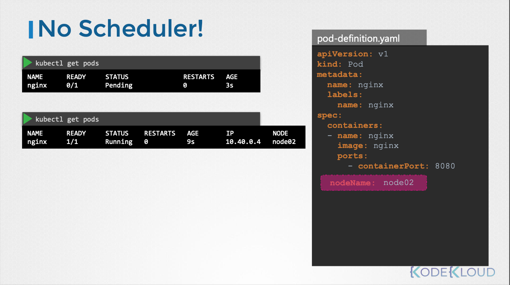
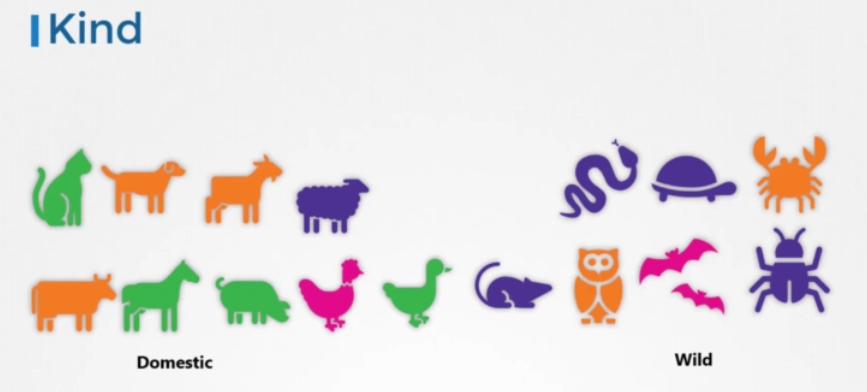
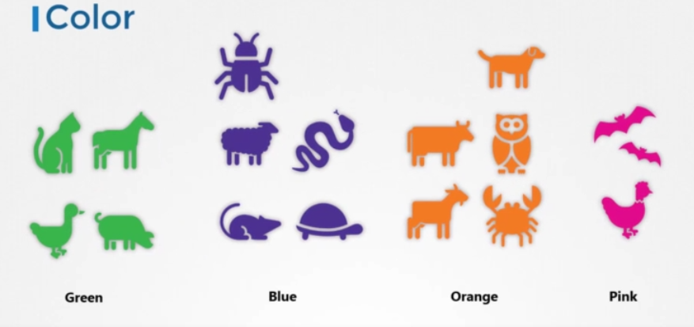
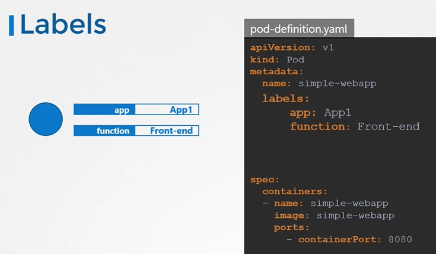

# Scheduling (Taint & Toleration)

- 이번 장에서는 **Certified Kubernetes Administrator (CKA)** 을 준비하며 "Scheduling과 Taint & Toleration"에 대해서 알아보도록 한다.

---

### Manual Scheduling


- 쿠버네티스 스케줄러의 작동 방식:
  - Pod의 `nodeName` 필드를 확인하여 아직 노드에 할당되지 않은 Pod를 찾는다.
  - 스케줄링 알고리즘을 실행하여 적절한 노드를 선택한다.
  - 선택된 노드의 이름을 `nodeName` 필드에 설정하고, 바인딩(binding) 객체를 생성하여 Pod를 노드에 할당한다.



- 스케줄러가 없을 때 발생하는 문제:
  - 스케줄러가 없으면 Pod는 `Pending` 상태로 남아있게 된다.
  - 자동으로 노드에 할당되지 않으므로 수동으로 스케줄링해야 한다.


#### 수동 스케줄링 방법

- Pod 생성 시 `nodeName` 필드 설정:
  - Pod 정의 YAML 파일에서 `nodeName` 필드를 원하는 노드 이름으로 설정한다.
  - `kubectl apply -f <pod-definition.yaml>` 명령어를 사용하여 Pod를 생성하면 지정된 노드에 할당된다.
  - 주의: `nodeName`은 Pod 생성 시에만 설정할 수 있으므로 이미 생성된 Pod의 `nodeName`을 수정할 수는 없다.
- 바인딩(binding) 객체 생성 및 API 요청:
  - 이미 생성된 Pod를 특정 노드에 할당하려면 바인딩 객체를 생성해야 한다.
  - 바인딩 객체는 JSON 형식으로 작성하며, `target` 필드에 노드 이름을 지정한다.
  - `kubectl proxy` 명령어를 실행하여 쿠버네티스 API 서버에 접근할 수 있도록 프록시를 설정한다.
  - `POST` 요청을 Pod의 바인딩 API 엔드포인트에 전송하고, 데이터는 바인딩 객체 JSON을 사용한다.
  - 이 방법은 스케줄러가 실제로 수행하는 것과 동일한 작업을 수행한다.

#### convert YAML to JSON

- 바인딩 객체를 API에 전달하기 위해 YAML 형식을 JSON 형식으로 변환해야 한다.
- `kubectl get pod <pod-name> -o json` 명령어를 사용하여 Pod의 JSON 표현을 얻고, 필요한 부분(바인딩 객체)만 수정하여 사용할 수 있다.

---

### Labels and Selectors

#### 개념

- 레이블(Label):
  - 쿠버네티스 오브젝트에 부착되는 키-값 쌍의 메타데이터다.
  - 레이블은 오브젝트를 식별하고 그룹화하는 데 사용된다.
  - 레이블은 오브젝트의 특성을 설명하며, 필요에 따라 추가하거나 제거할 수 있다.
  - 예: `app: my-app`, `environment: production`







- 셀렉터(Selector):
  - 레이블을 사용하여 오브젝트를 선택하는 방법이다.
  - 셀렉터는 레이블 쿼리를 사용하여 특정 레이블을 가진 오브젝트를 선택한다.
  - 셀렉터를 사용하면 레이블을 기반으로 오브젝트를 그룹화하고 관리할 수 있다.
  - 예: `app-my-app`, `environment in (production, staging)`


#### 활용


- 쿠버네티스 클러스터에는 Pod, Service, ReplicaSet, Deployment 등 다양한 객체가 존재한다.
- Label과 Selector를 사용하여 이러한 객체를 애플리케이션, 기능, 환경 등 다양한 기준으로 그룹화하고 선택할 수 있다.
- `kubectl get pods -l app=my-app` 명령어를 사용하여 `app: my-app` 레이블을 가진 Pod를 선택할 수 있다.



- Pod 정의 YAML 파일의 `metadata` 섹션 아래 `labels` 섹션을 추가하여 Label을 설정한다.
- Label은 키-값 쌍으로 정의하며, 여러 개의 Label을 추가할 수 있다.

#### ReplicaSet


- ReplicaSet은 Selector를 사용하여 Pod를 찾고 관리한다.
- ReplicaSet 정의 파일의 `spec.selector.matchLabels` 섹션에 Pod의 Label과 일치하는 Selector를 설정한다.
- ReplicaSet의 `template.metadata.labels` 부분은 Pod에 부여되는 레이블이며, ReplicaSet 자체의 레이블은 ReplicaSet 정의 파일의 `metadata.lebels` 부분에 설정한다.
- Selector는 여러 개의 Label 조건을 사용하여 Pod를 정확하게 선택할 수 있다.

#### Service


- Service는 Selector를 사용하여 특정 Pod를 선택하고 노출한다.

#### Annotation

```yaml title=replicaset-definition.yaml
apiVersion: apps/v1
kind: ReplicaSet
metadata:
  name: simple-webapp
  labels:
    app: App1
    function: Front-end
   annotations:
    buildVersion: 1.34
spec:
  replicase: 3
  selector:
    matchLabels:
      app: App1
  template:
    metadata:
      labels:
        app: App1
        function: Front-end
    spec:
      containers:
        - name: simple-webapp
          image: simple-webapp
```

- Lable과 Selector는 객체를 그룹화하고 선택하는 데 사용되는 반면, Annotation은 객체애 대한 추가 정보를 기록하는데 사용된다.
- Annotation은 도구 정보(이름, 버전, 빌드 정보), 연락처 정보 등 다양한 정보를 저장할 수 있다.
- Annotation은 주로 통합 목적이나 정보 제공 목적으로 사용된다.

---

### Taint and Toleration


- Taint: 노드에 적용되는 "반발력"으로, 특정 Pod가 해당 노드에 배치되는 것을 방지한다. (예: 특정 하드웨어 리소스가 필요한 노드에 일반 Pod가 배치되는 것을 방지)
- Toleration: Pod에 적용되는 "허용력"으로, 특정 Taint를 가진 노드에 배치될 수 있도록 허용한다. (예: 특정 하드웨어 리소스를 필요로 하는 Pod가 해당 노드에 배치되도록 허용)
- 비유: 노드(사람)에 뿌려진 방충제(Taint)는 일반 벌레(Pod)를 쫓아내지만, 특정 벌레(Pod)는 방충제에 대한 내성(Toleration)을 가지고 있어 노드에 앉을 수 있다.
- Taint와 Toleration은 보안이나 침입 방지와는 관련이 없으며, Pod 스케줄링을 제어하기 위한 메커니즘이다.

#### 사용 사례

- 특정 하드웨어 리소스(GPU, SSD 등)가 필요한 애플리케이션을 위한 전용 노드 설정
- 특정 애플리케이션을 위한 전용 노드 설정
- 테스트 환경이나 개발 환경을 위한 전용 노드 설정

#### 작동 방식

- 노드에 Taint를 적용하면, 해당 Taint에 Toleration을 가진 Pod만 해당 노드에 배치될 수 있다.
- Pod에 Toleration을 적용하면, 해당 Toleration과 일치하는 Taint를 가진 노드에 배치될 수 있다.
- 스케줄러는 Pod를 노드에 배치할 때 Taint와 Toleration을 고려한다.
- Taint를 가진 노드에 Toleration이 없는 Pod를 배치하려고 하면 스케줄러는 해당 Pod를 다른 노드에 배치한다.
- Taint는 노드에 설정하고, Toleration은 Pod에 설정한다.

#### 얘시


- 3개의 워커 노드(node1, node2, node3)와 4개의 Pod(Pod A, Pod B, Pod C, Pod D)가 있는 클러스터가 있다.
- node1에 "blue"라는 Taint를 적용한다.
- Pod D에 "blue" Taint에 대한 Toleration을 설정한다.
- 결과: Pod A, Pod B, Pod C는 node1에 배치될 수 없으며, Pod D만 node1에 배치될 수 있다.

#### Taint nodes


- `kubectl taint nodes <노드 이름> <키=값:효과>` 형식을 사용하여 노드에 Taint를 적용한다.
- `<노드 이름>`: Taint를 적용할 노드의 이름이다.
- `<키=값>`: Taint의 키-값 쌍이다. (예: `app=blue`)
- `<효과>`: Taint의 효과로, `NoSchedule`, `PreferNoSchedule`, `NoExecute` 중 하나를 선택한다.
  - NoSchedule: Pod가 해당 노드에 스케줄링되지 않는다. (가장 일반적인 효과)
  - PreferNoSchedule: Pod가 해당 노드에 스케줄링되는 것을 최대한 피하지만, 보장되지 않는다. (선호도 기반)
  - NoExecute: 새로운 Pod는 해당 노드에 스케줄링되지 않으며, 이미 실행 중인 Pod는 Toleration이 없으면 축출된다. (강력한 효과)
- `kubectl taint nodes node1 app=blue:NoSchedule`: node1 노드에 `app=blue` Taint를 NoSchedule 효과로 적용한다.

#### Toleration pods


- Pod 정의 YAML 파일의 `spec` 섹션에 `tolerations` 섹션을 추가한다.
- `tolerations` 섹션 아래에 Taint와 일치하는 Toleration을 정의한다.
- Toleration은 다음 필드를 포함한다.
  - `key`: Taint의 키와 일치해야 한다.
  - `operator`: `Equal` 또는 `Exists`를 사용할 수 있다. `Equals`는 값도 일치해야 하고, `Exists`는 키만 존재하면 된다.
  - `value`: Taint의 값과 일치해야 한다. (operator가 `Equal`일 경우)
  - `effect`: Taint의 효과와 일치해야 한다.

```yaml
spec:
  tolerations:
    - key: "app"
      operator: "Equal"
      value: "blue"
      effect: "NoSchedule"
```

- 이 Toleration은 `app=blue:NoSchedule` Taint를 허용한다.
- 노드에 Taint가 적용되면, Toleration이 없는 Pod는 해당 노드에 스케줄링되지 않거나 축출된다.
- Pod에 Toleration이 설정되면, 해당 Toleration과 일치하는 Taint를 가진 노드에 스케줄링될 수 있다.
- Pod를 생성하고나 업데이트할 때 Toleration이 적용된다.

#### No Execute


- `NoExecute` 효과는 새로운 Pod가 해당 노드에 스케줄링되는 것을 막을 뿐만 아니라, 이미 실행 중인 Pod를 축출(evict)한다.
- 축출은 Pod가 강제로 종료되는 것을 의미한다.
- Pod가 축출되지 않으려면 해당 Taint에 대한 Toleration을 가지고 있어야 한다.


- 3개의 노드 (node1, node2, node3)에 Pod들이 실행 중이다.
- node1에 `app=blue:NoExecute` Taint를 적용한다.
- `app=blue` Toleration을 가진 Pod D는 node1에서 계속 실행된다.
- `app=blue` Toleration이 없는 Pod C는 node1에서 축출된다.

#### 제한 사항

- Taint와 Toleration은 노드가 특정 Pod를 수용하는 것을 제한하는 역할만 한다.
- 특정 Pod가 특정 노드에 항상 배치되는 것을 보장하지는 않는다.
- Pod를 특정 노드에 제한하려면 Node Affinity를 사용해야 한다.

#### 마스터 노드 Taint


- 쿠버네티스는 클러스터 설정 시 마스터 노드에는 자동으로 Taint가 설정된다.
- 이 Taint는 Pod가 마스터 노드에서 스케줄링되는 것을 막는다.
- `kubectl describe node <마스터 노드 이름>` 명령어를 사용하여 마스터 노드 Taint를 확인할 수 있다.
- 마스터 노드에 애프릴케이션 워크로드를 배포하는 것은 권장되지 않는다.
- 마스터 노드 Taint는 필요에 따라 수정할 수 있지만, 일반적으로 유지하는 것이 좋다.

#### 핵심 개념

- Taint는 노드에 적용되어 특정 Pod의 배치를 제한한다.
- Toleration은 Pod에 적용되어 특정 Taint를 가진 노드에 배치될 수 있도록 허용한다.
- `NoExecute` 효과는 실행 중인 Pod를 축출하는 강력한 효과를 제공한다.
- 마스터 노드 Taint는 클러스터의 안정성을 위해 자동으로 설정된다.

---

### 참고한 강의

- [Kubernetes for the Absolute Beginners](https://www.udemy.com/course/learn-kubernetes)
- [Certified Kubernetes Administrator (CKA)](https://www.udemy.com/course/certified-kubernetes-administrator-with-practice-tests)