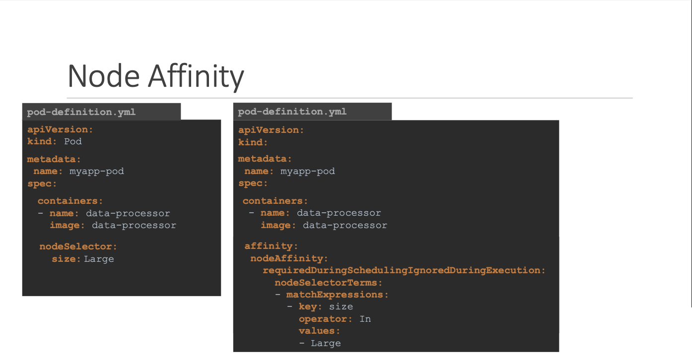

# Scheduling (Selector & Affinity)

- 이번 장에서는 **Certified Kubernetes Administrator (CKA)** 을 준비하며 "Scheduling의 Selector와 Affinity"에 대해서 알아보도록 한다.

---

### Node Selector

- 클러스터 내에 다양한 하드웨어 리소스를 가진 노드가 존재할 수 있다.
- 특정 워크로드(예: 데이터 처리)는 고성능 노드에서 실행되어야 한다.
- Node Selector를 사용하여 Pod를 특정 레이블을 가진 노드에 배치할 수 있다.


- 3개의 노드(node1, node2, node3)가 있는 클러스터가 있다.
- node1은 고성능 노드이고, node2와 node3은 저성능 노드다.
- node1에 `size=large` 레이블을 추가한다.
- 데이터 처리 Pod 정의 파일에 `nodeSelector: {size: large}`를 추가한다.
- 결과적으로 데이터 처리 Pod는 node1에만 배치된다.

#### 작동 방식


- Pod 정의 파일의 `spec-nodeSelector` 필드에 노드 레이블을 지정한다.
- 스케줄러는 Pod를 생성할 때 `nodeSelector`에 지정된 레이블과 일치하는 노드를 찾는다.
- 일치하는 노드가 있으면 Pod를 해당 노드에 배치한다.
- 일치하는 노드가 없으면 Pod는 `Pending` 상태로 유지된다.

#### Label Nodes


- `kubectl label nodes <노드 이름> <키=값>` 명령어를 사용하여 노드에 레이블을 추가한다.
- 예시: `kubectl label nodes node1 size=large`
- 레이블은 키-값 쌍으로 구성된다.


- Pod 정의 파일의 `spec` 섹션에 `nodeSelector` 필드를 추가한다.
- `nodeSelector` 필드에는 키-값 쌍으로 노드 레이블을 지정한다.
- 예시:

```yaml
spec:
  nodeSelector:
    size: large
```


#### 제한 사항


- Node Selector는 단일 레이블 조건만 사용할 수 있다.
- "OR" 또는 "NOT"과 같은 복잡한 조건은 사용할 수 없다.
- 복잡한 조건이 필요한 경우 Node Affinity 및 Anti-Affinity를 사용해야 한다.

---

### Node Affinity


- Node Selector는 단일 레이블 조건만 지원하며, 복잡한 조건은 사용할 수 없다.
- Node Affinity는 "OR", "NOT", "IN", "EXISTS" 등 다양한 연산자를 사용하여 복잡한 조건으로 Pod를 특정 노드에 배치할 수 있다.


#### 구조



- Pod 정의 파일의 `spec.affinity.nodeAffinity` 섹션에 Node Affinity 규칙을 정의한다.
- `requiredDuringSchedulingIgnoredDuringExecution` 또는 `preferredDuringSchedulingIgnoredDuringExecution`을 사용하여 Node Affinity의 유형을 지정한다.
- `nodeSelectorTerms` 배열에 레이블 조건(키, 연산자, 값)을 정의한다.

#### 연산자


- In: 레이블 값이 지정된 값 목록에 포함되는 노드를 선택한다. (예: `size in (large, medium)`)
- NotIn: 레이블 값이 지정된 값 목록에 포함되지 않는 노드를 선택한다. (예: `size notin (small)`)
- Exists: 레이블 키가 존재하는 노드를 선택한다. (예: `size exists`)

#### 유형


- `reuiqredDuringSchedulingIgnoredDuringExecution`:
  - 스케줄링: 규칙을 반드시 만족하는 노드에만 Pod를 배치한다. 만족하는 노드가 없으면 Pod는 `Pending` 상태로 유지된다.
  - 실행: 실행 중인 Pod는 노드 레이블 변경에 영향을 받지 않는다. (이미 배치된 Pod는 유지)
  - 사용 사례: Pod 배치가 중요한 경우 (예: 특정 하드웨어 리소스 필요)
- `preferredDuringSchedulingIgnoredDuringExecution`:
  - 스케줄링: 규칙을 최대한 만족하려고 시도하지만, 만족하는 노드가 없더라도 다른 노드에 Pod를 배치할 수 있다.
  - 실행: 실행 중인 Pod는 노드 레이블 변경에 영향을 받지 않는다. (이미 배치된 Pod는 유지)
  - 사용 사례: Pod 실행이 중요하지만 특정 노드 배치를 선호하는 경우
- `requiredDuringSchedulingRequiredDuringExecution`:
  - 스케줄링: 규칙을 반드시 만족하는 노드에만 Pod를 배치한다. 만족하는 노드가 없으면 Pod는 `Pending` 상태로 유지된다.
  - 실행: 실행 중인 Pod도 규칙을 만족하지 않으면 축출된다.
  - 사용 사례: Pod 배치가 매우 중요한 경우 (예: 보안, 규정 준수)


- `requiredDUringSchedulingIgnoredDuringExecution`을 사용하는 Pod가 `size=large` 레이블을 가진 노드에 배치된다.
- 관리자가 노드에서 `size=large` 레이블을 제거한다.
- 결과적으로 Pod는 계속 실행된다.
- `requiredDuringSchedulingRequiredDuringExecution`이 적용된다면, Pod는 축출된다.

---

### Node Affinity vs Taint & Toleration


- 3개의 노드(파란색, 빨간색, 초록색)와 3개의 Pod(파란색, 빨간색, 초록색)가 있다.
- 각 Pod를 해당 색상의 노드에 배치하고, 다른 Pod들이 해당 노드에 배치되는 것을 방지해야 한다.
- 클러스터는 다른 팀과 공유되고 있으며, 다른 Pod와 노드도 존재한다.

#### Taint/Toleration을 사용한 해결 방법


- 각 노드에 색상에 맞는 Taint를 적용한다. (예: 파란색 노드에 `color=blue:NoSchedule`)
- 각 Pod에 해당 색상의 Taint를 허용하는 Toleration을 설정한다. (예: 파란색 Pod에 `tolerations: [{key: "color", operator: "Equal", value: "blue"}]`)
- 결과적으로 각 Pod는 해당 색상의 노드에 배치되지만, 다른 Pod가 해당 노드에 배치되는 것을 완전히 막을 수는 없다.
- 또한, Pod가 특정 노드에만 배치되는 것을 보장하지 않으며 빨간색 Pod는 다른 노드에 배치될 수 있다.

#### Node Affinity를 사용한 해결 방법


- 각 노드에 색상에 맞는 레이블을 추가한다. (예: 파란색 노드에 `color=blue`)
- 각 Pod에 해당 색상의 레이블을 선택하는 Node Affinity 규칙을 설정한다. (예: 파란색 Pod에 `nodeAffinity: {requiredDuringSchedulingIgnoredDuringExecution: {nodeSelectorTerms: [{matchExpressions: [{key: "color", operator: "In", values: ["blue"]}]}]}}`)
- 결과적으로 각 Pod는 해당 색상의 노드에 배치되지만, 다른 Pod가 해당 노드에 배치되는 것을 완전히 막을 수는 없다.

#### Taint/Toleration과 Node Affinity를 함께 사용한 해결 방법


- 각 노드에 색상에 맞는 Taint를 적용한다.
- 각 Pod에 해당 색상의 Taint를 허용하는 Toleration을 설정한다.
- 각 노드에 색상에 맞는 레이블을 추가한다.
- 각 Pod에 해당 색상의 레이블을 선택하는 Node Affinity 규칙을 설정한다.
- 결과적으로 각 Pod는 해당 색상의 노드에만 배치되고, 다른 Pod는 해당 노드에 배치될 수 없다.

#### 결론

- Taint/Toleration은 노드가 특정 Pod를 수용하는 것을 제한하는 데 사용된다.
- Node Affinity는 Pod가 특정 노드에 배치되는 것을 선호하거나 강제하는 데 사용된다.
- 두 기능을 함께 사용하면 Pod를 특정 노드에 완벽하게 격리할 수 있다.

---

### Resource Requirements and Limits


#### 리소스

- 쿠버네티스 클러스터의 각 노드는 CPU와 메모리 등의 리소스를 가지고 있다.
- Pod는 실행되기 위해 특정량의 리소스를 필요로 한다.

#### 스케줄러의 역할

- 쿠버네티스 스케줄러는 Pod가 어떤 노드에 배치될지 결정한다.
- 스케줄러는 Pod의 리소스 요청과 각 노드의 사용 가능한 리소스를 고려하여 최적의 노드를 선택한다.
- 충분한 리소스가 있는 노드를 찾아 Pod를 배치하고, 부족한 경우 배치를 보류한다.
- `kubectl describe pod` 명령어를 사용하여 Pod의 이벤트에서 리소스 부족으로 인한 스케줄ㄹ이 실패를 확인할 수 있다.

#### 리소스 요청 (Resource Requests)

- Pod가 필요로 하는 최소한의 CPU와 메모리 양을 지정하는 것을 리소스 요청이라고 한다.
- 스케줄러는 리소스 요청을 기반으로 Podfmf qoclgkf shemfmf rufwjdgksek.
- Pod 정의 YAML 파일의 `spec.containers.resources.requests` 섹션에서 리소스 요청을 설정한다.
- 예시:

```yaml
spec:
  containers:
    - name: my-container
      resources:
        requests:
          cpu: "2"
          memory: "4Gi"
```

- CPU 리소스 단위:
  - CPU 리소스는 vCPU 또는 코어 단위로 지정할 수 있다.
  - 1 CPU는 1개의 vCPU 또는 1개의 코어와 동일하다.
  - 소수점 단위로 CPU 리소스를 지정할 수 있다. (예: 0.1 CPU)
  - 밀리코어(millicore) 단위로도 CPU 리소스를 지정할 수 있다. (예: 100m은 0.1 CPU와 동일)
  - 최소 단위는 1m이다.
- 메모리 리소스 단위:
  - 메모리 리소스는 바이트 단위 또는 접두사를 사용하여 지정할 수 있다.
  - 접두사:
    - Mi (mebibyte): 2의 거듭제곱 (예: 256Mi)
    - Gi (gibibyte): 2의 거듭제곱 (예: 4Gi)
    - M (megabyte): 10의 거듭제곱 (예: 256M)
    - G (gigabyte): 10의 거듭제곱 (예: 4G)
  - GiB는 Gi와 동일하며 1024MiB를 의미하고 GB는 G와 동일하며 1000MB를 의미한다.
  - KiB, MiB, GiB는 각각 1024바이트, 1024킬로바이트, 1024메가바이트를 의미하고, KB, MB, GB는 각각 1000바이트, 10000KB, 1000MB를 의미한다.

#### 리소스 제한 (Resource Limits)

- Pod의 리소스 사용량을 제한하여 다른 프로세스나 컨테이너의 리소스 부족을 방지할 수 있다.
- Pod 정의 YAML 파일의 `spec.containers.resources.limits` 섹션에서 리소스 제한을 설정한다.
- 예시:

```yaml
spec:
  containers:
    - name: my-container
      resources:
        limits:
          cpu: "1"
          memory: "512Mi"
```

- CPU 리소스 제한:
  - 컨테이너가 CPU 제한을 초과하려고 하면 시스템은 CPU 사용량을 제한한다.
  - 컨테이너는 지정된 CPU 제한보다 더 많은 CPU 리소스를 사용할 수 없다.
  - CPU 제한은 컨테이너의 성능을 안정적으로 유지하는 데 도움이 된다.
- 메모리 리소스 제한:
  - 컨테이너는 메모리 제한을 초과하여 사용할 수 있다.
  - 그러나 컨테이너가 지속적으로 메모리 제한을 초과하면 컨테이너는 종료된다.
  - 종료된 컨테이너는 OOM(Out Of Memory) 오류를 발생시키며, `kubectl describe pod` 명령어나 Pod 로그에서 확인할 수 있다.
  - OOM 오류는 컨테이너가 메모리 부족으로 인해 강제 종료되었음을 나타낸다.
- 리소스 요청과 제한의 관계:
  - 리소스 요청은 Pod가 필요로 하는 최소한의 리소스를 지정한다.
  - 리소스 제한은 Pod가 사용할 수 있는 최대 리소스를 지정한다.
  - 리소스 요청은 스케줄러가 Pod를 배치할 노드를 결정하는 데 사용된다.
  - 리소스 제한은 컨테이너의 리소스 사용량을 제어하는 데 사용된다.
  - 리소스 제한은 리소스 요청보다 크거나 같아야 한다.
- 다중 컨테이너 Pod:
  - Pod에 여러 개의 컨테이너가 있는 경우 각 컨테이너는 자체 리소스 요청 및 제한을 설정할 수 있다.

#### Default Behavior

- 기본적으로 쿠버네티스는 CPU 및 메모리 요청이나 제한을 설정하지 않는다.
- 이는 Pod가 노드의 모든 리소스를 소비하여 다른 Pod 또는 프로세스를 고갈시킬 수 있음을 의미한다.
- 따라서 리소스 요청 및 제한을 적절하게 설정하는 것이 매우 중요하다.

#### Behavior - CPU

- **요청 및 제한 모두 설정하지 않은 경우:**
  - 한 Pod가 노드의 모든 CPU 리소스를 소비하여 다른 Pod의 리소스 부족을 초래할 수 있다.
  - 이상적인 시나리오가 아니다.
- **제한만 설정한 경우:**
  - 쿠버네티스는 자동으로 요청을 제한과 동일하게 설정한다.
  - 각 Pod는 제한된 CPU 리소스를 보장받지만, 유휴 리소스를 활용할 수 없다.
- **요청 및 제한 모두 설정한 경우:**
  - 각 Pod는 요청된 CPU 리소스를 보장받고, 제한까지 추가 리소스를 사용할 수 있다.
  - "Pod 1"이 더 많은 CPU를 필요로 하고 "Pod 2"가 유휴 상태인 경우에도 "Pod 1"은 제한을 초과할 수 없다.
  - 유휴 리소스를 최대한 활용하지 못하는 단점이 있다.
- **요청만 설정하고 제한은 설정하지 않은 경우:**
  - 각 Pod는 요청된 CPU 리소스를 보장받는다.
  - 유휴 리소스가 있는 경우 어떤 Pod든 추가 CPU 리소스를 사용할 수 있다.
  - 다른 Pod가 요청된 리소스를 필요로 하면, 해당 Pod는 요청된 리소스를 보장받는다.
  - 대부분의 경우 가장 이상적인 설정이다.
  
- **제한 설정의 필요성**:
  - 특정 상황에서는 Pod의 리소스 사용을 제한해야 한다.
  - 예를 들어, 공용 환경(예: 랩 환경)에서는 사용자가 리소스를 남용하는 것을 방지하기 위해 제한을 설정해야 한다.
  - 비트코인 채굴과 같은 리소스 집약적인 작업을 방지하는 데 유용하다.
- **요청 설정의 중요성**:
  - 제한을 설정하지 않더라도 모든 Pod에 요청을 설정해야 한다.
  - 요청을 설정하지 않은 Pod는 다른 Pod가 모든 리소스를 소비하는 경우 리소스 부족을 겪을 수 있다.
  
- 각 Pod의 요청 및 제한을 다르게 설정할 수 있다.
- 위에서 알아본 권장 사항은 CPU에만 적용되며, 메모리에는 다른 전략이 필요할 수 있다.
- 메모리의 경우 제한을 초과하면 OOMKilled가 발생하기 때문에 메모리 제한을 잘 설정해야한다.

#### Behavior - Memory

- CPU와 유사하게 메모리 리소스도 요청과 제한을 설정할 수 있다.
- **요청 및 제한 모두 설정하지 않음:**
  - 하나의 Pod가 모든 메모리 리소스를 소비하여 다른 Pod의 리소스 부족을 초래할 수 있다.
- **제한만 설정:**
  - 쿠버네티스는 자동으로 요청을 제한과 동일하게 설정한다.
  - 각 Pod는 제한된 메모리 리소스를 보장받지만, 유휴 리소스를 활용할 수 없다.
- **요청 및 제한 모두 설정:**
  - 각 Pod는 요청된 메모리 리소스를 보장받고, 제한까지 추가 리소스를 사용할 수 있다.
- **요청만 설정하고 제한은 설정하지 않음:**
  - 각 Pod는 요청된 메모리 리소스를 보장받는다.
  - 유휴 리소스가 있는 경우 어떤 Pod든 추가 메모리 리소스를 사용할 수 있다.
  - 하지만 CPU와 달리 메모리는 쓰로틀링이 불가능하므로 다른 Pod가 메모리를 필요로 하면 Pod를 종료해야 한다. (OOMKilled)

#### LimitRange

- Pod 정의 파일에 리소스 요청이나 제한이 명시되지 않은 경우, "Limit Range"를 사용하여 기본값을 설정할 수 있다.
- 네임스페이스 레벨에서 적용된다.
- "Limit Range"는 `apiVersion: v1`, `kind: LimitRange`로 정의된다.
- `default`, `defaultRequest`, `max`, `min` 필드를 사용하여 기본값, 최대값, 최소값을 설정할 수 있다.

```yaml title=limit-range-cpu.yaml
apiVersion: v1
kind: LimitRange
metadata:
  name: cpu-resource-constraint
spec:
  limits:
    - default:
        cpu: 500m
      defaultRequest:
        cpu: 500m
      max:
        cpu: "1"
      min:
        cpu: 100m
      type: Container
```

```yaml title=limit-reange-memory.yaml
apiVersion: v1
kind: LimitRange
metadata:
  name: memory-resource-constraint
spec:
  limits:
  - default:
      memory: 1Gi
    defaultRequest:
      memory: 1Gi
    max:
      memory: 1Gi
    min:
      memory: 500Mi
    type: Container
```

#### Resource Quotas

- 네임스페이스 레벨에서 전체 리소스 사용량을 제한할 수 있다.
- `apiVersion: v1`, `kind: ResourceQuota`로 정의된다.
- `hard` 필드를 사용하여 요청과 제한의 최대값을 설정할 수 있다.

```yaml title=resource-quota.yaml
apiVersion: v1
kind: ResourceQuota
metadata:
  name: my-resource-quota
spec:
  hard:
    requests.cpu: 4
    requests.memory: 4Gi
    limits.cpu: 10
    limits.memory: 10Gi
```

---

### 참고한 강의

- [Kubernetes for the Absolute Beginners](https://www.udemy.com/course/learn-kubernetes)
- [Certified Kubernetes Administrator (CKA)](https://www.udemy.com/course/certified-kubernetes-administrator-with-practice-tests)