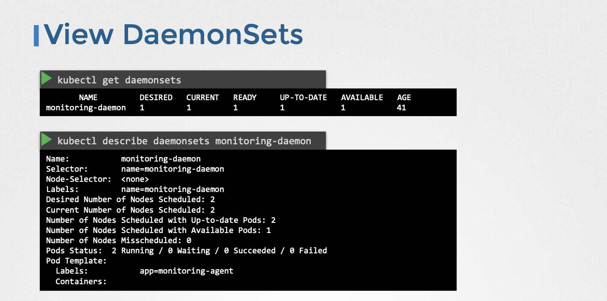

# Scheduling (DaemonSet & StaticPod)

- 이번 장에서는 **Certified Kubernetes Administrator (CKA)** 을 준비하며 "Scheduling의 DaemonSet과 Static Pod"에 대해서 알아보도록 한다.

---

### DaemonSet

#### 개념


- DaemonSet은 클러스터의 모든 노드 또는 특정 노드 그룹에 Pod의 복제본을 하나씩 실행한다.
- ReplicaSet과 유사하지만, DaemonSet은 각 노드에 Pod를 하나씩 배치하는 데 특화되어 있다.
- 새로운 노드가 클러스터에 추가되면 DaemonSet은 해당 노드에 Pod의 복제본을 자동으로 추가한다.
- 노드가 클러스터에서 제거되면 DaemonSet은 해당 노드의 Pod를 자동으로 제거한다.

#### 사용 사례


- **모니터링 에이전트 또는 로그 수집기**: 클러스터의 모든 노드에 모니터링 에이전트 또는 로그 수집기를 배포하여 클러스터 상태를 효과적으로 모니터링할 수 있다.


- **kube-proxy**: 쿠버네티스 클러스터의 모든 노드에 필요한 kube-proxy 구성 요소를 배포하는 데 사용된다.


- **네트워킹 솔루션**: Calico, Flannel 등과 같은 네트워킹 솔루션은 각 노드에 에이전트를 배포해야 한다. DaemonSet은 이러한 에이전트를 배포하는 데 적합하다.

#### 생성


- DaemonSet 정의 YAML 파일은 ReplicaSet 정의 파일과 유사한 구조를 가진다.
- `apiVersion: apps/v1`, `kind: DaemonSet`을 사용하여 DaemonSet을 정의한다.
- `spec.selector`와 `spec.template.metadata.labels`를 사용하여 DaemonSet과 Pod를 연결한다.
- `kubectl create -f <daemonset-definition.yaml>` 명령어를 사용하여 DaemonSet을 생성한다.



- `kubectl get daemonset`, `kubectl describe daemonset` 명령어를 사용하여 DaemonSet 정보를 확인할 수 있다.

#### 작동 방식


- 쿠버네티스 1.12 이전에는 DaemonSet이 스케줄러를 우회하고 직접 노드에 Pod를 배치했다.
- 쿠버네티스 1.12 이후에는 DaemonSet이 기본 스케줄러와 Node Affinity 규칙을 사용하여 Pod를 노드에 배치한다.
- DaemonSet은 Node Affinity 규칙을 사용하여 각 노드에 Pod를 하나씩 배치한다.

---

### Static Pod

#### 개념


- Static Pod는 kubelet이 kube-apiserver의 도움 없이 직접 관리하는 Pod다.
- 일반적인 Kubernetes 클러스터 환경과 달리 kubelet은 특정 디렉토리에 있는 Pod 정의 파일을 읽어 Pod를 생성하고 관리한다.
- kube-apiserver, kube-scheduler, 컨트롤러, etcd와 같은 클러스터 컴포넌트 없이 독립적으로 작동한다.
- 단일 노드 환경이나 클러스터 외부에서 kubelet을 독립적으로 실행해야 하는 경우에 유용하다.

#### 작동 방식


- kubelet은 특정 디렉토리를 주기적으로 감시하며, 해당 디렉토리에 있는 Pod 정의 파일을 읽는다.
- 읽어들인 Pod 정의 파일을 기반으로 Pod를 생성하고 실행한다.
- Pod가 비정상적으로 종료되면 kubelet은 자동으로 Pod를 재시작한다.
- Pod 정의 파일이 변경되면 kubelet은 변경 사항을 적용하기 위해 Pod를 재생성한다.
- 디렉토리에서 Pod 정의 파일이 삭제되면 kubelet은 해당 Pod를 삭제한다.

#### 특징

- kubelet은 Pod 레벨에서만 작동하므로 Static Pod만 생성할 수 있다.
- ReplicaSet, Deployment, Service와 같은 다른 Kubernetes 리소스는 Static Pod 방식으로 생성할 수 없다.
- Static Pod는 API 서버를 거치지 않으므로 Kubernetes 클러스터의 일부가 아니다.
- kubelet 실행 시 특정 디렉토리를 지정하여 Static Pod 정의 파일을 읽도록 설정해야 한다.

#### 설정


- `--pod-manifest-path` 옵션: kubelet 서비스 파일에서 직접 `--pod-manifest-path=<디렉토리 경로>` 옵션을 사용하여 Static Pod 정의 파일을 읽을 디렉토리를 지정한다.
- `--config` 옵션: kubelet 서비스 파일에서 `--config=<설정 파일 경로>` 옵션을 사용하여 설정 파일을 지정하고, 설정 팡리 내에 `staticPodPath: <디렉토리 경로>`를 정의한다. `kubeadm` 도구로 클러스터를 설정한 경우 이 방식을 사용한다.


- 클러스터 설정 방식에 따라 `--pod-manifest-path` 또는 `--config` 옵션을 확인하여 Static Pod 정의 파일이 위치한 디렉토리를 찾아야 한다.


- 독립 노드: `docker ps` 명령어를 사용하여 실행 중인 Static Pod 컨테이너를 확인할 수 있다.
  - `kubectl` 명령어는 API 서버가 없으므로 사용할 수 없다.
- 클러스터 노드: `kubectl get pods` 명령어를 사용하여 클러스터의 다른 Pod와 함께 Static Pod를 확인할 수 있다.


- kubelet은 Static Pod 디렉토리와 API 서버로부터 Pod 생성 요청을 모두 처리할 수 있다.
- 즉, Static Pod와 일반 Pod를 동시에 관리할 수 있다.

#### Static Pod와 API 서버 통합

- kubelet은 Static Pod를 생성할 때 API 서버에 미러 객체(mirror object)를 생성한다.
- `kubectl get pods` 명령어를 실행하면 API 서버의 미러 객체를 통해 Static Pod를 확인할 수 있다.
- 미러 객체는 읽기 전용이며, `kubectl edit` 또는 `kubectl delete` 명령어를 사용하여 수정하거나 삭제할 수 없다.

#### 사용 사례


- Static Pod는 쿠버네티스 컨트롤 플레인에 의존하지 않으므로, 컨트롤 플레인 컴포넌트 자체를 Pod로 배포하는 데 사용할 수 있다.
- 마스터 노드에 kubelet을 설치하고, API 서버, 컨트롤러, etcd 등 컨트롤 플레인 컴포넌트의 Docker 이미지를 사용하는 Pod 정의 파일을 생성한다.


- 정의 파일을 지정된 매니페스트 폴더에 배치하면 kubelet이 컨트롤 플레인 컴포넌트를 Pod로 배포한다.
- 이 방식을 사용하면 바이너리를 다운로드하고 서비스를 직접 구성할 필요가 없으며, 서비스 충돌 시 kubelet이 자동으로 재시작한다.


- `kubeadm` 도구는 이 방식을 사용하여 쿠버네티스 클러스터를 설정한다.
- `kube-system` 네임스페이스에서 컨트롤 플레인 컴포넌트가 Pod로 실행되는 것을 확인할 수 있다.

#### Static Pod vs DaemonSet


- **DaemonSet**:
  - 클러스터의 모든 노드에 애플리케이션 인스턴스를 하나씩 실행한다.
  - kube-apiserver를 통해 DaemonSet 컨트롤러에 의해 관리된다.
- **Static Pod**:
  - kubelet이 kube-apiserver나 다른 컨트롤 플레인 컴포넌트의 도움 없이 직접 생성한다.
  - 쿠버네티스 컨트롤 플레인 컴포넌트 자체를 배포하는 데 사용될 수 있다.
- **공통점**:
  - 두 방식 모두 kube-scheduler의 영향을 받지 않는다.
  - 즉, kube-scheduler는 이들 Pod의 스케줄링에 관여하지 않는다.

#### Static Pod 사용의 장점

- 컨트롤 플레인 컴포넌트를 간편하게 배포하고 관리할 수 있다.
- 서비스 충돌 시 kubelet이 자동으로 재시작하여 안정성을 높인다.
- `kubeadm`과 같은 도구에서 클러스터 설정 시 사용된다.

---

### Multiple Schedulers


- 기본 스케줄러의 알고리즘이 특정 애플리케이션의 요구 사항을 충족하지 못하는 경우, 사용자 정의 스케줄러를 배포할 수 있다.
- 사용자 정의 스케줄러는 특정 애플리케이션에 대한 추가적인 조건 및 검사를 수행하여 Pod를 노드에 배치할 수 있다.
- 쿠버네티스는 확장성이 뛰어나므로 여러 스케줄러를 동시에 배포하고 사용할 수 있다.

#### 배포 방법

- 스케줄러 이름 설정: 각 스케줄러는 고유한 이름을 가져야 한다. 기본 스케줄러의 이름은 "default-scheduler"이다. 
  - 사용자 정의 스케줄러 이름은 kube-scheduler 설정 파일에서 설정할 수 있다.
- kube-scheduler 바이너리 사용: kube-scheduler 바이너리를 사용하여 추가 스케줄러를 배포할 수 있다.
  - 이 경우 각 스케줄러는 별도의 설정 파일을 사용해야 한다.
- Pod로 배포: kube-scheduler를 Pod로 배포할 수 있다.
  - 이 경우 Pod 정의 파일에 kubeconfig 파일 경로와 사용자 정의 kube-scheduler 설정 파일 경로를 지정해야 한다.
- leader-elect 옵션: 다중 마스터 노드 환경에서 고가용성을 위해 스케줄러를 여러 개 실행하는 경우, `leader-elect` 옵션을 사용하여 리더 스케줄러를 선택해야 한다.


```yaml title=my-custom-scheduler.yaml
apiVersion: v1
kind: Pod
metadata:
  name: my-custom-scheduler
  namespace: kube-system
spec:
  containers:
  - command:
    - kube-scheduler
    - --address=127.0.0.1
    - --kubeconfig=/etc/kubernetes/scheduler.conf
    - --config=/etc/kubernetes/my-scheduler-config.yaml
    image: k8s.gcr.io/kube-scheduler-amd64:v1.11.3
    name: kube-scheduler
```

```yaml title=my-scheduler-config.yaml
apiVersion: kubescheduler.config.k8s.io/v1
kind: KubeSchedulerConfiguration
profiles:
  - schedulerName: my-scheduler
leaderElection:
  leaderElect: true
  resourceNamespace: kube-system
  resourceName: lock-object-my-scheduler
```

- 각 스케줄러는 별도의 설정 파일을 사용해야 한다.
- 설정 파일에는 스케줄러 이름, kubeconfig 파일 경로, leader-elect 옵션 등 스케줄러의 동작을 정의하는 다양한 옵션을 설정할 수 있다.
- Pod 또는 Deployment 정의 파일의 `spec.schedulerName` 필드를 사용하여 특정 스케줄러를 지정할 수 있다.
- 이 필드를 생략하면 기본 스케줄러가 사용된다.


#### View Scheduler


- `kubectl get pods --namespace=kube-system` 명령어를 통해 스케줄러 목록을 확인할 수 있다.


- `kubectl get events` 명령어를 통해서 스케줄러에서 어떤 이벤트가 발생했는지 알 수 있다.


- `kubectl logs <스케줄러 이름> --name-space=kube-system` 명령어를 통해서 스케줄러의 로그를 확인할 수 있다.

### Configuring Scheduler Profile

#### 작동 방식


- **스케줄링 큐 (Scheduling Queue)**: 
  - Pod가 생성되면 스케줄링 큐에 추가되어 스케줄링을 기다린다.
  - Pod는 우선순위 클래스(Priority Class)에 따라 정렬된다. 우선순위가 높은 Pod는 큐의 앞쪽에 위치하여 먼저 스케줄링된다.
  - 우선순위 클래스는 `apiVersion: scheduling.k8s.io/v1`, `kind: PriorityClass`로 정의하며, `value` 필드를 통해 우선순위 값을 설정한다.


- **필터링 단계 (Filter Phase)**: 
  - Pod를 실행할 수 없는 노드를 필터링하여 스케줄링 대상에서 제외한다.
  - 다양한 플러그인을 사용하여 필터링 작업을 수행한다.
    - 노드 리소스 적합 플러그인 (Node Resource Fit Plugin): Pod의 리소스 요구 사항(CPU, 메모리 등)을 충족하지 못하는 노드를 필터링한다.
    - 노드 이름 플러그인 (Node Name Plugin): Pod의 `spec.nodeName`에 지정된 노드와 일치하지 않는 노드를 필터링한다.
    - 노드 스케줄링 불가능 플러그인 (Node Unschedulable Plugin): 노드의 스케줄링 불가능 플래그(`unschedulable: true`)가 설정된 노드를 필터링한다. `kubectl drain` 또는 `kubectl cordon` 명령어를 사용하여 노드를 스케줄링 불가능 상태로 만들 수 있다.
    - Taint/Toleration 플러그인: Pod의 Toleration과 노드의 Taint를 비교하여 Pod를 실행할 수 없는 노드를 필터링한다.
    - Node Affinity/Anti-Affinity 플러그인: Pod의 Node Affinity/Anti-Affinity 규칙을 만족하지 않는 노드를 필터링한다.


- **스코어링 단계 (Scoring Phase)**:
  - 필터링 단계를 통과한 노드에 점수를 부여하여 최적의 노드를 선택한다.
  - 다양한 플러그인을 사용하여 스코어링 작업을 수행한다.
    - 노드 리소스 적합 플러그인 (Node Resources Fit Plugin): 노드의 남은 리소스(CPU, 메모리 등)를 기반으로 점수를 부여한다. 리소스가 많이 남은 노드에 높은 점수를 부여한다.
    - 이미지 로컬리티 플러그인 (Image Locality Plugin): Pod가 사용하는 컨테이너 이미지를 이미 가지고 있는 노드에 높은 점수를 부여한다. 이미지를 다운로드하는 시간을 절약하여 Pod 실행 시간을 단축할 수 있다.
    - Taint/Toleration 플러그인: Pod의 Toleration과 노드의 Taint를 기반으로 점수를 부여한다. Toleration을 만족하는 노드에 높은 점수를 부여한다.
    - Node Affinity/Anti-Affinity 플러그인: Pod의 Node Affinity/Anti-Affinity 규칙을 기반으로 점수를 부여한다. 규칙을 만족하는 노드에 높은 점수를 부여한다.


- **바인딩 단계 (Binding Phase)**:
  - 스코어링 단계에서 가장 높은 점수를 받은 노드에 Pod를 바인딩한다.
  - 기본 바인더 플러그인 (Default Binder Plugin): Pod를 노드에 바인딩하는 작업을 수행한다.
  - 바인딩 단계는 Pod를 실제로 노드에 할당하고 실행하는 마지막 단계다.

#### 플러그인 (Plugin)


- 쿠버네티스 스케줄러는 플러그인 시스템을 통해 확장성을 제공한다.
- 각 단계는 확장 지점(Extension Points)을 가지고 있으며, 사용자는 사용자 정의 플러그인을 개발하여 연결할 수 있다.
- 플러그인은 스케줄러의 동작을 사용자 정의하고 특정 요구 사항을 충족하는 데 사용된다.
- 하나의 플러그인이 여러 단계에서 사용될 수 있다.


- kube-scheduler 설정 파일(`kube-scheduler.yaml`)에서 사용할 플러그인을 설정할 수 있다.
- `profiles` 섹션에서 각 프로필에 사용할 플러그인을 지정한다.
- `plugins` 섹션에서 각 단계별로 사용할 플러그인을 설정한다.


- 쿠버네티스는 다중 스케줄러를 지원하므로 사용자 정의 스케줄러를 개발하여 사용할 수 있다.
- 사용자 정의 스케줄러는 특정 애플리케이션의 요구 사항을 충족하는 데 유용하다.
- 사용자 정의 스케줄러는 플러그인 시스템을 활용하여 개발할 수 있다.

#### 플러그인 확장 지점 (Extension Points)


- 스케줄러의 각 단계는 플러그인을 연결할 수 있는 확장 지점을 제공한다.
- 이를 통해 사용자는 스케줄러의 동작을 사용자 정의하고 특정 요구 사항을 충족하는 플러그인을 추가할 수 있다.


- **큐 정렬 (Queue Sort)**: 스케줄링 큐에서 Pod를 정렬하는 플러그인을 연결한다. (예: 우선순위 정렬 플러그인)
- **사전 필터링 (Pre-Filter)**: 필터링 단계 전에 실행되는 플러그인을 연결한다.
- **필터링 (Filter)**: Pod를 실행할 수 없는 노드를 필터링하는 플러그인을 연결한다. (예: 노드 리소스 적합 플러그인, 노드 이름 플러그인)
- **사후 필터링 (Post-Filter)**: 필터링 단계 후에 실행되는 플러그인을 연결한다.
- **사전 스코어링 (Pre-Score)**: 스코어링 단계 전에 실행되는 플러그인을 연결한다.
- **스코어링 (Score)**: 노드에 점수를 부여하는 플러그인을 연결한다. (예: 이미지 로컬리티 플러그인)
- **예약 (Reserve)**: 스코어링 단계 후에 실행되는 플러그인을 연결한다.
- **허용 (Permit)**: 바인딩 단계 전에 실행되는 플러그인을 연결한다.
- **사전 바인딩 (Pre-Bind)**: 바인딩 단계 전에 실행되는 플러그인을 연결한다.
- **바인딩 (Bind)**: Pod를 노드에 바인딩하는 플러그인을 연결한다. (예: 기본 바인더 플러그인)
- **사후 바인딩 (Post-Bind)**: 바인딩 단계 후에 실행되는 플러그인을 연결한다.
  
- 쿠버네티스는 다양한 기본 플러그니을 제공하며 이들은 여러 확장 지점에 걸쳐 사용될 수 있다.
- 예를 들어, 노드 리소스 적합 플러그인은 필터링과 스코어링 단계 모두에서 사용된다.

#### 다중 스케줄러 배포 방법


- 별도의 스케줄러 바이너리 사용
  - 각 스케줄러는 별도의 프로세스로 실행된다.
  - 유지 관리 부담이 크고 스케줄링 결정 시 경쟁 조건이 발생할 수 있다.


- 단일 스케줄러 바이너리의 다중 프로파일 사용
  - 쿠버네티스 1.18부터 지원되는 기능이다.
  - 단일 스케줄러 바이너리에서 여러 프로파일을 설정하여 각 프로파일이 별도의 스케줄러처럼 작동하도록 한다.
  - 유지 관리 부담이 적고 경쟁 조건 발생 가능성이 낮다.

#### 설정

- kube-scheduler 설정 파일(`kube-scheduler.yaml`)의 `profiles` 섹션에서 여러 프로파일을 정의한다.
- 각 프로파일은 고유한 `schedulerName`을 가져야 한다.
- `plugins` 섹션에서 각 프로파일의 플러그인을 활성화 또는 비활성화할 수 있다.
- 특정 확장 지점에서 특정 플러그인을 제외하거나 특정 패턴에 맞는 플러그인을 제외할 수 있다.
- 이를 통해 각 프로파일이 다른 스케줄링 전략을 사용하도록 구성할 수 있다.
- 아래는 다중 스케줄러 프로파일 설정의 예시이다.

```yaml
apiVersion: kubescheduler.config.k8s.io/v1beta2
kind: KubeSchedulerConfiguration
profiles:
  - schedulerName: "default-scheduler"
    plugins:
      filter:
        enabled:
        - NodeResourcesFit
        - NodeName
        disabled:
        - TaintToleration
  - schedulerName: "my-scheduler-2"
    plugins:
      filter:
        enabled:
        - MyCustomPlugin
        disabled:
        - TaintToleration
  - schedulerName: "my-scheduler-3"
    plugins:
      preScore:
        disabled:
        - "*"
      score:
        disabled:
        - "*"
```

---

### 참고한 강의

- [Kubernetes for the Absolute Beginners](https://www.udemy.com/course/learn-kubernetes)
- [Certified Kubernetes Administrator (CKA)](https://www.udemy.com/course/certified-kubernetes-administrator-with-practice-tests)
- [Scheduler code hierarchy overview](https://github.com/kubernetes/community/blob/master/contributors/devel/sig-scheduling/scheduling_code_hierarchy_overview.md)
- [Advanced Scheduling in Kubernetes](https://kubernetes.io/blog/2017/03/advanced-scheduling-in-kubernetes/)
- [How does the Kubernetes scheduler work?](https://jvns.ca/blog/2017/07/27/how-does-the-kubernetes-scheduler-work/)
- [How does Kubernetes' scheduler work?](https://jvns.ca/blog/2017/07/27/how-does-the-kubernetes-scheduler-work/)