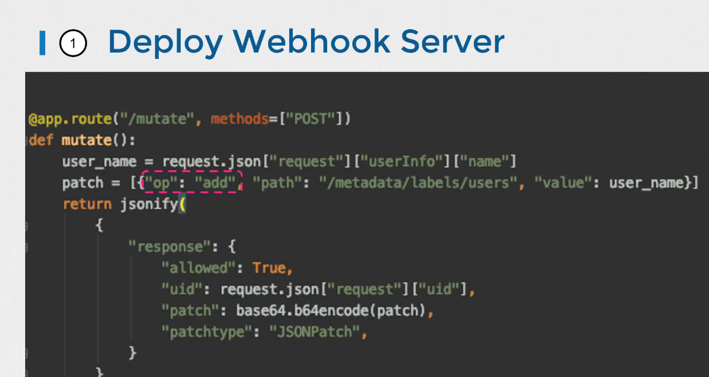

# Admission Controller

- 이번 장에서는 **Certified Kubernetes Administrator (CKA)** 을 준비하며 "Admission Controller"에 대해서 알아보도록 한다.

---

### Admission Controller

#### API 요청 처리 과정


- **인증(Authentication)**: 클라이언트(kubectl, API 호출 등)의 요청이 API 서버에 도달하면 먼저 인증 과정을 거친다.
  - 클라이언트의 신원을 확인하고 유효성을 검증한다. (예: kubeconfig 파일의 인증서 사용)
- **인가(Authorization)**: 인증된 사용자가 요청한 작업을 수행할 권한이 있는지 확인한다. (예: RBAC 역할 기반 접근 제어)
- **어드미션 컨트롤(Admission Control)**: 인가된 요청을 검증하고 필요한 경우 변경하거나 거부한다.

#### RBAC (Role-Based Access Control)의 한계


- RBAC는 사용자에게 특정 API 작업(생성, 삭제 등)을 수행할 권한을 부여하는 데 초점을 맞춘다.
- 세밀한 설정(예: 특정 이미지 사용 제한, 보안 설정 강제)은 RBAC만으로 구현하기 어렵다.

#### Admission Controller의 역할

- 어드미션 컨트롤러는 API 요청이 etcd에 저장되기 전에 요청을 검증하고 변경할 수 있다.
- 클러스터의 보안 정책 및 규정을 강화하는 데 사용된다.
- 요청의 유효성을 검사하고, 필요한 경우 요청을 거부하거나 수정한다.
- 추가적인 작업ㅇ르 수행하여 클러스터의 기능을 확장한다.

#### Admission Controller의 기능

- **요청 검증(Validation)**: 요청의 유효성을 검사하고 정책 위반 시 거부한다. (예: 특정 이미지 사용 제한, 보안 설정 강제)
- **요청 변경(Mutation)**: 요청 내용을 수정하거나 추가 정보를 삽입한다. (예: 기본 스토리지 클래스 자동 추가)
- **추가 작업 수행**: 요청 처리 전후에 추가 작업을 수행한다. (예: 이벤트 발생 횟수 제한)

#### 내장 Admission Controller 예시


- **AlwaysPullImages**: Pod 생성 시 항상 이미지를 풀하도록 강제한다.
- **DefaultStorageClass**: PVC 생성 시 기본 스토리지 클래스를 자동으로 추가한다.
- **EventRateLimit**: API 서버의 요청 처리량을 제한하여 과부하를 방지한다.
- **NamespaceExists**: 
  - 존재하지 않는 네임스페이스에 Pod를 생성하려는 요청이 들어오면, NamespaceExists 어드미션 컨트롤러가 요청을 검사한다.
  - 네임스페이스가 존재하지 않으면 요청을 거부하고 오류 메시지를 반환한다.
- **NamespaceAutoProvision**:
  - 기본적으로 활성화되지 않은 어드미션 컨트롤러다.
  - 존재하지 않는 네임스페이스에 Pod를 생성하려는 요청이 들어오면, 자동으로 네임스페이스를 생성한다.

#### 활성화된 Admission Controller 목록 확인


- `kube-apiserver --help | grep enable-admission-plugins` 명령어를 사용하여 기본적으로 활성화된 어드미션 컨트롤러 목록을 확인할 수 있다.
- `kubeadm`으로 설정된 클러스터에서는 `kubectl exec` 명령어를 사용하여 kube-apiserver Pod 내부에서 명령어를 실행해야 한다.
  - `kubectl exec -it <kube-apiserver-pod-name> -n kube-system -- kube-apiserver --help | grep enable-admission-plugins`

#### Admission Controller 활성화 및 비활성화


- kube-apiserver 서비스 또는 Pod의 설정 파일에서 `--enable-admission-plugins` 플래그를 수정하여 Admission Controller를 활성화할 수 있다.
- `kubeadm`으로 설정된 클러스터에서는 kube-apiserver 매니패스트 파일(`/etc/kubernetes/manifests/kube-apiserver.yaml`)을 수정해야 한다.
- 아래는 kube-apiserver.yaml 예시이다.

```yaml title=kube-apiserver.yaml
spec:
  containers:
  - command:
    - kube-apiserver
    - --enable-admission-plugins=...,NamespaceAutoProvision,...
```

- `--disable-admission-plugins` 플래그를 사용하여 Admission Controller를 비활성화할 수 있다.
- `kubeadm`으로 설정된 클러스터에서는 kube-apiserver 매니페스트 파일을 수정해야 한다.

#### Admission Controller 유형


- **Validating Admission Controller (검증 어드미션 컨트롤러)**:
  - 요청의 유효성을 검사하고 허용 또는 거부한다.
  - 예: NamespaceExists, NamespaceLifecycle
- **Mutating Admission Controller (변형 어드미션 컨트롤러)**:
  - 요청 객체를 변경(mutate)한다.
  - 예: DefaultStorageClass
- 어드미션 컨트롤러는 두 가지 기능을 모두 수행할 수 있다.

#### 실행 순서

- Mutating Admission Controller가 먼저 실행되고 Validating Admission Controller가 그 다음에 실행된다.
- 이는 변형된 객체가 검증 과정에서 고려될 수 있도록 하기 위함이다.
- 예: NamespaceAutoProvisioning (mutating) -> NamespaceExists (validating)
- 어드미션 컨트롤러 중 하나라도 요청을 거부하면 전체 요청이 거부된다.

#### 사용자 정의 어드미션 컨트롤러 (Admission Webhook)


- 쿠버네티스 내장 어드미션 컨트롤러 외에 사용자 정의 로직을 가진 어드미션 컨트롤러를 구현할 수 있다.
- 이를 위해 "MutatingAdmissionWebhook"과 "ValidatingAdmissionWebhook" 두 가지 특별한 어드미션 컨트롤러가 제공된다.
- 이러한 Webhook은 클러스터 내부 또는 외부에 호스팅되는 서버를 가리키도록 구성할 수 있다.
- 사용자 정의 어드미션 컨트롤러는 다음과 같이 작동한다.
  - API 요청이 모든 내장 어드미션 컨트롤러를 통과한 후 Webhook으로 전달된다.
  - Webhook은 AdmissionReview 객체(JSON 형식)를 어드미션 Webhook 서버로 전송한다.
  - 어드미션 Webhook 서버는 AdmissionReview 객체를 분석하고 요청 허용 여부를 결정한다.
  - 어드미션 Webhook 서버는 AdmissionReview 객체를 응답으로 반환하며, 이 객체에는 요청 허용 여부가 포함된다.

#### 사용자 정의 어드미션 Webhook 서버 구현

- 어드미션 Webhook 서버는 API 서버로부터 요청을 받아 처리하고 허용/거부 결과를 반환하는 역할을 한다.
- Go, Python 등 다양한 프로그래밍 언어로 구현할 수 있으며 쿠버네티스 문서에서 Go 언어로 작성된 예시 코드를 참고할 수 있다.
- 서버는 `mutate`와 `validate` API를 구현해야 하며, Webhook이 기대하는 JSON 형식으로 응답해야 한다.



- Python 예시 코드
  - `validate` API: 요청 객체의 이름과 사용자 이름을 비교하여 동일하면 거부한다.
  - `mutate` API: 요청을 보낸 사용자 이름을 레이블로 추가하는 JSON patch 작업을 생성한다.
- JSON Patch 작업:
  - `add`, `remove`, `replace`, `move`, `copy`, `test` 등의 작업을 수행할 수 있다.
  - `path`를 통해 변경 대상 JSON 객체의 위치를 지정한다.
  - `value`를 통해 추가 또는 변경할 값을 지정한다.
  
- Webhook 서버는 독립적인 서버로 실행하거나 컨테이너화하여 쿠버네티스 클러스터 내에 배포할 수 있다.
- 클러스터 내에 배포하는 경우 서비스(Service)를 통해 접근할 수 있도록 설정해야 한다. (예: `webhook-service`라는 이름의 서비스로 배포)

#### 어드미션 Webhook 서버 배포


- ValidatingWebhookConfiguration (검증 Webhook 설정):
  - `apiVersion: admissionregistration.k8s.io/v1`
  - `kind: ValidationWebhookConfiguration`
- MutatingWebhookConfiguration (변형 Webhook 설정):
  - `apiVersion: admissionregistration.k8s.io/v1`
  - `kind: MutatingWebhookConfiguration`
- Webhook 설정 객체 구성 요소:
  - `metadata.name`: Webhook 이름
  - `webhooks`: Webhook 목록
    - `name`: Webhook 이름 (예: `pod-policy.example.com`)
    - `clientConfig`: Webhook 서버 위치 설정
      - `url`: 외부 서버 URL (클러스터 외부 배포 시)
      - `service`: 클러스터 내부 서비스 설정 (클러스터 내부 배포 시)
        - `namespace`: 서비스 네임스페이스
        - `name`: 서비스 이름
      - `caBundle`: TLS 인증서 번들 (API 서버와 Webhook 서버 간 TLS 통신 설정)
    - `roles`: Webhook 호출 조건 설정
      - `apiGroups`, `apiVersions`, `operations`, `resources`: Webhook을 호출할 API 그룹, 버전, 작업 유형, 리소스 지정

#### 작동 방식

- Webhook 설정 객체가 생성되면 설정된 조건에 맞는 API 요청이 발생할 때마다 Webhook 서버가 호출된다.
- Webhook 서버는 요청을 처리하고 허용/거부 결과를 반환한다.
- 결과에 따라 요청이 허용되거나 거부된다.

---

### 참고한 강의

- [Kubernetes for the Absolute Beginners](https://www.udemy.com/course/learn-kubernetes)
- [Certified Kubernetes Administrator (CKA)](https://www.udemy.com/course/certified-kubernetes-administrator-with-practice-tests)