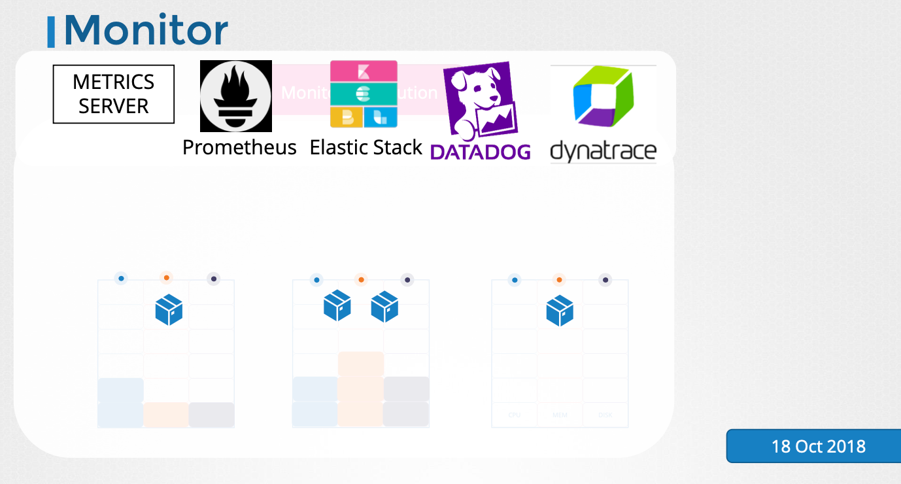
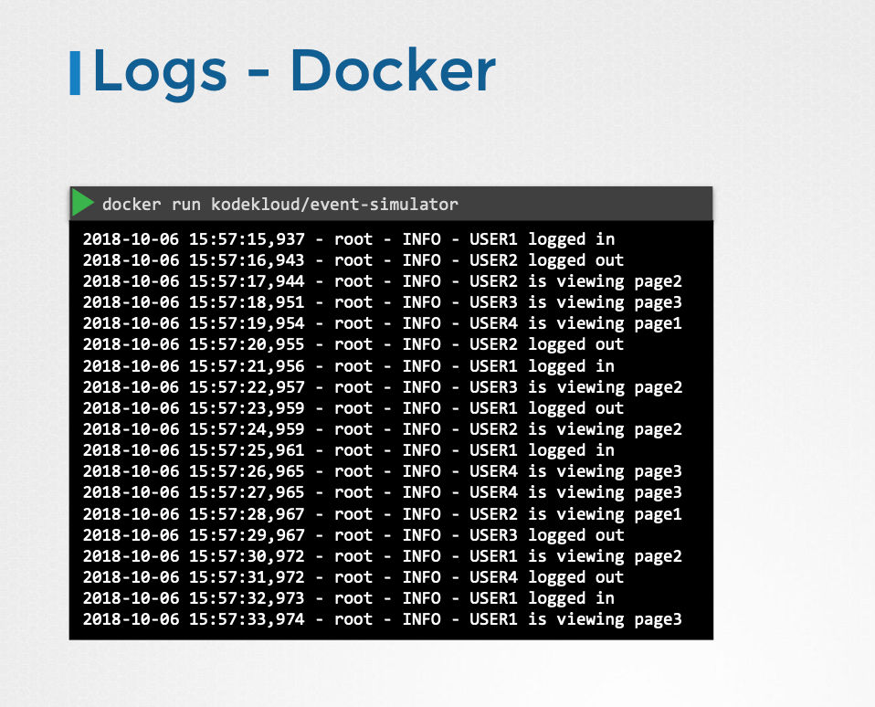
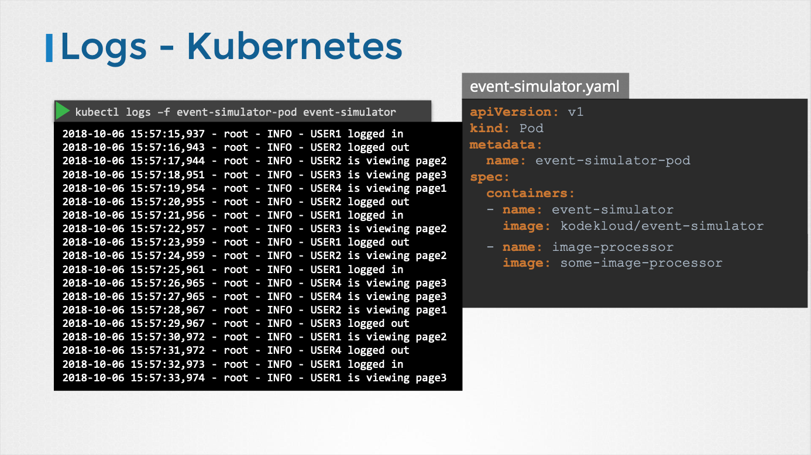

# Logging & Monitoring

- 이번 장에서는 **Certified Kubernetes Administrator (CKA)** 을 준비하며 "로깅과 모니터링"에 대해서 알아보도록 한다.

---

### Monitoring

#### 필요성

- **노드 레벨 지표**: 클러스터 내 노드 수, 상태, CPU, 메모리, 네트워크, 디스크 사용률 등을 파악해야 한다.
- **Pod 레벨 지표**: Pod 수, 각 Pod의 CPU, 메모리 소비량 등을 파악해야 한다.
- 이러한 지표를 모니터링하고 분석하여 클러스터의 성능과 상태를 지속적으로 관리해야 한다.

#### 모니터링 도구

- 쿠버네티스는 기본적으로 완전한 기능을 갖춘 내장 모니터링 솔루션을 제공하지 않는다.
- 다양한 오픈 소스 및 상용 솔루션을 사용할 수 있다.
  - 오픈 소스: Metrics Server, Prometheus, Elastic Stack
  - 상용 솔루션: Datadog, Dynatrace

- Heapster: 과거에 사용되었던 모니터링 프로젝트이지만, 현재는 deprecated 되었다.

#### Metric Server

- Heapster의 축소 버전으로 클러스터당 하나의 Metrics Server를 설치할 수 있다.
- 각 노드와 Pod의 지표를 수집하여 메모리에 저장한다.
- 메모리 기반이므로 과거 성능 데이터를 확인할 수 없다.
- 실시간 모니터링에 적합하다.

- 각 노드에서 실행되는 kubelet은 cAdvisor(Container Advisor)라는 하위 컴포넌트를 포함한다.
- cAdvisor는 Pod의 성능 지표를 수집하고 kubelet API를 통해 노출한다.
- Metrics Server는 kubelet API를 통해 지표를 수집하고 집계한다.

#### Metric Server 설치 및 설정

- minikube: `minikube addons enable metrics-server` 명령어를 사용하여 Metrics Server를 활성화한다.
- 기타 환경: Metrics Server GitHub 저장소에서 배포 파일을 클론하고 `kubectl create` 명령어를 사용하여 필요한 컴포넌트(Pod, 서비스, 역할 등)를 배포한다.

#### 모니터링

- 노드 지표 확인: `kubectl top node` 명령어를 사용하여 각 노드의 CPU 및 메모리 소비량을 확인할 수 있다.
- Pod 지표 확인: `kubectl top pod` 명령어를 사용하여 각 Pod의 CPU 및 메모리 소비량을 확인할 수 있다.

---

### 로깅

#### Docker 로깅

- Docker 컨테이너에서 애플리케이션이 표준 출력(stdout)으로 로그를 생성한다.
- `-d` 옵션을 사용하여 컨테이너를 분리 모드(detached mode)로 실행하면 로그가 화면에 표시되지 않는다.
- `docker logs <컨테이너 ID>` 명령어를 사용하여 컨테이너의 로그를 확인할 수 있다.
- `-f` 옵션을 사용하여 실시간 로그 스트림을 확인할 수 있다.

#### 쿠버네티스 로깅

- Docker 이미지와 동일한 이미지랄 사용하여 쿠버네티스 Pod를 생성한다.
- `kubectl logs <Pod 이름>` 명령어를 사용하여 Pod의 로그를 확인할 수 있다.
- `-f` 옵션을 사용하여 실시간 로그 스트림을 확인할 수 있다.
- 이 로그는 Pod 내부의 컨테이너에 대한 로그다.

#### 다중 컨테이너 Pod 로깅

- 쿠버네티스 Pod는 여러 개의 Docker 컨테이너를 포함할 수 있다.
- Pod에 여러 컨테이너가 있는 경우 `kubectl logs <Pod 이름>` 명령어만으로는 어떤 컨테이너의 로그를 표시할지 알 수 없다.
- 컨테이너의 이름을 명시적으로 지정해야 한다.
- `kubectl logs <Pod 이름> -c <컨테이너 이름>` 명령어를 사용하여 특정 컨테이너의 로그를 확인할 수 있다.

---

### 참고한 강의

- [Kubernetes for the Absolute Beginners](https://www.udemy.com/course/learn-kubernetes)
- [Certified Kubernetes Administrator (CKA)](https://www.udemy.com/course/certified-kubernetes-administrator-with-practice-tests)