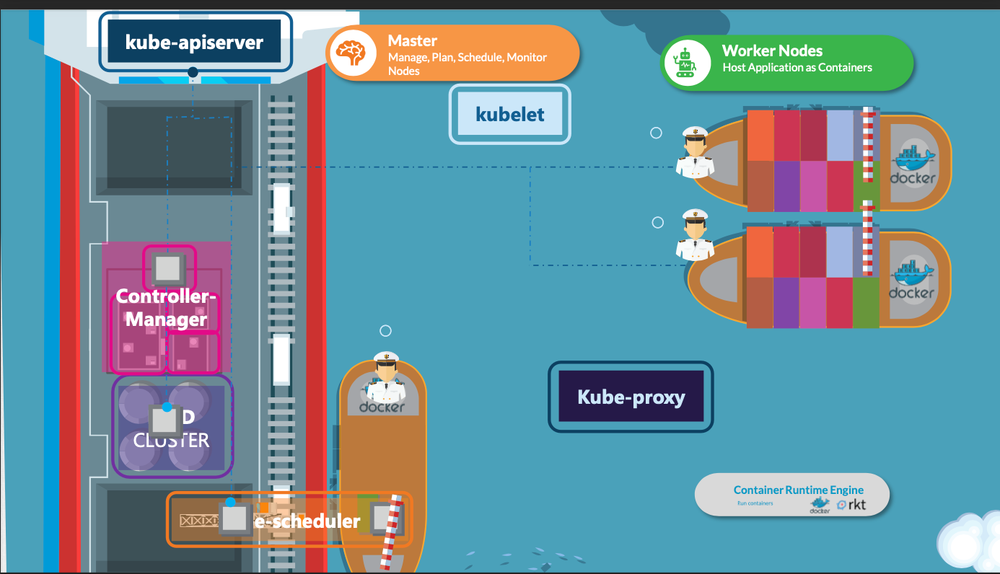
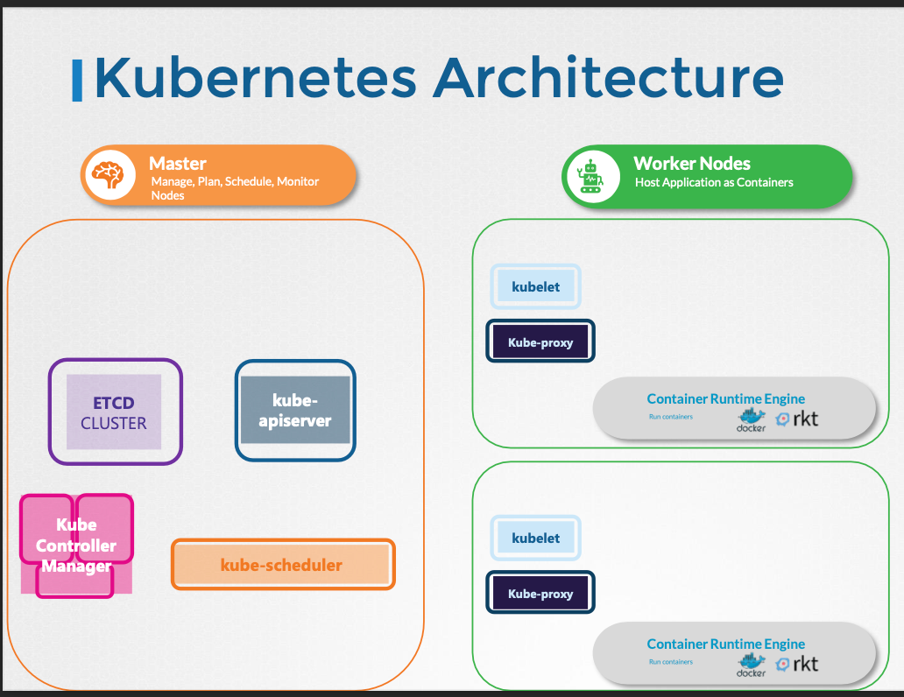

# Kubernetes Architecture

- 이번 장에서는 **Certified Kubernetes Administrator (CKA)** 을 준비하며 "쿠버네티스 아키텍처"에 대해서 알아보도록 한다.

---

### Nodes

- 노드는 쿠버네티스가 설치된 물리적 또는 가상 시스템으로, 작업자 시스템이고 컨테이너는 쿠버네티스에 의해 시작된다.
- 예전에는 미니언즈라고도 불렸으며 이러한 용어들이 상호 교환적으로 사용될 수 있다.
- 우리는 애플리케이션이 실행되고 있는 노드가 실패할 수도 있기 때문에, 두 대 이상의 노드를 구성하는 것이 권장된다.

---

### Cluster

- 클러스터는 함께 그룹화된 노드의 집합니다.
- 이렇게 구성되는 경우 하나의 노드가 실패하더라도 사용자는 다른 노드에서 실행되는 애플리케이션에 계속 액세스할 수 있다.
- 여러 노드를 사용하면 로드를 공유하는 데 도움이 된다.

---

### Master

- 마스터는 쿠버네티스가 설치된 또 다른 노드이며 마스터로 구성된다.
- 마스터는 클러스터의 노드를 감시하고 작업자 노드에서 컨테이너의 실제 오케스트레이션을 담당한다.
- 실제로 클러스터 구성원에 대한 정보를 저장하고 있으며, 노드가 실패하는 경우 워크로드를 다른 작업자 노드로 이동시키는 역할을 한다.

---

### 구성 요소

- 시스템에 쿠버네티스를 설치하면 API 서버, ETCD, Kubelet, Container Runtime, Controller, Scheduler와 같은 구성 요소들이 설치된다.

#### API 서버

- 쿠버네티스의 프론트엔드 역할을 한다.
- 사용자, 관리 장치, 명령줄 인터페이스는 모두 API 서버와 통신하여 쿠버네티스 클러스터와 상호 작용한다.

#### ETCD

- ETCD는 클러스터 관리에 사용되는 모든 데이터를 저장하기 위해 쿠버네티스에서 사용하는 신뢰할 수 있는 분산 Key-Value 저장소다.
- 클러스터에 여러 노드와 여러 마스터가 있는 경우 ETCD는 클러스터의 모든 노드에 대한 모든 정보를 분산 방식으로 저장한다.
- ETCD는 마스터 간에 충돌이 발생하지 않도록 클러스터 내에서 잠금을 구현하는 역할을 담당한다.

#### Scheduler

- 스케줄러는 여러 노드에 작업이나 컨테이너를 배포하는 역할을 하며, 새롭게 생성된 컨테이너를 찾아 노드에 할당한다.
- 컨트롤러는 오케스트레이션의 두뇌이며, 노드, 컨테이너 또는 엔드포인트가 다운될 때 이를 인지하고 대응하는 역할을 담당하며, 이러한 경우 컨트롤러는 새로운 컨테이너를 가져오는 결정을 한다.

#### Container Runtime

- 컨테이너 런타임은 컨테이너를 실행하는 데 사용되는 기본 소프트웨어로 도커가 많이 사용된다.

#### Kubelet

- Kubelet은 클러스터의 각 노드에서 실행되는 에이전트다.
- 에이전트는 컨테이너가 예상대로 노드에서 실행되고 있는지 확인하는 역할을 담당한다.

---

### 마스터 노드 & 워커 노드

- 도커 컨테이너가 있고 시스템에서 도커 컨테이너를 실행하려면 컨테이너 런타임이 설치되어 있어야 한다. 이미지에서는 컨테이너 런타임으로 도커가 설치되어 있다.
- 반드시 도커일 필요는 없으며 Rocket 또는 CRIO와 같은 다른 컨테이너 런타임이라는 대안이 있다.
- 마스터 서버에는 kube-apiserver가 있으므로 이를 마스터로 만든다.
- 마찬가지로 워커 노드에는 워커 노드의 상태 정보를 제공하고 워커 노드에서 마스터가 요청한 작업을 수행하기 위해 마스터와 상호 작용하는 역할을 담당하는 kubelet 에이전트가 있다.
- 수집된 모든 정보는 마스터의 Key-Value 저장소에 저장되며, Key-Value 저장소는 ETCD 프레임워크를 기반으로 한다.
- 마스터에는 컨트롤러 관리자와 스케쥴러가 있다.

---

### Kubectl

- kubectl은 쿠버네티스 클러스터에서 애플리케이션 배포 및 관리하고, 클러스터의 정보를 가져오며, 클러스터의 노드 상태를 가져오는 등 다양한 작업에 사용된다.
- `kubectl run` 명령은 클러스터에 애플리케이션을 배포하는 데 사용된다.
- `kubectl cluster-info` 명령은 클러스터에 대한 정보를 보는 데 사용되며 `kubectl get pod` 명령은 클러스터의 모든 노드 부분을 나열하는데 사용된다.

---

### 심화

- 쿠버네티스의 목적은 애플리케이션을 자동화된 컨테이너 방식으로 호스트하는 것이다.
- 이러한 방식으로 요구에 따라 애플리케이션의 많은 인스턴스를 쉽게 배포할 수 있고 애플리케이션 내 다양한 서비스 간의 통신이 쉽게 가능하다.
- 쿠버네티스 클러스터는 노드 세트로 구성되는데 물리적, 가상, 온-프레미스 또는 클라우드에서 구성될 수 있고 컨테이너 형태의 애플리케이션 호스트일 수 있다.
- **마스터 노드**는 쿠버네티스 클러스터를 관리하고 서로 다른 노드에 대한 정보를 저장하고 어떤 컨테이너가 어디로 갈지 계획하고 노드와 컨테이너를 모니터링하는 등의 책임을 가진다.
- "ETCD Cluster"는 각 선박에 대한 정보를 유지하고, 어떤 컨테이너가 어느 배에 있고 몇 시에 적재되었는지 등의 정보를 저장하는 Key-Value 데이터베이스다.
- "kube-scheduler"는 선박의 크기와 적재 용량 선박에 실린 컨테이너의 수와 기타 조건들을 기준으로 선박의 목적지와 실을 수 있는 컨테이너의 종류 등을 결정한다.
- 또한, 컨테이너를 설치하기 위해 올바른 노드를 식별한다. 컨테이너 리소스 요구 사항이나 워커 노드 용량 혹은 다른 정책이나 제약 조건들이 있다.
- "Node-Controller"는 노드를 관리하며 새 노드를 클러스터에 온보딩하고 노드가 사용 불가능하거나 파괴되는 상황을 처리한다.
- "Replication Controller"는 원하는 컨테이너 수가 복제 그룹에서 항상 실행되도록 보장한다.
- "kube-apiserver"는 클러스터 내에서 모든 작업을 오케스트레이션한다.
  클러스터 상태를 모니터하는 다양한 컨트롤러도 요구에 따라 필요한 변경을 하고 작업자 노드가 서버와 통신한다.
- DNS 서비스 네트워킹 솔루션은 컨테이너 형태로 배포될 수 있다.
- 선박의 선장과 같은 역할을 하는 것이 "kubelet"이며, 배의 모든 활동을 관리할 책임이 있고 주요 선박들과 연락을 주고 받으며 컨테이너에 대하 정보를 받고 필요한 만큼 적재하고 해당 선박의 컨테이너 상태와 선박에 실린 컨테이너의 상태 등을 마스터 노드의 "kubelet"에 보고한다.

- "kubelet"은 클러스터의 각 노드에서 실행되는 에이전트로 kube-api 서버의 지시를 듣고 필요한대로 노드에서 컨테이너를 배포하거나 파괴한다.
- "kube-apiserver"는 주기적으로 "kubelet"으로부터 상태 보고서를 가져와서 노드와 컨테이너의 상태를 모니터링한다.
- Worker 노드에서 실행되는 "kube-proxy" 서비스는 클러스터 내의 서비스를 노출하고 서비스 간의 통신을 관리한다.
  Worker 노드는 kube-apiserver의 지시를 듣고 컨테이너와 kube-proxy를 관리하여, 클러스터 내부의 서비스 간 통신을 가능한게 한다.

---

### 참고한 강의

- [Kubernetes for the Absolute Beginners](https://www.udemy.com/course/learn-kubernetes)
- [Certified Kubernetes Administrator (CKA)](https://www.udemy.com/course/certified-kubernetes-administrator-with-practice-tests)