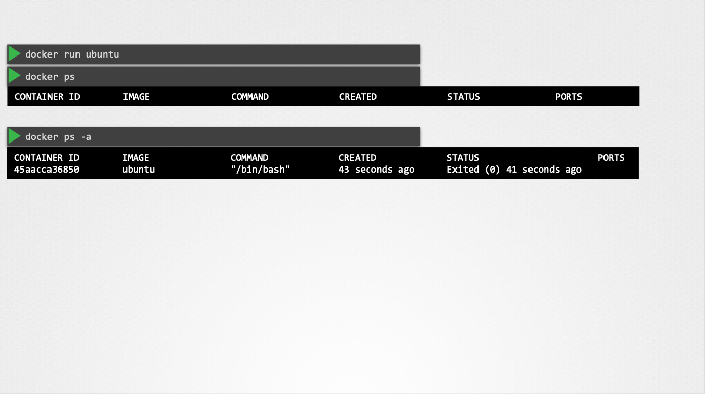
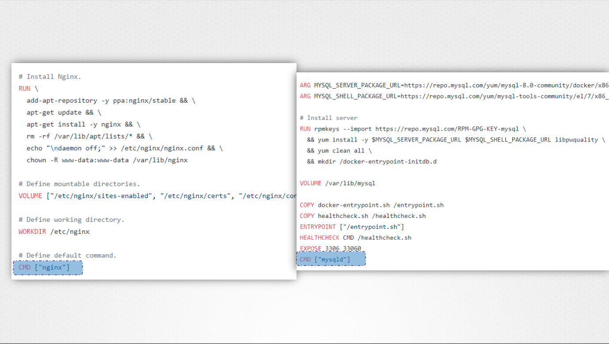
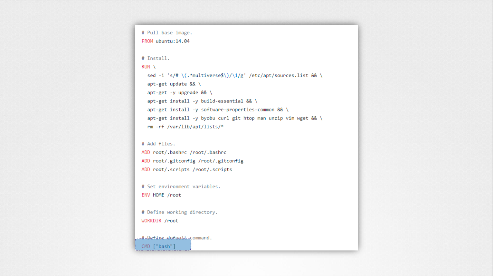
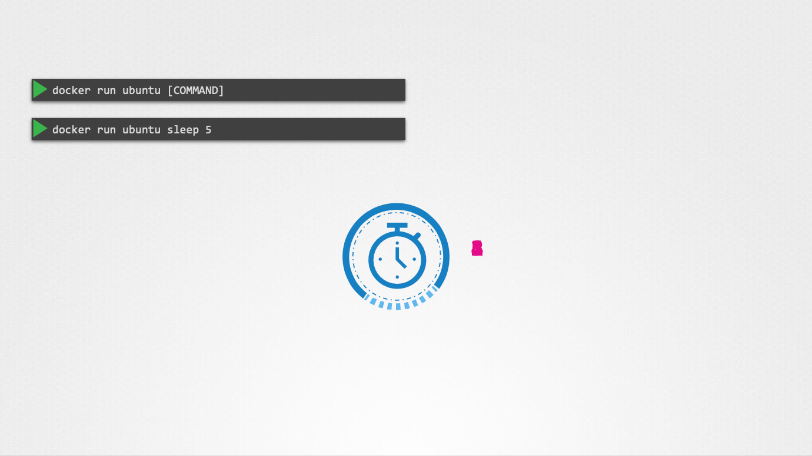
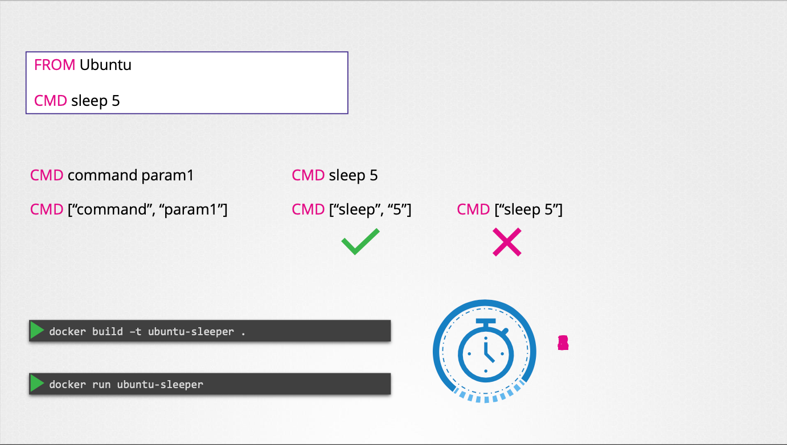
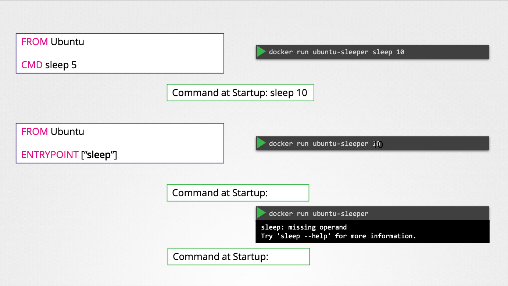
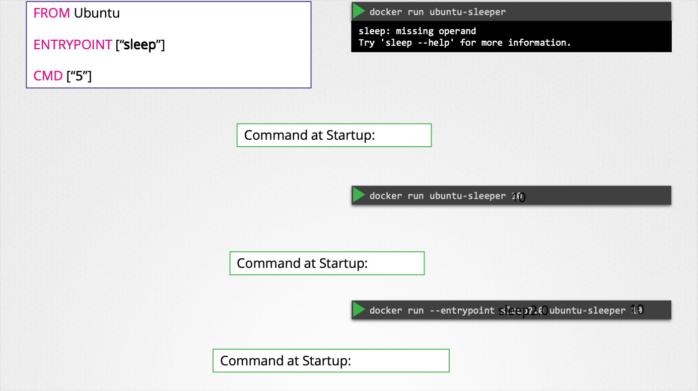
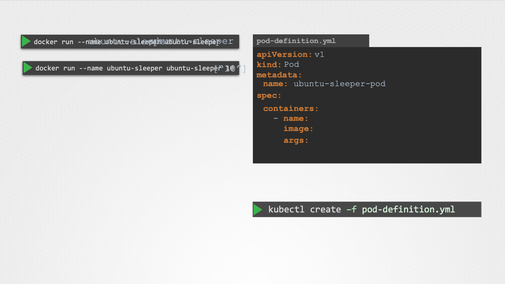
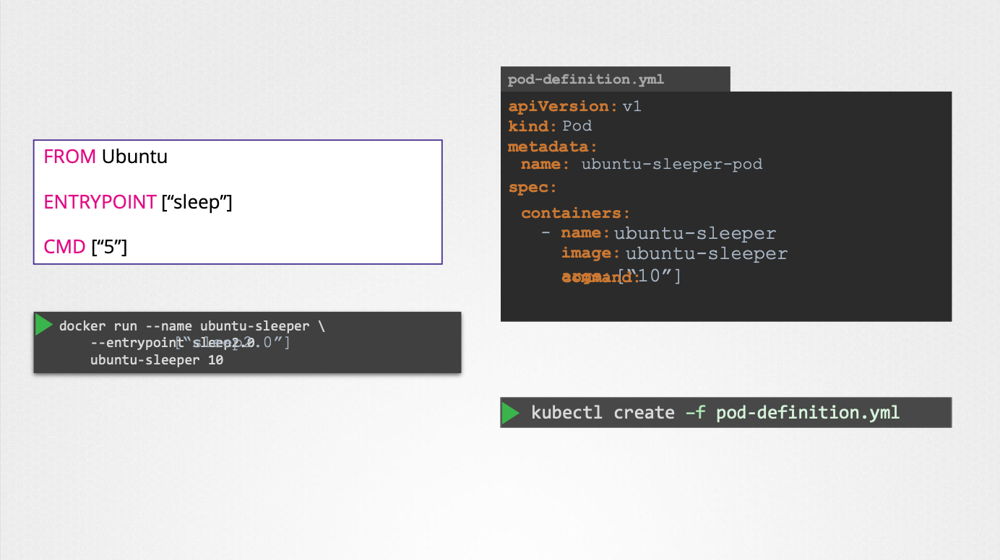
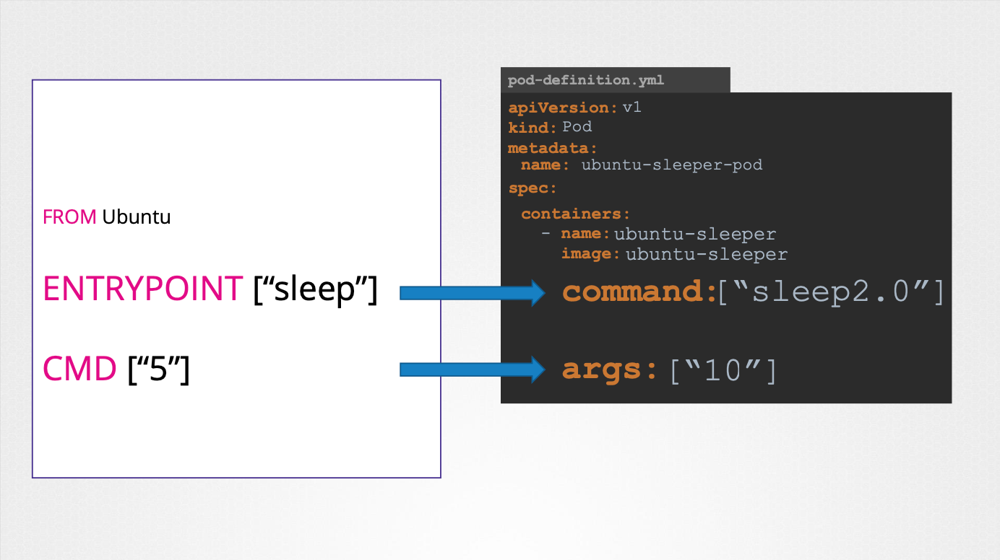

# Command

- 이번 장에서는 **Certified Kubernetes Administrator (CKA)** 을 준비하며 "커맨드"에 대해서 알아보도록 한다.

---

### Command

#### Docker 컨테이너와 프로세스



- Docker 컨테이너는 가상 머신과 달리 운영 체제를 호스팅하는 것이 아니라 특정 작업 또는 프로세스를 실행하기 위한 것이다.
- 컨테이너 내부의 프로세스가 살아있는 동안만 컨테이너가 실행된다.
- 프로세스가 완료되거나 충돌하면 컨테이너가 종료된다.

#### CMD (Command) 명령어





- Docker 이미지의 기본 명령을 정의한다.
- 컨테이너가 시작될 때 실행되는 프로그램을 지정한다.
- 예시:
  - NGINX 이미지: `CMD ["nginx", "-g", "daemon off;"]` (NGINX 서버 실행)
  - MySQL 이미지: `CMD ["mysqld"]` (MySQL 서버 실행)
  - Ubuntu 이미지: `CMD ["bash"]` (bash 쉘 실행)
- `docker run` 명령에 추가 명령을 지정하여 기본 명령을 재정의할 수 있다.
  - 예시: `docker run ubuntu sleep 5` (Ubuntu 컨테이너에서 `sleep 5` 실행)



#### CMD 명령어의 다양한 형식

- 쉘 형식: `CMD sleep 5`
- JSON 배열 형식: `CMD ["sleep", "5"]`
  - JSON 배열 형식에서는 실행 파일과 매개 변수를 별도의 요소로 지정해야 한다.
  - `CMD ["sleep 5]`와 같이 명령과 매개 변수를 함께 지정하면 오류가 발생한다.



- DOCKERFILE에서 `CMD` 명령어를 수정하여 이미지의 기본 명령을 영구적으로 변경할 수 있다.
- `docker build` 명령어를 사용하여 수정된 Dockerfile로 새 이미지를 빌드한다.
  - 예시: `docker build -t ubuntu-sleeper .`

#### ENTRYPOINT (진입점) 명령어



- 컨테이너가 시작될 때 실행되는 프로그램을 지정한다.
- `docker run` 명령에 지정된 매개 변수가 진입점에 추가된다.
- 예시
  - Dockerfile: `ENTRYPOINT ["sleep"]`
  - `docker run ubuntu-sleeper 10`: `sleep 10` 실행

#### CMD와 ENTRYPOINT의 차이점

- CMD: `docker run` 명령에 지정된 명령으로 완전히 대체된다.
- ENTRYPOINT: `docker run` 명령에 지정된 매개 변수가 추가된다.

#### CMD와 ENTRYPOINT 함께 사용



- `docker run` 명령에 매개 변수가 지정되지 않은 경우 기본값을 설정하기 위해 CMD와 ENTRYPOINT를 함께 사용할 수 있다.
- 예시:
  - Dockerfile: `ENTRYPOINT ["sleep"]`, `CMD ["5"]`
  - `docker run ubuntu-sleeper`: `sleep 5` 실행
  - `docker run ubuntu-sleeper 10`: `sleep 10` 실행
- CMD와 ENTRYPOINT를 함께 사용하는 경우 JSON 배열 형식을 사용해야 한다.

#### ENTRYPOINT 런타임 재정의

- `docker run` 명령에 `--entrypoint` 옵션을 사용하여 ENTRYPOINT를 런타임에 재정의할 수 있다.
- 예시:
  - Dockerfile: `ENTRYPOINT ["sleep"]`
  - `docker run --entrypoint "sleep2.0 ubuntu-sleeper 10`: `sleep2.0 10` 실행







```yaml title=Dockerfile
FROM ubuntu
ENTRYPOINT ["sleep"]
CMD ["5"]
```

- 빌드: `docker build -t ubuntu-sleeper .`
- 실행:
  - `docker run ubuntu-sleeper`: `sleep 5` 실행
  - `docker run ubuntu-sleeper 10`: `sleep 10` 실행
  - `docker run --entrypoint "sleep2.0 ubuntu-sleeper 10`: `sleep2.0 10` 실행

#### 쿠버네티스 Pod 정의 파일

- Pod 정의 파일에서 `command`와 `args` 필드를 사용하여 Docker 이미지의 `ENTRYPOINT`와 `CMD` 명령어를 재정의할 수 있다.
- `command` 필드: Docker 이미지의 `ENTRYPOINT` 명령어를 재정의한다.
- `args` 필드: Docker 이미지의 `CMD` 명령어를 재정의한다.

- 아래와 같은 Dockerfile이 있다고 가정한다.

```Dockerfile title=ubuntu.yaml
FROM Ubuntu

ENTRYPOINT ["sleep"]

CMD ["5"]
```

- 아래와 같이 Pod 정의 파일을 작성하여 Dockerfile의 기본 대기 시간을 사용할 수 있다.

```yaml
apiVersion: v1
kind: Pod
metadata:
  name: ubuntu-sleeper-pod
spec:
  containers:
    - name: ubuntu-sleeper-container
      image: ubuntu-sleeper
```

- 이 Pod를 생성하면 `ubuntu-sleeper` 이미지가 실행되고 기본적으로 5초 동안 대기한다.
  
- 아래와 같이 Pod 정의 파일을 작성하여 Dockerfile의 기본 대기 시간을 변경할 수 있다.

```yaml
apiVersion: v1
kind: Pod
metadata:
  name: ubuntu-sleeper-pod
spec:
  containers:
    - name: ubuntu-sleeper-container
      image: ubuntu-sleeper
      args: ["10"]
```

- `args: ["10"]`을 추가하여 `CMD` 명령어를 재정의하고 10초 동안 대기하도록 변경하였다.

#### ENTRYPOINT 재정의

```yaml
apiVersion: v1
kind: Pod
metadata:
  name: ubuntu-sleeper-pod
spec:
  containers:
    - name: ubuntu-sleeper-container
      image: ubuntu-sleeper
      command: ["sleep2.0"]
      args: ["10"]
```

- `command: ["sleep2.0"]`을 추가하여 `ENTRYPOINT` 명령어를 재정의하고 `sleep2.0` 명령어를 실행하도록 변경했다.
- `args: ["10"]`은 `sleep2.0` 명령어에 10초를 매개변수로 전달한다.

---

### 참고한 강의

- [Kubernetes for the Absolute Beginners](https://www.udemy.com/course/learn-kubernetes)
- [Certified Kubernetes Administrator (CKA)](https://www.udemy.com/course/certified-kubernetes-administrator-with-practice-tests)