# ConfigMap

- 이번 장에서는 **Certified Kubernetes Administrator (CKA)** 을 준비하며 "ConfigMap"에 대해서 알아보도록 한다.

---

### Environment Variables

#### 환경 변수 사용 예시

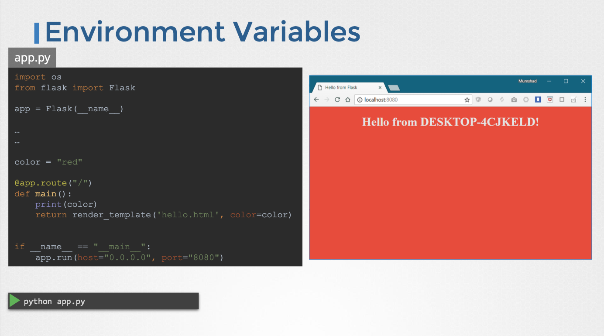

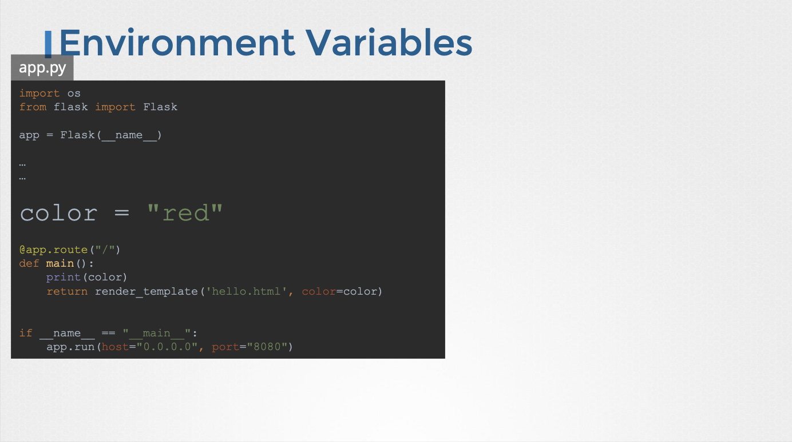

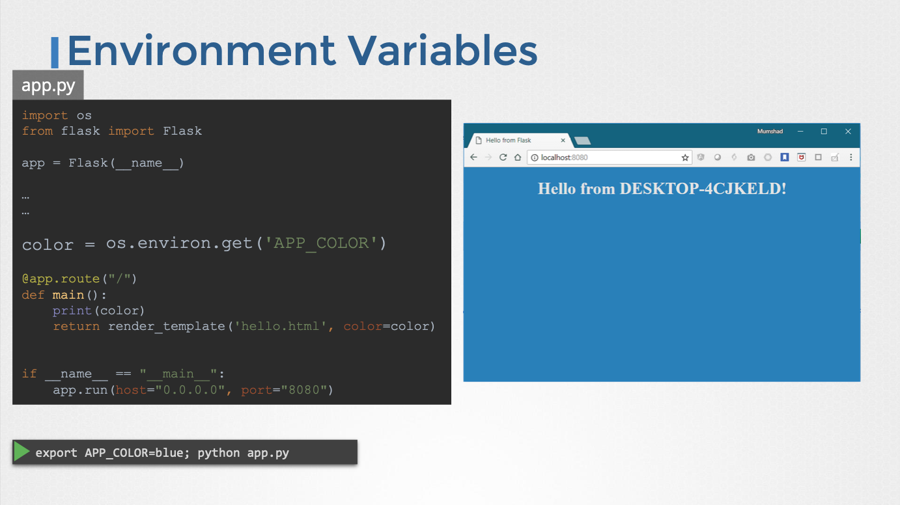

#### 도커에서의 환경 변수

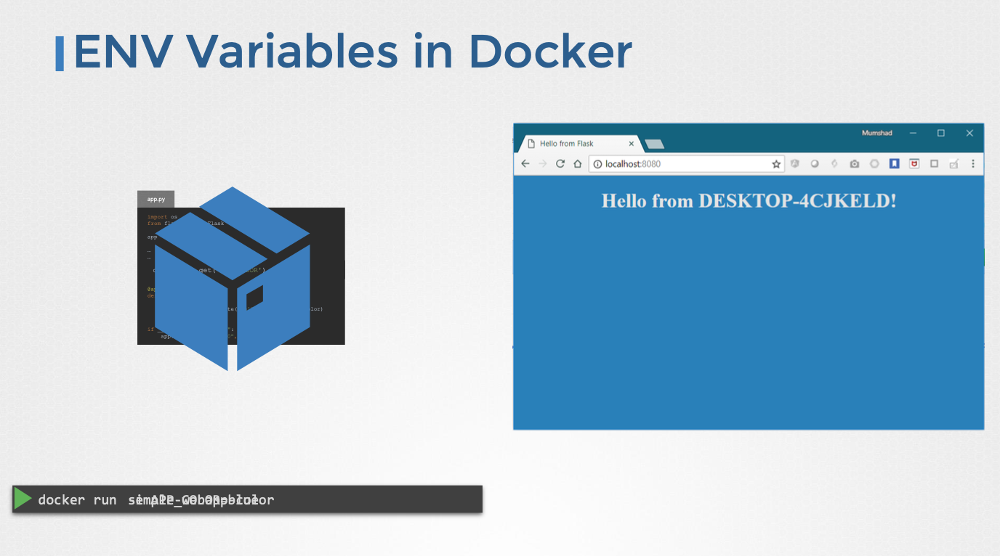

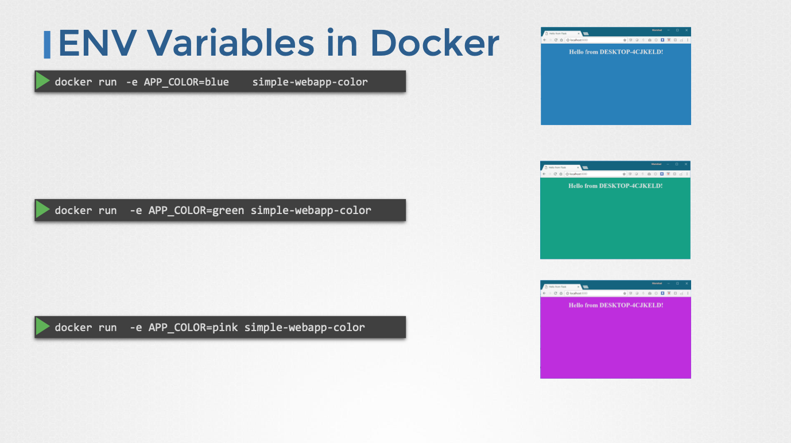

#### 쿠버네티스에서의 환경 변수

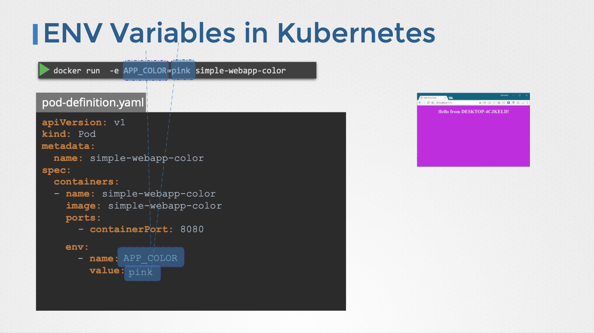

#### 변수 유형

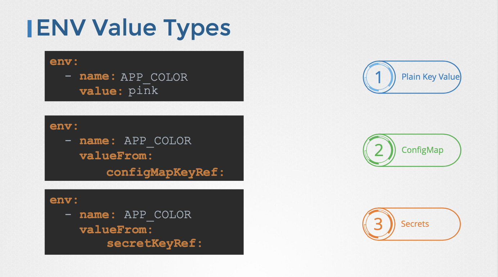

---

### ConfigMap

#### 필요성

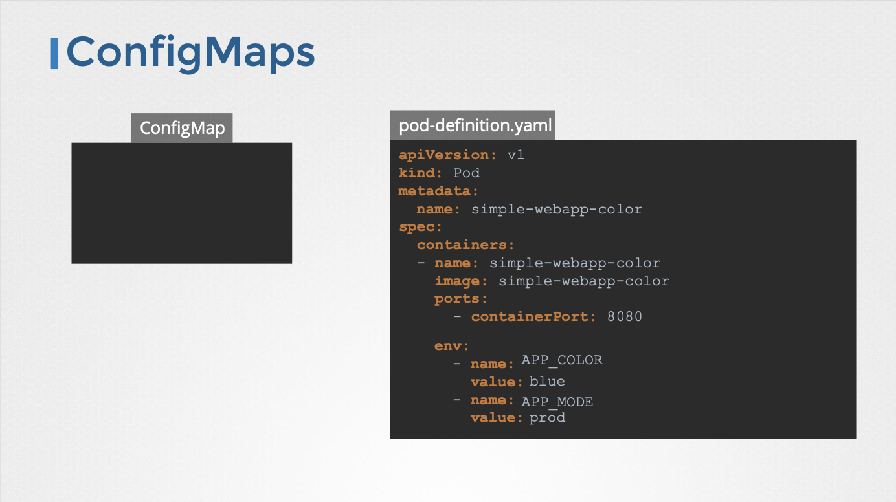

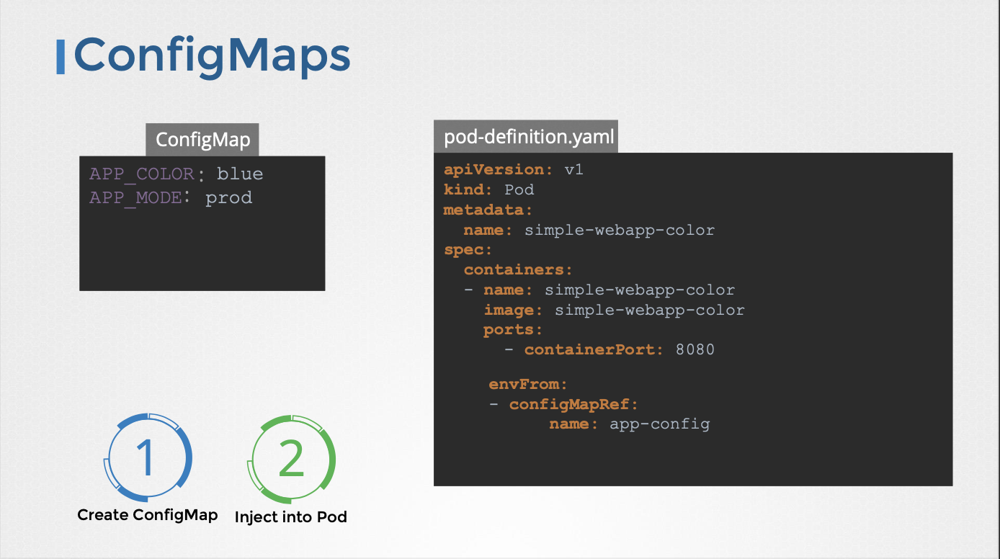

- Pod 정의 파일에 직접 환경 변수를 정의하면 관리하기 어려워진다.
- ConfigMap은 키-값 쌍 형태의 설정 데이터를 중앙 집중적으로 관리한다.
- Pod 생성 시 ConfigMap을 주입하여 컨테이너 내부 애플리케이션에서 환경 변수를 사용할 수 있도록 한다.

#### 생성 방법

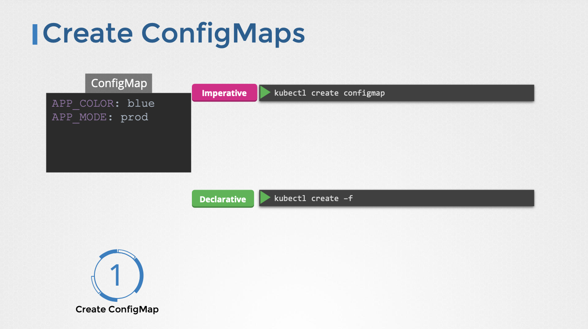

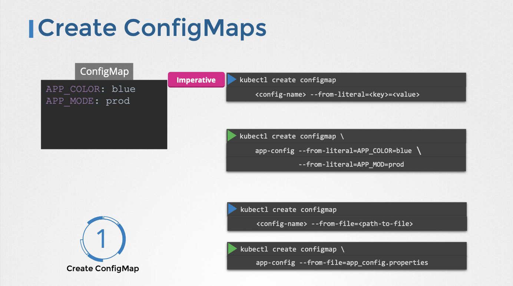

- **명령형 방식 (Imperative)**:
  - ConfigMap 정의 파일 없이 `kubectl create configmap` 명령어를 사용한다.
  - `--from-literal` 옵션을 사용하여 키-값 쌍을 직접 지정한다.
    - 예시: `kubectl create configmap app-config --from-literal=app_color=blue`
  - `--from-file` 옵션을 사용하여 파일에서 설정 데이터를 읽어온다.
    - 파일 이름이 키로 사용된다.

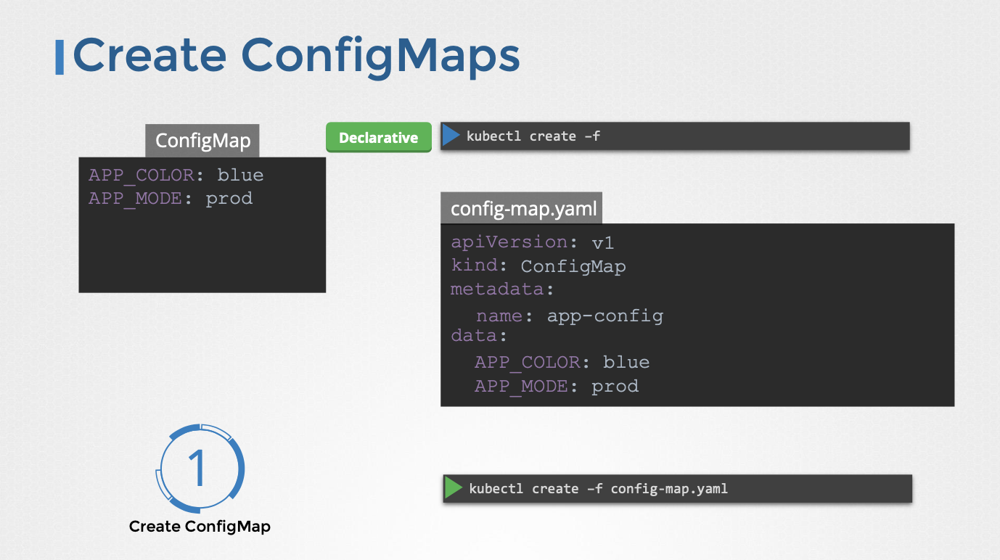

- **선언형 방식 (Declarative)**:
  - ConfigMap 정의 YAML 파일을 생성한다.
  - `apiVersion: v1`, `kind: ConfigMap`을 사용한다.
  - `metadata.name`으로 ConfigMap 이름을 지정한다.
  - `data` 필드에 키-값 쌍을 정의한다.
  - `kubectl create -f <configmap-definition.yaml>` 명령어를 사용하여 ConfigMap을 생성한다.
- 아래는 선언형 방식을 사용할 때의 예시 정의 파일이다.

```yaml title=app-config.yaml
apiVersion: v1
kind: ConfigMap
metadata:
  name: app-config
data:
  app_color: blue
  app_size: large
```

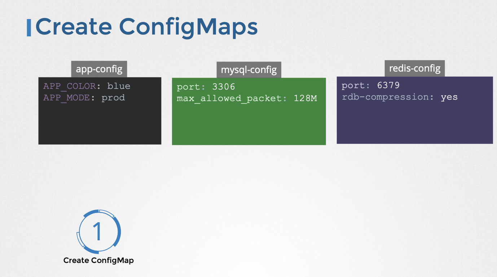

#### 확인

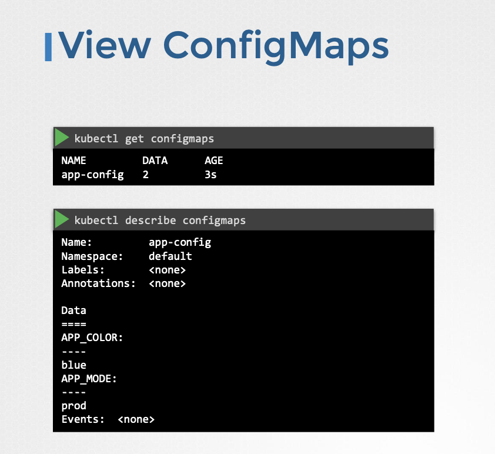

- `kubectl get configmaps` 명령어를 사용하여 ConfigMap 목록을 확인한다.
- `kubectl describe configmap <configmap-name>` 명령어를 사용하여 ConfigMap의 상세 정보를 확인한다. (`data` 섹션에서 키-값 쌍을 확인할 수 있다.)

#### Pod에 ConfigMap 주입

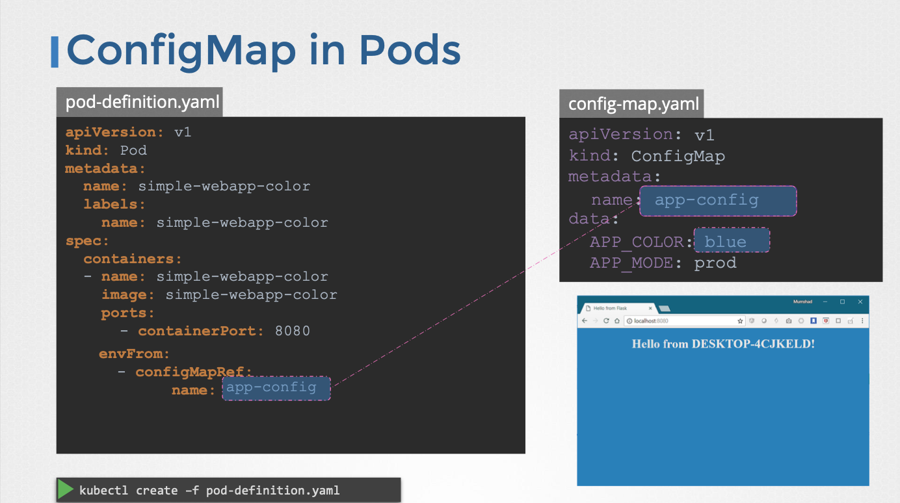

- Pod 정의 파일의 `spec.containers.envFrom` 필드를 사용하여 ConfigMap을 환경 변수로 주입한다.
- `envFrom`은 리스트 형태이므로 여러 ConfigMap을 주입할 수 있다.
- `configMapRef.name` 필드를 사용하여 주입할 ConfigMap 이름을 지정한다.
- 아래는 예시이다.

```yaml title=pod-with-configmap.yaml
apiVersion: v1
kind: Pod
metadata:
  name: web-app-pod
spec:
  containers:
    - name: web-app-container
      image: <웹 애플리케이션 이미지>
      envFrom:
        - configMapRef:
            name: app-config
```

- Pod 생성 후 컨테이너 내부 애플리케이션에서 `app_color`와 `app_size` 환경 변수를 사용할 수 있다.

#### 주입 방식

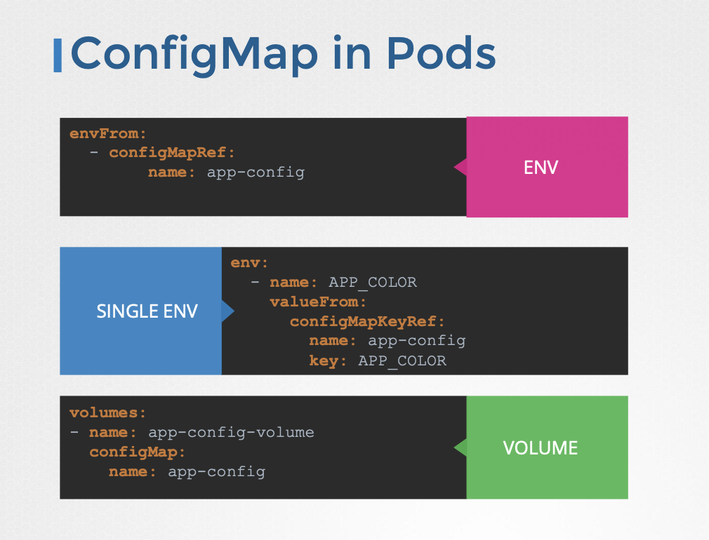

- `envFrom`을 사용하여 모든 키-값 쌍을 환경 변수로 주입할 수 있다.
- 개발 환경 변수로 주입하거나 볼륨에 파일 형태로 주입하는 방법도 있다.
- ConfigMap 이름은 나중에 Pod와 연결할 때 사용되므로 적절하게 지정해야 한다.
- 여러 ConfigMap을 생성하여 다양한 용도로 사용할 수 있다. (예: 애플리케이션 설정, 데이터베이스 설정, Redis 설정)

---

### 참고한 강의

- [Kubernetes for the Absolute Beginners](https://www.udemy.com/course/learn-kubernetes)
- [Certified Kubernetes Administrator (CKA)](https://www.udemy.com/course/certified-kubernetes-administrator-with-practice-tests)