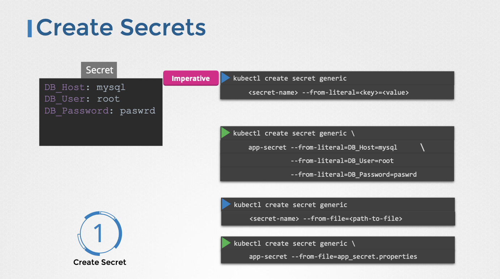

# Secret

- 이번 장에서는 **Certified Kubernetes Administrator (CKA)** 을 준비하며 "Secret"에 대해서 알아보도록 한다.

---

### Secret

#### 필요성


- 애플리케이션 코드에 데이터베이스 비밀번호와 같은 민감한 정보를 직접 하드코딩하는 것은 보안상 위험하다.
- ConfigMap은 일반 텍스트 형태로 데이터를 저장하므로 비밀번호와 같은 민감한 정보를 저장하기에 적합하지 않다.
- Secret은 비밀번호, API 키, 인증서 등 민감한 정보를 안전하게 저장하고 관리하기 위해 사용된다.

#### 특징


- ConfigMap과 유사하게 키-값 형태로 데이터를 저장한다.
- 데이터는 인코딩된 형태로 저장되어 보안성을 높인다.

#### 생성 방법




- **명령형 방식 (Imperative)**:
  - `kubectl create secret generic` 명령어를 사용한다.
  - `--from-literal` 옵션을 사용하여 키-값 쌍을 직접 지정한다.
    - 예시: `kubectl create secret generic app-secret --from-literal=DB_host=MySQL`
  - `--from-file` 옵션을 사용하여 파일에서 Secret 데이터를 읽어올 수 있다.


- **선언형 방식 (Declarative)**:
  - Secret 정의 YAML 파일을 생성한다.
  - `apiVersion: v1`, `kind: Secret`을 사용한다.
  - `metadata.name`으로 Secret 이름을 지정한다.
  - `data` 필드에 키-값 쌍을 정의한다.
  - 주의: Secret 값은 반드시 인코딩된 형태로 지정해야 한다.
  - `kubectl create -f <secret-definition.yaml>` 명령어를 사용하여 Secret을 생성한다.
- 아래는 Secret 정의 파일 예시다.

```yaml title=secret.yaml
apiVersion: v1
kind: Secret
metadata:
  name: app-secret
data:
  DB_Host: <base64 인코딩된 호스트>
  DB_User: <base64 인코딩된 사용자>
  DB_Password: <base64 인코딩된 비밀번호>
```

- `DB_Host`, `DB_User`, `DB_Password` 값은 base64로 인코딩되어야 한다.

#### Encoding


- `echo -n '<평문>' | base64` 명령어를 통해서 base64 인코딩할 수 있다.


- `kubectl get secrets` 명령어를 사용하여 Secrets 목록을 확인한다. (쿠버네티스 내부 용도로 생성된 Secrets도 함께 표시된다.)
- `kubectl describe secrets <secret-name>` 명령어를 사용하여 Secrets의 속성을 확인한다. (Secret 값은 숨겨져 있다.)
- `kubectl get secret <secret-name> -o yaml` 명령어를 사용하여 Secret의 모든 내용을 YAML 형식으로 출력하고 인코딩된 Secret 값을 확인할 수 있다.

#### Decoding


- `echo -n '<인코딩된 값>' | base64 -d` 명령어를 사용하여 base64로 인코딩된 값을 디코딩할 수 있다.

#### Secret in Pod


- Pod 정의 파일은 `spec.containers.envFrom` 필드를 사용하여 Secret을 환경 변수로 주입한다.
- `envFrom`은 리스트 형태이므로 여러 Secret을 주입할 수 있다.
- `secretRef.name` 필드를 사용하여 주입할 Secret 이름을 지정한다.


#### Volume Mount


- Secret을 볼륨으로 마운트하여 Pod 내부에서 파일 형태로 사용할 수 있다.
- Secret의 각 키-값 쌍은 파일로 생성되며 파일 내용은 Secret 값이다.
- 예시:
  - `app-secret` Secret에 `DB_User`, `DB_Password`, `DB_Host` 키가 있는 경우, Pod 내부에 `DB_User`, `DB_Password`, `DB_Host` 파일이 생성된다.
  - `DB_Password` 파일의 내용은 데이터베이스 비밀번호다.

#### 보안 고려 사항

- 인코딩 vs 암호화: Secret은 인코딩만 되어 있으며 암호화되지 않았다. base64 디코딩을 통해 누구나 Secret 값을 확인할 수 있다.
- 소스 코드 관리: Secret 정의 파일을 GitHub와 같은 소스 코드 관리 시스템에 저장하지 않도록 주의해야 한다.
- etcd 암호화: etcd에 저장된 데이터는 기본적으로 암호화되지 않는다. etcd의 Secret 데이터를 암호화하려면 etcd 암호화를 활성화해야 한다.
  - `kube-apiserver`에 암호화 설정 파일을 추가하여 etcd에 저장되는 Secret 데이터를 암호화할 수 있다.
- RBAC 설정: 동일한 네임스페이스에서 Pod 또는 Deployment를 생성할 수 있는 사용자는 Secret에 접근할 수 있다. RBAC를 설정하여 접근 권한을 제한해야 한다.
- 외부 Secret 제공자: "AWS Secret Manager", "Azure Key Vault", "GCP Secret Manager", "HashiCorp Vault"와 같은 외부 Secret 제공자를 사용하여 Secret을 관리하는 것을 고려해야 한다.
  - etcd가 아닌 외부 저장소에 Secret을 저장하여 보안을 강화한다.
  - 고급 보안 기능은 CKS(Certified Kubernetes Security Specialist) 자격증을 취득하면 습득할 수 있다.

---

### Encrypting Secret Data at Rest

#### 환경 설정

- 싱글 노드 쿠버네티스 클러스터(kubeadm, containerd 기반)를 시작한다.
- `kubectl create secret generic` 명령어를 사용하여 Secret 객체를 생성한다.
- `kubectl get secret`, `kubectl describe secret`, `kubectl get secret -o yaml` 명령어를 사용하여 Secret 객체를 확인한다.


- base64 디코딩을 통해 Secret 데이터가 인코딩되어 있음을 확인한다.

#### etcd 데이터 확인

- `etcdctl` 명령어를 사용하여 etcd에 저장된 Secret 데이터를 확인한다.
- `etcdctl` 클라이언트가 설치되어 있지 않은 경우, `apt-get install etcd-client`와 같은 명령어를 사용하여 설치한다.


- `ETCDCTL_API_VERSION=3 etcdctl ...` 명령어를 사용하여 etcd에 저장된 Secret 데이터를 조회한다.

```bash
ETCDCTL_API=3 etcdctl \
   --cacert=/etc/kubernetes/pki/etcd/ca.crt   \
   --cert=/etc/kubernetes/pki/etcd/server.crt \
   --key=/etc/kubernetes/pki/etcd/server.key  \
   get /registry/secrets/default/secret1 | hexdump -C
```

- Secret 데이터가 일반 텍스트 형태로 etcd에 저장되어 있음을 확인할 수 있다.


#### etcd 암호화 활성화 확인

- kube-apiserver의 `--encryption-provider-config` 옵션이 설정되어 있는지 확인한다.
- `ps aux | grep kube-apiserver` 명령어를 사용하여 kube-apiserver 프로세스의 옵션을 확인한다.


- `/etc/kubernetes/manifests/kube-apiserver.yaml` 파일을 확인하여 암호화 설정이 되어 있는지 확인한다.


#### 암호화 설정 파일 생성

- `encryption-configuration.yaml` 파일을 생성하여 암호화 설정을 정의한다.
- `apiVersion: apiserver.config.k8s.io/v1`, `kind: EncryptionConfiguration`을 사용한다.
- `resources` 필드에 암호화할 리소스(secrets)를 지정한다.
- `providers` 필드에 사용할 암호화 알고리즘(aescbc)과 암호화 키를 지정한다.
- 32바이트의 랜덤 키를 생성하여 암호화 키로 사용한다.
- 아래는 예시 파일이다.

```yaml 
apiVersion: apiserver.config.k8s.io/v1
kind: EncryptionConfiguration
resources:
  - resources:
    - secrets
    providers:
      - aescbc:
          keys:
            - name: key1
              secret: <base64 인코딩된 32바이트 랜덤 키>
      - identity: {}
```

#### kube-apiserver 설정 변경

- `/etc/kubernetes/manifests/kube-apiserver.yaml` 파일을 수정한다.
- `--encryption-provider-config` 옵션을 추가하여 암호화 설정 파일 경로를 지정한다.


- `volumes`와 `volumeMounts`를 추가하여 암호화 설정 파일을 kube-apiserver Pod에 마운트한다.


- kube-apiserver Pod가 재시작될 때까지 기다린다.
- `ps aux | grep kube-apiserver` 명령어를 사용하여 kube-apiserver 프로세스의 옵션을 확인하고, 암호화 설정이 적용되었는지 확인한다.


#### 암호화된 etcd 데이터 확인

- 암호화가 활성화된 후 새로운 Secret 객체를 생성한다.
- `etcdctl` 명령어를 사용하여 etcd에 저장된 새로운 Secret데이터가 암호화되어 있음을 확인한다.


- 암호화 활성화 전에 생성된 Secret 데이터는 암호화되지 않는다.
- `kubectl get secrets --all-namespaces -o json | kubectl replace -f -` 명령어를 사용하여 기존 Secret 객체를 업데이트하고 암호화된 상태로 etcd에 저장되도록 한다.

---

### 참고한 강의

- [Kubernetes for the Absolute Beginners](https://www.udemy.com/course/learn-kubernetes)
- [Certified Kubernetes Administrator (CKA)](https://www.udemy.com/course/certified-kubernetes-administrator-with-practice-tests)
- [Kubernetes Secret Docs](https://kubernetes.io/docs/concepts/configuration/secret/)
- [Encrypting Confidential Data at Rest](https://kubernetes.io/docs/tasks/administer-cluster/encrypt-data/)
- [HashiCorp Vault](https://www.vaultproject.io/)
- [Secret Store CSI Driver Tutorial](https://www.youtube.com/watch?v=MTnQW9MxnRI)
- [Generate Certificates Manually](https://kubernetes.io/docs/tasks/administer-cluster/certificates/)