# Scaling

- 이번 장에서는 **Certified Kubernetes Administrator (CKA)** 을 준비하며 "Scaling에 관련된 내용"에 대해서 알아보도록 한다.

---

### Multi Containers Pods

#### Microservices

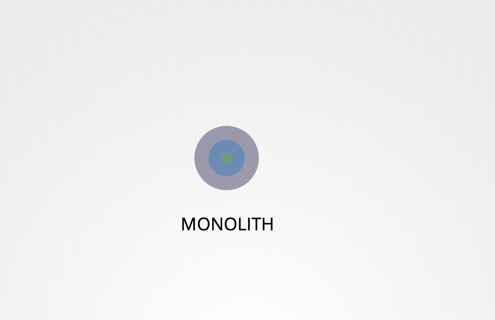

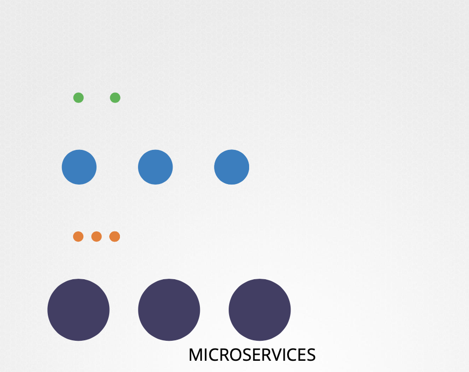

- 거대한 단일 애플리케이션(모놀리식 애플리케이션)을 작은 독립적인 하위 컴포넌트(마이크로서비스)로 분리하는 것은 개발 및 배포를 용이하게 한다.
- 각 마이크로서비스는 독립적으로 확장, 축소, 수정될 수 있다.

#### 다중 컨테이너 Pod 필요성

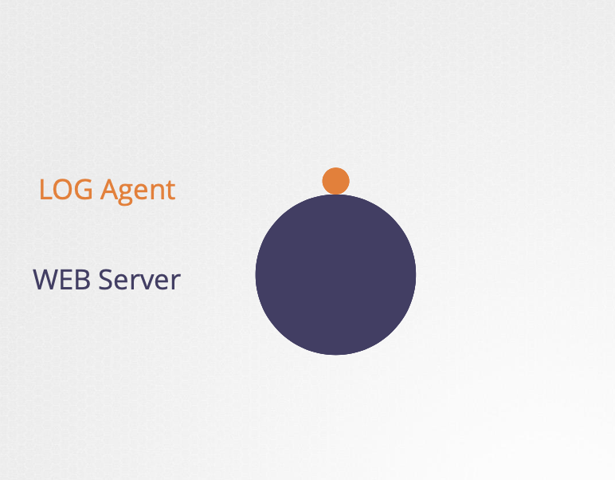

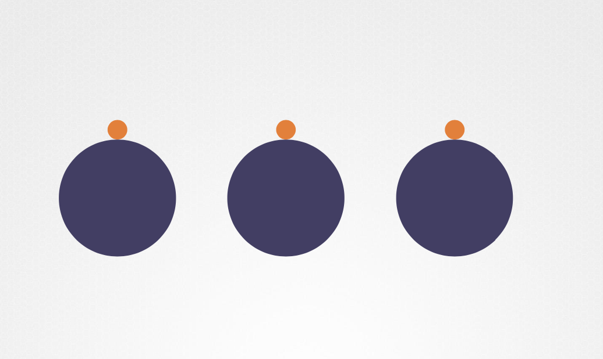

- 때로는 웹 서버와 로깅 서비스처럼 두 개의 서비스가 함께 작동해야 할 수 있다.
- 각 웹 서버 인스턴스에 하나의 로깅 에이전트 인스턴스를 페어링해야 한다.
- 각 서비스는 서로 다른 기능을 담당하므로 코들르 병합하거나 함께 로드하고 싶지 않다.
- 두 서비스가 함께 확장 및 축소될 수 있도록 하나의 Pod로 묶어야 한다.

#### 다중 컨테이너 Pod 장점

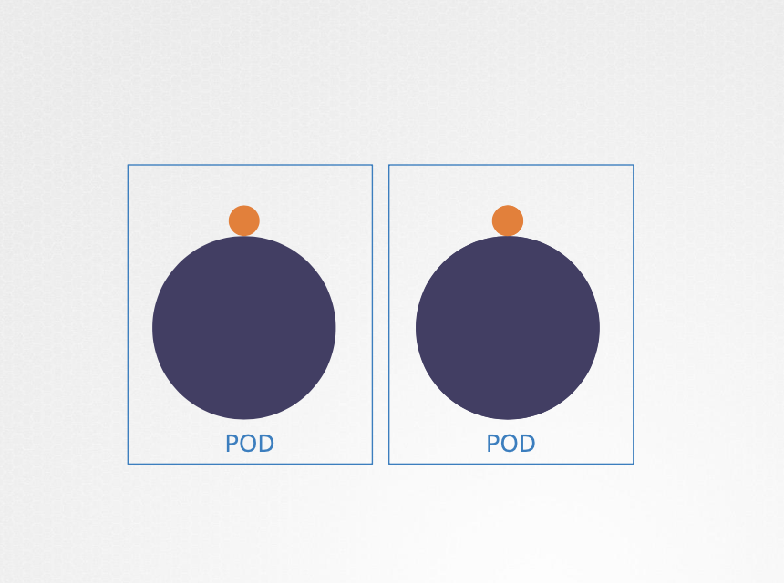

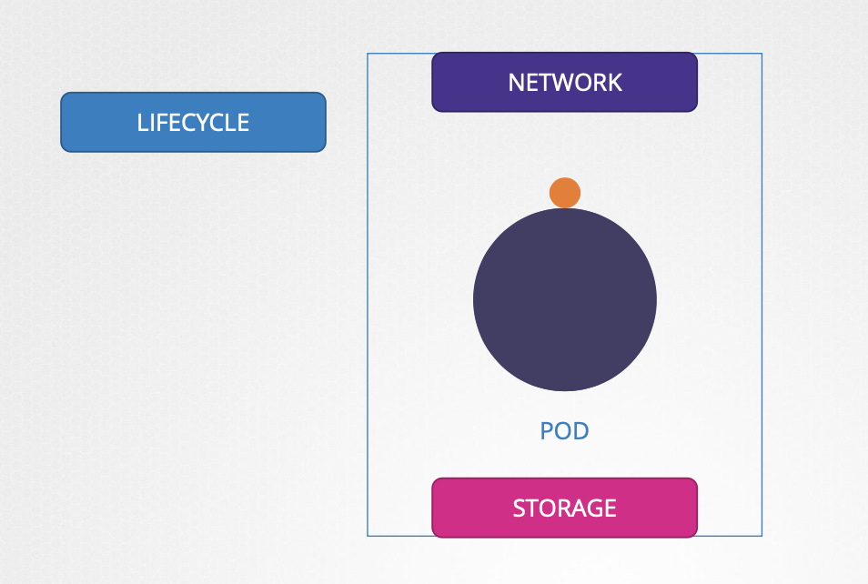

- **동일한 생명 주기**: 컨테이너들이 함께 생성되고 함게 소멸된다.
- **동일한 네트워크 공간 공유**: `localhost`를 통해 서로 통신할 수 있다.
- **동일한 스토리지 볼륨 공유**: 볼륨 공유 또는 서비스 설정을 통해 컨테이너 간 통신을 설정할 필요가 없다.

#### 다중 컨테이너 Pod 설정

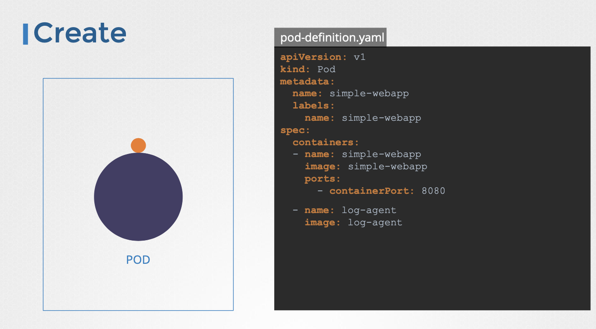

- Pod 정의 파일의 `spec.containers` 섹션에 새 컨테이너 정보를 추가한다.
- `containers` 섹션은 배열 형태이므로 여러 컨테이너를 정의할 수 있다.

#### 다중 컨테이너 디자인 패턴

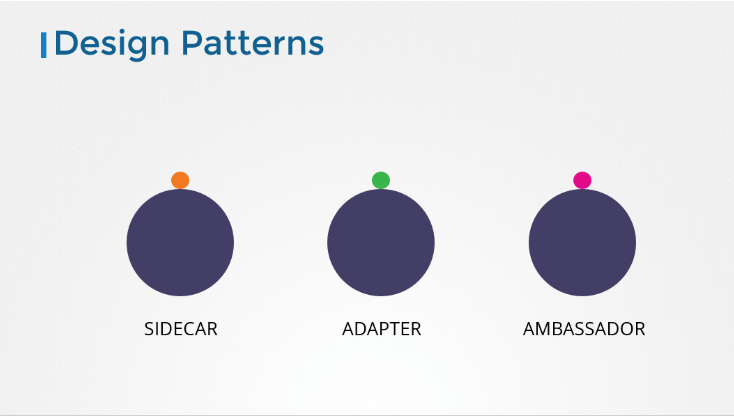

- 다중 컨테이너 Pod를 설계할 때 일반적인 패턴은 세 가지가 있다.
  - 사이드카 패턴
  - 어댑터 패턴
  - 앰배서더 패턴

---

### InitContainers

- 다중 컨테이너 Pod에서는 각 컨테이너가 Pod의 수명 주기 동안 생존하는 프로세스를 실행해야 한다.
  - 예를 들어, 웹 애플리케이션과 로깅 에이전트가 있는 다중 컨테이너 Pod에서는 두 컨테이너 모두 항상 생존할 것으로 예상된다.
  - 이 중 하나라도 실패하면 Pod가 재시작된다.
- 하지만 때로는 컨테이너에서 완료까지 실행되는 프로세스를 실행할 수도 있다.
  - 예를 들어, 메인 웹 애플리케이션에서 사용할 저장소에서 코드 또는 바이너리를 가져오는 프로세스다.
  - 이 작업은 Pod가 처음 생성될 때 한 번만 실행되는 작업이다.
  - 또는 실제 애플리케이션이 시작되기 전에 외부 서비스나 데이터베이스가 실행될 때까지 기다리는 프로세스다.
  - 여기서 "initContainers"가 등장한다.
- "initContainer"는 다른 모든 컨테이너와 마찬가지로 Pod에 구성되어 있지만 "initContainers" 섹션 내에 다음과 같이 지정되어 있다.

```yaml
apiVersion: v1
kind: Pod
metadata:
  name: myapp-pod
  labels:
    app: myapp
spec:
  containers:
  - name: myapp-container
    image: busybox:1.28
    command: ['sh', '-c', 'echo The app is running! && sleep 3600']
  initContainers:
  - name: init-myservice
    image: busybox
    command: ['sh', '-c', 'git clone <some-repository-that-will-be-used-by-application> ; done;']
```

- Pod가 처음 생성되면 "initContainer"가 실행되며 "initContainer"의 프로세스는 애플리케이션을 호스팅하는 실제 컨테이너가 시작되기 전에 완료될 때까지 실행되어야 한다.
- 다중 컨테이너 Pod에서 했던 것처럼 여러 개의 "initContainers"도 구성할 수 있다. 이 경우 각 "initContainer"는 순차적으로 한 번에 하나씩 실행된다.

```yaml
apiVersion: v1
kind: Pod
metadata:
  name: myapp-pod
  labels:
    app: myapp
spec:
  containers:
  - name: myapp-container
    image: busybox:1.28
    command: ['sh', '-c', 'echo The app is running! && sleep 3600']
  initContainers:
  - name: init-myservice
    image: busybox:1.28
    command: ['sh', '-c', 'until nslookup myservice; do echo waiting for myservice; sleep 2; done;']
  - name: init-mydb
    image: busybox:1.28
    command: ['sh', '-c', 'until nslookup mydb; do echo waiting for mydb; sleep 2; done;']
```

- "initContainers" 중 하나라도 완료하지 못하면 쿠버네티스는 "InitContainer"가 성공할 때까지 Pod를 반복적으로 재시작한다.

---

### Self Healing Applications

#### 자가 치유 (Self-Healing)

- 쿠버네티스는 애플리케이션의 안정성을 유지하기 위해 자가 치유 기능을 제공한다.
- 애플리케이션이 Pod 내에서 충돌(crash)하면 자동으로 Pod를 재생성하여 애플리케이션을 복구한다.

#### ReplicaSet & Replication Controller

- 이 두 컨트롤러는 Pod가 항상 정상적으로 실행되도록 보장한다.
- Pod 내의 애플리케이션이 충돌하면 자동으로 Pod를 재 생성한다.
- 또한, 원하는 수의 애플리케이션 복제본(replica)이 항상 실행되도록 유지한다.

#### Liveness and Readiness Probes

- Pod 내에서 실행되는 애플리케이션의 상태를 확인하고 피룡한 조치를 취하는 추가적인 기능이다.
- CKA 시험 범위에는 포함되지 않으며, CKAD 시험 범위에 포함된다.

---

### Auto-Scaling

#### 스케일링 개념

- **과거 물리 서버 환경**
  - 애플리케이션은 고정된 CPU 및 메모리 용량을 가진 물리서버에서 호스팅되었다.
  - 부하 증가 시 서버의 리소스를 늘리기 위해 애플리케이션을 중단하고 서버에 CPU 또는 메모리 리소스를 추가한 후 재시작했다. (Vertical Scaling)
  - 애플리케이션이 여러 인스턴스를 지원하는 경우, 서버를 추가하여 부하를 분산했다. (Horizontal Scaling)

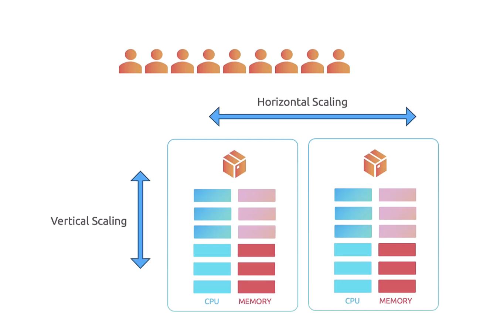

- **수직 스케일링 (Vertical Scaling)**: 기존 서버의 리소스를 증가시키는 것을 의미한다. (더 강력한 CPU, 더 많은 메모리 추가)
- **수평 스케일링 (Horizontal Scaling)**: 서버 또는 인스턴스를 추가하여 부하를 분산하는 것을 의미한다.

#### 쿠버네티스 스케일링

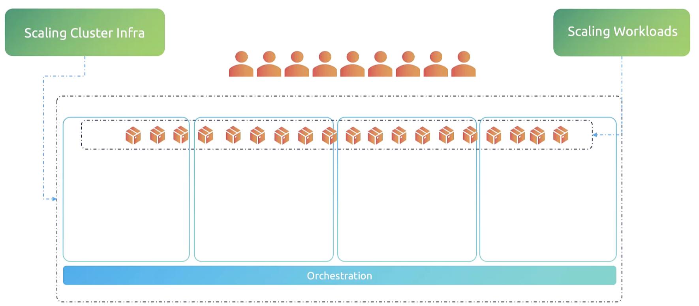

- 쿠버네티스는 컨테이너 오케스트레이터로서 애플리케이션을 컨테이너 형태로 호스팅하고 수요에 따라 스케일링하는 기능을 제공한다.
- 쿠버네티스 스케일링은 크게 두 가지 유형으로 나뉜다.
  - **워크로드 스케일링(Workload Scaling)**: 컨테이너 또는 Pod를 추가하거나 제거하여 애플리케이션의 규모를 조정한다.
  - **클러스터 인프라 스케일링(Cluster Infrastructure Scaling)**: 클러스터에 노드를 추가하거나 제거하여 클러스터의 규모를 조정한다.

#### 쿠버네티스 스케일링 유형별 수직/수평 스케일링

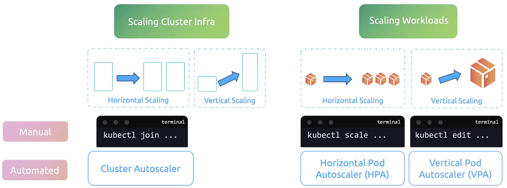

- 클러스터 인프라 스케일링:
  - 수평 스케일링: 클러스터에 노드를 추가한다.
  - 수직 스케일링: 클러스터의 기존 노드 리소스를 증가시킨다. (일반적으로 사용되지 않음)
- 워크로드 스케일링:
  - 수평 스케일링: Pod를 추가하거나 제거한다.
  - 수직 스케일링: Pod에 할당된 리소스를 증가시키거나 감소시킨다.
  
- 수동 스케일링:
  - 클러스터 인프라 수평 스케일링: 새 노드를 수동으로 프로비저닝하고 `kubectl join` 명령어를 사용하여 클러스터에 추가한다.
  - 클러스터 인프라 수직 스케일링: 일반적으로는 잘 사용되지 않으며 가상 머신 환경에서는 더 높은 리소스를 가진 새 서버를 프로비저닝하고 클러스터에 추가한 후 기존 서버를 제거하는 방식을 사용한다.
  - 워크로드 수평 스케일링: `kubectl scale` 명령어를 사용하여 Pod 수를 조정한다.
  - 워크로드 수직 스케일링: `kubectl edit` 명령어를 사용하여 Deployment, StatefulSet, ReplicaSet 등의 리소스 제한 및 요청을 변경한다.
- 자동 스케일링:
  - 클러스터 인프라 수평 스케일링: Kubernetes Cluster Autoscaler를 사용하여 자동으로 노드를 추가하거나 제거한다.
  - 워크로드 수평 스케일링: Horizontal Pod Autoscaler (HPA)를 사용하여 자동으로 Pod 수를 조정한다.
  - 워크로드 수직 스케일링: Vertical Pod Autoscaler (VPA)를 사용하여 자동으로 Pod에 할당된 리소스를 조정한다.

---

### Horizontal Pod Autoscaler (HPA)

#### 수동 워크로드 스케일링

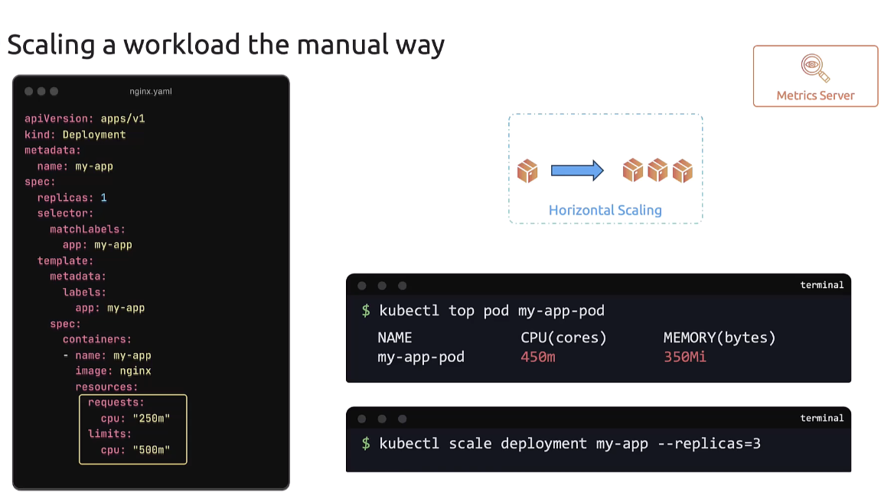

- 쿠버네티스 관리자는 `kubectl top pod` 명령어를 사용하여 Pod의 리소스 사용량을 모니터링한다. (Metrics Server 필요)
- Pod의 CPU 사용량이 임계값(예: 450 millicores)에 도달하면 `kubectl scale` 명령어를 사용하여 Deployment를 스케일 아웃한다.
- 문제점:
  - 관리자가 지속적으로 리소스 사용량을 모니터링해야 한다.
  - 수동으로 명령어를 실행해야 하므로 번거롭고 시간이 소요된다.
  - 갑작스러운 트래픽 급증에 신속하게 대응하기 어렵다.

#### 수평적 Pod 자동 스케일링(HPA)

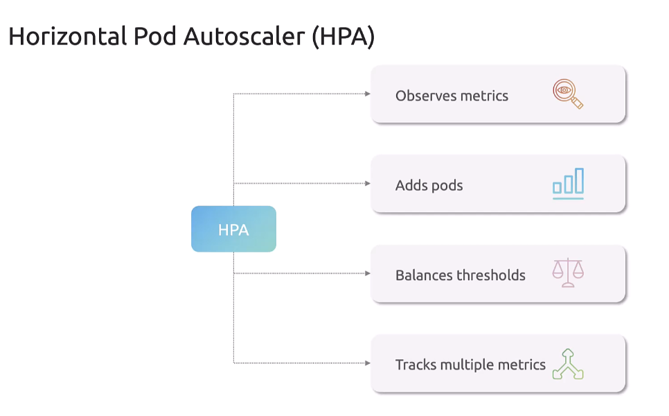

- HPA는 `kubectl top` 명령어와 같이 메트릭을 지속적으로 모니터링하고 CPU, 메모리 또는 사용자 정의 메트릭을 기반으로 Deployment, StatefulSet 또는 Pod 수를 자동으로 조정한다.
- CPU 또는 메모리 사용량이 임계값을 초과하면 HPA는 Pod를 추가하여 부하를 처리한다.
- 사용량이 감소하면 HPA는 추가 Pod를 제거하여 리소스를 절약한다.
- 여러 유형의 메트릭을 추적할 수 있다.

#### HPA 설정 방법

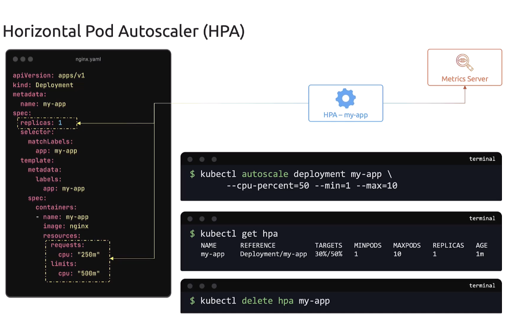

##### 명령형 방식 (Imperative)

- `kubectl autoscale deployment <deployment-name> --cpu-percent=<threshold> --min=<min-replicas> --max=<max-replicas>` 명령어를 사용하여 HPA를 생성한다.
  - 예시: `kubectl autoscale deployment my-app --cpu-percent=50 --min=1 --max=10`
- HPA는 Pod의 리소스 제한을 읽고, Metrics Server에서 사용량을 지속적으로 가져온다.
- 사용량이 임계값을 초과하면 Replica 수를 조정한다.
- `kubectl get hpa` 명령어를 사용하여 HPA 상태를 확인할 수 있다.
- `kubectl delete hpa <hpa-name` 명령어를 사용하여 HPA를 삭제할 수 있다.

##### 선언형 방식 (Declarative)

- HPA 정의 YAML 파일을 생성한다.
- `apiVersion: autoscaling/v2`, `kind: HorizontalPodAutoscaler`를 사용한다.
- `metadata.name`으로 HPA 이름을 지정한다.
- `spec.scaleTargetRef` 필드에 HPA가 모니터링할 Deployment 이름을 지정한다.
- `spec.minReplicas`, `spec.maxReplicas` 필드에 최소 및 최대 Replica 수를 지정한다.
- `spec.metrics` 필드에 모니터링할 리소스(CPU) 및 목표 사용률(50%)을 지정한다.
- `kubectl create -f <hpa-definition.yaml>` 명령어를 사용하여 HPA를 생성한다.

#### 작동 방식

- HPA는 Metrics Server에 의존하여 현재 리소스 사용량을 가져온다.
- Kubernetes 1.23버전부터 HPA는 내장되어 있으며 별도의 설치가 필요하지 않다.

#### 메트릭 소스

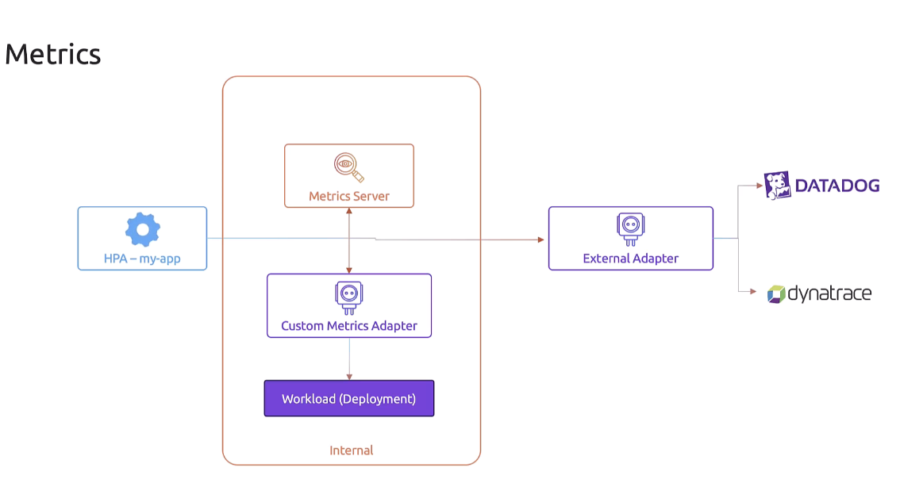

- **내부 Metrics Server**: Pod의 리소스 사용량을 가져온다.
- **Custom Metrics Adapter**: 클러스터 내부의 다른 소스(예: 워크로드)에서 정보를 가져온다.
- **External Metrics Adapter**: 클러스터 외부의 소스(예: Datadog, Dynatrace)에서 정보를 가져온다.

---

### In-Place Resize of Pods

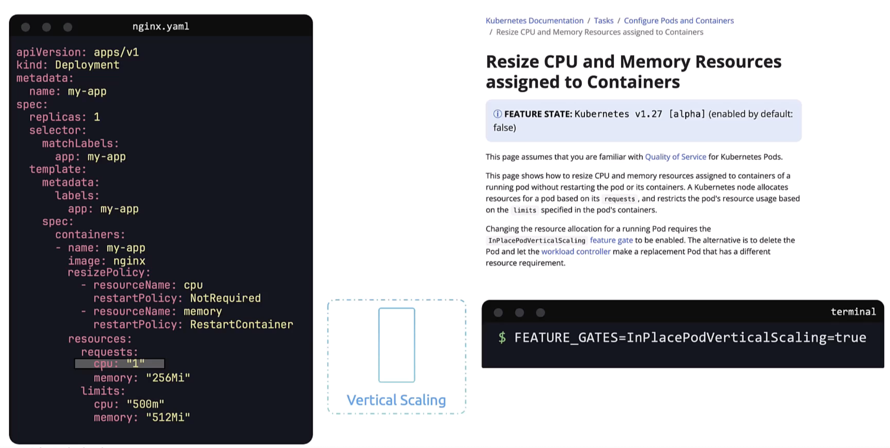

#### Pod 리소스 변경 기본 동작

- Kubernetes 1.32 버전 기준으로 Deployment의 Pod 리소스 요구 사항을 변경하면 기존 Pod를 삭제하고 변경 사항이 적용된 새 Pod를 생성하는 것이 기본 동작이다.
- 이는 Pod 리소스 정의 변경이 제자리에서 발생하지 않음을 의미한다.

#### In-Place Pod Vertical Scaling

- 상태 저장 워크로드(stateful workload)에 대한 중단을 최소화하기 위해 개발 중인 기능이다.
- Kubernetes 1.27 버전에서 알파 기능으로 도입되었으며 기본적으로 활성화되지 않는다.
- Kubernetes 1.33 버전에서 베타 기능으로 출시될 예정이며, 이후 안정화될 예정이다.
- `InPlacePodVerticalScaling` 기능 플래그를 `true`로 설정하여 활성화할 수 있다.
- 활성화되면 Pod 정의 파일에서 리소스별 재시작 정책을 지정할 수 있다.

#### 리소스 재시작 정책

- `resizePolicy` 매개 변수를 사용하여 각 리소스(CPU, 메모리)에 대한 재시작 정책을 지정할 수 있다.

```yaml
resizePolicy:
  - resourceName: cpu
    restartPolicy: NotRequired
  - resourceName: memory
    restartPolicy: RestartContainer
```

- 위 예시에서 CPU 리소스 변경은 Pod 재시작을 요구하지 않지만, 메모리 리소스 변경은 컨테이너 재시작을 요구한다.
- 리소스를 변경하면 지정된 정책에 따라 Pod가 재시작되거나 In-Place 업데이트된다.

#### 제한 사항

- CPU 및 메모리 리소스만 조정할 수 있다.
- Pod QoS 클래스는 변경할 수 없다.
- InitContainer 및 Ephemeral 컨테이너는 이 방식으로 크기를 조정할 수 없다.
- 리소스 요청 및 제한은 설정 후 이동할 수 없다.
- 컨테이너 메모리 제한은 사용량보다 낮게 줄일 수 없다.
- 요청으로 인해 컨테이너가 불가능한 상태가 되면 원하는 메모리 제한이 가능해질 때까지 크기 조정 상태가 진행 중으로 유지된다.

---

### Vertical Pod Autoscaling (VPA)

#### Manual Vertical Scaling 방법

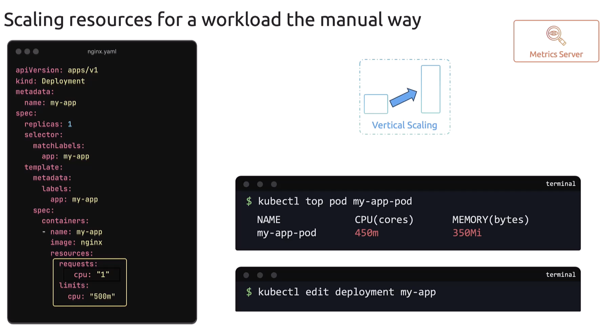

- 쿠버네티스 관리자는 `kubectl top pod` 명령어를 사용하여 Pod의 리소스 소비량(CPU, 메모리)을 실시간으로 모니터링한다. (Metric Server가 클러스터에 실행 중이어야 함)
- Pod의 리소스 소비량이 특정 임계값에 도달하면 `kubectl edit deployment` 명령어를 사용하여 배포 설정 파일의 Pod 템플릿 내 컨테이너 섹션에서 리소스 요청(requests) 및 제한(limits) 값을 수정한다.
- 변경 사항을 저장하면 쿠버네티스는 기존 Pod를 종료하고 새로운 리소스 설정이 적용된 새로운 Pod를 생성한다.

#### VPA의 필요성

- 수동 스케일링은 번거롭고 지속적인 모니터링이 필요하므로 자동화된 VPA를 사용하는 것이 효율적이다.
- VPA는 HPA와 유사하게 메트릭을 지속적으로 모니터링하고 Pod에 할당된 리소스를 자동으로 증감시켜 워크로드의 균형을 맞춘다.
- HPA와 달리 VPA는 기본적으로 쿠버네티스에 포함되지 않으므로 별도로 설치해야 한다.

#### VPA 설치 및 구성 요소

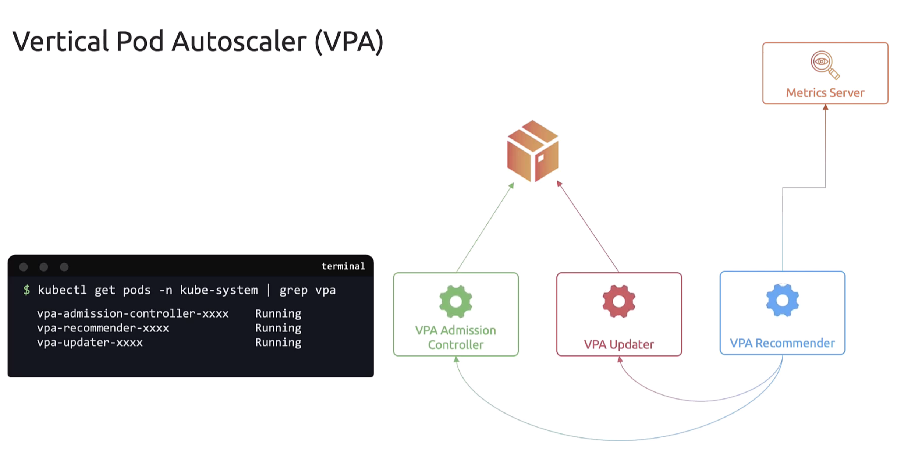

- GitHub 저장소에 있는 VPA 정의 파일을 적용하여 VPA를 설치한다.
- `kubectl get pods -n kube-system | grep` 명령어를 통해 VPA의 구성 요소 (Admission Controller, Recommender, Updater)가 정상적으로 실행 중인지 확인할 수 있다.

- **Recommender**:
  - 쿠버네티스 Metrics API로부터 Pod의 리소스 사용량을 지속적으로 모니터링하고 과거 및 실시간 사용 데이터를 수집한다.
  - 수집된 데이터를 기반으로 최적의 CPU 및 메모리 값을 추천한다.
  - Pod를 직접 수정하지 않고 추천만 제공한다.
- **Updater**:
  - Pod 생성 프로세스에 개입하여 Recommender의 추천을 기반으로 Pod 스펙(spec)을 변경한다.
  - 새로 생성되는 Pod가 올바른 리소스 요청으로 시작되도록 보장한다.
- **Admission Controller**:
  - Pod 생성 프로세스에 개입하여 Recommender의 추천을 기반으로 Pod 스펙(spec)을 변경한다.
  - 새로 생성되는 Pod가 올바른 리소스 요청으로 시작되도록 보장한다.

#### VPA 서비스 생성 및 설정

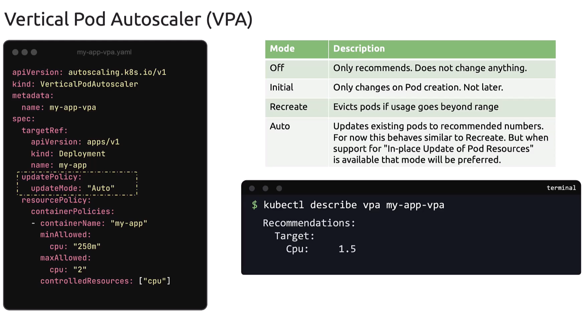

- VPA는 HPA와 달리 명령형 커맨드가 없으므로 정의 파일을 사용하여 생성해야 한다.
- 정의 파일의 주요 설정 항목은 아래와 같다.
  - `apiVersion: autoscaling.k8s.io/v1`: API 버전
  - `kind: VerticalPodAutoscaler`: 리소스 종류
  - `metadata.name`: VPA 이름
  - `spec.targetRef`: 모니터링 대상 배포
  - `spec.resourcePolicy.containerPolicies`: 모니터링 대상 컨테이너 설정 (최소 및 최대 허용 CPU/메모리)
  - `spec.updatePolicy.updateMode`: 업데이트 정책 모드 (Off, Initial, Recreate, Auto)
- VPA 업데이트 정책 모드 항목은 아래와 같다.
  - Off: 추천만 제공하고 아무 작업도 수행하지 않는다.
  - Initial: Pod 생성 시에만 변경 사항을 적용하고 이후에는 변경하지 않는다.
  - Recreate: 리소스 소비량이 지정된 범위를 벗어나면 Pod를 축출하고 재시작한다.
  - Auto: 현재는 Recreate와 동일하게 작동하지만 향후 쿠버네티스의 In-Place 업데이트 기능이 안정화되면 Pod 재시작 없이 리소스를 업데이트하는 방식으로 변경될 예정이다.
- `kubectl describe vpa <vpa-name>` 명령어를 사용하여 VPA의 추천 사항을 확인할 수 있다.

#### HPA / VPA 비교 및 선택 가이드

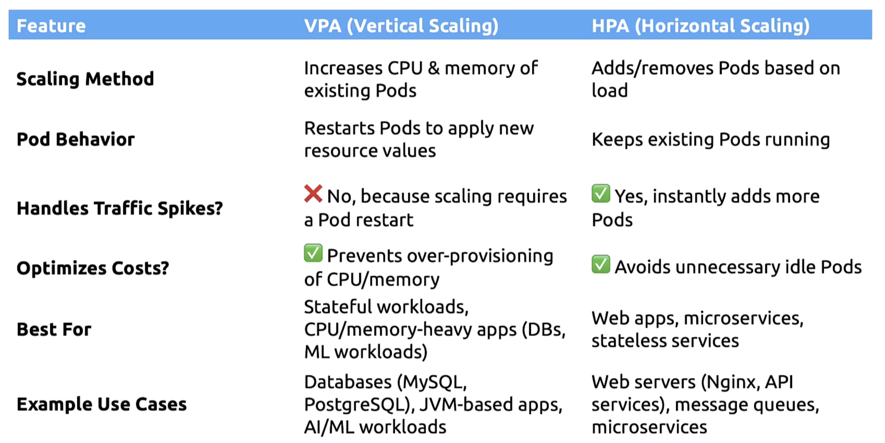

- 스케일링 방식
  - VPA: Pod의 CPU/메모리 리소스 증감 또는 재시작
  - HPA: Pod 개수 증감
- Pod 동작
  - VPA: 리소스 변경 시 Pod 재시작 (다운타임 발생 가능)
  - HPA: 기존 Pod 유지, 새로운 Pod 추가
- 트래픽 급증 대응
  - VPA: Pod 재시작으로 인해 즉각적인 대응 어려움
  - HPA: 즉시 새로운 Pod 추가로 빠른 대응 가능
- 비용 최적화
  - VPA: 실제 사용량에 맞춰 리소스 할당 (과다 프로비저닝 방지)
  - HPA: 불필요한 유휴 Pod 방지
- 적합한 워크로드
  - VPA: Stateful 워크로드, CPU/메모리 집약적 애플리케이션 (데이터베이스, JVM 애플리케이션, AI/ML 워크로드)
  - HPA: 웹 애플리케이션, 마이크로서비스, Stateless 워크로드

---

### 참고한 강의

- [Kubernetes for the Absolute Beginners](https://www.udemy.com/course/learn-kubernetes)
- [Certified Kubernetes Administrator (CKA)](https://www.udemy.com/course/certified-kubernetes-administrator-with-practice-tests)