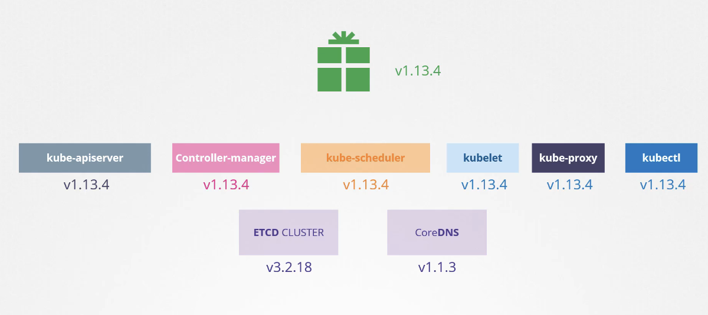
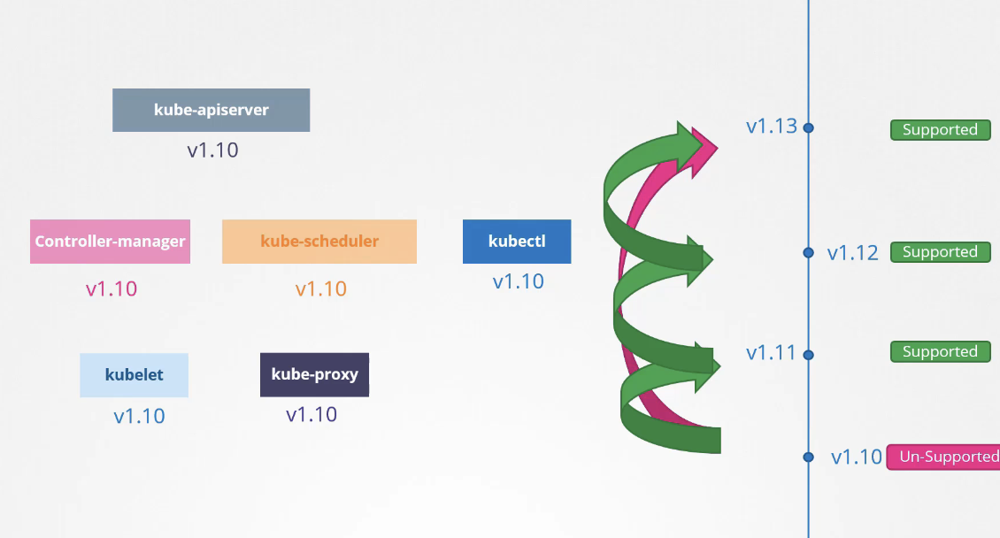

# Upgrade

- 이번 장에서는 **Certified Kubernetes Administrator (CKA)** 을 준비하며 "쿠버네티스 구성요소들을 업그레이드하는 방법"에 대해서 알아보도록 한다.

---

### OS Upgrade

#### 노드 다운 시 발생하는 상황

- 쿠버네티스 클러스터의 노드 중 하나가 다운되면 해당 노드에서 실행 중인 파드에 접근할 수 없게 된다.
- **다중 레플리카 파드**: 다른 노드에 레플리카가 존재하면 서비스에 영향이 없다. (예: 파란색 파드)
- **단일 레플리카 파드**: 해당 파드만 실행 중이었다면 서비스에 영향이 발생한다. (예: 초록색 파드)

- **파드 축출 타임아웃(pod-eviction-timeout)**:
  - 마스터 노드는 노드가 오프라인 상태가 되면 기본적으로 5분 동안 기다린다.
  - 5분 이내에 노드가 다시 온라인 상태가 되면 kubelet 프로세스가 시작되고 파드가 다시 온라인 상태가 된다.
  - 5분 이상 노드가 다운된 상태로 유지되면 마스터 노드는 해당 노드의 파드를 종료된 것으로 간주한다.
  - 레플리카 세트의 일부인 파드는 다른 노드에 다시 생성된다.
  - 레플리카 세트의 일부가 아닌 파드는 삭제된다.
  - `pod-eviction-timeout`은 컨트롤러 매니저에서 설정할 수 있다.

#### 안전한 노드 유지보수를 위한 방법

- **단순 재부팅**:
  - 워크로드에 다른 레플리카가 있고, 짧은 다운타임이 허용되며 5분 이내에 노드가 다시 온라인 상태가 될 것이 확실한 경우에 사용할 수 있다.
  - 그러나 노드가 언제 다시 온라인 상태가 될지 확실하게 예측할 수 없으므로 안전하지 않은 방법이다.
- **드레인(drain) 명령어**:
  - 노드에서 실행 중인 모든 워크로드를 안전하게 다른 노드로 이동시키는 명령어다.
  - 파드를 정상적으로 종료하고 다른 노드에 다시 생성한다.
  - 노드를 코돈(cordon)하여 새로운 파드가 스케줄링되지 않도록 한다.
  - 안전한 노드 유지보수를 위한 필수적인 명령어다.
- **코돈(cordon) 명령어**:
  - 노드를 스케줄링 불가능 상태로 만드는 명령어다.
  - 새로운 파드가 해당 노드에 스케줄링되는 것을 방지한다.
  - 기존 파드는 그대로 유지한다.
- **언코돈(uncordon) 명령어**:
  - 코돈된 노드를 스케줄링 가능 상태로 만드는 명령어다.
  - 새로운 파드가 해당 노드에 스케줄링될 수 있도록 한다.
  - 드레인된 노드가 다시 온라인 상태가 되면 언코돈을 통해 다시 사용할 수 있다.

#### 노드 유지보수 절차

1. **드레인(drain)**: `kubectl drain <node-name> --ignore-daemonsets` 명령어를 사용하여 노드에서 워크로드를 안전하게 이동시킨다. `--ignore-daemonsets` 옵션은 데몬셋을 무시하고 드레인을 진행한다.
2. **유지보수**: 노드에 필요한 유지보수 작업을 수행한다.
3. **언코돈(uncordon)**: `kubectl uncordon <node-name>` 명령어를 사용하여 노드를 스케줄링 가능 상태로 만든다.
4. **파드 재분배**: 이동된 파드는 자동으로 원래 노드로 돌아가지 않는다. 새로운 파드가 생성되거나 기존 파드가 삭제될 때 해당 노드에 스케줄링된다.

#### 요약

- 노드 다운 시 서비스 영향도를 최소화하기 위해 다중 레플리카 파드를 사용하는 것이 중요하다.
- "드레인(drain)"을 통해 워크로드를 안전하게 이동시키고, "코돈(cordon)"을 통해 새로운 파드 스케줄링을 방지하며, "언코돈(uncordon)"을 통해 노드를 다시 사용할 수 있도록 한다.

---

### Software Version

#### 버전 확인

- `kubectl get nodes` 명령어를 사용하여 노드의 버전을 확인할 수 있다.

#### 버전 번호 구성

- 쿠버네티스 버전 번호는 세 부분으로 구성된다.
  - **메이저 버전 (Major Version)**: 가장 큰 단위의 버전 번호다.
  - **마이너 버전 (Minor Version)**: 새로운 기능 및 기능 향상이 포함된 버전이다. 몇 개월마다 릴리즈된다.
  - **패치 버전 (Patch Version)**: 중요한 버그 수정이 포함된 버전이다. 더 자주 릴리즈된다.
- 예: `1.11.3` (1: 메이저 버전, 11: 마이너 버전, 3: 패치 버전)

#### 릴리즈 주기 및 안정화 버전

- 쿠버네티스 표준 소프트웨어 릴리즈 버전 관리 절차를 따른다.
- 몇 개월마다 마이너 릴리즈를 통해 새로운 기능과 기능 향상을 제공한다.
- 최초 메이저 버전인 `1.0`은 2015년 7월에 릴리즈되었다.

#### 알파 및 베타 버전

- 안정화 버전 외에도 알파 및 베타 릴리즈가 존재한다.
- **알파 릴리즈 (Alpha Release)**:
  - 새로운 기능 및 개선 사항이 처음 포함되는 리리즈다.
  - 기본적으로 기능이 비활성화되어 있으며 버그가 있을 수 있다.
- **베타 릴리즈 (Beta Release)**:
  - 알파 릴리즈에서 테스트를 거쳐 안정화된 기능이 포함된 릴리즈다.
  - 기본적으로 기능이 활성화되어 있으며 코드 안정성이 높다.
- **안정화 릴리즈 (Stable Release)**:
  - 충분한 테스트를 거쳐 안정성이 검증된 릴리즈다.
  - 프로덕션 환경에서 사용하기에 적합하다.

#### 릴리즈 정보 확인 및 다운로드

- 모든 릴리즈 정보는 쿠버네티스 GitHub 저장소의 릴리즈 페이지에서 확인할 수 있다.
- `Kubernetes.tar.gz` 파일을 다운로드 및 압축 해제하면 모든 쿠버네티스 구성 요소의 실행 파일을 확인할 수 있다.
- 다운로드된 패키지에는 동일한 버전의 모든 컨트롤 플레인 구성 요소가 포함되어 있다.

#### 외부 의존성 관리

- etcd 클러스터 및 CoreDNS 서버와 같은 컨트롤 플레인 내의 다른 구성 요소는 별도의 프로젝트이므로 자체 버전 번호를 가진다.
- 각 릴리즈의 릴리즈 노트는 etcd 및 CoreDNS와 같은 외부 종속 애플리케이션의 지원 버전에 대한 정보를 제공한다.

---

### Cluster Upgrade

#### 버전 호환성

- 쿠버네티스 클러스터의 모든 구성 요소가 동일한 버전을 가질 필요는 없다.
- **kube-apiserver**: 컨트롤 플레인의 핵심 구성 요소이며, 다른 모든 구성 요소와 통신한다.
- **controller-manager 및 kube-scheduler**: kube-apiserver보다 최대 1 낮은 마이너 버전을 설치할 수 있다.
  - 예: kube-apiserver 1.10, controller-manager/kube-scheduler 1.10 또는 1.9
- **kubelet 및 kube-proxy**: kube-apiserver보다 최대 2 낮은 마이너 버전을 설치할 수 있다.
  - 예: kube-apiserver 1.10, kubelet/kube-proxy 1.8, 1.9 또는 1.10
- **kubectl**: kube-apiserver보다 높거나, 같거나, 낮은 버전을 사용할 수 있다.

#### 업그레이드 시점

- 쿠버네티스는 최근 3개의 마이너 버전만 지원한다. 
  - 예: 1.12가 최신인 경우, 1.12, 1.11, 1.10 지원
- 새로운 마이너 버전 릴리즈 전에 클러스터를 다음 버전으로 업그레이드 하는 것이 좋다. (예: 1.13 릴리즈전 1.10 -> 1.11 업그레이드)

#### 업그레이드 방법

- **클라우드 관리형 쿠버네티스 (예: GKE)**: 클라우드 제공업체에서 제공하는 간편한 업그레이드 기능을 활용한다.
- **kubeadm**: 클러스터 계획 및 업그레이드를 지원하는 도구를 사용한다.
- **직접 구축**: 클러스터의 각 구성 요소를 수동으로 업그레이드한다.

#### kubeadm을 활용한 업그레이드 프로세스

- 마스터 노드 업그레이드
  - 마스터 노드 및 컨트롤 플레인 구성 요소 (kube-apiserver, kube-scheduler, kube-controller-manager)를 업그레이드한다.
  - 마스터 노드 업그레이드 중에는 컨트롤 플레인 구성 요소가 일시적으로 다운된다.
  - 워커 노드 및 워크로드는 정상적으로 작동하며 사용자 서비스에는 영향이 없다.
  - 마스터 노드가 다운되면 `kubectl` 및 API 서버를 통한 관리 기능이 중단된다.
  - 업그레이드 완료 후 마스터 노드 및 구성 요소는 최신 버전으로 업데이트된다.

##### 워커 노드 업그레이드 전략 - 1 (전체 동시 업그레이드)

- 모든 워커 노드를 동시에 업그레이드한다.
  - 장점: 빠른 업그레이드 가능
  - 단점: 서비스 다운타임 발생
  

##### 워커 노드 업그레이드 전략 - 2 (순차적 업그레이드)

- 워커 노드를 하나씩 순차적으로 업그레이드 한다.
  - 장점: 서비스 다운타임 최소화
  - 단점: 업그레이드 시간 증가

1. 첫 번째 워커 노드를 드레인하여 워크로드를 다른 노드로 이동시킨다.
2. 첫 번째 워커 노드를 업그레이드한다.
3. 업그레이드 완료 후 두 번째 워커 노드를 드레인하고 업그레이드한다.
4. 세 번째 워커 노드까지 동일한 과정을 반복한다.
5. 필요한 경우 1.11 -> 1.12, 1.12 -> 1.13 업그레이드를 동일한 방식으로 진행한다.

##### 워커 노드 업그레이드 전략 - 3 (신규 노드 추가 및 교체 전략)

- 최신 버전의 새 노드를 추가하고 기존 노드를 제거한다.
  - 장점: 다운타임 최소화, 클라우드 환경에서 편리
  - 단점: 추가 리소스 필요

1. 최신 버전의 새 워커 노드를 클러스터에 추가한다.
2. 기존 워커 노드의 워크로드를 새 노드로 이동시킨다.
3. 기존 워커 노드를 클러스터에서 제거한다.
4. 모든 기존 노드를 새 노드로 교체할 때까지 반복한다.

#### kubeadm을 활용한 업그레이드 개요

- kubeadm은 쿠버네티스 클러스터 업그레이드를 지원하는 도구다.
- `kubeadm upgrade plan` 명령어를 사용하여 업그레이드 계획을 확인하고 필요한 정보를 얻을 수 있다.
- kubeadm 도구 자체도 쿠버네티스와 동일한 버전 체계를 따르므로 클러스터 업그레이드 전에 kubeadm 도구를 먼저 업그레이드해야 한다.
- 쿠버네티스 클러스터는 한 번에 한 개의 마이너 버전만 업그레이드할 수 있다. (예: 1.11 -> 1.12 -> 1.13)
- kubeadm은 kubelet을 설치하거나 업그레이드하지 않으므로 kubelet은 수동으로 업그레이드해야 한다.

#### 업그레이드 계획 확인 (kubeadm upgrade plan)

- `kubeadm upgrade plan` 명령어를 실행하면 다음과 같은 정보를 확인할 수 있다.
  - 현재 클러스터 버전
  - kubeadm 도구 버전
  - 최신 안정화 쿠버네티스 버전
  - 컨트롤 플레인 구성 요소 및 업그레이드 가능 버전
  - 컨트롤 플레인 구성 요소 업그레이드 후 kubelet 수동 업그레이드 필요 안내
  - 클러스터 업그레이드 명령어(`kubeadm upgrade apply`)
- 이 정보를 통해 업그레이드 가능 여부 및 업그레이드 절차를 파악할 수 있다.

#### 마스터 노드 업그레이드

- **kubeadm 도구 업그레이드**
  - `apt-get upgrade kubeadm=<version>` 명령어를 사용하여 kubeadm 도구를 원하는 버전으로 업그레이드한다. 
- **클러스터 업그레이드** (`kubeadm upgrade apply`)
  - `kubeadm upgrade apply <version>` 명령어를 사용하여 클러스터를 업그레이드한다.
    - 예: `kubeadm upgrade apply v1.12.0`
  - 필요한 이미지를 다운로드하고 컨트롤 플레인 구성 요소를 업그레이드한다.

- **kubelet 업그레이드**
  - `apt-get upgrade kubelet=<version>` 명령어를 사용하여 kubelet을 업그레이드한다.
  - `systemctl restart kubelet` 명령어를 사용하여 kubelet 서비스를 재시작한다.
- **노드 상태 확인** (`kubectl get nodes`)
  - `kubectl get nodes` 명령어를 사용하여 마스터 노드가 업그레이드되었는지 확인한다.

#### 워커 노드 업그레이드 (순차적 업그레이드)

- **드레인** (`kubectl drain`)
  - `kubectl drain <node-name> --ignore-daemonsets` 명령어를 사용하여 워커 노드의 모든 파드를 안전하게 종료하고 다른 노드로 재스케줄링한다.
  - `--ignore-daemonsets` 옵션은 데몬셋 파드를 무시한다.
  - 드레인 명령어는 노드를 코돈하여 새로운 파드가 스케줄링되지 않도록 한다.
- **kubeadm 및 kubelet 업그레이드**
  - 마스터 노드와 동일한 방식으로 kubeadm 및 kubelet을 업그레이드한다.
- **노드 구성 업데이트** (`kubeadm upgrade node`)
  - `kubeadm upgrade node` 명령어를 사용하여 노드 구성을 새로운 kubelet 버전에 맞게 업데이트한다.
- **kubelet 서비스 재시작** (`systemctl restart kubelet`)
  - kubelet 서비스를 재시작한다.
- **언코돈 (`kubectl uncordon`)**
  - `kubectl uncordon <node-name>` 명령어를 사용하여 노드를 스케줄링 가능 상태로 만든다.
- **노드 상태 확인 (`kubectl get nodes`)**
  - `kubectl get nodes` 명령어를 사용하여 워커 노드가 업그레이드되었는지 확인한다.

- **다른 워커 노드 반복**
  - 나머지 워커 노드에 대해 동일한 단계를 반복한다.

#### 주의사항

- 드레인된 노드는 언코돈 후에도 파드가 즉시 돌아오지 않을 수 있다.
- 파드는 다른 노드에서 삭제되거나 새로운 파드가 스케줄링될 때 해당 노드로 돌아온다.
- 실제 환경에서는 애플리케이션 다운타임을 최소화하기 위해 순차적 업그레이드를 권장한다.

---

### 참고한 강의

- [Kubernetes for the Absolute Beginners](https://www.udemy.com/course/learn-kubernetes)
- [Certified Kubernetes Administrator (CKA)](https://www.udemy.com/course/certified-kubernetes-administrator-with-practice-tests)
- [The Kubernetes API](https://kubernetes.io/docs/concepts/overview/kubernetes-api/)
- [API Conventions](https://github.com/kubernetes/community/blob/master/contributors/devel/sig-architecture/api-conventions.md)
- [Changing the API](https://github.com/kubernetes/community/blob/master/contributors/devel/sig-architecture/api_changes.md)
- [Upgrading kubeadm clusters](https://kubernetes.io/docs/tasks/administer-cluster/kubeadm/kubeadm-upgrade/)