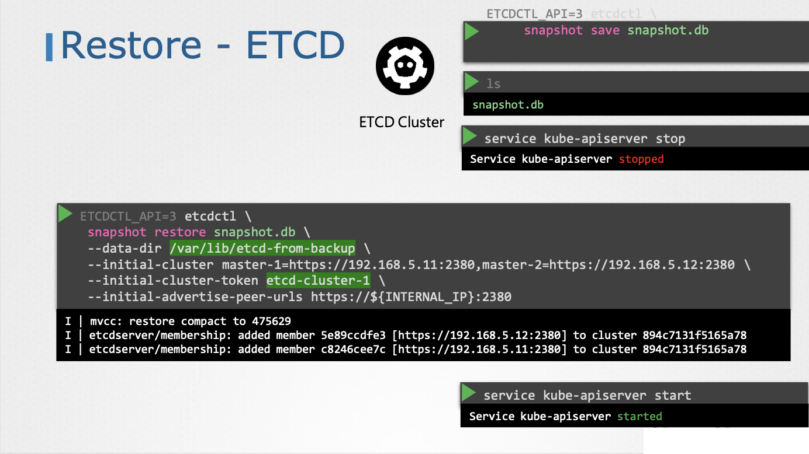

# Backup & Restore

- 이번 장에서는 **Certified Kubernetes Administrator (CKA)** 을 준비하며 "백업과 복구"에 대해서 알아보도록 한다.

---

### 고려 사항

- **ETCD Cluster**: 클러스터의 모든 관련 정보가 저장되는 핵심 구성 요소다.
- **Persistent Volumes**: 애플리케이션이 영구 스토리지를 사용하는 경우 해당 스토리지도 백업해야 한다.

#### 쿠버네티스 리소스 정의 파일

- 명령형 방식: `kubectl` 명령어를 사용하여 리소스를 생성하는 방식이다. (예: 네임스페이스, 시크릿, ConfigMap, 서비스)

- 선언형 방식: YAML 정의 파일을 사용하여 리소스를 생성하는 방식이다. (`kubectl apply -f <file.yaml>`)
- 선언형 방식이 설정 관리에 더 효율적이며, 정의 파일을 소스 코드 저장소에 저장하여 관리하는 것이 좋다.
- **Kubernetes API 서버 쿼리**: `kubectl` 또는 API 서버에 직접 접근하여 클러스터의 모든 리소스 설정을 백업하는 방식이다.

---

### ETCD 백업 및 복구

- etcd 데이터 디렉터리 백업: etcd 데이터가 저장되는 디렉터리를 백업 도구를 사용하여 백업한다.

- 스냅샷 생성: `etcdctl snapshot save snapshot.db` 명령어를 사용하여 etcd 데이터베이스의 스냅샷을 생성한다.
- 스냅샷 상태 확인: `etcdctl snapshot status snapshot.db` 명령어를 사용하여 스냅샷 상태를 확인한다.

- 스냅샷 복구:
  - kube-apiserver 서비스 중단: `systemctl stop kube-apiserver`
  - 스냅샷 복구 명령어 실행: `etcdctl snapshot restore snapshot.db --data-dir=/var/lib/etcd-from-backup` (새로운 데이터 디렉터리 지정)
  - etcd 구성 파일 수정: `/etc/etcd/etcd.conf` 파일에서 데이터 데릭터리 경로를 새 경로로 변경한다.
  - etcd 서비스 재시작: `systemctl daemon-reload` 및 `systemctl restart etcd`
  - kube-apiserver 서비스 시작: `systemctl start kube-apiserver`

---

### Kubernetes API 서버 쿼리를 통한 백업

- `kubectl get all --all-namespaces -o yaml > all-resources.yaml` 명령어를 사용하여 모든 네임스페이스의 파드, 배포, 서비스 등 모든 리소스를 YAML 형식으로 백업한다.
- 모든 리소스 그룹을 고려하여 백업 스크립트를 작성해야 한다.
- Velero (이전 Ark)와 같은 도구를 사용하여 Kubernetes API를 통해 클러스터 백업을 자동화할 수 있다.
- Veloro는 Kubernetes API를 사용하여 클러스터 백업 및 복구를 지원하는 도구다.
- 클러스터 리소스 및 영구 볼륨을 백업할 수 있다.
- 클라우드 스토리지 (S3, Azure Blob Storage 등)에 백업 데이터를 저장할 수 있다.

---

### ETCD 백업 vs Kubernetes API 서버 백업

- ETCD 백업:
  - 장점: 클러스터의 전체 상태를 복원할 수 있다.
  - 단점: 관리형 쿠버네티스 환경에서는 접근이 제한될 수 있다.
- Kubernetes API 서버 백업:
  - 장점: 관리형 쿠버네티스 환경에서도 사용 가능하다.
  - 단점: 영구 스토리지 및 클러스터 외부 구성 요소는 별도로 백업해야 햔다.

---

### 참고한 강의

- [Kubernetes for the Absolute Beginners](https://www.udemy.com/course/learn-kubernetes)
- [Certified Kubernetes Administrator (CKA)](https://www.udemy.com/course/certified-kubernetes-administrator-with-practice-tests)
- [etcd Command](https://github.com/etcd-io/etcd)
- [Backing Up an etcd cluster](https://kubernetes.io/docs/tasks/administer-cluster/configure-upgrade-etcd/#backing-up-an-etcd-cluster)
- [Recovery](https://github.com/etcd-io/website/blob/main/content/en/docs/v3.5/op-guide/recovery.md)
- [Disaster Recovery for your Kubernetes Clusters](https://www.youtube.com/watch?v=qRPNuT080Hk)