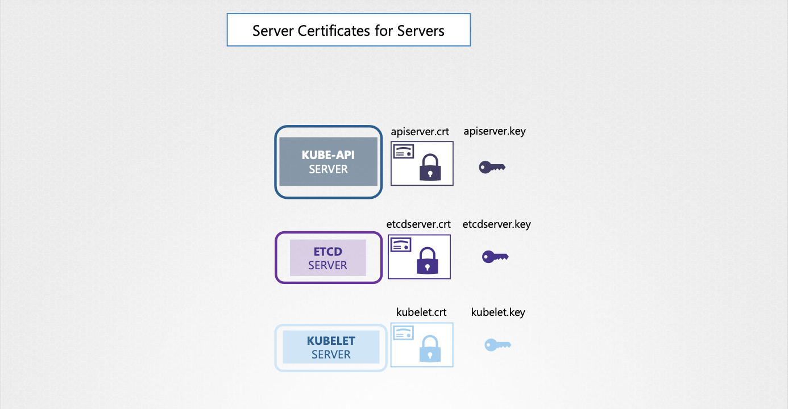

# Security (Authorization & TLS)

- 이번 장에서는 **Certified Kubernetes Administrator (CKA)** 을 준비하며 "인증과 TLS"에 대해서 알아보도록 한다.

---

### Security

#### Hosts 보안

- 쿠버네티스 클러스터를 구성하는 물리적 또는 가상 호스트에 대한 보안이 최우선이다.
- 루트 접근 제한, 비밀번호 기반 인증 비활성화, SSH 키 기반 인증만 허용 등 기본적인 호스트 보안 조치를 적용해야 한다.
- 호스트가 침해되면 클러스터 전체가 위험에 노출될 수 있다.

#### Kubernetes API 서버 보안

- kube-apiserver는 쿠버네티스 클러스터의 모든 작업을 관리하는 핵심 구성 요소다.
- API 서버 접근 제어가 쿠버네티스 보안의 첫 번째 방어선이다.
- API 서버 접근 제어는 크게 두 가지 측면에서 이루어진다.
  - 인증 (Authentication): 누가 클러스터에 접근할 수 있는지 결정한다.
  - 권한 부여 (Authorization): 접근 권한을 가진 사용자가 무엇을 할 수 있는지 결정한다.

#### 인증 (Authentication)

- API 서버에 접근하는 사용자를 식별하고 인증하는 과정이다.
- 다양한 인증 방식이 지원된다.
  - 정적 파일 기반 사용자 ID 및 비밀번호/토큰: 간단하지만 보안에 취약하다.
  - 인증서: 강력한 인증 방식이다.
  - LDAP 등 외부 인증 제공업체 연동: 기존 사용자 관리 시스템과 통합할 수 있다.
  - 서비스 계정 (Service Account): 머신(파드)이 API 서버에 접근할 때 사용된다.

#### 권한 부여 (Authorization)

- 인증된 사용자가 클러스터 내에서 수행할 수 있는 작업을 결정하는 과정이다.
- 다양한 권한 부여 방식이 지원된다.
  - 역할 기반 접근 제어 (RBAC, Role-Based Access Control): 사용자/그룹에 특정 권한을 부여하는 방식이다. (가장 일반적)
  - 속성 기반 접근 제어 (ABAC, Attribute-Based Access Control): 속성을 기반으로 권한을 부여하는 방식이다.
  - 노드 권한 부여 (Node Authorizers): 노드에 특정 권한을 부여하는 방식이다.
  - 웹훅 (Webhooks): 외부 권한 부여 시스템과 연동하는 방식이다.

#### TLS Certificates

- etcd 클러스터, kube-controller-manager, kube-scheduler, API 서버, kubelet, kube-proxy 등 클러스터 내 모든 구성 요소 간 통신은 TLS 암호화를 사용하여 보호된다.
- 인증서 관리는 쿠버네티스 통신 보안의 핵심이다.

#### 애플리케이션 간 통신 보안 (네트워크 정책)

- 기본적으로 클러스터 내 모든 파드는 다른 모든 파드에 접근할 수 있다.
- 네트워크 정책을 사용하여 파드 간 접근을 제한할 수 있다.
- 네트워크 정책은 파드 간 통신을 세밀하게 제어할 수 있는 강력한 도구다.

---

### Authentication

#### 사용자 유형

- 쿠버네티스 클러스터는 다양한 사용자가 접근한다.
  - 관리자: 클러스터 관리 작업을 수행한다.
  - 개발자: 애플리케이션 테스트 및 배포 작업을 수행한다.
  - 최종 사용자: 클러스터에 배포된 애플리케이션을 사용한다.
  - 외부 애플리케이션: 통합 목적으로 클러스터에 접근한다.

#### 사용자 유형 분류

- 관리 목적의 클러스터 접근 사용자는 크게 두 가지 유형으로 나눌 수 있다.
  - 사람 (Human): 관리자, 개발자 등 실제 사용자다.
  - 로봇 (Robot): 다른 프로세스, 서비스, 애플리케이션 등 기계적인 사용자다.

#### 사용자 관리 방식

- 쿠버네티스는 자체적으로 사용자 계정을 관리하지 않는다.
- 외부 소스 (파일, 인증서, LDAP 등)를 통해 사용자를 관리한다.
- 따라서 `kubectl` 명령어로 사용자를 생성하거나 목록을 확인할 수 없다.
- 서비스 계정은 쿠버네티스 API를 통해 생성 및 관리할 수 있다.

#### API 서버를 통한 인증 과정

- 모든 사용자 접근은 kube-apiserver를 통해 이루어진다.
- `kubectl` 도구 또는 API 직접 접근 모두 API 서버를 거친다.
- API 서버는 요청을 처리하기 전에 인증 과정을 거친다.

#### 쿠버네티스 API 서버 인증 방식

- 쿠버네티스 API 서버는 다양한 인증 메커니즘을 지원한다.
  - 정적 비밀번호 파일
  - 정적 토큰 파일
  - 인증서 기반 인증
  - LDAP, Kerberos 등 외부 인증 프로토콜 연동

#### 정적 비밀번호 파일 기반 인증

- **사용자 정보 CSV 파일 생성**
  - 비밀번호, 사용자 이름, 사용자 ID를 쉼표로 구분하여 CSV 파일에 저장한다.
  - 선택적으로 네 번째 열에 그룹 정보를 추가하여 사용자를 특정 그룹에 할당할 수 있다.
  - 예: `password,usernmae,userid,group`

- **API 서버 설정**
  - kube-apiserver 서비스 또는 파드 정의 파일에 `--basic-auth-file=<csv 파일 경로>` 옵션을 추가한다.
  - kubeadm으로 설치한 경우 kube-apiserver 파드 정의 파일을 수정해야 한다.
  - 변경 사항 적용을 위해 API 서버를 재시작한다. (kubeadm은 자동 재시작)

- **API 서버 접근 시 인증**
  - `curl -u <사용자 이름>:<비밀번호> <API 서버 주소>` 명령어를 사용하여 API 서버에 접근한다.

#### 정적 토큰 파일 기반 인증

- 토큰 정보 파일 생성
  - 비밀번호 대신 토큰을 사용하여 사용자 정보를 저장한다.
  - 파일 형식은 비밀번호 파일과 동일하다.
  - 예: `token,username,userid,group`
- API 서버 설정
  - kube-apiserver 서비스 또는 파드 정의 파일에 `--token-auth-file=<토큰 파일 경로>` 옵션을 추가한다.
- API 서버 접근 시 인증
  - `curl -H "Authorization: Bearer <토큰>" <API 서버 주소>` 명령어를 사용하여 API 서버에 접근한다.

---

### TLS

#### TLS 인증서의 기본 개념과 필요성

- TLS 인증서는 두 당사자 간의 거래에서 신뢰를 보장하는 데 사용된다.
- 웹 서버에 접근할 때 TLS 인증서는 사용자 <-> 서버 간 통신 암호화 및 서버의 신원 확인을 보장한다.
- 안전하지 않은 연결에서는 사용자 정보가 일반 텍스트로 전송되어 해커에게 노출될 위험이 있다.

#### 대칭키 암호화

- 동일한 키로 데이터를 암호화하고 복호화하는 방식이다.
- 데이터 암호화에는 안전하지만 키를 안전하게 교환하는 것이 문제다.
- 해커가 키를 가로채면 데이터를 복호화할 수 있다.

#### 비대칭키 암호화 (공개키/개인키 쌍)

- 공개키와 개인키라는 두 개의 키를 사용하는 방식이다.
- 공개키로 암호화된 데이터는 개인키로만 복호화할 수 있다.
- 개인키는 안전하게 보관하고 공개키는 공유하여 데이터를 안전하게 교환할 수 있다.
- 비대칭키 암호화는 대칭키 암호화의 키 교환 문제를 해결한다.

#### SSH 접근 보안 (키 쌍 활용)

- SSH 키 쌍을 생성하여 비밀번호 없이 안전하게 서버에 접근할 수 있다.
- `ssh-keygen` 명령어를 사용하여 공개키(id_rsa.pub)와 개인키(id_rsa)를 생성한다.
- 서버의 `~/.ssh/authorized_keys` 파일에 공개키를 추가하여 접근을 허용한다.
- SSH 접속 시 개인키를 사용하여 서버에 인증한다.
- 여러 서버에 동일한 공개키를 복사하여 동일한 개인키로 접근할 수 있다.
- 다른 사용자에게도 키 쌍을 생성하도록 하고, 해당 공개키를 서버에 추가하여 접근을 허용할 수 있다.

#### 웹 서버 보안 (TLS 인증서 활용)

- 웹 서버는 공개키/개인키 쌍을 생성하고, 공개키를 인증서에 포함하여 클라이언트에게 제공한다.
- 클라이언트는 서버에서 받은 공개키로 대칭키를 암호화하여 서버에 전송한다.
- 서버는 개인키로 암호화된 대칭키를 복호화하고 이후 통신은 대칭키로 암호화하여 안전하게 진행한다.
- 해커는 공개키만 가지고 있으므로 대칭키를 복호화할 수 없다.

#### 중간자 공격 (Man-in-the-Middle Attack) 대응

- 해커가 실제 은행 웹사이트와 유사항 가짜 웹사이트를 만들어 사용자를 속일 수 있다.
- 사용자는 HTTPS를 사용하더라도 해커의 서버와 안전하게 통신하게 된다.
- 이 문제를 해결하기 위해 인증서에는 서버의 공개키 외에도 서버의 신원을 보증하는 정보가 포함된다.

#### 인증서의 역할

- 인증서는 서버의 신원을 보증하고, 공개키를 안전하게 배포하는 역할을 한다.
- 인증서를 통해 사용자는 서버가 합법적인 서버인지 확인할 수 있다.
- 인증서에는 서버의 도메인 이름, 공개키, 인증 기관의 서명 등이 포함된다.

#### 디지털 인증서의 구성 요소 및 역할

- 디지털 인증서는 실제 인증서와 유사한 디지털 형식으로, 인증 대상에 대한 정보(이름, 공개키, 위치 등)를 포함한다.
- 가장 중요한 부분은 인증서를 발급하고 서명한 주체다.
- 웹 서버의 경우 인증서의 이름(Subject)은 사용자가 브라우저 URL에 입력하는 도메인 이름과 일치해야 한다.
- 인증서에는 Subject Alternative Name(SAN) 섹션에 추가적인 도메인 이름도 포함될 수 있다.

#### 자가 서명 인증서와 인증 기관(CA)

- 누구나 자가 서명 인증서를 생성할 수 있지만 이러한 인증서는 신뢰할 수 없다.
- 인증 기관(CA)은 인증서를 검증하고 서명하는 신뢰할 수 있는 기관이다.
- CA는 인증서 서명 요청(CSR)을 검증하고, 검증이 완료되면 인증서에 서명하여 발급한다.
- 브라우저는 신뢰할 수 있는 CA의 공개키를 내당하고 있어 CA가 서명한 인증서를 검증할 수 있다.

#### 인증서 서명 요청(CSR) 생성 및 CA 검증

- `openssl` 명령어를 사용하여 개인키와 도메인 이름을 기반으로 CSR 파일을 생성한다.
- CA는 다양한 검증 기술을 사용하여 도메인 소유자를 확인한다.
- CA는 자체 개인키로 CSR에 서명하고, 서명된 인증서를 발급한다.

#### 내부 CA 및 PKI

- 공개 웹 사이트 외에 내부 웹 사이트(예: 사내 인트라넷)를 위한 인증서를 발급하기 위해 자체 CA를 운영할 수 있다.
- 기업은 내부 CA 서버를 구축하고, 직원들의 브라우저에 내부 CA의 공개키를 설치하여 내부 웹 사이트에 대한 안전한 연결을 설정할 수 있다.
- CA, 서버, 사용자, 인증서 생성, 배포, 유지 관리 프로세스를 포함한 전체 인프라를 공개키 기반 구조(PKI)라고 한다.
  
- **클라이언트 인증서**
  - 서버는 클라이언트가 누구인지 확인하기 위해 클라이언트 인증서를 요청할 수 있다.
  - 클라이언트는 개인키와 CA에서 서명한 인증서를 생성하여 서버에 제공한다.
  - 웹 서버에서 클라이언트 인증서는 일반적으로 구현되지 않지만, 호스트 수준에서 구현될 수 있다.

#### 개인키와 공개키의 관계

- 개인키와 공개키는 서로 관련되 키 쌍이다.
- 어떤 키로든 데이터를 암호화할 수 있으며, 다른 키로만 복호화할 수 있다.
- 개인키로 데이터를 암호화하면 공개키를 가진 누구나 데이터를 복호화할 수 있으므로 주의해야 한다.
  
- **파일 명명 규칙**
  - 공개키 또는 인증서 파일은 일반적으로 `.crt` 또는 `.pem` 확장자를 사용한다.
  - 개인키 파일은 일반적으로 `.key` 또는 `-key.pem` 확장자를 사용한다.
  - 개인키 파일 이름에는 일반적으로 "key"라는 단어가 포함된다.

---

### TLS in Kubernetes

#### 인증서 유형 및 파일 명명 규칙

- 서버 인증서 (Serving Certificates): 서버가 클라이언트와의 안전한 연결을 설정하기 위해 사용하는 인증서다.
- 루트 인증서 (Root Certificates): CA 서버에서 서버 인증서를 서명하는 데 사용하는 인증서다.
- 클라이언트 인증서 (Client Certificates): 클라이언트가 서버에 자신을 인증하기 위해 사용하는 인증서다.
- 파일 명명 규칙:
  - `.crt` 또는 `.pem` 확장자를 가진 파일은 공개키 또는 인증서를 나타낸다. (예: `server.crt`, `client.pem`)
  - `.key` 확장자 또는 파일 이름에 "-key"가 포함된 파일은 개인키를 나타낸다. (예: `server.key`, `client-key.pem`)

#### 쿠버네티스 클러스터의 TLS 인증서 필요성

- 쿠버네티스 클러스터의 모든 노드 간 통신은 안전하게 암호화되어야 한다.
- 클러스터 내의 다양한 서비스와 클라이언트 간의 모든 상호 작용은 안전해야 한다.
- `kubectl` 유틸리티 또는 API 직접 접근을 통해 쿠버네티스 클러스터와 상호 작용하는 관리자는 안전한 TLS 연결을 설정해야 한다.
- 클러스터 내의 모든 구성 요소 간 통신도 안전해야 한다.
- 클러스터 내의 다양한 서비스가 서버 인증서를 사용하고, 모든 클라이언트가 클라이언트 인증서를 사용하여 신원을 확인해야 한다.

#### 쿠버네티스 클러스터의 서버 구성 요소 및 인증서

- **kube-apiserver**:
  - HTTPS 서비스를 제공하여 다른 구성 요소 및 외부 사용자가 쿠버네티스 클러스터를 관리할 수 있도록 한다.
  - 서버 인증서 및 개인키 쌍이 필요하다. (예: `apiserver.crt`, `apiserver.key`)
- **etcd 서버**:
  - 클러스터에 대한 모든 정보를 저장한다.
  - 서버 인증서 및 개인키 쌍이 필요하다.
- **kubelet 서비스 (워커 노드)**:
  - kube-apiserver가 워커 노드와 상호 작용하기 위해 사용하는 HTTPS API 엔드포인트를 제공한다.
  - 서버 인증서 및 개인키 쌍이 필요하다. (예: `kubelet.crt`, `kubelet.key`)

#### 클라이언트 구성 요소 및 인증서

- **kubectl (관리자)**:
  - kube-apiserver에 접근하여 클러스터를 관리한다.
  - 클라이언트 인증서 및 개인키 쌍이 필요하다. (예: `admin.crt`, `admin.key`)
- **kube-scheduler**:
  - kube-apiserver와 통신하여 스케줄링할 파드를 찾고 워커 노드에 파드를 스케줄링한다.
  - 클라이언트 인증서 및 개인키 쌍이 필요하다. (예: `scheduler.crt`, `scheduler.key`)
- **kube-controller-manager**:
  - kube-apiserver에 접근하여 클러스터 상태를 관리한다.
  - 클라이언트 인증서 및 개인키 쌍이 필요하다.
- **kube-proxy**:
  - kube-apiserver에 접근하여 네트워크 프록시 규칙을 관리한다.
  - 클라이언트 인증서 및 개인키 쌍이 필요하다. (예: `kubeproxy.crt`, `kubeproxy.key`)

#### 서버 간 통신 및 인증서

- **kube-apiserver와 etcd 서버 간 통신:**
  - kube-apiserver는 etcd 서버와 통신하여 클러스터 정보를 저장하고 검색한다.
  - etcd 서버 입장에서 kube-apiserver는 클라이언트이므로 인증이 필요하다.
  - kube-apiserver는 자체 서버 인증서(`apiserver.crt`, `apiserver.key`)를 사용하거나 etcd 서버와의 통신을 위한 별도의 인증서 쌍을 생성할 수 있다.
- **kube-apiserver와 kubelet 서버 간 통신:**
  - kube-apiserver는 각 워커 노드의 kubelet 서버와 통신하여 워커 노드를 모니터링한다.
  - kubelet 서버 입장에서 kube-apiserver는 클라이언트이므로 인증이 필요하다.
  - kube-apiserver는 자체 서버 인증서를 사용하거나 kubelet 서버와의 통신을 위한 별도의 인증서 쌍을 생성할 수 있다.

#### 인증서 그룹화

- 클라이언트 인증서: 주로 클라이언트가 kube-apiserver에 연결하는 데 사용된다.
- 서버 측 인증서: kube-apiserver, etcd 서버, kubelet이 클라이언트를 인증하는 데 사용된다.

#### 인증서 생성 및 인증 기관(CA)

- 모든 인증서는 인증 기관(CA)에 의해 서명되어야 한다.
- 쿠버네티스 클러스터에는 하나 이상의 CA가 필요하다.
- 클러스터 내 모든 구성 요소에 대해 하나의 CA를 사용하거나 etcd 서버 전용 CA를 별도로 사용할 수 있다.
- CA는 자체 인증서 및 개인키 쌍을 가지고 있다. (예: `ca.crt`, `ca.key`)

---

### 참고한 강의

- [Kubernetes for the Absolute Beginners](https://www.udemy.com/course/learn-kubernetes)
- [Certified Kubernetes Administrator (CKA)](https://www.udemy.com/course/certified-kubernetes-administrator-with-practice-tests)