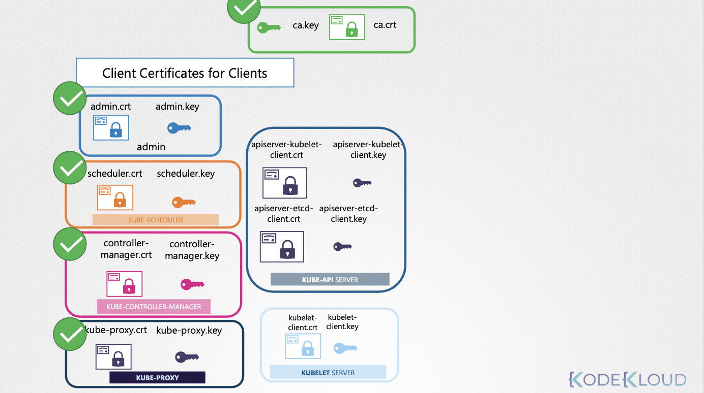
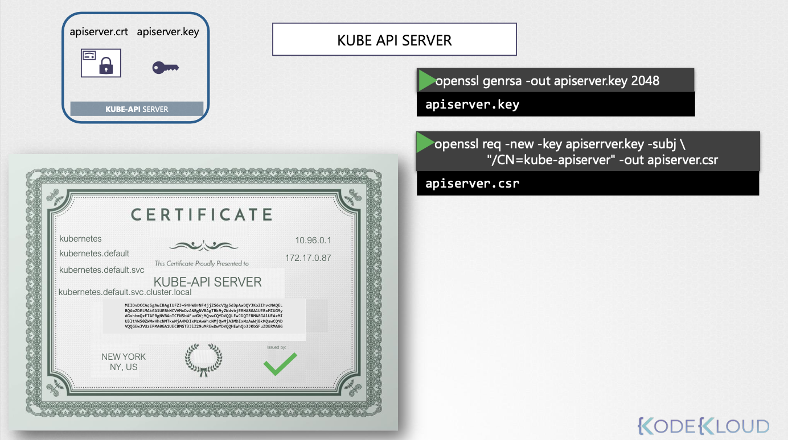
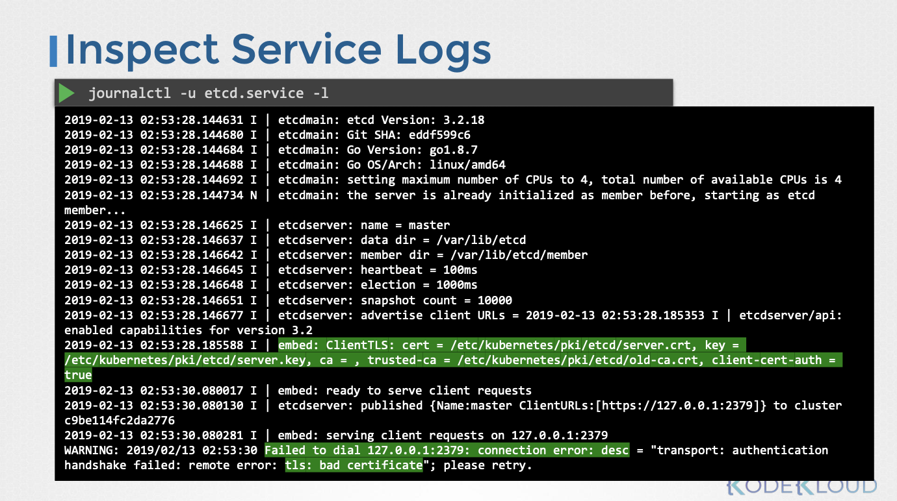
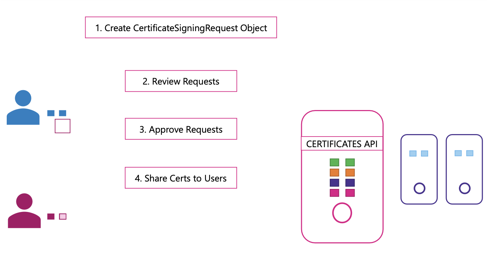

# Security (Certificates)

- 이번 장에서는 **Certified Kubernetes Administrator (CKA)** 을 준비하며 "인증서"에 대해서 자세하게 알아보도록 한다.

---

### Certificate

#### 인증서 생성 도구 및 개요

- 쿠버네티스 클러스터 인증서 생성에는 Easy-RSA, OpenSSL, CFSSL 등 다용한 도구를 사용할 수 있다.

- OpenSSL은 가장 많이 사용되는 도구이다.
- 인증서 생성 과정은 CA 인증서, 클라이언트 인증서, 서버 인증서 순으로 진행된다.

#### CA 인증서 생성

1. 개인키 생성: `openssl genrsa -out ca.key` 명령어를 사용하여 CA 개인키를 생성한다.
2. CSR 생성: `openssl req -new -key ca.key -out ca.csr` 명령어를 사용하여 CSR을 생성한다. Common Name(CN) 필드에 "Kubernetes-CA"를 입력한다.
3. 자가 서명 인증서 생성: `openssl x509 -req -in ca.csr -signkey ca.key -out ca.crt` 명령어를 사용하여 CA 자체 개인키로 자가 서명 인증서를 생성한다.

#### 클라이언트 인증서 생성 (관리자, 스케줄러, 컨트롤러 매니저, kube-proxy)

- 클라이언트 인증서 생성 과정은 동일하며, 각 구성 요소에 맞는 CN과 OU(그룹) 정보를 설정한다.

1. 개인키 생성: `openssl genrsa -out <클라이언트 이름>.key` 명령어를 사용하여 클라이언트 개인키를 생성한다. (예: `admin.key`)
2. CSR 생성: `openssl req -new -key <클라이언트 이름>.key -out <클라이언트 이름>.csr` 명령어를 사용하여 CSR을 생성한다.
    - 관리자: CN 필드에 관리자 이름을 입력하고, OU 필드에 "system.masters" 그룹 정보를 입력한다.
    - 스케줄러, 컨트롤러 매니저, kube-proxy: CN 필드에 "system:<구성 요소 이름>"을 입력한다. (예: `system:kube-scheduler`)
3. CA 서명 인증서 생성: `openssl x509 -req -in <클라이언트 이름>.csr -CA ca.crt -CAkey ca.key -out <클라이언트 이름>.crt` 명령어를 사용하여 CA 개인키로 인증서를 서명한다.

#### 인증서 사용 및 kubeconfig 파일

- 생성된 인증서는 REST API 호출 시 인증 ㅈ어보로 사용하거나 kubeconfig 파일에 설정하여 `kubectl` 명령어를 통해 클러스터를 관리할 수 있따.
- kubeconfig 파일은 API 서버 엔드포인트, 인증서 정보 등을 포함하는 설정 파일이다.

#### CA 루트 인증서의 중요성

- 클라이언트와 서버는 CA 루트 인증서를 통해 서로의 인증서를 검증한다.
- 쿠버네티스 클러스터의 모든 구성 요소는 CA 루트 인증서 복사본을 가지고 있어야 한다.
- 서버 또는 클라이언트 인증서를 설정할 때 CA 루트 인증서도 함께 지정해야 한다.

#### ETCD 서버 인증서 생성 및 구성

- **인증서 생성**: 이전과 동일한 방식으로 etcd 서버 인증서를 생성한다. (예: `etcd-server.crt`, `etcd-server.key`)
- **고가용성 환경**: 여러 서버로 구성된 etcd 클러스터의 경우, 클러스터 멤버 간 통신을 위해 추가적인 피어 인증서를 생성해야 한다.
- **etcd 서버 구성**: etcd 서버 시작 시 인증서 경로를 지정한다. 
  - `key-file`, `cert-file` 옵션을 사용하여 서버 인증서를 지정하고, 피어 인증서 관련 옵션을 사용하여 피어 인증서를 지정한다.
  - 또한, 클라이언트 인증서 검증을 위해 CA 루트 인증서를 지정해야 한다.

#### kube-apiserver 인증서 생성 및 구성

- 인증서 생성: kube-apiserver 인증서를 생성한다.

- **대체 이름 (Alternate Names) 설정**: kube-apiserver는 다양한 이름과 IP 주소로 접근할 수 있으므로, 인증서에 모든 대체 이름을 포함해야 한다.
  - `openssl.cnf` 파일을 생성하고 `[alt_names]` 섹션에 DNS 이름과 IP 주소를 지정한다.
  - CSR 생성 시 `openssl.cnf` 파일을 옵션으로 전달한다.

- **kube-apiserver 구성**: kube-apiserver 실행 팡리 또는 서비스 구성 파일에 인증서 경로를 지정한다.
  - CA 인증서, 서버 인증서, etcd 서버와의 통신을 위한 클라이언트 인증서, kubelet 서버와의 통신을 위한 클라이언트 인증서를 지정한다.

#### kubelet 서버 인증서 생성 및 구성

- **노드별 인증서 생성**: 클러스터의 각 노드에 대한 인증서를 생성한다. 인증서 이름은 노드 이름과 동일하게 지정한다. (예: `node01.crt`, `node01.key`)
- **kubelet 구성**: kubelet 구성 파일에 인증서 경로를 지정한다. CA 루트 인증서와 노드 인증서를 지정한다.

- **kube-apiserver와의 통신을 위한 클라이언트 인증서 생성**: kubelet은 kube-apiserver와 통신하기 위해 클라이언트 인증서가 필요하다.
  - 인증서 이름은 `system:node:<노드 이름>` 형식으로 지정한다. (예: `system:node:node01.crt`)
  - `system:nodes` 그룹에 노드를 추가하여 kube-apiserver가 적절한 권한을 부여하도록 한다.
  - 생성된 인증서는 kubeconfig 파일에 설정한다.

---

### 인증서 상세 정보

#### 인증서 확인 필요성

- 새로운 팀의 쿠버네티스 환경 관리 지원 시 인증서 관련 문제를 해결하기 위해 인증서 상태 점검이 필요하다.
- 클러스터 설치 방식에 따라 인증서 관리 방법이 다르므로 설치 방식을 먼저 확인해야 한다.
  - 직접 설치: 모든 인증서를 수동으로 생성하고 구성한다.
  - kubeadm 설치: 인증서 생성 및 구성을 자동으로 처리한다.

#### 인증서 정보 확인 절차 (kubeadm 설치 클러스터 예시)

- **인증서 목록 작성**: 엑셀 스프레드시트 등을 활용하여 클러스터에서 사용되는 모든 인증서 파일 목록을 작성한다.
  - 인증서 경로, 설정된 이름, 대체 이름, 소속 조직, 발급자, 만료일 등을 기록한다.

- **인증서 파일 위치 확인**: kubeadm으로 설치된 경우 kube-apiserver 정의 파일 (`/etc/kubernetes/manifests/kube-apiserver.yaml`)에서 인증서 파일 경로를 확인할 수 있다.
  - API 서버 시작 명령어에 사용되는 인증서 관련 옵션을 확인한다.

- **인증서 상세 정보 확인**: `openssl x509` 명령어를 사용하여 각 인증서 파일의 상세 정보를 확인한다.
  - `openssl x509 -in <인증서 파일 경로> -text -noout`
  - 인증서 이름(Subject), 대체 이름(Subject Alternative Name), 만료일(Validity), 발급자(Issuer) 등을 확인한다.

- **확인 사항**:
  - 올바른 이름 및 대체 이름 설정 여부
  - 올바른 조직 소속 여부
  - 올바른 발급자로부터 발급되었는지 여부
  - 만료 여부
  - 쿠버네티스 문서의 인증서 요구 사항을 참고한다.

#### 문제 해결 및 로그 확인

- 로그 확인: 문제 발생 시 로그를 확인하여 원인을 파악한다.

- 직접 설치: 운영체제 로그 기능을 사용하여 서비스 로그를 확인한다.

- kubeadm 설치: `kubectl logs <파드 이름>` 명령어를 사용하여 파드 로그를 확인한다.

- 핵심 구성 요소(kube-apiserver, etcd) 다운 시 `kubectl` 명령어가 작동하지 않을 수 있다.

- Docker 로그 확인: `docker ps -a` 명령어를 사용하여 컨테이너 목록을 확인하고, `docker logs <컨테이너 ID>` 명령어를 사용하여 컨테이너 로그를 확인한다.

---

### 인증서 작동 방식 & API

#### 기존 인증서 관리 방식 및 문제점

- 클러스터 관리자는 클러스터 설치 과정에서 CA 서버를 설정하고 다양한 구성 요소에 대한 인증서를 생성한다.
- 새로운 관리자가 클러스터에 접근하려면 관리자에게 CSR(Certificate Signing Request)을 전달해야 한다.
- 관리자는 CA 서버에 접속하여 CSR을 수동으로 서명하고 인증서를 발급한다.
- 인증서 만료 시 동일한 과정을 반복해야 하므로 관리 overhead가 증가한다.
- CA 서버의 보안이 중요하며, 권한 없는 접근은 심각한 보안 문제를 야기할 수 있다.
- 현재는 마스터 노드에 CA 인증서 파일이 위치하고 있어 마스터 노드가 CA 서버의 역할도 하고 있다.

#### 쿠버네티스 인증서 API(CertificateSigningRequest)의 도입 배경

- 사용자 수가 증가하고 팀 규모가 커짐에 따라 수동 인증서 관리의 비효율성이 증가한다.
- 인증서 만료 시 수동 갱신으로 인한 관리 부담이 커진다.
- 자동화된 인증서 관리 시스템의 필요성이 대두된다.
- 쿠버네티스 인증서 API를 통해 인증서 서명 요청 및 발급 과정을 자동화한다.

#### 쿠버네티스 인증서 API(CertificateSigningRequest)의 작동 방식

- 사용자는 개인키를 생성하고 CSR을 생성하여 관리자에게 전달한다.
- 관리자는 전달받은 CSR을 Base64로 인코딩하고 `CertificateSigningRequest` 객체 매니페스트 파일을 작성한다.
  - `kind: CertificateSigningRequest`
  - `spec.request: <Base64 인코딩된 CSR>`
- 관리자는 `kubectl apply -f <매니페스트 파일>` 명령어를 사용하여 `CertificateSigningRequest` 객체를 생성한다.
 

- 생성된 `CertificateSigningRequest` 객체는 `kubectl get csr` 명령어를 통해 클러스터 관리자가 확인할 수 있다.
- 관리자는 `kubectl certificate approve <CSR 이름>` 명령어를 사용하여 인증서 서명 요청을 승인한다.
- 인증서 추출:
  - `kubectl get csr <CSR 이름> -o yaml` 명령어를 실행하여 서명된 인증서를 YAML 형식으로 확인한다.
  - 서명된 인증서는 출력 결과의 `status.certificate` 필드에 Base64로 인코딩되어 포함되어 있다.
- 인증서 디코딩:
  - Base64로 인코딩된 인증서 내용을 복사한다.
  - `base64 -d` 명령어를 사용하여 인증서를 디코딩한다.
  - 디코딩된 인증서를 파일로 저장하여 사용자에게 전달한다.

#### 인증서 관련 작업 수행 컴포넌트

- **kube-controller-manager**:
  - 쿠버네티스 컨트롤 플레인의 `kube-controller-manager` 컴포넌트가 인증서 관련 작업을 수행한다.
  - `kube-controller-manager`는 CSR-Approving, CSR-Signing 등의 컨트롤러를 포함한다.
  - 이러한 컨트롤러들은 인증서 서명 요청 승인, 인증서 서명 등의 특정 작업을 담당한다.

- **CA 키 쌍 설정**:
  - 인증서를 서명하려면 CA 서버의 루트 인증서와 개인키가 필요하다.
  - `kube-controller-manager` 서비스 설정에는 CA 루트 인증서와 개인키 경로를 지정하는 옵션이 있다.

---

### 참고한 강의

- [Kubernetes for the Absolute Beginners](https://www.udemy.com/course/learn-kubernetes)
- [Certified Kubernetes Administrator (CKA)](https://www.udemy.com/course/certified-kubernetes-administrator-with-practice-tests)
- [Kubernetes the hard way](https://github.com/mmumshad/kubernetes-the-hard-way/tree/master/tools)