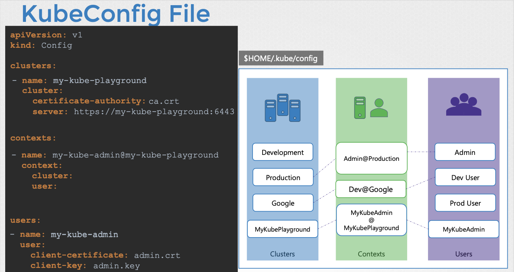

# Security (KubeConfig)

- 이번 장에서는 **Certified Kubernetes Administrator (CKA)** 을 준비하며 "KubeConfig"에 대해서 자세하게 알아보도록 한다.

---

## KubeConfig

### KubeConfig 파일의 필요성

- `kubectl` 명령어를 사용하여 쿠버네티스 API 서버와 상호 작용하려면 서버 주소, 사용자 인증 정보(인증서, 키), CA 인증서 등의 정보가 필요하다.

- 매번 명령어를 실행할 때마다 이러한 정보를 입력하는 것은 번거롭기 때문에 kubeconfig 파일을 사용하여 설정을 저장하고 관리한다.

- kubeconfig 파일은 클러스터, 사용자, 컨텍스트 정보를 정의하여 `kubectl`이 사용할 설정을 결정한다.

### KubeConfig 파일 구조

- KubeConfig 파일은 YAML 형식이며 `apiVersion`, `kind`, `cluster`, `users`, `contexts` 섹션으로 구성된다.
  - `clusters`: 접근할 쿠버네티스 클러스터 목록을 정의한다. (서버 주소, CA 인증서 등)
  - `users`: 클러스터에 접근할 사용자 계정 목록을 정의한다. (클라이언트 인증서, 키 등)
  - `contexts`: 클러스터와 사용자를 연결하여 어떤 사용자가 어떤 클러스터에 접근할지 정의한다.

### kubectl config 명령어

- `kubectl config view`: 현재 사용 중인 kubeconfig 파일의 설정을 보여준다.

- `kubectl config use-context <context-name>`: 현재 컨텍스트를 변경한다.

- `kubectl config set-context <context-name> --namespace=<namespace-name>`: 컨텍스트의 기본 네임스페이스를 설정한다.
- `kubectl config set-cluster`, `kubectl config set-user`, `kubectl config set-credentials` 등의 명령어를 사용하여 KubeConfig 파일을 수정할 수 있다.

### 파일 위치 및 설정

- 기본적으로 `kubectl`은 사용자 홈 디렉토리의 `.kube/config` 파일을 사용한다.
- `KUBECONFIG` 환경 변수를 사용하여 다른 KubeConfig 파일 경로를 지정할 수 있다.
- `kubectl --kubeconfig=<kubeconfig-file-path>` 옵션을 사용하여 특정 KubeConfig 파일을 사용할 수 있다.

### 인증서 정보 설정 방법

- KubeConfig 파일에서 인증서 정보를 설정하는 방법은 두 가지가 있다.

- `certificate-authority`, `client-certificate`, `client-key` 필드에 인증서 파일 경로를 지정한다.

- `certificate-authority-data`, `client-certificate-data`, `client-key-data` 필드에 Base64로 인코딩된 인증서 내용을 직접 입력한다.

---

## API Groups

### 쿠버네티스 API란?

- 쿠버네티스 API는 클러스터와 상호 작용하는 핵심 인터페이스다.
- `kubectl` 유틸리티나 REST API를 통해 API 서버와 통신하여 클러스터 작업을 수행한다.
- API는 다양한 목적으로 그룹화되어 있으며, 각 그룹은 특정 기능을 담당한다.

### API 그룹의 종류

- **코어 그룹(Core Group)**:
  - 핵심 기능을 담당하며, 네임스페이스, 파드, 레플리케이션 컨트롤러, 이벤트, 노드, 바인딩, 퍼시스턴트 볼륨, 컨피그맵, 시크릿, 서비스 등 핵심 리소스를 포함한다.
  - API 버전은 `v1`이다.
- **명명된 그룹(Named Group)**:
  - 특정 기능을 담당하는 그룹으로 앱, 확장, 네트워크, 스토리지, 인증, 권한 부여 등 다양한 그룹이 존재한다.
  - 앱 그룹에는 배포, 레플리카셋, 스테이트풀셋 등이 포함된다.
  - 네트워크 그룹에는 네트워크 정책이 포함된다.
  - 인증 그룹에는 인증서 서명 요청(CSR)이 포함된다.

- [쿠버네티스 API 공식문서](https://kubernetes.io/docs/reference/kubernetes-api/)에서 더 자세한 내용을 확인할 수 있다.

### API 접근 방법

- **직접 접근 (cURL)**:
  - API 서버 주소와 포트(기본: 6443)를 사용하여 직접 API에 접근할 수 있다.
  - 인증 메커니즘을 지정해야 하며, 인증서 파일을 사용하여 인증할 수 있다.

- `kubectl proxy` **사용**:
  - `kubectl proxy` 명령어를 실행하면 로컬 포트(기본: 8001)에 프록시 서비스가 시작된다.
  - 프록시는 kubeconfig 파일의 인증 정보를 사용하여 API 서버에 접근한다.
  - 로컬 포트를 통해 프록시에 접근하면 프록시가 API 서버로 요청을 전달한다.
  - 인증 정보를 직접 지정할 필요가 없어 편리하게 API에 접근할 수 있다.

- `kube-proxy` vs `kubectl proxy`:
  - `kube-proxy`는 파드 간 네트워크 연결을 담당하는 클러스터 내부 컴포넌트다.
  - `kubectl proxy`는 `kubectl` 유틸리티를 통해 API 서버에 접근하는 데 사용되는 로컬 프록시 서비스다.

---

## Authorization

### 권한 부여의 필요성

- 클러스터 관리자는 모든 작업을 수행할 수 있지만 다른 사용자나 애플리케이션에 대해서는 적절한 권한을 부여해야 한다.
- 개발자, 테스터, 모니터링 애플리케이션, CI/CD 애플리케이션 등 다양한 사용자가 클러스터에 접근한다.
- 각 사용자나 애플리케이션에 필요한 최소한의 권한만 부여하여 보안을 강화해야 한다.
- 네임스페이스를 사용하여 클러스터를 논리적으로 분할하고 사용자 접근을 제한해야 한다.

### 권한 부여 메커니즘

#### 노드 권한 부여 (Node Authorization)

- kubelet의 API 서버 접근 권한을 관리한다.
- kubelet은 `system:nodes` 그룹에 속하고 `system:node` 접두사를 가진 사용자만 노드 권한 부여를 통해 필요한 권한을 얻는다.
- kubelet은 서비스 엔드포인트, 노드, 파드 정보 조회 및 노드 상태 보고 등의 권한을 부여받는다.

#### 속성 기반 권한 부여 (Attribute-Based Authorization)

- 사용자 또는 사용자 그룹에 직접 권한 집합을 연결한다.
- JSON 형식의 정책 파일을 생성하여 API 서버에 전달한다.
- 정책 파일은 사용자 또는 그룹별로 생성해야 하며 변경 시 서버를 재시작해야 한다.
- 관리 복잡도가 높고 확장성이 떨어진다.

#### 역할 기반 권한 부여 (Role-Based Authorization)

- 역할(Role)을 정의하고 역할에 권한 집합을 연결한다.
- 사용자 또는 사용자 그룹을 역할에 연결한다.
- 권한 변경 시 역할을 수정하면 연결된 모든 사용자에게 즉시 반영된다.
- 표준화된 접근 방식으로 관리 효율성이 높다.

#### 웹훅 권한 부여 (Webhook Authorization)

- 외부 권한 부여 시스템(예: Open Policy Agent)을 사용하여 권한 부여 결정을 위임한다.
- 쿠버네티스는 사용자 정보 및 접근 요구 사항을 웹훅을 통해 외부 시스템에 전달한다.
- 외부 시스템은 권한 부여 결정을 쿠버네티스에 반환한다.
- 사용자 정의 권한 부여 로직을 구현하거나 외부 시스템과 통합할 수 있다.

#### Always Allow 및 Always Deny

- Always Allow: 모든 요청을 권한 부여 검사 없이 허용한다. (기본 설정)
- Always Deny: 모든 요청을 거부한다.
- 권한 부여 모드를 설정하지 않으면 Always Allow가 기본적으로 활성화된다.

### 권한 부여 모드 설정 및 작동 방식

- **권한 부여 모드 설정**:
  - kube-apiserver의 `--authorization-mode` 옵션을 사용하여 권한 부여 모드를 설정한다.
  - 쉼표로 구분된 여러 모드를 지정할 수 있다.(예: `--authorization-mode=Node,RBAC,Webhook`)

- **권한 부여 작동 방식**:
  - 여러 모드가 설정된 경우, 요청은 설정된 순서대로 각 모드에서 권한 부여 검사를 받는다.
  - 한 모드에서 여러 요청이 거부되면 다음 모드로 전달된다.
  - 한 모드에서 요청이 승인되면 더 이상 검사를 수행하지 않고 요청이 허용된다.
  - 노드 권한 부여는 노드 관련 요청만 처리하고 다른 요청은 거부한다.
  - 역할 기반 권한 부여는 사용자 권한을 검사하고, 웹훅 권한 부여는 외부 시스템에 권한 부여 결정을 위임한다.

---

## RBAC(Role-Based Access Control)

### 역할(Role) 생성

- 역할은 특정 네임스페이스 내에서 사용자에게 부여할 권한 집합을 정의한다.
- 역할 정의 파일(YAML)을 생성하여 역할을 정의한다.
- **역할 정의 파일 구조**:
  - `apiVersion`: `rbac.authorization.k8s.io/v1`
  - `kind`: `Role`
  - `metadata.name`: 역할 이름 (예: `developer`)
  - `rules`: 권한 규칙 목록
    - `apiGroups`: API 그룹 목록 (코어 그룹은 빈 문자열)
    - `resources`: 리소스 목록 (예: `pods`, `configmaps`)
    - `verbs`: 동작 목록 (예: `list`, `get`, `create`, `delete`)
- **역할 생성 명령어**:
  - `kubectl create -f <역할 정의 파일>`

### 역할 바인딩(RoleBinding) 생성

- 역할 바인딩은 사용자, 그룹, 서비스 계정을 역할에 연결한다.
- 역할 바인딩 정의 파일(YAML)을 생성하여 역할 바인딩을 정의한다.
- **역할 바인딩 정의 파일 구조**:
  - `apiVersion`: `rbac.authorization.k8s.io/v1`
  - `kind`: `RoleBinding`
  - `metadata.name`: 역할 바인딩 이름 (예: `dev-user-to-developer-binding`)
  - `subjects`: 사용자, 그룹, 서비스 계정 목록
    - `kind`: `User`, `Group`, `ServiceAccount`
    - `name`: 사용자, 그룹, 서비스 계정 이름
    - `namespace`: 서비스 계정의 네임스페이스
  - `roleRef`: 연결할 역할 정보
    - `kind`: `Role`
    - `name`: 역할 이름
    - `apiGroup`: `rbac.authorization.k8s.io`
- **역할 바인딩 생성 명령어**
  - `kubectl create -f <역할 바인딩 정의 파일>`

### 네임스페이스 범위 권한 부여

- 역할과 역할 바인딩은 네임스페이스 범위로 적용된다.
- 특정 네임스페이스에 대한 권한을 부여하려면 해당 네임스페이스에 역할과 역할 바인딩을 생성해야 한다.
- 역할과 역할 바인딩 정의 파일의 `metadata.namespace` 필드를 사용하여 네임스페이스를 지정한다.

### 역할 및 역할 바인딩 확인

- **역할 목록 조회**: `kubectl get roles`
- **역할 바인딩 목록 조회**: `kubectl get rolebindings`
- **역할 상세 정보 조회**: `kubectl describe role <역할 이름>`
- **역할 바인딩 상세 정보 조회**: `kubectl describe rolebinding <역할 바인딩 이름>`

### 권한 확인

- **사용자 권한 확인**: `kubectl auth can-i <동작> <리소스>` (예: `kubectl auth can-i create deployments`)
- **다른 사용자 권한 확인 (관리자 권한 필요)**: `kubectl auth can-i <동작> <리소스> --as=<사용자 이름>` (예: `kubectl auth can-i create deployments --as=dev-user`)
- **네임스페이스 범위 권한 확인**: `kubectl auth can-i <동작> <리소스> -n <네임스페이스 이름>` (예: `kubectl auth can-i create pods -n test`)

### 리소스 이름 기반 권한 부여

- 특정 리소스 인스턴스에 대한 권한만 부여할 수 있다.
- 역할 정의 파일의 `rules.resourceNames` 필드를 사용하여 리소스 이름을 지정한다.

---

### 참고한 강의

- [Kubernetes for the Absolute Beginners](https://www.udemy.com/course/learn-kubernetes)
- [Certified Kubernetes Administrator (CKA)](https://www.udemy.com/course/certified-kubernetes-administrator-with-practice-tests)
- [Kubernetes API](https://kubernetes.io/docs/reference/kubernetes-api/)