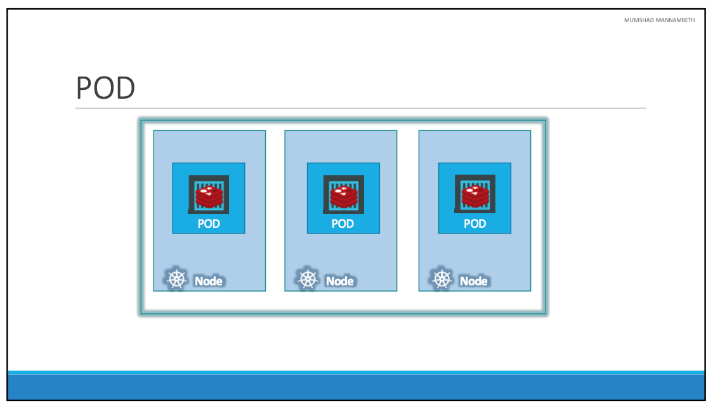
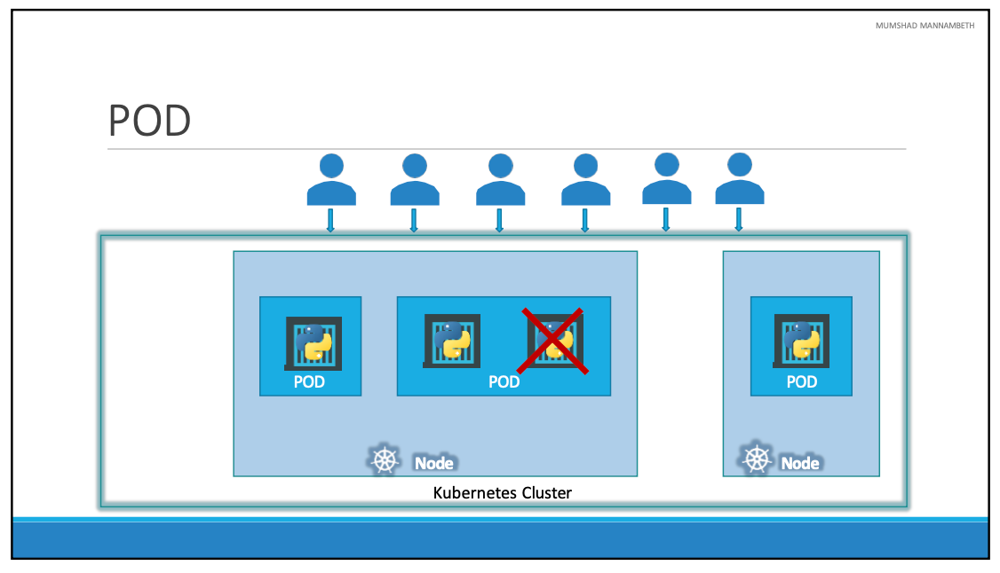
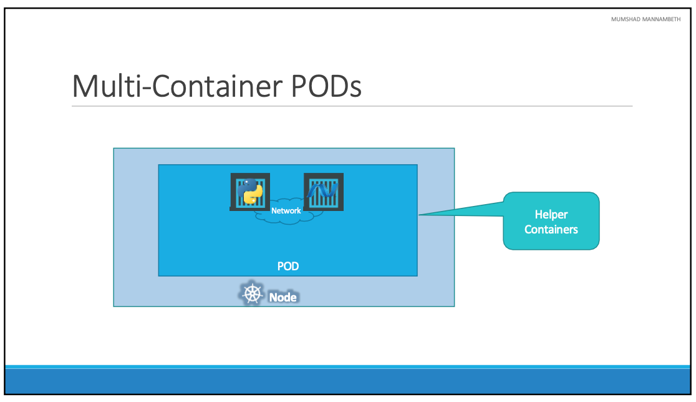
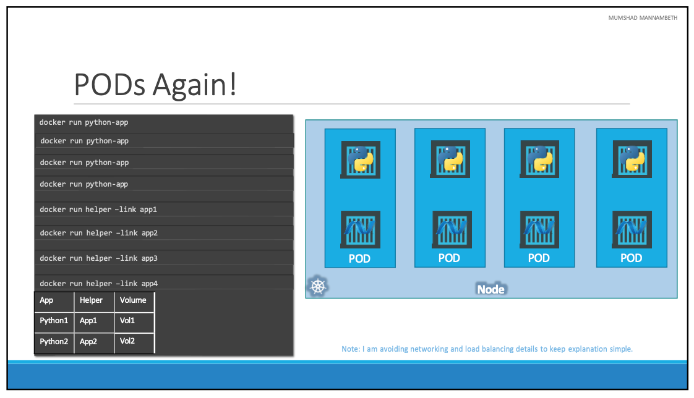
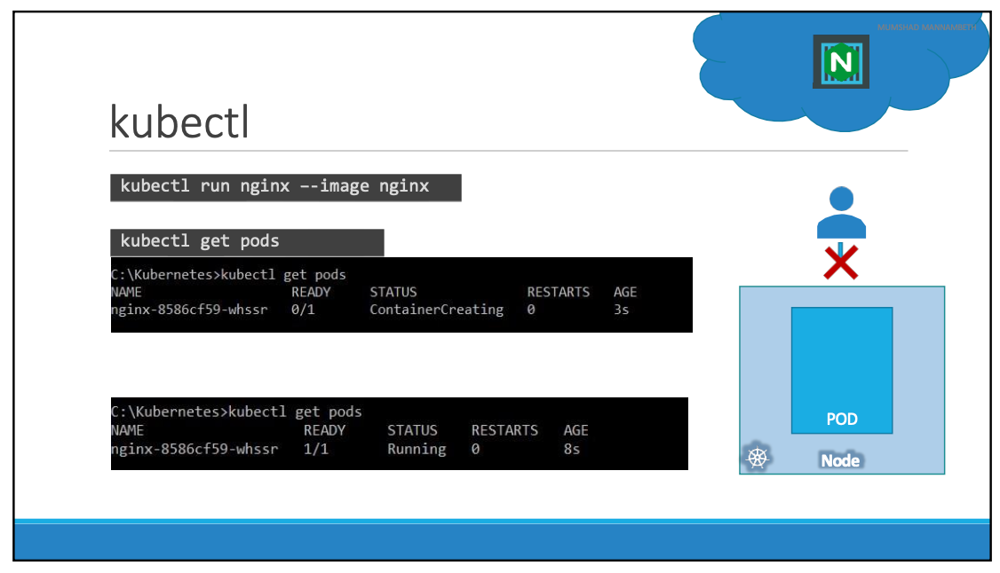

# Pods

- 이번 장에서는 **Certified Kubernetes Administrator (CKA)** 을 준비하며 "Pods"에 대해서 알아보도록 한다.

---

- 쿠버네티스의 궁긍적인 목표는 클러스터에서 워커 노드로 구성된 머신 세트에 컨테이너 형태로 애플리케이션을 배포하는 것이다.
- 하지만 쿠버네티스는 컨테이너를 워커 노드에 직접 배포하지 않는다. 대신, 컨테이너를 "Pod"라고 알려진 쿠버네티스 객체에 캡슐화하여 배포한다.
- "Pod"는 애플리케이션의 단일 인스턴스를 나타낸다. 따라서, 애플리케이션의 인스턴스는 Pod에 의해 정의된다.
- Pod는 애플리케이션의 단일 인스턴스를 나타내기 때문에, Pod는 애플리케이션의 단일 인스턴스를 나타내는 컨테이너의 그룹이다.

- 이미지에서 단일 노드 쿠버네티스 클러스터에 단일 도커 컨테이너에서 실행되는 애플리케이션의 단일 인스턴스가 "Pod"에 캡슐화된 것을 확인할 수 있다.
- 애플리케이션에 액세스하는 사용자 수가 늘어나서 애플리케이션을 확장해야 하는 경우, 부하를 공유하기 위해 웹 애플리케이션 인스턴스를 추가해야 한다.
- 동일한 "Pod"가 아닌 동일한 애플리케이션의 새 인스턴스로 완전히 새로운 "Pod"를 생성해야 한다.
- 분산이 완료되면 동일한 쿠버네티스 시스템 또는 노드에서 두 개의 별도 "Pod"에서 실행되는 웹 애플리케이션의 두 인스턴스가 생성된다.
  
- 사용자가 더 늘어나고 현재 도느에 충분한 용량이 없다면, 언제든지 새로운 노드를 추가하여 새로운 "Pod"를 생성할 수 있다.
- 클러스터의 물리적 용량을 확장하기 위해 클러스턴에 새 노드가 추가된다. 따라서 "Pod"는 일반적으로 애플리케이션을 실행하는 컨테이너와 일대일 관계를 갖는다는 것이다.
- 확장하려는 경우 새로운 "Pod"를 생성하고 축소하려면 "Pod"를 사용하면 된다.

## Multi-Container Pods

- 애플리케이션을 확장하려는 의도라면 추가 "Pod"를 만들어야 한다.
- 하지만 때로는 사용자가 입력한 데이터를 처리하거나 사용자가 업로드한 파일을 처리하는 등 웹 애플리케이션을 위한 지원 작업을 하는 애플리케이션 컨테이너와 함께 실행되어야 할 경우가 있다.
- 이러한 경우 두 컨테이너를 모두 동일한 "Pod"에 실행할 수 있으므로 새 애플리케이션 컨테이너가 생성되면 지원 작업을 하는 애플플리케이션도 생성된다. 종료되는 경우에도 같이 종료된다.
- 두 컨테이너는 동일한 네트워크 네임스페이스를 공유하므로 서로를 'localhost'로 참조하여 직접 통신할 수도 있으며, 동일한 저장 공간을 쉽게 공유할 수도 있다.

- 이미지는 도커 호스트에 애플리케이션을 배포하는 프로세스나 스크립트를 개발하는 방법을 보여준다.
- 먼저 `docker run python-app` 명령을 사용하여 애플리케이션을 배포하면 애플리케이션이 정상적으로 실행되고 사용자가 액세스할 수 있다.
- 부하가 증가하면 `docker run` 명령을 여러 번 실행하여 애플리케이션의 인스턴스를 더 많이 배포한다. 
- 애플리케이션의 복잡도가 증가하여 다른 곳에서 데이터를 처리하거나 패치 작업 등의 도움을 주는 헬퍼 컨테이너가 추가되었다고 가정한다.
- 이렇게 도움을 주는 헬퍼 컨테이너는 애플리케이션 컨테이너와 일대일 관계를 유지하므로 애플리케이션 컨테이너와 직접 통신하고 해당 컨테이너의 데이터에 액세스해야 한다.
- 이러한 요구 사항을 만족하기 위해 서로 연결된 앱 및 헬퍼 컨테이너의 맵을 유지 관리해야 하며 링크와 사용자 지정 네트워크를 사용하여 이러한 컨테이너 간에 네트워크 연결을 직접 설정해야 하며 공유 가능한 볼륨을 만들어 컨테이너 간에 공유하고 해당 맵도 유지 관리 해야 한다.
- 가장 중요한 것은 애플리케이션 상태를 모니터링해야 한다는 것이다.
  
- 컨테이너가 죽으면 헬퍼 컨테이너도 더 이상 피룡하지 않게 되기 때문에 죽여야 하고 새 컨테이너가 배포되면 새로운 헬퍼 컨테이너도 배포해야 한다.
- "Pod"를 사용하면 쿠버네티스가 이 모든 것을 자동으로 처리하므로, 

## Kubectl

- `kubectl run` 명령으로 "Pod"를 생성하여 도커 컨테이너를 배포하였다.
- 위의 예제에서는 "Pod"를 자동으로 생성하고 "nginx" 도커 이미지의 인스턴스를 배포하였다.
- 예제에서는 "--image" 매개변수를 사용하여 이름의 이미지를 지정하였다. 이렇게 지정하는 경우 애플리케이션 이미지는 "Docker Hub" 저장소에서 다운로드 된다.
- "Docker Hub"는 다양한 애플리케이션의 최신 도커 이미지가 저장된 공개 저장소다. 필요한 경우 조직 내의 공개 도커 허브 또는 비공개 저장소에서 이미지를 가져오도록 쿠버네티스를 구성할 수 있다.
- `kubectl get pods` 명령을 사용하여 쿠버네티스 클러스터에서 실행 중인 "Pod" 목록을 확인할 수 있다.

---

### 참고한 강의

- [Kubernetes for the Absolute Beginners](https://www.udemy.com/course/learn-kubernetes)
- [Certified Kubernetes Administrator (CKA)](https://www.udemy.com/course/certified-kubernetes-administrator-with-practice-tests)