# Minikube

- 이번 장에서는 **Certified Kubernetes Administrator (CKA)** 을 준비하며 기본 쿠버네티스 클러스터를 설치하는 방법을 알아보도록 한다.

---

### Kubectl 설치

- [쿠버네티스 공식 홈페이지](https://kubernetes.io)로 이동하여 "Documentation" -> "Tasks" -> "Install Tools"를 선택한다.

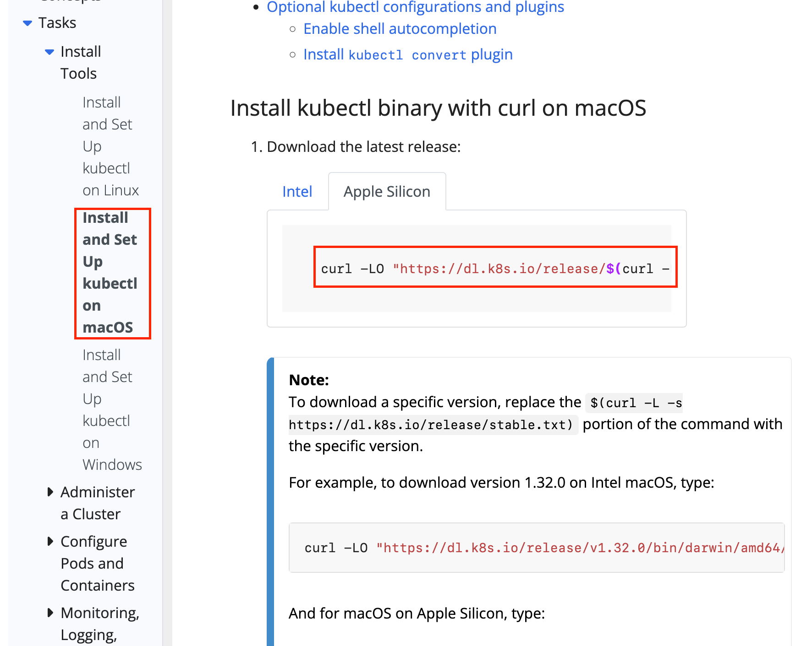

- 자신의 OS에 맞는 탭을 선택하고 커맨드를 복사한다.

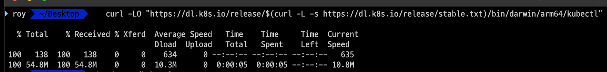

- 설치가 완료되면 `chmod +x ./kubectl` 명령을 입력하여 실행가능한 상태로 변환한다.

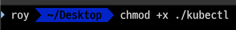

- 변경이 완료되었으면 바이너리 파일을 시스템 경로로 이동시킨다.
  - `sudo mv ./kubectl /usr/local/bin/kubectl`
  - `sudo chown root: /usr/local/bin/kubectl`
  - 이렇게 설정하는 경우 시스템 어디에서든 실행시킬 수 있는 상태가 된다.

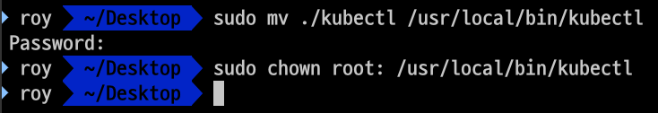

- `kubectl version` 명령을 입력하여 정상적으로 설치되었는지 확인해 본다.

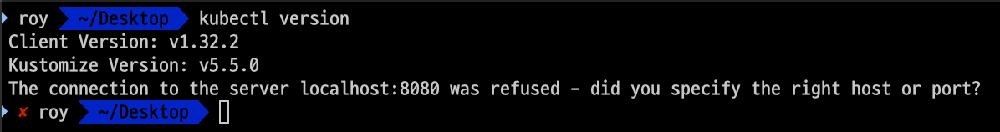

---

### Minikube 설치

- 이번 장에서는 macOS에서 Docker 환경에 Minikube를 설치하는 방법을 알아보도록 한다.
- 호환성 이슈로 실행시킬 때는 docker가 아닌 hyperkit을 사용한다. (docker를 설치하면 hyperkit 사용이 가능)

- `brew install cask` 명령어를 입력한다.  

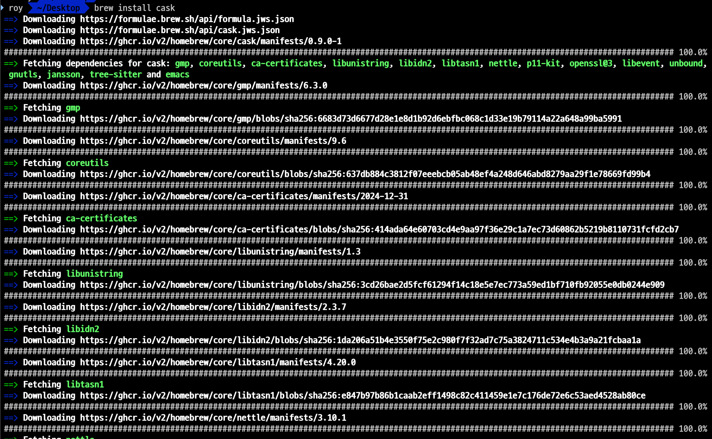

- `brew install --cask virtualbox` 명령어를 입력하여 "docker"를 설치하고 `docker --version` 명령어를 입력하여 정상적으로 설치되었는지 확인한다.

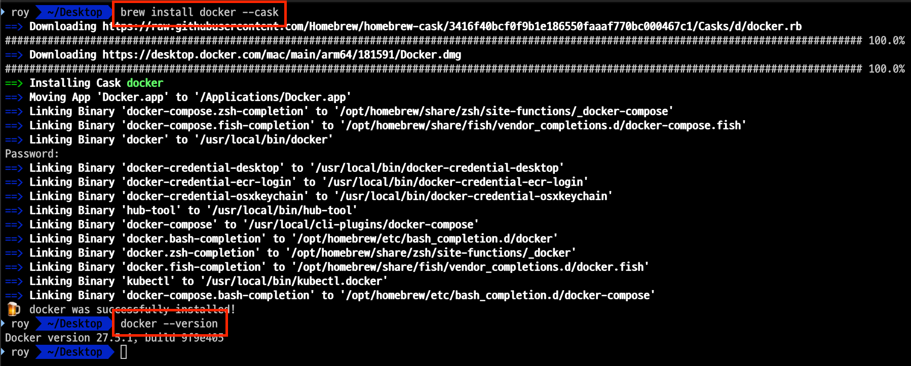

- 설치된 "docker" 애플리케이션을 백그라운드에서 실행되는 상태로 만들어둔다.

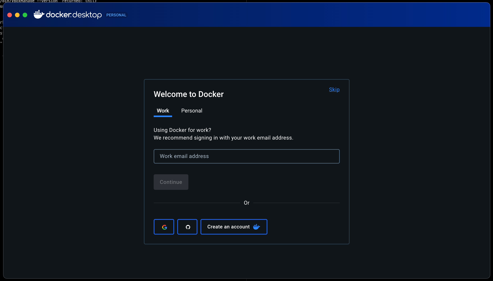

- `brew install minikube` 명령을 입력하여 "Minikube"를 설치한다.

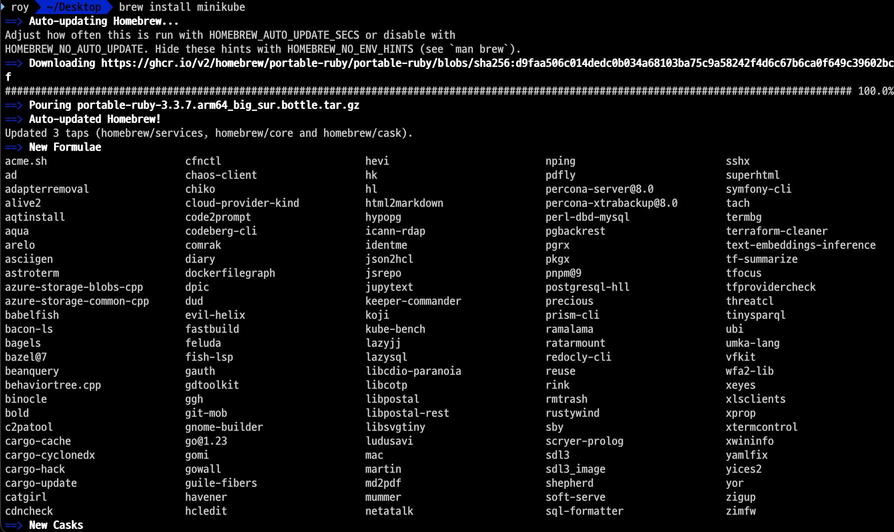

- `minikube start` 명령어를 입력하여 "Minikube"를 실행시킨다. 최초 실행시 필요한 의존성 다운로드로 인해 많은 시간이 소요된다.

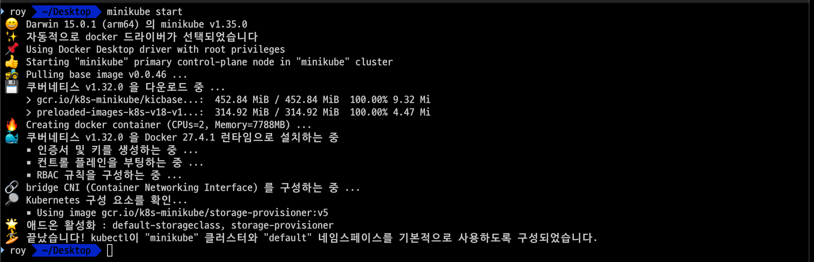

- 정상적으로 실행된 경우 "Docker Desktop" 앱에서 "Minikube" 컨테이너가 실행된 것을 확인할 수 있다.

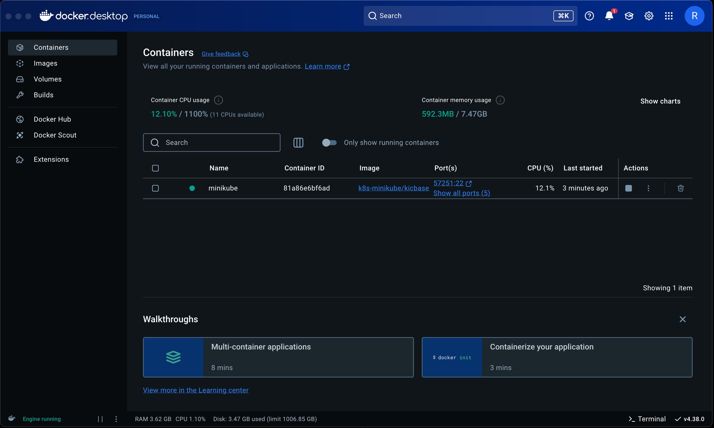

- `minikube status` 명령어를 입력하여 "Minikube"의 상태를 확인한다.

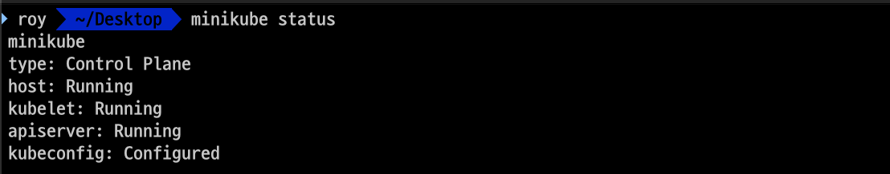

---

### 설치 테스트

- `kubectl get nodes` 명령어를 입력하여 "Minikube"에 설치된 노드를 확인한다.

- 이번에는 클러스터를 이용해 간단한 웹 사이트를 배포해본다.
- `kubectl create deployment hello-minikube --image=k8s.gcr.io/echoserver-arm:1.8` 명령어를 입력하여 "hello-minikube"라는 이름의 디플로이먼트를 생성한다.

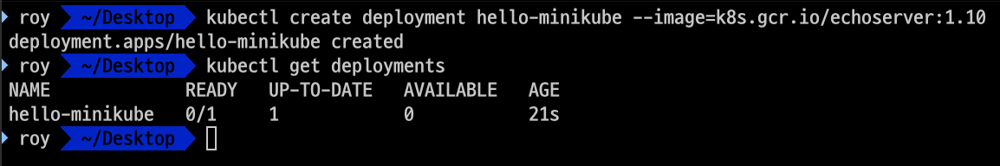

- 이번에는 생성된 디플로이먼트를 서비스로 노출시킨다.
- `kubectl expose deployment hello-minikube --type=NodePort --port=8080` 명령어를 입력한다.

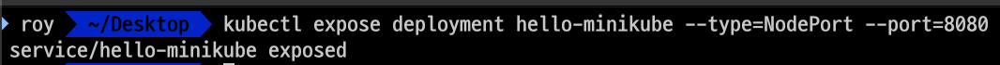

- 생성된 "hello-minikube"의 url을 확인하기 위해 `minikube service hello-minikube` 명령어를 입력한다.

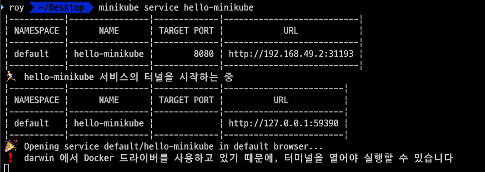

- 정상적으로 실행이되었다면 새로운 브라우저가 실행되면서 정상적으로 접속이 가능하다.

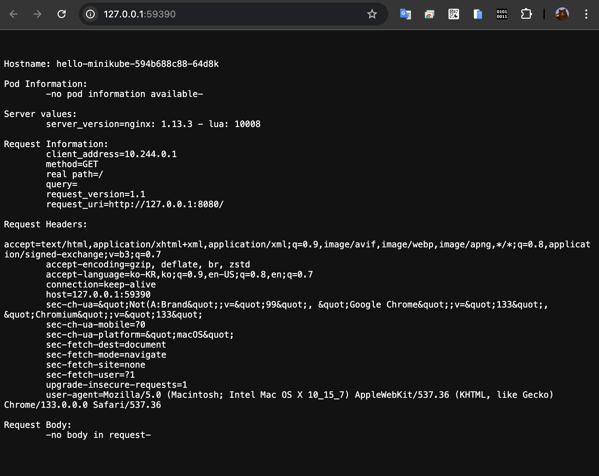

---

### 참고한 강의

- [Kubernetes for the Absolute Beginners](https://www.udemy.com/course/learn-kubernetes)
- [Certified Kubernetes Administrator (CKA)](https://www.udemy.com/course/certified-kubernetes-administrator-with-practice-tests)