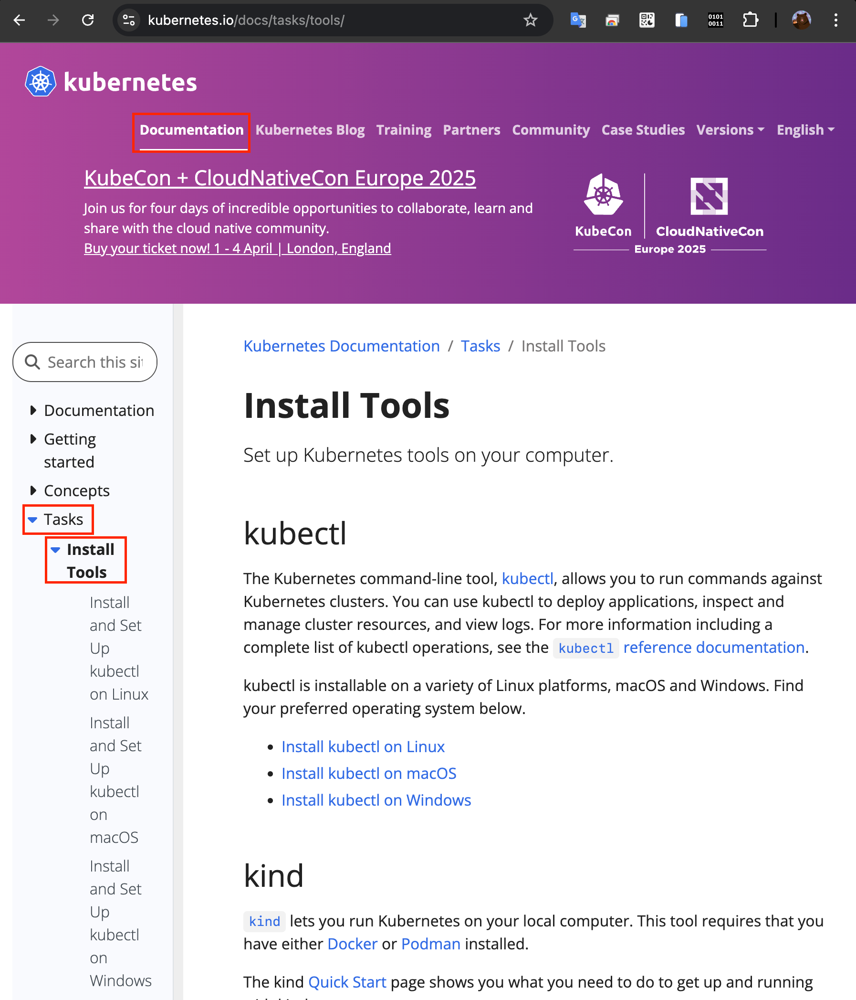
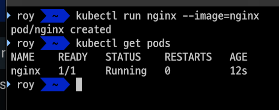

# Minikube

- 이번 장에서는 **Certified Kubernetes Administrator (CKA)** 을 준비하며 기본 쿠버네티스 클러스터를 설치하는 방법을 알아보도록 한다.

---

### Kubectl 설치



- [쿠버네티스 공식 홈페이지](https://kubernetes.io)로 이동하여 "Documentation" -> "Tasks" -> "Install Tools"를 선택한다.


- 자신의 OS에 맞는 탭을 선택하고 커맨드를 복사한다.


- 설치가 완료되면 `chmod +x ./kubectl` 명령을 입력하여 실행가능한 상태로 변환한다.


- 변경이 완료되었으면 바이너리 파일을 시스템 경로로 이동시킨다.
  - `sudo mv ./kubectl /usr/local/bin/kubectl`
  - `sudo chown root: /usr/local/bin/kubectl`
  - 이렇게 설정하는 경우 시스템 어디에서든 실행시킬 수 있는 상태가 된다.


- `kubectl version` 명령을 입력하여 정상적으로 설치되었는지 확인해 본다.


---

### Minikube 설치

- 이번 장에서는 macOS에서 Docker 환경에 Minikube를 설치하는 방법을 알아보도록 한다.
- 호환성 이슈로 실행시킬 때는 docker가 아닌 hyperkit을 사용한다. (docker를 설치하면 hyperkit 사용이 가능)

- `brew install cask` 명령어를 입력한다.  


- `brew install --cask virtualbox` 명령어를 입력하여 "docker"를 설치하고 `docker --version` 명령어를 입력하여 정상적으로 설치되었는지 확인한다.


- 설치된 "docker" 애플리케이션을 백그라운드에서 실행되는 상태로 만들어둔다.


- `brew install minikube` 명령을 입력하여 "Minikube"를 설치한다.


- `minikube start` 명령어를 입력하여 "Minikube"를 실행시킨다. 최초 실행시 필요한 의존성 다운로드로 인해 많은 시간이 소요된다.


- 정상적으로 실행된 경우 "Docker Desktop" 앱에서 "Minikube" 컨테이너가 실행된 것을 확인할 수 있다.


- `minikube status` 명령어를 입력하여 "Minikube"의 상태를 확인한다.


---

### 설치 테스트

- `kubectl get nodes` 명령어를 입력하여 "Minikube"에 설치된 노드를 확인한다.


- 이번에는 클러스터를 이용해 간단한 웹 사이트를 배포해본다.
- `kubectl create deployment hello-minikube --image=k8s.gcr.io/echoserver-arm:1.8` 명령어를 입력하여 "hello-minikube"라는 이름의 디플로이먼트를 생성한다.


- 이번에는 생성된 디플로이먼트를 서비스로 노출시킨다.
- `kubectl expose deployment hello-minikube --type=NodePort --port=8080` 명령어를 입력한다.


- 생성된 "hello-minikube"의 url을 확인하기 위해 `minikube service hello-minikube` 명령어를 입력한다.


- 정상적으로 실행이되었다면 새로운 브라우저가 실행되면서 정상적으로 접속이 가능하다.


---

### Nginx Pods 실행

- `kubectl run nginx --image=nginx` 명령어를 입력하여 Nginx Pods를 실행시킨다.
- 정상적으로 실행되었다는 메시지가 확인되면 `kubectl get pods` 명령어를 입력하여 실행된 Pods를 확인한다.



- `kubectl describe pods`를 입력하여 Pods의 상세 정보를 확인할 수 있다.

```shell
Name:             nginx
Namespace:        default
Priority:         0
Service Account:  default
Node:             minikube/192.168.49.2
Start Time:       Wed, 19 Feb 2025 14:46:33 +0900
Labels:           run=nginx
Annotations:      <none>
Status:           Running
IP:               10.244.0.3
IPs:
  IP:  10.244.0.3
Containers:
  nginx:
    Container ID:   docker://53daa776e6792e2f4d64f69966a1cf660d289301d43c37b7ef711a42a2f58200
    Image:          nginx
    Image ID:       docker-pullable://nginx@sha256:91734281c0ebfc6f1aea979cffeed5079cfe786228a71cc6f1f46a228cde6e34
    Port:           <none>
    Host Port:      <none>
    State:          Running
      Started:      Wed, 19 Feb 2025 14:46:44 +0900
    Ready:          True
    Restart Count:  0
    Environment:    <none>
    Mounts:
      /var/run/secrets/kubernetes.io/serviceaccount from kube-api-access-wfnbr (ro)
Conditions:
  Type                        Status
  PodReadyToStartContainers   True
  Initialized                 True
  Ready                       True
  ContainersReady             True
  PodScheduled                True
Volumes:
  kube-api-access-wfnbr:
    Type:                    Projected (a volume that contains injected data from multiple sources)
    TokenExpirationSeconds:  3607
    ConfigMapName:           kube-root-ca.crt
    ConfigMapOptional:       <nil>
    DownwardAPI:             true
QoS Class:                   BestEffort
Node-Selectors:              <none>
Tolerations:                 node.kubernetes.io/not-ready:NoExecute op=Exists for 300s
                             node.kubernetes.io/unreachable:NoExecute op=Exists for 300s
Events:
  Type    Reason     Age   From               Message
  ----    ------     ----  ----               -------
  Normal  Scheduled  109s  default-scheduler  Successfully assigned default/nginx to minikube
  Normal  Pulling    109s  kubelet            Pulling image "nginx"
  Normal  Pulled     98s   kubelet            Successfully pulled image "nginx" in 10.696s (10.696s including waiting). Image size: 197280883 bytes.
  Normal  Created    98s   kubelet            Created container: nginx
  Normal  Started    98s   kubelet            Started container nginx
```

- Pod의 이름: nginx
- Pod의 네임스페이스: default
- Pod의 현재 상태: Running (실행 중)
- Pod의 준비 상태: True (컨테이너가 요청을 받을 준비가 되어 있음)
- Pods의 IP: 10.244.0.3
- Pods의 Node: minikube
- Pods의 컨테이너 이름: nginx
- Pods의 컨테이너 이미지: nginx
- Pods의 컨테이너 상태: Running
- 재시작 횟수: 0
  
- `kubectl get pods -o wide` 명령어를 입력하여 Pods의 상세 정보를 확인할 수 있다.

```shell
NAME    READY   STATUS    RESTARTS   AGE     IP           NODE       NOMINATED NODE   READINESS GATES
nginx   1/1     Running   0          5m19s   10.244.0.3   minikube   <none>           <none>
```

---

### 참고한 강의

- [Kubernetes for the Absolute Beginners](https://www.udemy.com/course/learn-kubernetes)
- [Certified Kubernetes Administrator (CKA)](https://www.udemy.com/course/certified-kubernetes-administrator-with-practice-tests)