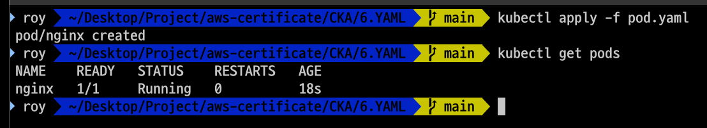

# YAML

- 이번 장에서는 **Certified Kubernetes Administrator (CKA)** 을 준비하며 YAML 사용법 대해서 알아보고 YAML을 사용하여 리소스를 생성하는 방법에 대해서 알아본다.

---

### 쿠버네티스의 YAML

```yaml
apiVersion: v1
kind: Pod
metadata:
  name: myapp-pod
  labels:
    app: myapp
    type: front-end
spec:
  containers:
    - name: nginx-container
      image: nginx
```

- 쿠버네티스 정의 파일에는 항상 4개의 최상위 필드가 포함된다. 모두 필수 필드이므로 구성 파일에 반드시 있어야 한다. 
  - **apiVersion**: pod와 service의 경우 v1, deployment와 replicaSet의 경우 apps/v1 등이 사용된다.
  - **kind**: pod, deployment, service 등이 사용된다.
  - **metadata**: 이름, 레이블 등의 메타데이터를 포함한다.
    이름과 레이블은 메타데이터의 자식 속성이다. 두 속성인 name과 labels 앞의 공백 수는 중요하지 않지만 형제이므로 같아야 한다.
    애플리케이션, 그리고 그 중 수백 개가 백엔드 애플리케이션이나 데이터베이스를 실행하고 있다면, 배포된 후 이러한 Pod를 그룹화하는 것은 매우 어려운 일이 된다.
    프론트엔드, 백엔드 또는 데이터베이스로 레이블을 지정하면 나중에 이 레이블을 기준으로 Pod를 필터링할 수 있다.
    메타데이터에서 쿠버네티스가 메타데이터에 있을 것으로 예상하는 이름이나 레이블 또는 다른 것만 지정할 수 있다는 점에 유의해야 한다.
    이 아래에 원하는 대로 다른 속성을 추가할 수 없고, 레이블 아래에 원하는 모든 종류의 키 또는 값 쌍을 가질 수 있다.
  - **spec**: 해당 객체와 관련된 추가 정보를 쿠버네티스에 제공한다. 이것은 객체마다 다를 것이므로, 각각에 대한 올바른 형식을 얻으려면 쿠버네티스 문서를 참조해야 한다.

---

### YAML을 사용한 Pod 생성

- nginx를 실행시킬 수 있는 정보를 담고 있는 pod.yaml 파일을 생성한다.

```ymal
apiVersion: v1
kind: Pod
metadata:
  name: nginx
  labels:
    app: nginx
    tier: frontend
spec:
  containers:
    - name: nginx
      image: nginx
```

- `kubectl apply -f pod.yaml` 명령어를 입력하여 pod.yaml 파일을 실행시킨다.
- `kubectl get pods` 명령어를 입력하여 생성된 Pod를 확인한다.



- `kubectl describe pod nginx` 명령어를 입력하여 Pod의 상세 정보를 확인한다.

```shell
Name:             nginx
Namespace:        default
Priority:         0
Service Account:  default
Node:             minikube/192.168.49.2
Start Time:       Wed, 19 Feb 2025 16:36:17 +0900
Labels:           app=nginx
                  tier=frontend
Annotations:      <none>
Status:           Running
IP:               10.244.0.4
IPs:
  IP:  10.244.0.4
Containers:
  nginx:
    Container ID:   docker://cbc33faf2215ffc3aed177ca199b1de9faa350a81668f45564497eb5515c6b6d
    Image:          nginx
    Image ID:       docker-pullable://nginx@sha256:91734281c0ebfc6f1aea979cffeed5079cfe786228a71cc6f1f46a228cde6e34
    Port:           <none>
    Host Port:      <none>
    State:          Running
      Started:      Wed, 19 Feb 2025 16:36:19 +0900
    Ready:          True
    Restart Count:  0
    Environment:    <none>
    Mounts:
      /var/run/secrets/kubernetes.io/serviceaccount from kube-api-access-kq6rl (ro)
Conditions:
  Type                        Status
  PodReadyToStartContainers   True
  Initialized                 True
  Ready                       True
  ContainersReady             True
  PodScheduled                True
Volumes:
  kube-api-access-kq6rl:
    Type:                    Projected (a volume that contains injected data from multiple sources)
    TokenExpirationSeconds:  3607
    ConfigMapName:           kube-root-ca.crt
    ConfigMapOptional:       <nil>
    DownwardAPI:             true
QoS Class:                   BestEffort
Node-Selectors:              <none>
Tolerations:                 node.kubernetes.io/not-ready:NoExecute op=Exists for 300s
                             node.kubernetes.io/unreachable:NoExecute op=Exists for 300s
Events:
  Type    Reason     Age   From               Message
  ----    ------     ----  ----               -------
  Normal  Scheduled  2m1s  default-scheduler  Successfully assigned default/nginx to minikube
  Normal  Pulling    2m1s  kubelet            Pulling image "nginx"
  Normal  Pulled     119s  kubelet            Successfully pulled image "nginx" in 1.805s (1.805s including waiting). Image size: 197280883 bytes.
  Normal  Created    119s  kubelet            Created container: nginx
  Normal  Started    119s  kubelet            Started container nginx
```

---

### 참고한 강의

- [Kubernetes for the Absolute Beginners](https://www.udemy.com/course/learn-kubernetes)
- [Certified Kubernetes Administrator (CKA)](https://www.udemy.com/course/certified-kubernetes-administrator-with-practice-tests)