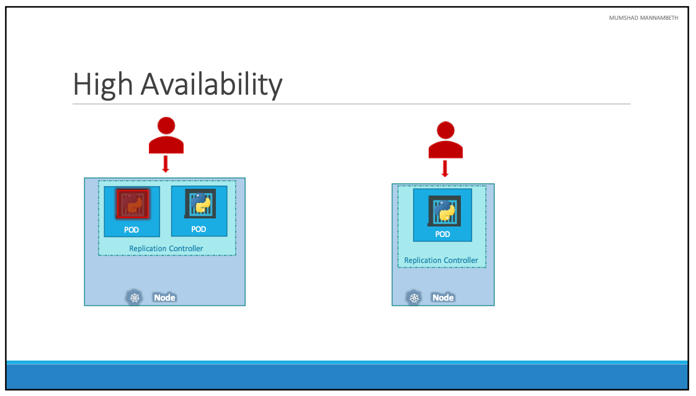
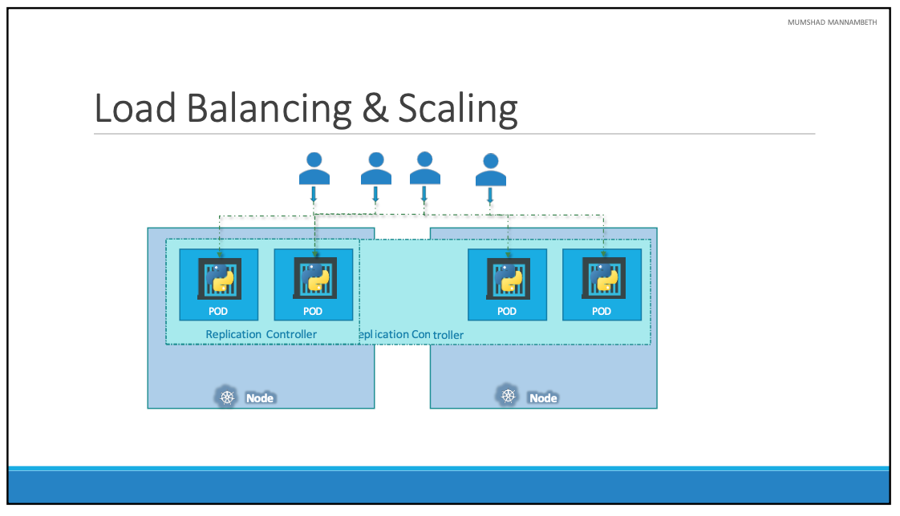
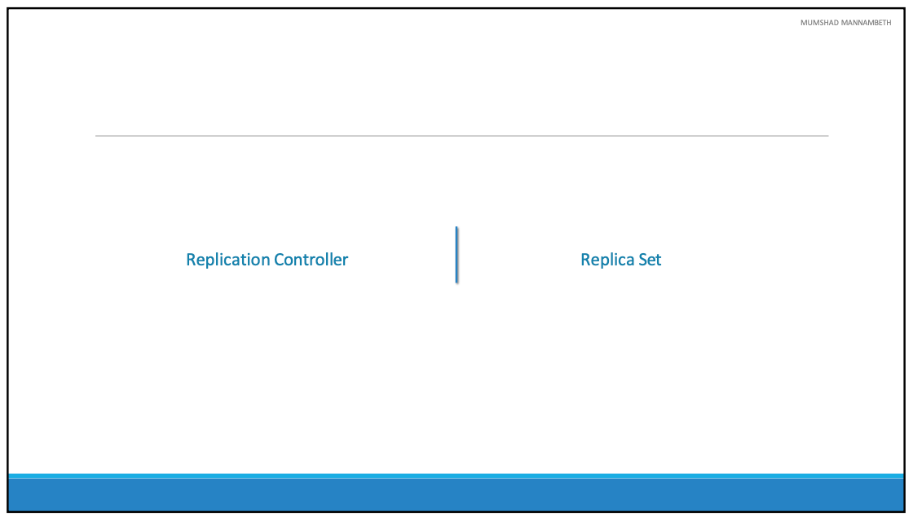
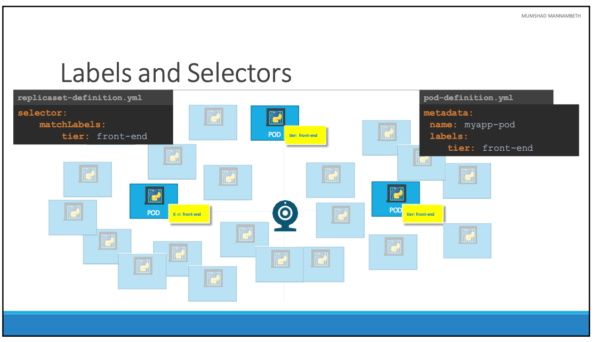
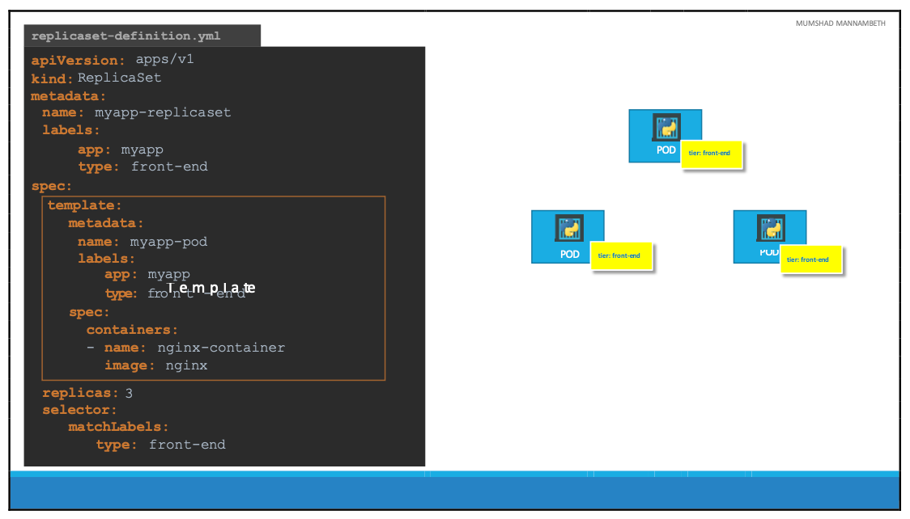
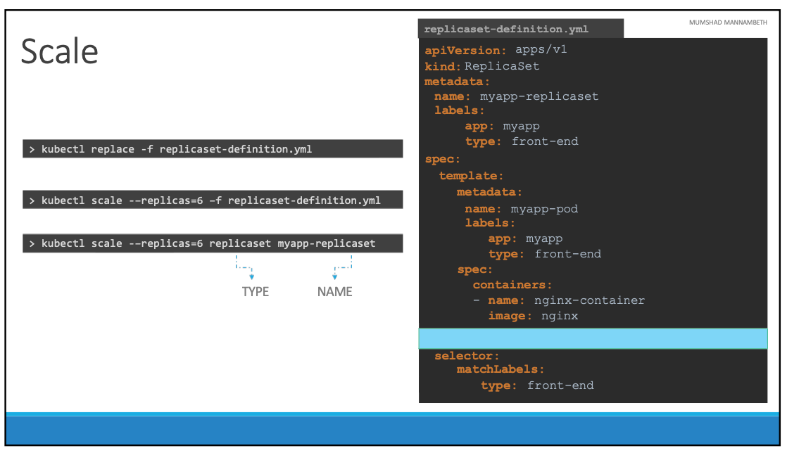
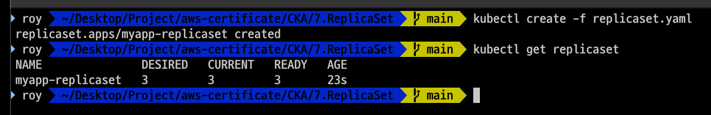

# Replication Controller

- 이번 장에서는 **Certified Kubernetes Administrator (CKA)** 을 준비하며 Replication Controller에 대해서 알아본다.

---

### Replication Controller



- 어떤 이유로 애플리케이션이 충돌하고 "Pod"가 실패하는 경우 사용자는 더 이상 애플리케이션에 액세스할 수 없다.
- 사용자가 애플리케이션에 대한 액세스 권한을 잃지 않도록 하려면 동시에 두 개 이상의 인스턴스 또는 "Pod"를 실행해야 한다.
  이렇게 실행하는 경우 하나가 실패하더라도 다른 하나에서 애플리케이션을 계속 실행할 수 있다.
- "Replication Controller"는 Kubernetes 클러스터에서 단일 Pod의 여러 인스턴스를 실행하여 고가용성을 제공하는 데 도움이 된다.
- 단일 Pod를 사용하더라도 "Replication Controller"는 기존 Pod가 실패할 때 자동으로 새 Pod를 생성하여 도움을 줄 수 있다.
- 따라서 "Replication Controller"는 지정된 수의 Pod가 항상 실행되도록 보장하여, 1개든 100개든 지정된 Pod를 실행시킨다.



- "Replication Controller"가 필요한 또 다른 이유는 여러 Pod를 만들어 부하를 분산하기 위함이다.
- 예를 들어, 사용자의 수가 증가하면 두 Pod에 부하를 분산하기 위해 추가 Pod를 배포한다.
- 수요가 더 증가하고 첫 번째 노드에서 리소스가 부족해지면 클러스터의 다른 노드에 추가 Pod를 배포할 수 있다.
- "Replication Controller"는 클러스터의 여러 노드에 걸쳐 있기 때문에, 이를 통해 다른 노드의 여러 Pod에 부하를 분산하고 수요가 증가할 때 애플리케이션을 확장하는 데 도움이 된다.



- "Replication Controller"와 "ReplicaSet"은 동일한 목적을 가지고 있지만 동일하지는 않다.
- "Replication Controller"는 오래된 버전이며, "ReplicaSet"은 새로운 버전으로 권장되는 방법이다.
- 각각의 작동 방식에는 사소한 차이가 있다.

---

```yaml title=rc-definition.yaml
apiVersion: v1
kind: ReplicationController
metadata:
  name: myapp-rc
  labels:
    app: myapp
    type: front-end
spec:
  template:
    // POD 정의 ..
    metadata:
      name: myapp-pod
      labels:
        app: myapp
        type: front-end
    spec:
        containers:
          - name: nginx-container
            image: nginx
  replicas: 3
```

- "Replication Controller"는 apiVersion v1에서 지원된다.
- 모든 쿠버네티스 리소스의 경우 spec 필드는 우리가 만들고 있는 객체 내부에 무엇이 있는지 정의한다.
- "Replication Controller"가 복제본을 만드는 데 사용할 Pod 템플릿을 제공하기 위해 Spec 영역에 template 영역을 추가한다.
- replicas 필드는 "Replication Controller"가 실행할 Pod의 수를 지정하며, template과 같은 수준에 정의된다.

---

```yaml title=replicaset-definition.yaml
apiVersion: apps/v1
kind: ReplicaSet
metadata:
  name: myapp-replicaset
  labels:
    app: myapp
    type: front-end
spec:
  template:
    // POD 정의 ..
    metadata:
      name: myapp-pod
      labels:
        app: myapp
        type: front-end
    spec:
        containers:
          - name: nginx-container
            image: nginx
  replicas: 3
  selector:
    matchLabels:
      type: front-end
```

- "ReplicaSet"은 apiVersion apps/v1에서 지원된다. v1을 사용하는 경우 오류가 발생한다.
- Spec 영역은 "Replication Controller"와 유사하게 template과 replicas 필드를 포함한다.
- "ReplicaSet"은 "Replication Controller"와 다르게 selector 필드를 포함한다.
  이유는 ReplicaSet이 해당 Pod의 일부로 생성되지 않은 Pod도 관리할 수 있기 때문이다.
- 예를 들어, "ReplicaSet" 생성 전에 selector에서 지정한 레이블과 일치하는 Pod가 생성되었다면 "ReplicaSet"은 복제본을 생성할 때 해당 Pod도 고려한다.
- "ReplicationController"의 경우 selector는 필수 필드가 아니지만 사용할 수 있다.
- matchLabels selector는 그 아래에 지정된 레이블을 Pod의 레이블과 일치시키기만 하면 된다.

---

### Labels and Selectors



- 프론트엔드 웹 애플리케이션의 3개의 인스턴스를 3개의 Pod에 배포하였다.
- "ReplicaSet"은 이비지에서처럼 기존 Pod를 모니터링하고 생성되지 않은 경우 새 Pod를 생성한다.
- "ReplicaSet"의 역할은 Pod를 모니터링하고 그 중 하나가 실패하면 새 Pod를 배포하는 것이다.
- 여기서 "ReplicaSet"이 어떤 Pod를 모니터링해야 하는지 지정할 필요가 있고, 이럴 때 사용하는 것이 Selector이다.
- 클러스터에는 다른 애플리케이션을 실행하는 수백 개의 다른 Pod가 있을 수 있다.
  이는 Pod를 생성하는 동안 레이블을 지정하는 것이 편리하다, 이러한 레이블을 ReplicaSet에 대한 필터로 제공할 수 있다.
- Selector 영역에서 matchLabels 필터를 사용하고 Pod를 생성하는 동안 사용한 것과 동일한 레이블을 제공한다.
  이렇게 하면 "ReplicaSet"가 어떤 Pod를 모니터링해야 하는지 알 수 있다.



- 이미 생성된 기존 Pod가 3개 있고 Pod를 모니터링하여 항상 최소 3개가 실행되도록 "ReplicaSet"을 만들어야 한다.
- "ReplicaSet"이 생성되면 일치하는 레이블이 있는 Pod가 3개 이미 생성되어 있으므로 새로운 Pod를 배포하지 않는다.
- "ReplicaSet"이 새로운 Pod를 만들 필요가 없는 경우라 하더라도 template 영역은 필요하다.
  Pod 중 하나가 나중에 실패하는 경우 "ReplicaSet"이 원하는 수의 Pod를 유지하기 위해 새로운 Pod를 만들어야 하기 때문이다.



- 이미 3개의 복제본이 있는 상황을 가정하고, 6개의 복제본으로 확장하는 방법에 대해서 알아본다.

1. `kubectl replace -f replicaset-definition.yaml` 명령어를 입력하여 "ReplicaSet"을 업데이트한다.
2. `kubectl scale --replicas=6 -f replicaset-definition.yaml` 명령어를 입력하여 "ReplicaSet"을 확장한다.
3. `kubectl scale --replicas=6 replicaset myapp-replicaset` 명령어를 입력하여 "ReplicaSet"을 확장한다.

- `kubectl scale` 명령을 사용하는 경우 파일에 명시되어 있는 복제본의 수는 변경되지 않으므로 주의가 필요하다.

---

### 예제

- "ReplicaSet"을 생성할 replicaset.yaml 파일을 작성한다.

```yaml title=replicaset.yaml
apiVersion: apps/v1
kind: ReplicaSet
metadata:
  name: myapp-replicaset
  labels:
    app: myapp
spec:
  selector:
    matchLabels:
      app: myapp
  replicas: 3
  template:
    metadata:
      name: nginx-2
      labels:2
        app: myapp
    spec:
      containers:
        - name: nginx
          image: nginx
```

- `kubectl create -f replicaset.yaml` 명령어를 입력하여 "ReplicaSet"을 생성한다.
- `kubectl get replicaset` 명령어를 입력하여 "ReplicaSet"을 확인한다.



- `kubectl get pods` 명령어를 입력하여 "Pod"를 확인한다.

```bash
NAME                     READY   STATUS    RESTARTS   AGE
myapp-replicaset-8vfck   1/1     Running   0          100s
myapp-replicaset-ckn8d   1/1     Running   0          100s
myapp-replicaset-f457s   1/1     Running   0          100s
```

- 생성된 Pod 중 하나를 임의로 삭제한다. `kubectl delete pod myapp-replicaset-8vfck` 명령어를 입력한다.
- `pod myapp-replicaset-8vfck deleted` 메시지가 출력되면 Pod가 삭제된 것을 확인할 수 있다.
- 하지만 다시 `kubectl get pods` 명령어를 입력하여 확인하면 새로운 Pod가 생성되어 있는 것을 확인할 수 있다.

```bash
NAME                     READY   STATUS    RESTARTS   AGE
myapp-replicaset-ckn8d   1/1     Running   0          3m36s
myapp-replicaset-f457s   1/1     Running   0          3m36s
myapp-replicaset-jfkq8   1/1     Running   0          6s
```

- `kubectl describe replicaset myapp-replicaset` 명령어를 입력하여 "ReplicaSet"에 대한 자세한 정보를 확인할 수 있다.

```bash
Name:         myapp-replicaset
Namespace:    default
Selector:     app=myapp
Labels:       app=myapp
Annotations:  <none>
Replicas:     3 current / 3 desired
Pods Status:  3 Running / 0 Waiting / 0 Succeeded / 0 Failed
Pod Template:
  Labels:  app=myapp
  Containers:
   nginx:
    Image:         nginx
    Port:          <none>
    Host Port:     <none>
    Environment:   <none>
    Mounts:        <none>
  Volumes:         <none>
  Node-Selectors:  <none>
  Tolerations:     <none>
Events:
  Type    Reason            Age    From                   Message
  ----    ------            ----   ----                   -------
  Normal  SuccessfulCreate  4m22s  replicaset-controller  Created pod: myapp-replicaset-f457s
  Normal  SuccessfulCreate  4m22s  replicaset-controller  Created pod: myapp-replicaset-8vfck
  Normal  SuccessfulCreate  4m22s  replicaset-controller  Created pod: myapp-replicaset-ckn8d
  Normal  SuccessfulCreate  52s    replicaset-controller  Created pod: myapp-replicaset-jfkq8
```

---

- 이번에는 동일한 레이블을 가지고 있는 Pod를 추가로 생성하는 경우 어떻게 작동하는지 확인해 본다.

```yaml title=nginx.yaml
apiVersion: v1
kind: Pod
metadata:
  name: nginx-2
  labels:
    app: myapp
spec:
  containers:
    - name: nginx
      image: nginx
```

- `kubectl create -f nginx.yaml` 명령어를 입력하여 "Pod"를 생성한다.
- 정상적으로 Pod가 생성되었는지 `kubectl get pods`를 입력하여 확인한다.

```bash
NAME                     READY   STATUS        RESTARTS   AGE
myapp-replicaset-ckn8d   1/1     Running       0          8m40s
myapp-replicaset-f457s   1/1     Running       0          8m40s
myapp-replicaset-jfkq8   1/1     Running       0          5m10s
nginx-2                  0/1     Terminating   0          1s
```

- 새롭게 생성된 Pod인 `nginx-2`는 `Terminating` 상태로 생성되었음을 확인할 수 있다.
- "ReplicaSet"이 정의된 복제본 수보다 더 많은 Pod가 생성되지 않도록 자동으로 제거한 것이다.

---

- 이번에는 총 세 개의 복제본을 4개로 늘려보도록 한다.
- `kubectl edit replicaset myapp-replicaset` 명령어를 입력한다.

```bash
# Please edit the object below. Lines beginning with a '#' will be ignored,
# and an empty file will abort the edit. If an error occurs while saving this file will be
# reopened with the relevant failures.
#
apiVersion: apps/v1
kind: ReplicaSet
metadata:
  creationTimestamp: "2025-02-19T10:44:51Z"
  generation: 1
  labels:
    app: myapp
  name: myapp-replicaset
  namespace: default
  resourceVersion: "15179"
  uid: 70e649e1-0429-49ed-9d24-372773b13a6b
spec:
  replicas: 3
  selector:
    matchLabels:
      app: myapp
  template:
    metadata:
      creationTimestamp: null
      labels:
        app: myapp
      name: nginx-2
    spec:
      containers:
      - image: nginx
        imagePullPolicy: Always
        name: nginx
        resources: {}
        terminationMessagePath: /dev/termination-log
        terminationMessagePolicy: File
      dnsPolicy: ClusterFirst
      restartPolicy: Always
      schedulerName: default-scheduler
      securityContext: {}
      terminationGracePeriodSeconds: 30
status:
  availableReplicas: 3
  fullyLabeledReplicas: 3
  observedGeneration: 1
  readyReplicas: 3
  replicas: 3
```

- 터미널에 노출되는 정보는 "ReplicaSet"을 구성하는 정보는 맞지만 우리가 입력한 파일의 정보와 완벽하게 일치하지는 않는다.
  존재하는 개체 구성을 수정할 수 있도록 쿠버네티스가 메모리에서 만든 임시파일이다. 
- replicas를 "4"로 수정하고 `wq!`를 입력하여 저장하고 나온다.

```bash
NAME                     READY   STATUS    RESTARTS   AGE
myapp-replicaset-ckn8d   1/1     Running   0          15m
myapp-replicaset-dfq6g   1/1     Running   0          3s
myapp-replicaset-f457s   1/1     Running   0          15m
myapp-replicaset-jfkq8   1/1     Running   0          12m
```

- 새로운 Pod가 생성되었음을 확인할 수 있다.

- `kubectl scale replicaset myapp-replicaset --replicas=2` 명령어를 입력하여 "ReplicaSet"을 축소한다.
- `kubectl get pods` 명령어를 입력하여 Pod가 줄어든 것을 확인할 수 있다.

```bash
NAME                     READY   STATUS    RESTARTS   AGE
myapp-replicaset-ckn8d   1/1     Running   0          17m
myapp-replicaset-jfkq8   1/1     Running   0          13m
```

---

### 참고한 강의

- [Kubernetes for the Absolute Beginners](https://www.udemy.com/course/learn-kubernetes)
- [Certified Kubernetes Administrator (CKA)](https://www.udemy.com/course/certified-kubernetes-administrator-with-practice-tests)