# Deployment

- 이번 장에서는 **Certified Kubernetes Administrator (CKA)** 을 준비하며 Deployment에 대해서 알아본다.

---

### Deployment

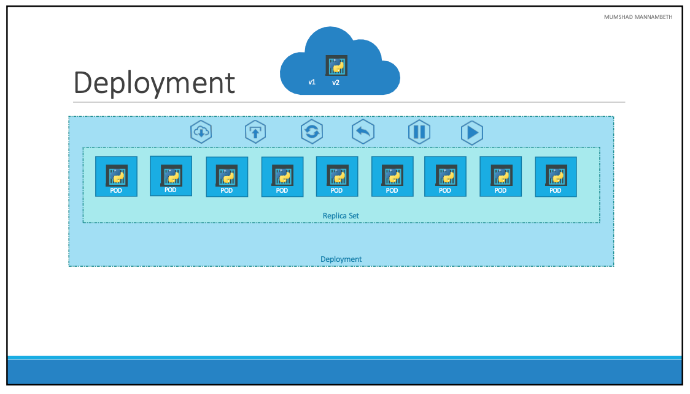

- 운영 환경에 배포되어야 하는 애플리케이션이 있으며 여러 이유에 의해서 여러 개의 인스턴스로 실행되고 있다.
- 만약, Docker Registry에 새로운 이미지가 올라오게 된다면 모든 인스턴스를 업데이트 해야 한다.
- 이렇게 업데이트가 필요한 경우 서비스가 중단되면 안되기 때문에 한번에 모든 인스턴스를 업데이트할 수는 없다.
- 인스턴스를 하나씩 업데이트하는 방식으로 서비스 중단없이 업데이트할 수 있으며 이러한 업데이트를 롤링 업데이트라 한다.
  
- 쿠버네티스의 Deployment는 롤링 업데잍를 사용하여 기본 인스턴스를 원활하게 업데이트하고, 변경사항을 취소하거나, 배포에 대한 변경사항을 일시중지하고 다시 시작하는 기능을 제공한다.

#### Definition

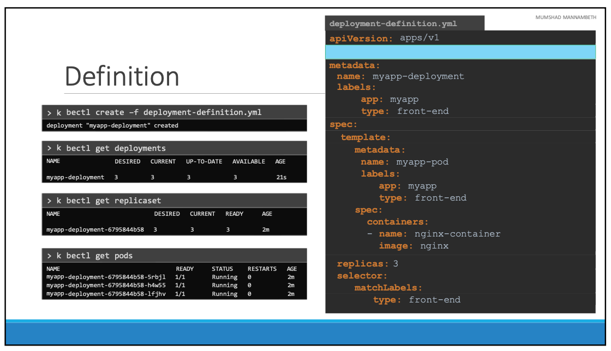

- "kind"를 제외하면 "ReplicaSet"과 매우 유사하다.
- `kubectl create -f deployment-definition.yaml` 명령어를 통해 Deployment를 생성할 수 있다.
- 이후 `kubectl get deployment` 명령어를 통해 Deployment를 확인할 수 있다.
- `kubectl get replicasets` 명령어를 실행하면 Deployment 이름에서 새 ReplicaSet이 생성된 것을 확인할 수 있다.
- 결과적으로 Pod를 생성하므로 `kubectl get pods` 명령어를 통해 Pod 명령을 실행하면 Deployment 이름과 ReplicaSet가 있는 Pod를 확인할 수 있다.

#### Commands

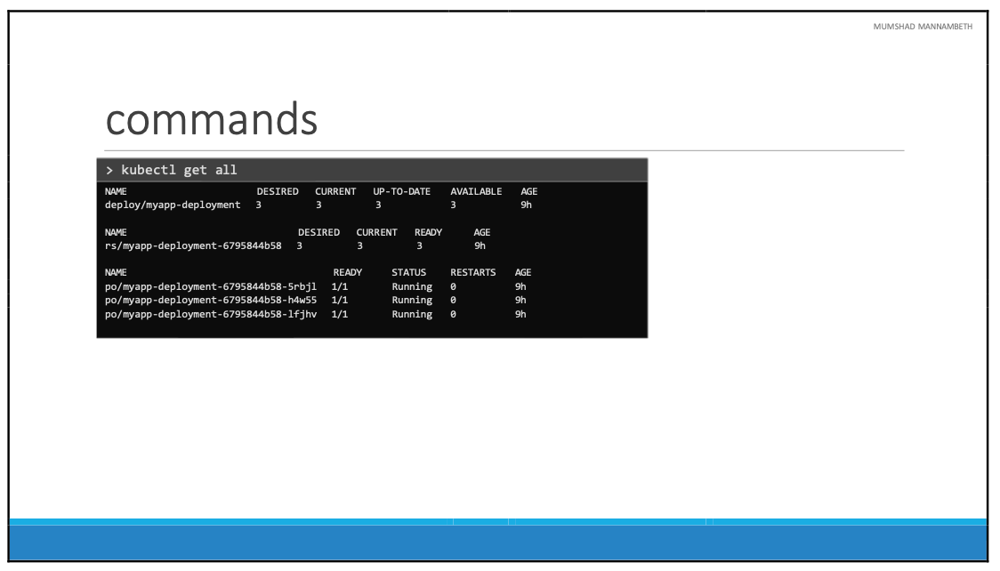

- `kubectl get all` 명령어를 통해 생성된 모든 객체를 한 번에 확인할 수 있다.

#### Example

- "Deployment"를 생성할 deployment.yaml 파일을 작성한다.

```yaml title=deployment.yaml
apiVersion: apps/v1
kind: Deployment
metadata:
  name: myapp-deployment
  labels:
    tier: frontend
    app: nginx
spec:
  selector:
    matchLabels:
      app: myapp
  replicas: 3
  template:
    metadata:
      name: nginx-2
      labels:
        app: myapp
    spec:
      containers:
        - name: nginx
          image: nginx
```

- `kubectl create -f deployment.yaml` 명령어를 입력하여 "Deployment"를 생성한다.
- `kubectl get deployment` 명령어를 입력하여 "Deployment"를 확인한다.

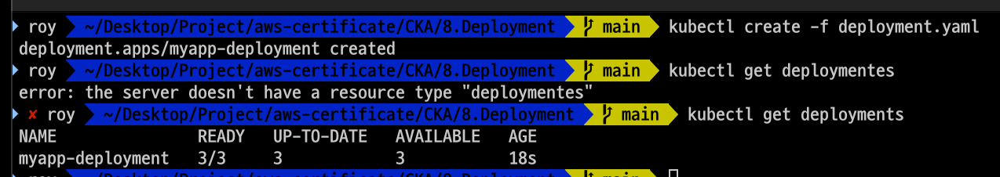

- `kubectl describe deployment myapp-deployment` 명령어를 입력하여 "Deployment"에 대한 자세한 정보를 확인한다.

```bash
Name:                   myapp-deployment
Namespace:              default
CreationTimestamp:      Thu, 20 Feb 2025 14:43:55 +0900
Labels:                 app=nginx
                        tier=frontend
Annotations:            deployment.kubernetes.io/revision: 1
Selector:               app=myapp
Replicas:               3 desired | 3 updated | 3 total | 3 available | 0 unavailable
StrategyType:           RollingUpdate
MinReadySeconds:        0
RollingUpdateStrategy:  25% max unavailable, 25% max surge
Pod Template:
  Labels:  app=myapp
  Containers:
   nginx:
    Image:         nginx
    Port:          <none>
    Host Port:     <none>
    Environment:   <none>
    Mounts:        <none>
  Volumes:         <none>
  Node-Selectors:  <none>
  Tolerations:     <none>
Conditions:
  Type           Status  Reason
  ----           ------  ------
  Available      True    MinimumReplicasAvailable
  Progressing    True    NewReplicaSetAvailable
OldReplicaSets:  <none>
NewReplicaSet:   myapp-replicaset (3/3 replicas created)
Events:
  Type    Reason             Age    From                   Message
  ----    ------             ----   ----                   -------
  Normal  ScalingReplicaSet  2m11s  deployment-controller  Scaled up replica set myapp-replicaset from 2 to 3
```

- `kubectl get all` 명령어를 입력하여 생성된 모든 객체를 확인한다.

```bash
NAME                         READY   STATUS    RESTARTS   AGE
pod/myapp-replicaset-2z8c4   1/1     Running   0          3m22s
pod/myapp-replicaset-ckn8d   1/1     Running   0          19h
pod/myapp-replicaset-jfkq8   1/1     Running   0          18h

NAME                 TYPE        CLUSTER-IP   EXTERNAL-IP   PORT(S)   AGE
service/kubernetes   ClusterIP   10.96.0.1    <none>        443/TCP   24h

NAME                               READY   UP-TO-DATE   AVAILABLE   AGE
deployment.apps/myapp-deployment   3/3     3            3           3m22s

NAME                               DESIRED   CURRENT   READY   AGE
replicaset.apps/myapp-replicaset   3         3         3       19h
```

---

### Rollout and Versioning

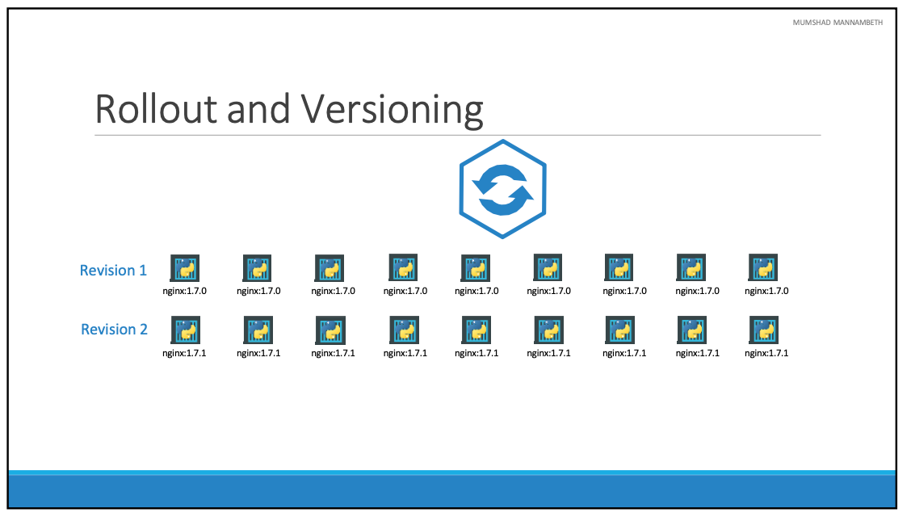

- 새로운 Deployment를 만들거나 기존 Deployment에서 이미지를 업데이트할 때마다 Rollout이 트리거된다.
- Rollout은 애플리케이션 컨테이너를 점진적으로 배포하거나 업데이트하는 프로세스이며, 처음 Deployment를 만들면 Rollout이 트리거된다.
- 새로운 Rollout은 새로운 Deployment 버전을 만든다.
- 최초에 "Revision 1"이 생성되고 이후에 애플리케이션이 업데이트될 때, 새로운 Rollout이 트리거되어 "Revision 2"가 생성된다.
- 이를 통해 Deployment에 대한 변경 사항을 추적하고 필요한 경우 이전 버전으로 Deployment를 롤백할 수 있다.

#### Commands

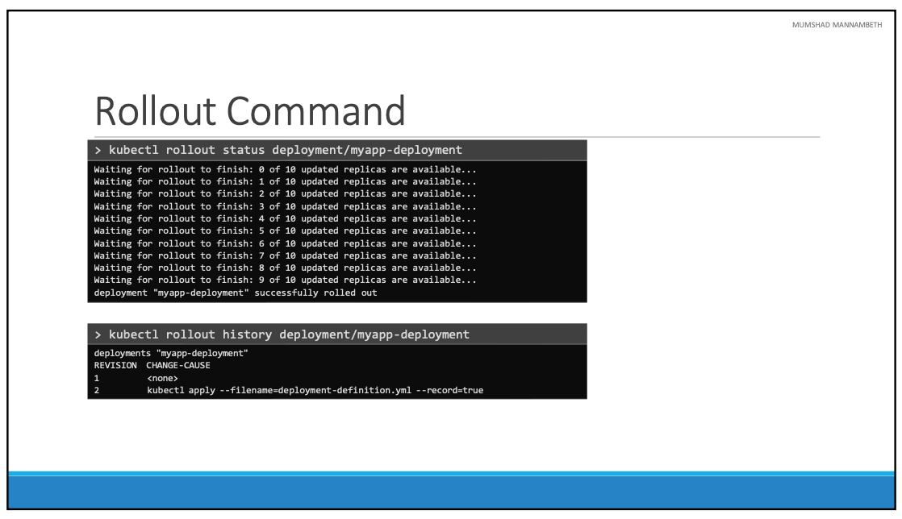

- `kubectl rollout status deployment/myapp-deployment` 명령어를 입력하여 Deployment의 상태를 확인할 수 있다.
- `kubectl rollout history deployment/myapp-deployment` 명령어를 입력하여 Deployment의 히스토리를 확인할 수 있다.

#### Deployment Strategy

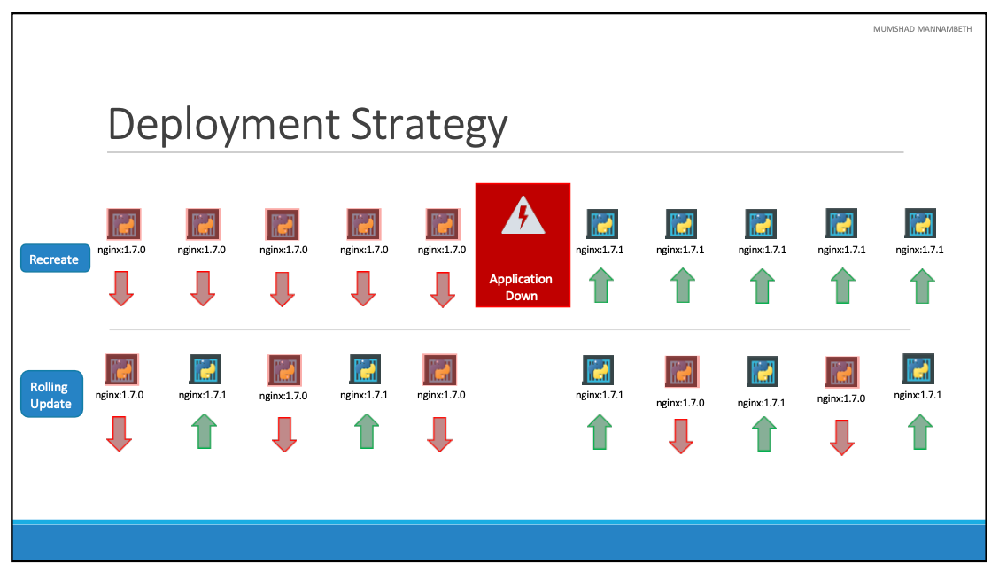

- 배포 전략에는 두 가지 유형이 있다.
- 첫번째는 "Recreate" 전략으로, 이전 버전의 Pod를 삭제하고 새 버전의 Pod를 생성한다.
- 즉, 먼저 실행 중인 인스턴스 5개를 삭제한 다음 새 애플리케잇녀 버전의 새 인스턴스 5개를 배포한다.
- 이 전략의 문제점은 이전 버전이 다운된 후 최신 버전이 올라오기 때문에 최신 버전이 올라오기 전까지 다운타임이 발생하는 것이다.
- 두번째는 "Rolling Update" 전략으로, 이전 버전의 Pod를 삭제하기 전에 새 버전의 Pod를 생성한다.
- Deployment를 만들 때 전략을 지정하지 않으면 기본적으로 "Rolling Update" 전략이 사용된다.

#### Kubectl Apply

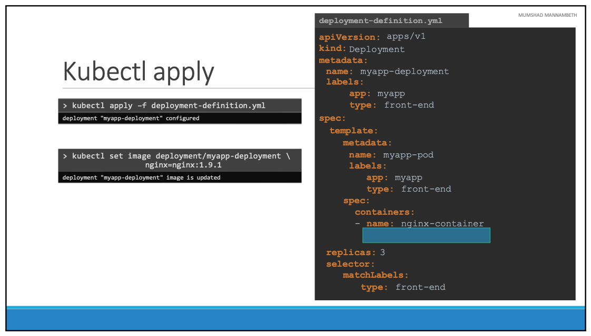

- 우선 Deployment를 생성한 deployment-definition.yml 파일에서 필요한 부분을 수정한다.
- 이후 `kubectl apply -f deployment-definition.yml` 명령어를 입력하여 변경된 부분만 업데이트한다.
- 또 다른 방법으로 `kubectl set image deployment/myapp-deployment nginx=nginx:1.9.1` 명령어를 입력하여 이미지를 업데이트할 수 있다.
- 이렇게 변경하는 경우 기존 yml 파일이 수정되지 않기 때문에 주의해야 한다.

#### Recreate vs RollingUpdate

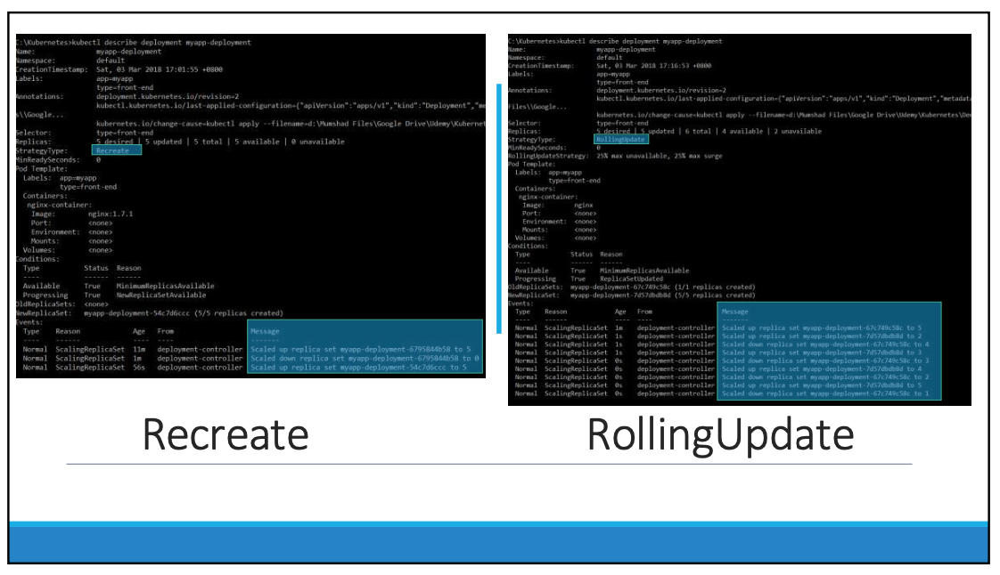

- Recreate 전략과 RollingUpdate 전략의 차이를 확인할 필요가 있다.
- Recreate 전략의 경우 이전 ReplicaSet가 먼저 0으로 축소되고 새 ReplicaSet가 5개로 확장되는 것을 확인할 수 있다.
- RollingUpdate 전략의 경우 이전 ReplicaSet가 한 번에 하나씩 축소되고 동시에 새로운 ReplicaSet가 한 번에 하나씩 확장되는 것을 확인할 수 있다.

#### Upgrades

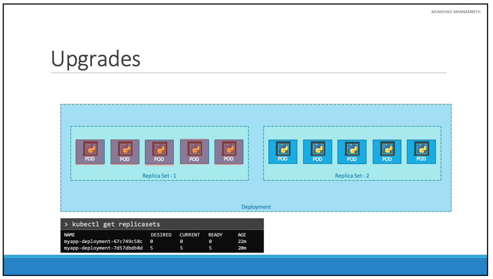

- 새로운 Deployment가 생성되어 5개의 복제본을 배포하는 경우 먼저 ReplicaSet이 자동으로 생성되고, 이는 복제본 수를 충족하는 데 필요한 Pod 수를 생성한다.
- 애플리케이션을 업데이트하면 쿠버네티스는 배포 객체가 새 ReplicaSet을 생성하고 컨테이너를 배포하기 시작한다.
- 동시에 RollingUpdate 전략에 따라 이전 ReplicaSet와 Pod를 제거한다.
- `kubectl get replicasets` 명령어를 입력하여 ReplicaSet을 확인하면 이전 ReplicaSet과 새 ReplicaSet이 모두 생성된 것을 확인할 수 있다.

#### Rollback

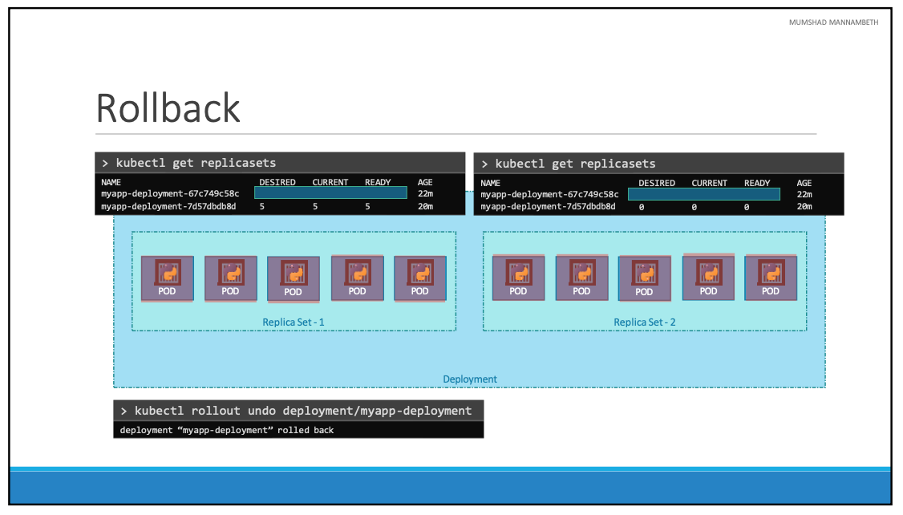

- 애플리케이션 업데이트 이후 문제가 발생한 경우 이전 버전으로 롤백할 수 있다.
- 쿠버네티스 Deployment를 사용하면 이전 버전으로 롤백할 수 있으며, `kubectl rollout undo` 명령어를 사용하여 롤백할 수 있다.
- 롤백 전과 후의 `kubectl get replicasets` 명령을 출력하면 이 차이를 알 수 있다. 롤백 전에 첫 번째 복제 세트에는 Pod가 0개였고 새 복제 세트에는 Pod가 5개 였으며 롤백이 완료된 후에는 반대가 된다.

#### Commands

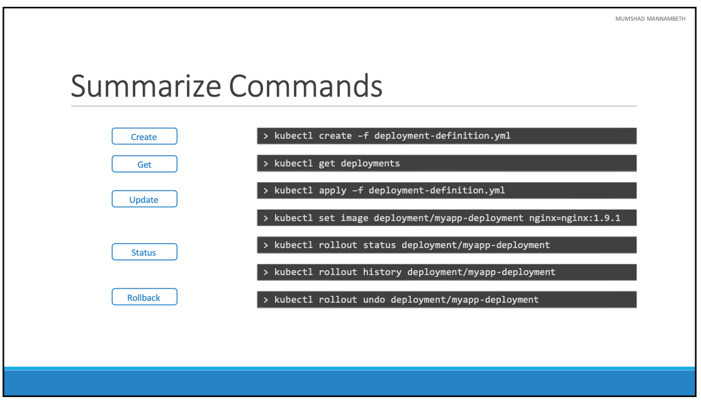

- **Create**:
  - `kubectl create -f deployment-definition.yml`
- **Get**:
  - `kubectl get deployment`
- **Update**:
  - `kubectl apply -f deployment-definition.yml`
  - `kubectl set image deployment/myapp-deployment nginx=nginx:1.9.3`
- **Status**:
  - `kubectl rollout status deployment/myapp-deployment
  - `kubectl roolout history deployment/myapp-deployment`
- **Rollback**:
  - `kubectl rollout undo deployment/myapp-deployment`

#### Example

- "Deployment"를 생성할 deployment.yaml 파일을 작성한다.

```yaml title=deployment.yaml
apiVersion: apps/v1
kind: Deployment
metadata:
  name: myapp-deployment
  labels:
    tier: frontend
    app: nginx
spec:
  selector:
    matchLabels:
      app: myapp
  replicas: 6
  template:
    metadata:
      name: nginx-2
      labels:
        app: myapp
    spec:
      containers:
        - name: nginx
          image: nginx
```

- `kubectl create -f deployment.yaml` 명령어를 입력하여 "Deployment"를 생성한다.
- `kubectl rollout status deployment.apps/myapp-deployment` 명령어를 입력하여 상태를 확인한다.

```bash
Waiting for deployment "myapp-deployment" rollout to finish: 0 of 6 updated replicas are available...
Waiting for deployment "myapp-deployment" rollout to finish: 1 of 6 updated replicas are available...
Waiting for deployment "myapp-deployment" rollout to finish: 2 of 6 updated replicas are available...
Waiting for deployment "myapp-deployment" rollout to finish: 3 of 6 updated replicas are available...
Waiting for deployment "myapp-deployment" rollout to finish: 4 of 6 updated replicas are available...
Waiting for deployment "myapp-deployment" rollout to finish: 5 of 6 updated replicas are available...
deployment "myapp-deployment" successfully rolled out
```

- `kubectl delete deployment myapp-deployment` 명령어를 입력하여 "Deployment"를 삭제한다.
- 삭제 직후 `kubectl rollout status deployment.apps/myapp-deployment` 명령어를 입력하여 복제본이 제거되는 것을 확인한다.

```bash
Waiting for deployment "myapp-deployment" rollout to finish: 0 of 6 updated replicas are available...
Waiting for deployment "myapp-deployment" rollout to finish: 1 of 6 updated replicas are available...
Waiting for deployment "myapp-deployment" rollout to finish: 2 of 6 updated replicas are available...
Waiting for deployment "myapp-deployment" rollout to finish: 3 of 6 updated replicas are available...
Waiting for deployment "myapp-deployment" rollout to finish: 4 of 6 updated replicas are available...
Waiting for deployment "myapp-deployment" rollout to finish: 5 of 6 updated replicas are available...
deployment "myapp-deployment" successfully rolled out
```

- `kubectl rollout history deployment.apps/myapp-deployment` 명령어를 입력하여 Deployment의 히스토리를 확인한다.

```bash
REVISION  CHANGE-CAUSE
1         <none>
```

- 이번에는 Deployment를 생성할 때 "--record" 옵션을 추가하여 히스토리를 기록한다.
- `kubectl create -f deployment.yaml --record` 명령어를 입력하여 "Deployment"를 생성한다.
- 다시 `kubectl rollout history deployment.apps/myapp-deployment` 명령어를 실행하면 실행할 때의 명령어가 저장되어 있는 것을 확인할 수 있다.

```bash
deployment.apps/myapp-deployment
REVISION  CHANGE-CAUSE
1         kubectl create --filename=deployment.yaml --record=true
```

- `kubectl describe deployment myapp-deployment` 명령어를 입력하여 "Deployment"에 대한 자세한 정보를 확인한다.

```bash
Name:                   myapp-deployment
Namespace:              default
CreationTimestamp:      Thu, 20 Feb 2025 16:22:45 +0900
Labels:                 app=nginx
                        tier=frontend
Annotations:            deployment.kubernetes.io/revision: 1
                        kubernetes.io/change-cause: kubectl create --filename=deployment.yaml --record=true
Selector:               app=myapp
Replicas:               6 desired | 6 updated | 6 total | 6 available | 0 unavailable
StrategyType:           RollingUpdate
MinReadySeconds:        0
RollingUpdateStrategy:  25% max unavailable, 25% max surge
Pod Template:
  Labels:  app=myapp
  Containers:
   nginx:
    Image:         nginx
    Port:          <none>
    Host Port:     <none>
    Environment:   <none>
    Mounts:        <none>
  Volumes:         <none>
  Node-Selectors:  <none>
  Tolerations:     <none>
Conditions:
  Type           Status  Reason
  ----           ------  ------
  Available      True    MinimumReplicasAvailable
  Progressing    True    NewReplicaSetAvailable
OldReplicaSets:  <none>
NewReplicaSet:   myapp-deployment-5655d5f56f (6/6 replicas created)
Events:
  Type    Reason             Age    From                   Message
  ----    ------             ----   ----                   -------
  Normal  ScalingReplicaSet  2m21s  deployment-controller  Scaled up replica set myapp-deployment-5655d5f56f from 0 to 6
```

- Annotation 영역을 확인해보면 실행시켰을 때, 사용한 명령어를 확인할 수 있다.
- "edit" 명령어를 사용하여 실행 중인 이미지를 변경해 보도록 한다.
- `kubectl edit deployment myapp-deployment --record`를 입력한다. "--record" 옵션을 추가하여 변경 기록을 남기도록 한다.

```bash
// 생략 ..
    spec:
      containers:
      - image: nginx:1.18
        imagePullPolicy: Always
        name: nginx
// 생략 ..
```

- `image: nginx:1.18`로 수정하여 특정 버전으로 변경되도록 수정한다.
- 수정 후 `kubectl describe deployment myapp-deployment` 명령어를 입력하여 변경된 내용을 확인한다.

```bash
// 생략 ..
Events:
  Type    Reason             Age                From                   Message
  ----    ------             ----               ----                   -------
  Normal  ScalingReplicaSet  8m                 deployment-controller  Scaled up replica set myapp-deployment-5655d5f56f from 0 to 6
  Normal  ScalingReplicaSet  68s                deployment-controller  Scaled up replica set myapp-deployment-5bc74bc7d5 from 0 to 2
  Normal  ScalingReplicaSet  68s                deployment-controller  Scaled down replica set myapp-deployment-5655d5f56f from 6 to 5
  Normal  ScalingReplicaSet  68s                deployment-controller  Scaled up replica set myapp-deployment-5bc74bc7d5 from 2 to 3
  Normal  ScalingReplicaSet  58s                deployment-controller  Scaled down replica set myapp-deployment-5655d5f56f from 5 to 4
  Normal  ScalingReplicaSet  58s                deployment-controller  Scaled up replica set myapp-deployment-5bc74bc7d5 from 3 to 4
  Normal  ScalingReplicaSet  57s                deployment-controller  Scaled down replica set myapp-deployment-5655d5f56f from 4 to 3
  Normal  ScalingReplicaSet  57s                deployment-controller  Scaled up replica set myapp-deployment-5bc74bc7d5 from 4 to 5
  Normal  ScalingReplicaSet  55s                deployment-controller  Scaled down replica set myapp-deployment-5655d5f56f from 3 to 2
  Normal  ScalingReplicaSet  51s (x3 over 55s)  deployment-controller  (combined from similar events): Scaled down replica set myapp-deployment-5655d5f56f from 1 to 0
```

- Events 영역을 확인해보면 기본 전략이 "RollingUpdate" 전략이기 때문에 이전 ReplicaSet이 하나씩 줄어들고 새 ReplicaSet이 하나씩 늘어나는 것을 확인할 수 있다.
- 이번에는 "set image" 명령어를 사용하여 이미지를 변경해 보도록 한다. `kubectl set image deployment myapp-deployment nginx=nginx:1.18-perl --record` 명령어를 입력한다.

```bash
Flag --record has been deprecated, --record will be removed in the future
deployment.apps/myapp-deployment image updated
```

- 업데이트가 완료되었으면 다시 `kubectl rollout history deployment.apps/myapp-deployment` 명령어를 입력하여 변경된 내용을 확인한다.

```bash
REVISION  CHANGE-CAUSE
1         kubectl create --filename=deployment.yaml --record=true
2         kubectl edit deployment myapp-deployment --record=true
3         kubectl set image deployment myapp-deployment nginx=nginx:1.18-perl --record=true
```

- 정상적으로 지금까지의 변경 사항이 기록되어 있는 것을 확인할 수 있다.
- 이번에는 `kubectl rollout undo deployment/myapp-deployment` 명령어를 입력하여 롤백을 진행한다.
- 정상적으로 Rollout 되었다면 `kubectl rollout history deployment.apps/myapp-deployment` 명령어를 입력하여 변경된 내용을 확인한다.

```bash
REVISION  CHANGE-CAUSE
1         kubectl create --filename=deployment.yaml --record=true
3         kubectl set image deployment myapp-deployment nginx=nginx:1.18-perl --record=true
4         kubectl edit deployment myapp-deployment --record=true
```

- "Revision 4"가 새롭게 생겼고, "Revision 4"와 동일한 "Revision 2"는 제거된 것을 확인할 수 있다.
- 다시 "edit" 명령어를 사용하여 버전을 변경해 본다. `kubectl edit deployment myapp-deployment --record` 명령어를 입력한다.

```bash
// 생략 ..
    spec:
      containers:
      - image: nginx:1.18-does-not-exists
        imagePullPolicy: Always
        name: nginx
// 생략 ..
```

- 존재하지 않는 버전을 입력하고 저장한 후 `kubectl rollout status deployment.apps/myapp-deployment` 명령어를 입력하여 롤백이 진행되는 것을 확인한다.

```bash
Waiting for deployment "myapp-deployment" rollout to finish: 3 out of 6 new replicas have been updated...
```

- 이미지가 존재하지 않기 때문에 롤백이 진행되지 않는 것을 확인할 수 있다.

```bash
NAME               READY   UP-TO-DATE   AVAILABLE   AGE
myapp-deployment   5/6     3            5           19m
```

- Deployment의 상태를 확인해 보면 총 6개의 Pod 중에 5개만 사용가능한 것을 확인할 수 있다.

```bash
NAME                                READY   STATUS             RESTARTS   AGE
myapp-deployment-5bc74bc7d5-j4hhh   1/1     Running            0          6m5s
myapp-deployment-5bc74bc7d5-md5n7   1/1     Running            0          5m59s
myapp-deployment-5bc74bc7d5-qvs9t   1/1     Running            0          6m
myapp-deployment-5bc74bc7d5-r9qfw   1/1     Running            0          6m5s
myapp-deployment-5bc74bc7d5-zkkcr   1/1     Running            0          6m2s
myapp-deployment-c4d655759-fljbc    0/1     ImagePullBackOff   0          2m45s
myapp-deployment-c4d655759-gbskv    0/1     ImagePullBackOff   0          2m45s
myapp-deployment-c4d655759-hbkpl    0/1     ImagePullBackOff   0          2m45s
```

- Pod의 상태를 확인해 보면 이미지를 가져오지 못해서 총 세개의 Pod가 사용할 수 없는 상태인 것을 확인할 수 있다.
- `kubectl rollout undo deployment/myapp-deployment` 명령어를 입력하여 정상 상태의 Revision으로 롤백을 진행한다.

```bash
NAME                                READY   STATUS    RESTARTS   AGE
myapp-deployment-5bc74bc7d5-j4hhh   1/1     Running   0          8m51s
myapp-deployment-5bc74bc7d5-md5n7   1/1     Running   0          8m45s
myapp-deployment-5bc74bc7d5-qvs9t   1/1     Running   0          8m46s
myapp-deployment-5bc74bc7d5-r9qfw   1/1     Running   0          8m51s
myapp-deployment-5bc74bc7d5-xtqg6   1/1     Running   0          21s
myapp-deployment-5bc74bc7d5-zkkcr   1/1     Running   0          8m48s
```

- Pod의 상태를 확인해 보면 문제가 있던 하나의 Pod가 새롭게 생성된 것을 확인할 수 있다.

---

### 참고한 강의

- [Kubernetes for the Absolute Beginners](https://www.udemy.com/course/learn-kubernetes)
- [Certified Kubernetes Administrator (CKA)](https://www.udemy.com/course/certified-kubernetes-administrator-with-practice-tests)