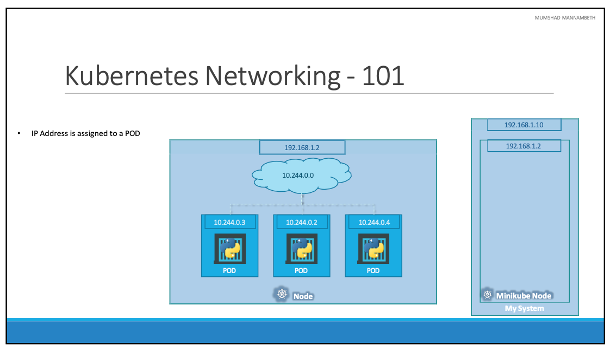

# Networking

- 이번 장에서는 **Certified Kubernetes Administrator (CKA)** 을 준비하며 쿠버네티스의 네트워킹에 대해서 알아본다.

---

### Networking

- 쿠버네티스 클러스터의 단일 노드에 `192.168.1.2`라는 IP가 할당되어 있으며, 우리가 쿠버네티스 노드에 접근하고 SSH를 사용하는 등의 목적으로 사용된다.
- 참고로 Minikube 설정을 사용하는 경우 Hypervisor 내부의 minikube 가상 머신의 IP 주소에 대해 설정이 된다.
- Docker 컨테이너와 달리 쿠버네티스는 Pod를 호스팅하며 Pod에 IP 주소를 할당한다.
- 쿠버네티스 각각의 Pod는 자체 내부 IP 주소를 할당 받는다.
- 예시에서는 `10.244.*.*` 범위의 IP를 할당받게 된다. 쿠버네티스가 처음 구성될 때 주소가 `10.244.0.0`인 내부 사설 네트워크를 만들고 모든 Pod가 여기에 연결된다.
- 여러 Pod를 배포하면 모두 별도의 IP가 할당되고, Pod는 이 IP를 통해 서로 통신할 수 있다.
  하지만, 내부 IP는 Pod가 재생성될 때 변경될 수 있기 때문에 Pod간 통신을 위해 내부 IP를 사용하는 것은 궈추지 않는다.

---

### Cluster Networking

- 배포된 클러스터를 확인해 보면 동일한 내부 IP 인 `10.244.0.0`을 사용하는 것을 알 수 있다.
- 노드가 동일한 클러스터의 일부링ㄹ 때는 동일한 IP 주소가 할당되어 네트워크에서 IP 충돌이 발생할 수 있다.
- 쿠버네티스 클러스터가 설정되면 쿠버네티스는 이러한 IP 충돌 문제를 해결하기 위해 어떤 종류의 설정도 자동으로 하지 않는다.
- 쿠버네티스는 특정 기본 요구 사항을 충족하기 위해서 사용자가 직접 네트워크를 설정하는 것을 유도한다.
- 모든 컨테이너와 Pod는 NAT를 사용하지 않고 다른 컨테이너나 Pod와 통신할 수 있어야 한다.
- 모든 노드는 NAT를 사용하지 않고 다른 노드와 통신할 수 있어야 한다.

---

### Pre-built Solutions

- 쿠버네티스는 네트워크 설정을 위한 몇 가지 사전 구축된 솔루션을 제공한다.
- Cisco, ACI Networks, Cilium, Big Cloud Fabric, Flannel, VMware NSX, Weave Net와 같은 솔루션을 클러스터를 배포할 때 사용할 수 있다.

- Calico 네트워킹 설정으로 노드의 네트워크와 IP를 관리하고 노드의 각 네트워크에 다른 네트워크 주소를 할당한다.
- 이렇게 설정하는 경우 모든 Pod와 노드의 가상 네트워크가 생성되고, 모든 노드에 고유한 IP 주소가 할당된다.
- 간단한 라우팅 기술을 사용하여 클러스터 네트워킹은 쿠버네티스의 네트워킹 요구 사항을 충족하기 위해 다른 Pod 또는 노드 간의 통신을 가능하게 한다.
- 따라서 모든 Pod는 할당된 IP 주소를 사용하여 서로 통신할 수 있다.

---

### 참고한 강의

- [Kubernetes for the Absolute Beginners](https://www.udemy.com/course/learn-kubernetes)
- [Certified Kubernetes Administrator (CKA)](https://www.udemy.com/course/certified-kubernetes-administrator-with-practice-tests)