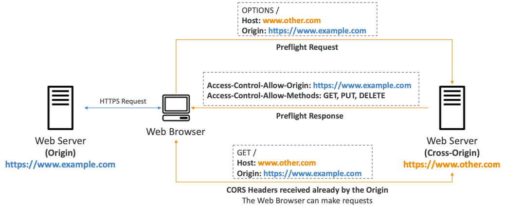
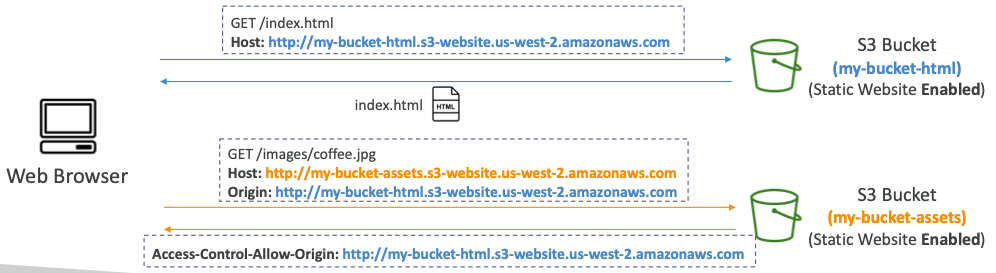
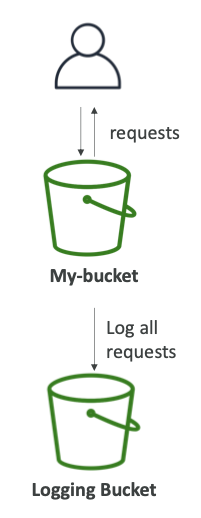
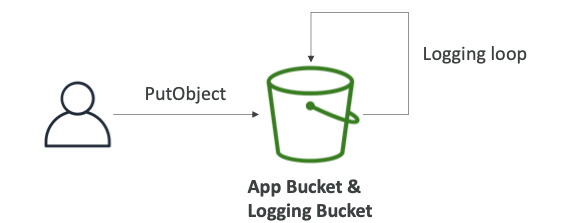
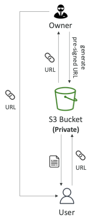
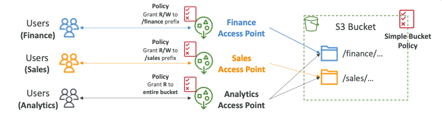
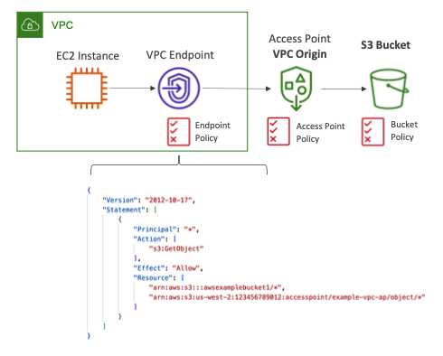
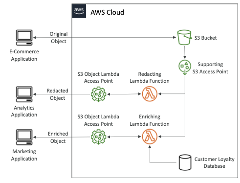

# Amazon S3 Security

이번 장에서는 SAA를 준비하며 **S3 보안**에 대해서 알아보도록 한다.

---

## Object Encryption

- S3 버킷의 객체를 암호화하는 방법은 4가지가 있으며 어떤 상황에 어떤 암호화를 사용해야 하는지 이해하는 것이 중요하다.
- Server-Side Encryption (SSE)
  - Server-Side Encryption with Amazon S3-Managed Keys (SSE-S3, 기본으로 활성화 됨): AWS에서 처리, 관리 및 소유한 키를 사용하여 S3 객체를 암호화한다.
  - Server-Side Encryption with KMS Keys stored in AWS KMS (SSE-KMS): AWS KMS를 활용하여 암호화 키를 관리한다.
  - Server-Side Encryption with Customer-Provided Keys (SSE-C): 개인이 소유한 암호화 키를 사용하여 암호화한다.
- Client-Side Encryption

### Server-Side Encryption with Amazon S3-Managed Keys (SSE-S3)

- AWS에서 처리, 관리 및 소유한 키를 사용하여 S3 객체를 암호화한다.
- 서버 측에서 암호화되며 암호화 유형은 AES-256이다.
- 헤더에 "x-amz-server-side-encryption": "AES256"이 추가되어야 한다.
- 새로운 버킷을 생성하고 새로운 객체를 생성할 때 기본으로 활성화된다.

### Server-Side Encryption with KMS Keys stored in AWS KMS (SSE-KMS)

- AWS KMS(Key Management Service)에서 관리되는 암호화 키를 사용하여 서버 측에서 암호화한다.
- KMS를 사용하면 CloudTrail을 사용하여 사용자를 제어하고 감사 키를 사용할 수 있다는 장점이 있다.
- 헤더에 "x-amz-server-side-encryption":"aws:kms"를 추가해야 한다.

#### SSE-KMS 제약 사항

- SSE-KMS를 사용하는 경우 KMS 한도의 영향을 받을 수 있다.
- 업로드 시에 GenerateDataKey KMS API를 호출한다.
- 다운로드 시 Decrypt KMS API를 호출한다.
- 초당 KMS 할당량(지역에 따라 5500, 10000, 30000 req/s)이 있다.
- Service Quotas Console를 사용하여 요청 할당량을 늘릴 수 있다.

### Server-Side Encryption with Customer-Provided Keys (SSE-C)

- AWS 외부에서 사용자가 완전히 관리하는 키를 사용하여 서버 측에서 암호화한다.
- Amazon S3는 사용자가 제공한 암호화 키를 저장하지 않는다.
- HTTPS를 사용해야 하며, 모든 HTTP 요청에 대해 HTTP 헤더에 암호화 키를 제공해야 한다.

### Client-Side Encryption

- Amazon S3 Client-Side Encryption 라이브러리와 같은 클라이언트 라이브러리를 통해 암호화 한다.
- 사용자는 Amazon S3로 데이터를 보내기 전에 암호화를 해야한다.
- 사용자는 Amazon S3에서 검색할 때 데이터를 스스로 해독해야 한다.
- 고객이 암호화 키와 암호화 주기를 완전히 관리한다.

### Encryption in transit (SSL/TLS)

- 데이터 전송 중 암호화는 SSL/TLS라고도 부른다.
- Amazon S3는 두 개의 엔드포인트를 노출하며, HTTP는 암호화를 하지 않고 HTTPS는 전송 중 암호화를 한다.
- HTTPS를 사용하는 것이 권장되며 SSE-C를 위해서는 HTTPS 사용이 필수다.
- 대부분의 클라이언트는 기본적으로 HTTPS 엔드포인트를 사용한다.
- 아래와 같이 정책의 "Condition"에 **aws:SecureTransport** 속성을 추가하여 암호화된 데이터만 저장되도록 할 수 있다.

### Default Encryption vs Bucket Policies

- SSE-S3 암호화는 자동으로 S3 버킷에 저장되는 새로운 객체에 자동으로 적용된다.
- 선택적으로 버킷 정책을 사용하여 "강제 암호화"하고 "암호화 헤더(SSE-KSM, "SSE-C)" 없이 S3 객체를 저장하기 위해 API 호출을 거부할 수 있다.
- 버킷의 정책은 "기본 암호화" 이전에 평가된다.

---

## CORS 

- Cross-Origin Resource Sharing (CORS)의 약자다.
- Origin은 Scheme(프로토콜) + Host(도메인) + Port를 의미한다.
- 웹 브라우저의 기반 메커니즘은 주 오리진(main origin)에 방문하는 동안 다른 오리진들(other origins)으로의 요청을 허용한다.
- `http://example.com/app1`과 `http://example.com/app2`는 동일한 오리진이다.
- `http://www.example.com`과 `http://other.example.com`은 서로 다른 오리진이다.
- Access-Control-Allow-Origin과 같은 CORS 헤더를 사용하여 다른 출처에서 요청을 허용하지 않으면 요청이 실행되지 않는다.

- 클라이언트가 S3 버킷에서 교차 출처 요청을 하는 경우, 올바른 CORS 헤더가 필요하다.
- 특정 출처 또는 모든 출처(*)에 대해 허용할 수 있다.

### MFA Delete

- MFA (Multi-Factor Authentication): 사용자가 S3에서 중요한 작업을 수행하기 전에 MFA 장치에서 코드를 생성하도록 강제할 수 있다.
- MFA는 객체의 버전을 영구 삭제하거나, 버킷의 버전 관리를 일시 중단하는 경우에 필요하다.
- 버전 관리를 활성화하거나 삭제된 버전을 조회할 때는 MFA가 필요하지 않다.
- MFA 삭제를 사용하려면 버킷에서 버전 관리를 활성화해야 한다.
- 버킷의 소유자만 MFA 삭제를 활성화하거나 비활성화할 수 있다.

### S3 Access Logs

- 감사의 목적으로 S3 버킷에 대한 모든 액세스 로그를 기록할 수 있다.
- 모든 계정에서 S3에 대한 모든 요청은 승인 또는 거부되어 다른 S3 버킷에 기록된다.
- 해당 버킷은 동일한 AWS Region이 있어야 하며, 데이터 분석 도구를 사용하여 분석할 수 있다.

- 로깅을 위한 버킷을 모니터링 버킷으로 설정하는 경우 로깅 루프가 생성되고 버킷이 기하급수적으로 커질 수 있다.

### Pre-Signed URLs

- S3 콘솔, AWS CLI 또는 SDK를 사용하여 사전 서명된 URL을 생성할 수 있다.
- URL 만료
  - S3 콘솔: 1분 ~ 720분(12 시간)
  - AWS CLI: `expires-in` 파라미터를 통해서 만료 기간을 설정할 수 있다. 기본은 3,600초이며 최대 604,800초(168시간)까지 설정할 수 있다.
- 미리 서명된 URL이 부여된 사용자는 GET/PUT에 대한 URL을 생성한 사용자의 권한을 상속한다.
- 사전 서명된 URL의 예시는 아래와 같다.
  - 로그인 한 사용자에게 S3 버킷의 프리미엄 비디오에 대한 접근을 허용.
  - 끊임없이 변화하는 사용자 목록이 동적으로 URL을 생성하여 파일을 다운로드하도록 허용.
  - 일시적으로 사용자가 S3 버킷의 정확한 위치에 파일을 업로드 하도록 허용.

### S3 Glacier Vault Lock

- WORM(Write Once Read Many) 모델을 채택.
- Vault Lock 정책을 생성.
- 향후 편집을 위해 정책 잠금을 하면 더 이상 변경하거나 삭제할 수 없다.
- 규정 준수 및 데이터 보존에 유용하다.

### S3 Object Locks

- 버전 관리가 활성화되어있어야 한다.
- WORM(Write Once Read Many) 모델을 채택한다.
- 지정된 시간 동안 개체 버전 삭제를 차단한다.
- Complience Retention Mode:
  - 루트 사용자를 포함한 모든 사용자가 개체 버전을 덮어쓰거나 삭제할 수 없다.
  - 객체의 보존 모드는 변경될 수 없고, 보존 기간을 단축할 수 없다.
- Governance Retention Mode:
  - 대부분의 사용자는 개체 버전을 덮어쓰거나 삭제하거나 잠금 설정을 변경할 수 없다.
  - 일부 사용자는 보존을 변경하거나 객체를 삭제할 수 있는 특별한 권한이 있다.
- Retention Period: 고정된 기간 동안 객체를 보호하며 기간을 연장할 수 있다.
- Legal Hold(법적 보존): 
  - 보존 기간과 무관하게 객체를 무기한으로 보호한다.
  - `s3:PutObjectLegalHold` IAM 정책을 통해서 자유롭게 배치 및 탈거할 수 있다.

---

## S3 Access Point

- 액세스 포인트는 S3 버킷의 보안 관리를 단순화한다.
- 각 액세스 포인트는 고유한 DNS 이름(Internet Origin or VPC Origin)을 가진다.
- 각 액세스 포인트는 S3 버킷 정책과 유사한 정책을 가지며, 규모에 맞게 보안 관리를 할 수 있다.

### S3 Access Point - VPC Origin

- VCP 내에서만 액세스할 수 있는 액세스 포인트를 정의할 수 있다.
- Access Point(Gateway 또는 Internet Endpoint)로 접근하는 VPC Endpoint를 생성해야 한다.
- VPC Endpoint 정책은 대상 버킷 및 액세스에 대한 액세스를 허용해야 한다.

### S3 Object Lambda

- 호출자 애플리케이션에서 객체를 검색하기 전에 AWS Lambda 함수를 사용하여 객체를 변경한다.
- 하나의 S3 버킷만 필요하며 그 위에 S3 액세스 포인트 및 S3 객체 Lambda 액세스 포인트를 생성한다.
- 사용 사례는 아래와 같다.
  - 분석 또는 운영 환경이 아닌 환경을 위해 개인 식별 정보를 수정한다.
  - XML을 Json으로 변경하는 것과 같이 데이터의 포맷을 변경한다.
  - 객체를 요청한 사용자와 같은 호출자별 세부 정보를 사용하여 즉시 이미지 크기 조정 및 워터마킹할 수 있다.

---

### 참고 자료

- https://www.udemy.com/course/aws-certified-solutions-architect-associate-saa-c03