## 분석(Analysis)

- 최초 작성 일자: 2023-03-17
- 수정 내역:
  - 2023-03-17: 최초 작성

### Amazon Athena

- **SQL을 사용해 S3의 데이터 쿼리**
- 페타바이트 규모 데이터를 상주 위치에서 쉽고 유연하게 분석

#### 사용 이유

- 서버리스 경험을 포함한 SQL 또는 Apache Spark 분석 워크로드의 시작이 간소화되고 거의 즉시 가능하다.
- 온프레미스, 데이터 레이크 또는 클라우드 스토어의 데이터를 사용하여 대화형 고급 분석 애플리케이션을 구축할 수 있다.
- 언어, 오픈 데이터 형식, 오픈 소스 프레임워크, BI 및 기계 학습(ML) 도구 통합을 지원하여 유연성을 높입니다.
- 실행된 쿼리에 대한 요금만 지불하므로 구성, 소프트웨어 업데이트 또는 인프라 확장에 따른 비용을 절약할 수 있다.

#### 작동 방식

- Amazon Athena는 오픈소스 프레임워크에 구축된 서버리스 대화형 분석 서비스로 개방형 테이블과 파일 형식을 지원한다.
- Athena는 페타바이트 규모의 데이터를 상주 위치에서 분석하는 간소화되고 유연한 방식을 제공한다. 
- Amazon S3 데이터 레이크 및 온프레미스나 SQL 또는 Python을 사용하는 기타 클라우드 시스템을 포함하는 25개 이상의 데이터 소스로부터 데이터를 분석하거나 애플리케이션을 구축한다. 
- Athena는 오픈 소스 Trino 및 Presto 엔진과 Apache Spark 프레임워크로 구축되었으며 프로비저닝이나 구성 작업이 필요 없다.

#### 사용 사례

- **연동 쿼리 실행:** SQL 쿼리를 제출하여 온프레미스나 클라우드에서 실행되는 관계형, 비관계형, 객체, 사용자 지정 데이터 소스의 데이터를 분석한다.
- **ML 모델을 위한 데이터 추출:** SQL 쿼리 또는 Python에서 ML 모델을 사용하여 판매 예측 및 이상 탐지, 고객 코호트와 같은 복잡한 작업을 간소화한다.
- **분산된 빅데이터 보정 엔진 구축:** 클라우드용으로 구축된 엔진과 함께 보정 도구를 배포하여 방대한 데이터를 대규모로 효과적으로 검증한다.
- **Google Analytics 데이터 분석:** Amazon AppFlow를 사용하여 Google Analytics 데이터를 추출하고, Amazon S3에 저장한 다음 쿼리한다.

---

### Amazon CloudSearch

- **관리형 검색 서비스**
- Amazon CloudSearch는 AWS 클라우드의 관리형 서비스로, 이 서비스를 통해 웹 사이트 또는 애플리케이션을 위한 검색 솔루션을 효율적인 비용으로 간단하게 설정, 관리 및 확장할 수 있다.

#### 사용 이유

- Amazon CloudSearch를 사용하면 강화된 검색 기능을 웹 사이트 또는 애플리케이션에 신속하게 추가할 수 있다. 
- 검색 전문가가 아니더라도 쉽게 검색 관련 작업을 수행할 수 있으며, 하드웨어 프로비저닝, 설정 및 유지 관리에 대해 신경 쓸 필요가 없다. 
- AWS Management Console에서 몇 번의 클릭만으로 검색 도메인을 생성하고 검색 가능하게 하려는 데이터를 업로드할 수 있다. 
- Amazon CloudSearch가 자동으로 필요한 리소스를 프로비저닝하고 사용이 간편하게 조정된 검색 인덱스를 배포한다.

#### 작동 방식

- 검색 가능하게 만들 데이터 집합에 대해 Amazon CloudSearch 검색 도메인을 생성한다다. 
- 검색 도메인에는 검색 엔진을 운영하는 데 필요한 하드웨어 및 소프트웨어 리소스와 데이터가 포함된다. 
- 각 검색 도메인에는 하나 이상의 검색 인스턴스가 있으며, 검색 인스턴스는 정해진 양의 RAM 및 CPU 리소스를 이용해 데이터를 인덱싱하고 요청 처리 작업을 수행하는 서버 인스턴스다. 
- 도메인의 검색 인스턴스 수는 검색 요청의 양과 복잡도, 데이터 집합 내의 문서 수에 따라 다르다.

---

### Amazon DataZone

- **내장된 거버넌스로 조직 경계 전반에서 데이터의 가치 활용**

#### 사용 이유

- Amazon DataZone을 사용하면 거버넌스 및 액세스 제어를 통해 조직 경계 내의 데이터를 대규모로 발견하고 공유할 수 있다. 
- Amazon DataZone은 조직 내 모든 사람이 데이터에 액세스할 수 있도록 한다.

#### 작동 방식

- Amazon DataZone을 사용하여 조직 경계를 넘어 대규모로 데이터를 공유 및 검색한다. 
- 거버넌스 및 규정 준수 정책을 적용하는 동시에 개인화된 보기에서 모든 데이터를 볼 수 있는 통합 데이터 분석 포털을 통해, 데이터 프로젝트의 협업을 수행한다.

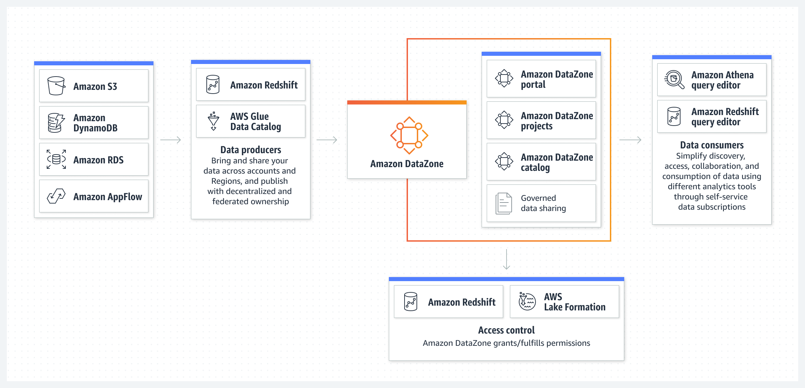

#### 사용 사례

- **비즈니스 데이터 카탈로그에서 데이터 찾기:** 비즈니스 용어를 사용하여 AWS 또는 온프레미스에 저장된 카탈로그 데이터를 검색 및 액세스하고 서드 파티 공급자와 공유할 수 있다.
- **워크플로 프로세스 간소화:** 팀 간에 원활하게 협업을 진행하고 셀프 서비스 방식으로 데이터 및 분석 도구에 액세스함으로써 효율성을 높인다.
- **분석 액세스 간소화:** 웹 기반 애플리케이션을 사용하여 데이터를 검색, 준비, 변환, 분석 및 시각화할 수 있는 맞춤형 보기를 제공한다.
- **한곳에서 액세스 관리:** 조직의 보안 규정에 따라 데이터 액세스를 한곳에서 관리하고 통제한다.

---

### Amazon OpenSearch Service

- **최대 페타바이트 규모의 텍스트 및 비구조화 데이터의 검색, 시각화 및 분석**
- 비즈니스 및 운영 데이터의 실시간 검색, 모니터링, 분석에 안전하게 활용(ELK 스택 완전관리형 서비스)

#### 사용 이유

- AWS가 관리하는 인기 오픈 소스 솔루션을 사용하여 운영 우수성을 향상시킨다.
- 인증이 내장된 데이터 센터 및 네트워크 아키텍처를 사용하여 데이터를 감사하고 보호한다.
- 기계 학습, 경고, 시각화를 통해 잠재적인 위협을 체계적으로 탐지하고 시스템의 상태에 대응한다.
- 전략적 작업에 투입하는 시간과 리소스를 최적화한다.

#### 작동 방식

- Amazon OpenSearch Service는 대화형 로그 분석, 실시간 애플리케이션 모니터링 및 웹사이트 검색 등을 쉽게 수행할 수 있게 한다. 
- OpenSearch는 Elasticsearch에서 파생된 오픈 소스, 분산 검색 및 분석 제품군이다. 
- Amazon OpenSearch Service는 최신 버전의 OpenSearch, 19가지 버전의 Elasticsearch(버전 1.5~7.10)에 대한 지원, 그리고 OpenSearch Dashboards와 Kibana(버전 1.5~7.10) 기반의 시각화 기능을 제공한다. 
- Amazon OpenSearch Service는 현재 매달 수백조 건의 요청 처리를 관리하는 수십만 개의 클러스터를 보유한 수만에 이르는 활성 고객을 보유하고 있다.

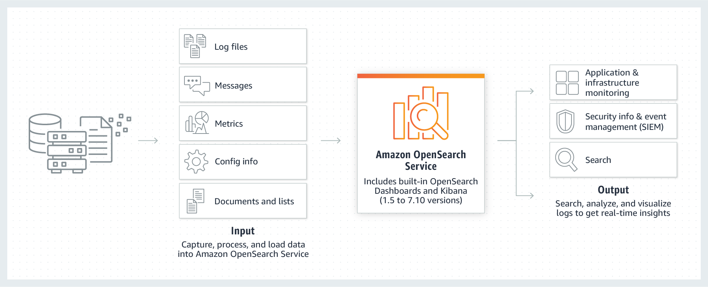

#### 사용 사례

- **애플리케이션 및 인프라 모니터링과 디버깅:** 로그, 지표 및 추적에 대한 관찰을 통해 데이터를 쉽게 저장하고 분석하여 시스템 성능에 대한 포괄적인 시야를 확보한다. 시스템 성능이 떨어질 때 자동화된 알림을 설정하고 가용성 문제의 근본 원인을 파악한다.
- **보안 및 이벤트 정보(SIEM) 관리:** 실시간으로 위협을 탐지하고 인시던트를 관리하기 위해 AWS, 온프레미스 및 기타 클라우드에서 서로 다른 애플리케이션과 시스템의 로그를 중앙에서 처리하고 분석한다.
- **원활한 개인화된 검색 활성화:** 애플리케이션, 웹 사이트, 데이터 레이크 카탈로그에서 빠르고 개인화된 검색 환경을 통해 사용자가 관련 데이터를 빠르게 찾도록 지원한다.
- **관측성:** 문제를 효율적으로 찾고 수정하며, 애플리케이션 상태를 개선하고 더 나은 고객 경험을 제공한다.

---

### Amazon EMR

- **빅 데이터 프레임워크의 손쉬운 실행**
- Apache Spark, Hive, Presto 및 다른 빅 데이터 워크로드를 손쉽게 실행하고 크기를 조정

#### 사용 이유

- 빅데이터 애플리케이션과 페타바이트 규모의 데이터 분석을 온프레미스 솔루션의 절반 미만의 비용으로 더 빠르게 실행
- 맞춤형 EC2 클러스터, Amazon EKS, AWS Outposts 또는 Amazon EMR 서버리스에서 실행할 수 있는 옵션과 최신 오픈 소스 프레임워크를 사용하여 애플리케이션을 구축한다.
- 성능 최적화 및 오픈 소스 API 호환 버전의 Spark, Hive 및 Presto를 사용하여 최대 2배 더 빠른 인사트이트를 얻을 수 있다.
- EMR Studio의 EMR Notebooks 및 친숙한 오픈 소스 도구를 사용하여 애플리케이션을 쉽게 개발, 시각화 및 디버그할 수 있다.

#### 작동 방식

- Amazon EMR은 Apache Spark, Apache Hive 및 Presto와 같은 오픈 소스 프레임워크를 사용하여 페타바이트급 데이터 처리, 대화식 분석 및 기계 학습을 위한 업계 최고의 클라우드 빅데이터 솔루션이다.

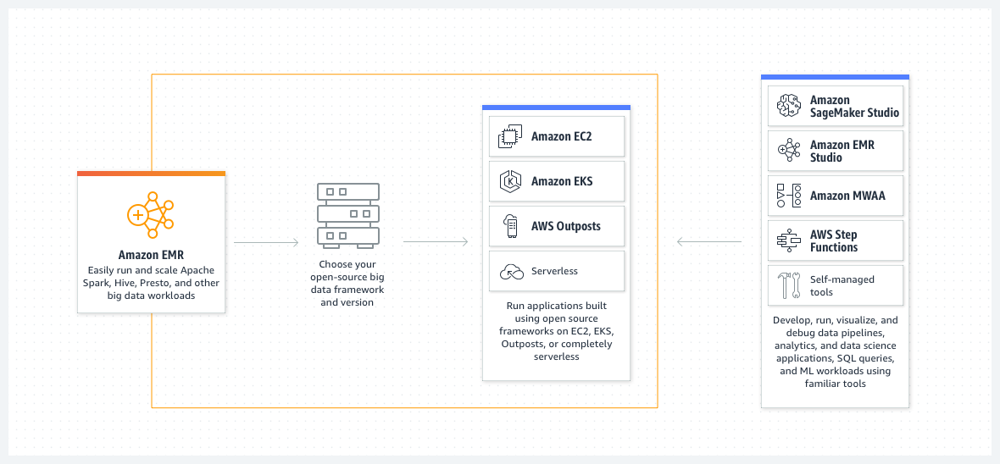

#### 사용 사례

- **빅데이터 분석 수행:** 통계 알고리즘 및 예측 모델을 사용하여 대규모 데이터 처리 및 가정 분석을 실행하여 숨겨진 패턴, 상관 관계, 시장 동향 및 고객 선호도를 밝혀낸다.
- **확장 가능한 데이터 파이프라인 구축:** 다양한 소스에서 데이터를 추출하고 대규모로 처리하여 애플리케이션과 사용자가 사용할 수 있도록 한다.
- **실시간 데이터 스트림 처리:** 스트리밍 데이터 소스의 이벤트를 실시간으로 분석하여 장기 실행, 고가용성, 내결함성 스트리밍 데이터 파이프라인을 생성한다.
- **데이터 과학 및 기계 학습 채택 가속화:** Apache Spark MLlib, TensorFlow 및 Apache MXNet과 같은 오픈 소스 기계 학습 프레임워크를 사용하여 데이터를 분석한다. 대규모 모델 훈련, 분석 및 보고를 위해 Amazon SageMaker Studio에 연결한다.

---

### Amazon FinSpace

- **금융 서비스 산업을 위한 분석**
- 금융 산업 데이터를 몇 분만에 저장, 분류, 준비 및 분석

#### 사용 이유

- 자산 관리 등급 및 상품 유형과 같은 금융 서비스 업계의 일반적인 개념에 따라 데이터를 쉽게 저장, 분류 및 관리할 수 있다.
- 금융 서비스 업계에서 일반적으로 사용되는 기계 학습 기능을 포함하여 사전 구축된 100개 이상의 데이터 준비 기능을 제공하여 금융 서비스 데이터를 준비하는 데 소요되는 시간을 단축한다.
- 데이터 액세스 제어를 시행하고 데이터 사용량을 추적하여 규정 준수 및 활동 보고서를 생성함으로써 규정 준수 요구 사항을 충족하도로 지원한다.
- 재무 데이터 관리 및 분석에 필요한 인프라를 구축하고 유지 관리하는 운영 오버헤드에 대해 걱정할 필요 없이 재무 데이터 분석에 집중할 수 있다.

#### 작동 방식

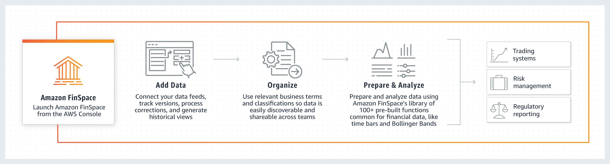

---

### Amazon Kinesis

- **실시간 비디오 및 데이터 스트림 분석**
- 실시간으로 비디오 및 데이터 스트림을 손쉽게 수집, 처리 및 분석
- Amazon Kinesis를 사용하면 실시간 스트리밍 데이터를 손쉽게 수집, 처리 및 분석할 수 있으므로 적시에 통찰력을 확보하고 새로운 정보에 신속하게 대응할 수 있다.
- Amazon Kinesis는 모든 규모의 스트리밍 데이터를 비용 효율적으로 처리할 수 있는 핵심 기능과 더불어 애플리케이션 요구 사항에 가장 적합한 도구를 선택할 수 있는 유연성을 제공한다.
- Amazon Kinesis에서는 기계 학습, 분석 및 기타 애플리케이션을 위해 비디오, 오디오, 애플리케이션 로그, 웹 사이트 클릭스트림 및 IoT 텔레메트리 데이터와 같은 실시간 데이터를 수집할 수 있다.
- Amazon Kinesis를 사용하면 모든 데이터가 수집된 후에야 처리를 시작할 수 있는 것이 아니라 데이터가 수신되는 대로 처리 및 분석하여 즉시 대응할 수 있다.

#### 종류

- **Kinesis Video Streams:** 분석, ML 및 기타 프로세싱을 위해 커넥티드 디바이스에서 AWS로 비디오를 쉽고 안전하게 스트리밍할 수 있다.
- **Kinesis Data Streams:** 조정 가능하고 내구성이 뛰어난 실시간 데이터 스트리밍 서비스로, 수십 만 개의 소스에서 초당 기가바이트의 데이터를 연속적으로 캡처한다.
- **Kinesis Data Firehose:** 기존 인텔리전스 도구를 사용해 거의 실시간 분석을 위해 데이터 스트림을 캡처 및 변환하여 AWS 데이터 스토어로 로드할 수 있는 가장 쉬운 방법이다.
- **Kinesis Data Analytics:** 새로운 프로그래밍 언어 또는 프레임워크를 배울 필요 없이 SQL 또는 Apache Flink를 통해 실시간으로 데이터 스트림을 처리할 수 있는 가장 쉬운 방법이다.

#### 사용 이유

- 실시간으로 스트리밍 데이터를 수집, 버퍼링 및 처리할 수 있으므로 몇시간 또는 며칠이 아니라 몇 초 또는 몇 분 만에 통찰력을 얻을 수 있다.
- 완전관리형으로 스트리밍 애플리케이션을 운영하므로 사용자는 인프라를 관리할 필요가 없다.
- 모든 규모의 스트리밍 데이터를 처리하고 매우 짧은 지연 시간으로 수많은 소스의 데이터를 처리할 수 있다.

#### 작동 방식

- Amazon Kinesis Video Streams

- Amazon Kinesis Data Streams

- Amazon Kinesis Data Firehose

- Amazon Kinesis Data Analytics

#### 사용 사례

- **비디오 분석 애플리케이션 구축:** Amazon Kinesis를 사용하여 가정, 사무실, 공장 및 공공장소의 카메라가 장착된 디바이스에서 비디오를 AWS로 안전하게 스트리밍할 수 있다. 그런 다음 이러한 비디오 스트림을 비디오 재생, 보안 모니터링, 얼굴 탐지, 기계 학습 및 기타 분석에 사용할 수 있다.
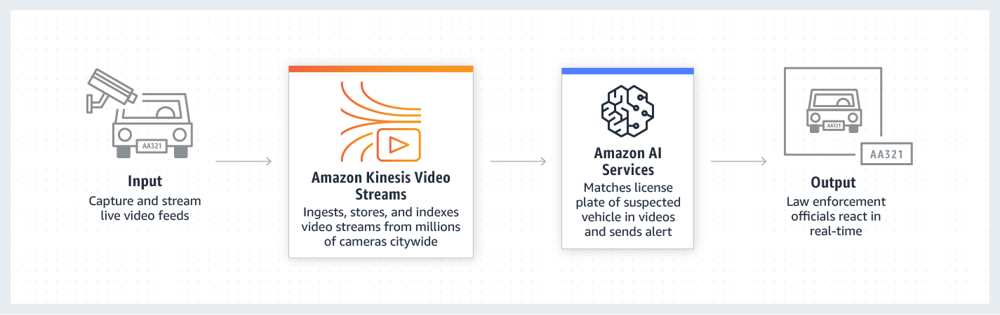

- **배치에서 실시간 분석으로 발전:** Amazon Kinesis에서는 기존에 배치 처리를 사용하여 분석하던 데이터에 대해 실시간 분석을 수행할 수 있다. 일반적인 스트리밍 사용 사례에는 여러 애플리케이션 간 데이터 공유, 스트리밍(ETL) 및 실시간 분석이 포함된다. 예를 들어, Kinesis Data Firehose를 사용하여 스트리밍 데이터를 지속적으로 S3 데이터 레이크 또는 분석 서비스로 로드할 수 있다.
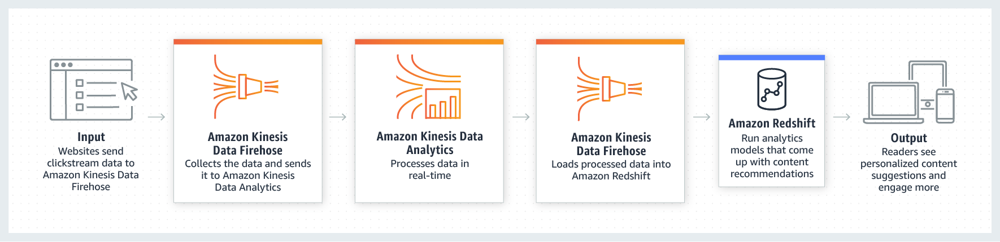

- **실시간 애플리케이션 구축:** 애플리케이션 모니터링, 사기 탐지, 실시간 순위표와 같은 실시간 애플리케이션에 Amazon Kinesis를 사용할 수 있다. 밀리초의 엔드 투 엔드 지연 시간으로 Kinesis Data Streams를 사용하여 스트리밍 데이터를 수집하고, Kinesis Data Analytics를 사용하여 이를 처리하며, Kinesis Data Streams를 사용하여 결과를 데이터 스토어나 애플리케이션으로 보낼 수 있다.
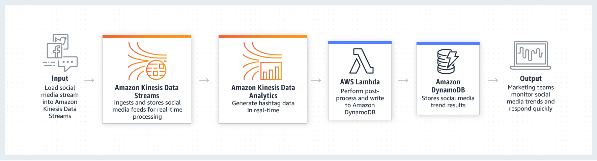

- **IoT 디바이스 데이터 분석:** Amazon Kinesis를 사용하여 가전제품, 내장 센서, TV 셉톱박스 등과 같은 IoT 디바이스에서 전송되는 스트리밍 데이터를 처리할 수 있다. 이후 센서가 특정 운영 임계값을 초과하는 경우 이 데이터를 사용하여 실시간 알림을 전송하거나 프로그래밍 방식으로 다른 조치를 취할 수 있다.
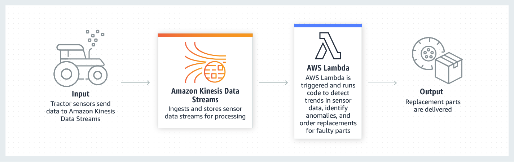

---

### Amazon Managed Streaming for Apache Kafka

- **완전관리형 Apache Kafka 서비스**
- 완전 관리형의 고가용성 Apache Kafka 서비스를 통해 안전하게 데이터를 스트리밍한다.

#### 사용 이유

- 고가용성 Apache Kafka 및 Kafka Connect 클러스터의 프로비저닝, 구성 및 유지 관리 등의 운영 오버헤드를 제거한다.
- Apache Kafka용으로 구축된 애플리케이션 및 도구를 코드 변경없이 바로 사용하고 클러스터 용량을 자동으로 확장한다.
- 네이티브 AWS 통합을 사용하여 안전하게 규정을 준수하며 프로덕션용 애플리케이션을 쉽게 배포한다.
- 종량제 가격을 통해 다른 공급자들에 비해 최저 1/13에 해당하는 저렴한 비용으로 서비스를 제공한다.

#### 작동 방식

- Amazon MSK는 완전관리형 Apache Kafka를 통해 실시간으로 스트리밍 데이터를 손쉽게 수집하고 처리하게 해준다.

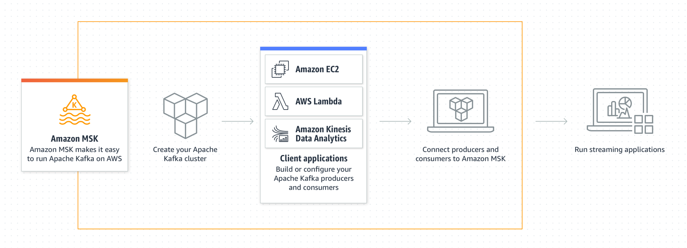

#### 사용 사례

- **로그 및 이벤트 스트림 수집 및 처리:** MSK로 이벤트를 캡처한 다음 Amazon Zepplin 노트북 내에서 스트림 처리 로직을 표현하여 밀리초 단위로 데이터 스트림에서 인사이트를 도출한다.
- **중앙 집중식 상태 또는 데이터 버스 실행:** Amazon MSK 및 Apache Kafka 로그 구조를 사용하여 실시간 비공개로 액세스할 수 있는 중앙 집중식 데이터 버스를 구성한다.
- **이벤트 기반 시스템 강화:** 실시간으로 애플리케이션 및 비즈니스 인프라 전반에 발생하는 디지털 변화를 수집하고 이에 대응한다.

---

### Amazon Redshift

- **빠르고 간단하며 비용 효율적인 데이터 웨어하우징**
- 클라우드 데이터 웨어하우징을 위한 최고의 가격 대비 성능

#### 사용 이유

- 데이터 이동이나 데이터 변환 없이 클릭 몇 번으로 모든 데이터에서 실시간 인사이트와 예측 인사이트를 얻고 데이터 사일로를 없앨 수 있다.
- 추가 비용 없이 바로 사용할 수 있는 획기적인 성능으로 다른 클라우드 데이터 웨어하우스보다 최대 5배 더 뛰어난 가격 대비 성능을 얻을 수 있다.
- 가장 안전하고 신뢰성이 높은 데이터 웨어하우스 서비스로 인프라를 관리해야 하는 부담없이 몇 초 만에 인사이트를 얻을 수 있다.

#### 작동 방식

- SQL을 사용하여 어러 데이터 웨어하우스, 운영 데이터베이스 및 데이터 레이크에서 정형 데이터 및 반정형 데이터를 분석하고 AWS가 설계한 하드웨어 및 기계 학습을 사용해 어떤 규모에서든 최고의 가격 대비 성능을 지원한다.

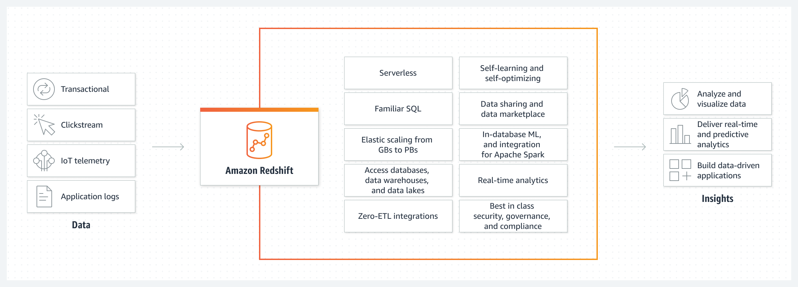

#### 사용 사례

- **재무 및 수요 예측 개선:** 예측 인사이트를 위한 기계 학습 모델을 자동으로 생성, 훈련 및 배포할 수 있다.
- **협업 및 데이터 공유:** 서드 파티 데이터를 기반으로 애플리케이션을 구축하면서 계정, 조직 및 파트너 간에 데이터를 안전하게 공유한다.
- **비즈니스 인텔리전스 최적화:** Amazon QuickSight, Tableau, Microsoft PowerBI 또는 비즈니스 인텔리전스 도구를 사용하여 인사이트 중심의 보고서 및 대시보드를 구축할 수 있다.
- **개발자 생산성 향상:** 드라이버를 구성하고 데이터베이스 연결을 관리하지 않고도 다양한 프로그래밍 언어 및 플랫폼에서 단순화된 데이터 액세스, 수집 및 송신이 가능하다.

---

### Amazon QuickSight

- **빠른 비즈니스 분석 서비스**
- 가장 인기 있는 클라우드 네이티브 서버리스 BI 서비스
- 조직의 모든 사람이 자연어로 질문하거나 대화형 대시보드를 통해 탐색하거나 기계 학습을 기반으로 패턴과 이상값을 자동으로 찾는 방법으로 데이터에 대한 이해를 높인다.

#### 사용 이유

- QuickSight Q로 모두를 위한 BI 지원: 작성자나 관리자가 데이터를 준비하는 데 시간을 소모할 필요 없이, 말하듯이 질문을 하고 Q의 기계 학습 기반 엔진을 사용해 관련 시각화 자료를 수신할 수 있다.
- ML 인사이트로 고급 분석 수행: 기계 학습에 대한 AWS의 전문지식을 활용해 데이터에서 숨겨진 인사이트를 발견하거나, 정확한 예측 및 가정(what-if) 분석을 수행하거나, 이해하기 쉬운 자연어 문장을 대시보드에 추가할 수 있다.
- 애플리케이션 차별화를 위해 분석 기능 임베딩: 대화형 시각화 및 대시보드, 정교한 대시보드 작성 또는 자연어 쿼리 기능을 애플리케이션에 쉽게 임베딩시켜 사용자 경험을 차별화하고 새로운 수익 창출 기회를 얻을 수 있다.

- 모든 데이터 연결 및 크기 조정
- 사용자 지정 가능한 대시보드 구축
- 인사이트를 위해 ML 통합 활용
- 모두를 위한 진정한 셀프 서비스 BI 지원
- 네이티브 AWS 서비스 통합
- 관리할 서버가 없으며, 사용량에 따라 지불
- 내장 보안, 거버넌스, 규정 준수 기능

---

### AWS Clean Rooms

- **기반 데이터를 공유하거나 공개하지 않고 데이터 세트에 대한 매칭, 분석 및 협업 수행**
- AWS Clean Rooms는 고객과 파트너가 서로에게 기초 데이터를 공개하지 않고도 더 간편하게 공동 데이터 세트를 분석하고 협업하여 인사이트를 얻을 수 있는 서비스다. 
- AWS Clean Rooms를 사용하면 몇 분 만에 고유한 클린 룸을 생성하고 클릭 몇 번으로 공동 데이터 세트 분석을 시작할 수 있다. 
- AWS Management Console에서 또는 API를 사용하여 협업할 AWS 고객을 초대하고, 데이터 세트를 선택하고, 참가자에 대한 제한을 구성할 수 있다. 
- AWS Clean Rooms를 사용하면 데이터 사본을 AWS 환경 외부에 유지하거나 다른 플랫폼으로 로드할 필요 없이 이미 AWS를 사용하는 수십만 개의 회사와 협업할 수 있다. 
- 쿼리를 실행하면 AWS Clean Rooms가 데이터의 상주 위치에서 데이터를 읽고 분석 규칙을 적용하므로 데이터를 손쉽게 제어할 수 있다. 
- AWS Clean Rooms는 개인 정보 보호를 개선하는 광범위한 제어 기능 세트를 제공한다. 예를 들어 쿼리 제어, 쿼리 출력 제한 및 쿼리 로깅 등과 같은 제어 기능을 사용하여 각 클린 룸 참가자가 실행하는 쿼리에 대한 제한을 사용자 지정할 수 있다. 
- AWS Clean Rooms에는 엄격한 데이터 취급 정책을 준수하기 위해 쿼리가 처리되는 동안에도 데이터를 암호화된 상태로 유지하는 고급 암호화 컴퓨팅 도구가 포함되어 있다.

#### 사용 이유

- 클릭 몇 번만으로 자체적인 클린룸을 만들고 참가자를 추가하여 헙업한다.
- 기본 데이터를 공유하거나 공개하지 않고도 AWS에서 수십만 개의 기업과 협업한다.
- 클린룸에 대한 광범위하고 구성 가능한 데이터 액세스 제어를 활용하여 기본 데이터를 보호한다.
- 유연하고 구성하기 쉬운 분석 규칙을 사용하여 각 비즈니스 요구 사항에 쿼리를 맞춤으로 설정한다.

#### 작동 방식

5개의 주요 단계로 이루어져 있는 다이어그램

- 첫 번째 단계는 협업 멤버를 보여주며 ‘모든 협업 멤버가 일반 텍스트, 해시 또는 사전 암호화된 데이터를 제공할 수 있음’이라는 텍스트가 있다. 
  또한 이 단계에는 실무자 1, 퍼스트 파티 데이터, 실무자 2, 보고 데이터, 실무자 3, 서드 파티 데이터 등, 다양한 협업 담당자 및 데이터 소스(위에서 아래로)를 나타내는 수직으로 적층된 상자가 포함된다.
- 두 번째 단계에는 ‘AWS Clean Rooms, 원시 데이터를 노출하지 않고 여러 당사자와 협업’이라고 적힌 상자가 포함되어 있다.
- 세 번째 단계에는 Amazon S3의 기존 레코드를 사용하기 위한 테이블 연결, 실행할 수 있는 쿼리 유형을 제어하는 세분화되고 유연한 규칙을 사용하기 위한 분석 규칙 설정, 행 수준의 출력 제약 조건으로 쿼리 결과에서 세그먼트 세분화 수준을 관리하기 위한 출력 제약 조건 설정, 암호화된 데이터 또는 일반 텍스트 데이터를 결합하고 분석하여 비즈니스 인사이트를 얻기 위한 공동 데이터 분석 수행 등, 서비스의 이점을 나타내는 네 가지 아이콘이 있는 사각형이 표시되어 있다.
- 네 번째 단계에는 ‘Amazon S3가 지정된 S3 버킷에 결과 수신’이라고 적힌 상자가 포함되어 있다.
- 다섯 번째 단계에는 Amazon QuickSight, Amazon SageMaker, Amazon Redshift(위에서 아래로)라는 수직으로 적층된 상자 열이 포함되어 있다.

#### 사용 사례

- **마케팅 및 광고 경험 최적화:** 광고 및 마케팅 파트너와 협력하여 캠페인 계획, 활성화 및 측정을 개선하고 소비자에게 더 유용하고 편리한 경험을 제공한다.
- **향상된 고객 인사이트:** 여러 지원 채널 및 파트너 데이터 세트에서 다양한 데이터를 수집하여 고객을 다각적으로 파악할 수 있다.
- **보고 및 측정 개선:** 기업의 부서와 조직 전반에서 매우 민감한 데이터 세트를 안전하게 분석하여 시장 동향을 더 효과적으로 예측하고 리스크를 평가하며 보고 기능을 개선한다.
- **연구 및 개발 가속화:** 협업을 통해 여러 회사의 데이터 세트를 사용하는 새로운 제품, 기술 및 프로그램의 개발을 안전하게 가속화한다.

---

### AWS Data Exchange

- **클라우드에서 서드 파티 데이터 검색, 구독 및 사용**
- 클라우드에서 쉽게 서드 파티 데이터 검색, 구독 및 사용
- 방대한 데이터 세트 카탈로그
- AWS 통합으로 향상된 데이터 기술 구현
- 데이터 조달 및 거버넌스 간소화
- 데이터 파일, 테이블 및 API에 손쉽게 사용 가능

#### 사용 이유

- AWS Data Exchange는 클라우드에서 서드 파티 데이터 집합의 가치를 높이는 것을 사명으로 한다.
- 고객이 방대한 서드 파티 데이터 집합 포트폴리오에서 데이터 파일, 데이터 테이블 및 데이터 API를 얻을 수 있는 유일한 소스다.
- 단일 데이터 카탈로그에서 전 세계 서드 파티 데이터를 손쉽게 찾을 수 있도록 지속적으로 혁신하고, 일관된 요금 옵션으로 간편하게 가입하고, AWS 데이터 및 분석과 기계 학습 서비스에 원활하게 사용할 수 있도록 지원한다.

---

### AWS Data Pipeline

- **데이터 중심의 주기적인 워크플로를 위한 오케스트레이션 서비스**
- 온프레미스 데이터뿐 아니라 여러 AWS 컴퓨팅 및 스토리지 서비스 간에 데이터를 안정적으로 처리하고 지정된 간격으로 이동할 수 있게 지원하는 웹 서비스다.
- 관리형 ETL(추출-변환-로드) 서비스인 AWS Data Pipeline을 사용해 온프레미스 리소스는 물론 다양한 AWS 서비스 전반에 걸쳐 데이터 이동 및 변환을 정의한다.
- 저장된 데이터에 정기적으로 액세스하고, 대규모로 데이터를 변환 및 처리하며 Amazon S3, Amazon RDS, Amazon DynamoDB, Amazon EMR과 같은 서비스에 그 결과를 효율적으로 전송할 수 있다.

#### 사용 이유

- 안정성: 내결함성이 있는 활동 실행을 위해 설계된 고가용성 분산 인프라에 구축되어 있다.
- 사용 편의성: Drag & Drop 콘솔을 사용하여 쉽고 빠르게 파이프라인을 만들수 있다.
- 유연성: 일정 예약, 종속성 추적, 오류 처리 등의 다양한 기능을 활용할 수 있다.
- 확장성: 머신이 하나 또는 여러 대든 직렬 또는 병렬 방식을 모두 지원하여 손쉽게 디스패치할 수 있다.
- 저렴한 비용: 저렴한 비용으로 사용할 수 있으며 월 사용료가 낮다.
- 투명성: 사용자는 비즈니스 로직을 실행하는 컴퓨팅 리소스를 완벽하게 제어하고 쉽게 로직을 개선하거나 디버깅할 수 있다.

#### 사용 사례

- **Amazon Redshift to Data ETL:** RDS 또는 DynamoDB 테이블을 S3에 복사하고 데이터 구조를 변환하며 SQL 쿼리를 분석하여 분석을 실행하고 Readshift에 로드한다.
- **비정형 데이터 ETL:** EMR에서 Hive 또는 Pig를 사용하여 클릭스트림 로그와 같은 비정형 데이터를 분석하고 이를 RDS의 정형 데이터와 결합하여 쉽게 쿼리할 수 있도록 Readshift에 업로드한다.
- **AWS 로그 데이터를 Amazon Redshift에 로드:** 결제 로그 또는 AWS CloudTrail, Amazon CloudFront 및 Amazon CloudWatch 로그와 같은 로그 파일을 Amazon S3에서 Redshift로 로드한다.
- **데이터 로드 및 추출:** RDS 또는 Redshift 테이블에서 S3로 데이터를 복사하거나 그 역방향으로 복사한다.
- **클라우드로 이전:** MySQL 데이터베이스와 같은 온프레미스 데이터스토어의 데이터를 손쉽게 복사하고 S3와 같은 AWS 데이터 스토어로 이동하여 Amazon EMR, Amazon Redshift 및 Amazon RDS와 같은 다양한 AWS 서비스에서 사용할 수 있도록 한다.
- **Amazon DynamoDB 백업 및 복구:** 재해 복구 용도로 DynamoDB 테이블을 주기적으로 S3으로 백업한다.

---

### AWS Glue

- **간단하고 확장 가능한 서버리스 데이터 통합**
- 모든 데이터를 대규모로 검색, 준비 및 통합

#### 사용 이유

- 단일 데이터 통합 서비스를 통해 최신 데이터 파이프라인을 구축하고 관리할 수 있다.
- 서버리스 데이터 통합을 통해 적은 비용을 유지하고 규모에 상관없이 데이터에 더욱 집중할 수 있다.
- 노트북을 사용해 Drag & Drop, 코드 작성, 연결 중에서 원하는 방식을 사용할 수 있다.
- ETL, ELT, 배치, 스트리밍을 비롯하여 다양한 데이터 처리 방식 및 워크로드를 지원한다.

#### 작동 방식

- AWS Glue는 분석, 기계 학습 및 애플리케이션 개발을 위해 여러 소스에서 데이터를 쉽게 탐색, 준비, 이동 및 통합할 수 있도록 하는 확장 가능한 서버리스 데이터 통합 서비스다.
- 데이터 통합 엔진 옵션: AWS Glue에서 사용자 및 워크로드를 지원하기에 적합한 데이터 통합 엔진을 선택할 수 있다.

- 이벤트 기반 ETL: 새 데이터가 도착하는 대로 추출, 전환, 적재(ETL) 작업을 실행할 수 있다.
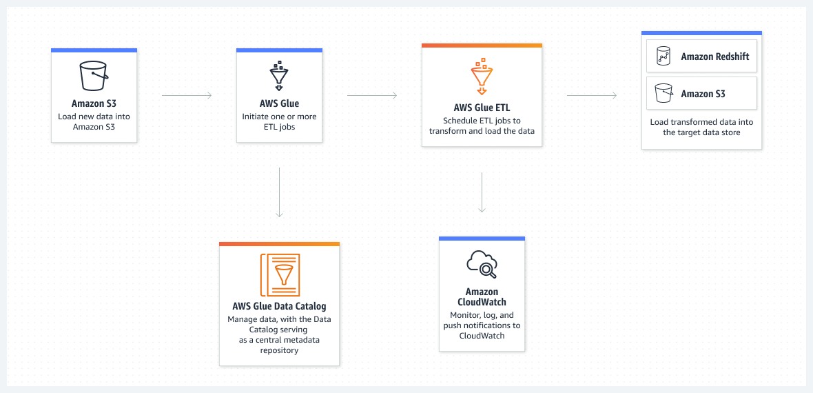

- 데이터 카탈로그: 데이터를 이동하지 않고도 여러 AWS 데이터 세트 전체에서 신속하게 데이터를 검색할 수 있다. 일단 데이터가 카탈로그에 저장되면 Amazon Athena, Amazon EMR 및 Amazon Redshift Spectrum에서 즉시 검색 및 쿼리에 데이터를 사용할 수 있다.
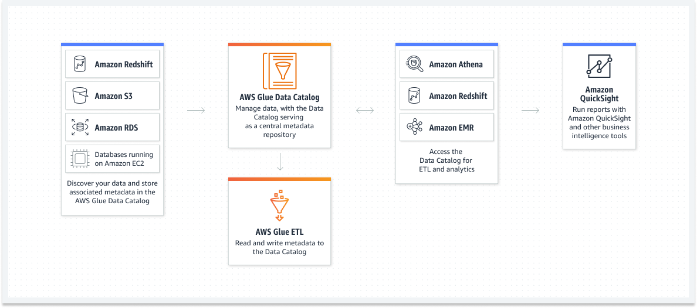

- 노 코드 ETL 작업: AWS Glue Studio를 사용하면 AWS Glue ETL 작업을 시각적으로 간편하게 생성, 실행 및 모니터링할 수 있다. Drag & Drop 방식의 편집기를 사용하여 데이터를 이동 및 변환하는 ETL 작업을 구축할 수 있으며 AWS Glue가 자동으로 코드를 생성한다.
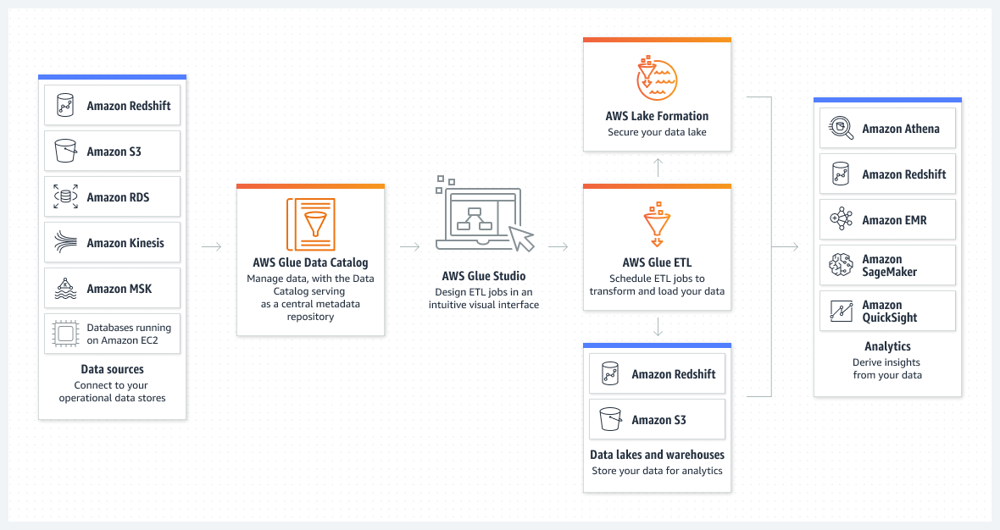

- 데이터 품질 관리 및 모니터링: AWS Glue Data Quality는 데이터 품질 규칙 생성, 관리 및 모니터링을 자동화하여 데이터 레이크 및 파이프라인 전체의 데이터 품질을 높게 유지할 수 있도록 한다.
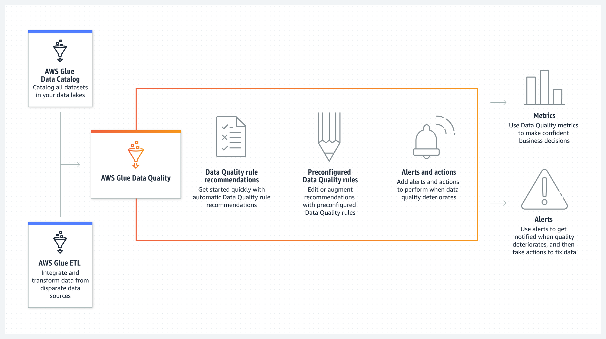

- 데이터 준비: AWS Glue DataBrew를 사용하면 Amazon S3, Amazon Redshift, AWS Lake Formation, Amazon Aurora 및 Amazon RDS를 비롯한 데이터 레이크, 데이터 웨어하우스 및 데이터 베이스에서 직접 데이터를 탐색하고 데이터로 실험할 수 있다.
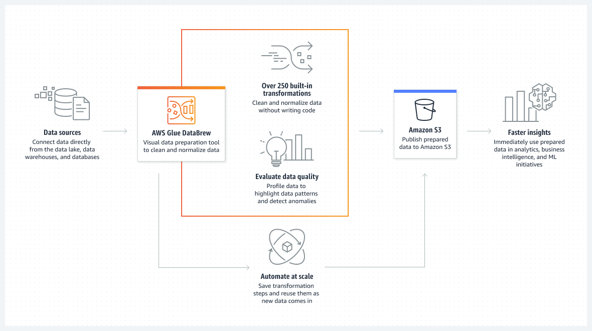

#### 사용 사례

- **ETL 파이프라인 개발 간소화:** 자동 프로비저닝 및 작업자 관리를 통해 인프라 관리 필요성을 제거하고 모든 데이터 통합 요구 사항을 단일 서비스로 통합한다.
- **효율적인 데이터 검색:** 여러 AWS 데이터 세트에서 데이터를 빠르게 식별한 다음 쿼리 및 변환에 즉시 사용할 수 있다.
- **대화식으로 데이터 탐색, 실험 및 처리:** 데이터 엔지니어는 AWS Glue 대화형 세션을 사용하여 원하는 통합 개발 환경(IDE) 또는 노트북을 통해 대화형으로 데이터를 탐색하고 준비할 수 있다.
- **다양한 처리 프레임워크 및 워크로드 지원:** ETL, ELT등 다양한 데이터 처리 프레임워크와 배치, 마이크로 배치, 스트리밍 등 다양한 워크로드를 보다 쉽게 지원한다.

---

### AWS Lake Formation

- **데이터 레이크를 구축, 관리 및 보호**
- 관리형 데이터 레이크

#### 사용 이유

- 데이터베이스와 유사한 익숙한 기능을 사용하여 데이터 레이크를 신속하게 생성, 관리, 보호할 수 있다.
- 보안 관리 및 거버넌스를 규모에 맞게 간소화하고 데이터 레이크에서 권한을 미세 조정할 수 있다.
- 중앙 집중식 데이터 카탈로그를 통해 데이터 사일로 문제를 해소하고 모든 데이터를 검색할 수 있다.
- 계정 간 데이터 공유를 통해 규모에 맞게 조직 전체에서 데이터에 액세스 가능하도록 지원할 수 있다.

#### 작동 방식

- AWS Lake Formation을 사용하면 안전한 데이터 레이크를 간편하게 구축하여 광범위한 분석 작업에서 데이터를 사용할 수 있다.

#### 사용 사례

- **단 며칠 내에 데이터 레이크 구축:** 모든 데이터 소스에서 데이터를 빠르게 가져온 다음 중앙 집중식 데이터 카탈로그에서 설명하고 관리한다.
- **대규모 데이터 레이크 보호 및 관리:** 행 및 셀 수준 권한과 태그 기반 액세스 제어를 비롯한 세분화된 보안 기능으로 권한을 보다 쉽게 확장한다.
- **조직 전체에 셀프 서비스 분석 활성화:** 사용 가능한 데이터 세트에 대한 액세스를 중앙에서 관리하고 모든 데이터 사용자에게 세분화된 권한을 적용한다.
- **최소한의 데이터 이동으로 데이터 메시 구축:** 데이터 메시 또는 데이터 패브릭을 배포하거나 조직에서 계정 간 데이터 공유를 단순화한다.

---

### 참고한 자료

- [Amazon Athena](https://aws.amazon.com/ko/athena/?nc2=h_ql_prod_an_ath)
- [Amazon CloudSearch](https://aws.amazon.com/ko/cloudsearch/?nc2=h_ql_prod_an_cs)
- [Amazon DataZone](https://aws.amazon.com/ko/datazone/?nc2=h_ql_prod_an_dz)
- [Amazon OpenSearch Service](https://aws.amazon.com/ko/opensearch-service/?nc2=h_ql_prod_an_es)
- [Amazon EMR](https://aws.amazon.com/ko/emr/?nc2=h_ql_prod_an_emr)
- [Amazon FinSpace](https://aws.amazon.com/ko/finspace/?nc2=h_ql_prod_an_fs)
- [Amazon Kinesis](https://aws.amazon.com/ko/kinesis/?nc2=h_ql_prod_an_kin)
- [Amazon Managed Streaming for Apache Kafka](https://aws.amazon.com/ko/msk/?nc2=h_ql_prod_an_msak)
- [Amazon Redshift](https://aws.amazon.com/ko/redshift/?nc2=h_ql_prod_an_rs)
- [Amazon QuickSight](https://aws.amazon.com/ko/quicksight/?nc2=h_ql_prod_an_qs)
- [Amazon Clean Rooms](https://aws.amazon.com/ko/clean-rooms/?nc2=h_ql_prod_an_cr)
- [AWS Data Exchange](https://aws.amazon.com/ko/data-exchange/?nc2=h_ql_prod_an_dex)
- [AWS Data Pipeline](https://aws.amazon.com/ko/datapipeline/?nc2=h_ql_prod_an_dp)
- [AWS Glue](https://aws.amazon.com/ko/glue/?nc2=h_ql_prod_an_glu)
- [AWS Lake Formation](https://aws.amazon.com/ko/lake-formation/?nc2=h_ql_prod_an_lkf)