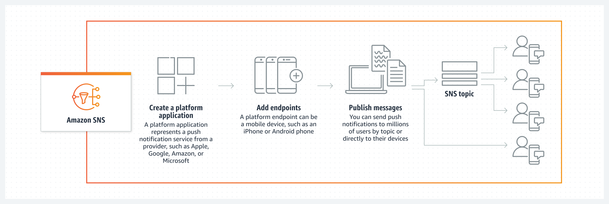

## 애플리케이션 통합(Application Integration)

- 최초 작성 일자: 2023-03-17
- 수정 내역:
  - 2023-03-17: 최초 작성

---

### AWS Step Functions

- **분산 애플리케이션을 위한 조정**
- 분산 애플리케이션을 위한 시각적 워크플로

#### 사용 이유

- 복잡한 비즈니스 로직을 표현하기 위한 간단한 드래그 앤 드롭 인터페이스인 Workflow Studio를 사용하여 신속하게 구축할 수 있다.
- 코드를 유지 관리하지 않고 220개 넘는 AWS 서비스를 통해 워크플로를 자동화할 수 있다.
- 대규모 병렬 워크플로에서 코드를 사용하여 데이터를 온디맨드로 처리한다.
- 이벤트 기반 아키텍처를 위해 복원력 있는 워크플로를 시각화한다.

#### 작동 방식

- AWS Step Functions는 개발자가 AWS 서비스를 사용하여 분산 애플리케이션을 구축하고, 프로세스를 자동화하며, 마이크로서비스를 오케스트레이션하고, 데이터 및 기계 학습(ML) 파이프라인을 생성할 수 있도록 지원하는 시각적 워크플로 서비스다.

#### 사용 사례

- **추출, 변환, 적재(ETL) 프로세스 자동화:** 수동으로 오케스트레이션하지 않고 여러 개의 장기 실행 ETL 작업이 순서대로 실행되고 성공적으로 완료될 수 있도록 한다.
- **보안 및 IT 기능 자동화:** 보안 인시던트 대응을 위해 수동 도착 단계를 비롯한 자동화된 워크플로를 생성할 수 있다.
- **마이크로서비스 오케스트레이션:** 여러 AWS Lambda 함수를 응답성이 뛰어난 서버리스 애플리케이션 및 마이크로서비스로 결합할 수 있다.
- **대규모 병렬 워크플로 오케스트레이션:** 보안 로그, 트랜잭션 데이터 또는 이미지 및 동영상 파일과 같은 대규모 데이터 세트를 반복하고 처리할 수 있다.

---

### Amazon AppFlow

- **SaaS 앱 및 AWS 서비스를 위한 코드 없는 통합**
- 서비스형 소프트웨어(SaaS)와 AWS 서비스 간의 데이터 흐름 자동화

#### 사용 이유

- Salesforce, SAP, Google Analytics 및 Amazon Redshift와 같은 서비스 간에 데이터를 전송하는 완전관리형 통합 서비스다.
- 시스템 리소스를 피로비저닝할 필요 없이 대규모로 데이터를 전송할 수 있다.
- AWS 분석 및 기계 학습 서비스에서 검색하고 공유할 데이터의 카탈로그를 자동으로 작성한다.
- 변환, 분할 및 집계를 통해 데이터 준비를 간소화하고 자동화한다.

#### 작동 방식

- Amazon AppFlow를 사용하면 클릭 몇 번으로 SaaS 애플리케이션과 AWS 서비스 간 양방향 데이터 흐름을 자동화할 수 있다. 
- 원하는 빈도로 일정에 따라, 비즈니스 이벤트에 대한 응답으로 또는 온디맨트로 데이터 흐름을 실행할 수 있다. 
- 변환, 분할 및 집계를 통해 데이터 준비를 간소화할 수 있다.
- AWS Glue 데이터 카탈로그를 통해 스키마 준비 및 등록을 자동화하여 AWS 분석 및 기계 학습 서비스로 데이터를 검색하고 공유할 수 있다.

#### 사용 사례

- **고객에 대한 전방위적 가시성:** 마케팅, 고객 지원 및 영업 데이터를 통합하여 고객의 여정을 전방위로 파악한다.
- **SaaS 데이터 보강:** 여러 SaaS 서비스에 사용할 데이터를 보강한다. 예를 들어, Salesforce 데이터를 Amazon SageMaker의 사용자 지정 ML 모델로 풀링하여 적절한 영업 지원을 보낼 수 있다.
- **이벤트 기반 워크플로 생성:** 한 애플리케이션의 데이터를 기반으로 다른 애플리케이션의 프로세스를 자동화한다. 예를 들어, 새로운 Marketo 리드를 사용하여 Salesforce 레코드를 생성한다.
- **Salesforce 데이터 저장 및 분석:** Salesforce의 기회 레코드 데이터를 Amazon Redshift 테이블로 전송하여 대시보드를 실시간으로 업데이트한다.

---

### Amazon EventBridge

- **SaaS 앱 및 AWS 서비스를 위한 서버리스 이벤트 버스**
- AWS, 기존 시스템 또는 SaaS 애플리케이션에서 대규모 이벤트 기반 애플리케이션 구축

#### 사용 이유

- 느슨하게 결합된 이벤트 기반 아키텍처를 손쉽게 구축하여 새로운 기능을 더 빠르게 배포할 수 있다.
- 사용자 지정 코드를 작성하거나 서버를 관리하고 프로비저닝할 필요 없이 이벤트 생산자와 소비자 간의 지점 간 통합을 생성할 수 있다.
- AWS 서비스, 서비스형 소프트웨어(SaaS) 애플리케이션 및 사용자 지정 애플리케이션을 이벤트 생산자로 연결하여 워크플로를 시작할 수 있다.
- Amazon EventBridge 스케줄러를 사용하면 단일 소스에서 수백만 개의 이벤트와 태스크를 생성, 트리거 및 관리할 수 있다.

#### 작동 방식

- **Amazon EventBridge EventBus:** 이벤트 수신, 필터링, 변환, 라우팅 및 전송에 도움이 되는 서버리스 이벤트 버스.

- **Amazon EventBridge Pipes:** 선택적 필터링, 보강 및 변환 기능을 사용하여 이벤트 생산자와 이벤트 소비자를 연결하는 데 도움이 되는 서버리스 지점 간 통합 리소스다.

- **Amazon EventBridge Scheduler:** 태스크 및 이벤트를 대규모로 예약할 수 있다.

#### 사용 사례

- **개발자 민첩성 개선:** AWS, SaaS 앱 또는 자체 사용자 지정 앱을 사용하는 마이크로서비스가 분리되어 있는 여러 서비스 팀 간에 조정이 필요하지 않다.
- **애플리케이션 모니터링 및 감사:** AWS 환경을 모니터링 및 감사하고 애플리케이션의 운영 변경에 실시간으로 대응하여 인프라 취약성을 방지한다.
- **SaaS 통합을 통한 기능 확장:** 사용자 지정 이벤트를 EventBridge로 전송한 다음 API 대상을 통해 Zendesk CRM으로 전송하여 애플리케이션을 다른 SaaS 애플리케이션에 연결한다.
- **애플리케이션에서 일정 예약:** 애플리케이션 및 플랫폼에서 EventBridge Scheduler를 사용하여 미리 알림, 지연된 작업 또는 중지 위치에서 다시 시작 알림이 포함된 일정 예약 서비스를 제공한다.

---

### Amazon Managed Workflows for Apache Airflow(MWAA)

- **가용성이 높고 안전한 관리형 워크플로 오케스트레이션**
- Apache Airflow를 위한 고가용성의 안전한 관리형 워크플로 오케스트레이션

#### 사용 이유

- 기본 인프라 관리 운영에 대한 부담 없이 규모에 맞게 Apache Airflow를 배포할 수 있다.
- 격리되고 안전한 자체 클라우드 환경에서 Apache Airflow 워크로드를 실행할 수 있다.
- Amazon CloudWatch 통합을 통해 환경을 모니터링하여 운영 비용 및 엔지니어링 오버 헤드를 줄일 수 있다.
- Apache Airflow 제공업체 또는 사용자 지정 플러그인을 통해 AWS, 클라우드 또는 온프레미스 리소스에 연결할 수 있다.

#### 작동 방식

- Amazon MWAA는 Python으로 작성된 DAG(Directed Acyclic Graph)를 사용하여 워크플로를 오케스트레이션한다.
- MWAA에 사용할 Amazon S3 버킷을 지정하면 이 위치에 DAG, 플러그인 및 Python 요구 사항이 저장된다. 이후 AWS Management Console, CLI, SDK 또는 Apache Airflow UI에서 DAG를 실행하고 모니터링할 수 있다.

#### 사용 사례

- **복잡한 워크플로 지원:** 빅데이터 공급자의 복잡한 데이터를 준비하고 처리하는 예약 또는 온디맨드 워크플로를 만든다.
- **ETL 작업 코디네이션:** 복잡한 ETL 워크플로 내에서 다양한 기술을 사용하는 여러 ETL 프로세스를 오케스트레이션한다.
- **ML 데이터 준비:** 파이프라인을 자동화하여 기계 학습 모델링 시스템이 데이터를 수집하고 학습하도록 돕는다.

---

### Amazon MQ

- **관리형 메시지 브로커 서비스**
- 완전관리형 오픈 소스 메시지 브로커 서비스

#### 사용 이유

- 최신 엔드포인트와 업계 표준 API 및 프로토콜을 사용하여 애플리케이션을 보다 손쉽게 마이그레이션할 수 있다.
- 메시지 브로커에 대한 관리, 유지 보수 작업, 보안 관리와 같은 시간 소모적인 작업에서 벗어날 수 있다.
- AWS 가용 영역에서 애플리케이션의 고가용성과 메시지의 내구성을 보장할 수 있다.

#### 작동 방식

- 메시지 브로커를 사용하면 소프트웨어 시스템이 대개 다양한 플랫폼에서 서로 다른 프로그래밍 언어를 사용하여, 통신하고 정보를 교환할 수 있다.
- Amazon MQ는 AWS에서 메시지 브로커의 설정, 운영 및 관리를 간소화하는 Apache ActiveMQ 및 RabbitMQ용 관리형 메시지 브로커 서비스다.
- Amazon MQ를 사용하면 몇 단계만으로 메시지 브로커를 프로비저닝하고 소프트웨어 버전 업그레이드에 대한 지원을 받을 수 있다.

#### 사용 사례

- **짧은 지연 시간 이벤트 메시징:** 수천 개의 이벤트에 대해 짧은 지연 시간을 보장하여 애플리케이션에 가능한 최신 정보를 제공한다.
- **유연한 구성으로 마이그레이션:** 활성/대기, 브로커 네트워크 또는 클러스터 구성을 사용하여 온프레미스에서 Amazon MQ로 마이그레이션한다.
- **AWS Lambda 함수 호출:** 애플리케이션을 통합하고 Lambda 함수를 사용하여 Amazon MQ 메시지 브로커를 폴링한다.

---

### Amazon SNS

- **pub/sub, SMS, 이메일 및 모바일 푸시 알림**
- A2A 및 A2P 메시징을 위한 완전관리형 게시/구독 서비스

#### 사용 이유

- A2A(application-to-application) 알림을 제공하여 분산 애플리케이션을 통합하고 분리할 수 있다.
- SMS 문자, 푸시 알림, 이메일을 통해 고객에게 A2P(application-to-person) 알림을 배포할 수 있다.
- 메시지 필터링, 배치 처리, 정렬, 중복 제거를 통해 아키텍처를 간소화하고 비용을 절감할 수 있다.
- 보관, 전송 재시도 및 DLQ(Dead Letter Queue)를 통해 메시지 내구성을 향상시킬 수 있다.

#### 작동 방식

- Amazon SNS는 A2A와 A2P 두 가지 방식으로 알림을 전송한다.
- A2A는 분산된 시스템, 마이크로서비스 및 이벤트 중심의 서버리스 애플리케이션 간에 처리량이 많은 푸시 기반의 다대다 메시징을 제공한다.
- 애플리케이션은 Amazon SQS, Amazon Kinesis Data Firehose, AWS Lambda 기타 HTTPS 엔드포인트가 포함된다.
- A2P 기능을 사용하면 SMS 텍스트, 푸시 알림, 이메일을 통해 고객에게 메시지를 전송할 수 있다.
- **Pub/Sub**

- **SMS**

- **Mobile Push**

#### 사용 사례

- **애플리케이션을 FIFO 메시징과 통합:** 엄격하게 정렬된 선입 선출(FIFO) 방식으로 메시지를 전달하여 독립 애플리케이션에서 정확성과 일관성을 유지한다.
- **알림 메시지 전달을 안전하게 암호화:** AWS KMS(Key Management Service)로 메시지를 암호화하고, AWS PrivateLink로 트래픽 개인 정보 보호를 보장하고, 리소스 정책 및 태그로 액세스를 제어한다.
- **60개가 넘는 AWS 서비스에서 이벤트 캡처 및 팬아웃:** 분석, 컴퓨팅, 컨테이너, 데이터베이스, IoT, ML, 보안, 스토리지와 같은 AWS 카테고리 전반에 걸쳐 이벤트를 팬아웃한다.
- **240개국 이상의 고객에게 SMS 문자 전송:** 공급자 간에 중복성이 있는 전 세계 SMS를 사용한다. 발신자 ID, 긴 코드, 짧은 코드, TFN, 10DLC로 SMS 발신 ID를 설정한다.

---

### Amazon SQS

- **관리형 메시지 대기열**
- 마이크로서비스, 분산 시스템 및 서버리스 애플리케이션을 위한 완전관리형 메시지 대기열

#### 사용 이유

- 초기 비용 없이 소프트웨어를 관리하거나 인프라를 유지하지 않고 오버헤드를 제거할 수 있다.
- 메시지를 누락하거나 다른 서비스를 가용 상태로 유지하지 않고도 처리량에 관계 없이 대량의 데이터를 안정적으로 전송할 수 있다.
- 민감한 데이터를 애플리케이션 간에 안전하게 전송하고 AWS KMS를 사용하여 키를 중앙 집중식으로 관리할 수 있다.
- 사용량에 따라 탄력적이고 비용 효율적으로 확장할 수 있으므로 용량 계획 및 사전 프로비저닝에 대해 걱정할 필요가 없다.

#### 작동 방식

- AmazonSQS를 사용하면 메시지 손실을 우려하거나 다른 서비스를 제공할 필요 없이 소프트웨어 구성 요소 간에 어떤 볼륨의 메시지든 전송, 저장 및 수신할 수 있다.

#### 사용 사례

- **애플리케이션 신뢰성 및 확장성 향상:** Amazon SQS는 고객이 대기열을 사용하여 구성 요소(마이크로서비스)를 분리하고 연결할 수 있는 간단하고 안정적인 방법을 제공한다.
- **마이크로서비스 분리 및 이벤트 기반 애플리케이션 처리:** 뱅킹 애플리케이션에서와 같이 프론트엔드를 백엔드 시스템과 분리한다. 고객은 즉시 응답을 받지만 청구서 결제는 백그라운드에서 처리된다.
- **작업을 비용 효율적이고 정시에 완료하도록 보장:** 자동 크기 조정 그룹의 여러 작업자가 워크로드 및 지연 시간 요구 사항에 따라 확장 및 축소되는 단일 대기열에 작업을 배치한다.
- **메시지 순서 유지 및 중복 제거:** 메시지 순서를 유지하면서 대규모로 메시지를 처리하여 메시지 중복을 제거할 수 있다.

---

### AWS AppSync

- **확장 가능한 완전관리형 GraphQL API**
- 서버리스 GraphQL과 Pub/Sub API로 애플리케이션 개발을 가속화

#### 사용 이유

- 한 번의 네트워크 요청을 통해 하나 이상의 소스 또는 마이크로서비스의 데이터에 액세스할 수 있다.
- 서버리스 WebSocket을 통해 이벤트 소스의 데이터를 구독 클라이언트에 게시하여 매력적인 실시간 환경을 만들 수 있다.
- 오프라인 데이터 동기화, 버저닝 충돌 해결을 통해 오프라인에서도 데이터와 상호 작용하고 데이터를 업데이트할 수 있다.
- API 요청에 대한 요금 및 연결된 클라이언트로 전송되는 실시간 메시지에 대한 요금만 지불하면 된다.

#### 작동 방식

- AWS AppSync는 단일 엔드포인트를 통해 애플리케이션 개발을 간소화하는 서버리스 GraphQL 및 Pub/Sub API를 생성하여 데이터를 안전하게 쿼리, 업데이트 또는 게시한다.
- **GraphQL API:** AWS AppSync로 구축된 GraphQL API를 통해 프론트엔드 개발자는 단일 GraphQL 엔드포인트에서 여러 데이터베이스, 마이크로서비스 및 API를 쿼리할 수 있다.

- **Pub/Sub API:** 프론트엔드 개발자는 AWS AppSync로 구축된 Pub/Sub API를 사용하여 서버리스 WebSockets 연결을 통해 실시간 데이터 업데이트를 구독 API 클라이언트에 게시할 수 있다.

#### 사용 사례

- **여러 데이터 소스에서 데이터 검색 또는 수정:** 단일 네트워크 호출로 여러 데이터 소스(SQL, NoSQL, 검색 데이터, REST 엔드포인트 및 마이크로서비스)와 상호 작용한다.
- **클라이언트가 중단된 경우 데이터 동기화:** AWS AppSync 및 AWS Amplify DataStore를 사용하여 모바일 및 웹 애플리케이션과 클라우드 간에 데이터를 자동으로 동기화한다.
- **실시간 협업 및 채팅 애플리케이션 구축:** 백엔드에서 연결된 클라이언트 간 데이터를 브로드캐스트하고 대화형 모바일 또는 웹 애플리케이션을 구축한다.
- **IoT 데이터 관리:** AWS IoT 서비스로 전송된 디바이스 데이터에 액세스하여 모바일 또는 웹 애플리케이션에서 실시간 대시보드를 구축한다.

---

### 참고한 자료

- [AWS Step Functions](https://aws.amazon.com/ko/step-functions/?nc2=h_ql_prod_ap_stf)
- [Amazon AppFlow](https://aws.amazon.com/ko/appflow/?nc2=h_ql_prod_ap_af)
- [Amazon EventBridge](https://aws.amazon.com/ko/eventbridge/?nc2=h_ql_prod_ap_eb)
- [Amazon Managed Workflows for Apache Airflow](https://aws.amazon.com/ko/managed-workflows-for-apache-airflow/?nc2=h_ql_prod_ap_af)
- [Amazon MQ](https://aws.amazon.com/ko/amazon-mq/?nc2=h_ql_prod_ap_mq)
- [Amazon SNS](https://aws.amazon.com/ko/sns/?nc2=h_ql_prod_ap_sns)
- [AWS AppSync](https://aws.amazon.com/ko/appsync/?nc2=h_ql_prod_ap_as)