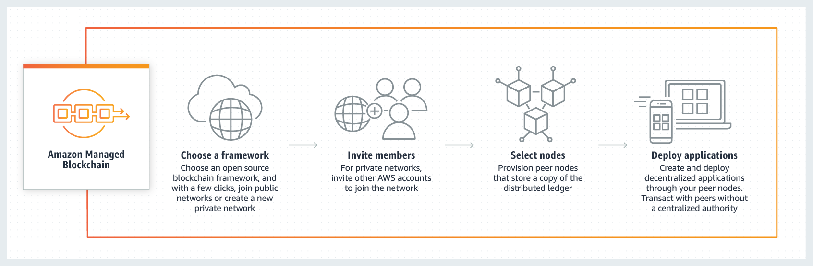
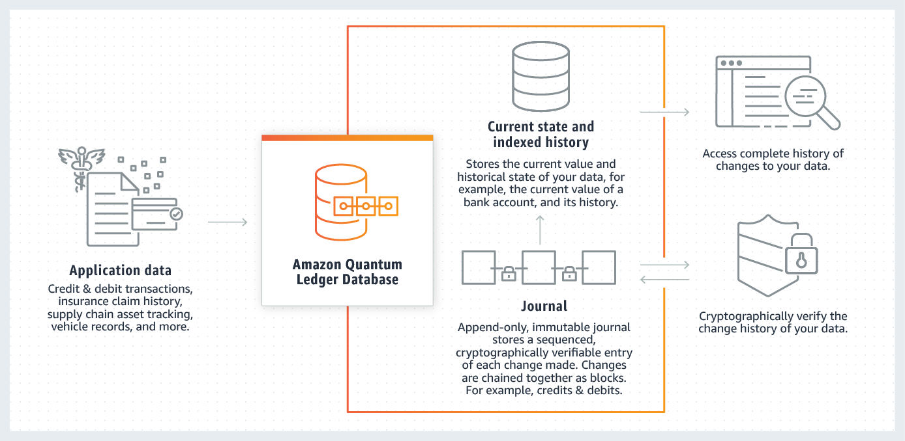

## 블록체인(Blockchain)

- 최초 작성 일자: 2023-03-17
- 수정 내역:
  - 2023-03-17: 최초 작성

---

### Amazon Managed Blockchain

- **확장 가능한 블록체인 네트워크 생성 및 관리**
- 확장 가능한 블록체인 네트워크를 손쉽게 생성 및 관리

#### 사용 이유

- **완전관리형:** 여러 AWS 계정을 포함하는 블록체인 네트워크를 빠르게 생성할 수 있으므로 중앙 기관이 없어도 멤버 그룹이 트랜잭션을 실행하고 데이터를 공유할 수 있다.
- **Hyperledger Fabric or Ethereum 중에서 선택 가능:** 널리 사용되는 두 가지 블록체인 프레임워크를 지원
- **우수한 확장성과 보안:** 네트워크의 애플리케이션 사용량이 장기적으로 증가함에 따라 Amazon Managed Blockchain은 블록체인 네트워크를 쉽게 확장할 수 있다. 또한, AWS KMS 기술을 사용하여 네트워크 인증서를 보호하므로 자체 보안 키 스토리지를 설정할 필요가 없다.
- **안정성:** 블록체인 네트워크 전반에 걸쳐 트랜잭션 제공을 보장하는 Hyperledger Fabric 프레임워크의 구성 요소인 "주문 서비스" 안정성을 개선한다. Amazon QLDB 기술을 사용하여 구축된 Managed Blockchain의 주문 서비스에는 블록체인 네트워크 내에서 진행되는 모든 트랜잭션의 전체 기록을 정확하게 유지 관리하는 변경 불가능한 변경 로그가 포함되어 있어, 이 데이터를 지속력 있게 저장할 수 있다.

#### 작동 방식

#### 사용 사례

- **거래 및 자산 이전:** 거래를 진행할 때는 수입업체, 수출업체 등의 여러 조직이 상호 협력해야 한다. Amazon Managed Blockchain을 사용하면 금융 및 컨소시엄이 블록체인 네트워크를 쉽게 생성할 수 있다.
- **소매:** 소매업체 그룹이 보수 정보를 빠르고 투명하게 공유/검증할 수 있는 블록체인 네트워크를 쉽게 구현할 수 있으므로 소매업체 간의 보수 트랜잭션을 처리해 주는 중앙 기관이 필요하지 않다.
- **공급망:** 공급망 네트워크 전반에 걸쳐 블록체인을 빠르게 구현함으로써 원석 정보를 더욱 투명하게 파악할 수 있으며 당사자 간의 상품 이동을 실시간으로 기록하고 추적할 수 있다.

---

### Amazon QLDB(Quantum Ledger Database)

- **완전관리형 원장 데이터베이스**
- 암호화 방식으로 검증되고 변경 불가능한 데이터 변경 로그 유지

#### 사용 이유

- 변경 불가능하고 투명한 저널을 사용하여 모든 애플리케이션 데이터의 변경에 대한 시퀀스 기록을 추적하고 유지할 수 있다.
- 데이터의 무결성을 신뢰할 수 있다. 기본 제공 암호화 검증을 통해 데이터 변경에 대한 서드 파티 검증을 지원할 수 있다.
- QLDB ACID 트랜잭션 및 Amazon Kinesis로의 실시간 스트리밍 지원을 통해 정확한 이벤트 기반 시스템을 구축할 수 있다.
- 자동 스토리지 및 리소스 크기 조정을 제공하는 서버리스 아키텍처를 통해 소규모로 시작하고 사용한 만큼만 요금을 지불할 수 있다.

#### 작동 방식

- Amazon QLDB는 완전관리형 원장 데이터베이스로 투명하고 변경 불가능하며 암호화 방식으로 검증 가능한 트랜잭션 로그를 제공한다.

#### 사용 사례

- **금융 거래 저장:** 신용 및 직불 거래와 같은 모든 금융 거래의 완전하고 정확한 레코드를 생성한다.
- **공급망 시스템 조정:** 각 거래 이력을 기록하고, 설비에서 제조되어 매장으로 배송, 저장 및 판매된 모든 배치의 세부 정보를 제공한다.
- **청구 기록 유지:** 청구의 전체 수명을 추적하고 암호화 방식으로 데이터 무결성을 확인하여 데이터 입력 오류 및 조작으로부터 애플리케이션의 복원력을 유지한다.
- **디지털 레코드 중앙 집중화:** 급여, 보너스 및 복지 등 직원 세부 정보에 대한 완전한 중앙 집중식 레코드를 생성하는 레코드 시스템 애플리케이션을 구현한다.

---

### 참고한 자료

- [Amazon Managed Blockchain](https://aws.amazon.com/ko/managed-blockchain/?nc2=h_ql_prod_bl_amb)
- [Amazon Quantum Ledger Database(QLDB)](https://aws.amazon.com/ko/qldb/?nc2=h_ql_prod_bl_qldb)