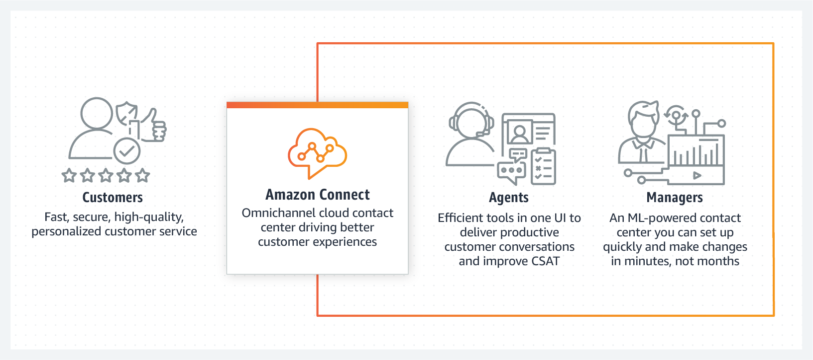
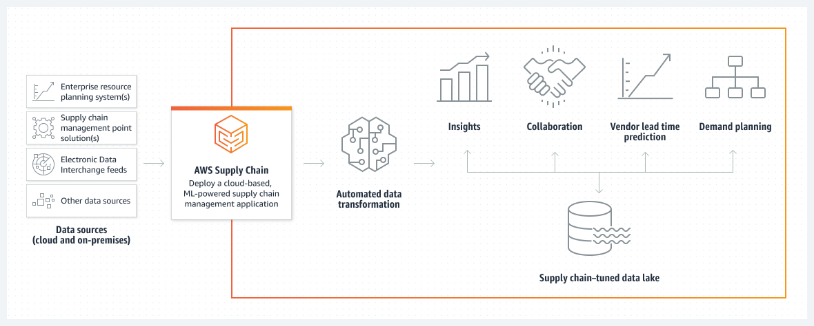
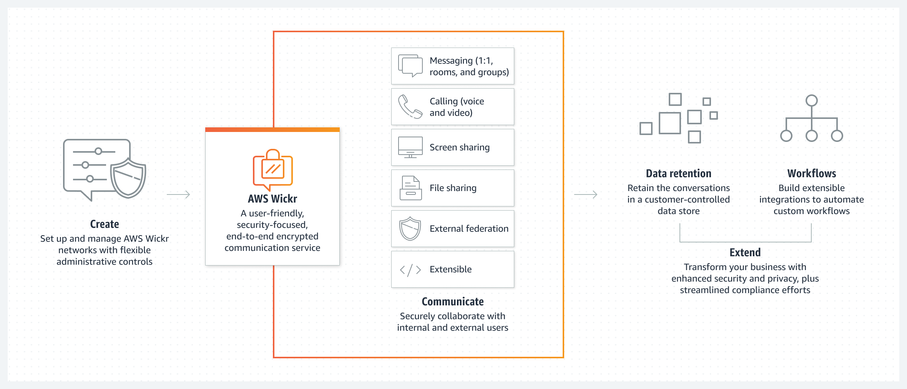
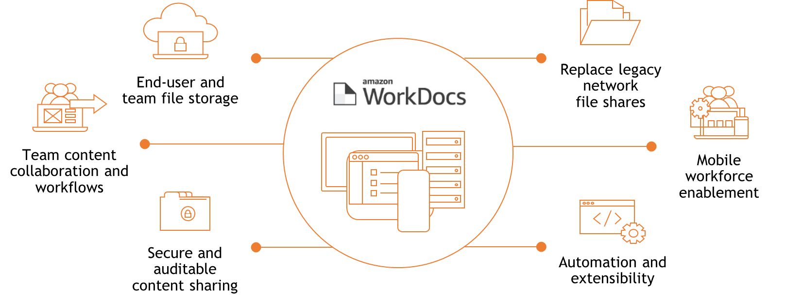
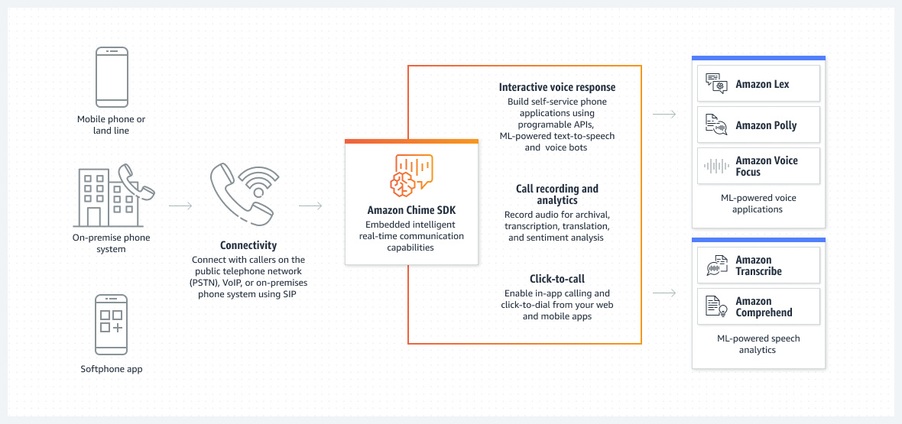
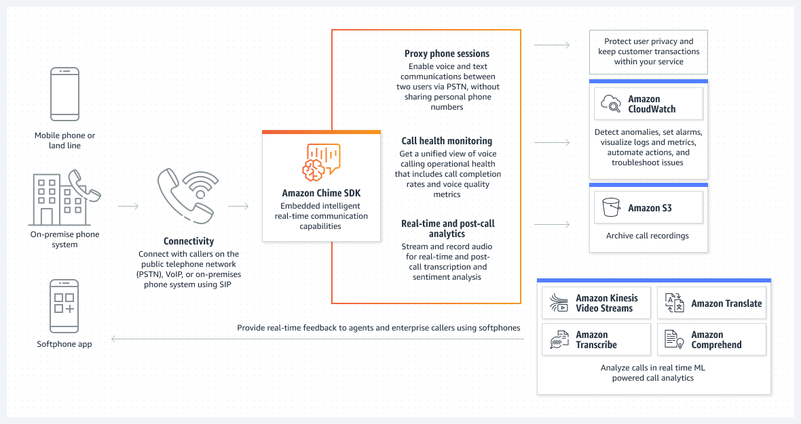
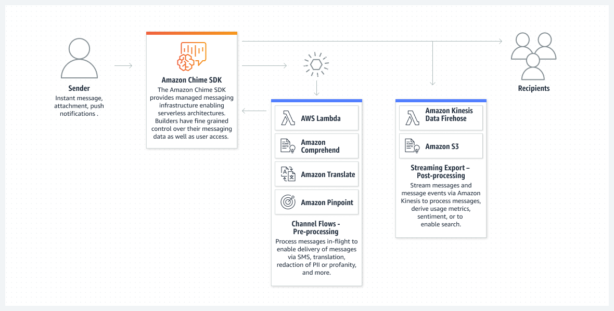
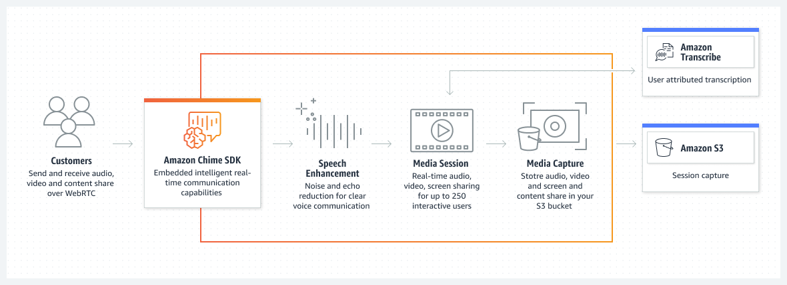
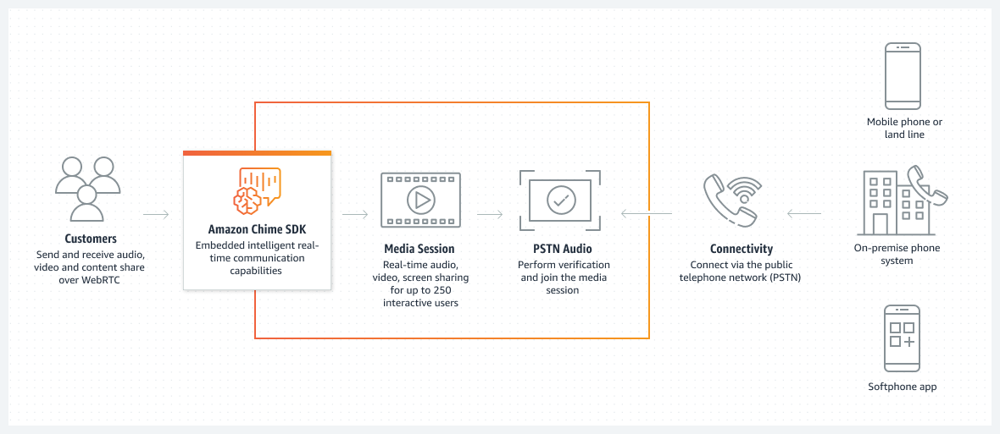
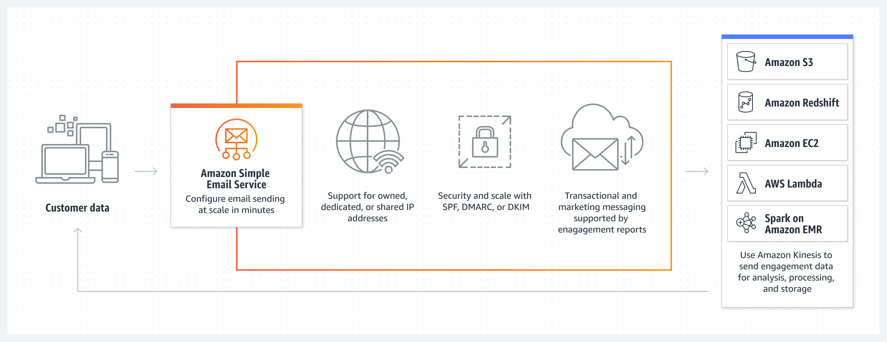

## 비즈니스 애플리케이션(Business Application)

- 최초 작성 일자: 2023-03-20
- 수정 내역:
  - 2023-03-20: 최초 작성

---

### Amazon Connect

- **옴니 채널 클라우드 콜 센터**
- 사용하기 쉬운 클라우드 고객 센터를 통해 저렴한 비용으로 우수한 고객 서비스 제공

#### 사용 이유

- 클릭 몇 번으로 클라우드 고객 센터를 설정하고 에이전트를 온보딩하여 고객을 즉시 지원할 수 있다.
- 올인원 형태의 AI 및 ML 기반 고객 센터를 통해 음성 및 디지털 채널 전반에서 에이전트 생산성과 고객 경험을 개선할 수 있다.
- 위치에 관계없이 수만 명에 이르는 에이전트를 온보딩할 수 있는 유연성을 통해 고객 수요에 따라 간편하게 스케일 업 또는 스케일 다운할 수 있다.
- 기존 고객 센터 솔루션과 비교하여 최소 비용, 장기 약정 또는 선결제 라이선스 요금 없이 최대 80%를 절약할 수 있다.

#### 작동 방식

- Amazon Connect를 사용하면 몇 분 내로 고객 센터를 확장하여 수백만 명의 고객을 지원할 수 있다.

#### 사용 사례

- **옴니채널 셀프 서비스 고객 경험으로 고객 만족도 개선**: 온라인, 모바일, 통화, 텍스트 또는 채팅 중에서 고객이 선택한 채널을 통해 개인화된 셀프 서비스 경험을 제공한다. 다국어 대화 AI 챗봇 및 IVR을 통해 의도를 이해하고 맥락을 유지하며 단순한 태스크를 자동화하는 경험을 만들 수 있다.

- **고객 기대치를 능가하는 에이전트 역량 강화**: 통합 에이전트 워크스페이스에서 기본 AI 및 ML 기능을 사용하여 신규 에이전트를 빠르게 온보딩하고 에이전트 생산성을 개선한다. 단계별 가이드, 고객 정보, 지식 보조, 태스크 관리 및 사례 관리를 통해 복잡한 문제를 더 빠르게 해결할 수 있다.

- **고객 센터 최적화 및 혁신**: 데이터를 실행 가능한 인사이트로 바꾸고 각 고객의 상호 작용에서 더 많은 것을 배운다. 직관적인 셀프 서비스 UI, 실시간 대화 분석, 아웃바운드 캠페인과 예측, 용량 계획 및 예약을 통해 고객 결과를 개선하고 비용을 절감할 수 있다.

---

### Amazon Pinpoint

- **다채널 마케팅 커뮤니케이션**
- 확장 가능한 맞춤형 멀티채널 커뮤니케이션을 통해 고객과 연결

#### 사용 이유

- SMS, 이메일, 푸시 알림, 인앱 메시징, 음성을 통해 고객의 참여를 유도하기 위해 커뮤니케이션을 개인화 및 세분화할 수 있다.
- 240개 이상의 국가 및 지역에 대한 지원을 통해 도달 범위를 확장할 수 있다.
- 캠페인 및 여정을 자동화하여 고객에게 적합한 메시지를 적시에 전송할 수 있다.
- 단일 메시징 허브로의 커뮤니케이션을 집계할 수 있다.

#### 작동 방식

- Amazon Pinpoint는 다수의 채널, 세그먼트 및 캠페인에 걸친 대규모 고객 커뮤니케이션을 지원하는 사용자 지정 가능한 마케터 및 개발자용 도구를 제공한다.

#### 사용 사례

- **안전하게 일회용 비밀번호 전송**: 고유한 로그인 코드가 있는 안전한 일회용 비밀번호를 통해 사용자가 빠르고 쉽게 계정에 액세스할 수 있도록 SMS 또는 이메일 메시지를 전달한다.
- **사용자와 실시간 교류**: 뉴스 속보, 로컬 업데이트, 이벤트 알림에 대한 실시간 알림을 고객 세그먼트에 보낸다.
- **주문 상태 변경 내용 자동 표시**: 주문이 픽업되거나, 운송 중이거나, 집으로 배달될 때 고객에게 자동으로 알린다.
- **타겟 고객 그룹과 연결**: 사용자가 앱이나 플랫폼을 최근에 얼마나 사용했는지 등에 관한 맞춤형 메시지를 고객 세그먼트로 전송한다.

---

### AWS Supply Chain

- **다채널 마케팅 커뮤니케이션**
- ML 기반 공급망 애플리케이션으로 위험 완화 및 비용 절감

#### 사용 이유

 - 리플랫포밍, 사전 라이선스 요금 또는 장기 약정 없이 공급망 전체에 대한 가시성을 빠르게 확보한다.
 - 기계 학습(ML) 기반의 실행 가능한 인사이트를 활용해 더욱 정보에 기반하여 공급망 관련 의사 결정을 내리게 해준다.
 - 컨텍스트에 따른 채팅과 메시지 전송을 통한 팀 간 협업으로 오류를 낮추고 문제를 신속하게 해결한다.
 - 과잉 재고 및 품절 위험을 완화하여 과도한 재고 비용을 낮추면서도 고객 경험을 개선한다.

#### 작동 방식

- AWS Supply Chain은 데이터를 통합하고, ML을 기반으로 유용한 인사이트를 제공하며, 컨텍스트별 협업 기능을 제공하는 클라우드 기반 애플리케이션이다.
- 리플랫포밍, 초기 라이선스 비용 또는 장기 약정 없이 기존 전사적 자원 관리(ERP) 및 공급망 관리 시스템에 연결할 수 있다.

#### 사용 사례

- **공급망 데이터 통합**: 다양한 데이터를 이해하고, 추출하고, 통합 데이터 레이크로 변환하도록 사전 훈련된 ML 모델을 사용하여 AWS 공급망을 신속하게 구축한다.
- **리스크를 파악하고 인사이트를 도출**: 공급망 네트워크의 전반적인 상태를 확인하고 재고 과잉 또는 품절과 같은 잠재적인 재고 리스크에 대한 ML 기반의 인사이트를 얻는다.
- **신속하게 적절한 조치 취하기**: 리스크를 완화할 수 있는 권장 조치를 검토하고, 기본 제공되는 컨텍스트별 협업 기능을 사용하여 보다 빠르게 합의를 도출하고 결정 사항을 이행한다.
- **고객과의 약속 이행**: 보다 정확한 수요 예측을 생성하여 품절 사례를 줄인다. 시간이 지나면서 꾸준히 개선되는 ML 모델을 활용하여 수요 계획의 정확도를 높인다.

---

### Amazon Honeycode

- **프로그래밍 없이 모바일 및 웹 앱 구축**

#### 사용 이유

- **생산성 향상**: 조직에게 맞게 Honeycode 도구를 사용자 정의하여 수동 작업을 단순화한다. 프로그래밍이 필요하지 않다.
- **프로젝트 조정 개선**: 이벤트 계획, 프로젝트 추적, 리드 추적 등을 위한 템플릿을 찾아 팀의 요구 사항에 맞게 조정할 수 있다.
- **Zapier, AppFlow를 통한 통합**: Honeycode 도구를 다른 비즈니스 애플리케이션 및 서비스와 연결하여 워크플로를 자동화하고 데이터를 동기화할 수 있다.
- **팀에 맞게 개인화**: 각 팀원이 필요한 작업만 볼 수 있도록 콘텐츠를 맞춤화할 수 있다.

#### 작동 방식

- **템플릿으로 앱 시작하기**: Honeycode의 완벽하게 작동하는 템플릿은 맞춤형 앱을 위한 유리한 출발점을 제공한다.
- **화면 사용자 지정**: 각 앱 화면에 표시되는 항목을 결정한다. 현재 프로세스를 사용하여 팀이 앱에서 수행할 작업을 안내한 다음 화면을 쉽게 제작하여 생산성을 높일 수 있다.
- **각 팀원에 맞게 개인화**: 각 사람이 볼 수 있는 데이터를 선택하고 알아야 할 필요가 있는 개인 데이터를 보관한다.
- **워크플로 자동화**: 양식을 만들고, 승인 프로세스를 구축하고, 데이터 계산을 처리하고, 원하는 거의 모든 워크플로를 사용자 지정한다.
- **즉시 팀원에게 알림**: 중요한 업데이트에 대한 루프를 팀에 유지한다. 주요 데이터가 변경될 때마다 이메일 및 모바일 알림을 자동으로 보낸다.
- **어디서나 액세스하고 언제든지 업데이트**: 브라우저 또는 Honeycode의 Android 및 iOS 앱에서 앱에 액세스할 수 있다. 언제든지 앱을 변경하면 업데이트가 즉시 이루어진다.
- **기존 스프레드시트 가져오기**: 기존에 사용하던 스프레드시트가 있는 경우, Honeycode에 업로드하여 기존 데이터로 새 앱을 강화할 수 있다.

---

### Amazon Chime

- **편리한 회의, 화상 통화 및 채팅**
- 애플리케이션 하나로 조직 내/외부에서 회의를 진행하고 채팅하고 업무상 전화 통화를 할 수 있게 해주는 커뮤니케이션 서비스다.

#### 사용 이유

- HD 비디오, 오디오, 화면 공유, 회의 채팅, 전화 걸기 및 회의실 내 화상 회의 지원을 통해 온라인 회의를 시행하고 참석한다.
- 채팅 및 채팅방을 사용하여 데스크톱과 모바일 디바이스에 걸쳐 커뮤니케이션을 지속한다.
- Amazon Chime 관리 콘솔을 사용하여 기업 사용자를 관리하고 정책을 관리하며 SSO 또는 기타 고급 기능을 몇 분 안에 설정한다.
- **통신 방법 선택**: 비즈니스에 가장 적합한 커뮤니케이션(회의, 채팅 및 비즈니스 전화) 옵션을 선택할 수 있다. 비즈니스 요구에 적합한 커뮤니케이션 옵션을 편리하게 선택할 수 있을 뿐 아니라, 필요에 따라 규모를 자유롭게 확장 또는 축소할 수 있다.
- **모든 통신에 대해 한 개의 앱 사용**: 안전한 애플리케이션 하나로 회의, 채팅, 비즈니스 통화를 모두 진행할 수 있다.
- **사용한 만큼만 비용 지불**: 선결제 비용없이 사용한 만큼만 지불하는 요금제이므로 사용한 날에 사용한 기능에 대해서만 요금을 지불하면 된다.

---

### AWS Wickr

- **종단 간 암호화 통신**
- 엔드 투 엔드 암호화로 기업 커뮤니케이션 보호

#### 사용 이유

- 엔드 투 엔드 암호화로 메시징, 통화, 파일 공유 및 화면 공유 전반의 안전한 협업을 제공한다.
- AWS Management Console을 사용하면 대규모 통신 네트워크 배포 및 관리가 가능하다.
- 규정 준수, 법적 보존 및 감사 목적을 위해 필요한 경우 정보를 보관할 수 있다.
- AWS Wickr 봇 및 API 운영을 사용하여 확장 가능한 사용자 인터페이스로 워크플로를 자동화한다.

#### 작동 방식

- AWS Wickr는 256비트 엔드 투 엔드 암호화 프로토콜로 메시지, 통화, 파일을 암호화한다.
- 이러한 통신은 의도된 수신자와 고객 조직만이 복호화할 수 있기 때문에 중간 적대자의 공격 위험이 감소한다.

#### 사용 사례

- **민감한 통신 보안**: 위협에 대처하고 재해 복구 및 인시던트 대응을 위한 대역 외 통신을 지원한다.
- **개인 정보 보호 유지 및 신뢰 구축**: 개인 식별 정보 및 개인 건강 정보를 포함한 개인 데이터에 대한 타사 액세스로부터 보호한다.
- **내부 및 외부 협업 지원**: 페더레이션을 통해 내부 이해 관계자 및 외부 파트너와 안전하게 통신한다.
- **관리 제어 강화**: 사용자 계정, 보안 설정, 데이터 보존 정책에 대한 제어를 설정 및 유지한다.

---

### Amazon WorkDocs & SDK

- **안전한 엔터프라이즈 문서 스토리지 및 공유**
- 완전관리형의 안전한 콘텐츠 생성, 저장 및 협업 서비스로 콘텐츠를 손쉽게 생성하고, 편집하고, 공유할 수 있다.

#### 사용 이유

- 온프레미스 파일 서버 마이그레이션 및 비용 대폭 절감
- 내부 팀 및 외부 사용자와 실시간으로 안전하게 공유
- 클라우드에서 콘텐츠 보호
- 콘텐츠를 애플리케이션과 프로세스에 추가
- 승인 워크플로를 통해 문서 라우팅
- 데스크톱에서 클라우드로 확장

#### 작동 방식

#### 사용 사례

- **비용이 많이 드는 레거시 파일 공유 대체**: 레거시 네트워크 파일 공유에서 클라우드로 기존 콘텐츠를 손쉽게 마이그레이션할 수 있으며, 사용자는 네이티브 데스크톱 파일 시스템에 있는 모든 개인 및 팀의 공유 콘텐츠를 WorkDocs Drive를 통해서나 UI 또는 모바일을 통해 계속 액세스할 수 있다.
- **내부 및 외부 팀 간의 공유 및 협업**: 최종 사용자와 팀 모두 파일을 WorkDocs 내에 손쉽게 저장할 수 있으며, 디바이스 간에 콘텐츠를 손쉽게 액세스할 수 있다.
- **승인 워크플로**: Amazon WorkDocs의 문서 승인 워크플로 관리 기능을 활용하면 승인 워크플로를 생성하고 WorkDocs에 저장된 파일을 승인받기 위해 1명 이상의 사용자에게 라우팅할 수 있다.
- **애플리케이션 확장 및 통합 콘텐츠 환경**: Amazon WorkDocs를 활용하는 조직은 사용자 지정 개발 및 클라우드 스토리지에 대한 액세스를 위한 광범위한 SDK를 통해 자동화 및 확장성을 얻을 수 있다.

---

### Amazon WorkMail

- **안전한 이메일 및 일정 관리**
- 기존 데스크톱 및 모바일 이메일 클라이언트 애플리케이션을 지원하는 안전한 관리형 비즈니스 이메일 및 달력 서비스다.
- 사용자에게 원하는 클라이언트 애플리케이션(Microsoft Outlook, iOS 및 AOS 이메일 애플리케이션 등)을 사용하거나 웹 브라우저를 통해 직접 이메일, 연락처 및 달력에 원활하게 액세스할 수 있는 기능을 제공한다.
- 기존 기업 디렉터리를 통합하고, 이메일 저널링을 사용하여 규정 준수 요구 사항을 충족하며, 데이터를 암호화하는 키와 데이터가 저장된 위치를 모두 제어할 수 있다.

#### 사용 이유

- **관리형 서비스**: 사내 이메일 인프라를 쉽게 관리할 수 있으며 온프레미스 이메일 서버를 라이선스하고 프로비저닝하기 위한 초기 투자가 필요하지 않다.
- **엔터프라이즈급 보안**: AWS Key Management Service(KMS)를 사용하여 사용자가 제어하는 암호화 키를 통해 모든 저장 데이터를 자동으로 암호화한다.
- **Outlook 호환**: Microsoft Outlook용 플러그인과 같은 추가 소프트웨어를 설치하지 않고도 기존에 사용하고 있는 이메일 클라이언트를 계속 사용할 수 있다.
- **어디에서나 액세스**: 사용자는 메일박스를 iOS, AOS, Amazon Fire, Windows Phone 디바이스와 동기화할 수 있다. 
- **Active Directory 통합**: 기존 Microsoft Active Directory와 안전하게 통합되기 때문에 사용자는 기존 자격 증명을 사용하여 편지함과 액세스할 수 있다.
- **저렴한 비용**: 간편하고 저렴한 사용자당 월정액 요금제를 제공하며 사용자당 50GB 스토리지를 포함한 사용자당 월정액 요금은 $4다.

---

### Alexa for business

- **Alexa로 조직의 역량 강화**
- Alexa for Business는 조직 및 직원이 Alexa를 사용하여 더 많은 업무를 처리할 수 있도록 지원하는 서비스다.
- 직원이 Alexa를 지능형 비서로 사용하여 회의실이나 자신의 책상에서, 심지어 집에서나 이동 중에 이미 사용하고 있는 Alexa 디바이스로도 좀 더 생산성을 높일 수 있다.

#### 사용 이유

- **회의실 경험 개선**: 직원들은 단지 "Alexa, 회의에 참여해"라고 말하여 온라인 회의를 시작할 수 있다.
- **직원 생산성 향상**: Alexa for Business를 통해 직원들은 직장이나 집에서 또는 이동 중에도 종일 생산성을 높일 수 있다. 몇 가지 간단한 설정 단계를 통해 직원들은 자신의 이메일과 캘린더를 Alexa와 연결할 수 있다.
- **음성 인식 애플리케이션**: Alexa for Business를 사용하면 IT 팀이 Salesforce 및 ServiceNow와 같은 애플리케이션이나 사용자 지정 앱 및 서비스에 음성 인터페이스를 추가하는 사용자 지정 스킬을 구축할 수 있다.

#### 작동 방식

- Alexa for Business는 조직 내 디바이스, 사용자 계정 및 스킬에 대한 정보를 활용한다.
- 조직 내 누군가 Alexa에 질문하면, Alexa는 이 정보를 사용하여 응답하거나 요청된 작업을 수행한다.

#### 사용 사례

- **Zoom Rooms 및 Alexa for Business로 핸즈프리 회의 지원**
- **Alexa로 Zoom 회의에 참여하여 동료 및 친구들과 연락처를 유지**
- **Logitech Zoom Rooms 및 Alexa for Business를 사용한 핸즈프리 회의**
- **터치없는 회의실 제어를 위해 Alexa for Business와 함께 Lifesize Rooms 사용**

---

### Amazon Chime SDK

- **실시간 메시징, 오디오, 비디오, 화면 공유**
- 지능형 실시간 의사소통 기능을 애플리케이션에 내장

#### 사용 이유

- AWS Machine Learning을 사용해 충실도를 개선하고 의사소통 세션의 취지를 이해한다.
- 의사소통 빌딩 블록을 사용해 혁신을 가속화하고, 개발자 리소스는 특별한 고객 가치를 성취하는 데 투입한다.
- 고객 의사소통을 보호하고 수요에 맞춰 쉽게 확장하거나 축소한다.

#### 작동 방식

- **PSTN 오디오**: PSTN 오디오를 사용하면 음성 프롬프트, 통화 전달, 녹으 ㅁ및 기타 사용자 지정 전화 통신 애플리케이션을 구축할 수 있다.

- **SIP 트렁크**: SIP 트렁크를 사용하면 온프레미스 전화 시스템을 공공 전화 네트워크 및 Amazon AI/ML 서비스에 연결할 수 있다.

- **Messaging**: 메시징을 사용하면 수백만 명의 사용자에 대한 애플리케이션 기록을 바탕으로 안전한 사용자 지정 채팅을 구축할 수 있다. Amazon AI/ML 서비스와 Amazon Pinpoint 같은 서비스와 함께 사용하면 지능적인 옴니채널 대화 경험을 만들 수 있다.

- **WebRTC와 라이브 트랜스크립션**: WebRTC 미디어 세션은 웹 및 모바일 애플리케이션에서 실시간 음성, 영상, 화면 및 콘텐츠 공유를 통해 모임 경험을 지원한다. 기본 제공되는 통합을 통해 세션을 자동으로 전사하거나 녹화할 수 있다.

- **WebRTC 및 PSTN 오디오**: WebRTC 미디어 세션은 웹 및 모바일 애플리케이션에서 실시간 음성, 영상, 화면 및 콘텐츠 공유를 통해 모임 경험을 지원한다. PSTN 오디오와 통합하면 사용자가 공공 전화 네트워크를 통해 참가하는 것이 가능해진다.

#### 사용 사례

- **원격 진료 활성화**: 의료 및 진료 애플리케이션에 실시간 의사 소통 기능을 내장하여 외래 또는 입원 상황에서 의료 전문가와 환자를 채팅과 영상 통화로 연결해 원격 진료가 이루어지도로 한다.
- **원격 학습 경험 향상**: 고품질 오디오, 비디오, 화면 공유를 e-러닝 애플리케이션에서 제공하여 교육자가 복잡한 개념을 설명할 수 있게 하고 더 많은 원격 학습자에 대해 교육 품질 저하 없이 교육을 진행하도록 한다.
- **가상 전화 통신 도우미 생성**: 설정하기 쉬운 가상 도우미를 사용해 고객이 약속 일정을 잡거나 답신을 요청하기 위해 프롬프트에 따라 상대방에게 빠르게 연결할 수 있다.
- **멀티 사이트 라우팅 활용**: SIP 트렁킹을 사용해 발신자의 의도, 번호, 기타 통화 상황에 따라 전화 통화를 여러 사무실 및 콜 센터 위치에 라우팅한다.

---

### Amazon SES

- **대규모 인바운드 및 아웃바운드 이메일**
- 신뢰할 수 있고 확장 가능한 이메일을 통해 업계 최저 수준의 요금으로 고객과 소통하기

#### 사용 이유

- 연간 수천억 건의 이메일을 전송하는 서비스를 통해 대용량 이메일 캠페인을 전송할 수 있다.
- 안전한 이메일 인증을 통해 신뢰할 수 있는 발신자로 인증되어 고객의 받은 편지함에 도달할 수 있다.
- 대량 이메일용으로 설계된 투명한 가격을 통해 수익을 향상시킬 수 있다.
- HIPAA 적격 및 FedRAMP 인증, GDPR 인증, ISO 인증 옵션을 통해 시작할 때부터 규정 준수 상태를 유지할 수 있다.

#### 작동 방식

- Amazon SES를 사용하면 SMTP(Simple Main Transfer Protocol) 시스템을 온프레미스에 유지하지 않고도 고객과 안전하게 소통할 수 있다.

#### 사용 사례

- **트랜잭션 메시지 자동화**: 구매 또는 배송 알림, 주문 상태 업데이트, 정책 변경 공지 등과 같은 자동 이메일을 발송하여 고객에게 최신 정보를 계속해서 알려준다.
- **마케팅 이메일 글로벌 전송**: 뉴스레터, 특별 제안, 매력적인 콘텐츠를 통해 전 세계 고객에게 제품과 서미스에 대해 알린다.
- **고객에게 시기적절한 알림 전송**: 일일 알림, 주간 사용 보고서 및 뉴스레터를 포함하여 제품 및 서비스와의 상호 작용에 대해 고객에게 시기적절한 알림을 보낸다.
- **대량 이메일 커뮤니케이션 전송**: 알림 및 공지 사항과 같은 메시지를 대규모 그룹에 보내고 구성 세트를 사용하여 결과를 추적할 수 있다.

---

### 참고한 자료

- [Amazon Connect](https://aws.amazon.com/ko/connect/?nc2=h_ql_prod_ba_con)
- [Amazon Pinpoint](https://aws.amazon.com/ko/pinpoint/?nc2=h_ql_prod_ba_pin)
- [AWS Supply Chain](https://aws.amazon.com/ko/aws-supply-chain/?nc2=h_ql_prod_ba_sc)
- [Amazon Honeycode](https://www.honeycode.aws/?&trk=el_a134p000003yC6YAAU&trkCampaign=pac-edm-2020-honeycode-homepage&sc_channel=el&sc_campaign=pac-edm-2020-honeycode-website_links-adoption-aws_global_menu_products_link&sc_outcome=Enterprise_Digital_Marketing&sc_geo=NAMER&sc_country=mult)
- [Amazon Chime](https://aws.amazon.com/ko/chime/?nc2=h_ql_prod_ba_chim)
- [AWS Wickr](https://aws.amazon.com/ko/wickr/?nc2=h_ql_prod_ba_wkr)
- [Amazon WorkDocs](https://aws.amazon.com/ko/workdocs/?nc2=h_ql_prod_ba_wdoc&amazon-workdocs-whats-new.sort-by=item.additionalFields.postDateTime&amazon-workdocs-whats-new.sort-order=desc)
- [Amazon WorkMail](https://aws.amazon.com/ko/workmail/?nc2=h_ql_prod_ba_wmail)
- [Alexa for Business](https://aws.amazon.com/ko/alexaforbusiness/?nc2=h_ql_prod_ba_alexa)
- [Amazon Chime SDK](https://aws.amazon.com/ko/chime/chime-sdk/?nc2=h_ql_prod_ba_sdk)
- [Amazon Simple Email Service](https://aws.amazon.com/ko/ses/?nc2=h_ql_prod_ba_ses)
- [Amazon Pinpoint API](https://docs.aws.amazon.com/pinpoint/latest/developerguide/welcome.html?nc2=h_ql_prod_ba_api)
- [Amazon Chime SDK](https://aws.amazon.com/ko/chime/chime-sdk/)
- [Amazon WorkDocs SDK](https://aws.amazon.com/ko/workdocs/sdk/?nc2=h_ql_prod_ba_wdsdk)