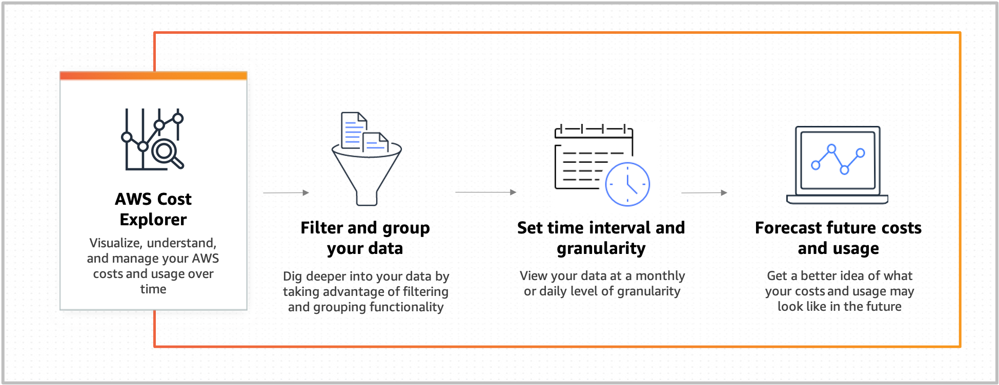
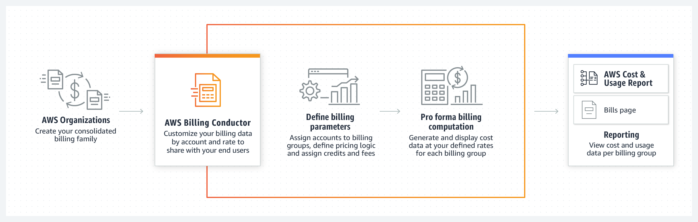
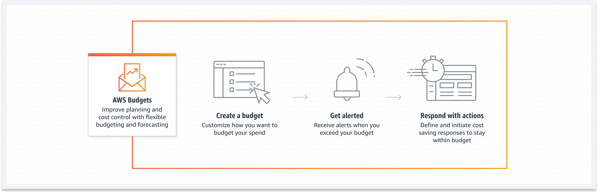
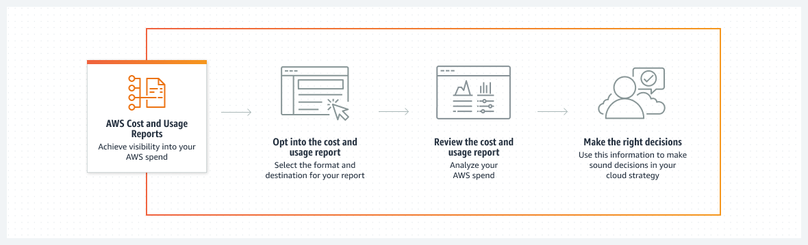
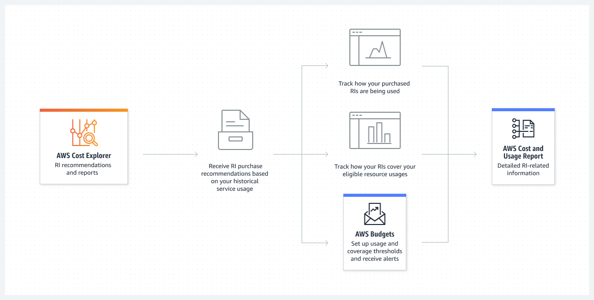
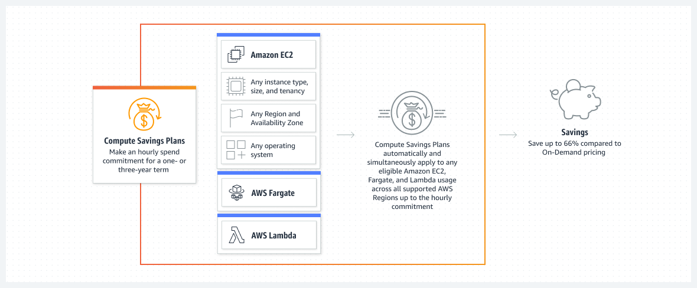
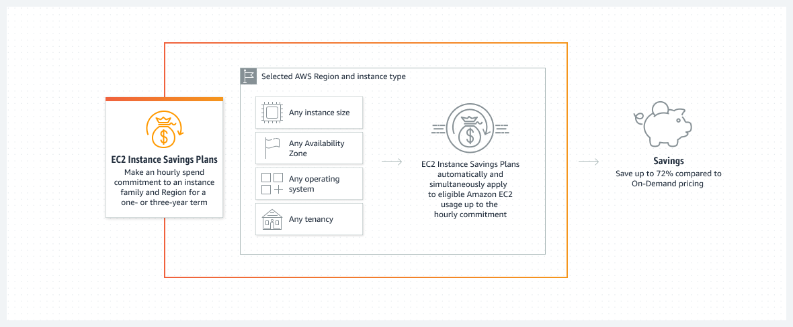
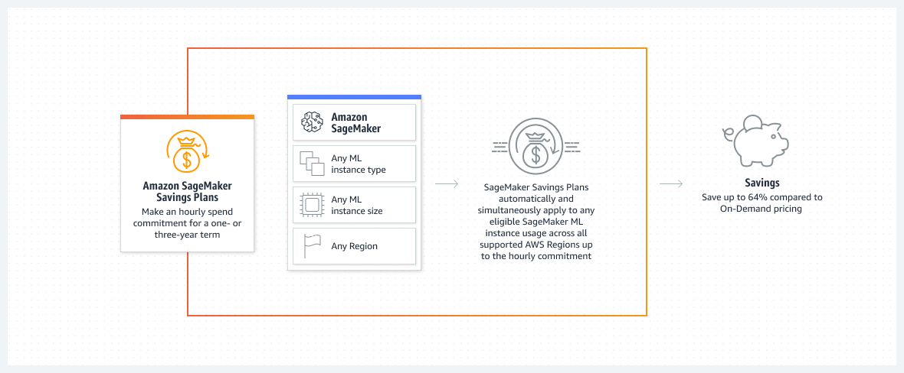

## 클라우드 금융 관리(Cloud Finance Management)

- 최초 작성 일자: 2023-03-20
- 수정 내역:
  - 2023-03-20: 최초 작성

---

### AWS Cost Explorer

- **AWS 비용 및 사용량 분석**
- 시간에 따른 AWS 비용 및 사용량의 시각화, 이해 및 관리

#### 사용 이유

- 사용 및 사용량 정보를 보고 미리 구성된 보기에서 비즈니스 인사이트를 확보한다.
- 필터링 및 그룹화 기능을 사용하여 비용 및 사용량 데이터를 세부적으로 확인한다.
- 보고서에서 미래의 시간 범위에 대한 비용 및 사용량 예측을 생성한다.
- 사용자 지정 보고서를 생성, 저장 및 공유하여 다양한 데이터 세트를 탐색한다.

#### 작동 방식

- 과금 정보 및 비용 관리 콘솔에서 이 절차를 사용하여 계정에서 Cost Explorer를 사용할 수 있으나 API를 사용할 수는 없다.
- Cost Explorer를 사용하도록 설정하면 현재 월 및 지난 12개월에 대한 비용 데이터가 준비되고 향후 12개월에 대한 예측이 계산된다.
- 현재 월의 데이터는 약 24시간 안에 볼 수 있으며 나머지 데이터는 며칠이 더 소요된다.
- Cost Explorer의 비용 데이터는 최소 24시간마다 업데이트된다.

#### 사용 사례

- **사용자 지정 애플리케이션 구축**: AWS Cost Explorer를 제공하는 대화형 임시 분석 엔진에 직접 액세스할 수 있는 이점을 활용할 수 있다. Cost Explorer API를 사용하여 비용 및 사용량 데이터를 프로그래밍 방식으로 쿼리할 수 있다.
- **세분화된 필터링 사용**: 일별 또는 월별 세부 수준으로 AWS 비용과 사용량을 시각화, 이해 및 관리할 수 있다.
- **비용 예측**: 보고서에서 향후 시간 범위를 선택하여 예측을 생성할 수 있다. 예측을 사용하여 AWS 결제 금액을 추정하고 예측을 기반으로 경보 및 예산을 설정할 수 있다.

---

### AWS Billing Conductor

- **요금 및 비용 정보 표시를 사용자 지정하여 결제 및 보고를 간소화**
- 맞춤형 가격 책정 및 비용 가시성을 통해 청구 및 보고 간소화

#### 사용 이유

- 결제 그룹에 계정을 할당하면 결제 기간별로 해당 계정의 비용 및 사용량 데이터를 집계하여 볼 수 있다.
- 필요에 따라 모든 청구 그룹 또는 개별 청구 그룹에 할당할 수 있는 글로벌 및 서비스별 가격 책정 규칙을 만든다.
- 유지 관리하는 각 청구 그룹의 현재 또는 이전 청구 기간에 적용되는 사용자 정의 신용 또는 수수료 라인 항목을 생성한다.
- 지불인 계정 및 청구 그룹의 기본 계정에서 사용할 수 있는 각 청구 그룹에 대한 비용 및 사용 보고서를 생성한다.

#### 작동 방식

- AWS Billing Conductor는 사용자 지정 가능한 결제 서비스로 원하는 비즈니스 구조에 맞게 결제 데이터를 사용자 지정할 수 있다.
- 시작하려면 계정을 상호 배타적인 금융 그룹인 청구 그룹에 매핑한 후, 가격 책정 규칙 및 맞춤 광고 항목과 같은 각 그룹에 대한 청구 매개변수를 정의할 수 있다.
- 각 청구 그룹이 정의되면 청구 콘솔 청구 페이지에서 청구 그룹별로 구성 출력을 볼 수 있을 뿐만 아니라 각 청구 그룹에 대한 비용 및 사용자 보고서 (CUR)를 생성할 수 있다.

#### 사용 사례

- **재정적으로 계정 매핑**: 재무 소유자가 같은 계정을 결제 그룹으로 그룹화하고 필요한 만큼 결제 그룹을 생성한다. 각 결제 그룹에 대해 하나의 계정을 "기본 계정"으로 할당하고, 기본 계정은 교차 계정 가시성을 가지며 전체 그룹에 대한 비용 및 사용 보고서(CUR)를 생성할 수 있다.
- **청구 매개변수 정의**: 최종 고객에게 표시되는 요율을 결정하는 데 함께 사용할 수 있는 글로벌 및 서비스별 가격 정책 규칙을 생성한다. 고정 또는 백분율 기반 계산 방법을 사용하여 계산할 수 있는 할당된 요금 및 크레딧에 대한 사용자 지정 라인 항목을 생성한다.
- **결제 보고서 생성**: 각 결제 그룹에 대한 비용 및 사용 보고서(CUR)를 생성한다. 이 기능은 지불인 계정과 결제 그룹의 기본 계정에서 사용할 수 있다.

---

### AWS Budgets

- **맞춤형 비용 및 사용 예산 설정**
- 유동적인 예산 및 예측 기능을 사용해 계획 및 비용 제어 과정 개선

#### 사용 이유

- 사용자 지정 예산을 통해 비용, 사용량, 적용 범위를 추적할 수 있다.
- 지출 및 리소스 사용에 대한 예측 정보를 계속 제공받을 수 있다.
- 사용자 지정 작업을 생성하여 초과 요금, 비효율적인 리소스 사용 또는 적용 범위 부족을 방지할 수 있다.

#### 작동 방식

- AWS Budgets를 사용하면 사용자 지정 예산을 설정하여 비용 및 사용량을 추적하고, 임계값 초과 시 이메일 또는 SNS 알림에서 수신된 알림에 빠르게 대응할 수 있다.

#### 사용 사례

- **비용 및 사용량 모니터링**: 원하는 예산 기간을 일일, 월간, 분기별 또는 연간으로 설정하고 특정 예산 한도를 생성한다.
- **예약 보고서 생성**: 실제 또는 예측된 비용과 사용량이 예산 임계값에 어떻게 도달하는지에 대한 정보를 파악한다.
- **임계값에 응답**: 예산 목표를 초과할 때 자동으로 실행되거나 승인 프로세스를 통해 실행되도록 사용자 지정 작업을 설정한다.

---

### AWS Cost & Usage Report

- **포괄적인 비용 및 사용량 정보에 액세스**
- AWS 비용 및 사용량 데이터에 대해 자세히 알아보기

#### 사용 이유

- 리소스 수준에서 비용 요인을 파악하고 비용 최적화 기회를 식별한다.
- 자체 AWS Cost Categories 및 비용 할당 태그를 사용하여 비용 및 사용량 데이터를 정리한다.
- 결제 보고서를 작성하고 게시하여 클라우드 비용 내역을 분류한다.
- AWS 비용에 대한 인사이트를 얻고 지출 항목과 관련된 질문에 대한 답을 찾는다.

#### 작동 방식

- AWS Cost & Usage Report(CUR)를 사용하면 계정에 대한 가장 포괄적인 비용 및 사용량 데이터를 검토하고 항목화하며 정리할 수 있다.

#### 사용 사례

- **절감형 플랜 사용 추적**: 관련 요금을 분할 상환하고 조직의 보고 요구 사항에 따라 내부 비용 할당을 계산한다.
- **다른 분석 서비스와의 통합**: 데이터를 통합하여 비용 및 사용량 정보를 쿼리하거나 다른 AWS 서비스를 사용하여 심층 데이터 분석을 수행한다.
- **비용 이상 파악**: 결제 금액이 예상보다 높거나 낮은 경우 비용을 보다 자세히 분석한다.
- **결제 추세 파악**: 비용 및 사용량 보고서를 쿼리하여 예기치 않은 추세의 근본 원인을 분석하고 즉각적인 조치를 취한다.

---

### Reserved Instance Report(예약형 인스턴스 보고)

- **예약 인스턴스(RI) 심층 분석**
- 인스턴스 예약 관리 및 모니터링

#### 사용 이유

- 예약형 인스턴스(RI)에 적용 되는 특정 AWS 서비스, 가격, 태깅 기타 정보를 살펴볼 수 있다.
- 예약 Amazon 리소스 이름(ARN)과 예약 수 및 예약당 단위 수를 평가할 수 있다.
- 퍼블릭 온디맨드 요금과 부과된 요금의 차액을 계산하여 절감되는 비용을 수치화할 수 있다.
- 특정 예약의 이점을 얻을 수 있는 AWS 인스턴스를 추적하고 RI 할인 공유 기본 설정을 사용자 지정하는 방법에 대해 알아볼 수 있다.

#### 작동 방식

- RI 보고를 사용하면 사용자 지정 RI 사용량 및 적용 범위 대상을 설정하고, 목표를 얼마나 잘 따라가고 있는지 시각화하며, 온디맨드 요금 대비 절감액과 관련된 정보에 액세스할 수 있다.

#### 사용 사례

- **RI 구매 추천 액세스**: AWS Cost Explorer를 사용하여 과거 사용을 기반으로 컨텍스트 인식 추천에 액세스하고 잠재적인 절감 기회를 찾는다.
- **RI 이해**: AWS 비용 및 사용 보고서를 사용자 지정하여 일일 및 월간 수준의 자세한 데이터를 수집한다.
- **RI 사용량 및 적용 범위 알림 수신**: 사용자 지정 RI 사용량 또는 적용 범위 목표를 지정하고 정의된 임계값 밑으로 떨어지면 알림을 받는다.

---

### Savings Plans

- **유연한 요금으로 컴퓨팅 사용량에 따른 비용 72% 절감**

#### 사용 이유

- 온디맨드 가격에 비해 최대 72%의 상당한 비용 절감을 할 수 있다.
- Savings Plans가 적절한 AWS 사용량에 자동으로 동시에 적용되므로 청구 금액을 쉽게 줄일 수 있다.
- 계속 절약하면서 최신 인스턴스 패밀리, 세대 및 리전을 사용하여 더 빠르게 혁신할 수 있다.
- AWS Cost Explorer Savings Plans 권장 사항에 따라 비용 절감을 극대화할 수 있다.

#### 작동 방식

- Savings Plans는 1년 또는 3년 시간당 지출 약정을 체결하는 것을 조건으로 온디맨드 가격 대비 결제 금액을 최대 72% 줄일 수 있는 유연한 요금 모델이다.
- AWS는 컴퓨팅 절감형 플랜, EC2 인스턴스 절감형 플랜 및 Amazon SageMaker 절감형 플랜과 같은 3가지 절감형 플랜을 제공한다.

- **컴퓨팅 Savings Plans**

- **EC2 인스턴스 Savings Plans**

- **SageMaker Savings Plans**

#### 사용 사례

- **안정적인 사용에 대한 비용 절감**: 인스턴스 제품군, 리전, 운영 체제 및 데넌시와 관계없이 전반적인 안정적인 사용에 대한 컴퓨팅 요금을 줄인다.
- **워크로드를 현대화하여 비용 절감**: 워크로드를 최신 인스턴스로 마이크레이션하거나 AWS Lambda 및 AWS Fargate로 애플리케이션을 현대화할 때 비용을 최적화할 수 있다.
- **비용 관리 중앙 집중화 및 간소화**: 하나의 AWS 계정에서 Savings Plans를 구매하면 AWS가 이를 AWS 조직 전체에 자동으로 적용한다.

---

### 참고한 자료

- [AWS Cost Explorer](https://aws.amazon.com/ko/aws-cost-management/aws-cost-explorer/?nc2=h_ql_prod_cm_cex)
- [AWS Billing Conductor](https://aws.amazon.com/ko/aws-cost-management/aws-billing-conductor/?nc2=h_ql_prod_cm_bc)
- [AWS Budgets](https://aws.amazon.com/ko/aws-cost-management/aws-budgets/?nc2=h_ql_prod_cm_bud)
- [AWS Cost & Usage Report(CUR)](https://aws.amazon.com/ko/aws-cost-management/aws-cost-and-usage-reporting/?nc2=h_ql_prod_cm_cur)
- [RI Report](https://aws.amazon.com/ko/aws-cost-management/reserved-instance-reporting/?nc2=h_ql_prod_cm_rir)
- [Savings Plans](https://aws.amazon.com/ko/savingsplans/?nc2=h_ql_prod_cm_sav)