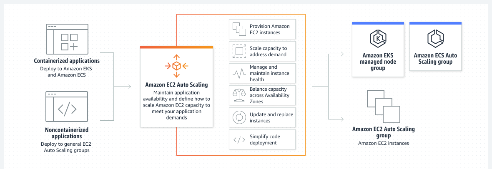
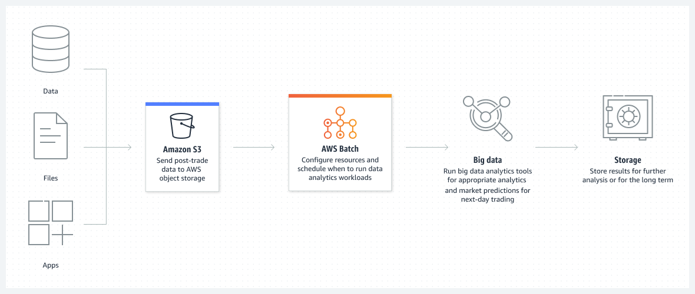
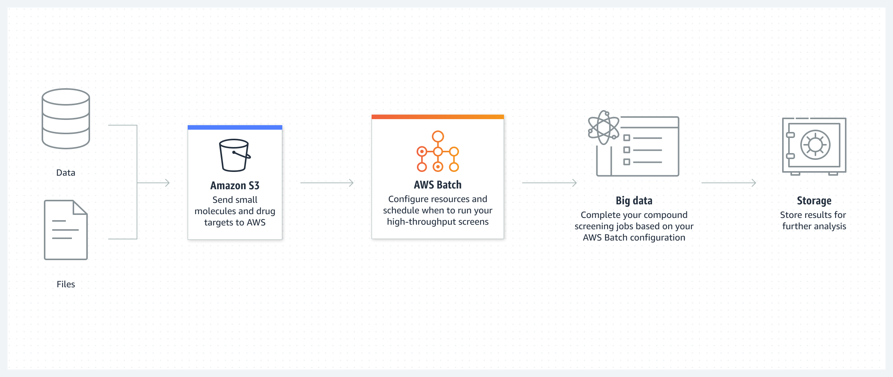
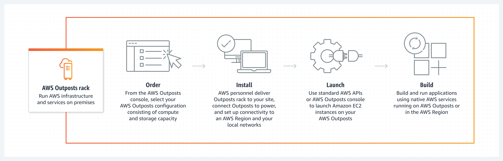
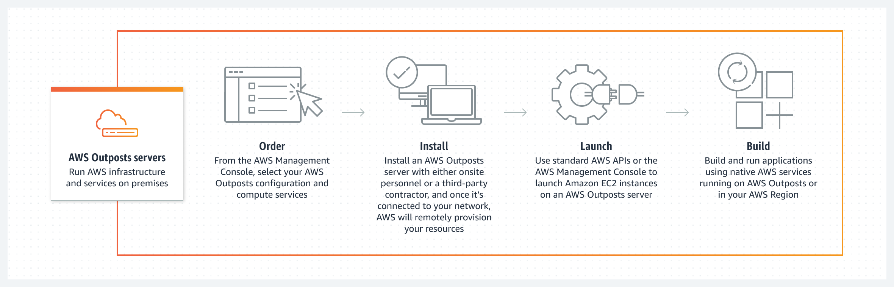
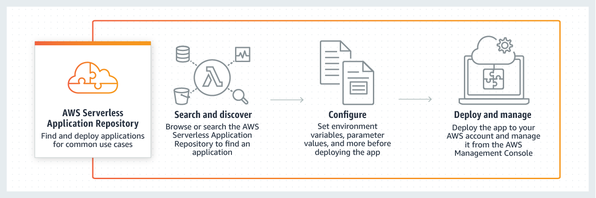
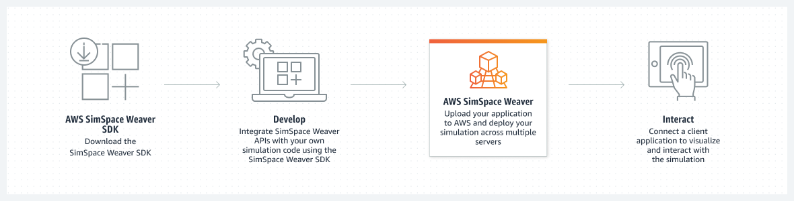
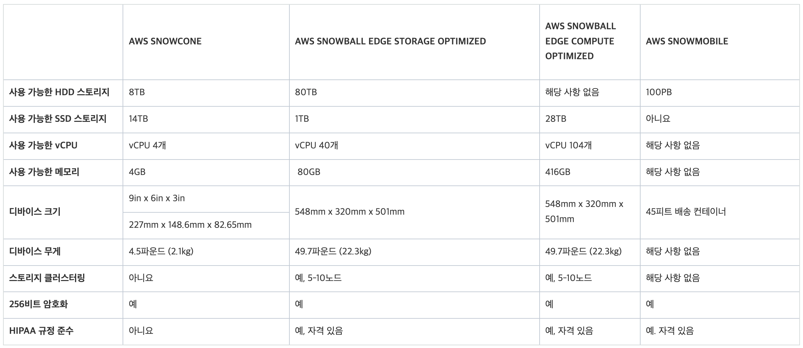
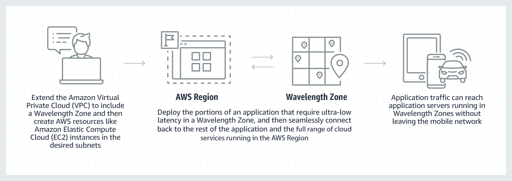
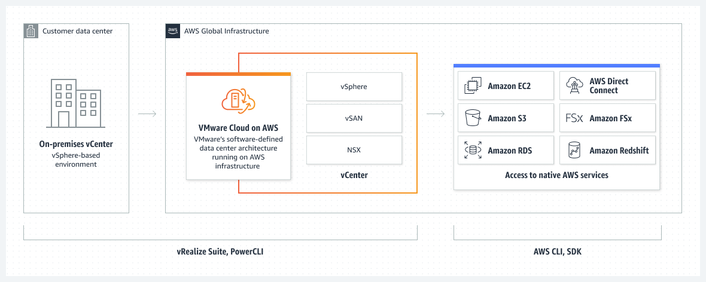

## 컴퓨팅(Computing)

- 최초 작성 일자: 2023-03-20
- 수정 내역:
  - 2023-03-20: 최초 작성

---

### Amazon EC2

- **클라우드의 가상 서버**
- 거의 모든 워크로드에 적합한 안전하고 크기 조정 가능한 컴퓨팅 용량
- Amazon EC2는 500개가 넘는 인스턴스, 그리고 최신 프로세서, 스토리지, 네트워킹, 운영 체제 및 구매 모델의 옵션과 함께 워크로드의 요구 사항에 가장 잘 부합할 수 있도록 가장 포괄적이고 심층적인 컴퓨팅 플랫폼을 제공한다.
- AWS는 인텔, AMD 및 Arm 프로세서를 지원하는 최초의 주요 클라우드 공급자이며, 온디맨드 EC2 Mac 인스턴스를 지원하는 유일한 클라우드이자, 400Gbps 이더넷 네트워킹을 지원하는 유일한 클라우드다.
- AWS는 기계 학습 훈련에 대한 최상의 가격 대비 성능은 물론, 클라우드에서 추론 인스턴스당 가장 저렴한 요금을 제공한다.

#### 사용 이유

- 안정적인 확장 가능한 인프라에 온디맨드로 액세스한다. 99.99%의 가용성을 지원하는 SLA 약정을 기반으로 몇 분 안에 용량 크기를 조정한다.
- 애플리케이션을 위한 안전한 컴퓨팅을 제공한다. 보안은 AWS Nitro System에서 Amazon EC2를 기반으로 구축된다.
- AWS Graviton 기반 인스턴스, Amazon EC2 스팟 인스턴스 및 AWS Savings Plans와 같은 유연한 옵션을 통해 성능과 비용을 최적화한다.
- AWS Migration Tools, AWS Managed Services 또는 Amazon Lightsail을 사용하여 간편하게 앱을 마이그레이션하고 구축한다. 

#### 사용 사례

- **클라우드 네이티브 및 엔터프라이즈 애플리케이션 실행**: Amazon EC2는 까다로운 비즈니스 요구 사항을 충족하기 위해 안전하고 안정적이며 비용 효율적인 고성능 컴퓨팅 인프라를 제공한다.
- **HPC 애플리케이션을 위한 크기 조정**: HPC 애플리케이션을 보다 빠르고 비용 효율적으로 실행하는 데 필요한 온디맨드 인프라와 용량에 액세스한다.
- **Apple 플랫폼을 위한 개발**: 온디맨드 macOS 워크로드를 구축하고 테스트하며 서명한다. 몇 분 안에 환경에 액세스하고 필요한 만큼 동적으로 용량을 조정하며 AWS의 종량제 요금 혜택을 누릴 수 있다.
- **기계 학습 애플리케이션 훈련 및 배포**: Amazon EC2는 기계 학습 프로젝트를 위해 가격 대비 성능을 최적화하도록 특별히 구축된 컴퓨팅, 네트워킹(최대 400Gbps) 및 스토리지 서비스에 대한 가장 포괄적인 옵션을 제공한다.

---

### Amazon EC2 Auto Scaling

- **수요에 맞춰 컴퓨팅 용량 조정**
- 변화하는 수요를 충족하기 위해 컴퓨팅 용량 추가 또는 제거

#### 사용 이유

- 비정상 인스턴스의 자동 감지 및 교체를 통해 내결함성을 개선한다.
- 적절한 양의 컴퓨팅 용량으로 예측 또는 동적 조정 정책으로 가용성을 높인다.
- 구매 옵션과 인스턴스 유형을 결합하여 워크로드 성능과 비용을 최적화한다.
- 인스턴스 새로 고침으로 구성 변경 및 애플리케이션 배포의 복잡성을 줄인다.

#### 작동 방식

- Amazon EC2 Auto Scaling은 애플리케이션 가용성을 유지하는 데 도움이 되며 정의한 조정 정책을 사용하여 EC2 인스턴스를 자동으로 추가하거나 제거할 수 있다.
- 동적 또는 예측 조정 정책을 사용하면 기존 또는 실시간 수요 패턴을 서비스하기 위해 EC2 인스턴스 용량을 추가하거나 제거할 수 있다.
- Amazon EC2 Auto Scaling의 플릿 관리 기능은 플릿의 상태와 가용성을 유지하는 데 도움이 된다.

#### 사용 사례

- **애플리케이션 확장 일정 잡기**: 이전 트래픽 패턴을 사용하여 알려진 로드 변경 전에 애플리케이션 확장을 결정한다.
- **수동 프로비저닝 감소**: Amazon EC2 용량을 미리 프로비저닝할 필요가 없도록 애플리케이션 수요 곡선을 따를 수 있다.
- **머신 러닝으로 변화 예측**: 머신 러닝을 사용하여 다가오는 트래픽 변화를 예측하기 위해 적절한 수의 EC2 인스턴스를 예측하고 예약한다.

---

### Amazon Lightsail

- **가상 프라이빗 서버 시작 및 관리**
- 저렴한 비용의 사전 구성된 클라우드 리소스를 통해 애플리케이션 및 웹 사이트를 빠르게 구축
- Amazon Lightsail은 사용하기 쉬운 가상 프라이빗 서버(VPS) 인스턴스, 컨테이너, 스토리지, 데이터베이스 등을 비용 효율적인 월별 가격으로 제공한다.

#### 사용 이유

- 몇 번의 클릭으로 웹 사이트 또는 애플리케이션 생성 네트워킹, 액세스 및 보안 환경을 자동으로 구성한다.
- 규모가 커질 때 쉽게 확장하거나 Amazon EC2와 같은 보다 큰 AWS 에코시스템으로 리소스를 마이그레이션한다.
- 세계적으로 뛰어난 클라우드 플랫폼의 보안과 안정성을 활용한다.

#### 사용 사례

- **간단한 웹 애플리케이션 시작**: LAMP, Nginx, MEAN, Node.js와 같은 사전 구성된 개발 스택을 사용하여 쉽고 빠르게 온라인에서 지원한다.
- **사용자 지정 웹 사이트 생성**: WordPress, Magento, Prestashop, Joomla와 같은 사전 구성된 애플리케이션을 통해 단 몇 번의 클릭으로 블로그, 전자상거래 또는 개인 웹 사이트를 구축한다.
- **소규모 비즈니스 애플리케이션 구축**: 파일 스토리지 및 공유, 백업, 재무 및 회계 소프트웨어 등과 같은 비즈니스용 소프트웨어를 시작할 수 있다.
- **테스트 환경 구동**: 새로운 아이디어를 위험 부담 없이 실현할 수 있는 테스트 환경과 개발 샌드박스를 쉽게 생성하고 삭제할 수 있다.

---

### AWS App Runner

- **컨테이너식 웹 앱의 대규모 구축 및 실행**
- 컨테이너화된 웹 애플리케이션 및 API를 대규모로 배포

#### 사용 이유

- 컨테이너나 인프라에 대한 경험이 없어도 대규모로 안전한 웹 애플리케이션을 구축하고 실행할 수 있다.
- 고가용성과 낮은 지연으로 애플리케이션 비용을 효과적으로 조정할 수 있다.
- 애플리케이션에 집중하면서도 인프라 및 규정 준수 요구 사항을 충족할 수 있다.
- 애플리케이션을 지원하는 AWS에서 데이터베이스, 캐시 및 메시지 대기열 서비스에 연결할 수 있다.

#### 작동 방식

- AWS App Runner는 인프라나 컨테이너와 관련한 경험이 없더라도 컨테이너화된 웹 애플리케이션과 API 서비스를 구축, 배포 및 실행할 수 있는 완전관리형 컨테이너 애플리케이션 서비스다.

#### 사용 사례

- **프론트엔드 및 백엔드 애플리케이션 구축**: App Runner를 사용하여 API 서비스, 백엔드 웹 서비스, 웹 사이트 등을 구축하고 실행한다.
- **수천 개의 마이크로서비스를 동시에 실행**: 애플리케이션의 각 구성 요소를 유연하게 확장하여 애플리케이션 복원력에 대한 리스크를 줄이고 민첩한 혁신을 증진한다.
- **출시 기간 단축**: AWS의 모범 사례와 기술을 사용하여 컨테이너화된 웹 애플리케이션을 대규모로 배포 및 실행함으로써 출시 기간을 크게 단축한다.

---

### AWS Batch

- **규모와 상관없이 배치 작업 실행**
- 대규모 배치 처리, ML 모델 훈련 및 분석
- Amazon ECS, Amazon EKS, AWS Fargate 및 스팟 또는 온드맨드 인스턴스와 같은 다양한 AWS 컴퓨팅 제품 및 서비스를 통해 컨테이너화된 배치 또는 ML 워크로드를 계획, 예약, 실행하는 완전관리형 배치 컴퓨팅 서비스다.

#### 사용 이유

- 소프트웨어 또는 서버를 설치하지 않고도 수십만 건의 배치 및 기계 학습 컴퓨팅 작업을 실행할 수 있다.
- 기본적으로 AWS와 통합하여 확장, 네트워킹, 관리 기능을 구현할 수 있다.
- 볼륨 및 리소스 요구 사항에 따라 컴퓨팅 작업 분배를 최적화하여 비용을 절감할 수 있다.
- 대규모 처리 및 시뮬레이션을 지원하는 완전관리형 인프라를 통해 컴퓨팅 리소스를 자동으로 확장할 수 있다.

#### 작동 방식

- AWS Batch를 사용하면 개발자, 과학자, 엔지니어가 수십만 개의 배치 및 기계 학습 컴퓨팅 작업을 효율적으로 실행하면서 컴퓨팅 리소스를 최적화하여 결과 분석 및 문제 해결에 집중할 수 있다.
- **금융 서비스**

- **생명 과학**

- **디지털 미디어**

#### 사용 사례

- **금융 서비스 분석 실행**: 1일 거래 비용, 완료 보고 및 시장 성과에 대한 분석을 자동화한다.
- **약물 및 게놈 서열 스크리닝**: 약물 설계를 위한 더 나은 데이터를 캡처하기 위해 저분자 라이브러리를 빠르게 검색한다.
- **시각 효과 렌더링**: 콘텐츠 렌더링 워크로드를 자동화하여 의존성에 따른 인력의 개입 필요성을 최소화한다.
- **기계 학습 모델 훈련**: 모든 규모에서 컴퓨팅 집약적인 ML 모델 훈련 및 추론을 효율적으로 실행한다.

---

### AWS Elastic Beanstalk

- **웹 앱 실행 및 관리**
- 웹 애플리케이션 배포 및 크기 조정
- 코드를 업로드하면 Elastic Beanstalk가 용량 프로비저닝, 로드 밸런싱, 자동 조정부터 시작하여 애플리케이션 상태 모니터링에 이르기까지 배포를 자동으로 처리한다.

#### 사용 이유

- 간단하고 빠른 방법으로 웹 애플리케이션을 업데이트 및 배포할 수 있다.
- 인프라 프로비저닝 및 관리 대신 코드 작성에 집중할 수 있다.
- 애플리케이션을 강화하기 위한 최적의 AWS 리소스를 선택하고 완벽하게 제어할 수 있다.
- 트래픽 급증을 처리하기 위해 조정 가능한 설정을 사용하여 비용을 최소화하는 동시에 애플리케이션의 크기를 조정할 수 있다.

#### 작동 방식

- AWS Elastic Beanstalk는 웹 애플리케이션을 배포하여 비즈니스에 집중할 수 있도록 한다.

#### 사용 사례

- **신속하게 웹 애플리케이션 출시**: 기본 인프라를 프로비저닝하고 관리하는 복잡성 없이 몇 분만에 확장 가능한 웹 애플리케이션을 배포할 수 있다.
- **애플리케이션을 위한 모바일 API 백엔드 생성**: 선호하는 프로그래밍 언어를 사용하여 모바일 API 백엔드를 구축하면 Elastic Beanstalk가 패치와 업데이트를 관리한다.
- **중요한 비즈니스 애플리케이션 리플랫포밍**: 상태 유지 애플리케이션을 레거시 인프라에서 Elastic Beanstalk로 마이그레이션하고 프라이빗 네트워크에 안전하게 연결한다.

---

### AWS Lambda

- **서버에 대한 걱정 없이 코드 실행**
- 서버 또는 클러스터에 대한 걱정 없이 코드 실행

#### 사용 이유

- 인프라를 프로비저닝하거나 관리하지 않고 코드를 실행한다. zip 파일 또는 컨테이너 이미지로 코드를 작성하고 업로드하면 된다.
- 하루에 수십 개의 이벤트에서 초당 수십만 개에 이르기까지 어떤 규모에서든 코드 실행 요청에 자동으로 응답한다.
- 피크 용량에 대해 사전에 인프라를 프로비저닝하는 대신, 밀리초 기준으로 사용하는 컴퓨팅 시간에 대해서만 요금을 지불하여 비용을 절감한다.
- 올바른 함수 메모리 크기로 코드 실행 시간 및 성능을 최적화한다. 프로비저닝된 동시성으로 두자리수 밀리초 단위에서 높은 수요에 응답한다.

#### 작동 방식

- AWS Lambda는 서버를 프로비저닝 또는 관리하지 않고도 실제로 모든 유형의 애플리케이션 또는 백엔드 서비스에 대한 코드를 실행할 수 있는 이벤트 중심의 서버리스 컴퓨팅 서비스다.
- 200개가 넘는 AWS 서비스와 서비스형 소프트웨어(SaaS) 애플리케이션에서 Lambda를 트리거할 수 있으면 사용한 만큼만 지불하면 된다.

- **파일 처리**

- **스트림 처리**

- **웹 애플리케이션**

- **IoT 백엔드**

- **모바일 백엔드**

#### 사용 사례

- **대규모 데이터 처리**: 필요하면 필요한 용량으로 코드를 실행한다. 자동으로 데이터 볼륨과 일치하도록 크기를 조정하고 사용자 지정 이벤트 트리거를 지원한다.
- **대화영 웹 및 모바일 백엔드 실행**: AWS Lambda를 다른 AWS 서비스와 결합하여 안전하고 안정적이며 확장 가능한 온라인 경험을 생성한다.
- **강력한 기계 학습 인사이트 지원**: 기계 학습(ML) 모델에 제공하기 전에 데이터를 전처리한다. Amazon Elastic File System(EFS) 액세스와 함께 AWS Lambda는 크기 조정을 간소화하기 위해 인프라 관리 및 프로비저닝을 처리한다.
- **이벤트 중심의 애플리케이션 생성**: 분리된 서비스 사이에서 손쉬운 통신을 위해 이벤트 중심의 함수를 구축한다. 프키 수요 기간에 리소스 충돌이나 과도한 프로비저닝 없이도 애플리케이션을 실행하여 비용을 절감한다.

---

### AWS Outposts 패밀리

- **AWS 인프라를 온프레미스에서 실행**
- 진정으로 일관된 하이브리드 환경을 위해 온프레미스에서 AWS 인프라 및 서비스 실행
- AWS Outposts는 하이브리드 환경을 위해 거의 모든 온프레미스 또는 엣지 로케이션에 AWS 인프라 및 서비스를 제공하는 완전관리형 솔루션 패밀리다.
- Outposts 솔루션을 통해 온프레미스에서 기본 AWS 서비스를 확장하고 실행할 수 있으며 1U 및 2U Outposts 서버에서 42U Outposts 랙 및 다중 랙 배포에 이르기까지 다양한 폼 팩터에서 Outposts 솔루션을 사용할 수 있다.
- AWS Outposts를 사용하면 일부 AWS 서비스를 로컬에서 실행하고 로컬 AWS 리전에서 사용 가능한 광범위한 서비스에 연결할 수 있다.

#### 사용 이유

- **온프레미스에서 AWS 서비스 실행**: 짧은 대기 시간, 로컬 데이터 처리 및 데이터 레지던시 요구 사항 충족을 위해 온프레미스에서 AWS 컴퓨팅, 네트워킹, 보안 및 기타 서비스를 확장할 수 있다.
- **완전관리형 인프라**: 완전관리형 환경을 통해 IT 인프라를 관리하는 데 필요한 시간, 리소스, 운영 위험 및 유지 관리를 위한 가동 중단 시간을 줄일 수 있다.
- **진정으로 일관된 하이브리드 환경**: 클라우드에서 사용 가능한 동일한 하드웨어 인프라, API, 도구 및 관리 제어를 사용하여 진정으로 일관된 개발자 및 IT 운영 경험을 제공할 수 있다.

#### 사용 사례

- **대기 시간이 짧은 컴퓨팅**: 실시간 멀티플레이어 게임과 같은 대화형 애플리케이션을 위한 고품질 게임 경험을 전 세계 플레이어에게 제공한다. 가장 가까운 퍼블릭 클라우드 서버가 한 자릿수 밀리초 대기 시간 요구 사항을 충족할 만큼 충분히 가깝지 않은 경우 AWS Outposts는 제조 실행 시스템(EMS), 고주파 거래 또는 의료 진단에 필요한 비즈니스 애플리케이션을 실행할 수 있다.
- **데이터 레지던시**: 규제, 계약 또는 정보 보안상의 이유로 데이터가 특정 국가, 주 또는 지방 자치 단체에 남아 있어야 하는 경우가 있다. 대개 금융 서비스, 의료, 석유 및 가스, 기타 규제가 엄격한 산업이 그렇다. AWS Outposts를 사용하면 클라우드와 엣지 로케이션 간의 마찰이 적은 이동으로 워크로드가 실행되는 위치와 데이터가 상주하는 위치를 제어하여 규제 변화에 쉽게 적응할 수 있다.
- **마이그레이션 및 현대화**: 레거시 온프레미스 애플리케이션에는 대기 시간에 민감한 시스템 종속성이 있어 마이그레이션하기 어려운 경우가 많다. AWS Outposts를 사용하면 마이그레이션을 온프레미스에서 더 작은 조각으로 분할하여 마이그레이션할 준비가 될 때까지 애플리케이션 구성 요소 간의 대기 시간에 민감한 연결을 유지할 수 있다.
- **로컬 데이터 처리**: 데이터 레이크 및 기계 학습 모델 훈련과 같은 사용 사례를 위해 로컬에서 데이터를 처리하거나, 일관된 하이브리드 아키텍처를 설정하여 비용, 크기 또는 대역폭 제약이 있는 마이그레이션하기 어려운 로컬 데이터 집합을 처리하고 장기 보관을 위해 데이터를 클라우드로 이동할 수 있다.

---

### AWS Outposts Rack

- **AWS 인프라, 서비스, API 및 도구를 거의 모든 온프레미스 데이터 센터로 가져온다.**

#### 사용 이유

- 완전관리형 AWS 인프라 및 서비스를 온프레미스 환경에서 사용할 수 있다.
- 진정으로 일관된 하이브리드 환경을 위해 한 번 작성하고 어디에나 배포할 수 있다.
- 규제상의 이유로 온프레미스에 유지해야 하는 고객 데이터를 안전하게 저장하고 처리할 수 있다.
- IT 인프라 관리에 필요한 시간, 리소스, 운영 위험 및 유지 관리 중단 시간을 줄일 수 있다.

#### 작동 방식

- AWS Outposts Rack은 진정으로 일관된 하이브리드 환경을 위해 온프레미스에서 AWS 인프라, 서비스, API 및 도구를 확장하는 완전관리형 서비스다.

#### 사용 사례

- **대기 시간이 짧은 컴퓨팅 제공**: 필요한 곳에서 애플리케이션을 실행한다. MES(제조 실행 시스템), 고주파 거래, 의료 진단과 같은 온프레미스 애플리케이션에 대해 한 자릿수 밀리초 지연 시간을 제공한다.
- **데이터 상주 요구 사항을 충족하기 위해 데이터를 로컬에 안전하게 저장**: 애플리케이션이 실행되는 위치와 데이터가 상주하는 위치를 제어한다. 법적, 산업 또는 계약 요구 사항을 충족하기 위해 온프레미스에서 데이터 제어를 유지한다.
- **로컬에서 데이터 처리**: 비용, 크기, 대역폭 또는 타이밍 제약으로 인해 온프레미스에서 데이터를 처리하도록 일관된 하이브리드 클라우드 아키텍처를 설정한다.
- **쉽고 빠른 클라우드 마이그레이션**: 로컬 시스템 상호 종속성이 있는 애플리케이션 또는 데이터 레지던시 요구 사항이 있는 애플리케이션의 온프레미스 하이브리드 클라우드 마이그레이션을 지원한다.

---

### AWS Outposts Server

- **공간이 제한되어 있거나 용량 요구 사항이 작은 위치에서 AWS Outposts를 실행**

#### 사용 이유

- 랙 장착 가능한 완전관리형 서버를 공간 제약이 있는 위치에 배포할 수 있다.
- 짧은 대기 시간, 로컬 데이터 처리 또는 데이터 레지던시가 필요한 혁신적인 애플리케이션을 제공할 수 있다.
- 동일한 AWS 인프라, 서비스, API, 도구를 사용해 애플리케이션을 실행하여 진정으로 일관된 하이브리드 환경을 제공할 수 있다.

#### 작동 방식

- AWS Outposts Server는 공간과 용량이 제약된 위치에 컴퓨팅 및 네트워킹 서비스를 제공한다.

#### 사용 사례

- **제조 운영 성능 개선**: 지연 시간이 짧은 컴퓨팅, AWS IoT, 기계 학습 서비스를 활용하여 제조 오류를 줄인다.
- **소매점에서 인사이트 탐색**: 소매점에서 지연 시간이 짧은 판매 시스템을 실행하여 매장 운영에 대한 실시간 분석을 수행한다.
- **차세대 무선 네트워크 지원**: 지연 시간이 짧은 고성능 5G 네트워크를 관리, 업데이트, 확장한다.
- **의료 진단 가속화**: 실시간 장비 데이터를 분석하고 ML 추론을 활용하여 환자 모니터링 장치에서 추세 및 상태를 식별한다.

---

### AWS Serverless Application Repository

- **서버리스 애플리케이션 검색, 배포 및 게시**
- 서버리스 애플리케이션용 관리형 리포지토리.
- 팀, 조직 및 개인 개발자는 재사용 가능한 애플리케이션을 저장 및 공유하고, 강력하고 새로운 방식을 통해 서버리스 아키텍처를 손쉽게 어셈블 및 배포할 수 있다.
- 서버리스 아키텍처의 Serverless Application Repository로부터 사전 빌드된 애플리케이션을 활용할 수 있으며, 이를 통해 팀의 중복된 작업을 줄이고, 조직의 모범 사례를 보장하고, 출시 시간을 단축하는 데 도움이 된다.

#### 사용 이유

- **더욱 강력한 앱 개발**: 강력하고 새로운 방식으로 서버리스 아키텍처를 빠르게 어셈블한다. 재사용 가능한 서버리스 애플리케이션 패턴을 검색 및 공유하고, 간소화된 구문을 사용하여 새로운 서버리스 아키텍처를 구성한다.
- **손쉬운 애플리케이션 관리**: 서버리스 배포에 사전 빌드된 애플리케이션을 사용하여 배포 전에 소스 코드를 AWS에 복제, 빌드, 패키징 및 게시할 필요가 없다.
- **다시 빌드하지 않고 재사용**: 서버리스 애플리케이션을 개발 및 게시하고 나면 이를 Serverless Application Repository에 저장하고, 팀 또는 더 큰 단위의 커뮤니티 사이에서 비공개적으로 사용하여 중복되는 작업을 줄이고 개발 워크플로를 가속화한다.
- **모범 사례 보장**: 일반 사용 사례에 대한 서버리스 애플리케이션을 찾고 배포한다. 

#### 작동 방식: 애플리케이션 배포

---

### AWS SimSpace Weaver

- **AWS 관리형 인프라에서 동적인 대규모 공간 시뮬레이션 구축**

#### 사용 이유

- 도시 단위의 대규모 3D 시뮬레이션으로 실제로 어떤 결과가 나올지 미리 파악하고 몰입형 환경을 시각화한다.
- 시뮬레이션의 개체 크기, 복잡성 및 개수를 늘리고 SimSpace Weaver에서 제공하는 완전 관리형 인스턴스에 배포한다.
- 여러 서버에서 데이터 관리, 복제 및 시간 동기화와 관련하여 시간이 오래 걸리는 작업을 피할 수 있다.
- Unreal Engine, Unity등 인기 있는 개발 툴킷 및 시뮬레이션 엔진을 사용해 매끄럽게 통합할 수 있다.

#### 작동 방식

- AWS SimSpace Weaver는 복잡성과 확장성이 개선된 광범위한 시뮬레이션 환경을 구축할 수 있는 관리형 서비스다.
- 여러 Amazon EC2 인스턴스에서 기반 컴퓨팅, 메모리 또는 네트워킹을 관리하므로, 시뮬레이션 구축에 집중하고 온프레미스 솔루션에 비해 비용을 크게 절감할 수 있다.

#### 사용 사례

- **대규모 군중 시뮬레이션**: 전형적인 실제 환경을 보여주는 가상 환경에서 고유한 행동 모델을 사용하여 수백만 개의 동적 엔티티를 생성한다.
- **도시 규모의 환경 재창조**: 전체 도시 또는 국가의 트래픽 패턴, 대중 교통망 또는 공급망 인프라를 시뮬레이션한다.
-**몰입형 대화식 경험 창출**: 여러 사용자가 공유할 수 있는 몰입형 대화식 교육 환경을 구축하여 실제 시나리오에 대응할 수 있도록 팀을 교육한다.

---

### AWS Snow Family

- **엣지 로케이션에서 데이터를 집계 및 처리한 후 AWS로 전송하는 물리적 디바이스**
- 페타바이트급 데이터를 AWS로 이전하거나 엣지에서 데이터를 처리

#### 사용 이유

- 페타바이트급 데이터를 오프라인에서 비용 효율적으로 이전할 수 있도록 구축된 디바이스다. Snow 디바이스를 대여하여 데이터를 클라우드로 이전할 수 있다.
- 극한의 조건에서 현장 테스트를 마쳤으며 탁월한 보안 및 견고함을 갖춘 컴퓨팅 및 스토리지 호환 디바이스다.
- 다양한 디바이스 옵션 중에서 공간 또는 중량 제한이 있는 환경, 이동성 및 유연한 네트워킹 옵션에 최적화된 디바이스를 선택할 수 있다.

#### 표준 주요 기능

- **간편한 관리 및 모니터링**: AWS OpsHub라는 보조 그래픽 사용자 인터페이스(GUI)를 사용하여 Snow 디바이스를 손쉽게 설정하고 관리할 수 있다.
- **NFS 엔드포인트**: 애플리케이션은 NFS 탑재 지점으로서 Snow 패밀리 디바이스와 연동될 수 있다.
- **온보드 컴퓨팅**: Snow Family 디바이스에는 엣지에서 데이터를 수집 및 처리하는 컴퓨팅 리소스가 있다. 디바이스는 Amazon EC2, AWS IoT Greengrass, Amazon EKS Anywhere 배포를 지원할 수 있다.
- **암호화**: AWS Key Management Service(KMS)에서 관리하는 256비트 암호화 키를 사용해 자동으로 암호화한다.
- **변조 방지 및 변조 추적**: 하드웨어 신뢰 루트를 제공하는 신뢰 플랫폼 모듈(TPM)이 탑제되어, 사용된 각 디바이스는 항상 검사되므로 디바이스의 무결성이 보장되고 데이터의 기밀성이 보호된다.
- **엔드 투 엔드 추적**: 각 디바이스에는 E 잉크 배송 레이블이 부착되어 있다. Amazon SNS, 텍스트 메시지 및 AWS 콘솔을 통해 반환 시 간편하게 추적하고 레이블을 자동으로 업데이트할 수 있다.
- **안전한 삭제**: 데이터 마이그레이션 작업이 완료되고 확인되면 AWS가 미디어 삭제에 대한 NIST(National Insitute of Standards and Technology) 지침에 따라 디바이스의 소프트웨어 삭제를 수행한다.

#### 서비스 모델

- **AWS Snowcone**: 휴대가 가능한 가장 작은 디바이스다. Snowcone은 견고하고 안전하며 기존 데이터 센터 외부에서 사용할 수 있도록 특별히 설계되어 있다.
- **AWS Snowball**: 컴퓨팅 최적화 디바이스 또는 스토리지 최적화 디바이스로 제공된다. 모든 디바이스는 극한의 조건에서 사용할 수 있고 변조 방지 기능이 포함되어 있으며 고도로 안전한다.
- **AWS Snowmobile**: 극도로 많은 양의 데이터를 AWS로 이전할 때 사용되는 엑사바이트급 데이터 마이그레이션 디바이스다.

---

### AWS Wavelength

- **지연 시간이 극히 짧은 5G 디바이스용 애플리케이션 제공**

#### 사용 이유

- 친숙한 AWS 서비스, API 및 도구를 사용하여 학습 곡선 없이도 차세대 애플리케이션을 구축한다.
- 애플리케이션을 한 번 개발하고 전 세계 5G 네트워크에서 다중 Wavelength Zone에 배포를 확장한다.
- 입증된 AWS 인프라 및 서비스를 활용하여 혁신적인 5G 엣지 애플리케이션 개발을 가속화한다.

#### 작동 방식

- AWS Wavelength는 5G 네트워크에서 AWS 컴퓨팅 및 스토리지 서비스를 포함하여 매우 낮은 대기 시간의 애플리케이션을 개발하고 배포하며 확장하기 위한 모바일 엣지 컴퓨팅 인프라를 제공한다.

#### 사용 사례

- **미디어 및 엔터테인먼트 애플리케이션 구축**: 고해상도 라이브 비디오 스트리밍, 뛰어난 충실도의 오디오, 증강/가상 현실(AR/VR) 애플리케이션을 제공한다.
- **엣지에서 기계 학습 추론 가속화**: 엣지에서 인공 지능(AI) 및 기계 학습(ML) 중심 비디오 및 이미지 분석을 실행하여 의료 진단, 소매 및 스마트 팩토리 설정에서 5G 애플리케이션을 가속화한다.
- **커넥티드 차량 애플리케이션 개발**: 차량과 클라우드 사이에서 실시간에 가까운 연결성을 기반으로 고급 드라이버 지원, 자율 주행 및 차량 내 엔터테인먼트 경험을 구축한다.

---

### AWS의 VMware Cloud

- **사용자 지정 하드웨어 없이 하이브리드 클라우드 구축**
- 모든 VMware 워크로드를 위한 가장 빠르고 안전한 길

#### 사용 이유

- 일관되고 유연한 운영을 통해 클라우드 전환을 가속화한다.
- 비용을 절감하면서 글로벌 비즈니스 수요를 충족할 수 있는 규모로 확장한다.
- 클라우드 네이티브 서비스로 워크로드를 현대화하고 혁신을 촉진한다.
- 에너지 효율적이고 지속 가능한 솔루션을 수용한다.

#### 작동 방식

- 소프트웨어 제작사인 VMware와 선도적인 퍼블릭 클라우드 제공업체인 AWS가 완벽하게 지원하고 바로 실행 가능한 서비스로 컴퓨팅, 네트워크 및 스토리지 기능을 결합한 관리형 서비스를 통해 비즈니스 전환 목표를 빠르게 달성할 수 있다.

#### 사용 사례

- **데이터 센터 확장**: AWS 글로벌 인프라의 규모, 성능 및 용량을 온프레미스와 클라우드에서 활용하여 비즈니스 요구 사항을 충족한다.
- **재해 복구 솔루션 간소화**: 검증된 VMware 재해 복구 기술과 AWS 클라우드의 속도를 활용하여 스트레스 없이 가상 머신을 관리한다.
- **클라우드로 빠르게 마이그레이션하고 확장**: 변환 똔느 아키텍처 변경 없이 미션 크리티컬 프로덕션 워크로드를 AWS 클라우드로 빠르고 간편하게 마이그레이션한다.
- **차세대 애플리케이션 구축**: 200개 이상의 AWS 서비스를 활용하여 기존 애플리케이션을 현대화하거나 새 애플리케이션을 구축하여 엔터프라이즈 애플리케이션의 가치를 높인다.

---

### 참고한 자료

- [Amazon EC2](https://aws.amazon.com/ko/ec2/?nc2=h_ql_prod_cp_ec2)
- [Amazon EC2 Auto Scaling](https://aws.amazon.com/ko/ec2/autoscaling/?nc2=h_ql_prod_cp_ec2auto)
- [Amazon Lightsail](https://aws.amazon.com/ko/lightsail/?nc2=h_ql_prod_cp_ls)
- [Amazon App Runner](https://aws.amazon.com/ko/apprunner/?nc2=h_ql_prod_cp_ar)
- [AWS Batch](https://aws.amazon.com/ko/batch/?nc2=h_ql_prod_cp_ba#)
- [AWS Elastic Beanstalk](https://aws.amazon.com/ko/elasticbeanstalk/?nc2=h_ql_prod_cp_ebs)
- [AWS Lambda](https://aws.amazon.com/ko/lambda/)
- [AWS Outposts Family](https://aws.amazon.com/ko/outposts/?nc2=h_ql_prod_cp_out)
- [AWS Outposts Rack](https://aws.amazon.com/ko/outposts/rack/)
- [AWS Outposts Servers](https://aws.amazon.com/ko/outposts/servers/)
- [AWS Serverless Application Repository](https://aws.amazon.com/ko/serverless/serverlessrepo/?nc2=h_ql_prod_cp_sar)
- [AWS SimSpace Weaver](https://aws.amazon.com/ko/simspaceweaver/?nc2=h_ql_prod_cp_sw)
- [AWS Snow Family](https://aws.amazon.com/ko/snow/?nc2=h_ql_prod_cp_sno)
- [AWS Wavelength](https://aws.amazon.com/ko/wavelength/?nc2=h_ql_prod_cp_wav)
- [AWS의 VMware Cloud](https://aws.amazon.com/ko/vmware/?nc2=h_ql_prod_cp_vmw)