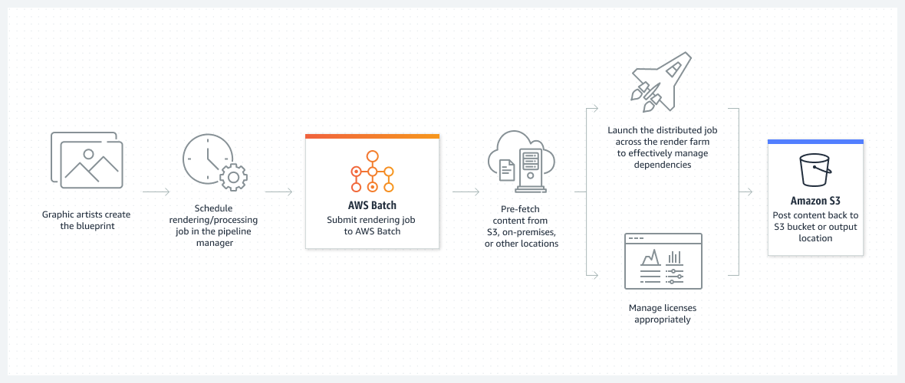
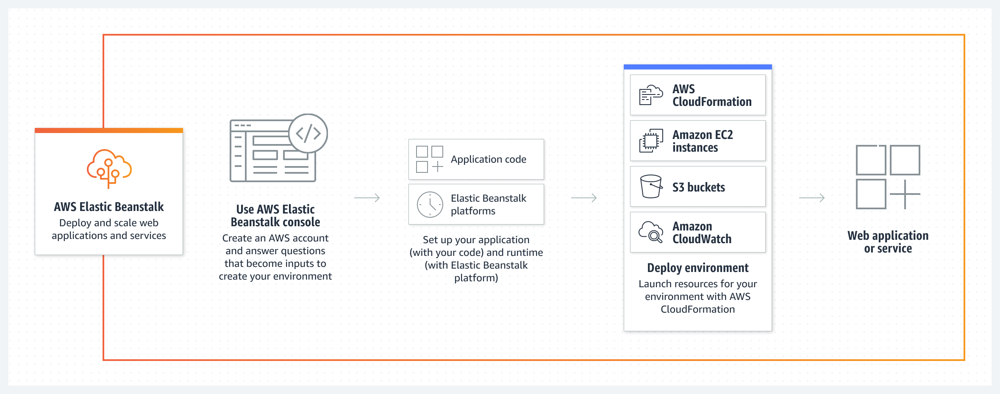
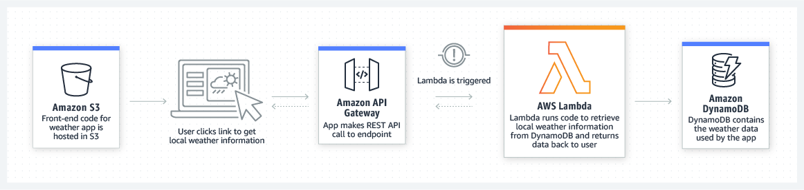
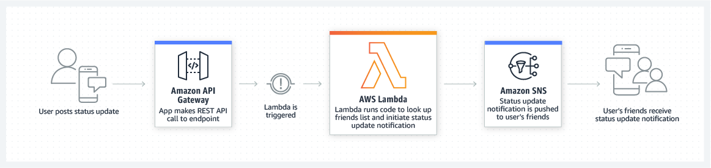

## 클라우드 금융 관리(Cloud Finance Management)

- 최초 작성 일자: 2023-03-20
- 수정 내역:
  - 2023-03-20: 최초 작성

---

### Amazon EC2

- **클라우드의 가상 서버**
- 거의 모든 워크로드에 적합한 안전하고 크기 조정 가능한 컴퓨팅 용량
- Amazon EC2는 500개가 넘는 인스턴스, 그리고 최신 프로세서, 스토리지, 네트워킹, 운영 체제 및 구매 모델의 옵션과 함께 워크로드의 요구 사항에 가장 잘 부합할 수 있도록 가장 포괄적이고 심층적인 컴퓨팅 플랫폼을 제공한다.
- AWS는 인텔, AMD 및 Arm 프로세서를 지원하는 최초의 주요 클라우드 공급자이며, 온디맨드 EC2 Mac 인스턴스를 지원하는 유일한 클라우드이자, 400Gbps 이더넷 네트워킹을 지원하는 유일한 클라우드다.
- AWS는 기계 학습 훈련에 대한 최상의 가격 대비 성능은 물론, 클라우드에서 추론 인스턴스당 가장 저렴한 요금을 제공한다.

#### 사용 이유

- 안정적인 확장 가능한 인프라에 온디맨드로 액세스한다. 99.99%의 가용성을 지원하는 SLA 약정을 기반으로 몇 분 안에 용량 크기를 조정한다.
- 애플리케이션을 위한 안전한 컴퓨팅을 제공한다. 보안은 AWS Nitro System에서 Amazon EC2를 기반으로 구축된다.
- AWS Graviton 기반 인스턴스, Amazon EC2 스팟 인스턴스 및 AWS Savings Plans와 같은 유연한 옵션을 통해 성능과 비용을 최적화한다.
- AWS Migration Tools, AWS Managed Services 또는 Amazon Lightsail을 사용하여 간편하게 앱을 마이그레이션하고 구축한다. 

#### 사용 사례

- **클라우드 네이티브 및 엔터프라이즈 애플리케이션 실행**: Amazon EC2는 까다로운 비즈니스 요구 사항을 충족하기 위해 안전하고 안정적이며 비용 효율적인 고성능 컴퓨팅 인프라를 제공한다.
- **HPC 애플리케이션을 위한 크기 조정**: HPC 애플리케이션을 보다 빠르고 비용 효율적으로 실행하는 데 필요한 온디맨드 인프라와 용량에 액세스한다.
- **Apple 플랫폼을 위한 개발**: 온디맨드 macOS 워크로드를 구축하고 테스트하며 서명한다. 몇 분 안에 환경에 액세스하고 필요한 만큼 동적으로 용량을 조정하며 AWS의 종량제 요금 혜택을 누릴 수 있다.
- **기계 학습 애플리케이션 훈련 및 배포**: Amazon EC2는 기계 학습 프로젝트를 위해 가격 대비 성능을 최적화하도록 특별히 구축된 컴퓨팅, 네트워킹(최대 400Gbps) 및 스토리지 서비스에 대한 가장 포괄적인 옵션을 제공한다.

---

### Amazon EC2 Auto Scaling

- **수요에 맞춰 컴퓨팅 용량 조정**
- 변화하는 수요를 충족하기 위해 컴퓨팅 용량 추가 또는 제거

#### 사용 이유

- 비정상 인스턴스의 자동 감지 및 교체를 통해 내결함성을 개선한다.
- 적절한 양의 컴퓨팅 용량으로 예측 또는 동적 조정 정책으로 가용성을 높인다.
- 구매 옵션과 인스턴스 유형을 결합하여 워크로드 성능과 비용을 최적화한다.
- 인스턴스 새로 고침으로 구성 변경 및 애플리케이션 배포의 복잡성을 줄인다.

#### 작동 방식

- Amazon EC2 Auto Scaling은 애플리케이션 가용성을 유지하는 데 도움이 되며 정의한 조정 정책을 사용하여 EC2 인스턴스를 자동으로 추가하거나 제거할 수 있다.
- 동적 또는 예측 조정 정책을 사용하면 기존 또는 실시간 수요 패턴을 서비스하기 위해 EC2 인스턴스 용량을 추가하거나 제거할 수 있다.
- Amazon EC2 Auto Scaling의 플릿 관리 기능은 플릿의 상태와 가용성을 유지하는 데 도움이 된다.

#### 사용 사례

- **애플리케이션 확장 일정 잡기**: 이전 트래픽 패턴을 사용하여 알려진 로드 변경 전에 애플리케이션 확장을 결정한다.
- **수동 프로비저닝 감소**: Amazon EC2 용량을 미리 프로비저닝할 필요가 없도록 애플리케이션 수요 곡선을 따를 수 있다.
- **머신 러닝으로 변화 예측**: 머신 러닝을 사용하여 다가오는 트래픽 변화를 예측하기 위해 적절한 수의 EC2 인스턴스를 예측하고 예약한다.

---

### Amazon Lightsail

- **가상 프라이빗 서버 시작 및 관리**
- 저렴한 비용의 사전 구성된 클라우드 리소스를 통해 애플리케이션 및 웹 사이트를 빠르게 구축
- Amazon Lightsail은 사용하기 쉬운 가상 프라이빗 서버(VPS) 인스턴스, 컨테이너, 스토리지, 데이터베이스 등을 비용 효율적인 월별 가격으로 제공한다.

#### 사용 이유

- 몇 번의 클릭으로 웹 사이트 또는 애플리케이션 생성 네트워킹, 액세스 및 보안 환경을 자동으로 구성한다.
- 규모가 커질 때 쉽게 확장하거나 Amazon EC2와 같은 보다 큰 AWS 에코시스템으로 리소스를 마이그레이션한다.
- 세계적으로 뛰어난 클라우드 플랫폼의 보안과 안정성을 활용한다.

#### 사용 사례

- **간단한 웹 애플리케이션 시작**: LAMP, Nginx, MEAN, Node.js와 같은 사전 구성된 개발 스택을 사용하여 쉽고 빠르게 온라인에서 지원한다.
- **사용자 지정 웹 사이트 생성**: WordPress, Magento, Prestashop, Joomla와 같은 사전 구성된 애플리케이션을 통해 단 몇 번의 클릭으로 블로그, 전자상거래 또는 개인 웹 사이트를 구축한다.
- **소규모 비즈니스 애플리케이션 구축**: 파일 스토리지 및 공유, 백업, 재무 및 회계 소프트웨어 등과 같은 비즈니스용 소프트웨어를 시작할 수 있다.
- **테스트 환경 구동**: 새로운 아이디어를 위험 부담 없이 실현할 수 있는 테스트 환경과 개발 샌드박스를 쉽게 생성하고 삭제할 수 있다.

---

### AWS App Runner

- **컨테이너식 웹 앱의 대규모 구축 및 실행**
- 컨테이너화된 웹 애플리케이션 및 API를 대규모로 배포

#### 사용 이유

- 컨테이너나 인프라에 대한 경험이 없어도 대규모로 안전한 웹 애플리케이션을 구축하고 실행할 수 있다.
- 고가용성과 낮은 지연으로 애플리케이션 비용을 효과적으로 조정할 수 있다.
- 애플리케이션에 집중하면서도 인프라 및 규정 준수 요구 사항을 충족할 수 있다.
- 애플리케이션을 지원하는 AWS에서 데이터베이스, 캐시 및 메시지 대기열 서비스에 연결할 수 있다.

#### 작동 방식

- AWS App Runner는 인프라나 컨테이너와 관련한 경험이 없더라도 컨테이너화된 웹 애플리케이션과 API 서비스를 구축, 배포 및 실행할 수 있는 완전관리형 컨테이너 애플리케이션 서비스다.

#### 사용 사례

- **프론트엔드 및 백엔드 애플리케이션 구축**: App Runner를 사용하여 API 서비스, 백엔드 웹 서비스, 웹 사이트 등을 구축하고 실행한다.
- **수천 개의 마이크로서비스를 동시에 실행**: 애플리케이션의 각 구성 요소를 유연하게 확장하여 애플리케이션 복원력에 대한 리스크를 줄이고 민첩한 혁신을 증진한다.
- **출시 기간 단축**: AWS의 모범 사례와 기술을 사용하여 컨테이너화된 웹 애플리케이션을 대규모로 배포 및 실행함으로써 출시 기간을 크게 단축한다.

---

### AWS Batch

- **규모와 상관없이 배치 작업 실행**
- 대규모 배치 처리, ML 모델 훈련 및 분석
- Amazon ECS, Amazon EKS, AWS Fargate 및 스팟 또는 온드맨드 인스턴스와 같은 다양한 AWS 컴퓨팅 제품 및 서비스를 통해 컨테이너화된 배치 또는 ML 워크로드를 계획, 예약, 실행하는 완전관리형 배치 컴퓨팅 서비스다.

#### 사용 이유

- 소프트웨어 또는 서버를 설치하지 않고도 수십만 건의 배치 및 기계 학습 컴퓨팅 작업을 실행할 수 있다.
- 기본적으로 AWS와 통합하여 확장, 네트워킹, 관리 기능을 구현할 수 있다.
- 볼륨 및 리소스 요구 사항에 따라 컴퓨팅 작업 분배를 최적화하여 비용을 절감할 수 있다.
- 대규모 처리 및 시뮬레이션을 지원하는 완전관리형 인프라를 통해 컴퓨팅 리소스를 자동으로 확장할 수 있다.

#### 작동 방식

- AWS Batch를 사용하면 개발자, 과학자, 엔지니어가 수십만 개의 배치 및 기계 학습 컴퓨팅 작업을 효율적으로 실행하면서 컴퓨팅 리소스를 최적화하여 결과 분석 및 문제 해결에 집중할 수 있다.
- **금융 서비스**

- **생명 과학**

- **디지털 미디어**

#### 사용 사례

- **금융 서비스 분석 실행**: 1일 거래 비용, 완료 보고 및 시장 성과에 대한 분석을 자동화한다.
- **약물 및 게놈 서열 스크리닝**: 약물 설계를 위한 더 나은 데이터를 캡처하기 위해 저분자 라이브러리를 빠르게 검색한다.
- **시각 효과 렌더링**: 콘텐츠 렌더링 워크로드를 자동화하여 의존성에 따른 인력의 개입 필요성을 최소화한다.
- **기계 학습 모델 훈련**: 모든 규모에서 컴퓨팅 집약적인 ML 모델 훈련 및 추론을 효율적으로 실행한다.

---

### AWS Elastic Beanstalk

- **웹 앱 실행 및 관리**
- 웹 애플리케이션 배포 및 크기 조정
- 코드를 업로드하면 Elastic Beanstalk가 용량 프로비저닝, 로드 밸런싱, 자동 조정부터 시작하여 애플리케이션 상태 모니터링에 이르기까지 배포를 자동으로 처리한다.

#### 사용 이유

- 간단하고 빠른 방법으로 웹 애플리케이션을 업데이트 및 배포할 수 있다.
- 인프라 프로비저닝 및 관리 대신 코드 작성에 집중할 수 있다.
- 애플리케이션을 강화하기 위한 최적의 AWS 리소스를 선택하고 완벽하게 제어할 수 있다.
- 트래픽 급증을 처리하기 위해 조정 가능한 설정을 사용하여 비용을 최소화하는 동시에 애플리케이션의 크기를 조정할 수 있다.

#### 작동 방식

- AWS Elastic Beanstalk는 웹 애플리케이션을 배포하여 비즈니스에 집중할 수 있도록 한다.

#### 사용 사례

- **신속하게 웹 애플리케이션 출시**: 기본 인프라를 프로비저닝하고 관리하는 복잡성 없이 몇 분만에 확장 가능한 웹 애플리케이션을 배포할 수 있다.
- **애플리케이션을 위한 모바일 API 백엔드 생성**: 선호하는 프로그래밍 언어를 사용하여 모바일 API 백엔드를 구축하면 Elastic Beanstalk가 패치와 업데이트를 관리한다.
- **중요한 비즈니스 애플리케이션 리플랫포밍**: 상태 유지 애플리케이션을 레거시 인프라에서 Elastic Beanstalk로 마이그레이션하고 프라이빗 네트워크에 안전하게 연결한다.

---

### AWS Lambda

- **서버에 대한 걱정 없이 코드 실행**
- 서버 또는 클러스터에 대한 걱정 없이 코드 실행

#### 사용 이유

- 인프라를 프로비저닝하거나 관리하지 않고 코드를 실행한다. zip 파일 또는 컨테이너 이미지로 코드를 작성하고 업로드하면 된다.
- 하루에 수십 개의 이벤트에서 초당 수십만 개에 이르기까지 어떤 규모에서든 코드 실행 요청에 자동으로 응답한다.
- 피크 용량에 대해 사전에 인프라를 프로비저닝하는 대신, 밀리초 기준으로 사용하는 컴퓨팅 시간에 대해서만 요금을 지불하여 비용을 절감한다.
- 올바른 함수 메모리 크기로 코드 실행 시간 및 성능을 최적화한다. 프로비저닝된 동시성으로 두자리수 밀리초 단위에서 높은 수요에 응답한다.

#### 작동 방식

- AWS Lambda는 서버를 프로비저닝 또는 관리하지 않고도 실제로 모든 유형의 애플리케이션 또는 백엔드 서비스에 대한 코드를 실행할 수 있는 이벤트 중심의 서버리스 컴퓨팅 서비스다.
- 200개가 넘는 AWS 서비스와 서비스형 소프트웨어(SaaS) 애플리케이션에서 Lambda를 트리거할 수 있으면 사용한 만큼만 지불하면 된다.

- **파일 처리**

- **스트림 처리**

- **웹 애플리케이션**

- **IoT 백엔드**

- **모바일 백엔드**

#### 사용 사례

- **대규모 데이터 처리**: 필요하면 필요한 용량으로 코드를 실행한다. 자동으로 데이터 볼륨과 일치하도록 크기를 조정하고 사용자 지정 이벤트 트리거를 지원한다.
- **대화영 웹 및 모바일 백엔드 실행**: AWS Lambda를 다른 AWS 서비스와 결합하여 안전하고 안정적이며 확장 가능한 온라인 경험을 생성한다.
- **강력한 기계 학습 인사이트 지원**: 기계 학습(ML) 모델에 제공하기 전에 데이터를 전처리한다. Amazon Elastic File System(EFS) 액세스와 함께 AWS Lambda는 크기 조정을 간소화하기 위해 인프라 관리 및 프로비저닝을 처리한다.
- **이벤트 중심의 애플리케이션 생성**: 분리된 서비스 사이에서 손쉬운 통신을 위해 이벤트 중심의 함수를 구축한다. 프키 수요 기간에 리소스 충돌이나 과도한 프로비저닝 없이도 애플리케이션을 실행하여 비용을 절감한다.

---

### AWS Outposts 패밀리

- **AWS 인프라를 온프레미스에서 실행**
- 진정으로 일관된 하이브리드 환경을 위해 온프레미스에서 AWS 인프라 및 서비스 실행
- AWS Outposts는 하이브리드 환경을 위해 거의 모든 온프레미스 또는 엣지 로케이션에 AWS 인프라 및 서비스를 제공하는 완전관리형 솔루션 패밀리다.
- Outposts 솔루션을 통해 온프레미스에서 기본 AWS 서비스를 확장하고 실행할 수 있으며 1U 및 2U Outposts 서버에서 42U Outposts 랙 및 다중 랙 배포에 이르기까지 다양한 폼 팩터에서 Outposts 솔루션을 사용할 수 있다.
- AWS Outposts를 사용하면 일부 AWS 서비스를 로컬에서 실행하고 로컬 AWS 리전에서 사용 가능한 광범위한 서비스에 연결할 수 있다.

#### 사용 이유

- **온프레미스에서 AWS 서비스 실행**: 짧은 대기 시간, 로컬 데이터 처리 및 데이터 레지던시 요구 사항 충족을 위해 온프레미스에서 AWS 컴퓨팅, 네트워킹, 보안 및 기타 서비스를 확장할 수 있다.
- **완전관리형 인프라**: 완전관리형 환경을 통해 IT 인프라를 관리하는 데 필요한 시간, 리소스, 운영 위험 및 유지 관리를 위한 가동 중단 시간을 줄일 수 있다.
- **진정으로 일관된 하이브리드 환경**: 클라우드에서 사용 가능한 동일한 하드웨어 인프라, API, 도구 및 관리 제어를 사용하여 진정으로 일관된 개발자 및 IT 운영 경험을 제공할 수 있다.

#### 사용 사례

- **대기 시간이 짧은 컴퓨팅**: 실시간 멀티플레이어 게임과 같은 대화형 애플리케이션을 위한 고품질 게임 경험을 전 세계 플레이어에게 제공한다. 가장 가까운 퍼블릭 클라우드 서버가 한 자릿수 밀리초 대기 시간 요구 사항을 충족할 만큼 충분히 가깝지 않은 경우 AWS Outposts는 제조 실행 시스템(EMS), 고주파 거래 또는 의료 진단에 필요한 비즈니스 애플리케이션을 실행할 수 있다.
- **데이터 레지던시**: 규제, 계약 또는 정보 보안상의 이유로 데이터가 특정 국가, 주 또는 지방 자치 단체에 남아 있어야 하는 경우가 있다. 대개 금융 서비스, 의료, 석유 및 가스, 기타 규제가 엄격한 산업이 그렇다. AWS Outposts를 사용하면 클라우드와 엣지 로케이션 간의 마찰이 적은 이동으로 워크로드가 실행되는 위치와 데이터가 상주하는 위치를 제어하여 규제 변화에 쉽게 적응할 수 있다.
- **마이그레이션 및 현대화**: 레거시 온프레미스 애플리케이션에는 대기 시간에 민감한 시스템 종속성이 있어 마이그레이션하기 어려운 경우가 많다. AWS Outposts를 사용하면 마이그레이션을 온프레미스에서 더 작은 조각으로 분할하여 마이그레이션할 준비가 될 때까지 애플리케이션 구성 요소 간의 대기 시간에 민감한 연결을 유지할 수 있다.
- **로컬 데이터 처리**: 데이터 레이크 및 기계 학습 모델 훈련과 같은 사용 사례를 위해 로컬에서 데이터를 처리하거나, 일관된 하이브리드 아키텍처를 설정하여 비용, 크기 또는 대역폭 제약이 있는 마이그레이션하기 어려운 로컬 데이터 집합을 처리하고 장기 보관을 위해 데이터를 클라우드로 이동할 수 있다.

---

### 참고한 자료

- [Amazon EC2](https://aws.amazon.com/ko/ec2/?nc2=h_ql_prod_cp_ec2)
- [Amazon EC2 Auto Scaling](https://aws.amazon.com/ko/ec2/autoscaling/?nc2=h_ql_prod_cp_ec2auto)
- [Amazon Lightsail](https://aws.amazon.com/ko/lightsail/?nc2=h_ql_prod_cp_ls)
- [Amazon App Runner](https://aws.amazon.com/ko/apprunner/?nc2=h_ql_prod_cp_ar)
- [AWS Batch](https://aws.amazon.com/ko/batch/?nc2=h_ql_prod_cp_ba#)
- [AWS Elastic Beanstalk](https://aws.amazon.com/ko/elasticbeanstalk/?nc2=h_ql_prod_cp_ebs)
- [AWS Lambda](https://aws.amazon.com/ko/lambda/)
- [AWS Outposts](https://aws.amazon.com/ko/outposts/?nc2=h_ql_prod_cp_out)
