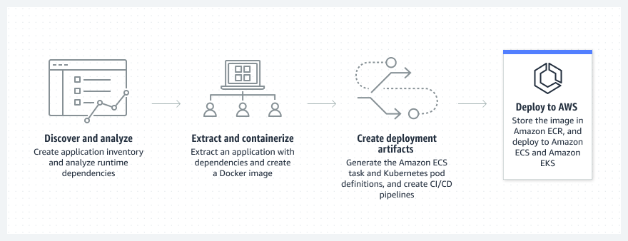

## 컨테이너(Container)

- 최초 작성 일자: 2023-03-21
- 수정 내역:
  - 2023-03-21: 최초 작성

---

### Amazon Elastic Container Registry(ECR)

- **컨테이너 이미지를 손쉽게 저장, 관리 및 배포**
- 어디서나 컨테이너 소프트웨어를 쉽게 저장, 공유 및 배포

#### 사용 이유

- 인프라를 설치하거나 확장하지 않고도 Amazon ECR에 컨테이너 이미지를 푸시하고 모든 관리 도구를 사용하여 이미지를 가져온다.
- 자동 암호화 및 액세스 제어를 사용하여 HTTPS에서 이미지를 안전하게 공유 및 다운로드 한다.
- 이미지에 보다 빠르게 액세스하고 배포하며, 다운로드 시간을 줄이고, 확장 가능하고 내구성이 뛰어난 아키텍처를 사용하여 가용성을 개선한다.

#### 작동 방식

- Amazon ECR은 어디서나 애플리케이션 이미지 및 아티팩트를 안정적으로 배포할 수 있도록 뛰어난 성능 호스팅을 제공하는 완전관리형 컨테이너 레지스트리다.

#### 사용 사례

- **소프트웨어 취약성 관리**: 긴밀하게 통합된 Amazon Inspector 취약성 관리 서비스를 사용하여 취약성 평가 스캔 및 수정 티켓 라우팅을 자동화하여 이미지 규정 준수 보안 요구 사항을 충족한다.
- **배포 워크로드 간소화**: 단일 명령으로 컨테이너식 애플리케이션을 공개하고 자체 관리형 환경을 쉽게 통합한다.
- **이미지 수명 주기 정책 관리**: 필요하지 않은 최근 이미지 및 아카이브를 자동으로 보존한다. 규칙 및 태깅을 사용하여 이미지에 빠르게 액세스한다.

---

### Amazon Elastic Container Service(ECS)

- **컨테이너를 실행하는 고도로 안전하고, 안정적이며, 확장 가능한 방법**
- 고도로 안전하고, 안정적이며, 확장 가능한 컨테이너 실행

#### 사용 이유

- 선호하는 지속적 통합 및 지속적 전달(CI/CD)과 자동화 도구를 사용하여 클라우드에서 수천 개의 컨테이너를 시작한다.
- 컨테이너에 맞게 AWS Fargate 서버리스 컴퓨팅을 최적화하여 제어 영역, 노드 및 인스턴스를 구성하고 관리할 필요가 없어진다.
- 자율 프로비저닝, 자동 크기 조정 및 종량제 요금을 통해 컴퓨팅 비용을 최대 50% 절감한다.
- 전 세계 거의 모든 규제 기관의 규정을 준수하기 위해 표준화된 AWS 관리 및 거버넌스 솔루션과 원활하게 통합한다.

#### 작동 방식

- Amazon ECS는 컨테이너화된 애플리케이션의 손쉬운 배포, 관리 및 크기 조정을 지원하는 완전관리형 컨테이너 오케스트레이션 서비스다.

#### 사용 사례

- **하이브리드 환경에 배포**: Amazon ECS Anywhere를 통해 클라우드 또는 온프레미스에서 컨테이너 기반 애플리케이션을 구축하고 여러 환경에서 일관된 툴링, 관리, 워크로드 예약, 모니터링을 이용한다.
- **배치 처리 지원**: Amazon EC2, Fargate, Amazon EC2 스팟 인스턴스를 포함하여 다양한 AWS 서비스에서 배치 컴퓨팅 워크로드를 계획하고 예약하며 실행한다.
- **웹 애플리케이션 크기 조정**: AWS의 성능, 규모, 안정성 및 가용성을 바탕으로 여러 가용 영역에서 웹 애플리케이션을 자동으로 크기 조정하고 실행한다.

---

### Amazon ECS Anywhere

- **고객 관리형 인프라에서 컨테이너 실행**
- 온프레미스 인프라에서 컨테이너 실행

#### 사용 이유

- 익숙한 리전 내 ECS 컨트롤 플레인을 실행하므로 운영 오버헤드를 줄이고 혁신에 집중할 수 있다.
- 컨테이너 기반 애플리케이션을 실행하는 장소에 상관없이 간단하고 일관된 환경을 보장한다.
- 표준화된 컨테이너 오케스트레이터를 통해 온프레미스 및 AWS 기반 소프트웨어 관리를 간소화할 수 있다.

#### 작동 방식

- Amazon ECS Anywhere는 고객의 인프라에서 컨테이너 워크로드를 손쉽게 실행 및 관리할 수 있는 Amazon ECS의 기능이다. 
- 이 기능은 온프레미스에 대한 투자 손실 없이 비즈니스를 확장하고 규정 요구 사항을 준수하는 데 도움이 된다.

#### 사용 사례

- **엣지에서 데이터 처리 워크로드 배포**: 자체 하드웨어의 엣지 로케이션에서 컨테이너식 데이터 처리 워크로드를 실행하여 지연 시간을 줄인다.
- **기존 자본 투자 활용**: AWS로 마이그레이션할 때 동일한 온프레미스 Amazon ECS 도구로 일관성을 유지한다.
- **GPU 기반 컨테이너 워크로드 배포**: 데이터를 AWS로 전송하지 않고 기계 학습(ML), 이미지 처리, 3D 시각화, 빅데이터 및 기타 애플리케이션을 실행한다.
- **Windows 컨테이너 워크로드 실행**: 기존 Windows Server 라이선스를 사용하여 온프레미스 환경 내 Windows 컨테이너 워크로드를 실행한다.

---

### Amazon Elastic Nubernetes Service(EKS)

- **Kubernetes를 실행하는 가장 신뢰성 높은 방법**
- Kubernetes를 시작, 실행 및 크기 조정하는 가장 신뢰할 수 있는 방법

#### 사용 이유

- EC2, VPC, IAM, EBS 및 기타 AWS 서비스와의 기본적인 통합을 활용한다.
- 효율적인 컴퓨팅 리소스 프로비저닝 및 자동 Kubernetes 애플리케이션 크기 조정으로 비용을 절감한다.
- 클러스터의 제어 영역 보안 패치가 자동으로 적용되어 더욱 안전한 Kubernetes 환경을 보장한다.

#### 작동 방식

- Amazon EKS는 AWS 클라우드와 온프레미스 데이터 센터에서 Kubernetes를 실행하는 데 사용되는 관리형 Kubernetes 서비스다.
- 클라우드에서 Amazon EKS는 컨테이너 예약, 애플리케이션 가용성 관리, 클러스터 데이터 저장 및 다른 주요 태스크를 담당하는 Kubernetes 컨트롤 플레인의 가용성과 확장성을 관리한다.
- 통합된 도구를 사용하여 AWS Outposts, 가상 머신 또는 베어 메탈 서버에 간편하게 배포할 수 있다.

- **클라우드에서 Amazon EKS 실행**

- **AWS Outposts에서 Amazon EKS 실행**

- **Amazon EKS Anywhere 실행**

- **자체 도구를 사용하여 애플리케이션 배포**

#### 사용 사례

- **하이브리드 환경 전반에 배포**: 하이브리드 환경에서 Kubernetes 클러스터 및 애플리케이션을 관리하고 데이터 센터에서 Kubernetes를 실행한다.
- **기계 학습(ML) 워크플로 모델링**: Inferentia를 포함한 최신 Amazon EC2 GPU 기반 인스턴스를 사용하여 분산 훈련 작업을 효율적으로 실행하고 Kubeflow를 사용하여 훈련 및 추론을 배포한다.
- **웹 애플리케이션 구축 및 실행**: 즉시 사용 가능한 네트워킹 및 보안 통합을 통해 여러 가용 영역(AZ)에 걸쳐 고가용성 구성에서 자동으로 확장 및 축소되고 실행되는 애플리케이션을 생성한다.

---

### Amazon EKS Distro

- **일관된 Kubernetes 클러스터 실행**
- AWS에서 Kubernetes의 오픈 소스 배포

#### 사용 이유

- Amazon EKS와 동일한 오픈 소스 Kubernetes 소스 코드, 툴링 및 설명서를 사용하여 재현 가능한 빌드를 수행한다.
- 베어 메탈 서버, VMware vSphere 가상 머신, Amazon EC2 인스턴스 및 기타 클라우드의 인프라를 포함한 직접 프로비저닝한 자체 하드웨어 인프라에 EKS Distro를 배포한다.
- Amazon EKS의 버전 수명 주기 정책에 따라 최신 보안 패치 및 지연 연장을 통해 빌드를 업데이트 한다.

#### 작동 방식

- Amazon EKS Distro는 AWS에서 구축 및 유지 관리하는 Kubernetes 배포로, 안정적인 보안 클러스터를 쉽게 생성하도록 Amazon EKS에서 사용한다.

#### 사용 사례

- **온프레미스 및 클라우드에서 일관되게 배포**: AWS 온프레미스 및 기타 클라우드의 자체 관리형 인프라 내에서 Amazon EKS를 구동하는 동일한 보안, 검증 및 테스트를 거친 Kubernetes 구성 요소를 실행한다.
- **온프레미스 애플리케이션 현대화**: 업스트림 Kubernetes 및 보안 패치를 최신 상태로 관리할 필요가 없으므로 핵심 비즈니스에 집중할 수 있다.
- **기존 하드웨어 투자 활용**: Kubernetes 워크로드를 실행하는 데 자체 하드웨어 및 데이터 센터 투자를 계속 사용한다.

---

### AWS App2Container

- **기존 애플리케이션 컨테이너화 및 마이그레이션**

#### 사용 이유

- 애플리케이션 개발과 운영 기술 세트를 간소화하여 인프라와 교육 비용을 절감할 수 있다.
- 애플리케이션 및 자동 생성된 컨테이너 이미지를 분석하여 현대화를 가속화할 수 있다.
- 코드 변경 없이 데이터 센터에서 실행 중인 애플리케이션을 컨테이너화할 수 있다.

#### 작동 방식

- AWS App2Container(A2C)는 Java 및 .NET 웹 애플리케이션을 컨테이너 형식으로 마이그레이션하고 현대화하는 명령줄 도구다.
- AWS A2C는 베어 메탈, 가상 머신, Amazon EC2 인스턴스 또는 클라우드에서 실행되는 애플리케이션의 인벤토리를 분석하고 구축한다.

#### 사용 사례

- **레거시 애플리케이션 유지 관리 및 비용 절감 실현**: 기존 애플리케이션을 마이그레이션하고 현대화하는 동시에 애플리케이션의 배포와 운영을 표준화한다.
- **애플리케이션 프로비저닝 자동화**: 필요한 컴퓨팅, 네트워크 및 보안 인프라를 구성하는 AWS CloudFormation 템플릿을 사용한다.
- **컨테이너 구축 및 배포**: 미리 생성된 통합/지속적 전달(CI/CD) 파이프라인을 AWS DevOps 서비스에 사용한다.

---

### AWS App Runner

- **컨테이너식 웹 앱의 대규모 구축 및 실행**
- 컨테이너화된 웹 애플리케이션 및 API를 대규모로 배포

#### 사용 이유

- 컨테이너나 인프라에 대한 경험이 없어도 대규모로 안전한 웹 애플리케이션을 구축하고 실행할 수 있다.
- 고가용성과 낮은 지연으로 애플리케이션 비용을 효과적으로 조정할 수 있다.
- 애플리케이션에 집중하면서도 인프라 및 규정 준수 요구 사항을 충족할 수 있다.
- 애플리케이션을 지원하는 AWS에서 데이터베이스, 캐시 및 메시지 대기열 서비스에 연결할 수 있다.

#### 작동 방식

- AWS App Runner는 인프라나 컨테이너와 관련한 경험이 없더라도 컨테이너화된 웹 애플리케이션과 API 서비스를 구축, 배포 및 실행할 수 있는 완전관리형 컨테이너 애플리케이션 서비스다.

#### 사용 사례

- **프론트엔드 및 백엔드 애플리케이션 구축**: App Runner를 사용하여 API 서비스, 백엔드 웹 서비스, 웹 사이트 등을 구축하고 실행한다.
- **수천 개의 마이크로서비스를 동시에 실행**: 애플리케이션의 각 구성 요소를 유연하게 확장하여 애플리케이션 복원력에 대한 리스크를 줄이고 민첩성과 혁신을 증진한다.
- **출시 기간 단축**: AWS의 모범 사례와 기술을 사용하여 컨테이너화된 웹 애플리케이션을 대규모로 배포 및 실행함으로써 출시 기간을 크게 단축한다.

---

### AWS Copliot

- **컨테이너식 애플리케이션을 쉽게 배포 및 운영**
- 컨테이너화된 애플리케이션을 위한 명령줄 인터페이스

#### 사용 이유

- 확장 가능하고 생산 준비가 된 안전한 IaC 템플릿을 사용하여 공통 애플리케이션 아키텍처를 신속하게 구축할 수 있다.
- 하나의 명령으로 배포를 자동화하고 코드 리포지토리에서 애플리케이션 환경으로 전달 파이프라인을 구성할 수 있다.
- 엔드 투 엔드 워크플로우를 활용하고 단일 도구를 사용하여 모든 마이크로서비스를 구축, 릴리스 및 운영할 수 있다.

#### 작동 원리

- AWS Copilot은 AWS에서 컨테이너화된 애플리케이션을 빠르게 시작하고 관리하는 데 사용할 수 있는 명령줄 인터페이스(CLI)다.
- Amazon ECS, AWS Fargate 및 AWS App Runner에서 실행을 간소화한다.

#### 사용 사례

- **컨테이너화된 애플리케이션 개발**: 하나의 명령으로 Amazon ECS 및 AWS Fargate에서 프로덕션 준비 컨테이너화된 애플리케이션 및 서비스를 생성, 릴리즈 및 운영한다.
- **안정적이고 안전한 기반으로 더 빠르게 이동**: 컨테이너화된 애플리케이션에 필요한 인프라를 설정하고 서로 다른 AWS 계정 및 리전에서 여러 배포 환경을 설정한다.
- **확장되는 비즈니스 요구 사항 지원**: AWS CloudFormation과 같은 IaC 도구로 AWS Copilot을 사용자 지정하여 비즈니스 확장에 따른 인프라 요구 사항을 충족한다.
- **서비스 모니터링 및 문제 해결**: 일상적인 워크플로에서 AWS Copilot을 사용할 수 있다. 하나의 명령으로 로그, 상태 및 인프라 세부 정보를 확인하여 서비스 문제를 해결한다.

---

### AWS Fargate

- **컨테이너용 서버리스 컴퓨팅**
- 컨테이너에 적합한 서버리스 컴퓨팅

#### 사용 이유

- 인프라가 아닌 애플리케이션 배포 및 관리 Fargate는 서버 크기 조정, 패치, 보안 및 관리의 운영 부담을 없애준다.
- Amazon CloudWatch Container Insights와 같은 AWS 서비스와의 기본 제공 통합을 통해 애플리케이션을 모니터링한다. 서드 파티 도구로 지표 및 로그를 수집한다.
- 설계에 따라 워크로드 격리를 통해 보안을 개선한다. Amazon ECS 태스크 및 Amazon EKS 파드는 전용 런타임 환경에서 실행된다.
- 요금은 사용한 만큼만 지불하면 된다. Fargate는 지정된 리소스 요구 사항에 가장 근접하도록 컴퓨팅 크기를 조정한다. Fargate를 사용하면 추가 서버를 사용하기 위해 과도하게 프로비저닝하거나 관련 비용을 지불하지 않아도 된다.

#### 작동 방식

- AWS Fargate는 서버를 관리하지 않고도 애플리케이션 구축에 초점을 맞출 수 있도록 지원하는 종량제 서버리스 컴퓨팅 엔진이며, Amazon ECS, Amazon EKS와 호환된다.

#### 사용 사례

- **웹 앱, API 및 마이크로서비스**: 컨테이너의 속도 및 불변성을 바탕으로 애플리케이션, API 및 마이크로서비스 아키텍처를 구축 및 배포한다. Fargate는 가장 중요한 애플리케이션에 초점을 맞출 수 있도록 컴퓨팅 인프라의 수명 주기를 소유, 실행 및 관리할 필요성을 없애준다.
- **컨테이너 워크로드 실행 및 크기 조정**: Amazon ECS 또는 Amazon EKS와 함께 Fargate를 사용하여 컨테이너식 데이터 처리 워크로드를 손쉽게 실행 및 크기 조정한다. 또한 Fargate를 사용하면 레거시 애플리케이션을 리팩토링하거나 리아키텍팅하지 않고 Amazon ECS Windows 컨테이너를 마이그레이션하고 실행할 수 있다.
- **AI 및 기계 학습 훈련 애플리케이션 지원**: 유연하고 이식 가능한 AI 및 기계 학습 개발 환경을 구축한다. Fargate를 통해 기계 학습(ML) 모델을 훈련, 테스트 및 배포 하기 위해 과도하게 프로비저닝하지 않고도 서버 용량을 증대하는 데 필요한 확장성을 달성한다.
- **비용 최적화**: AWS Fargate를 사용하면 선결제 비용이 없으며 사용한 리소스에 대해서만 비용을 지불한다. Compute Savings Plans 및 Fargate Spot으로 추가로 최적화한 다음 Graviton2 기반 Fargate를 사용하여 가격 대비 성능을 최대 40% 향상 시킬 수 있다.

---

### Red Hat OpenShift Service on AWS

- **관리형 Red Hat OpenShift 클러스터**
- 클라우드의 관리형 OpenShift 통합

#### 사용 이유

- 프로덕션용 OpenShift 통합을 사용하여 비즈니스 요구 사항 변경에 따라 AWS 기반 워크로드를 조절할 수 있다.
- 셀프 서비스 프로비저닝, 자동 보안 강화, 간소화된 배포를 통해 애플리케이션을 더 빠르게 구축할 수 있다.
- 시간당 또는 연간 결제 모델을 사용하여 유연한 종량제 방식으로 요금을 지불할 수 있다.

#### 작동 방식

- Red Hat OpenShift Service on AWS(ROSA)는 OpenShift와 통합된 환경을 제공한다.
- 다양한 AWS 컴퓨팅, 데이터베이스, 분석, 기계 학습(ML), 네트워킹, 모바일 및 기타 서비스를 사용하여 안전하고 확장 가능한 애플리케이션을 더 빠르게 구축할 수 있다.

#### 사용 사례

- **중앙 애플리케이션 환경 생성**: 런타임, 개발자 도구, 지속적 통합 및 전달(CI/CD) 모니터링이 내장된 관리형 턴키 OpenShift 서비스에서 애플리케이션을 원활하게 구축, 배포, 실행한다.
- **애플리케이션 전달 가속화**: 표준화된 애플리케이션 구성 요소를 생성하고, 구성 정확도를 개선하며, 새로운 애플리케이션 및 기능의 배포를 자동화한다.
- **기존 애플리케이션 현대화**: 다양한 애플리케이션 프레임워크, 프로그래밍 언어, 개발자 도구를 사용하여 하나의 환경에서 클라우드 기반 및 기존 애플리케이션을 실행한다.

---

### 참고한 자료

- [Amazon Elastic Container Registry](https://aws.amazon.com/ko/ecr/?nc2=h_ql_prod_ct_ec2reg)
- [Amazon Elastic Container Service](https://aws.amazon.com/ko/ecs/?nc2=h_ql_prod_ct_ecs)
- [Amazon ECS Anywhere](https://aws.amazon.com/ko/ecs/anywhere/?nc2=h_ql_prod_ct_ecsa)
- [Amazon Elastic Kubernetes Service(EKS)](https://aws.amazon.com/ko/eks/?nc2=h_ql_prod_ct_eks)
- [Amazon EKS Distro](https://aws.amazon.com/ko/eks/eks-distro/?nc2=h_ql_prod_ct_eksd)
- [AWS App2Container](https://aws.amazon.com/ko/app2container/?nc2=h_ql_prod_ct_ap2)
- [AWS App Runner](https://aws.amazon.com/ko/apprunner/?nc2=h_ql_prod_ct_ar)
- [AWS Copilot](https://aws.amazon.com/ko/containers/copilot/?nc2=h_ql_prod_ct_cop)
- [AWS Fargate](https://aws.amazon.com/ko/fargate/?nc2=h_ql_prod_ct_far)
- [Red Hat OpenShift Service on AWS](https://aws.amazon.com/ko/rosa/?nc2=h_ql_prod_ct_rosa)