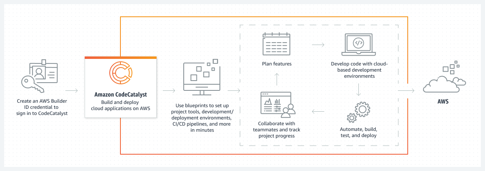
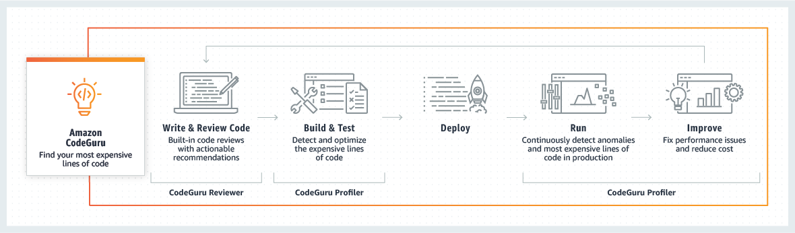
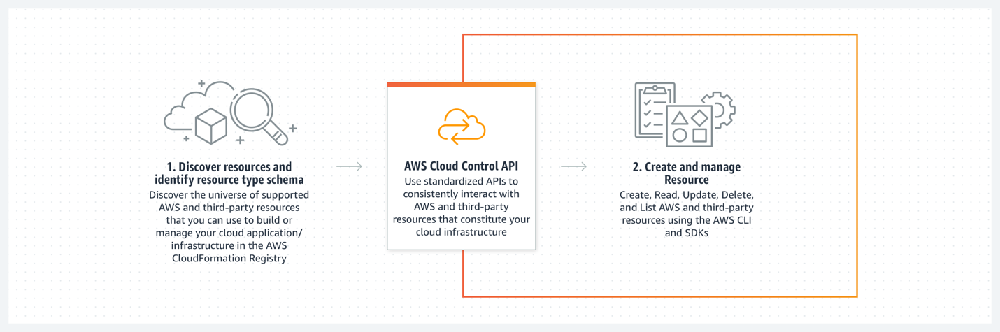
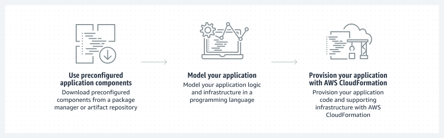
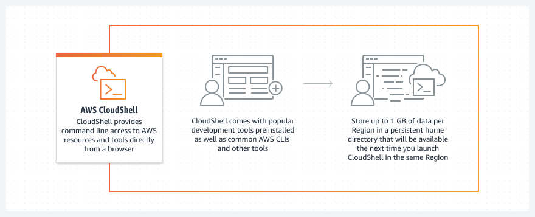
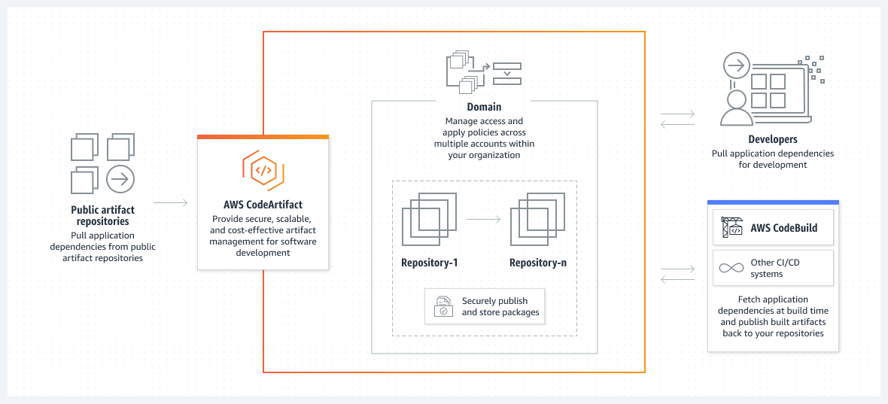
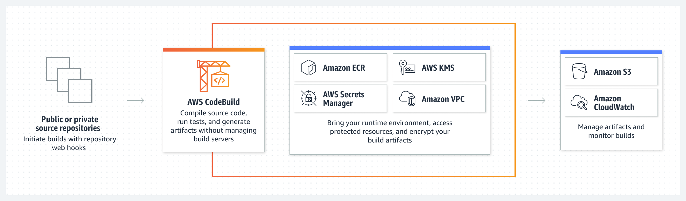
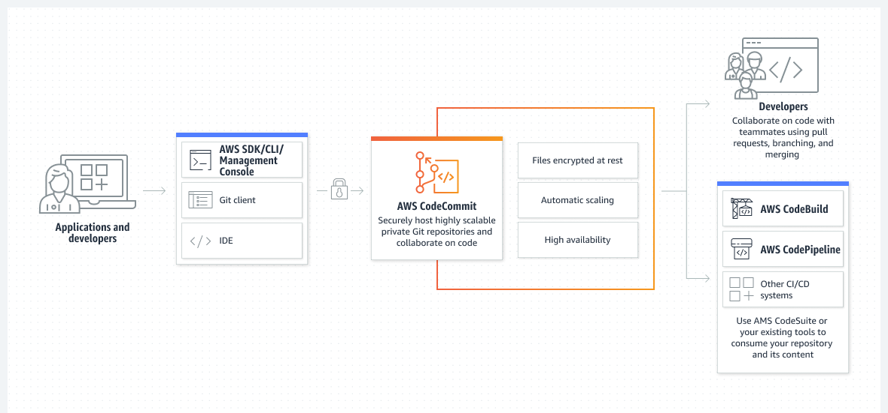
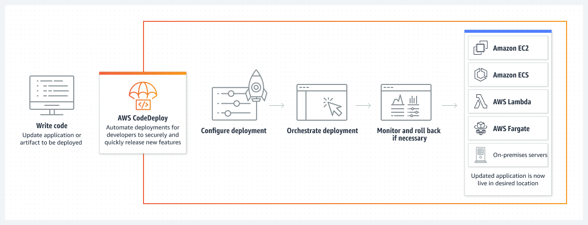

## 개발자 도구(Developer Kit)

- 최초 작성 일자: 2023-03-21
- 수정 내역:
  - 2023-03-21: 최초 작성

---

### Amazon CodeCatalyst

- **AWS에서 더 신속한 개발과 전송을 위한 통합 소프트웨어 개발 서비스**
- AWS에서의 계획, 개발, 제공 수명 주기를 가속화

#### 사용 이유

- 소스 코드에서 서비스 구성까지, 사용자가 필요로 하는 거의 모든 것이 포함된 청사진을 사용하여 몇 분 내에 프로젝트를 시작할 수 있다.
- 사용자의 프로젝트에 맞춰 완전히 구성되고 널리 사용되는 IDE로 작업할 수 있는 개인 클라우드 기반 개발 환경을 빠르게 생성한다.
- 지속적 통합 및 전달(CI/CD) 파이프라인을 쉽게 정의하고 이를 자동으로 확장 가능한 관리형 컴퓨팅 환경에서 실행한다.
- 통합형 활동 피드, 실시간 알림, 공유된 개발 리소스를 활용하여 효율적으로 협업한다.

#### 작동 방식

- 통합 소프트웨어 개발 서비스인 Amazon CodeCatalyst를 사용하여 AWS에서 더 빠르게 구축하고 제공할 수 있다.
- CodeCatalyst는 AWS의 완전관리형 서비스이므로 사용자가 개발에 집중할 수 있는 환경을 제공한다.

---

### Amazon CodeGuru

- **가장 비경제적인 코드 줄 찾기**
- 보안 취약성 탐지 및 코드 검토 자동화
- Amazon CodeGUru는 코드 품질을 높이고 애플리케이션에서 가장 비경제적인 코드 줄을 찾아낼 수 있도록 지원하는 지능형 권장 사항을 제공하는 개발자 도구다.
- CodeGuru를 기존 소프트웨어 개발 워크플로에 통합하면 애플리케이션 개발 중에 코드 검토를 자동화하고, 프로덕션에서 애플리케이션 성능을 지속적으로 모니터링하며, 코드 품질 및 애플리케이션 성능 개선을 위한 권장 사항과 시각적 단서를 제공하고, 전체 비용을 절감할 수 있다.

#### 작동 방식

- CodeGuru 리뷰어 및 프로파일러를 개발 파이프라인에 통합하여 코드 품질을 개선하고 애플리케이션 성능을 최적화할 수 있다.

#### Amazon CodeGuru Reviewer

- 수십 년간 축적된 지식과 경험을 바탕으로 훈련된 CodeGuru Reviewer는 기계 학습 및 자동화된 추론, AWS 및 보안 모범 사례, 그리고 수천 개의 오픈 소스 및 Amazon 리포지토리에서 수백만 건의 코드 검토를 통해 힘들게 얻은 교훈을 기반으로 코드 검토를 자동화한다. 

##### 사용 이유

- **프로덕션으로 이동 전에 코드 문제 포착**: 개발자는 코드를 검토할 때 개발 프로세스를 달리 변경하지 않고도 코드를 리포지토리에 커밋하고 CodeGuru Reviewer를 코드 검토자 중 하나로 추가한다. CodeGuru Reviewer는 리포지토리에서 기존 코드 베이스를 분석하고, 높은 정확도로 찾기 어려운 버그와 중요한 문제를 식별하며, 이를 해결하는 방법에 대한 지능형 제안 사항을 제공하고, 연속적인 코드 검토를 위한 기준을 생성한다.
- **보안 취약성 해결**: CodeGuru Reviewer 보안 탐지기는 자동화된 추론, 그리고 수년에 걸친 AWS의 보안 경험을 바탕으로 코드 보안을 개선한다. CodeGuru Reviewer 보안 탐지기는 GitHub Action을 통해 애플리케이션 개발 CI/CD 프로세스에 직접 보안 검토를 통합할 수 있게 하며, 코드가 AWS KMS, Amazon EC2, API, 일반적인 Java, Python dkaghghk, TLS/SSL 라이브러리에 대한 모범 사례를 따르도록 보장한다.
- **지속적인 모니터링을 통해 코드 품질을 사전에 개선**: CodeGuru Reviewer는 시작된 모든 풀 요청에 대해 증분 코드 변경을 자동으로 분석하고 풀 요청에서 직접 권장 사항을 게시한다. 또한, 정기적인 코드 유지 관리를 위한 전체 리포지토리 또는 코드베이스 검사와 코드 실사 이니셔티브를 지원하여 코드 품질을 일관되게 유지한다.

#### Amazon CodeGuru Profiler

- CodeGuru 프로파일러는 프로덕션에서 실행 중인 애플리케이션의 성능을 최적화하고 가장 비경제적인 코드 줄을 식별한다. 
- 항상 애플리케이션 성능 최적화를 검색하고, 이러한 코드를 수정하여 CPU 사용률을 줄이고 컴퓨팅 비용을 절감하고 애플리케이션 성능을 개선할 방법을 권장한다.

##### 사용 이유

- **성능 문제 해결**: CodeGuru 프로파일러는 애플리케이션의 런타임 데이터를 분석하여 CPU 및 메모리 사용률을 개선하고 성능 문제를 해결하여 지연 시간 및 처리량을 개선한다. CodeGuru 프로파일러는 CPU 사용률에 대한 최소한의 오버헤드로 프로덕션에서 지속적으로 실행된다.
- **애플리케이션 성능 이상 및 일반적인 성능 문제 발견**: CodeGuru 프로파일러는 애플리케이션 스택에서 더 많은 CPU를 소비하기 시작하거나 대기 시간을 늘리는 중요한 메서드의 성능 이상을 자동으로 탐지하고 5분 간격으로 업데이트되는 탐지 보고서를 제공한다.
- **지금 바로 가장 비경제적ㅇ니 코드 줄 찾기**: 코드와 애플리케이션의 효율성이 높을수록 실행 비용이 감소한다. CodeGuru 프로파일러는 성능 문제를 해결하는 방법에 대한 시각화 및 권장 사항을 제공하여 프로덕션에서 실행되는 모든 애플리케이션의 운영 비용을 최대 50%까지 절감한다.

---

### Amazon Corretto

- **프로덕션용 OpenJDK 배포**
- 무료, 멀티플랫폼, 프로덕션용 OpenJDK 배포
- Amazon Corretto는 무료로 사용할 수 있는 Open Java Development Kit(OpenJDK)의 프로덕션용 멀티플랫폼 배포판이다.
- Amazon은 내부적으로 수천 개의 프로덕션 서비스에서 Corretto를 실행하며, Corretto는 Java SE 표준과 호환되는 것으로 인증되었다.

#### 사용 이유

- **Amazon 지원**: Amazon Corretto에는 Amazon으로부터의 무료 장기 지원이 제공되기 때문에 필요할 때에만 버전을 업그레이드할 수 있다.
- **프로덕션용**: Amazon Corretto는 Java SE 표준을 충족하는 것으로 인증을 받았으며, 여러 Java SE 배포를 즉시 대체하는 데 사용될 수 있다.
- **멀티플랫폼 지원**: Amazon Corretto를 사용하여 클라우드, 온프레미스 및 로컬 머신에서 동일한 환경을 실행할 수 있다. 
- **무료**: Amazon Corretto는 무료로 다운로드하여 사용할 수 있으며, 추가적인 유료 기능이나 제약 사항은 없다.

---

### AWS Cloud Control API

- **통합 API로 클라우드 인프라 관리**
- 일관된 API 세트로 클라우드 인프라 관리

#### 사용 이유

- AWS Cloud Control API는 개발자에게 표준화된 CRUDL API 세트를 사용하여 직관적이고 설명적인 방식으로 서비스를 관리할 수 있는 기능을 제공한다.
- AWS Cloud Control API는 AWS 및 AWS CloudFormation Public Registry에 나열된 타사 클라우드 리소스와 함께 작동하는 표준화된 API를 개발자에게 제공한다.
- AWS Cloud COntrol API는 일반적으로 출시일에 새로운 AWS 기능 및 서비스를 프로그래밍 방식으로 공개할 수 있는 기능을 파트너에게 제공한다.

#### 작동 방식

- AWS Cloud Control API는 개발자와 파트너가 AWS 및 타사 서비스의 수명 주기를 쉽게 관리할 수 있도록 하는 공통 API세트다.
- Cloud Control API는 개발자가 클라우드 인프라를 생성, 읽기, 업데이트, 삭제 및 나열(CRUDL)할 수 있는 5가지 작업을 제공한다.

#### 사용 사례

- **AWS 및 타사 리소스 CRUDL**: AWS Cloud Control API를 사용하면 개발자가 표준화된 API를 사용하여 수백 개의 AWS 리소스와 타사 리소스를 일관되게 쉽게 관리할 수 있다. 예를 들어 Cloud Control API를 통해 공통 CreateResource API를 사용하여 지원되는 클라우드 리소스를 생성할 수 있다.
- **새로운 AWS 리소스를 고객에게 자동으로 노출**: AWS Cloud Control API는 최신 AWS 리소스로 최신 상태를 유지하므로 Amazon 파트너는 자체 솔루션을 Cloud Control API와 한 번만 통합한 다음 추가 통합 작업을 가정하지 않고도 새로운 AWS 서비스 및 기능에 자동으로 액세스할 수 있다.
- **타사 인프라 도구로 리소스 프로비저닝**: Cloud Control API는 개발자에게 HashiCorp Terraform 및 Pulumi와 같은 파트너 인프라 도구로 AWS 리소스를 프로비저닝할 수 있는 기능을 제공한다.

---

### AWS CDK

- **코드를 사용하여 클라우드 인프라 모델링**
- 익숙한 프로그래밍 언어를 사용하여 클라우드 애플리케이션 리소스 정의

#### 사용 이유

- 익숙한 프로그래밍 언어의 표현력을 사용하여 애플리케이션 리소스를 정의하고 개발을 가속화할 수 있다.
- 검증된 기본값으로 클라우드 리소스를 사전 구성하는 구성을 사용하여 AWS 온보딩을 간소화할 수 있다.
- 조직의 보안, 규정 준수, 거버넌스 요구 사항을 충족하는 재사용 가능한 구성 요소를 설계 및 공유할 수 있다.
- 통합 개발 환경(IDE)에서 벗어나지 않고 애플리케이션을 구축하고 런타임 코드를 작성하고 리소스를 정의할 수 있다.

#### 작동 방식

- AWS Cloud Development Kit(CDK)는 공통 프로그래밍 언어를 사용하여 애플리케이션을 모델링함으로써 클라우드 개발을 가속화한다.

#### 사용 사례

- **인프라 및 비즈니스 로직 개선**: AWS CDK를 기본 프레임워크로 사용하여 애플리케이션을 보다 효율적으로 개발하고 클라우드 인프라를 코드로 정의한다.
- **가장 일반적인 인프라 패턴을 더 빠르게 프로비저닝**: 지속적 통합 및 전달(CI/CD) 파이프라인과 통합하면서 복잡한 백엔드 인프라를 보다 효율적으로 마이그레이션한다.
- **Construct Hub로 AWS 서비스 프로비저닝 자동화**: 개발자 커뮤니티에서 생성한 AWS CDK 구성을 검색하고 사용하여 프로그래밍 방식으로 새 마이크로서비스를 생성한다.
- **클라우드용으로 구축된 도구를 사용한 애플리케이션 작성**: TypeScript, Python, Java, .NET 및 Go를 사용하여 완전히 새로운 인프라에서 완전배포형 인프라로의 전환을 가속화한다.

---

### AWS Cloud9

- **클라우드 IDE에서 코드 작성, 실행 및 디버깅**
- 코드의 작성, 실행 및 디버깅을 위한 클라우드 IDE
- AWS Cloud9은 브라우저만으로 코드를 작성, 실행 및 디버깅할 수 있는 클라우드 기반 IDE로 코드 편집기, 디버거 및 터미널이 포함되어 있다.
- Cloud9 IDE는 클라우드 기반이므로, 인터넷이 연결된 머신을 사용하여 사무실, 집 또는 어디서든 프로젝트 작업을 할 수 있다.
- Cloud9은 서버리스 애플리케이션을 개발할 수 있는 원활한 환경을 제공하므로 손쉽게 서버리스 애플리케이션의 리소스를 정의하고, 디버깅하고, 로컬 실행과 원격 실행 간에 전환할 수 있다.
- Cloud9에서는 개발 환경을 팀과 신속하게 공유할 수 있으므로 프로그램을 연결하고 서로의 입력 값을 실시간으로 추적할 수 있다.

#### 사용 이유

- **브라우저만 사용하여 코딩**: AWS Cloud9은 관리형 Amazon EC2 인스턴스 또는 SSH를 지원하는 기존 Linux 서버에서 개발 환경을 실행할 수 있는 유연성을 제공한다. 즉, 로컬 IDE를 설치하거나 유지 관리하지 않아도 브라우저만 있으면 애플리케이션을 작성, 실행 및 디버깅할 수 있다.
- **실시간으로 함께 코딩**: 클릭 몇 번으로 개발 환경을 팀과 공유하고 프로그램을 함께 연결할 수 있다. 협업을 진행하는 동안 팀원은 서로 입력하는 것을 실시간으로 보고 IDE 내에서 바로 채팅할 수 있다.
- **손쉽게 서버리스 애플리케이션 구축**: AWS Cloud9은 서버리스 개발에 필요한 모든 SDK, 라이브러리 및 플러그인으로 개발 환경을 사전에 구성한다. 또한, AWS Lambda 함수를 로컬에서 테스트하고 디버깅할 수 있는 환경을 제공한다.
- **터미널에서 AWS에 직접 액세스**: AWS Cloud9에는 사전에 인증된 AWS COI와 더불어 개발 환경을 호스팅하고 있는 관리형 Amazon EC2 인스턴스에 대한 sudo 권한이 포함된 터미널이 함께 제공된다.
- **새로운 프로젝트 신속하게 시작**: Cloud9의 개발 환경은 Node.js, JavaScript를 비롯한 40여 개의 프로그래밍 언어용 도구와 함께 사전에 패키징되어 제공된다. 따라서 개발 머신을 위해 파일, SDK 및 플러그인을 설치하거나 구성할 필요 없이 몇 분 만에 인기 있는 애플리케이션 스택의 코드 작성을 시작할 수 있다.

---

### AWS CloudShell

- **브라우저 기반 셸 환경**
- 브라우저의 터미널에서 AWS 리소스 탐색 및 관리

#### 사용 이유

- 미리 구성된 AWS Management Console 자격 증명으로 빠르게 로그인할 수 있다.
- 완전 관리형 Amazon Linux 2 환경 내에서 사전 설치된 도구와 자동 업데이트로 시간을 절약할 수 있다.
- AWS 리전당 최대 1GB의 영구 스토리지로 추가 비용 없이 스크립트와 명령을 실행할 수 있다.
- 스크립트, 파일, 구성 기본 설정 및 기타 도구를 사용하여 홈 디렉토리를 사용자 지정할 수 있다.

#### 작동 방식

- 브라우저 기반 셸인 AWS CloudShell을 사용하면 AWS CLI로 스크립트를 빠르게 실행하고, 서비스 API를 실험하고, 다른 도구를 사용하여 생산성을 높일 수 있다.

#### 사용 사례

- **일일 작업 최적화**: 기존 스크립트를 실행하고 AWS CLI에서 통합 문서 및 명령 완성을 활성화한다.
- **워크플로 간소화**: VIM과 같이 사전 설치된 텍스트 기반 편집기로 파일을 편집하고 브라우저에서 파일을 업로드 및 다운로드한다.
- **인프라 관리 간소화**: AWS Management Console 자격 증명을 통한 간소화된 인증으로 생산성을 높이고 보안을 개선하며 사고 대응 시간을 단축한다.

---

### AWS CodeArtifact

- **소프트웨어 개발을 위한 안전하고 확장 가능하며 비용 효율적인 아티팩트 관리**
- 소프트웨어 개발을 위한 안전하고 확장 가능하며 저렴한 패키지 관리

#### 사용 이유

- 팀 및 빌드 시스템에 대해 적절한 수준의 액세스 권한을 부여하여 계정 간에 아티팩트를 저장 및 공유할 수 있다.
- 완전관리형 서비스를 통해 아티팩트 서버 또는 인프라의 설정 및 유지 보수 오버헤드를 줄일 수 있다.
- 저장된 소프트웨어 패키지, 요청 수, 리전 외부로 전송된 데이터에 대해 사용량에 따른 요금만 지불하면 된다.

#### 작동 방식

- CodeArtifact를 사용하면 Maven, Gradle, npm, Yarn과 같은 주요 패키지 관리자 및 빌드 도구를 사용하여 아티팩트를 저장할 수 있다.
- CodeArtifact는 퍼블릭 패키지 리포지토리의 소프트웨어 패키지를 온디맨드로 가져올 수 있으므로 최신 버전의 애플리케이션 종속성에 액세스할 수 있다.

#### 사용 사례

- **온디맨드 소프트웨어 패키지 가져오기**: npm Registry, Maven Central등의 퍼블릭 리포지토리에서 패키지를 가져오도록 CodeArtifact를 구성한다.
- **패키지 게시 및 공유**: 중앙 조직 리포지토리에 게시하여 비공개 패키지를 조직 간에 안전하게 공유한다.
- **패키지 승인 및 사용량 감사**: CodeArtifact API 및 Amazon EventBridge를 사용하여 자동화된 승인 워크플로를 구축하고 AWS CloudTrail을 사용하여 패키지에 대한 가시성을 확보한다.
- **자동화된 빌드에서 패키지 사용 및 게시**: AWS CodeBuild의 CodeArtifact에서 종속성을 가져오고 IAM으로 보호되는 프라이빗 패키지의 새 버전을 게시한다.

---

### AWS CodeBuild

- **코드 빌드 및 테스트**
- 자동 크기 조정을 통한 코드 작성 및 테스트

#### 사용 이유

- 자체 빌드 서버를 설정, 관리, 패칭할 필요가 없다.
- 용량을 자동으로 확장할 수 있으므로 빌드가 실행 대기열에 대기하지 않는다.
- 구축하는 데 사용한 시간만큼만 요금을 지불하면 된다.
- 사전 패키징된 구축 환경 또는 자체 구축 환경을 사용하고 사용자의 키로 아티팩트를 암호화할 수 있다.

#### 작동 방식

- AWS CodeBuild는 소스 코드를 컴파일하고 테스트를 실행한 다음 바로 배포 가능한 소프트웨어 패키지를 생성할 수 있는 완전관리형의 지속적 통합 서비스다.

#### 사용 사례

- **지속적 통합 및 전달(CI/CD) 파이프라인 자동화**: 여러 배포 환경을 통해 코드 변경을 촉진하는 완전자동형 소프트웨어 릴리즈 프로세스를 만든다.
- **빌드 서버 관리의 복잡성 제거**: CodeBuild에서 기존 Jenkins 빌드 작업을 실행하면 Jenkins 빌드 노드를 구성하고 관리할 필요가 없다.
- **GitHub에서 호스팅되는 소스 코드 구축**: 기존 GitHub 리포지토리를 사용하여 소프트웨어 구축을 자동 시작하고 결과를 GitHub에 다시 게시한다.

---

### AWS CodeCommit

- **프라이빗 Git 리포지토리에 코드 저장**
- 뛰어난 확장성의 프라이빗 Git 리포지토리를 안전하게 호스팅하여 코드 협업을 지원

#### 사용 이유

- 자체 소스 제어 서버를 호스팅, 유지 관리, 백업, 확장할 필요가 없다.
- 전송 중 자동 암호화된 파일을 사용하여 리포지토리에 대해 사용자별 액세스를 지정할 수 있다.
- 확장 가능하고 이중화이며 내구성이 뛰어난 아키텍처를 통해 리포지토리의 고가용성과 접근성을 유지할 수 있다.
- AWS 기반의 구축, 스테이징 및 프로덕션 환경에 가깝게 리포지토리를 유지할 수 있다.

#### 작동 방식

- AWS CodeCommit은 프라이빗 Git 리포지토리를 호스팅하는 안전하고 확장성이 뛰어난 완전관리형 소스 제어 서비스다.

#### 사용 사례

- **협업 방식의 코드 작업**: 코드 검토 및 피드백이 기본적으로 포함되는 워크플로를 구현하고, 특정 분기를 변경할 수 있는 사용자를 제어한다.
- **기존 도구 사용**: 원하는 개발 환경 플러그인, 지속적 통합 및 전달(CI/CD) 시스템 및 그래픽 클라이언트를 계속 사용한다.
- **알림 및 사용자 지정 스크립트 수신**: 리포지토리에 영향을 미치는 이벤트에 대한 Amazon SNS 알림을 받고 HTTP 웹훅을 생성하기 위한 알림을 보낸다.
- **기본적으로 최대 1,000개의 리포지토리 생성**: 요청에 따라 최대 25,000개의 추가 리포지토리를 생성하고 모든 종류의 파일을 저장 및 버전 관리한다.

---

### AWS CodeDeploy

- **코드 배포 자동화**
- 코드 배포를 자동화하여 애플리케이션 가동 시간 유지

#### 사용 이유

- 애플리케이션을 자동화하고 개발, 테스트, 프로덕션 환경에 일관되게 배포할 수 있다.
- 플릿 상태를 모니터링하고 필요에 따라 업데이트를 자동으로 롤백할 수 있다.
- AWS Management Console 또는 AWS CLI를 통해 애플리케이션 배포를 시작하고 배포 상태를 추적할 수 있다.
- 기존 설정 코드를 재사용하고 기존 소프트웨어 릴리즈 프로세스나 지속적인 전송 도구 체인과 통합할 수 있다.

#### 작동 방식

- AWS CodeDeploy는 Amazon EC2, Amazon ECS, AWS Lambda 및 온프레미스 서버와 같은 다양한 컴퓨팅 서비스에 소프트웨어를 자동으로 배포하는 완전관리형 배포서비스다.
- CodeDeploy를 사용하면 소프트웨어 배포를 자동화하여 오류가 발생하기 쉬운 수동 작업을 제거할 수 있다.

#### 사용 사례

- **배포를 자동화하여 수동 작업 제거**: 파일 및 명령 기반 설치 모델을 사용하여 여러 그룹 또는 인스턴스에서 애플리케이션 배포를 반복한다.
- **많은 호스트에 배포**: 고급 모니터링 및 트래픽 이동을 사용하여 수천 개의 호스트에 대한 배포를 관리한다.
- **고급 배포 기술 사용**: 인프레이스, 카나리, 블루/그린 배포를 비롯한 여러 배포 유형을 지원한다.
- **상태 및 롤백 모니터링**: 롤백 시작 및 진행 중인 애플리케잇녀 배포 중지를 수행하는 경보를 구성한다.

---

### AWS CodePipeline

- **지속적 전달을 통한 소프트웨어 배포**
- 빠르고 안정적인 업데이트를 위한 지속적 전달 파이프라인 자동화

#### 사용 이유

- 소프트웨어 릴리즈 프로세스를 모델링하고, 서버를 설정하거나 프로비저닝할 필요성을 줄일 수 있다.
- AWS Management Console 또는 AWS CLI를 사용하여 소프트웨어 릴리즈 프로세스 단계를 정의할 수 있다.
- 피드백을 반복하고 각 코드 변경을 테스트하여 버그를 포착하는 새로운 기능을 신속하게 릴리즈할 수 있다.
- 릴리즈 프로세스의 모든 단계에서 자체 플러그 또는 사전 구축된 플러그인을 사용하여 필요에 맞추어 조정할 수 있다.

#### 작동 방식

- AWS CodePipeline은 빠르고 안정적인 애플리케이션 및 인프라 업데이트를 위해 릴리즈 파이프라인을 자동화하는 데 도움이 되는 완전관리형 지속적 전달 서비스다.

#### 사용 사례

- **파이프라인 구조 정의**: 기존 파이프라인을 업데이트하고 선언적 JSON 문서로 새 파이프라인을 생성하기 위한 템플릿을 제공한다.
- **이벤트 알림 수신**: 상태 메시지와 이벤트 소스에 대한 링크를 제공하는 Amazon SNS로 파이프라인에 영향을 미치는 이벤트를 모니터링한다.
- **액세스 제어 및 권한 부여**: AWS IAM를 사용하여 릴리즈 워크플로를 변경하고 제어할 수 있는 사람을 관리한다.
- **사용자 지정 시스템 통합**: CodePipeline 오픈 소스 에이전트를 사용자의 서버와 통합하여 사용자 지정 작업을 등록하고 파이프라인에 서버를 연결한다.

---

---

### 참고한 자료

- [Amazon CodeCatalyst](https://aws.amazon.com/ko/codecatalyst/?nc2=h_ql_prod_dt_cc)
- [Amazon CodeGuru](https://aws.amazon.com/ko/codeguru/?nc2=h_ql_prod_ml_cg)
- [Amazon Corretto](https://aws.amazon.com/ko/corretto/?nc2=h_ql_prod_dt_cor&filtered-posts.sort-by=item.additionalFields.createdDate&filtered-posts.sort-order=desc)
- [AWS Cloud Control API](https://aws.amazon.com/ko/cloudcontrolapi/?nc2=h_ql_prod_dt_cca)
- [AWS Cloud Development Kit(CDK)](https://aws.amazon.com/ko/cdk/?nc2=h_ql_prod_dt_cdk)
- [AWS Cloud9](https://aws.amazon.com/ko/cloud9/?nc2=h_ql_prod_dt_c9)
- [AWS CloudShell](https://aws.amazon.com/ko/cloudshell/?nc2=h_ql_prod_dt_cs)
- [AWS CodeArtifact](https://aws.amazon.com/ko/codeartifact/?nc2=h_ql_prod_dt_ca)
- [AWS CodeBuild](https://aws.amazon.com/ko/codebuild/?nc2=h_ql_prod_dt_cb)
- [AWS CodeCommit](https://aws.amazon.com/ko/codecommit/?nc2=h_ql_prod_dt_cc)
- [AWS CodeDeploy](https://aws.amazon.com/ko/codedeploy/?nc2=h_ql_prod_dt_cd)
- [AWS CodePipeline](https://aws.amazon.com/ko/codepipeline/?nc2=h_ql_prod_dt_cp)
