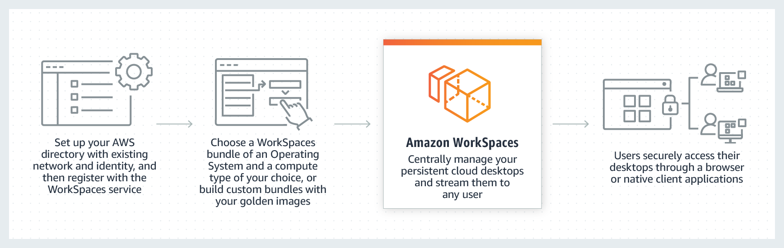
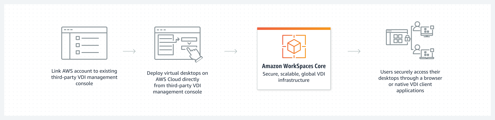
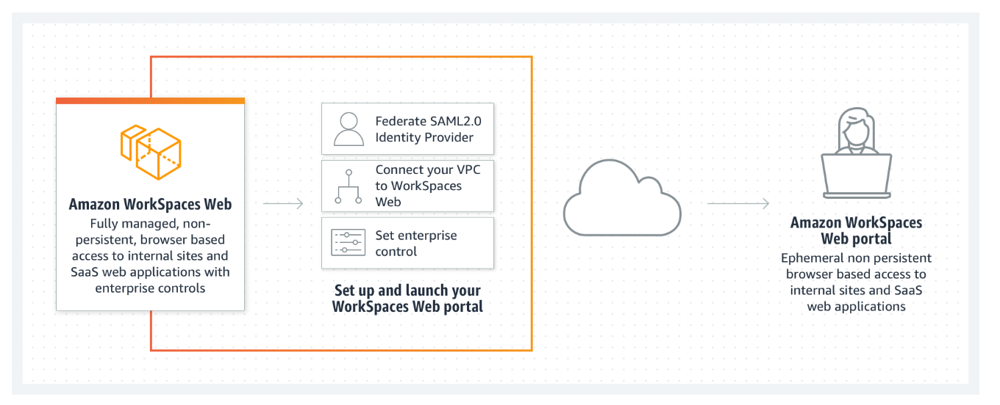
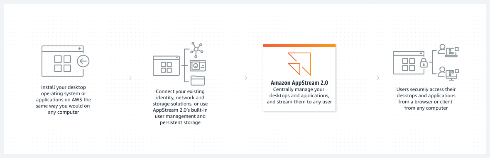

## 최종 사용자 컴퓨팅(End User Computing)

- 최초 작성 일자: 2023-03-22
- 수정 내역:
  - 2023-03-22: 최초 작성

---

### Amazon WorkSpaces

- **클라우드에서의 가상 데스크톱**
- 모든 작업자 유형을 위한 모든 기능이 포함된 완벽한 영구 각상 데스크톱

#### 사용 이유

- 취약한 엔드포인트 디바이스가 아니라 AWS에 저장된 앱 및 데이터에 안전하게 액세스할 수 있다.
- 가동 시간 SLA를 통한 재정적 지원을 바탕으로 생산성을 극대화하고 비즈니스 연속성을 보장한다.
- 오버프로비저닝 및 선결제 비용이 없는 시간당 고정 요금제로 온디맨드로 크기를 조정한다.
- 유연한 데스크톱 구성을 통해 다양한 유형의 원격 작업자를 지원한다.

#### 작동 방식

- Amazon WorkSpaces는 지원되는 모든 디바이스에서 리소스에 액세스할 수 있는 Windows, Linux 및 Ubuntu용 완전관리형 데스크톱 가상화 서비스다.

#### 사용 사례

- **원격 근무 촉진**: 모든 위치에서 액세스 가능한 완벽한 기능의 데스크톱을 제공하여 하이브리드 및 원격 작업자의 생산성을 개선한다.
- **개발자 역량 강화**: 개발자는 AWS를 포함한 여러 환경에서 코드를 빠르게 구축, 테스트 및 배포할 수 있다.
- **강력한 워크스테이션에 온디맨드로 액세스**: 하이엔드 GPU 및 CPU에서 사용량에 따른 시간당 요금으로 컴퓨팅 집약적 워크로드를 실행한다.
- **가상 학습 환경 조성**: 학생과 교육자를 위한 가상 학습 환경을 구축하여 성공을 위한 데스크톱 리소스를 제공한다.

---

### Amazon WorkSpaces Core

- **서드 파티 VDI 솔루션과 함께 사용하도록 설계된 관리형 가상 데스크톱 인프라**

#### 사용 이유

- AWS 클라우드 인프라의 보안 및 신뢰성에 기존 VDI 관리 소프트웨어를 결합하여 VDI 마이그레이션을 간소화한다.
- 99.9% 가동 시간 SLA를 통한 재정적 지원을 바탕으로 생산성을 극대화하고 비즈니스 연속성을 보장한다.
- 오버프로비저닝 및 선결제 비용이 없는 시간당 고정 요금제로 필요에 따라 조정 가능하다.
- 글로벌 인력과 가까운 곳에 위치한 가상 데스크톱을 통해 사용자 경험과 성능을 개선한다.

#### 작동 방식

- Amazon WorkSpaces Core는 API를 통해 서드 파티 VDI 관리 솔루션에서 액세스할 수 있는 클라우드 기반의 완전관리형 가상 데스크톱(VDI)다.

#### 사용 사례

- **원격 근무 촉진**: 고성능 VDI와 익숙한 최종 사용자 경험에 안전하게 액세스할 수 있도록 지원하여 원격 작업자의 생산성을 높인다.
- **강력한 워크스테이션에 온디맨드로 액세스**: 사용량에 따라 시간으로 계측되는 하이엔드 GPU 및 CPU에서 컴퓨팅 집약적 워크로드를 실행한다.
- **VDI 마이그레이션 간소화**: 하이브리드 VDI 배포 전체에서 일관된 관리 및 최종 사용자 경험을 제공하여 원하는 속도로 클라우드로 전환한다.
- **성공적인 BYOD 이니셔티브 시행**: 직원 개인 정보를 보호하고 민감한 회사 데이터를 개인 소유(BYOD) 디바이스에 유지하지 않는다.

---

### Amazon WorkSpaces Web

- **월 최소 7 USD로 브라우저에서 내부 웹 사이트 및 SaaS 앱에 안전하게 액세스**

#### 사용 이유

- 회사 데이터가 엔드포인트 디바이스에 위치하지 않도록 하고 제로 트러스트 이니셔티브를 지원하여 보안 태세를 강화한다.
- 온디맨드 방식으로 제공되며 자동으로 프로비저닝 및 최신 브라우저 버전으로 업데이트하므로 기존 보유 디바이스 사용(BYOD) 요구 사항을 충족하기 쉽다.
- 사용자당 월 요금이 일정하므로 필요 시 자유롭게 확장 또는 축소가 가능하여 비용이 저렴하고 예측이 가능하다.

#### 작동 방식

- WorkSpaces Web은 어플라이언스나 인프라, 전문 클라이언트 소프트웨어 또는 가상 프라이빗 네트워크(VPN) 연결에 대한 관리 부담 없이 기존 웹 브라우저에서 내부 웹 사이트 및 서비스형 소프트웨어(SaaS) 애플리케이션에 대한 보안 액세스를 용이하게 하기 위해 설계된 저렴한 비용의 완전관리형 Linux 기반 서비스다.

#### 사용 사례

- **최종 사용자 생산성**: 모든 디바이스의 브라우저에서 내부 생산성 앱 및 SaaS 앱에 안전하게 액세스할 수 있도록 하여 원격, 사무실, 파견 직원의 생산성을 개선한다.
- **네트워크 및 데이터 보안**: VPN에 연결할 필요 없이 웹 기반 공격을 효과적으로 차단하여 공용 인터넷에서 안전한 브라우징이 가능하다.
- **기존 보유 디바이스 사용(BYOD)**: BYOD 사용자에게 클라이언트 소프트웨어 관리 없이 내부 웹 및 SaaS 앱에 대한 간단하고 안전하며 격리된 브라우저 액세스를 제공한다.

---

### Amazon AppStream 2.0

- **데스크톱 애플리케이션을 안전하게 브라우저로 스트리밍**
- 우수한 보안, 신뢰성 및 확장성을 갖춘 애플리케이션 스트리밍과 저렴한 비용의 가상 데스크톱 서비스

#### 사용 이유

- 모든 위치에서 애플리케이션 및 데스크톱에 안전하게 액세스하여 원격 작업자가 필요로 하는 기능을 제공하고 변화하는 상황에 빠르게 대응할 수 있다.
- 데스크톱 애플리케이션을 리팩토링 없이 서비스형 소프트웨어(SaaS)로 빠르게 변환할 수 있다.
- 광범위한 컴퓨팅, 메모리 및 스토리지 옵션을 통한 온디맨드 클라우드 확장성을 통해 비용을 최적화할 수 있다.
- 완전관리형 애플리케이션 제공 및 99.9%의 가동 시간을 제공하는 안정적인 AWS 인프라를 통해 가동 중단을 줄일 수 있다.

#### 작동 방식

- AppStrema 2.0은 애플리케이션 스트리밍 또는 선택적 지속성을 갖춘 가상 데스크톱 제공용으로 구성할 수 있는 완전관리형 서비스다.
- AppStream 2.0을 가상 데스크톱에 사용하는 경우 저장된 파일 및 애플리케이션 설정이 사용자 세션 간에 지속되며 사용자가 로그온할 때마다 데스크톱이 사용자에게 할당된다.

#### 사용 사례

- **앱을 SaaS로 전환**: 재작성, 특수 하드웨어 또는 디바이스 설치없이 애플리케이션의 서비스형 소프트웨어(SaaS) 버전을 제공할 수 있으며 교육, 평가판 및 소프트웨어 데모에 적합하다.
- **앱 스트리밍**: 애플리케이션 제공을 간소화하고, 필요 시 확장하며, 보안 정책 및 사용자 액세스를 중앙에서 관리할 수 있다.
- **학습 환경**: 느린 네트워크 조건에서도 애플리케이션 및 리소스에 대한 쉽고 안정적인 액세스를 제공하여 온라인 학습을 사용할 수 있다.
- **3D 및 엔지니어링**: 응답이 빠른 고성능 스트리밍 세션을 통해 모든 컴퓨터에서 CAD, CAM 및 CAE 애플리케이션에 액세스할 수 있다.

---

### 참고한 자료

- [Amazon WorkSpaces](https://aws.amazon.com/ko/workspaces/all-inclusive/)
- [Amazon WorkSpaces Core](https://aws.amazon.com/ko/workspaces/core/)
- [Amazon WorkSpaces Web](https://aws.amazon.com/ko/workspaces/web/)
- [Amazon AppStream 2.0](https://aws.amazon.com/ko/appstream2/?nc2=h_ql_prod_eu_as2)