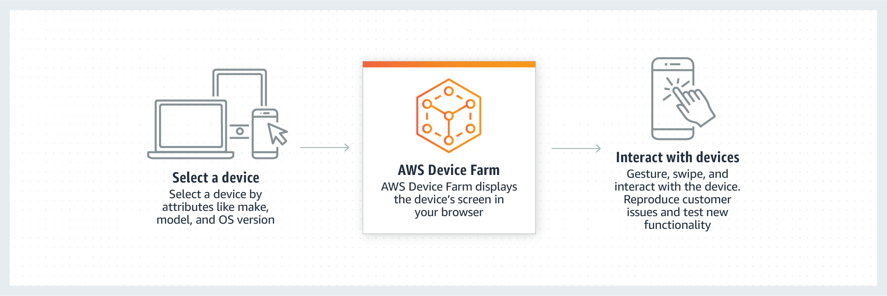

## 프론트엔드 웹 및 모바일(Frontend Web & Mobile)

- 최초 작성 일자: 2023-03-22
- 수정 내역:
  - 2023-03-22: 최초 작성

---

### AWS Amplify

- **확장 가능한 웹 및 모바일 앱 구축, 배포, 호스트**
- 풀 스택 웹 및 모바일 앱을 몇 시간 안에 구축한다. 간편하게 시작하고 확장

#### 사용 이유

- 인증, 데이터, 스토리지 및 기타 기능이 포함된 웹, iOS 또는 Android 앱용 AWS 백엔드를 몇 분안에 생성한다.
- 설계부터 코드에 이르는 Figma 통합을 통해 프론트엔드 UI를 시각적으로 구축하고 클릭 몇 번으로 이 UI를 백엔드에 연결한다.
- 빠르고 안전하며 신뢰할 수 있는 웹 사이트 및 서버 측 렌더링 앱을 클릭 몇 번으로 손쉽게 배포하고 호스팅한다.
- 175개 이상의 AWS 서비스로 앱을 확장하여 새로운 사용 사례, DevOps 사례, 사용자 성장을 지원한다.

#### 작동 방식

- AWS Amplify는 사용 사례가 발전함에 따라 프론트엔드 웹 및 모바일 개발자가 다양한 AWS 서비스를 활용하는 유연성을 바탕으로 AWS에 풀 스택 애플리케이션을 손쉽게 구축, 배송 및 호스팅할 수 있도록 지원하는 완전한 솔루션이다.

- **앱 백엔드 생성**

- **프론트엔드 UI 구축**

- **웹 앱 호스팅**

#### 도구 및 서비스

- **Amplify Studio(시각적 인터페이스)**: 프론트엔드 UI 및 백엔드를 포함한 풀 스택 앱을 빠르게 구축하고 배포할 수 있는 포인트 앤 클릭 환경이다.
- **Amplify CLI(명령줄 인터페이스)**: 명령 몇 개로 앱 백엔드를 구성하고 관리할 수 있는 로컬 도구 체인이다.
- **Amplify 라이브러리(오픈 소스 클라이언트 라이브러리)**: 클라우드 기반 모바일 앱 및 웹 앱을 구축할 수 있는 오픈 소스 라이브러리다.
- **Amplify UI 구성 요소(오픈 소스 설계 시스템)**: 풍부한 기능을 갖춘 앱을 빠르게 구축할 수 있는 클라우드 연결 구성 요소가 포함된 오픈 소스 설계 시스템이다.
- **Amplify 웹 호스팅(관리형 CI/CD 및 호스팅)**: 빠르고 안전하며 안정적인 정적 및 서버 측 렌더링 앱을 위한 완전관리형 CI/CD 및 호스팅이다.

---

### Amazon API Gateway

- **API 구축, 배포 및 관리**
- 모든 규모의 API를 생성, 유지 관리 및 보호
  
- Amazon API Gateway는 어떤 규모에서든 개발자가 API를 손쉽게 생성, 게시, 유지 관리, 모니터링 및 보안 유지할 수 있도록 하는 완전관리형 서비스다.
- API는 애플리케이션이 백엔드 서비스의 데이터, 비즈니스 로직 또는 기능에 액세스할 수 있는 "정문" 역할을 한다.
- API Gateway를 사용하면 실시간 양방향 통신 애플리케이션이 가능하도록 하는 RESTful API 및 WebSocket API를 작성할 수 있다.
- API Gateway는 트래픽 관리, CORS 지원, 권한 부여 및 액세스 제어, 제한, 모니터링 및 API 버전 관리 등 최대 수십만 개의 동시 API 호출을 수신 및 처리하는 데 관계된 모든 작업을 처리한다.

#### 사용 이유

- **효율적인 API 개발**: API Gateway를 사용하여 동일한 API의 여러 버전을 동시에 실행하면 새로운 버전을 빠르게 반복, 테스트 및 릴리즈할 수 있다.
- **어떤 규모에서도 뛰어난 성능**: Amazon CloudFront를 사용하는 엣지 로케이션의 글로벌 네트워크를 활용하여 최종 사용자에게 API 요청 및 응답에 대해 가장 짧은 지연 시간을 제공한다.
- **규모에 따른 비용 절감**: API Gateway는 API 요청에 대해 계층화된 요금 모델을 제공한다.
- **간편한 모니터링**: Amazon CloudWatch를 사용하여 서비스에 대한 호출을 시작적으로 모니터링할 수 있는 API 게이트웨이 대시보드에서 성능 지표와 API 호출, 데이터 지연 시간 및 오류 발생률에 대한 정보를 모니터링한다.
- **유연한 보안 제어**: AWS IAM과 Amazon Cognito를 사용하여 API에 대한 액세스 권한을 부여한다. OAuth 토큰을 사용하는 경우 API Gateway가 기본 OIDC 및 OAuth2 지원을 제공한다.
- **RESTful API 옵션**: HTTP API 또는 REST API를 사용하여 RESTful API를 생성한다. HTTP API는 다수의 사용 사례에 대해 API를 구축하는 가장 좋은 방법이다.

#### 종류

##### RESTful API

- HTTP API를 사용하여 서버리스 워크로드 및 HTTP 백엔드에 최적화된 RESTful API를 구축한다.
- HTTP API는 API 프록시 기능만 필요한 API를 구축할 때 가장 적합하다.

##### WEBSOCKET API

- WebSocket API를 사용하여 채팅 앱 및 스트리밍 대시보드와 같은 실시간 양방향 통신 애플리케이션을 구축한다.
- API Gatewway는 백엔드 서비스와 클라이언트 간의 메시지 전송을 처리하기 위해 지속적인 연결을 유지한다.

#### 작동 방식

---

### Amazon Location Service

- **애플리케이션에 쉽고 안전하게 위치 데이터 추가**

#### 사용 이유

- 여러 공급자의 데이터를 사용하여 다양한 사용 사례 또는 지리적 위치에 맞춰 지리 공간 데이터를 애플리케이션에 쉽게 통합한다.
- AWS 서비스와의 원활한 통합을 통해 빠르게 배포하고 애플리케이션 개발 시간을 단축한다.
- 사용자 프라이버시와 민감한 정보를 보호하고 애플리케이션의 보안 위험을 줄인다.
- 신뢰할 수 있는 데이터 공급자가 제공하는 비용 효율적인 고품질 지리 공간 데이터를 사용한다.

#### 작동 방식

- Amazon Location Service를 사용하면 개발자가 데이터 보안 및 사용자 프라이버시에 영향을 주지 않고도 지도, 관심 지점, 지오코딩, 경로 계산, 추적 및 지오펜싱과 같은 위치 기능을 애플리케이션에 쉽게 추가할 수 있다.

#### 사용 사례

- **자산과 차량을 실시간으로 추적**: 제품과 차량의 현재 및 과거 위치를 파악하여 배송 경로를 결정하고 배차 효율성을 극대화할 수 있다.
- **지도상에 데이터 시각화**: 지도상의 위치 데이터를 검토하여 자산을 시각화하거나 여러 데이터 소스를 결합하고 패턴과 관계를 식별하여 비즈니스 의사 결정을 가속화한다.
- **고객 주소를 더 효율적으로 활용**: 주소 입력을 더 빠르게 완성하고, 지오코딩과 리버스 지오코딩을 사용하여 고객 주소를 더 효율적으로 활용하고 표준화한다.
- **배송 경로 최적화**: 출발지나 하나 이상의 목적지 사이의 이동 시간, 거리 및 방향 데이터를 활용하여 배송 소요 시간과 연료 소비를 줄인다.

---

### Amazon Pinpoint

- **채널 전체에서 사용자 인게이지먼트 개인화**
- 확장 가능한 맞춤형 멀티채널 커뮤니케이션을 통해 고객과 연결

#### 사용 이유

- SMS, 이메일, 푸시 알림, 인앱 메시징, 음성을 통해 고객의 참여를 유도하기 위해 커뮤니케이션을 개인화 및 세분화할 수 있다.
- 240개 이상의 국가 및 지역에 대한 지원을 통해 도달 범위를 확장할 수 있다.
- 캠페인 및 여정을 자동화하여 고객에게 적합한 메시지를 적시에 전송할 수 있다.
- 단일 메시징 허브로의 커뮤니케이션을 집계할 수 있다.

#### 작동 방식

- Amazon Pinpoint는 다수의 채널, 세그먼트 및 캠페인에 걸친 대규모 고객 커뮤니케이션을 지원하는 사용자 지정 가능한 마케터 및 개발자용 도구를 제공한다.

#### 사용 사례

- **안전하게 일회용 비밀번호 전송**: 고유한 로그인 코드가 있는 안전한 일회용 비밀번호를 통해 사용자가 빠르고 쉽게 계정에 액세스할 수 있도록 SMS 또는 이메일 메시지를 전달한다.
- **사용자와 실시간 교류**: 뉴스 속보, 로컬 업데이트, 이벤트 알림에 대한 실시간 알림을 고객 세그먼트에 보낸다.
- **주문 상태 변경 내용 자동 표시**: 주문이 픽업되거나, 운송 중이거나, 집으로 배달될 때 고객에게 자동으로 알린다.
- **타겟 고객 그룹과 연결**: 사용자가 앱이나 플랫폼을 최근에 얼마나 사용했는지 등에 관한 맞춤형 메시지를 고객 세그먼트로 전송한다.

---

### AWS AppSync

- **확장 가능한 완전관리형 GraphQL API**
- 서버리스 GraphQL과 Pub/Sub API로 애플리케이션 개발을 가속화

#### 사용 이유

- 한 번의 네크워크 요청을 통해 하나 이상의 소스 또는 마이크로서비스의 데이터에 액세스할 수 있다.
- 서버리스 WebSocket을 통해 이벤트 소스의 데이터를 구독 클라이언트에 게시하여 매력적인 실시간 환경을 만들 수 있다.
- 오프라인 데이터 동기화, 버저닝, 충돌 해결을 통해 오프라인에서도 데이터와 상호 작용하고 데이터를 업데이트할 수 있다.
- API 요청에 대한 요금 및 연결된 클라이언트로 전송되는 실시간 메시지에 대한 요금만 지불하면 된다.

#### 작동 방식

- AWS AppSync는 단일 엔드포인트를 통해 애플리케이션 개발을 간소화하는 서버리스 GraphQL 및 Pub/Sub API를 생성하여 데이터를 안전하게 쿼리, 업데이트 또는 게시한다.

- **GraphQL API**: AWS AppSync로 구축된 GraphQL API를 통해 프론트엔드 개발자는 단일 GraphQL 엔드포인트에서 여러 데이터베이스, 마이크로서비스 및 API를 쿼리할 수 있다.

- **Pub/Sub API**: 프론트엔드 개발자는 AWS AppSync로 구축된 Pub/Sub API를 사용하여 서버리스 WebSockets 연결을 통해 실시간 데이터 업데이트를 구독 API 클라이언트에 게시할 수 있다.

#### 사용 사례

- **여러 데이터 소스에서 데이터 검색 또는 수정**: 단일 네트워크 호출로 여러 데이터 소스(SQL, NoSQL, 검색 데이터, REST 엔드포인트 및 마이크로서비스)와 상호 작용한다.
- **클라이언트가 중단된 경우 데이터 동기화**: AWS AppSync 및 AWS Amplify DataStore를 사용하여 모바일 및 웹 애플리케이션과 클라우드 간에 데이터를 자동으로 동기화한다.
- **실시간 협업 및 채팅 애플리케이션 구축**: 백엔드에서 연결된 클라이언트 간 데이터를 브로드캐스트하고 대화형 모바일 또는 웹 애플리케이션을 구축한다.
- **IoT 데이터 관리**: AWS IoT 서비스로 전송된 디바이스 데이터에 액세스하여 모바일 또는 웹 애플리케이션에서 실시간 대시보드를 구축한다.

---

### AWS Device Farm

- **실제 디바이스로 AWS 클라우드에서 Android, iOS 및 웹 앱 테스트**
- 데스크톱 브라우저 및 AWS 클라우드에서 호스팅되는 실제 모바일 디바이스에서 호스팅하여 웹 및 모바일 애플리케이션 품질 향상
- AWS Device Farm은 테스트 인프라를 프로비저닝하고 관리하지 않아도 다양한 데스크톱 브라우저 및 실제 모방리 디바이스에서 테스트를 진행하여 웹 및 모바일 앱 품질을 향상시키는 애플리케이션 테스트 서비스다.
- 테스트를 통해 여러 데스크톱 브라우저나 실제 디바이스에서 동시에 테스트를 실행함으로써 테스트 도구 실행 속도를 높이고 비디오 및 로그를 생성하여 앱과 관련된 문제를 빠르게 식별할 수 있다.

#### 사용 이유

##### AWS Device Farm의 실제 디바이스 테스트

- **고객이 사용하는 것과 같은 디바이스 사용**: 다양한 물리적 디바이스와 상호 작용하고 테스트를 수행한다. 에뮬레이터와는 달리, 물리적 디바이스는 메모리, CPU 사용, 위치, 제조업체와 통신 사업자가 펌웨어 및 소프트웨어에 적용한 수정 사항과 같은 요소를 고려함으로써, 사용자가 앱과 상호 작용하는 방식을 좀 더 정확하게 이해하게 해준다.

- **문제를 더 빠르게 재현하고 해결**: 수동으로 문제를 재현하고, 병렬로 자동 테스트를 실행한다. AWS에서는 동영상, 로그 및 성능 데이터를 수집하므로, 이를 분석하여 문제를 신속하게 해결할 수 있다.

- **실제 환경 시뮬레이션**: 실제 사용자 상태를 시뮬레이션하도록 위치, 언어, 네트워크 연결, 애플리케이션 데이터를 구성하고 필수 앱을 설치함으로써 테스트 환경을 미세 조정한다.

- **적합한 테스트 선택**: 스크립팅이 필요 없는 AWS의 내장 테스트 도구를 실행하거나 Appium, Calabash 및 Espresso와 같은 오픈 소스 테스트 프레임워크를 선택하여 테스트를 사용자 정의할 수 있다.

- **개발 워크플로우와 통합**: AWS의 서비스 플러그인과 API를 사용하여 테스트를 자동으로 시작하고 Android Studio와 Jenkins 같은 지속적 통합 환경 및 IDE에서 결과를 확인할 수 있다.

- **클라우드에서 프라이빗 디바이스 랩 직접 설정**: AWS의 프라이빗 디바이스 랩 솔루션을 사용하면 iOS 및 Android 디바이스를 전용으로 선택할 수 있다. Device Farm은 이러한 디바이스에 정확한 구성을 프로비저닝하므로 세션 간에 설정을 유지할 수 있다.

##### AWS Device Farm의 데스크톱 브라우저 테스트

- **여러 브라우저 인스턴스에서 동시에 테스트 실행**: Device Farm의 완전관리형 브라우저 그리드는 필요에 따라 확장되어 여러 테스트를 동시에 실행함으로써 테스트 도구의 실행 속도를 향상시킬 수 있다.

- **문제를 빠르게 식별 및 디버그**: Device Farm이 생성한 비디오, 콘솔 로그, 작업 로그 및 웹 드라이버 로그를 사용하여 웹 앱을 식별하고 분석하며 발생한 문제를 빠르게 해결한다.

- **여러 데스크톱 브라우저 및 브라우저 버전에서 테스트**: Chrome, Firefox 및 Internet Explorer를 포함한 여러 데스크톱 브라우저에서 테스트를 실행하여 서로 다른 브라우저 환경에서 예상한대로 웹 앱이 작동하는지 확인할 수 있다.

#### 작동 방식

##### 실제 모바일 디바이스에서 테스트

- **자동화된 테스트**: AWS 클라우드의 수많은 물리적 디바이스 모음에서 앱을 병렬로 테스트할 수 있다. 내장된 프레임워크 중 하나를 사용하여 테스트 스크립트를 작성하거나 관리하지 않고 애플리케이션을 테스트하거나, 지원되는 자동화 테스트 프레임워크 중 하나를 사용할 수 있다.

- **원격 액세스**: 웹 브라우저에서 직접 실시간으로 디바이스를 동작하고, 스와이프하고, 상호 작용할 수 있다.

##### **데스크톱 브라우저에서 테스트**

- Selenium 테스트를 AWS 클라우드에서 호스팅되는 여러 버전의 Chrome, Internet Explorer 및 Firefox에서 동시에 실행한다.

---

### 참고한 자료

- [AWS Amplify](https://aws.amazon.com/ko/amplify/?nc2=h_ql_prod_mo_awsa)
- [Amazon API Gateway](https://aws.amazon.com/ko/api-gateway/?nc2=h_ql_prod_mo_apig)
- [Amazon Location Service](https://aws.amazon.com/ko/location/?nc2=h_ql_prod_mo_loc)
- [Amazon Pinpoint](https://aws.amazon.com/ko/pinpoint/?nc2=h_ql_prod_mo_pp)
- [AWS AppSync](https://aws.amazon.com/ko/appsync/?nc2=h_ql_prod_mo_apps)
- [AWS Device Farm](https://aws.amazon.com/ko/device-farm/?nc2=h_ql_prod_mo_df)