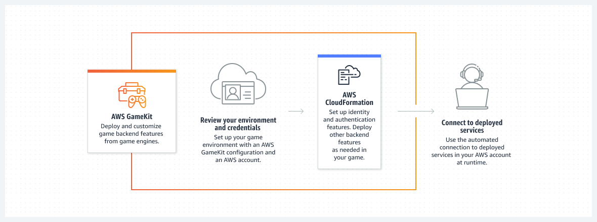

## 게임(Game)

- 최초 작성 일자: 2023-03-22
- 수정 내역:
  - 2023-03-22: 최초 작성

---

### Amazon GameLift

- **간단하고 빠르며 비용 효율적인 전용 게임 서버 호스팅**
- 세션 기반 멀티플레이어 게임을 위한 전용 서버 관리

#### 사용 이유

- 서버 컴퓨팅 비용을 기존 온프레미스 배포 대비 최대 70%까지 절감할 수 있다.
- 사용 가능한 서버 인스턴스 중 지연 시간이 가장 짧은 서버 인스턴스에 플레이어를 연결하고 배치하여 지연 시간을 줄인다.
- 24개의 리전, 8개의 로컬 영역, 60개 이상의 인스턴스 유형에 걸쳐 신뢰할 수 있으며 확장 가능한 AWS 인프라에 액세스할 수 있다.
- 클라우드에서든 온프레미스에서든, 게임 요구 사항에 맞는 기능과 서버 인프라를 자유롭게 선택한다.

#### 작동 방식

- Amazon GameLift는 클라우드, 온프레미스, 또는 하이브리드 배포를 통해 호스팅되는 전용 게임 서버를 배포하고 관리한다.
- GameLift는 변동하는 플레이어 수요를 조정하며 낮은 지연 시간과 저렴한 비용을 제공하는 솔루션이다.

#### 사용 사례

- **전용 게임 서버 확장**: 게임 콘텐츠 개발에 집중하고, 게임 서버 인프라를 구축하고 관리하는 데 소요되는 시간을 최소화한다.
- **Bring Your Own Hardware(BYOH)**: 로컬 워크스테이션에서 게임 빌드 작업을 반복하고 모든 서버 호스팅 인프라에서 게임 세션을 관리한다.
- **클라우드에 서버 워크로드 온보딩**: GameLift FleetIQ로 기존 서버 관리 도구와 소프트웨어를 사용하여 라이브 게임을 이동하고 클라우드에서 새로운 게임을 출시한다.
- **플레이어를 매칭하고 크로스 플레이를 지원**: GameLift FlexMatch를 사용하여 크로스 플랫폼 플레이를 지원하고, 피어 투 피어, 온프레미스 또는 클라우드 게임 서버에 플레이어를 배치하는 규칙을 정의한다.

---

### Amazon GameSparks

- **게임 백엔드 구축**
- 서버 인프라에 대한 걱정 없이 게임 백엔드를 구축

#### 사용 이유

- 최소한의 설정을 통해 기본 제공 게임 기능을 사용하여 게임 플레이를 강화할 수 있다.
- Unity 게임을 통합하여 게임 개발을 가속화할 수 있다.
- 관리형 백엔드 서비스와 지속적인 유지 보수를 통해 시작 비용 및 시간을 줄일 수 있다.
- 게임 증가에 대한 자동 지원을 통해 예측에 따라 확장하고 프로비저닝할 수 있다.

#### 작동 방식

- Amazon GameSparks는 게임 백엔드 기능을 손쉽게 구축, 최적화 및 조정할 수 있는 완전관리형 게임 백엔드 서비스다.

#### 사용 사례

- **게임 기능 즉시 사용**: 플레이어 인증 및 자격 증명, 게임 데이터, 메시징, 리더보드를 위한 완전관리형 서비스로 더 빠르게 구축한다.
- **사용자 지정 게임 로직 생성**: 사전 구축된 게임 기능을 확장하거나 클라우드 코드를 사용하여 게임 백엔드에 대한 사용자 지정 로직을 생성한다.
- **더 빠른 코드 테스트**: 테스트 수단을 사용하여 콘솔에서 클라우드 코드 로직을 확인함으로써 시간을 절약한다.
- **다른 AWS 서비스와의 통합**: Amazon DynamoDB 및 AWS Lambda와 같은 AWS 서비스를 게임 로직과 통합하여 Amazon GameSparks 이상으로 기능을 확장한다.

---

### Amazon Lumberyard

- **AWS 및 Twitch와 통합된 크로스플랫폼 3D 게임 엔진으로 전체 소스까지 무료로 제공**
- 더 이상 제공되지 않으며, **Open 3D Engine(O3DE)**를 사용할 것이 권장된다.

---

### AWS GameKit

- **Unreal Engine에서 직접 게임 백엔드 기능을 배포 및 사용자 지정**
- 게임 엔진에서 직접 클라우드 연결 백엔드 게임 기능을 배포하고 사용자 지정한다.

#### 사용 이유

- AWS CloudFormation 템플릿을 사용하여 백엔드 게임 기능을 구동할 수 있다.
- 사전 구축된 AWS 솔루션으로 플레이어에게 코어 기능을 제공할 수 있다.
- 샘플 자산과 코드를 사용하여 게임 기능 프로토타입을 신속하게 개발할 수 있다.

#### 작동 방식

- AWS GameKit은 클라우드 서비스 아키텍처의 사용 방법을 익힐 필요 없이 클라우드 연결 게임 기능을 만들 수 있도록 도와주는 게임 엔진 통합 도구 키트다.

#### 사용 사례

- **사전 구성된 UI 구성 요소 드래그 앤 드롭**: 즉시 사용할 수 있는 백엔드 게임 기능, 오픈 소스 및 설명서를 사용하여, 진행 중인 게임 프로젝트의 프로토타이핑을 빠르게 시작할 수 있다.
- **전문가가 설계한 솔루션 배포**: AWS Well-Architected Framework를 기반으로 클라우드 아키텍처 전문가가 구축한 보안, 성능 및 복원력이 뛰어난 솔루션을 사용한다.
- **게임 엔진에서 작업 수행**: 게임 엔진의 AWS GameKit 플러그인을 사용하여 클라우드 기반 게임 기능을 지원하는 AWS 리소스를 구성하고 배포한다.
- **AWS에서 게임 백엔드 제어**: AWS 도구를 사용하여 백엔드 서비스를 모니터링, 확장, 사용자 지정하고, AWS에서 생성되고 저장된 데이터를 제어한다.

---

### 참고한 자료

- [Amazon GameLift](https://aws.amazon.com/ko/gamelift/?nc2=h_ql_prod_gt_gl)
- [Amazon GameSparks](https://aws.amazon.com/ko/gamesparks/?nc2=h_ql_prod_gt_gs)
- [Amazon Lumberyard](https://aws.amazon.com/ko/lumberyard/?nc2=h_ql_prod_gt_ly)
- [AWS GameKit](https://aws.amazon.com/ko/gamekit/?nc2=h_ql_prod_gt_gk)