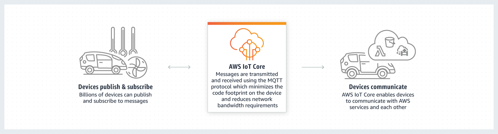
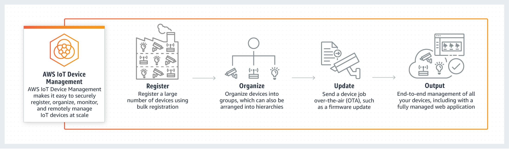

## 사물 인터넷(Internet of Things)

- 최초 작성 일자: 2023-03-22
- 수정 내역:
  - 2023-03-22: 최초 작성

---

### AWS IoT 1-Click

- **클릭 한 번으로 AWS Lambda 트리거 생성**
- 단순한 디바이스에서 AWS Lambda 함수를 시작할 수 있다.

#### 사용 이유

- AWS IoT 1-Click 디바이스에서 AWS Lambda 함수를 사용해 솔루션을 구축하여 클라우드 또는 온프레미스로 작업을 생성할 수 있다.
- 인증서로 사전 프로비저닝되어 있어 지원되는 디바이스를 AWS에 안전하게 연결할 수 있다. 사용자 지정 펌웨어 또는 인증서를 설치하거나 관리할 필요가 없다.
- 콘솔 또는 모바일 애플리케이션을 통해 디바이스를 관리할 수 있다. 기능 또는 위치를 기준으로 그룹화한 다음 디바이스에서 액션을 생성할 수 있다.

#### 작동 방식

- AWS IoT 1-Click 디바이스는 AWS IoT Core에 안전하게 즉시 연결되므로 인증서 관리 없이 배포할 수 있다.

#### 사용 사례

- **AWS Lambda 함수로 상품 및 서비스 재주문**: 클릭 한 번으로 API를 호출하여 온라인 판매자에게 주문하는 Lambda 함수를 생성한다.
- **접객 및 시설 관리 최적화**: 사무실 건물, 호텔, 회의실 또는 공항과 같은 시설에서 원클릭 디바이스로 서비스를 요청하고, 주문을 처리하고, 피드백을 캡처한다.
- **산업 운영 비용 절감**: 장비에 대한 유지 보수 서비스를 보고하고 요청하여 수백만 달러의 잠재 운영 비용을 절약하고 제조 검사의 필요성을 줄인다.
- **한 번의 버튼 클릭으로 지원 받기**: 호춣하도록 구성할 수 있는 파트너 구축 디바이스로 고객 지원 자동화한다.

---

### AWS IoT Analytics

- **IoT 디바이스에 대한 분석**
- AWS IoT Analytics는 자체 IoT 분석 플랫폼을 구축하는 데 일반적으로 필요한 비용과 복잡성에 대해 전혀 걱정할 필요 없이 대규모 IoT 데이터에 대한 정교한 분석을 손쉽게 실행 및 운용할 수 있게 해주는 완전관리형 서비스다.

#### 사용 이유

- **분석 워크플로 운용**: AWS IoT Analytics는 AWS IoT Analytics 또는 Matlab이나 Octave와 같은 외부에 빌드된 사용자 지정 작성 코드 컨테이너를 가져와 일정에 맞춰 실행하여 운영 통찰력을 생성한다.
- **IoT 데이터에 대한 쿼리를 손쉽게 실행**: AWS IoT Analytics에서는 내장된 SQL 쿼리 엔진을 사용해 간단한 임시 쿼리를 실행할 수 있다. 표준 SQL 쿼리를 사용하여 데이터 스토어로부터 데이터를 추출함으로써 예를 들면, 전체 커넥티드 차량의 평균 이동 거리 또는 스마트 빌딩에서 잠긴 문의 수를 계산할 수 있다.
- **IoT에 최적화된 데이터 스토리지**: AWS IoT Analytics는 IoT 쿼리에 빠른 응답 시간을 제공하도록 최적화된 시계열 데이터 스토어에 처리된 디바이스 데이터를 저장한다.
- **분석을 위해 IoT 데이터를 준비**: AWS IoT Analytics는 시계열 분석을 지원하므로 일정 기간 동안 디바이스 성능을 분석하고, 어디에서 어떻게 디바이스가 사용되는지 파악하고, 지속적으로 디바이스 데이터를 모니터링하여 유지 관리 문제를 예측하고, 센서를 모니터링하여 환경 조건을 예측하고 이에 대응할 수 있다.
- **기계 학습을 위한 도구**: 호스팅된 Jupyter 노트북으로 간편하게 IoT 데이터에 기계 학습을 적용할 수 있다. IoT 데이터를 노트북과 직접 연결하고, 기본 인프라를 관리할 필요 없이 AWS IoT Analytics 콘솔에서 모델을 빌드, 학습 및 실행할 수 있다.
- **자동 규모 조정 및 사용한 만큼 지불하는 요금제**: AWS IoT Analytics는 최대 페타바이트 규모까지 IoT 데이터를 지원하도록 자동으로 확장되며 사용한 만큼만 비용을 지불하는 완전관리형 서비스다.

#### 작동 방식

#### 사용 사례

- **스마트 농업**: 연결된 농업 장비의 기사가 AWS IoT Analytics를 사용해 예상되는 강우량으로 습도 센서 데이터를 보강하여 자동화된 관개 장비의 용수 효율성을 최적화할 수 있다.
- **예측 유지 보수**: AWS IoT Analytics를 사용하여 커넥티드 화물 차량의 난방 및 냉각 시스템 장애가 언제 발생할지 예측하고 이를 통해 정비함으로써 화물 피해를 방지할 수 있다.
- **상품을 미리 보충**: 식음료 회사는 AWS IoT Analytics를 사용해 식품 자판기의 데이터를 분석하고, 식품 재고가 떨어져 갈 때마다 미리 해당 자판기와 항목에 대해 상품을 재주문할 수 있다.
- **프로세스 효율성 점수**: AWS IoT Analytics를 사용하여 시간 경과에 따른 각 위치 또는 트럭의 가장 효율적인 적재량을 파악하고, 목표 적재량과 편차를 실시간으로 비교하고, 효율성 개선을 위한 적재 지침을 수립할 수 있다.

---

### AWS IoT Button

- **클라우드 프로그래밍 가능한 대시 버튼**
  
- AWS IoT Button은 Amazon Dash Button 하드웨어를 기반으로 한 프로그램 가능한 버튼이다.
- 이 Wi-Fi 디바이스는 손쉽게 구성할 수 있으며, 개발자가 디바이스별 코드를 따로 작성하지 않고도 AWS IoT Core, AWS Lambda, Amazon DynamoDB, Amazon SNS 등 수많은 Amazon Web Services를 시작할 수 있도록 설계되었다.

#### 작동 방식

- AWS IoT Button을 Wi-Fi 네트워크에 연결하도록 구성하고 버튼을 AWS IoT Core 인증서 및 프라이빗 키로 프로비저닝하고 나면 버튼이 AWS IoT Core에 안전하게 연결되어 버튼을 클릭하면 주제에 대한 메시지를 게시한다.
- AWS IoT 규칙 엔진을 활용하여 규칙을 설정하고, 원하는 AWS 서비스로 라우팅되도록 한 번 클릭, 두 번 클릭 또는 길게 누르기 이벤트를 구성할 수 있다.
- Amazon SNS를 통해 알림을 보내게 하거나 클릭을 Amazon DynamoDB 테이블에 저장하도록 구성할 수도 있다.
- 일반적으로 사용되는 프로그래밍 언어로 작성한 사용자 지정 로직을 AWS Lambda 함수에 코딩한 다음, 이 함수를 타사 서비스 또는 다른 AWS IoT 지원 커넥티드 사물에 연결하도록 구성할 수도 있다.

---

### AWS IoT Core

- **디바이스를 클라우드에 연결**
- 디바이스를 클라우드에 쉽고 안전하게 연결

#### 사용 이유

- 서버를 프로비저닝하거나 관리하지 않고도 쉽고 안정적으로 디바이스 플릿을 연결하고 관리하며 크기를 조정한다.
- MQTT, HTTPS, MQTT over WSS, LoRaWAN을 포함하여 선호하는 통신 프로토콜을 선택한다.
- 상호 인증 및 포괄적인 암호화로 디바이스 연결 및 데이터를 보안한다.
- 정의한 비즈니스 규칙에 따라 즉시 디바이스 데이터를 필터링 및 변환하고 이를 기반으로 운영할 수 있다.

#### 작동 방식

- AWS IoT Core는 인프라를 관리하지 않고도 수십억 개의 IoT 디바이스를 연결하고, 수조 개의 메시지를 AWS 서비스레 라우팅할 수 있게 해준다.

- **메시지 브로커**: 모든 IoT 디바이스와 애플리케이션에서 짧은 대기 시간과 높은 처리량을 기반으로 메시지를 안전하게 메시지를 송수신한다.

- **미러 디바이스 상태**: 디바이스 섀도우를 통해 언제든 확인하거나 설정할 수 있도록 커넥티드 디바이스의 최신 상태를 저장하므로, 애플리케이션에는 디바이스가 언제나 온라인인 것처럼 표시된다.

- **기본 제공 Alexa**: AWS IoT Core의 Alexa Voice Service(AVS) 통합에서는 클라우드에 새로운 가상 Alexa 디바이스를 도입했다. 새로운 AWS IoT 예약 MQTT 주제 세트를 사용하여 디바이스 간 오디오 메시지를 전송한다.

- **LoRaWAN 디바이스**: LoRaWAN 디바이스와 게이트웨이를 AWS 클라우드에 연결하여 프라이빗 LoRaWAN 네트워크를 설정 및 관리한다. 이때 LoRaWAN Network Service(LNS)를 개발하거나 운영할 필요가 없다.

#### 사용 사례

- **업계 운영 모니터링 및 관리**: 예측 품질, 유지 관리 및 원격 운영 모니터링을 위한 업계 IoT 애플리케이션을 구축한다.
- **차별화된 소비재 구축**: 홈 자동화, 홈 보안 및 모니터링, 홈 네트워킹을 위한 커넥티드 애플리케이션을 구축한다.
- **자동차 데이터로 혁신**: 공유되는 커넥티드 자율 및 전기 차량(EV) 애플리케이션을 위한 솔루션을 개발한다.
- **안전 제품 개발**: 교통 모니터링, 공공 치안 및 의료 서비스에서의 모니터링을 위한 상업용 애플리케이션을 설계한다.

---

### AWS IoT Device Defender

- **IoT 디바이스를 위한 보안 관리**
- IoT 디바이스 및 플릿에서 보안 관리

#### 사용 이유

- 디바이스 플릿 전체에서 IoT 리소스의 보안 태세를 감사하여 공백 및 취약점을 손쉽게 식별한다.
- 기계 학습(ML) 모델을 사용하여 자체 디바이스의 동작을 정의함으로써 악성 IP의 트래픽 또는 연결 시도 횟수 급증을 모니터링 한다.
- 감사가 실패하거나 동작 이상이 감지될 때 보안 알림을 받는다. 빠른 조치를 통해 운영 위험을 최소화한다.
- 디바이스 인증서 업데이트, 디바이스 그룹 격리 또는 기본 정책 교체 등의 기본적인 조치를 통해 보안 문제를 손쉽게 완화한다.

#### 작동 방식

- AWS IoT Device Defender를 사용하면 쉽게 구성을 감사하고 디바이스를 인증하며 이상을 탐지하고 IoT 디바이스 플릿을 보안하는 데 도움이 되도록 알림을 수신할 수 있다.

#### 사용 사례

- **보안 평가 자동화**: 보안 모범 사례를 준수하고 디바이스에 이상이 있는지 모니터링하도록 여러 엄격한 보안 수준으로 인증, 권한 부여 및 지속적 감사와 같은 보안 제어 기능을 구현한다.
- **기본 AWS 인터페이스에 경보 전송**: AWS IoT 콘솔, Amazon CloudWatch, Amazon SNS 및 AWS IoT Device Management에 경보를 전송하고, 보안 수정 사항 푸시와 같은 완화 조치를 수행한다.
- **공격 벡터 식별 및 평가**: 알려진 보안 약점을 통해 비보안 네트워크 서비스와 프로토콜의 사용을 탐지하고 무단 디바이스 액세스 또는 데이터 공개를 방지하는 적절한 해결 방안을 계획한다.
- **디바이스 동작 기록에서 이상 분석**: ML 모델을 사용하여 디바이스 데이터 기록을 분석한다. 예를 들어, 지속적으로 메시지 크기 데이터를 수집 및 평가하면 보안 인증 남용과 같은 문제를 포착할 수 있다.

---

### AWS IoT Device Management

- **IoT 디바이스를 온보딩, 조직화 및 원격으로 관리**
- 대규모의 연결된 디바이스를 등록, 분류, 모니터링 및 원격으로 관리

#### 사용 이유

- 플릿 유지 관리 및 워크플로 업데이트를 간소화하도록 유연한 계층 구조에 디바이스를 빠르게 온보딩하고 구성한다.
- 정보에 기반한 의사결정을 내릴 수 있도록 특정 속성에 기반한 디바이스 검색을 필터링하여 시간을 절약한다.
- 디바이스 플릿 상태를 안전하게 원격으로 모니터링하고 추세를 분석하여 문제를 해결하고 대규모로 업데이트를 푸시한다.
- Fleet Hub를 사용하여 플릿 상태를 시각화하고 실시간 작업을 원격으로 수행한다.

#### 작동 방식

- AWS IoT Device Management를 사용하면 대규모의 IoT 디바이스를 등록, 분류 및 모니터링하고 원격으로 관리할 수 있다.
- AWS IoT Core와 통합하여 클라우드에서 손쉽게 디바이스를 연결 및 관리하고 AWS IoT Device Defender를 통해 플릿의 보안 태세를 감사 및 모니터링한다.

- **포괄적인 개요**: 모든 IoT 디바이스를 대량 등록하고 그룹으로 구성하며 무선으로 업데이트하고 쉽게 모니터링한다.

- **보안 터널링**: AWS IoT Device Management는 디바이스 터널(제한된 방화벽 뒤에 설치된 디바이스에 대한 안전한 원격 SSH 세션)의 생성을 지원한다. 이 서비스는 각 디바이스에 대한 안전한 연결을 제공하며 단 몇 번의 클릭으로 문제를 진단하고 해결할 수 있다.

- **작업**: 작업 기능에서는 소프트웨어 업데이트와 기타 원격 작업(디바이스 재부팅 등)을 실행하고 모니터링한다. 이를 통해 하나의 디바이스 또는 전체 플릿에 대한 업데이트를 관리할 수 있다. 배포 속도를 제어하고, 디바이스에 작업이 배포됨에 따라 작업 상태에 대한 실시간 정보를 수신할 수 있다.

- **Fleet Hub**: AWS IoT Device Management에서는 AWS IoT에 연결된 디바이스 플릿을 시각화하고 상호 작용하기 위해 Fleet Hub를 사용하여 완전관리형 웹 애플리케이션을 생성할 수 있다. Fleet Hub를 사용하면 전체 플릿을 검색하여 디바이스 상태 및 상태 데이터를 보고, 경보를 생성하고 작업을 실행하며 AWS IoT Device Defender 지표를 모니터링하여 예측 유지 보수를 수행할 수 있다.

#### 사용 사례

- **디바이스 플릿을 원격으로 모니터링**: 장비 메타데이터를 모니터링하고 서비스 알림을 통해 정책 변경 사항을 설정하여 디바이스 구성이나 특이한 동작에 대한 알림을 제공한다.
- **플릿의 소프트웨어 및 펌웨어 업데이트 관리**: 대량 업데이트를 수행하고 무선 업데이트의 배포 속도를 제어하며 자동 업데이트에 대한 지속적인 작업을 정의한다.
- **대규모로 센서 및 디바이스 그룹화, 구성 및 대상 지정**: 특정 영역의 모든 센서와 같이 디바이스의 논리적 그룹을 생성하여 몇 번의 클릭으로 원격 작업을 위해 플릿을 구성하고 대상을 지정한다.
- **플릿에서 메타데이터 및 연결성 상태 인덱싱**: 디바이스 상태를 파악하고 검색을 최적화하도록 메타데이터를 인덱싱한다. 예를 들어, 특정 펌웨어 버전에 배포된 센서를 빠르게 찾고 개수를 확인한다.

---

### AWS IoT Edukit

- **간단한 IoT 애플리케이션 구축 방법을 학습**
- IoT 관련 정보를 획득할 수 있으며, [공식문서](https://aws.amazon.com/ko/iot/)를 통해 다양한 AWS IoT 서비스에 대한 정보를 얻을 수 있다.

---

### AWS IoT Events

- **IoT 이벤트 감지 및 대응**
- IoT 센서 및 애플리케이션의 이벤트를 탐지 및 대응

#### 사용 이유

- 여러 소스에서 데이터를 수집하여 처리 상태 또는 디바이스 상태를 감지하고 유지 보수 예약을 선제적으로 관리한다.
- 'if-then-else'문을 사용하여 중요한 이벤트 및 센서 속성을 식별하는 사용자 지정 규칙 및 이벤트 로직을 구축할 수 있다.
- 센서와 애플리케이션 데이터를 결합하여 운영 성능 및 품질을 시각화하고, 복잡한 패턴을 인식하고, 자동 알림과 같은 작업을 트리거할 수 있다.
- 해당 디바이스의 모든 인스턴스를 자동으로 확장하고 관리하는 특정 디바이스 유형에 대해 탐지기를 정의하여 플릿 요구 사항을 충족할 수 있다.

#### 작동 방식

- AWS IoT Events는 장비 또는 디바이스 플릿에서 작업 오류 또는 변경 사항을 모니터링하고 필요한 작업을 시작한다.

#### 사용 사례

- **여러 시스템에 걸쳐 원격 측정 데이터 집계**: 여러 공급업체 하위 시스템에서 데이터를 수집하고 복잡한 코드 대신 간단한 논리 표현식을 사용하여 집계한다.
- **경고 알림 시스템 구축 및 사용자 지정**: 식품 부패와 같은 문제를 탐지하는 알림 시스템을 빠르게 구축한다. 부패되기 전에 기술자에게 오작동을 알려 잠재적인 수익 손실을 절감한다.
- **원격 장치 모니터링 및 유지 관리**: 시간이 지나면서 전송된 오류 코드를 사용하여 원격으로 문제를 진단한 다음 기술자가 적절한 유지 관리 조치를 취할 수 있도록 안내한다.
- **중요한 문제에 대한 유지 관리 워크로드의 우선 순위 지정**: 디바이스 이벤트 감지기로 문제 심각도를 분석하고 해당 디바이스 모델을 사용하는 고객을 위해 중요 이벤트에 대한 응답의 우선 순위를 지정한다.

---

### AWS IoT ExpressLink

- **안전한 IoT 디바이스의 빠르고 쉬운 개발**
- AWS 클라우드에 안전하게 연결되는 IoT 디바이스를 빠르고 쉽게 개발

#### 사용 이유

- 디바이스를 클라우드에 빠르게 연결하여 200개가 넘는 AWS 서비스에 쉽게 액세스한다.
- 네트워킹 및 암호화 태스크를 모듈로 오프로드하여 개발 비용을 절감한다.
- 프로세서 크기나 리소스 제약 조건과 관계 없이 최소의 재설계 작업으로 디바이스를 연결한다.
- 디바이스 플릿의 상태를 쉽게 모니터링하고 전체적으로 보안 업데이트를 관리한다.

#### 작동 방식

- AWS IoT ExpressLink는 Espressif, Infineon, u-blox와 같은 AWS 파트너가 개발하고 제공하는 다양한 하드웨어 모듈을 지원한다.
- 연결 모듈은 AWS 필수 보안 요구 사항을 구현하는 소프트웨어를 포함하고 있으므로 빠르고 쉽게 디바이스를 클라우드에 안전하게 연결하고 여러 AWS 서비스와 원활하게 통합할 수 있다.

#### 사용 사례

- **산업용 애플리케이션 현대화**: 산업용 애플리케이션을 처음부터 재설계하지 않고도 현대화한다. AWS IoT ExpressLink는 리소스 제약 조건과 관계 없이 모든 유형의 디바이스에 대해 즉시 연결성을 제공한다.
- **신규 소비재를 빠르게 출하**: 임베드된 디바이스를 클라우드에 안전하게 연결하는 복잡한 작업을 위임하여, 짧은 시간과 적은 비용으로 소비재를 출시한다.
- **스마트 빌딩 및 도시 재창조**: 전체적으로 상업 플릿 센서와 액추에이터의 보안 및 상태를 관리한다. 이들을 AWS IoT 서비스에 쉽게 통합하여 이상을 탐지하고 지표가 정상적인 동작을 벗어날 때 조치를 취한다.

---

### AWS IoT FleetWise

- **거의 실시간으로 차량 데이터를 수집, 변환 및 클라우드로 전송**

#### 사용 이유

- 사용자 지정 데이터 수집 시스템을 개발하지 않고도 차량 플릿에서 표준화된 데이터를 분석할 수 있다.
- 필요한 데이터만 클라우드로 보내 분석하는 지능적인 데이터 수집을 통해 데이터 관련성을 개선할 수 있다.
- 차량 상태 데이터를 거의 실시간으로 수집하여 문제를 빠르게 감지하고 교정 조치를 취할 수 있다.

#### 작동 방식

- AWS IoT FleetWise를 사용하면 차량 데이터를 거의 실시간으로 수집 및 변환하고 클라우드로 전송한 후 이 데이터를 사용하여 차량 품질, 안전 및 자율성을 개선할 수 있다.

#### 사용 사례

- **EV 배터리 상태 유지 관리**: EV 배터리 상태 및 충전 수준을 모니터링하고 운전자의 예상 주행 거리를 개선한다.
- **승객 경험 개선**: 차량 내 인포테인먼트 시스템의 정보를 사용하여 관련성이 더 높은 서비스, 시청각 콘텐츠 및 기능을 제공한다.
- **플릿 운영 개선**: 상업용 플릿 데이터의 인사이트를 사용하여 운전자 안전, 차량 가동 시간 및 유지 관리 일정을 분석한다.

---

### AWS IoT Greengrass

- **디바이스를 위한 로컬 컴퓨팅, 메시징 및 동기화**
- 더 빠르게 지능형 IoT 디바이스 구축

#### 사용 이유

- 사전 구축되었거나 사용자 지정 모듈형 구성 요소를 사용하여 더 빠르게 구축할 수 있다. 이를 통해 보다 쉽게 추가하거나 제거하여 디바이스 소프트웨어 공간을 제어할 수 있다.
- 펌웨어 업데이트 없이도 대규모로 원격으로 디바이스 소프트웨어 및 구성을 배포하고 관리한다.
- 클라우드 처리 및 로직을 엣지 디바이스에 로컬로 가져와 간헐적 연결 조건에서도 작동한다.
- 높은 가치의 데이터만 전송하도록 디바이스를 프로그래밍하여 저렴한 비용으로 풍부한 인사이트를 보다 쉽게 제공한다.

#### 작동 방식

- **디바이스 소프트웨어 구축, 배포 및 관리**: AWS IoT Greengrass는 디바이스 소프트웨어를 구축, 배포, 관리하기 위한 오픈소스 엣지 런타임이며 클라우드 서비스다.

- **AWS IoT Greengrass 디바이스 연결성**: IoT 디바이스는 마이크로 컨트롤러 기반 소형 디바이스에서 대형 어플라이언스까지 크기가 다양하다. AWS IoT Greengrass Core 디바이스, AWS IoT Device SDK 지원 디바이스 및 FreeRTOS 디바이스는 서로 통신할 수 있도록 구성할 수 있다. AWS IoT Greengrass Core 디바이스에서 클라우드와 연결이 끊어지더라도 커넥티드 디바이스는 로컬 네트워크를 통해 계속해서 서로 통신할 수 있다.

- **기능을 추가하고 AWS 서비스에 연결하기**: AWS IoT Greengrass는 사전 구축된 구성 요소를 제공하므로 코드를 작성하지 않고도 엣지 디바이스 기능을 쉽게 확장할 수 있다. AWS IoT Greengrass 구성 요소를 사용하면 기능을 추가하고 엣지에서 AWS 서비스 또는 서드 파티 애플리케이션에 신속하게 연결할 수 있다.

#### 사용 사례

- **엣지에서 실행**: AWS IoT Greengrass를 사용하면 정밀 농업에서 이상 탐지와 자율 디바이스 강화와 같은 인텔리전스를 엣지 디바이스에서 쉽게 이용할 수 있다.
- **앱 관리**: 언어, 패키징 기술 또는 런타임을 사용하여 여러 플릿에 신규 또는 기존의 앱을 배포한다.
- **플릿 제어**: MQTT나 다른 프로토콜을 사용하여 원격으로 또는 로컬로 현장에서 디바이스 플릿을 관리하고 작동한다.
- **로컬로 처리**: 로컬로 데이터를 수집, 집계, 필터링 및 전송한다. 최적화된 분석과 보관을 위해 클라우드로 이동하는 데이터를 관리하고 제어한다.

---

### AWS Iot RoboRunner

- **로봇 플릿의 원활한 연동을 돕는 애플리케이션 구축**
- 로봇 플릿이 원활하게 함께 작동하는 데 도움이 되는 애플리케이션 구축

#### 사용 이유

- 다양한 공급업체의 모바일 로봇 간의 원활한 협업을 통해 새로운 자동화 사용 사례를 잠금 해제한다.
- 공통 아키텍처를 사용하여 서로 다른 차량 관리 시스템을 빠르고 안전하게 통합한다.
- 단일 디스플레이 내에서 다중 공급업체 제품군을 관리하는 애플리케이션 구축의 복잡성을 줄인다.

#### 작동 방식

- AWS IoT RoboRunner는 여러 공급업체의 로봇 시스템을 통합하고 차량 관리 애플리케이션을 구축하기 위한 인프라를 제공한다.

#### 사용 사례

- **로봇 상호 운용성 촉진**: 확장 가능하고 유연한 로봇 자동화 인프라를 사용하여 여러 공급업체의 다양한 로봇 유형을 통합한다.
- **공유 공간 관리 구현**: 공유 공간에서 다중 공급업체 로봇을 조율하여 자재 취급 프로세스 및 운영 흐름을 가속화한다.
- **단일 시스템을 통한 로봇 모니터링**: AWS IoT RoboRunner API를 사용하여 단일 통합 디스플레이에서 로봇 위치 및 상태 모니터링과 같은 애플리케이션을 구축한다.

---

### AWS IoT SiteWise

- **IoT 데이터 수집기 ​​및 해석기**
- 산업 장비에서 대규모로 데이터 수집, 구성 및 분석

#### 사용 이유

- 추가적인 소프트웨어 개발 없이도 산업 장비에서 대규모로 데이터를 수집, 관리 및 시각화한다.
- 원격 장비 성능 모니터링을 통해 더 빠르게 문제를 식별 및 해결한다.
- 사용자 지정 가능한 자동 데이터 시각화를 통해 얻은 인사이트를 바탕으로 시설 포트폴리오 전반의 프로세스를 최적화한다.
- 산업 데이터를 로컬에서 수집 및 처리하고, 엣지와 클라우드 전반에서 원활하게 작동하는 하이브리드 산업 애플리케이션을 구축한다.

#### 작동 방식

- AWS IoT SiteWise는 산업 장비 데이터의 수집, 구성 및 분석을 간소화하는 관리형 서비스다.

#### 사용 사례

- **생산 효율성 개선**: 여러 생산 라인 및 시설에서 얻은 센서 데이터 스트림을 구성하여 모든 위치에서 효율성을 높인다.
- **제조 운영 개선**: 제조 라인, 조립 로봇 및 설비 장비의 성능 지표를 모니터링하고 개선을 적용할 기회를 탐색하여 이를 수행한다.
- **자산 유지 관리 최적화**: 기존 데이터 및 실시간에 가까운 데이터를 사용하는 원격 자산 모니터링을 통해 장비 문제를 보다 신속하게 예방, 탐지 및 해결한다.

---

### AWS IoT TwinMaker

- **실제 시스템의 디지털 트윈을 손쉽게 생성하여 운영 최적화**

#### 사용 이유

- 데이터를 다른 위치로 다시 수집하거나 이동할 필요 없이 이미 있는 곳에서 기존 IoT, 비디오 및 엔터프라이즈 애플리케이션 데이터를 사용한다.
- 실제 환경을 정확하게 모델링하기 위해 데이터 소스를 물리적 시스템의 가상 복제본에 바인딩하는 자동 생성 지식 그래프로 시간을 절약한다.
- 시스템 및 운영에 대한 몰입형 3D 보기를 통해 효율성을 최적화하고 생산량을 늘리며 성과를 개선한다.

#### 작동 방식

- AWS IoT TwinMaker를 사용하면 개발자가 건물, 공장, 산업 장비 및 생산 라인과 같은 실제 시스템의 디지털 트윈을 보다 쉽게 생성할 수 있다. 
- AWS IoT TwinMaker는 디지털 트윈을 구축하는 데 필요한 도구를 제공하여 건물 작업을 최적화하고 생산량을 늘리고 장비 성능을 개선하는 데 도움이 된다.
- 여러 소스의 기존 데이터를 사용하고 물리적 환경의 가상 표현을 생성하고 기존 3D 모델을 실제 데이터와 결합하는 기능을 통해 이제 디지털 트윈을 활용하여 더 빠르고 적은 노력으로 운영에 대한 전체론적 보기를 생성할 수 있다.

#### 사용 사례

- **제조 공장의 현장 운영 개선**: 작업자 생산성과 효율성을 개선하기 위해 생산 현장에서 장비 및 프로세스 이상을 신속하게 찾아내고 해결한다.
- **원격 시설에서 장비 가동 시간 증가**: 모든 관련 운영 데이터에 즉시 액세스하여 장비 문제를 원격으로 진단하여 더 빠른 의사결정을 가능하게 한다.
- **상업용 건물의 임차인 경험 향상**: 실시간 및 과거 온도, 점유, 실내 및 열린 공간 내 공기질 데이터를 모니터링하여 점유자의 편안함을 개선한다.

---

### AWS Partner Device Catalog

- **선별된 AWS 호환 IoT 하드웨어 카탈로그**
- 성공적인 IoT 솔루션을 구축하고 제공하는 데 도움이 되는 AWS 서비스와 함께 작동하는 검증된 하드웨어를 찾을 수 있다.

---

### FreeRTOS

- **마이크로컨트롤러용 실시간 운영 체제**
- 리소스 제약이 있는 디바이스를 위한 실시간 운영 체제

#### 사용 이유

- 40개 이상의 아키텍처에 구현된 실시간 운영 시스템을 통해 출시 기간을 단축할 수 있다.
- 클라우드 서비스와 보다 쉽게 통합되는 신뢰할 수 있고 응답성이 우수한 커널을 사용할 수 있다.
- 모듈식 소프트웨어 라이브러리를 사용하여 설계를 관리 및 유지하고 무선 업데이트(OTA) 보안 패치 및 펌웨어 업데이트를 수행할 수 있다.
- FreeRTOS 장기 지원(LTS) 및 확장 유지 보수 플랜(EMP)을 통해 비즈니스 위험을 줄일 수 있다.

#### 작동 방식

- FreeRTOS는 오픈 소스로 제공되는 클라우드 중립적인 실시간 운영 체제로, 빠르고 믿을 수 있으며 응답 속도가 빠른 커널을 제공한다.
- FreeRTOS는 MIT 오픈 소스 라이선스로 자유롭게 배포할 수 있고 40개 이상의 아키텍처에 구현되어 있기 때문에 미리 패키징된 소프트웨어 라이브러리 세트와 함께 광범위한 하드웨어 중에서 원하는 하드웨어를 선택할 수 있다.

#### 사용 사례

- **여러 상업용 장비 태스크 관리**: FreeRTOS는 비디오 프로모션 및 음료 선택 태스크를 동시에 실행하는 IoT 활성화 자동 판매기처럼 여러 동일한 프로세서 코어에서 태스크 일정 예약을 지원한다.
- **로컬에서 데이터 수집 및 처리**: 산업용 디바이스 시스템 성능에 대한 데이터를 수집하고 실시간으로 중요한 로컬 조치를 취하여 서비스 중단을 방지한다.
- **원격으로 디바이스 업데이트**: 통합 OTA 업데이트 솔루션을 위해 AWS IoT Device Management와 FreeRTOS 디바이스를 함께 사용하여 디바이스를 안전하게 유지 관리하고 업데이트한다.

---

### 참고한 자료

- [AWS IoT 1-Click](https://aws.amazon.com/ko/iot-1-click/?nc2=h_ql_prod_it_1clk)
- [AWS IoT Analytics](https://aws.amazon.com/ko/iot-analytics/?nc2=h_ql_prod_it_iota)
- [AWS IoT Button](https://aws.amazon.com/ko/iotbutton/?nc2=h_ql_prod_it_iotb)
- [AWS IoT Device Management](https://aws.amazon.com/ko/iot-device-management/?nc2=h_ql_prod_it_dm)
- [AWS IoT EduKit](https://aws.amazon.com/ko/iot/)
- [AWS IoT Events](https://aws.amazon.com/ko/iot-events/?nc2=h_ql_prod_it_ev)
- [AWS IoT ExpressLink](https://aws.amazon.com/ko/iot-expresslink/?nc2=h_ql_re_iot)
- [AWS IoT FleetWise](https://aws.amazon.com/ko/iot-fleetwise/?nc2=h_ql_re_iot)
- [AWS IoT Greengrass](https://aws.amazon.com/ko/greengrass/?nc2=h_ql_prod_it_gg)
- [AWS IoT RoboRunner](https://aws.amazon.com/ko/roborunner/?nc2=h_ql_prod_it_rr)
- [AWS IoT SiteWise](https://aws.amazon.com/ko/iot-sitewise/?nc2=h_ql_prod_it_sw)
- [AWS IoT TwinMaker](https://aws.amazon.com/ko/iot-twinmaker/?nc2=h_ql_re_iot)
- [AWS Partner Device Catalog](https://devices.amazonaws.com/?nc2=h_ql_prod_it_pdc)