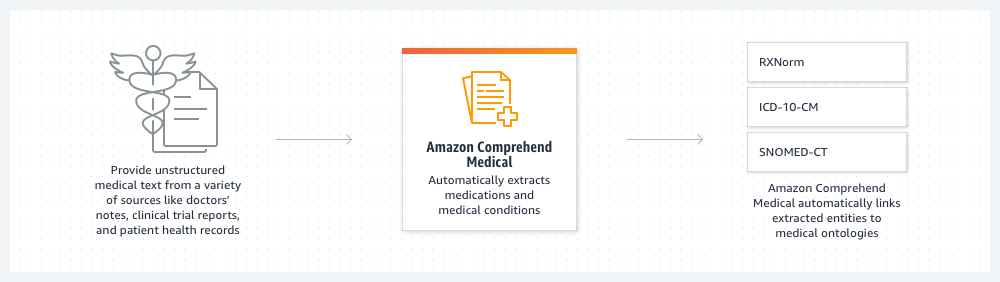
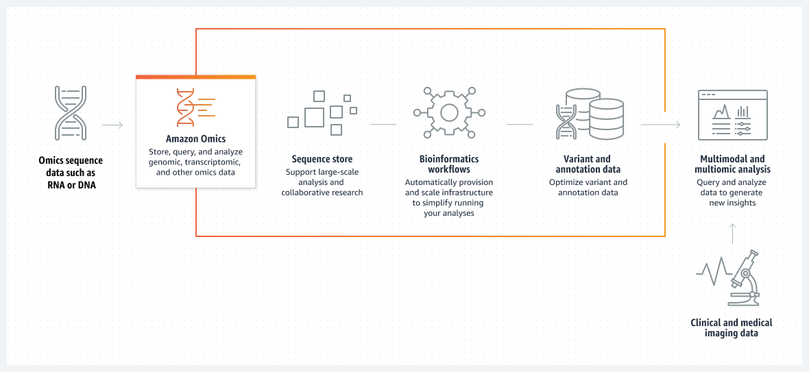

## 머신러닝(Machine Learning)

- 최초 작성 일자: 2023-03-23
- 수정 내역:
  - 2023-03-23: 최초 작성

---

### Amazon SageMaker

- **기계 학습 모델을 대규모로 구축, 훈련 및 배포**
- 완전관리형 인프라, 도구 및 워크플로를 사용하여 모든 사용 사례에 대해 기계 학습 모델을 구축, 훈련 및 배포한다.

#### 사용 이유

- 데이터 사이언티스트를 위한 IDE와 비즈니스 분석가를 위한 코드 없는 인터페이스 등의 도구를 선택하여 더 많은 사람들이 기계 학습으로 혁신할 수 있도록 지원한다.
- 기계 학습을 위한 대량의 정형 데이터(테이블형 데이터) 및 비정형 데이터(사진, 비디오, 지리공간 및 오디오)에 액세스하고 레이블을 지정하고 처리한다.
- 최적화된 인프라로 훈련 시간을 몇 시간에서 몇 분으로 단축할 수 있다. 목적별 도구를 사용하여 팀 생산성을 최대 10배까지 높일 수 있다.
- 조직 전체에서 MLOps 방식 및 거버넌스를 자동화하고 표준화하여 투명성 및 감사 가능성을 지원한다.

---

### Amazon SageMaker for Business Analysts

- **정확한 ML 예측 생성 - 코드 필요 없음**

#### 사용 이유

- 포인트 앤 클릭 인터페이스를 사용하여 쉽게 데이터를 준비하고, 모델을 훈련하고, 예측을 생성한다.
- 데이터 과학자와 모델 및 데이터 세트를 공유하여 협업을 개선한다.
- AutoML은 Domo, Snowflake 및 Amazon Redshift와 같은 일반적인 BI 도구에 통합된다.

#### 작동 방식

---

### Amazon SageMaker for Data Scientist

- **기계 학습 수명 주기를 위한 통합 개발 환경(IDE)**

#### 사용 이유

- 정형 및 비정형 데이터 소스의 데이터에 액세스
- 목적별 도구로 생산성 향상
- 완전관리형 Jupyter Notebook을 클릭 몇 번으로 사용

---

### Amazon SageMaker for MLOps

- **대규모로 빠르게 고성능 프로덕션 ML 모델 제공**

#### 사용 이유

- 반복 가능한 훈련 워크플로를 만들어 모델 개발 가속화
- 재현성과 거버넌스를 위해 ML 아티팩트를 중앙에서 분류
- CI/CD 파이프라인과 ML 워크플로를 통합하여 프로덕션으로 보다 빠른 이전
- 프로덕션에서 지속적으로 데이터 및 모델을 모니터링하여 품질 유지

#### 작동 방식

---

### Amazon Augmented AI(Amazon A2I)

- **ML 예측의 인적 검토를 손쉽게 구현**
- 기계 학습 예측 결과에 대한 인적 검토를 손쉽게 구현
  
- Amazon Augmented AI는 인적 검토에 필요한 워크플로를 쉽게 구축할 수 있는 기계 학습 서비스다.
- Amazon A2I는 AWS에서 실행되든 아니든, 모든 개발자에게 인적 검토 시스템을 구축하거나 많은 수의 인적 검토자를 관리하는 것과 관련하여 획일적으로 발생하는 작업 부담을 덜어준다.

#### 사용 이유

- **ML 예측의 인적 검토를 손쉽게 구현**: Amazon A2I는 사용자의 특정 요구 사항에 따라 인적 검토를 ML 애플리케이션에 통합할 수 있는 유연성을 제공한다. 신뢰도가 낮은 예측 결과는 검토와 조치를 취할 수 있도록 검토자에게 보내진다.
- **사람의 감시를 애플리케이션에 통합**: Amazon A2I는 기계 학습 경험 없이도 기계 학습 워크플로에 사람의 감시를 통합할 수 있는 쉬운 방법을 제공한다. 
- **더 빨리 시장 진출**: Amazon A2I를 워크플로에 통합하면 기계 학습을 통해 더 빨리 시장에 진출할 수 있을 뿐만 아니라 시간이 지남에 따라 모델을 업데이트하고 다시 훈련할 수 있다.

#### 작동 방식

#### 사용 사례

- **의료 서비스**: Amazon A2I 및 Amazon Textract를 사용하여 문서를 처리하고, 데이터를 추출하고, 중요한 데이터를 검토할 수 있다. 이렇게 하면 문서를 처리할 때 시간과 비용을 절약할 수 있으며, 미묘한 데이터나 중요한 데이터 또는 감사 예측을 사람이 지속적으로 검토할 수 있다.

- **금융 서비스**: Amazon Textract 및 Amazon A2I를 사용하면 정형 데이터이든 비정형 데이터이든 관계없이 이러한 양식에서 중요한 데이터를 추출하고 결과를 인적 검토할 수 있다. DealNet Capital은 금융 양식을 처리하기 위해 Amazon Textract 및 Amazon A2I를 사용하고 있으며, 이로 인해 수동으로 서류를 검토하는 데 소요되는 시간이 최대 80% 단축되었다.

---

### Amazon CodeGuru

- **가장 비경제적인 코드 줄 찾기**
- 보안 취약성 탐지 및 코드 검토 자동화
- Amazon CodeGUru는 코드 품질을 높이고 애플리케이션에서 가장 비경제적인 코드 줄을 찾아낼 수 있도록 지원하는 지능형 권장 사항을 제공하는 개발자 도구다.
- CodeGuru를 기존 소프트웨어 개발 워크플로에 통합하면 애플리케이션 개발 중에 코드 검토를 자동화하고, 프로덕션에서 애플리케이션 성능을 지속적으로 모니터링하며, 코드 품질 및 애플리케이션 성능 개선을 위한 권장 사항과 시각적 단서를 제공하고, 전체 비용을 절감할 수 있다.

#### 작동 방식

- CodeGuru 리뷰어 및 프로파일러를 개발 파이프라인에 통합하여 코드 품질을 개선하고 애플리케이션 성능을 최적화할 수 있다.

#### Amazon CodeGuru Reviewer

- 수십 년간 축적된 지식과 경험을 바탕으로 훈련된 CodeGuru Reviewer는 기계 학습 및 자동화된 추론, AWS 및 보안 모범 사례, 그리고 수천 개의 오픈 소스 및 Amazon 리포지토리에서 수백만 건의 코드 검토를 통해 힘들게 얻은 교훈을 기반으로 코드 검토를 자동화한다. 

##### 사용 이유

- **프로덕션으로 이동 전에 코드 문제 포착**: 개발자는 코드를 검토할 때 개발 프로세스를 달리 변경하지 않고도 코드를 리포지토리에 커밋하고 CodeGuru Reviewer를 코드 검토자 중 하나로 추가한다. CodeGuru Reviewer는 리포지토리에서 기존 코드 베이스를 분석하고, 높은 정확도로 찾기 어려운 버그와 중요한 문제를 식별하며, 이를 해결하는 방법에 대한 지능형 제안 사항을 제공하고, 연속적인 코드 검토를 위한 기준을 생성한다.
- **보안 취약성 해결**: CodeGuru Reviewer 보안 탐지기는 자동화된 추론, 그리고 수년에 걸친 AWS의 보안 경험을 바탕으로 코드 보안을 개선한다. CodeGuru Reviewer 보안 탐지기는 GitHub Action을 통해 애플리케이션 개발 CI/CD 프로세스에 직접 보안 검토를 통합할 수 있게 하며, 코드가 AWS KMS, Amazon EC2, API, 일반적인 Java, Python dkaghghk, TLS/SSL 라이브러리에 대한 모범 사례를 따르도록 보장한다.
- **지속적인 모니터링을 통해 코드 품질을 사전에 개선**: CodeGuru Reviewer는 시작된 모든 풀 요청에 대해 증분 코드 변경을 자동으로 분석하고 풀 요청에서 직접 권장 사항을 게시한다. 또한, 정기적인 코드 유지 관리를 위한 전체 리포지토리 또는 코드베이스 검사와 코드 실사 이니셔티브를 지원하여 코드 품질을 일관되게 유지한다.

#### Amazon CodeGuru Profiler

- CodeGuru 프로파일러는 프로덕션에서 실행 중인 애플리케이션의 성능을 최적화하고 가장 비경제적인 코드 줄을 식별한다. 
- 항상 애플리케이션 성능 최적화를 검색하고, 이러한 코드를 수정하여 CPU 사용률을 줄이고 컴퓨팅 비용을 절감하고 애플리케이션 성능을 개선할 방법을 권장한다.

##### 사용 이유

- **성능 문제 해결**: CodeGuru 프로파일러는 애플리케이션의 런타임 데이터를 분석하여 CPU 및 메모리 사용률을 개선하고 성능 문제를 해결하여 지연 시간 및 처리량을 개선한다. CodeGuru 프로파일러는 CPU 사용률에 대한 최소한의 오버헤드로 프로덕션에서 지속적으로 실행된다.
- **애플리케이션 성능 이상 및 일반적인 성능 문제 발견**: CodeGuru 프로파일러는 애플리케이션 스택에서 더 많은 CPU를 소비하기 시작하거나 대기 시간을 늘리는 중요한 메서드의 성능 이상을 자동으로 탐지하고 5분 간격으로 업데이트되는 탐지 보고서를 제공한다.
- **지금 바로 가장 비경제적ㅇ니 코드 줄 찾기**: 코드와 애플리케이션의 효율성이 높을수록 실행 비용이 감소한다. CodeGuru 프로파일러는 성능 문제를 해결하는 방법에 대한 시각화 및 권장 사항을 제공하여 프로덕션에서 실행되는 모든 애플리케이션의 운영 비용을 최대 50%까지 절감한다.

---

### Amazon CodeWhisperer

- **ML 기반 코딩 컴패니언으로 더 빠르게 앱 빌드**

#### 사용 이유

- IDE의 코드 및 주석을 기반으로 한 자동 코드 권장 사항으로 애플리케이션 개발을 가속화한다.
- 개발자가 인공 지능(AI)을 책임감 있게 사용하여 구문적으로 정확하고 안전한 애플리케이션을 만들 수 있도록 지원한다.
- 웹에서 코드 스니펫을 검색하고 사용자 지정할 필요 없이 전체 기능과 논리적 코드 블록을 생성한다.
- 모든 Java, JavaScript 프로젝트에 대한 실시간 맞춤형 코드 권장 사항을 통해 집중할 수 있다.

#### 작동 원리

- Amazon CodeWhisperer는 IDE(통합 개발 환경)의 자연어 및 코드에 대한 의견을 기반으로 코드 권장 사항을 생성하여 개발자 생산성을 개선하는 데 도움이 되는 기계 학습(ML) 기반 서비스다.

#### 사용 사례

- **차세대 애플리케이션 개발**: 개발자에게 자동 코드 추천 기능을 제공하여 프론트엔드 및 백엔드 개발을 가속화한다.
- **애플리케이션에서 ML 사용**: CodeWhisperer를 사용하여 ML 모델을 구축하고 교육하는 코드를 생성하여 시간과 노력을 절약할 수 있다.
- **AWS 서비스를 사용하여 애플리케이션 구축**: Amazon EC2, AWS Lambda, Amazon S3를 포함하여 가장 널리 사용되는 서비스에서 AWS API에 대한 코드 권장 사항을 사용하여 개발 프로세스 속도를 높인다.
- **단위 테스트 생성 자동화**: 반복적인 단위 테스트 코드 작성을 오프로드한다. 자연어 주석을 기반으로 CodeWhisperer는 구현 코드와 일치하는 단위 테스트 코드를 자동으로 추천한다.

---

### Amazon Comprehend

- **텍스트에서 통찰력과 관계 발견**
- 문서 내의 텍스트에서 유용한 인사이트를 도출하고 이해

#### 사용 이유

- 문서 내 텍스트, 고객 지원 티켓, 제품 리뷰, 이메일, 소셜 미디어 피드 등에서 소중한 인사이트를 찾을 수 있다.
- 텍스트, 주요 문구, 주제, 감정 등을 보험 청구와 같은 문서에서 추출하여 문서 처리 워크플로를 단순화한다.
- 기계 학습 경험 없이도 문서를 분류하고 용어를 식별하도록 모델을 훈련하여 비즈니스를 차별화한다.
- 문서에서 개인 식별 정보(PII)를 식별하고 교정하여 민감한 데이터에 대한 액세스 권한이 있는 사람을 보호하고 제어한다.

#### 작동 방식

- Amazon Comprehend는 기계 학습을 사용하여 텍스트에서 유용한 인사이트 및 관계를 찾아내는 자연어 처리(NLP) 서비스다.

#### 사용 사례

- **비즈니스 및 고객 센터 분석 심화**: 고객 감정을 감지하고 고객 상호 작용을 분석한 후 인바운드 지원 요청을 자동으로 분류한다. 제품 개선을 위해 고객 설문 조사에서 인사이트를 추출한다.
- **제품 리뷰 인덱싱 및 검색**: 키워드 외에 핵심 문구, 엔티티 및 감정을 인덱싱하는 기능을 검색 엔진에 포함하여 컨텍스트에 초점을 맞춘다.
- **법률 문서 관리**: 계약서와 법원 기록과 같은 법률 문서 패킷에서 인사이트 추출을 자동화한다. 개인 식별 정보(PII)를 식별 및 교정하여 문서를 추가적으로 보안한다.
- **금융 문서 처리**: 금융 문서에서 금융 이벤트 간 관계를 파악하거나 보험 청구나 모기지 패키지와 같은 금융 서비스 문서에서 엔티티를 분류하고 추출한다.

---

### Amazon Comprehend Medical

- **의료 데이터 추출**
- 비정형 의료 텍스트에서 정확하고 빠르게 정보 추출

#### 사용 이유

- 진단서, 임상 시험 보고서 또는 방사선 보고서와 같은 비정형 의료 텍스트에서 의료 정보 추출
- 추출된 의료 정보 간의 상관 관계를 파악하고 ICD-10-CM, RxNorm 및 SNOMED CT와 같은 의료 온톨로지에 연결
- 사용하기 쉬운 API를 통해 비정형 의료 텍스트 처리 및 코딩을 자동화하고 비용 절감
- HIPAA 적격 서비스를 사용하여 환자 데이터 프라이버시 솔류션을 구현하고 개인 건강 정보(PHI)를 식별

#### 작동 방식

- Amazon Comprehend Medical은 HIPAA 적격 자연어 처리(NLP) 서비스로, 미리 학습된 기계 학습을 사용하여 처방전, 처치, 진단과 같은 의료 텍스트에서 의료 데이터를 파악하고 추출한다.

#### 사용 사례

- **보험 청구 처리 가속화**: 의료 보험사에 대한 청구 캡처, 검증 및 승인 워크플로를 자동화하여 청구 처리를 가속화하고 단순화한다.
- **모집단 의료 개선**: 비정형 모집단 의료 데이터를 분석하여 진료 격차 파악 및 병원 효율성 개선과 같이 의료 결과를 개선한다.
- **의약품 부작용 모니터링 크기 조정 및 가속화**: 의약품의 부작용을 신속하게 파악하여 의약품 안정성을 개선하고 규제 요구 사항을 충족한다.
- **의료 집단 분석 수행**: 임상 시험에 대한 올바른 환자 그룹을 선택하여 더 빠르고 정확하게 환자 시험 선택을 하고 비용을 줄인다.

---

### Amazon DevOps Guru

- **ML 기반 클라우드 운영 서비스**
- ML 기반 클라우드 작업으로 애플리케이션 가용성 개선

#### 사용 이유

- Amazon.com과 AWS의 운영 우수성을 기반으로 수년간 축적된 정보가 담긴 기계 학습(ML) 모델을 사용하여 애플리케이션의 이상 동작을 감지한다.
- 이상 동작에 대한 인사이트 및 상황 정보와 함께 실행 가능한 권장 조치를 수신한다.
- 애플리케이션 지표, 로그 및 이벤트를 자동으로 분석하여 동작 및 시스템 아키텍처 변경에 맞게 조정한다.
- ML 모델을 사용하여 경보 잡음을 제한함으로써 해결과 대응에 집중할 수 있다.

#### 작동 방식

- Amazon DevOps Guru는 ML을 사용하여 이상 운영 패턴을 감지하기 때문에 고객에게 영향을 미치기 전에 운영 문제를 식별할 수 있다.

#### 사용 사럐

- **서버리스 애플리케이션의 가용성 및 성능 개선**: 서버리스 애플리케이션의 운영 문제에 대한 조기 징후를 식별하고 고객에게 영향을 미치기 전에 해결한다.
- **Amazon RDS 데이터베이스의 복구 시간 단축**: Amazon RDS의 다양한 데이터베이스 관련 문제를 감지, 평가 및 해결한다.
- **가용성 확장 및 유지**: 정적 규칙 및 경보를 수동으로 업데이트하는 데 드는 시간과 노력을 줄여주므로 복잡하고 변화가 잦은 애플리케이션을 효과적으로 모니터링할 수 있다.
- **리소스 한도를 사전에 식별**: 메모리, CPU 및 디스크 공간과 같이 고갈될 수 있는 리소스가 프로비저닝된 용량을 초과하는 경우 알림을 받을 수 있다.

---

### Amazon Elastic Inference

- **딥 러닝 추론 가속화**
- 기계 학습 추론 비용 최대 75% 절감
  
- Amazon Elastic Inference를 이용하면 Amazon EC2 및 SageMaker 인스턴스 또는 Amazon ECS 작업에 낮은 비용의 GPU 지원 가속을 연결해 딥 러닝 추론 비용을 최대 75% 절감할 수 있다.
- Amazon Elastic Inference는 코드 변경 없이 매우 적절한 양의 GPU 지원 추론 가속을 EC2 또는 SageMaker 인스턴스 유형 또는 ECS 작업에 연결하여 이러한 문제를 해결한다.
- Amazon Elastic Inference를 사용하면 애플리케이션의 전체 컴퓨팅 및 메모리 요구 사항에 가장 적합한 AWS의 모든 CPU 인스턴스를 선택한 후 리소스를 효율적으로 사용하고 비용을 절감하는 데 도움이 되는 양의 GPU 기반 추론 가속을 별도로 구성할 수 있다.

#### 사용 이유

- **추론 비용을 최대 75% 절감**: 애플리케이션의 전체 컴퓨팅 및 메모리 요구 사항에 가장 적합한 인스턴스 유형을 선택할 수 있다. 더 이상 추론을 위해 GPU 컴퓨팅을 초과 프로비저닝할 필요가 없기 때문에 추론 비용을 최대 75% 절감하게 된다.
- **정확히 필요한 기능 이용**: Amazon Elastic Inference는 작게는 1TFLOPS(초당 1조의 부동 소수점 연산)의 단정밀도, 크게는 32TFLOPS의 혼합 정밀도의 추론 가속을 제공할 수 있다.
- **수요 변화에 대응**: Amazon EC2 Auto Scaling 그룹을 사용하여 추론 가속 양을 쉽게 확장하거나 축소할 수 있으므로 초과 프로비저닝 없이 애플리케이션의 요구 사항을 충족시킬 수 있다.

---

### Amazon Forecast

- **기계 학습을 사용하여 예측 정확도 개선**
- 머신 러닝을 사용하여 쉽고 정확하게 비즈니스 결과 예측

#### 사용 이유

- Amazon.com과 동일한 기술을 사용해 수백만 개의 항목을 예측하여 운영을 확장한다.
- 세분화된 수준에서 정확한 예측을 통해 재고를 최적화하고 낭비를 줄인다.
- 자본 활용도를 높이고 보다 확신을 갖고 장기적인 결정을 내린다.
- 다양한 수준의 수요를 충족하는 데 최적화된 인력으로 고객 만족도를 높인다.

#### 작동 방식

- Amazon Forecast는 기계 학습(ML)을 기반으로 하며, 비즈니스 지표 분석을 위해 구축된 시계열 예측 서비스다.

#### 사용 사례

- **소매 및 재고 예측**: 특정 확률 수준에서 제품 수요를 예측하여 낭비를 줄이고 재고 회전을 개선하며 재고 가용성을 개선
- **인력 계획**: 15분 단위로 인력 충원을 예측하여 수요가 높고 낮은 기간별로 최적화
- **여행 수요 예측**: 유동 인구, 방문자 수 및 채널 수요를 예측하여 운영 비용을 보다 효율적으로 관리

---

### Amazon Fraud Detector

- **더 빠르게 더 많은 온라인 사기 감지**
- 기계 학습으로 온랑니 사기를 더 빠르게 감지

#### 사용 이유

- 이전 기계 학습(ML) 경험 없이도 사기 탐지 모델을 구축, 배포 및 관리한다.
- 과거 데이터와 20년 이상의 Amazon 경험에서 통찰력을 얻어 정확한 맞춤형 사기 탐지 모델을 구성한다.
- 즉시 사기 탐지를 시작하고, 맞춤형 비즈니스 규칙으로 모델을 쉽게 개선하고, 결과를 배포하여 중요한 예측을 생성한다.

#### 작동 방식

- Amazon Fraud Detector는 고객이 잠재적인 사기 행위를 식별하고 더 많은 온랑니 사기를 더 빨리 포착할 수 있도록 하는 완전 관리형 서비스다.

#### 사용 사례

- **의심스러운 온라인 결제 식별**: 지불 처리 및 주문 이행 전에 의심스러운 온라인 결제 거래에 플래그를 지정하여 온라인 결제 사기를 줄인다.
- **신규 계정 사기 탐지**: 합법적ㅇ니 계정 등록과 고위험 계정 등록을 정확하게 구분하여 전화 또는 이메일 확인과 같은 추가 확인을 선택적으로 도입할 수 있다.
- **평가판 및 로열티 프로그램 부정 사용 방지**: 온라인 서비스를 남용할 가능성이 있는 계정을 찾아내고 리스크를 최소화하기 위해 제안 가치에 적절한 제한을 설정한다.
- **계정 탈취 탐지 향상**: 실시한 계정 로그인 흐름에 쉽게 임베딩하여 합법적인 사용자의 마찰을 최소화하면서 해킹을 당한 계정을 탐지한다.

---

### Amazon HealthLake

- **상태 데이터 분석**
- 단 몇 분만에 건강 데이터를 안전하게 저장, 변환, 쿼리 및 분석

#### 사용 이유

- 간편한 검색 및 쿼리를 위해 통합 Amazon Comprehend Medical을 사용하여 비정형 데이터에서 의미를 추출한다.
- Amazon Athena 쿼리, Amazon SageMaker ML 모델 및 Amazon QuickSight 분석을 사용하여 건강 데이터를 예측한다.
- Fast Healthcare Interoprability Resources(FHIR)와 같은 상호 운용성 표준을 지원한다.
- 클라우드에서 의료 이미징 애플리케이션을 실행하여 규모를 늘리고 비용을 절감한다.

#### 작동 방식

- Amazon HealthLake는 의료 및 생명 과학 회사가 대규모 쿼리 및 분석을 위해 개인 또는 환자 집단의 건강 데이터를 시간 순으로 볼 수 있게 해주는 HIPAA 적격 서비스다.

#### 사용 사례

- **인구집단 건강 관리**: 고급 분석 도구와 ML 모델을 사용해 인구집단의 건강 상태를 분석하고 결과를 예측하며 비용을 관리한다.
- **진료 품질 개선**: 치료 격차를 해소할 수 있는 기회를 식별하여 환자의 경과에 대한 종적 관점과 함께 표적 개입을 제공한다.
- **병원 효율성 최적화**: 새로운 정형 데이터에 고급 분석 및 기계 학습을 적용하여 진료 예약을 최적화하고 불필요한 절차를 줄이며 병원 침대 가용성을 예측한다.

---

### Amazon Kendra

- **ML로 엔터프라이즈 검색 혁신**
- 기계 학습을 기반으로 하는 지능형 엔터프라이즈 검색으로 더 빠르게 답변 찾기

#### 사용 이유

- 여러 정형 및 비정형 콘텐츠 리포지토리에서 통합 검색 환경을 신속하게 구현한다.
- 자연어 처리(NLP)를 사용하여 기계 학습(ML) 전문 지식 없이도 매우 정확한 답변을 얻을 수 있다.
- 콘텐츠 속성, 최신성, 사용자 행동 등을 기반으로 검색 결과를 미세 조정한다.
- 완전 관리형 서비스로 ML 기반의 즉각적인 답변, FAQ 및 문서 순위를 제공한다.

#### 작동 원리

- Amazon Kendra는 내장 커넥터를 사용하여 다양한 콘텐츠 리포지토리에서 검색하는 데 도움이 되는 지능형 엔터프라이즈 검색서비스다.

#### 사용 사례

- **직원을 위한 내부 검색 경험 향상**: 직원 생산성을 개선하고 직원이 단일 검색 인터페이스를 통해 데이터 기반 비즈니스 의사 결정을 내리는 데 필요한 통찰력을 확보한다.
- **고객 상호 작용 개선**: 직관적인 셀프 서비스 봇, 에이전트 지원 솔루션 및 마찰 없는 문서 액세스로 컨택 센터 비용을 절감한다.
- **검색을 SaaS 애플리케이션에 통합**: ML 기반 인앱 검색을 통해 더 빠르게 정보를 찾을 수 있다.

---

### Amazon Lex

- **음성 및 텍스트 챗봇 구축**
- 대화형 인공 지능으로 챗봇 및 음성봇 구축

#### 사용 이유

- 다양한 언어에서 의도를 이해하고 컨텍스트를 유지하며 간닪나 태스크를 자동화하는 인공 지능을 쉽게 추가할 수 있다.
- 하드웨어와 인프라에 신경 쓰지 않으면서(기계 학습 전문가가 필요 없음) 한 번의 클릭으로 옴니 채널 대화형 인공 지능을 설계하고 배포할 수 있다.
- Amazon Connect, Genesys, 8x8 등을 비롯한 선도적인 고객 센터와 원활하게 통합된다.
- 선결제 비용이나 최소 요금 없이 음성 및 텍스트 요청에 대한 요금만 지불하면 된다.

#### 작동 방식

- Amazon Lex는 대화형 인터페이스를 애플리케이션에 설계, 구축, 테스트, 배포하기 위해 고급 자연어 모델을 사용하는 완전관리형 인공 지능(AI) 서비스다.

#### 사용 사례

- **가상 상담원 및 음성 도우미 구축**: 가상 고객 센터 상담원 및 대화형 음성 응답(IVR)을 통해 셀프 서비스 기능을 지원한다. 사용자는 사람인 상담원과 대화하지 않고도 예약하거나 비밀번호를 변경할 수 있다.
- **정보 응답 자동화**: FAQ에 대한 응답을 제공하는 대화형 솔루션을 설계한다. Amazon kendra로 구동되는 FAQ에 대한 자연어 검색을 통해 기술지원, HR 복지 또는 금융에 대한 Connect & Lex 대화 흐름을 개선한다.
- **애플리케이션 봇으로 생산성 증대**: 강력한 챗봇 및 음성봇을 사용하여 애플리케이션에서 기본적인 사용자 태스크를 자동화한다. AWS Lambda를 통해 다른 엔터프라이즈 소프트웨어에 원활하게 연결하고 IAM을 통해 액세스 제어를 유지한다.
- **상담 기록에 담긴 정보를 최대한 활용**: 몇 주가 아니라 몇 시간 안에 기존 고객 센터 상담 기록을 사용하여 챗봇을 설계한다. 설계 시간을 몇 주에서 몇 시간으로 단축하고 봇 배포를 가속화한다.

---

### Amazon Lookout for Equipment

- **센서 데이터를 분석하여 비정상적인 동작 감지**
- 장비의 이상 동작을 자동으로 감지하여 계획되지 않은 다운타임 방지

#### 사용 이유

- 기존 센서의 데이터를 사용하여 장비에 적합한 기계 학습(ML) 모델을 생성할 수 있다.
- 이상 센서를 정확히 찾아내는 장비 자동 모니터링을 통해 신속하고 정확하게 대응할 수 있다.
- 이상 징후가 감지된 경우 즉시 알림 및 자동 작업을 통해 문제를 신속하게 해결할 수 있다.
- 이상 경향성 및 피드백을 통합하여 모델 성능 및 알림 정확도를 향상시킬 수 있다.

#### 작동 방식

- Amazon Lookout for Equipment는 장비 이상 동작을 감지하여 적합한 조치를 취하고 예기치 않은 다운타임을 방지할 수 있도록 하는 ML 산업용 장비 모니터링 서비스다.

#### 사용 사례

- **생성기 정지 감지**: 유량, 온도, 압력 및 산소 수준에 대한 센서 데이터를 정확하게 모니터링하고 알림을 받아 갑자기 종료되지 않도록 한다.
- **비정상적인 기계 동작 식별**: RPM, 유량, 온도, 압력 및 진동에 대한 과거 유지보수 및 센서 데이터를 분석하여 추세를 학습한다.
- **시간에 따른 알림 정확도 향상**: 이상에 대한 인적 피드백을 통합하고 예측된 운영 사용 추세를 학습하여 모델 성능과 경고 정확도를 향상한다.

---

### Amazon Lookout for Metrics

- **지표에서 이상 탐지**
- 지표 내의 이상을 자동으로 탐지하고 근본 원인을 식별

#### 사용 이유

- 오탐을 줄이고 기계 학습을 사용하여 비즈니스 지표의 이상을 정확하게 감지할 수 있다.
- 관련 이상치를 함께 그룹화하여 이상의 근본 원인을 진단할 수 있다. 근본 원인을 요약하고 심각도에 따라 순위를 지정할 수 있다.
- AWS 데이터베이스, 스토리지 서비스, 타사 SaaS 애플리케이션을 원활하게 통합하여 지표를 모니터링하고 이상을 감지할 수 있다.
- 이상이 감지된 경우의 사용자 지정 알림 및 작업을 자동화할 수 있다.

#### 작동 방식

- Lookout for Metrics는 ML을 사용하여 비즈니스 및 운영 데이터에서 자동으로 이상을 탐지하고 진단한다.

#### 사용 사례

- **비즈니스 성과 모니터링**: 구독, 전환율, 수익의 비정상적인 변동을 식별하여 갑작스러운 변화를 파악한다.
- **고객 경험 개선**: 지표 급증 및 하락을 감지하여 고객 관련 문제, 이탈률, 설치 또는 구매 비율을 더 잘 이해한다.
- **디지털 광고 지출 최적화**: 수동 개입 없이 캠페인이 초과 지출, 저조한 실적 또는 오류 발생을 자동으로 파악한다.
- **사용자 참여 개선**: 신규 사용자, 앱 설치, 인 앱 구매, 보존의 변경 사항을 이해하여 사용자 참여를 최적화한다.

---

### Amazon Lookout for Vision

- **컴퓨터 비전을 사용하여 제품 결함 포착**
- 컴퓨터 비전으로 제품 결함을 찾아 품질 검사 자동화

#### 사용 이유

- 적어도 30개의 이미지를 포함하는 실시간 프로세서에서 이상치를 식별하기 위한 기계 학습(ML) 모델을 손쉽게 생성한다.
- 실시간으로 시각적 이상치를 식별하여 결함을 방지하고 줄이며 생산 품질을 개선한다.
- 예상치 못한 가동 중단을 방지하고 운영 비용을 줄여 시각적 검사 데이터를 사용해 잠재적 문제를 식별하고 정정 작업을 수행한다.

#### 작동 방식

- Amazon Lookout for Vision은 컴퓨터 비전을 사용하여 대규모로 제조된 제품에서 결함을 탐지하는 기계 학습 서비스다.

#### 사용 사례

- **부품 손상 감지**: 제조 및 조립 공정 중에 제품의 표면 품질, 색상 및 형상 관련 손상을 식별한다.
- **누락된 부품 식별**: 인쇄 회로 기판에서 누락된 축전기와 같이 부품의 존재, 부재 또는 배치에 기반한 누락된 요소를 확인한다.
- **공정 문제 파악**: 실리콘 웨이퍼의 동일한 지점에서 반복되는 흠집과 같은 반복되는 패턴의 결함을 탐지한다.

---

### Amazon Monitron

- **장비 모니터링을 위한 포괄적 시스템**
- 예측 유지 관리 및 기계 학습을 통해 예기치 않은 장비 가동 중지 감소

#### 사용 이유

- 기계 학습(ML)에 문제가 발생하기 전에 장비 문제를 감지하고 조치한다.
- Amazon Monitron 엔드 투 엔드 시스템을 통해 손쉬운 설치 및 자동 보안 분석을 사용하여 몇 분 안에 장비 모니터링을 시작한다.
- 모바일 및 웹 앱에 입력된 기술자 피드백을 통해 Amazon Monitron이 학습하는 동안 시스템 정확성을 지속적으로 개선한다.

#### 작동 방식

- 기계 학습을 사용하여 산업 장비의 비정상적인 상태를 감지하는 엔드 투 엔드 시스템인 Amazon Monitron으로 예측 유지 관리를 구현할 수 있다.

#### 사용 사례

- 간단하게 설치할 수 있는 하드웨어 및 기계 학습의 성능으로 수리 비용을 절감하고 공장 장비 가동 중단을 방지한다.
- 팬, 베어링, 압축기, 모터, 기어박스, 펌프

---

### Amazon Omics

- **오믹 데이터를 인사이트로 변환**
- 게놈, 전사체 및 기타 오믹스 데이터를 인사이트로 변환

#### 사용 이유

- 개인의 다중 오믹 데이터와 각 의료 기록을 안전하게 결합하여 더욱 개인화된 의료를 제공할 수 있다.
- 맞춤형 데이터 스토어를 사용하여 모든 모집단에 대한 대규모 분석 및 협업 연구를 지원할 수 있다.
- 확장 가능한 워크플로와 통합 연산 도구를 사용하여 연구 기간을 단축할 수 있다.
- HIPAA를 준수하는 기본 데이터 액세스 및 로깅으로 환자의 개인 정보를 보호할 수 있다.

### 작동 방식

- Amazon Omics는 의료 및 생명 과학 조직이 게놈, 전사체 및 기타 오믹스 데이터를 저장, 쿼리 및 분석하고, 해당 데이터에서 인사이트를 창출하여 의료를 개선하고 과학적 발견을 앞당길 수 있도록 지원한다.

#### 사용 사례

- **모집단 시퀀싱 확장**: 수십만 명의 환자에 대한 오믹스 데이터를 저장하고 분석하여 오믹스 변동이 모집단 전체에 걸쳐 표현형과 어떤 관계가 있는지를 이해할 수 있다.
- **임상 다중 오믹스 간소화**: 재현 가능하고 추적 가능한 임상 다중 오믹스 워크플로를 구축하여 소요 시간을 단축하고 생산성을 높인다.
- **임상 시험 가속화**: 다중 분석 기능을 임상 시험에 적용하여 신약 후보의 효능을 테스트하고, 시험을 가속화하며, 장기적인 비용 절감 효과를 얻는다.
- **연구 및 혁신 증진**: 기본 제공되는 액세스 제어 기능을 사용하여 익명화된 오믹스 데이터의 저장 및 분석을 간소화하고 연구원이 데이터를 보다 안전하게 공유할 수 있게 한다.

---

### Amazon Personalize

- **애플리케이션에 실시간 추천 기능 구축**
- ML 기반 개인화로 고객 경험을 개선

#### 사용 이유

- 데이터를 통합하여 사용자 여정 전반에 걸쳐 유의미한 고객 경험을 창출할 수 있다.
- 매출 및 브랜드 충성도를 증가 시키고, 개별 고객의 선호도를 충족하여 경쟁업체와 차별화할 수 있다.
- 기계 학습 전문 지식 없이도 사용자 지정된 개인화 엔진을 몇 달이 아닌 며칠 만에 신속하게 구현할 수 있다.
- 관련 고객 경험, 신규 사용자 또는 새 카탈로그 항목에 대한 권장 사항을 실시간으로 적용할 수 있다.

#### 작동 방식

- Amazon Personalize에서는 기계 학습(ML)을 사용하여 큐레이트된 권장 사항 및 지능형 사용자 세분화를 대규모로 빠르게 구축하고 배포할 수 있다.
- 개별 요구 사항에 맞춰 Amazon personalize를 조정할 수 있으므로 시간과 장소에 적절한 고객 경험을 제공할 수 있다.

#### 사용 사례

- **추천 최적화**: 신속한 배포를 위해 소매, 미디어 및 엔터테인먼트와 같은 산업에 맞춤형 추천 생성 및 유지 관리를 자동화한다.
- **보다 정확한 고객 타겟팅**: ML을 적용하여 제품, 카테고리 및 브랜드와 같은 선호를 기반으로 사용자를 세분화하여 보다 효과적인 신규 고객 확보 캠페인을 실행한다.
- **데이터 가치 극대화**: 제품 설명, 사용 후기 또는 기타 비정형 텍스트에 갇힌 정보를 활용하여 관련성이 높은 추천을 생성한다.
- **비즈니스 규칙을 사용하여 아이템 홍보**: 비즈니스 목표를 기반으로 특정 항목을 홍보하여 추천을 사용자 지정하는 동시에 가장 높은 관련성을 보장한다.

---

### Amazon Polly

- **텍스트를 생생한 음성으로 변환**
- 수십 가지 언어로 자연스러운 고음질 음성을 배포

#### 사용 이유

- 어휘 목록 및 SSML(Speech Synthesis Markup Language) 태그를 지원하는 음성 출력을 사용자 지정하고 제어할 수 있다.
- MP3 및 OGG와 같은 표준 형식으로 음성을 저장하고 재배포할 수 있다.
- 실제 같은 음성과 대화 사용자 경험을 일관되게 빠른 응답 시간으로 신속하게 제공할 수 있다.

#### 작동 방식

- Amazon Polly는 딥 러닝 기술을 사용하여 자연스러운 사람의 음성을 합성한다.
- 실제와 같은 수십 가지 음성을 광범위한 언어로 제공하므로 Amazon Polly를 사용하여 음성 작동 애플리케이션을 구축할 수 있다.

- **콘텐츠 생성**

- **온라인 교육**

- **전화 통신**

#### 사용 사례

- **수십 가지 언어로 음성 생성**: 글로벌 고객을 대상으로 하는 RSS 피드, 웹 사이트 또는 동영상과 같은 애플리케이션에 음성을 추가한다.
- **고객의 마음을 사로잡는 자연스러운 목소리**: Amazon Polly 음성 출력을 저장하고 재생하여 대화형 또는 자동화된 음성 응답 시스템을 통해 문의 고객을 안내할 수 있다.
- **스피킹 스타일, 음성 속도, 피치 및 음량 조정**: 음성 합성 애플리케이션을 위한 SSML, W3C 표준, XML 기반 마크업 언어를 사용하고 표현, 강조 및 억양을 위한 일반 SSML 태그를 지원한다.

---

### Amazon Rekognition

- **이미지 및 비디오 분석**
- 기계 학습을 통해 이미지 인식 및 비디오 분석을 자동화하고 비용을 절감

#### 사용 이유

- 처음부터 기계 학습(ML) 모델 및 인프라를 구축하지 않고도 사전 훈련되었거나 사용자 지정 가능한 컴퓨터 비전 API를 빠르게 추가한다.
- 몇 초 안에 수백만 개의 이미지, 스트리밍 및 저장된 동영상을 분석하고 인공 지능(AI)을 기반으로 사람의 검토 태스크를 보강한다.
- 완전관리형 AI 기능을 통해 비즈니스 요구 사항에 따라 스케일 업 및 다운하고 분석하는 이미지 및 비디오에 대한 요금만 지불한다.

#### 기능

- Amazon Rekognition은 이미지 및 비디오에서 정보와 인사이트를 추출하기 위해 사전 훈련된 컴퓨터 비전(CV) 및 사용자 지정 가능한 CV 기능을 제공한다.
- **콘텐츠 조정**: 이미지와 비디오에서 잠재적으로 안전하지 않거나 부적절하거나 원하지 않는 콘텐츠를 탐지한다.
- **얼굴 비교 및 검색**: 프라이빗 이미지 리포지토리 또는 다른 사진에서 비슷한 얼굴을 확인한다.
- **얼굴 탐지 및 분석**: 이미지 및 비디오에 나오는 얼굴을 탐지하고 각 얼굴에서 눈, 안경, 눈썹과 같은 특징을 인식한다.
- **레이블**: 물체, 장면, 활동, 랜드마크, 우세한 색상 및 이미지 품질을 탐지한다.
- **사용자 지정 레이블**: 10개 정도의 적은 이미지를 포함하는 모델을 훈련하기 위해 자동화된 기계 학습(AutoML)을 사용하여 브랜드 로고와 같은 사용자 지정 객체를 탐지한다.
- **텍스트 탐지**: 거리 표지판, 소셜 미디어 게시글 및 제품 패키징과 같은 이미지 및 비디오에서 왜곡되거나 기울어진 텍스트를 추출한다.
- **유명 인사 인식**: 미디어, 마케팅 및 광고 분야의 카탈로그 사진 및 영상에서 유명 인사를 식별한다.
- **비디오 세그먼트 감지**: 검은색 프레임, 시작 또는 종료 크레딧, 슬레이트, 색상 막대, 샷과 같이 비디오에서 주요 세그먼트를 탐지한다.
- **Streaming Video Events 감지**: 라이브 동영상 스트림에서 택배, 반려동물 또는 사람과 같은 객체를 실시간으로 감지한다.

#### 사용 사례

- **부적절한 콘텐츠 탐지**: 일반적이거나 비즈니스에 특정한 표준 및 사례에 따라 이미지 및 비디오 자산에서 안전하지 않거나 부적절한 콘텐츠를 빠르고 정확하게 식별한다.
- **온라인 신원 확인**: 사용자 온보딩 및 인증 워크플로에서 얼굴 비교 및 분석을 사용하여 옵트인한 사용자의 신원을 원격으로 확인한다.
- **미디어 분석 간소화**: 비디오 관고 삽입, 콘텐츠 운영 및 콘텐츠 제작에 드는 시간, 작업, 비용을 줄이기 위해 주요 비디오 세그먼트를 자동으로 탐지한다.
- **커넥티드 홈 스마트 알림 전송**: 라이브 동영상 스트림에서 원하는 객체가 감지되면 실행 가능한 알림을 적시에 제공할 수 있다. 사람이 감지될 때 차고 전등을 자동으로 켜는 것과 같은 홈 오토케이션 경험을 만들 수 있다.

---

### Amazon Textract

- **문서에서 텍스트와 데이터 추출**
- 모든 문서에서 인쇄 텍스트, 필기 및 데이터를 자동으로 추출

#### 사용 이유

- 필요한 구성 또는 템플릿 없이 인공 지능(AI)을 사용하여 문서에서 테이블 및 양식과 같은 비정형 데이터와 텍스트를 추출한다.
- 문서에서 관계, 구조 및 텍스트를 추출하여 단순한 광학 문자 인식(OCR) 이상의 기능을 활용한다.
- 강력한 데이터 개인 정보 보호, 암호화, 보안 제어와 HIPAA, GDPR 및 기타 규정 준수 표준 지원을 통해 보안 및 규정 준수를 개선한다.
- Amazon Augmented AI(A2I)로 사람의 검토를 쉽게 구현하여 미묘하거나 민감한 워크플로를 관리하고 예측을 감사한다.

#### 작동 방식

- Amazon Textract는 스캔한 문서에서 텍스트, 필기 및 데이터를 자동으로 추출하는 기계 학습(ML) 서비스로, 단순한 광학 문자 인식(OCR) 이상으로 양식 및 표의 데이터를 식별하고 이해하며 추출한다.
- 비용이 많이 드는 수동 프로세스를 해결하기 위해 Textract는 기계 학습을 사용하여 모든 유형의 문서를 즉시 읽고 처리함으로써 수동 작업 없이도 텍스트, 필기, 테이블 및 기타 데이터를 정확하게 추출한다.
- 대출 처리 자동화든, 인보이스와 영수증에서 정보 추출이든 관계없이 신속하게 문서 처리를 자동화하고 추출된 정보에 대해 조치를 취할 수 있다.
- Amazon Augmented AI로 사람의 검토를 추가하여 모델을 감독하고 민감한 데이터를 확인할 수 있다.

#### 사용 사례

- **금융 서비스**: 다양한 재무 형식에서 모기지 요율, 신청자 이름, 인보이스 합계와 같은 중요한 비즈니스 데이터를 정확하게 추출하여 대출 및 모기지 신청을 몇 분 안에 처리한다.
- **의료 및 생명 과학**: 환자 등록서, 보험 청구서 및 사전 승인서에서 중요한 환자 데이터를 추출하여 환자와 보험사에 더 나은 서비스를 제공할 수 있다. 데이터를 원래의 컨텍스트로 구성하고 수동으로 출력을 검토할 필요가 없다.
- **공공 부문**: 소규모 비즈니스 대출, 세금 양식 또는 비즈니스 신청서와 같은 정부 관련 양식에서 높은 정확도로 관련 데이터를 손쉽게 추출한다.

---

### Amazon Translate

- **자연스럽고 유창한 언어 번역**
  
- Amazon Translate는 합리적인 가격으로 고품질의 사용자 지정 가능한 언어 번역을 빠르게 제공하는 신경망 기계 번역 서비스다.
- 인공 신경망 기계 번역은 언어 번역 자동화의 한 형태로, 딥 러닝 모델을 사용하여 기존 통계 및 규칙 기반 번역 알고리즘보다 더 정확하고 자연스러운 번역을 제공한다.
- Amazon Translate를 사용하면 웹 사이트 및 애플리케이션 등 다양한 사용자를 위한 콘텐츠를 현지화하고, 다량의 텍스트를 손쉽게 번역하여 분석하며, 사용자 간에 교차 언어 커뮤니케이션을 효율적으로 지원할 수 있다.

#### 사용 이유

- **뛰어난 정확성 및 지속적 개선**: Amazon Translate는 인공신경망 기계 번역 서비스다. 번역 엔진은 신규 및 확장된 데이터 세트를 통해 끊임없이 개선하여 다양한 사용 사례에 맞춰 좀 더 정확한 번역을 생성한다.
- **애플리케이션에 손쉽게 통합**: Amazon Translate의 간단한 API 호출을 사용하면 실시간 및 배치 번역 기능을 애플리케이션에 구축하는 복잡성이 사라진다. 따라서 손쉽게 애플리케이션 또는 웹 사이트를 현지화 하거나 기존 워크플로내에서 다국어 데이터를 처리할 수 있다.
- **사용자 지정 가능**: Custom Terminology와 Active Custom Translation을 통해 Amazon Translate는 기계 번역 아웃풋을 사용자 지정하도록 지원한다.
- **비용 효율성**: Amazon Translate의 기계 번역을 활용하면 전문 번역사가 수동으로 번역하는 것보다 약 1,000배 저렴한 비용으로 콘텐츠를 번역할 수 있다.
- **확장성**: 단어 수와 텍스트 볼륨에 관계없이 Amazon Translate를 손쉽게 조정하여 빠르고 신뢰할 수 있는 번역 요구 사항을 충족할 수 있다.
- **다용도**: Amazon Translate는 Word 문서, Powerpoint 프레젠테이션 및 Excel 스프레드시트 등 다양한 형식의 콘텐츠를 번역할 수 있다.

#### 사용 사례

- **언어 현지화**: 대규모의 사용자 생성 콘텐츠를 손쉽게 실시간으로 번역할 수 있다. 웹 사이트 및 애플리케이션에서 "번역" 버튼을 클릭하면 자동으로 피드 스토리, 프로필 설명, 코멘트와 같은 콘텐츠를 사용자의 기본 언어로 제공할 수 있다.
- **텍스트 분석**: Amazon Translate를 사용하면 언어 장벽의 제약을 받지 않는다. 자사 브랜드, 제품 또는 서비스의 소셜 감성을 이해하는 동시에 다양한 언어로 된 온라인 대화를 모니터링할 수 있다.
- **통신**: Amazon Translate는 자동 번역을 제공하므로 애플리케이션의 사용자가 서로 다른 언어로 커뮤니케이션할 수 있다.

---

### Amazon Transcribe

- **자동 음성 인식**
- 음성을 텍스트로 자동 변환

#### 사용 이유

- 고객 통화, 동영상 파일, 진료 대화 등으로부터 핵심 비즈니스 인사이트를 도출할 수 있다.
- 완전관리형으로 지속 훈련되는 첨단 음성 인식 모델을 통해 비즈니스 결과를 개선할 수 있다.
- 사용자의 도메인 특정 어휘를 이해하는 사용자 지정 모델로 정확성을 개선할 수 있다.
- 민감한 정보를 마스킹하여 고객 개인 정보 보호와 안전을 확보할 수 있다.

#### 사용 사례

- **고객 대화로부터 인사이트 확보**: Transcribe Call Analytics를 사용하면 고객 대화에서 실행 가능한 인사이트를 빠르게 추출할 수 있다. AWS Contact Center Intelligence 파트너 및 Contract Lens for Amazon Connect는 턴키 솔루션을 제공하여 고객 참여를 개선하고 에이전트 생산성을 높이며 감독관에게 품질 관리 알림을 제공할 수 있다.
- **미디어 콘텐츠 검색 및 분석**: 콘텐츠 제작 및 미디어 배포업체는 Amazon Transcribe를 사용하여 콘텐츠 검색, 하이 라이트 생성, 콘텐츠 중재 및 수익화를 위해 오디오 및 비디오 자산을 완벽하게 검색 가능한 아카이브로 자동 변환할 수 있다.
- **자막 및 회의록 생성**: 온디맨드 및 방송 콘텐츠에 자막을 추가하여 접근성을 높이고 고객 경험을 개선한다. Amazon Transcribe를 사용해 생산성을 높이고 중요한 회의 및 대화를 정확하게 캡처한다.
- **임상 문서 개선**: 전문의와 의사는 Amazon Transcribe Medical을 사용하여 분석을 위해 임상 관련 대화를 전자 건강 기록(EHR) 시스템에 빠르고 효율적으로 문서화할 수 있다. 이 서비스는 HIPAA 적격 서비스이며, 의학 용어를 이해하도록 훈련되었다.

---

### AWS Deep Learning AMI

- **Amazon EC2 기반 딥 러닝**
- 미리 구성된 환경에서 확장 가능하고 안전한 딥 러닝 애플리케이션을 빠르게 구축

#### 사용 이유

- 분산 기계 학습(ML) 훈련을 수천 개의 가속화된 인스턴스로 확장하고 프로덕션용 모델을 원활하게 배포할 수 있다.
- 최신 드라이버, 프레임워크, 라이브러리, 도구를 사용하여 AWS 사용자 지정 실리콘 및 Intel Habana를 비롯한 액셀러레이터를 개발할 수 있다.
- 보안 취약성을 해결하기 위해 정기적으로 패치를 적용하는 사용자 지정되고 안정적인 머신 이미지를 통해 위험을 줄일 수 있다.

#### 작동 방식

- Amazon Deep Learning AMI(DLAMI)는 클라우드에서 딥 러닝을 가속화할 수 있는 안전한 프레임워크, 종속성 및 도구를 엄선하여 ML 실무자와 연구자에게 제공한다.
- Amazon Linux 및 Ubuntu용으로 개발된 AMI는 TensorFlow, PyTorch, Apache MXNet, Chainer, Microsoft Cognitive Toolkit(CNTK), Gluon, Horovod 및 Keras가 미리 구성되어 제공되므로 원하는 프레임워크 및 도구를 대규모로 신속하게 배포하고 실행할 수 있다.

#### 사용 사례

- **자율 주행 차량 개발**: 수백만 개의 가상 테스트를 통해 모델을 검증하여 대규모로 고급 ML 모델을 개발해서 자율 주행 차량(AV) 기술을 안전하게 개발한다.
- **자연어 처리**: Hugging Face Transformers를 포함한 최신 프레임워크 및 라이브러리를 사용하여 AWS 인스턴스의 설치 및 구성을 가속화하고 실험 및 평가 속도를 높인다.
- **의료 데이터 분석**: 고급 분석, ML 및 딥 러닝 기능을 사용하여 서로 다른 원시 건강 데이터에서 추세를 확인하고 예측한다.
- **모델 훈련 가속화**: DLAMI에는 사전 구성된 드라이버, Intel Match Kernel Library(MKL), Python 패키지 및 Anaconda 플랫폼을 통한 최신 NVIDIA GPU 가속이 포함되어 있다.

---

### AWS Deep Learning Containers

- **딥 러닝을 위한 Docker 이미지**
- 최적화 및 사전 패키징이 완료된 컨테이너 이미지를 사용하여 딥 러닝 환경을 신속하게 배포

#### 사용 이유

- 사전 패키징되고 완벽하게 테스트된 Docker 이미지를 사용하여 몇 분 만에 딥러닝 환경을 배포할 수 있다.
- TensorFlow, PyTorch, Apache MXNet과 같이 많이 사용되는 프레임워크에 최적화된 모델 훈련을 통해 성능을 자동으로 개선할 수 있다.
- 기계 학습(ML)을 Amazon EKS 및 Amazon EC2에서 실행되는 애플리케이션에 마이크로서비스로 신속하게 추가할 수 있다.
- Amazon SageMaker, Amazon EKS, Amazon ECS와의 통합을 통해 훈련, 검증, 배포를 위한 사용자 지정 ML 워크플로를 구축할 수 있다.

#### 작동 방식

- Deep Learning Containers는 주요 딥 러닝 프레임워크의 최신 버전이 사전에 설치되고 테스트를 마친 도커 이미지다.
- Deep Learning Containers를 사용하면 환경을 처음부터 구축하고 최적화할 필요 없이 사용자 지정 ML 환경을 빠르게 배포할 수 있다.

#### 사용 사례

- **자율 주행 차량(AV) 배포**: 규모에 맞게 고급 ML 모델을 개발하여 환경에 맞는 AV 기술을 안전하고 빠르게 배포한다.
- **자연어 처리(NLP)**: Hugging Face Transformers를 포함한 최신 프레임워크 및 라이브러리를 사용하여 ML 모델을 배포하는 데 필요한 시간을 줄이고 프로덕션 시간을 단축한다.
- **의료 데이터 분석**: 고급 분석, ML 및 딥 러닝 기능을 사용하여 서로 다른 원시 건강 데이터를 분석하여 추세를 식별하고 예측한다.

---

### AWS DeepComposer

- **ML 지원 연주용 키보드**
- 누르는 방식의 기계 학습 기반 연주
  
- AWS DeepComposer는 개발자가 기계 학습을 창의적인 방식으로 활용할 수 있는 방법을 제시한다. 연주용 키보드와 ML 역량을 키울 수 있는 최신 기계 학습 기법을 실제로 경험해볼 수 있다.
- AWS DeepComposer 키보드로 멜로디를 작곡하고 AI를 통해 몇 초 만에 완전히 새로운 곡으로 탄생시킬 수 있다. 개발자 교육용으로 특별히 설계된 AWS DeepComposer에는 단 한 줄의 코드도 작성할 필요 없이 손쉽게 제너레이티브 AI 모델을 구축할 수 있도록 유용한 자습서, 샘플 코드, 학습 데이터가 포함되어 있다.

#### 크리에이티브와 제너레이티브의 만남

- 제너레이티브 AI는 새로운 것을 만들어 낼 수 있다는 측면에서 최근 인공 지능 기술 분야에서 가장 주목할 만한 발전 성과 중 하나라고 할 수 있다.
- 산업 전반에 걸쳐 실용화된 애플리케이션의 등장과 함께, 스케치를 제품 개발을 위한 이미지로 신속하게 바꾸는 것에서부터 복잡한 물체의 컴퓨터 기반 디자인을 개선하는 것에 이르기까지, 인간과 컴퓨터의 크리에이티브를 높이는 차원이 다른 가능성을 열고 있다.
- 제너레이티브 AI 기술은 서로 다른 2개의 신경망을 결합하여 샘플 입력에 기반한 새롭고 독창적인 디지털 작업물을 만들어낸다.
- AWS DeepComposer를 사용하면 GAN 모델을 학습시키고 최적화하여 독창적인 음악을 만들 수 있다.

- **키보드**: AWS DeepComposer 키보드를 컴퓨터에 연결하여 멜로디를 입력하거나 AWS DeepComposer 콘솔에서 가상 키보드를 연주한다.
- **콘솔**: AWS DeepComposer 콘솔에서 사전 학습된 장르 모델을 사용하여 독창적인 음악적 구성을 생성한다. 록, 팝, 재즈, 클래식 중에서 선택하거나 자신만의 사용자 지정 장르를 만들 수 있다.
- **Chartbusters**: AWS DeepComposer 콘솔에서 SoundCloud로 트랙을 게시하여 창작곡을 공유하는 월간 챌린지에 참가할 수 있다. 차트 상위권을 석권하고 수상의 영예를 누릴 수 있다.

#### 쉽게 배울 수 있는 간편함

- **ML을 배우는 창의적 방법**: AWS DeepComposer는 모델을 빠르게 훈련하고 재미있는 음악 환경에서 테스트할 수 있게 하는 실습 자습서를 제공하여 모든 기술 수준의 개발자가 제너레이티브 AI를 사요요할 수 있게 한다.
- **장소에 구애받지 않는 창작 활동**: AWS DeepComposer 콘솔에는 실제 키보드는 물론, 가상 키보드도 포함되어 있어 어디에서나 작곡하고 학습할 수 있다.
- **커뮤니티 및 협업**: AWS DeepComposer 커뮤니티는 여러분과 같은 개발자와 크리에이터를 만날 수 있는 기회를 제공한다.

---

### AWS DeepLens

- **딥 러닝이 지원되는 비디오카메라**
- 세계 최초로 딥러닝이 지원되는 개발자용 비디오카메라
  
- AWS DeepLens는 딥 러닝 기술을 확장하도록 설계된 완전히 프로그래밍 가능한 비디오카메라, 자습서, 코드 및 사전 교욱된 모델을 통해 말 그대로 개발자의 손에 기계 학습을 쥐여준다.
- AWS DeepLens(2019 에디션)는 디바이스를 더 쉽게 설정할 수 있도록 하드웨어와 소프트웨어를 개선했으므로 고객은 보다 빠르게 기계 학습을 시작할 수 있다.

#### 사용 사례

- 비전 프로젝트, 자습서, 물리적 디바이스를 통한 실질적인 체험을 통해 딥 러닝의 기본 사항을 배운다.
- AWS DeepLens를 사용하면 카메라에서 로컬로 딥 러닝 모델을 실행하여 카메라가 보는 것을 분석하고 조치를 취할 수 있다.
  
- **기계 학습을 배우는 새로운 방법**: AWS DeepLens는 클릭 한 번으로 실행할 수 있는 실질적인 예제가 담긴 샘플 프로젝트를 제공하여 기술 수준과 관계없이 모든 개발자가 10분 이내에 딥 러닝을 시작할 수 있게 해준다.
- **딥 러닝에 최적화된 설계**: AWS DeepLens는 딥 러닝을 염두에 두고 설계되었다. 디브이스의 컴퓨팅 파워가 100기가플롭스 이상이므로 HD 비디오에 대한 딥러닝 예측을 실시간으로 처리할 수 있다.
- **Amazon SageMaker를 사용해 사용자 지정 모델 구축**: AWS Management Console에서 클릭 몇 번으로 Amazon SageMaker에서 교육한 모델을 AWS DeepLens로 보낼 수 있다. 
- **다양한 프레임워크 지원**: AWS 개발자는 TensorFlow 및 Caffe를 비롯하여 원하는 딥 러닝 프레임워크를 실행할 수 있다. AWS DeepLens는 Apache MXNet을 사용하는 딥 러닝에 최적화되고 효율적이며 성능이 뛰어난 추론 엔진이 사전에 설치되어 제공된다.
- **AWS와 통합**: AWS DeepLens는 Amazon Rekognition과 통합하여 고급 이미지 분석을 제공하고, Amazon SageMaker와 통합하여 모델을 교육하고, Amazon Pooly와 통합하여 음성 지원 프로젝트를 만들 수 있다.
- **완전히 프로그래밍 가능**: AWS DeepLens는 AWS Lambda를 사용해 간편하게 사용자 지정하고 완전히 프로그래밍할 수 있다. DeepLens의 딥러닝 모델은 AWS Lambda 함수의 일부로 실행할 수도 있으므로 익숙한 프로그래밍 환경에서 실험할 수 있다.

---

### AWS DeepRacer

- **ML로 움직이는 1/18 크기의 자율주행 경주용 자동차**
- 모든 기술 수준의 개발자가 클라우드 기반 3D 레이싱 시뮬레이터, 강화 학습으로 움직이는 1/18 비율의 완전 자율 경주용 자동차 및 글로벌 레이싱 리그를 통해 기계 학습을 경험할 수 있다.

#### 강화 학습의 선두 주자

- AWS DeepRacer는 흥미롭고 재미있는 방식으로 RL(강화 학습)을 시작할 수 있게 해준다. 
- RL은 고급 ML(기계 학습) 기술로, 학습 모델에 대해 다른 기계 학습 방법과는 매우 달느 접근법을 사용한다.
- RL의 최대 강점은 레이블이 지정된 훈련 데이터 없이 매우 복잡한 행동을 학습하고, 장기적인 목표에 맞춰 최적화하면서 단기 의사 결정을 내릴 수 있다는 것이다.
  
- **시뮬레이터**: Amazon SageMaker에서 모델을 구축한 후 AWS DeepRacer 3D 경주 시뮬레이터에서 트랙을 빠르고 간편하게 훈련하고, 테스트하며, 반복할 수 있다.
- **자동차**: 강화 학습 모델을 AWS DeepRacer에 배포하여 실제 환경에서 경주를 경험할 수 있다.
- **리그**: 세계 최초의 글로벌 자율 경주 리그에 참가할 수 있다.

---

### AWS Inferentia

- **기계 학습 추론 칩**
- Amazon EC2에서 딥러닝 추론을 위한 고성능을 최저 비용으로 제공
  
- 1세대 AWS Inferentia 액셀러레이터로 구동되는 Amazon EC2 Inf1 인스턴스는 비교 가능한 GPU 기반 Amazon EC2 인스턴스에 비해 추론당 최대 70% 저렴한 비용으로 최대 2.3배 더 많은 처리량을 제공한다.
- AWS Inferentia2 액셀러레이터는 1세대 대비 최대 4배 더 높은 처리량과 최대 10배 더 짧은 지연 시간을 제공한다.
- AWS Neuron은 2가지 AWS Inferentia 액셀러레이터에 모델을 배포하고 자연어 처리/이해, 언어 번역, 비디오 및 이미지 생성, 음성 인식, 개인화, 사기 탐지 등을 위한 추론 애플리케이션을 실행하는 데 도움이되는 DSK다.

#### 사용 이유

- **고성능 및 높은 처리량**
- **고대역폭 메모리를 통해 지연 시간을 낮춤**
- **ML프레임워크를 기본적으로 지원**
- **자동 캐스팅을 통해 다양한 데이터 유형 지원**
- **최첨단 딥러닝 기능**
- **지속 가능성을 고려한 설계**

#### AWS Neuron SDK

- AWS Neurun은 2가지 AWS Inferentia 액셀러레이터에 모델을 배포하고 AWS Trainium 액셀러레이터에서 모델을 훈련하는 데 도움이 되는 SDK다
- PyTorch 및 TensorFlow 같은 유명한 ML 프레임워크와 기본적으로 통합되므로 기존 워크플로를 계속 사용하고 코드 몇 줄만 추가하여 Inferentia 액셀러레이터에서 워크플로를 실행할 수 있다.

#### AWS Trainium

- AWS Trainium은 AWS가 설계한 DL 훈련 엑셀러레이터로, AWS에서 비용 효율적으로 고성능 DL 훈련을 수행할 수 있다.
- AWS Trainium으로 구동되는 Amazon EC2 Trn1 인스턴스는 AWS에서 주요 자연어 처리(NLP) 모델의 DL 훈련에서 최고 수준의 성능을 제공한다.
- Trn1 인스턴스는 비교 가능한 GPU 기반 인스턴스 대비 최대 50% 저렴한 훈련 비용을 제공한다.

---

### AWS Panorama

- **엣지의 컴퓨터 비전으로 운영 개선**

#### 사용 이유

- 사용자의 LAN에 원활하게 통합되는 AWS Panorama 디바이스를 사용하여 컴퓨터 비전(CV)을 기존 카메라 플릿에 추가한다.
- 비디오 피드를 몇 밀리초 만에 분석할 수 있는 단일 관리 인터페이스를 통해 로컬에서 높은 정확성과 낮은 대기 시간으로 예측을 생성한다.
- 비디오 피드를 엣지에서 처리하여, 데이터의 저장 위치를 제어하고 제한된 인터넷 대역폭에서 작업할 수 있다.

#### 작동 방식

- AWS Panorama는 기계 학습(ML) 디바이스 모음이자, 컴퓨터 비전(CV)을 온프레미스 인터넷 프로토콜(IP) 카메라로 가져오는 소프트웨어 개발 키트(SDK)다.

#### 사용 사례

- **물류 공급망 개선**: 처리량을 쉽게 추적하고, 화물 운영을 최적화하고, 부품 또는 제품, 라벨/바코드 등의 객체를 인식한다.
- **교통 관리 최적화**: 차로에서 정지된 차량 등의 문제를 모니터링하고, 직원에게 실시간 알림을 전송하여 교통 흐름을 원활하게 유지한다.
- **제조 품질 평가**: 제조 이상 항목을 빠르게 탐지해 수정 조치를 취하여 비용을 절감한다.

---

### AWS 기반의 Apache MXnet

- **확장 가능한 오픈 소스 딥 러닝 프레임워크**
- 빠르게 교육하고 어디서나 실행할 수 있는 기계 학습 애플리케이션을 구축
- MXNet에는 Gluon 인터페이스가 포함되어 있으므로 모든 기술 수준의 개발자가 클라우드, 엣지 디바이스 및 모바일 앱에서 딥러닝을 시작할 수 있다.
- Gluon 코드 몇 줄로 객체 감지, 음성 인식, 추천 및 개인화를 위한 선형 회귀, 컨벌루션 네트워크 및 반복 LSTM을 구축할 수 있다.
- 대규모로 기계 학습 모델을 구축, 교육 및 배포할 수 있는 플랫폼인 Amazon SageMaker를 사용하면 AWS에서 완전 관리형 MxNet 환경을 시작할 수 있다.
- AWS Deep Learning AMI를 사용하여 MxNet의 사용자 정의 환경 및 워크플로를 비롯해 TensorFlow, PyTorch, Chainer, Keras, Caffe, Caffe2 및 Microsoft Cognitive Toolkit 같은 기타 프레임워크를 구축할 수 있다.

#### 사용 이유

- **GLUON의 사용 편의성**: MXNet의 Gluon 라이브러리는 교육 속도를 그대로 유지하면서 손쉽게 딥러닝 모델의 프로토타입을 구축, 교육 및 배포할 수 있는 상위 수준의 인터페이스를 제공한다.
- **뛰어난 성능**: 딥 러닝 워크로드는 선형에 가까운 확장성으로 여러 GPU로 분산될 수 있다. 매우 규모가 큰 프로제게트도 상대적으로 짧은 시간 내에 처리할 수 있다.
- **IoT 및 엣지용**: 클라우드에서 여러 GPU 교육 및 복잡한 모델 배포를 처리하는 것 외에도 MXNet은 Rasberry Pi, 스마트폰 또는 노트북과 같은 저출력 엣지 디바이스에서 실행되어 데이터를 원격으로 처리할 수 있는 간단한 신경망 모델 표현을 생성한다.
- **유연성 및 선택권**: MXNet은 여러 프로그래밍 언어를 지원하므로 이미 익숙한 언어로 시작할 수 있다.

---

### PyTorch on AWS

- **유연한 오픈 소스 기계 학습 프레임워크**
- AWS 기반의 확장 가능한 고성능 엔터프라이즈급 PyTorch 경험

#### 사용 이유

- Amazon EC2, Amazon SageMaker 및 PyTorch 라이브러리로 훈련 시간을 가속화할 수 있다.
- PyTorch 라이브러리를 사용하여 연구 프로토타이핑에서 프로덕션급 배포로 빠르게 진행할 수 있다.
- 완전관리형 또는 자체 관리형 AWS 기계 학습(ML) 서비스를 사용하여 ML 모델을 구축할 수 있다.

#### 작동 방식

- PyTorch on AWS는 ML 연구에서 모델 배포에 이르는 프로세스를 가속화하는 오픈 소스 딥 러닝(DL) 프레임워크다.

#### 사용 사례

- **대규모 언어 모델의 분산형 훈련**: PyTorch Distributed Data Parallel(DDP) 시스템을 사용하여 수십억 개의 파라미터가 포함된 대규모 언어 모델을 훈련한다.
- **대규모 추론**: SageMaker와 Amazon EC2 Inf1 인스턴스로 추론 작업을 확장하여 지연 시간, 처리량 및 비용 요구 사항을 충족한다.
- **다중 모드 ML 모델**: PyTorch 다중 모드 라이브러리를 사용하여 실시간 필기 인식과 같은 사용 사례를 위한 사용자 지정 모델을 구축한다.

---

### AWS 기반 TensorFlow

- **오픈 소스 인공 지능 라이브러리**
- ML 도구를 사용하여 딥러닝 애플리케이션을 개선하고 시각화

#### 사용 이유

- 히스토그램 및 그래프를 비롯한 시각화 도구를 통해 애플리케이션을 미세 조정하여 심층 신경망을 신속하게 훈련시킬 수 있다.
- 최적의 성능 및 현재성을 통해 AWS에서 딥러닝 모델을 안전하게 훈련시키고 배포할 수 있다.
- 설명서 및 자습서를 활용하여 인공 지능 개발을 가속화하고 GitHub에서 활성 커뮤니티에 참여할 수 있다.

#### 작동 방식

- 연구원과 개발자는 TensorFlow와 기계 학습(ML)을 사용하여 애플리케이션을 개선시킬 수 있다.
- AWS는 고객이 컴퓨터 비전(CV), 자연어 처리(NLP), 음성 번역 및 기타 부문에서 자체 모델을 개발하고 제공할 수 있도록 TensorFlow에 대한 광범위한 지원을 제공한다.

#### 사용 사례

- **첨단 모델 액세스**: tf.distribute.strategy를 사용한 최신 NLP 및 CV 모델에서 분산 훈련을 받는다.
- **향샹된 모델 배포**: ML 모델을 위한 유연한 고성능 제공 시스템인 TensorFlow Serving으로 NLP 및 CV 모델을 배포한다.
- **훈련 및 성과 시각화**: ML 실험을 호스팅, 추적 및 공유하는 시각화 도구인 TensorBoard를 사용하여 ML 모델을 향상한다.

---

### 참고한 자료

- [Amazon SageMaker](https://aws.amazon.com/ko/sagemaker/?nc2=h_ql_prod_ml_sm)
- [Amazon SageMaker for Business Analysts](https://aws.amazon.com/ko/sagemaker/business-analyst/)
- [Amazon SageMaker for Data Scientist](https://aws.amazon.com/ko/sagemaker/data-scientist/)
- [Amazon SageMaker for MLOps](https://aws.amazon.com/ko/sagemaker/mlops/?sagemaker-data-wrangler-whats-new.sort-by=item.additionalFields.postDateTime&sagemaker-data-wrangler-whats-new.sort-order=desc)
- [Amazon Augmented AI](https://aws.amazon.com/ko/augmented-ai/?nc2=h_ql_prod_ml_aai)
- [Amazon CodeGuru](https://aws.amazon.com/ko/codeguru/?nc2=h_ql_prod_ml_cg)
- [Amazon CodeWhisperer](https://aws.amazon.com/ko/codewhisperer/?nc2=h_ql_prod_ml_cw#)
- [Amazon Comprehend](https://aws.amazon.com/ko/comprehend/?nc2=h_ql_prod_ml_comp)
- [Amazon Comprehend Medical](https://aws.amazon.com/ko/comprehend/medical/?nc2=h_ql_prod_ml_comp)
- [Amazon DevOps Guru](https://aws.amazon.com/ko/devops-guru/?nc2=h_ql_prod_ml_devg)
- [Amazon Elastic Inference](https://aws.amazon.com/ko/machine-learning/elastic-inference/?nc2=h_ql_prod_ml_ei)
- [Amazon Forecast](https://aws.amazon.com/ko/forecast/?nc2=h_ql_prod_ml_for)
- [Amazon Fraud Detector](https://aws.amazon.com/ko/fraud-detector/?nc2=h_ql_prod_ml_fd)
- [Amazon HealthLake](https://aws.amazon.com/ko/healthlake/?nc2=h_ql_prod_ml_health)
- [Amazon Kendra](https://aws.amazon.com/ko/kendra/?nc2=h_ql_prod_ml_ken)
- [Amazon Lex](https://aws.amazon.com/ko/lex/?nc2=h_ql_prod_ml_lex)
- [Amazon Lookout for Equipment](https://aws.amazon.com/ko/lookout-for-equipment/?nc2=h_ql_prod_ml_lfe)
- [Amazon Lookout for Metrics](https://aws.amazon.com/ko/lookout-for-metrics/?nc2=h_ql_prod_ml_lfm)
- [Amazon Lookout for Vision](https://aws.amazon.com/ko/lookout-for-vision/?nc2=h_ql_prod_ml_lfv)
- [Amazon Omics](https://aws.amazon.com/ko/omics/?nc2=h_ql_prod_ml_om)
- [Amazon Personalize](https://aws.amazon.com/ko/personalize/?nc2=h_ql_prod_ml_per)
- [Amazon Polly](https://aws.amazon.com/ko/polly/?nc2=h_ql_prod_ml_poll)
- [Amazon Rekognition](https://aws.amazon.com/ko/rekognition/?nc2=h_ql_prod_ml_rek)
- [Amazon Textract](https://aws.amazon.com/ko/textract/?nc2=h_ql_prod_ml_text)
- [Amazon Translate](https://aws.amazon.com/ko/translate/?nc2=h_ql_prod_ml_tl)
- [Amazon Transcribe](https://aws.amazon.com/ko/transcribe/?nc2=h_ql_prod_ml_ts)
- [AWS Deep Learning AMI](https://aws.amazon.com/ko/machine-learning/amis/?nc2=h_ql_prod_ml_amis)
- [AWS Deep Learning Containers](https://aws.amazon.com/ko/machine-learning/containers/?nc2=h_ql_prod_ml_con)
- [AWS DeepComposer](https://aws.amazon.com/ko/deepcomposer/?nc2=h_ql_prod_ml_dc)
- [AWS DeepLens](https://aws.amazon.com/ko/deeplens/?nc2=h_ql_prod_ml_dl)
- [AWS DeepRacer](https://aws.amazon.com/ko/deepracer/?nc2=h_ql_prod_ml_dr)
- [AWS Inferentia](https://aws.amazon.com/ko/machine-learning/inferentia/?nc2=h_ql_prod_ml_inf)
- [AWS Panorama](https://aws.amazon.com/ko/panorama/?nc2=h_ql_prod_ml_pan)
- [AWS 기반 Apache MXNet](https://aws.amazon.com/ko/mxnet/?nc2=h_ql_prod_ml_mxn)
- [PyTorch on AWS](https://aws.amazon.com/ko/pytorch/?nc2=h_ql_prod_ml_pt)
- [AWS 기반 TensorFlow](https://aws.amazon.com/ko/tensorflow/?nc2=h_ql_prod_ml_tf)