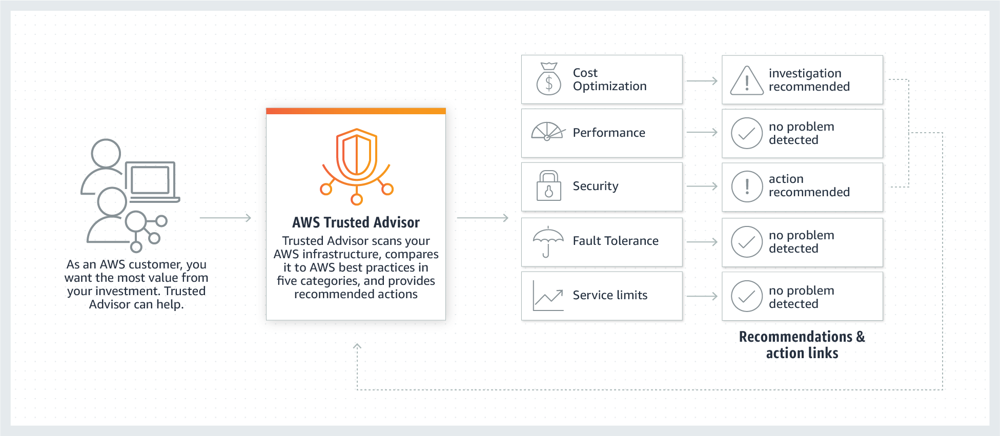

## 관리 및 거버넌스(Management & Governance)

- 최초 작성 일자: 2023-03-27
- 수정 내역:
  - 2023-03-27: 최초 작성

---

### Amazon CloudWatch

- **리소스 및 애플리케이션 모니터링**
- AWS, 온프레미스 및 기타 클라우드에서 리소스 및 애플리케이션을 관측하고 모니터링

#### 사용 이유

- 강력한 시각화 도구를 사용하여 AWS 데이터를 수집, 액세스, 분석할 수 있다.
- 사전 지정된 임계값에서 활성화하도록 설정된 알림 및 자동화 작업을 사용하여 운영 성능을 향상시킬 수 있다.
- 간소화된 모니터링 및 확장성을 위해 70개 이상의 AWS 서비스와 원활하게 통합할 수 있다.
- CloudWatch 대시보드의 로그 및 지표에서 도출된 실행 가능한 인사이트를 통해 운영 문제를 해결할 수 있다.

#### 작동 방식

- Amazon CloudWatch는 실시간 로그, 지표 및 이벤트 데이터를 자동화된 대시보드에 수집하고 이를 시각화하여 인프라 및 애플리케이션 유지 관리를 간소화한다.

#### 사용 사례

- **애플리케이션 성능 모니터링**: 성능 데이터를 시각화하여 경보를 생성한다. 데이터의 상관관계를 분석하여 AWS 리소스에서 성능 문제의 근본적 원인을 이해하고 이를 해결한다.
- **근본 원인 분석 수행**: 지표, 로그, 로그 분석 및 사용자 요청을 분석하여 디버깅 속도를 높이고 전반적인 평균 해결 시간을 줄인다.
- **사전에 리소스 최적화**: 사양 또는 기계 학습 모델을 기반으로 임계값이 충족될 때 발생할 작업을 설정하여 리소스 계획을 자동화하고 비용을 절감한다.
- **웹사이트 영향력 테스트**: 언제든지 스크린샷, 로그 및 웹 요청을 확인하여 웹사이트가 영향을 받는 시기와 기간을 정확히 파악한다.

---

### Amazon Managed Grafana

- **강력한 대화형 데이터 시각화**
- 운영 지표, 로그, 트레이스에 대한 확장 가능하고 안전한 데이터 시각화

#### 사용 이유

- 사용자를 위해 프로비저닝, 설정, 확장, 유지되는 워크스페이스를 구축, 패키징, 배포할 수 있다.
- 여러 소스에 걸쳐 운영 데이터를 시각화, 분석하고 연관성을 파악하며, 여러 AWS 계정 및 리전에서 쿼리할 수 있다.
- AWS 보안 서비스와 통합하여 기업 보안 및 규정 준수 요구 사항을 충족할 수 있다.
- 자체 관리형 Grafana 환경에서 마이그레이션할 수 있으므로 처음부터 새로 시작할 필요가 없다.

#### 작동 방식

- Amazon Managed Grafana는 저장 위치에 관계없이 지표를 쿼리, 시각화 및 이해하고 지표에 대한 알림을 받을 수 있는 유명 오픈 소스 플랫폼인 Grafana를 위한 완전관리형 서비스다.

#### 사용 사례

- **관측성 통합**: 다양한 도구의 지표, 로그 및 트레이스를 쿼리하고 상관 관계를 파악한 다음 단일 시각화 또는 대시보드에서 확인하고 분석한다.
- **컨테이너 모니터링**: Amazon EKS, Amazon ECS 및 Amazon EC2에서 실행되는 자체관리형 Kubernetes의 컨테이너 지표를 관찰한다.
- **협업을 통해 운영 문제 해결**: 팀은 실시간으로 대시보드를 보고 편집하고, 대시보드 버전 변경 사항을 추적하고, 이해 관계자와 대시보드를 공유할 수 있다.
- **IoT 디바이스 모니터링**: Grafana의 확장 가능한 데이터 플러그인 아키텍처와 유연한 그래프 옵션은 IoT 및 엣지 디바이스 데이터 모니터링에 널리 사용된다.

---

### Amazon Managed Service for Prometheus

- **안전한 고가용성 컨테이너 모니터링**
- 컨테이너식 시스템을 위한 안전한 고가용성 관리형 모니터링

#### 사용 이유

- Prometheus 쿼리 언어(PromQL)를 사용하여 자체 관리형 Kubernetes 클러스터에서 수백만 개의 고유 시계열 지표를 필터링, 집계, 수집할 수 있다.
- 수집 및 쿼리 요구 사항 증가에 따라 자동으로 확장하고 대규모 컨테이너 배포에 대해 일관된 응답 시간을 유지할 수 있다.
- AWS 보안 서비스와 통합하여 기업 보안 및 규정 준수 요구 사항을 충족할 수 있다.
- 독립형 Prometheus 서버를 구성, 업그레이드 및 크기를 조정하는 데 따른 운영 비용을 절감할 수 있다.

#### 작동 방식

- Amazon Managed Service for Prometheus는 대규모의 컨테이너식 애플리케이션 및 인프라를 모니터링하고 그에 대한 알림을 제공하는 새로운 Prometheus 호환서비스다.
- 이 서비스는 Amazon EKS, Amazon ECS, AWS Distro for Open Telemetry와도 통합된다.

#### 사용 사례

- **시스템 모니터링 통합**: 모니터링, 경고 및 대시보드 보기를 위해 AWS 및 하이브리드 환경에서 실행되는 컨테이너를 모니터링하고 Amazon Managed Grafana와 통합한다.
- **문제 해결 및 근본 원인 분석**: PromQL을 사용하여 컨테이너 성능 및 시스템 상태를 추적하고, 오류를 감지하며, 경고를 통해 평균 해결 시간을 줄인다.
- **워크로드 및 애플리케이션 지표 모니터링**: AWS Distro for OpenTelemetry를 사용하여 어디에서나 지표를 수집하고 오픈 소스 내보내기를 사용하여 해당 지표를 Amazon Managed Service for Prometheus로 전송한다.
- **카디널리티가 높은 지표 모니터링**: 비디오 스트림, 네트워크 애플리케이션 및 IoT 디바이스의 시계열 데이터와 같은 카디널리티가 높은 데이터를 모니터링하고 경고한다.

---

### AWS Auto Scaling

- **수요에 맞춰 여러 리소스의 규모 조정**
- 성능과 비용을 최적화하도록 애플리케이션 규모 조정
- AWS Auto Scaling은 애플리케이션을 모니터링하고 용량을 자동으로 조정하여, 최대한 저렴한 비용으로 안정적이고 예측 가능한 성능을 유지한다.
- AWS Auto Scaling을 사용하면 몇 분 만에 손쉽게 여러 서비스 전체에서 여러 리소스에 대해 애플리케이션 규모 조정을 설정할 수 있다.
- 간단하면서도 강력한 사용자 인터페이스를 제공하므로 이를 사용하여 Amazon EC2 인스턴스와 스팟 플릿, Amazon ECS 작업, Amazon DynamoDB 테이블 및 인덱스, Amazon Aurora 복제본 등 리소스에 대한 규모 조정 계획을 수립할 수 있다.
- Amazon EC2 Auto Scaling을 사용하여 Amazon EC2 인스턴스의 규모를 동적으로 조정하고 있는 경우, AWS Auto Scaling과 결합하여 다른 AWS 서비스의 추가 리소스를 조정할 수 있다.

#### 사용 이유

- **규모 조정을 신속하게 설정**: AWS Auto Scaling을 사용하면 직관적인 단일 인터페이스에서 여러 리소스에 대한 목표 사용률 수준을 설정할 수 있다. 다른 콘솔로 이동할 필요 없이 모든 확장 가능한 리소스의 평균 사용률을 신속하게 확인할 수 있다.
- **똑똑한 규모 조정 의사 결정**: AWS Auto Scaling을 사용하면 서로 다른 리소스 그룹이 수요 변화에 대응하는 방법을 자동화하는 규모 조정 계획을 수립할 수 있다.
- **자동으로 성능 유지**: AWS Auto Scaling를 사용하면 워크로드가 주기적으로, 예측 불가능하게 또는 지속적으로 변해도 최적의 애플리케이션 성능과 가용성을 유지할 수 있다.
- **필요한 만큼만 지불**: AWS Auto Scaling을 사용하면 AWS 서비스를 사용할 때 사용률과 비용 효율성을 최적화하는 데 도움이 된다. 수요가 감소하면 AWS Auto Scaling이 초과 리소스 용량을 자동으로 제거하여 과도한 소비를 방지한다.

#### 작동 방식

---

### AWS Chatbot

- **AWS용 ChatOps**
- 대화형 ChatOps를 통해 AWS 리소스 모니터링, 운영 및 문제 해결

#### 사용 이유

- AWS 리소스와 채팅 채널간의 통합 및 보안 권한을 신속하게 설정하여 사전 선택된 알림 또는 이벤트 기반 알림을 실시간으로 받을 수 있다.
- AWS 환경에서 애플리케이션에 대해 협업하고 문제를 진단하며 인시던트, 보안 결과, 기타 알림에 신속하게 대응할 수 있다.
- 다른 AWS 관리 도구로 컨텍스트를 전환하지 않고도 AWS 리소스를 안전하게 구성하고, 인시던트를 해결하고, Slack에서 작업을 실행할 수 있다.
- 유연한 권한 구성 옵션, IAM 정책 템플릿, 가드레일 IAM 정책을 통해 채팅 채널 권한을 사용자 지정할 수 있다.

#### 작동 방식

- AWS Chatbot을 사용하면 채팅 채널 내에서 AWS 환경을 모니터링, 문제 해결, 작동할 수 있다.
- **알림**

- **명령**

#### 사용 사례

- **비용 이상 징후에 대해 신속하게 발견 및 조치 수행**: AWS Chatbot을 통해 Slack에서 AWS Cost Anomaly Detection 경고 알림을 받아 이상 지출 발생 여부를 실시간으로 확인할 수 있다.
- **AWS Security Hub의 보안 결과 수정**: Slack 채널에서 AWS CLI 명령을 실행하여 보안 결과에 대한 문제 해결을 수행한다.
- **인시던트 관리 대응 시간 개선**: AWS System Manager Incident Manager를 사용하여 채팅 채널에서 IT 인시던트를 더 빠르게 협업하고 해결한다.
- **DevOps 팀에 애플리케이션 이벤트에 대한 가시성을 제공**: DevOps 사용자는 Amazon EventBridge를 통해 채팅 채널에서 200개 이상의 서비스 이벤트 유형의 알림을 수신할 수 있다.

---

### AWS CloudFormation

- **템플릿을 사용하여 리소스 생성 및 관리**
- 코드형 인프라로 클라우드 프로비저닝 가속화

#### 사용 이유

- 인프라를 전 세계로 확장하고 모든 AWS 계정 및 리전의 리소스를 단일 작업으로 관리할 수 있다.
- CloudFormation Registry, 개발자 커뮤니티 및 자체 라이브러리에 게시된 클라우드 리소스를 포함하도록 인프라를 확장하고 관리할 수 있다.
- 턴키 애플리케이션 배포 및 거버넌스 제어를 제공하는 AWS 서비스 통합을 통해 조직 전체의 리소스 관리를 자동화할 수 있다.

#### 작동 방식

- AWS CloudFormation을 사용하면 인프라를 코드로 처리하여 AWS 및 서드 파티 리소스를 모델링, 프로비저닝 및 관리할 수 있다.

#### 사용 사례

- **DevOps로 인프라 관리**: 지속적 통합 및 전달(CI/CD) 자동화를 통해 인프라 템플릿을 자동화하고 테스트하고 배포한다.
- **프로덕션 스택 크기 조정**: 단일 Amazon EC2 인스턴스로부터 복잡한 다중 리전 애플리케이션에 이르는 모든 것을 실행한다.
- **모범 사례 공유**: Amazon VPC 서브넷 또는 프로비저닝 서비스(AWS OpsWorks, Amazon ECS)를 손쉽게 정의한다.

---

### AWS CloudTrail

- **사용자 활동 및 API 사용 추적**

#### 사용 이유

- CloudTrail 로그로 SOC, PCI 및 HIPAA와 같은 규제에 대한 준수를 입증하여 벌금을 방지할 수 있다.
- 사용자 활동 및 이벤트를 기록하여 보안 태세를 개선하고 Amazon EventBridge를 통해 자동화된 워크플로 규칙을 설정할 수 있다.
- 단일의 중앙 제어식 플랫폼에서 AWS 리전 및 계정 전체의 사용자 활동 및 API 사용을 캡처하고 통합할 수 있다.

#### 작동 방식

- AWS CloudTrail은 AWS 인프라 전체의 계정 활동을 모니터링하고 기록하여 스토리지, 분석 및 해결 작업을 제어할 수 있도록 한다.

#### 사용 사례

- **활동 감사**: 활동 이벤트를 모니터링, 저장 및 검증하여 신뢰성을 결정한다. 내부 정책 및 외부 규제에 의해 요구되는 감사 보고서를 손쉽게 생성한다.
- **보안 인시던트 식별**: CloudTrail 이벤트의 주체, 대상 및 시기 정보를 사용하여 무단 액세스를 탐지한다. 규칙 기반 EventBridge 알림 및 자동화된 워크플로를 통해 대응한다.
- **운영 관련 문제 해결**: 기계 학습(ML) 모델을 사용하여 API 사용을 지속적으로 모니터링함으로써 AWS 계정의 비정상적인 활동을 탐지하고 근본 원인을 파악한다.

---

### Amazon Command Line Interface

- **AWS 서비스를 관리하는 통합 도구**
- 하나의 도구만 다운로드하여 구성하면 여러 개의 AWS 서비스를 명령줄에서 제어하고 스크립트를 통해 자동화할 수 있다.
- AWS CLI v2는 개선된 설치 프로그램, AWS IAM Identity Center(AWS SSO의 후속 서비스)와 같은 새로운 구성 옵션, 다양한 상호작용 기능을 비롯한 여러 가지 새로운 기능을 제공한다.

#### aws-shell

- aws-shell은 명령줄 셸 프로그램으로서, AWS 명령줄 인터페이스를 사용하는 새로운 사용자와 고급 사용자 모두에게 도움이 되는 편의 기능 및 생산성 기능을 제공한다.

---

### AWS Compute Optimizer

- **최적의 AWS 컴퓨팅 리소스 식별**
- AWS 리소스 사용을 최적화하기 위한 권장 사항 받기

#### 사용 이유

- 인공 지능 및 기계 학습 기반 분석을 통해 워크로드의 크기를 적절하게 조정하여 비용을 최대 25% 절감할 수 있다.
- 과소 프로비저닝된 리소스를 식별하는 권장 사항을 구현하여 성능 문제를 해결할 수 있다.
- Amazon CloudWatch 지표를 활성화하여 메모리 사용률에 대한 절감 권장 사항 및 가시성을 향상시킬 수 있다.

#### 작동 방식

- AWS Compute Optimizer는 사용량 데이터를 기반으로 Amazon EC2 인스턴스 유형, Amazon EBS 볼륨 및 AWS Lambda 함수 등 3가지 유형의 AWS 리소스에 대한 과다 프로비저닝 또는 과소 프로비저닝을 방지하는 데 도움이 된다.

#### 사용 사례

- **크기 조정 추천 평가**: Amazon EC2, Amazon EBS 및 AWS Lambda 리소스에 대한 계정 수준에서 예상 절감액 및 성능 개선 기회를 평가한다.
- **향상된 인프라 지표 구성**: 3개월간의 과거 데이터를 사용하여 EC2 인스턴스 및 오토 스케일링 최적화에 대한 개선된 추천을 받는다.
- **AWS Graviton CPU로의 마이그레이션 간소화**: AWS Graviton CPU로 전환할 때 가장 적은 마이그레이션 작업 노력으로 가장 큰 결과를 얻을 수 있는 EC2 워크로드를 찾는다.
- **외부 지표 구성**: 애플리케이션 성능 모니터링(APM) 도구에서 서드 파티 지표를 구성하여 비용 절감 및 성능 인지 능력을 개선한다.

---

### AWS Config

- **리소스 인벤토리 및 변경 추적**
- 리소스 구성에 대한 진단, 감사 및 평가

#### 작동 방식

- AWS Config는 리소스의 구성 및 관계에 대한 지속적인 진단, 감사 및 평가를 수행한다.

#### 사용 사례

- **운영 문제 해결 및 변경 관리 간소화**: 계정에 있는 리소스를 검색하고, 해당 구성을 기록하고, 변경 사항을 캡처하여 운영 문제를 신속하게 해결할 수 있다.
- **코드형 규정 준수 프레임워크 배포**: 규정 준수 요구 사항을 AWS Config 규칙으로 코드화하고 수정 작업을 작성하여 조직 전체의 리소스 구성 평가를 자동화합니다.
- **지속적인 보안 모니터링 및 분석 감사**: 잠재적 취약성에 대한 리소스 구성을 평가하고 잠재적 인시던트 후 구성 기록을 검토하여 보안 상태를 검사한다.

---

### AWS Control Tower

- **안전하고 규정을 준수하는 다중 계정 환경 설정 및 관리**
- 안전한 다중 계정 AWS 환경을 설정하고 통제

#### 사용 이유

- 잘 설계된 다중 계정 환경을 30분 이내에 설정할 수 있다.
- 기본 제공 거버넌스를 통해 AWS 계정 생성을 자동화할 수 있다.
- 사전 구성된 제어를 통해 모범 사례, 표준, 규제 요구 사항을 적용할 수 있다.
- 규모에 맞게 타사 소프트웨어를 원활하게 통합하여 AWS 환경을 개선할 수 있다.

#### 작동 방식

- AWS Control Tower는 다수의 AWS 서비스를 오케스트레이션하는 동시에 조직의 보안 및 규정 준수 요구 사항을 유지 관리하여 AWS 경험을 간소화한다.

#### 사용 사례

- **애플리케이션 신속 배포**: 애플리케이션을 빠르고, 쉽고, 자신 있게 배포할 수 있도록 AWS 다중 계정 환경을 설정하고 관리한다.
- **규정 준수 AWS 계정 프로비저닝**: 비즈니스, 보안 및 규정 준수 요구 사항을 충족하도록 사전 구성된 AWS 계정에 대한 프로비저닝을 자동화한다.
- **데이터 레지던시 제어 배포**: 목적별 제어를 사용하는 리전 거부 가드레일은 특정 AWS 리전 외부에서 데이터 및 리소스의 생성, 저장 및 처리를 허용하지 않는다.
- **보안을 유지하며 민첩성 향상**: 대규모로 신규 또는 기존 계정 구성을 관리하고, 규정 준수 상태에 대한 가시성을 확보하고, 제어를 시행한다.

---

### AWS Console 모바일 애플리케이션

- **이동 중에도 리소스에 액세스**
- iOS 및 Android 용 AWS Management Console을 사용하면 전화 또는 태블릿에서 기존 EC2 인스턴스, 로드밸런서, Route 53 호스트 영역, RDS 인스턴스, Auto Scaling 그룹 등을 빠르고 쉽게 확인하고 관리할 수 있다.

---

### AWS Distro for OpenTelemetry

- **연관된 지표 및 트레이스 수집**
- 안정적인 성능을 갖춘 안전한 프로덕션용 오픈 소스 배포

#### 사용 이유

- 애플리케이션을 한 번 계측하여 여러 개의 AWS 모니터링 솔루션으로 지표 및 트레이스를 전송할 수 있다.
- AWS 리소스에 대한 가시성을 향상하여 성능 문제 해결 속도를 높이고 평균 해결 시간을 단축할 수 있다.
- AWS Support는 성능 최적화, 비용 절감 및 혁신 가속화를 제공하고 테스트는 측정 및 예측 가능한 성능 오버헤드를 제공한다.
- 엄격한 테스트를 통해 코드 및 구성 요소를 보안 요구 사항에 대해 검증할 수 있다.

#### 작동 방식

- OpenTelemetry는 애플리케이션 모니터링을 위해 분산된 트레이스 및 지표를 수집하는 오픈 소스 API, 라이브러리 및 에이전트를 제공한다.
- AWS Distro for OpenTelemetry를 사용하면 AWS 리소스 및 관리형 서비스에서 메타데이터를 수집하여 애플리케이션 성능 데이터를 기반 인프라 데이터에 연관시켜 문제의 평군 해결 시간을 단축할 수 있다.

#### 사용 사례

- **지표와 트레이스를 수집 및 전송**: 기본 AWS 리소스에 대한 메타데이터를 자동으로 수집하고 애플리케이션 모니터링 데이터와 인프라 모니터링 데이터의 상관 관계를 분석한다.
- **트레이스 수집 자동화**: Java 애플리케이션, Python 애플리케이션 및 AWS Lambda 함수에 댛나 트레이스 데이터를 수집하고 AWS X-Ray 또는 다른 대상으로 전송한다.
- **애플리케이션 리소스에 대한 메타데이터 수집**: 기반 AWS 리소스에 대한 메타데이터를 자동으로 수집하고 이를 사용하여 애플리케이션 모니터링 데이터와 인프라 모니터링 데이터의 상관 관계를 분석한다.
- **Amazon CloudWatch와 통합**: AWS Distro for OpenTelemetry를 CloudWatch와 페어링하여 사용자 지정 지표를 수집, 분석 및 확인한다. 추세를 인식하고, 대시보드를 만들고, 경보를 설정하여 애플리케이션을 사전 예방적으로 모니터링한다.

---

### AWS Personal Health Dashboard

- **AWS 환경에 영향을 주는 주요 이벤트 및 변경 사항 보기**
- AWS Personal Health Dashboard는 고객의 환경에 영항을 줄 수 있는 AWS 이벤트에 대한 알림과 지침을 제공한다.
- Service Health Dashboard에서 일반적인 AWS 서비스 상태를 확인할 수 있는 한편, Personal Health Dashboard는 특정 AWS 환경에 대해 분명한 미리 알림을 제공한다.

#### 사용 이유

- **개인화된 서비스 상태 보기**: Personal Health Dashboard는 고객의 애플리케이션을 지원하는 AWS 서비스의 상태에 대해 개인화된 보기를 제공한다. 예를 들어, Amazon EC2 인스턴스 중 하나와 연결된 Amazon EBS 볼륨 손실 이벤트를 수신한 경우, 해당 이벤트를 사용해 빠르게 리소스 상태를 확인할 수 있다.
- **미리 알림**: Service Health Dashboard와 달리 Personal Health Dashboard를 사용해 본인의 계정에 영향을 줄 수 있는 특정 이벤트에 대한 알림을 생성할 수 있다.
- **자세한 문제 해결 지침**: 받을 알림에는 수정 세부 사항과 상세 지침을 포함하고 있어 리소스에 영향을 줄 수 있는 이벤트에 조치를 취할 수 있다.
- **통합 및 자동화**: Amazon CloudWatch Events와 통합할 수 있으므로 사용자 지정 규칙을 설정하고 AWS Lambda 함수 같은 대상을 선택하여 특정 이벤트에 대한 자동화된 문제 해결 조치를 정의할 수 있다.
- **IAM을 사용해 세분화된 액세스 제어**: Personal Health Dashboard에서 액세스 제어를 지원하므로 고객은 이벤트 메타데이터를 기반으로 권한을 설정할 수 있다.
- **AWS Organizations 전체의 상태 이벤트 집계**: AWS Organization를 사용하는 경우 AWS Health를 통해 조직 내 모든 계정의 알림을 집계할 수 있다.

---

### AWS Launch Wizard

- **AWS에서 서드 파티 애플리케이션의 크기를 손쉽게 조정, 구성 및 배포**
- AWS Launch Wizard는 개별 AWS 리소스를 수동으로 식별하고 프로비저닝하지 않고도 AWS 리소스를 MS-SQL Always On 및 HANA 기반 SAP 시스템과 같은 서드 파티 애플리케이션용으로 크기 조정, 구성 및 배포하는 과정으로 안내한다.
- AWS Launch Wizard는 또한 후속 배포를 가속화하기 위한 기준 역할을 할 수 있는 CloudFormation 템플릿을 생성한다. 

#### 사용 이유

- **애플리케이션 배포 간소화**: AWS Launch Wizard를 사용하면 AWS에서 서드 파티 애플리케이션을 쉽게 배포할 수 있다. 애플리케이션 요구 사항을 입력하면 Launch Wizard에서 적절한 AWS 리소스를 추천한 다음 프로덕션용 애플리케이션에 대해 선택한 리소스를 배포한다.
- **AWS 리소스 선택 및 비용 추정 자동화**: AWS Launch Wizard는 EC2 인스턴스 유형 및 EBS 볼륨을 포함하여 애플리케이션 요구 사항에 맞는 적절한 AWS 리소스를 권장하고 예상 비용을 제시한다.
- **반복 가능한 코드 템플릿으로 시간 단축**: AWS Launch Wizard는 재사용 가능한 AWS CloudFormation 코드 템플릿을 제공한다. 이러한 템플릿은 후속 애플리케이션 배포를 위한 기준으로 사용할 수 있다.
- **AWS의 입증된 배포 모범 사례 활용**: AWS Launch Wizard에서 배포한 리소스는 AWS Well-Architected Framework 및 애플리케이션 모범 사례를 기반으로 한다.

#### 작동 방식

#### 사용 사례

- **프로덕션용 SQL Server Always On 배포 설정**: AWS Launch Wizard를 사용하면 SQL Server 노드 설정 및 AMI에서 VPC, Active Directory 및 EC2 인스턴스에 이르기까지 애플리케이션의 구성 요소를 지정하여 프로덕션용 배포를 손쉽게 생성할 수 있다.
- **프로덕션용 HANA 기반 SAP 시스템 설정**: AWS Launch Wizard는 고객이 성능 사양에 따라 적절한 SAP 인증 EC2 인스턴스를 선택할 수 있도록 도와준다. 이후 Launch Wizard는 HANA에서 HANA 및 Netweaver 기반 SAP 애플리케이션을 실행하도록 인스턴스를 배포 및 구성한다.
- **새로운 구성 테스트**: 개발 및 테스트를 위해 새로운 구성을 시도할 때 개념 증명(PoC) 배포를 빠르게 생성할 수 있다.
- **온프레미스 Active Directory를 배포에 연결**: AWS Launch Wiard를 사용하면 AWS Direct Connect를 통해 배포를 온프레미스 Active Directory에 연결할 수 있다.

---

### AWS License Manager

- **라이선스 추적, 관리 및 제어**
- 소프트웨어 라이선스를 관리하고 라이선스 비용을 세부적으로 조정

#### 사용 이유

- 소프트웨어 라이선스 사용 방법에 대한 가시성과 제어를 향상시키고 오용을 사전에 방지할 수 있다.
- 라이선스를 추적 및 관리하는 방법을 비롯하여 라이선스를 최대한 활용하여 비용을 절감할 수 있다.
- 라이선스 사용 제한을 적용하고 새로운 시작을 차단하고 다른 제어를 사용하여 규정 비준수 위험을 줄일 수 있다.
- 호스트 리소스 그룹을 사용해 호스트의 배치, 릴리스, 복구를 자동화하여 생산성을 향상시킬 수 있다.

#### 작동 방식

- License Manager를 사용하면 Microsoft, SAP, Oracle, IBM 등의 공급업체에서 제공한 소프트웨어 라이선스를 AWS 및 온프레미스 환경 전반에 걸쳐 손쉽게 관리할 수 있다.

#### 사용 사례

- **라이선스 관리 간소화**: 라이선스 유형 간 전환 및 기존 라이선스에 대한 검색, 추적 및 보고를 자동화한다.
- **Windows BYOL 환경 간소화**: 자동 할당, 릴리스 및 복구를 사용하여 전용 호스트 모음을 기존 보유 라이선스 사용(BYOL) 환경용 단일 엔터티로 관리한다.
- **AWS Marketplace 라이선스 권한 제어**: 최종 사용자를 위해 AWS 계정 전반에 소프트웨어 권한 및 워크로드의 배포와 활성화를 자동화한다.
- **사용자 기반 라이선스 구독 관리**: Amazon EC2에서 Microsoft Visual Studio용 사용자 기반 라이선스를 구독, 관리 및 추적한다.

---

### AWS Management Console

- **웹 기반 사용자 인터페이스**
- AWS 클라우드를 액세스하고 관리하는 데 필요한 모든 것을 하나의 웹 인터페이스에서 활용한다.

---

### AWS Managed Services

- **AWS의 인프라 운영 관리**
  
- 클라우드의 운영 우수성
- AWS Managed Service(AMS)를 사용하면 AWS를 적절한 규모로 도입하고 보다 효율적이고 안전하게 운영할 수 있다.
- AWS는 표준 AWS 서비스를 활용하며 고객의 환경과 애플리케이션에 적합한 전문적인 자동화, 기술 및 경험을 바탕으로 운영 모범 사례의 지침과 실행을 제공한다.
- **보안**: 150개 이상의 관리형 가드레일과 보안 검사
- **인시던트 관리**: 인시던트의 80%를 선제적으로 탐지하여 알림
- **자동화**: 매월 135만 개의 SSM 문서가 실행되고 최대 97%가 자동화
- **비용 절감**: 연 운영 비용 및 AWS 비용을 평균 10~15% 절감
- **AWS 전문성**: 티어 1 응답 및 해결을 통해 전 세계에서 상시 보장 제공

#### 사용 이유

- **보안**: AWS는 보안 모니터링 및 해결을 통해 운영 우수성을 높여준다. AWS는 AWS 모범 사례와 광범위한 AWS 기본 도구 제품군을 활용하여 고객의 위험을 지속적으로 완화한다.
- **가용성**: AMS는 Well-Architected 검토, 구성 규칙 검사, 위험 예방, 관리 등을 제공한다. AWS는 선제적 경보와 탐지 및 대응부터 해결에 이르는 전체 사고 관리 수명 주기를 통해 서비스를 상시 모니터링한다.
- **효율성**: AMS는 자동 우선 접근 방식을 운영에 채택하여 인적 오류를 줄이고 일관성, 속도, 정확성 및 비용 절감 효과를 제공한다.
- **복원력**: AMS는 고객 요구 사항과 끊임없이 변화하는 보안 환경에 맞춰 고객의 운영 기능을 확장하고 보안 정책을 기준으로 워크로드 및 파이프라인을 평가하는 지속적인 학습 메커니즘에 기반을 둔다.
- **규정 준수**: AMS는 규정 준수 요구 사항을 충족하기 위한 빠른 경고를 제공한다. AMS는 PCI-DSS, HIPAA, HiTrust, GDPR, ISO, SOC 1, 2 및 3에 대한 규정 준수 인증 및 증명을 달성한다.

#### 작동 방식

#### 사용 사례

- **모니터링 및 관측성**: AMS는 활동 및 인시던트를 선제적으로 상시 모니터링하여 가용성과 복원성을 보장함으로써 운영 우수성을 높여준다.
- **구성, 규정 준수 및 감사**: AMS는 PCI-DSS, HIPAA, HiTrust, GDPR, ISO, SOC 1, 2 및 3에 대한 규정 준수 인증 및 증명을 충족하기 위한 빠른 경로를 제공한다.
- **중앙 집중식 운영 관리**: AMS는 고객의 변화하는 요구 사항에 맞춰 고객의 운영 기능을 확장하고 지속적으로 발전시킨다.
- **엔터프라이즈 거버넌스 및 제어**: 투명한 거버넌스를 제공하기 위해 AWS는 다양한 기본 AWS 서비스에서 AMS의 핵심 성능 지표를 요약하는 보고를 제공한다. 여기에는 경영인 요약 및 비용 절감 인사이트와 인시던트 및 성능의 세분화된 세부 정보가 포함된다.

---

### AWS OpsWorks

- **Chef 및 Puppet을 사용하여 운영 자동화**
- AWS OpsWorks는 Chef 및 Puppet의 관리형 인스턴스를 제공하는 구성 관리 서비스다.
- Chef 및 Puppet은 코드를 사용해 서버 구성을 자동화할 수 있게 해주는 자동화 플랫폼이다.
- OpsWorks를 사용하면 Chef 및 Puppet을 통해 Amazon EC2 인스턴스 또는 온프레미스 컴퓨팅 환경 전체에서 서버가 구성, 배포 및 관리되는 방법을 자동화할 수 있다.

#### 종류

- **AWS OpsWorks for Chef Automate**: AWS OpsWorks for Chef Automate는 구성 관리, 규정 준수 및 보안, 지속적 배포를 위한 Chef의 자동화 도구 제품군인 Chef Automate를 호스팅하는 완전 관리형 구성 관리 서비스다.
- **AWS OpsWorks for Puppet Enterprise**: AWS OpsWorks for Puppet Enterprise는 Puppet의 인프라 및 애플리케이션 관리용 자동화 도구 세트인 Puppet Enterprise를 호스팅하는 완전 관리형 구성 관리 서비스다.

---

### AWS Organizations

- **AWS 계정 전체에 걸쳐 중앙 집중식 거버넌스 및 관리**
- AWS 리소스를 확장할 때 중앙 집중식으로 환경을 관리

#### 사용 이유

- 추가 비용 없이 리소스 및 팀에 대한 새 AWS 계정을 프로그래밍 방식으로 생성하여 환경을 신속하게 확장할 수 있다.
- 사용자 기반 권한 관리를 간소화하여 팀이 목표 거버넌스 경계 내에서 자유롭게 구축할 수 있다.
- AWS 계정 및 리소스에서 비용을 관리하고 최적화할 수 있다.
- 모든 AWS 계정에서 환경을 중앙 집중식으로 보안 및 감사할 수 있다.

#### 작동 방식

- AWS Organizations를 사용하면 새로운 AWS 계정을 추가 비용 없이 생성할 수 있다.
- 조직 내 계정을 사용하여 리소스를 손쉽게 할당하고 계정을 그룹화하며 계정 또는 그룹에 거버넌스 정책을 적용할 수 있다.

#### 사용 사례

- **AWS 계정 생성 자동화**: 즉각적인 보안 정책 애플리케이션, 비접촉 인프라 배포 및 감사를 위해 AWS 계정을 생성해서 사용자 지정 그룹에 추가한다.
- **전용 보안 그룹으로 사전 예방적 보호 가능**: 보안 그룹을 생성한 후 보안 문제를 능동적으로 모니터링, 식별 및 완화하기 위해 리소스에 대한 읽기 전용 액세스만 사용자에게 제공한다.
- **지정된 리소스에 대한 사용자 액세스 보장**: Single Sign-On 액세스를 활성화하고, 보안 및 규정 준수 요구 사항을 충족하는 사용자 작업만 허용하도록 서비스 제어 정책을 적용한다.
- **여러 계정에서 공통 리소스 공유**: 조직 내에서 중앙 리소스, 소프트웨어 애플리케이션, 디렉터리 및 서비스를 보다 쉽게 공유할 수 있다.

---

### AWS Proton

- **컨테이너 및 서버리스 배포의 자동화된 관리**
- 셀프 서비스 인프라 템플릿과 프로비저닝 자동화를 통해 영향력을 확대한다.

#### 사용 이유

- 개발자를 위한 확장 가능한 셀프 서비스 기능을 구현하여 플랫폼 엔지니어링의 영향력을 높인다.
- 인프라를 프로비저닝하고 코드 배포를 관리할 수 있는 셀프 서비스 도구를 제공하여 개발자의 생산성을 개선한다.
- DevOps 모범 사례를 팀에 빠르게 도입한다.

#### 작동 방식

- AWS Proton은 현대적 애플리케이션을 위한 배포 워크플로 도구로, 플랫폼 및 DevOps 엔지니어가 조직적 민첩성을 달성하는 데 도움이 된다.

#### 사용 사례

- **셀프 서비스 인프라 포털 구현**: 사전 승인된 인프라 템플릿을 통해 소프트웨어 개발 수명 주기를 단축한다.
- **현대적 애플리케이션 배포 가속화**: CI/CD, 보안 및 모니터링에 대한 일관된 표준을 통해 현대적 애플리케이션의 안정적인 배포를 지원한다.
- **중앙 집중식 솔루션으로 버전 및 업데이트 추적**: 인프라에 사용된 템플릿과 버전을 단일 위치에서 확인하고 관리한다.
- **유연성을 통해 개발자 역량 강화**: Proton 구성 요소를 사용하여 앱 개발자가 인프라 리소스를 사용자 지정할 수 있도록 한다.

---

### AWS Resilience Hub

- **애플리케이션 작동 중단 방지**
- 애플리케이션을 장애로부터 보호하기 위한 준비

#### 사용 이유

- 애플리케이션 복원성을 지속적으로 검증하고 추적해 중단을 줄인다.
- 복원성 목표(복구 시간 목표 및 복구 시점 목표)를 평가한다.
- 문제가 프로덕션에서 발생하기 전에 문제를 식별하고 해결한다.
- 비즈니스 지속성을 최적화하고 복구 비용은 절감한다.

#### 작동 방식

- AWS Resilience Hub는 AWS 상의 애플리케이션에 대한 복원성을 정의, 검증, 추적할 수 있는 중앙 위치를 제공한다.

#### 기능

- **설명**: AWS CloudFormation을 사용해 교차 리전 및 교차 계정 스택 등의 애플리케이션을 설명한다. 애플리케이션은 Resource Groups를 사용하여 정의하거나, 이미 Service Catalog AppRegistry에 정의된 애플리케이션에서 선택할 수 있다.
- **정의**: 애플리케이션의 복원성 정책을 정의한다. 이러한 정책은 애플리케이션, 인프라, 가용 영역, 리전 장애에 대한 RTO 및 RPO 목표를 포함한다.
- **평가**: AWS Resilience Hub의 평가는 AWS Well-Architected Framework의 모범 사례를 사용하여 애플리케이션의 구성 요소를 분석해서 잠재적인 복원성 약점을 찾아낸다.
- **권장**:  AWS Resilience Hub는 복원성을 개선하기 위해 실행 가능한 권장 사항을 제공한다. 또한 복원성 평가는 애플리케이션에 대한 복구 절차를 AWS System Manager 문서로 생성하는 데 도움이 되는 코드 조각을 생성한다.
- **검증**: 애플리케이션 및 SOP가 복원성 평가의 권장 사항을 통합하도록 업데이트된 후에는 애플리케이션을 프로덕션으로 릴리즈하기 전에 AWS Resilience Hub를 사용해 애플리케이션이 복원성 목표를 충족하는지 테스트 및 검증할 수 있다.
- **보기 및 추적**: AWS Resilience Hub는 대시보드를 통해 전체적인 애플리케이션 포트폴리오 복원성 상태의 종합적인 보기를 제공한다. 애플리케이션의 복원성을 추적하기 위해 AWS Resilience Hub는 Amazon CloudWatch와 AWS Fault Injection Simulator 같은 서비스의 복원성 이벤트, 알림, 인사이트를 수집하고 정리한다.

#### 사용 사례

- **잠재적 약점 찾아내기**: 오류 주입을 통해 실제 오류를 시뮬레이션하면 복구 표준 운영 절차(SOP) 및 경보의 효과를 검증하는 데 도움이 된다.
- **미션 크리티컬 애플리케이션 보호**: 실행 가능한 권장 사항을 제공하여 복원성을 개선하고 복구 절차 생성을 돕는다.
- **계약 및 규제 요구 사항 충족 지원**: 계획된 중단 및 비계획된 중단 동안 이벤트 감사 추적을 유지하여 규정 준수 및 규제 요구 사항을 충족하도록 돕는다.

---

### AWS Service Catalog

- **표준화된 제품 생성 및 사용**
- 큐레이트된 IaC 템플릿 생성, 공유, 구성 및 통제

#### 사용 이유

- 승인된 셀프 서비스 클라우드 리소스를 신속하게 찾고 배포할 수 있다.
- 여러 계정에서 리소스에 대한 거버넌스를 개선하면서 민첩성을 유지할 수 있다.
- ServiceNow 및 Jira Service Management에 연결하여 워크로드를 간소화할 수 있다.
- AWS Service Catalog AppRegistry를 통해 정확한 최신 애플리케이션 정의 및 메타데이터를 얻을 수 있다.

#### 작동 방식

- AWS Service Catalog를 사용하면 배포된 IT 서비스, 애플리케이션, 리소스 및 메타데이터를 중앙에서 관리하여 코드형 인프라(IaC) 템플릿에 일관된 거버넌스를 적용할 수 있다.
- AWS Service Catalog를 사용하면 규정 준수 요구 사항을 충족하는 동시에 승인된 IT 서비스를 고객에게 제공하여 필요한 서비스를 빠르게 배포하도록 지원할 수 있다.

#### 사용 사례

- **ML 노트북 액세스 자동화**: SageMaker 기계 학습(ML) 노트북에 대한 안전하고 자동화된 액세스를 최종 사용자에게 제공하여 혁신을 가속화한다.
- **액세스 제어 적용**: 다중 계정 AWS 환경에서 리소스 액세스를 관리할 수 있도록 권한을 확장하고 제어한다.
- **AWS 계정에 대한 리소스 프로비저닝**: 새로운 AWS 계정에 기본 네트워킹 리소스와 보안 도구를 배포하여 일관되게 관리할 수 있다.
- **CI/CD 파이프라인 프로비저닝 가속화**: 모든 AWS 애플리케잇녀 리소스를 한 곳에서 추적할 수 있도록 확장 가능하고 자동화된 CI/CD 솔루션을 구축하고 관리한다.

---

### AWS Service Management Connector

- **서비스 관리 도구 내에서 AWS 리소스의 프로비저닝, 관리 및 운영 작업 수행**

#### 사용 이유

- 기존 ITSM 도구를 사용하여 AWS 리소스의 프로비저닝, 관리 및 운영을 간소화한다.
- AWS 환경 전체에서 리소스의 가시성과 제어를 연합한다.
- ITSM 워크플로우로 클라우드 운영 문제를 감지하고 해결한다.
- 클라우드 속도로 서비스 관리 프로세스를 실행한다.

#### 작동 방식

- AWS Service Management Connector는 기존 운영 ISTM 도구로 AWS 리소스의 클라우드 운영을 간소화한다.

#### 사용 사례

- **셀프 서비스를 활성화하여 AWS 리소스 요청**: 선별된 제품을 사용하여 ITSM 도구로 Amazon WorkSpaces, Amazon EC2, 애플리케이션 패턴 또는 AWS 계정과 같은 AWS 리소스를 요청할 수 있다.
- **AWS 리소스 데이터 및 규정 준수 상태 보기**: 기존 자산 저장소(CMDB)에 거의 실시간으로 통합된 AWS 리소스 관계 및 규정 준수 상태를 확인한다. 하이브리드 클라우드 환경 내에서 AWS 리소스 데이터를 간소화한다.
- **운영 문제 감지 및 대응**: 탐지, 대응, 문제 해결 및 변경 지원 프로세스를 가속화하기 위해 AWS 및 기타 운영 도구에서 엇갈리는 클라우드 작업을 제거한다.
- **보안 인시던트 수정**: 기존 IT 환경의 결과에서 탐지된 보안 사고에 대응하고 수정한다.

---

### AWS Telco Network Builder

- **AWS에서 통신 네트워크의 배포 및 관리 자동화**

#### 사용 이유

- 통신 산업 표준을 계속 사용하면서 클라우드 기반 네트워크 인프라 및 서비스의 배포를 가속화한다.
- 네트워크 기능을 배포, 업데이터 및 업그레이드하는 단일 서비스를 사용하여 네트워크 수명 주기 관리를 간소화한다.
- 중앙 집중식 대시보드에서 네트워크 기능과 AWS 서비스를 모니터링하고 관리한다.

#### 작동 방식

- 통신 서비스 공급자(CSP)는 AWS Telco Network Builder(TNB)를 사용하여 통신 산업 표준을 사용하여 네트워크 요구 사항을 정의한다.
- AWS TNB는 요구 사항을 클라우드 아키텍처에 매핑하고 올바른 컴퓨팅, 스토리지 및 네트워킹 리소스를 자동으로 프로비저닝한다.
- AWS TNB를 사용하여 네트워크 수명 주기를 관리하여 네트워크 기능 및 서비스를 업데이트하고 업그레이드할 수 있다.
- AWS TNB는 중앙 집중식 대시보드를 제공하므로 한 곳에서 AWS 리소스를 모니터링하고 관리할 수 있다.

#### 사용 사례

- **클라우드 기반 통신 네트워크 구축**: 통신 산업 인터페이스를 사용하여 클라우드 기반 네트워크를 배포하고 관리하는 데 드는 시간과 복잡성을 줄인다.
- **클라우드 인프라 전체에서 네트워크 업데이트 간소화**: AWS 인프라 전체에서 네트워크 서비스의 수명 주기를 관리하고 간소화한다.
- **통신 네트워크를 새로운 지역으로 확장**: 템플릿을 사용하여 네트워크 요구 사항을 정의한 다음 재사용하여 전 세계로 빠르고 안정적으로 확장한다.

---

### AWS Systems Manager

- **운영 인사이트 확보 및 조치 수행**
- **AWS, 온프레미스 및 기타 클라우드의 리소스에 대한 운영 인사이트 확보**

#### 사용 이유

- 클라우드, 온프레미스 및 엣지에서 가시성 및 제어를 개선한다.
- 운영 문제의 탐지 및 해결에 소요되는 시간을 단축한다.
- 패치, 구성 및 사용자 지정 정책에 대한 인스턴스 규정 준수를 유지한다.
- 애플리케이션 및 리소스의 구성 및 지속적인 관리를 자동화한다.

#### 작동 방식

- AWS Systems Manager는 AWS, 온프레미스 및 기타 클라우드의 리소스를 위한 안전한 엔드 투 엔드 관리 솔루션이다.

#### 사용 사례

- **운영 데이터의 중앙 집중화**: Amazon CloudWatch, AWS CloudTrail 및 AWS Config와 같은 AWS 서비스와 서드 파티 도구 전체에서 실행 가능한 인사이트를 얻고 단일 콘솔에서 데이터를 집계한다.
- **애플리케이션 문제를 자동으로 해결**: 연결된 AWS Resource Groups 전체에서 운영 데이터를 사용하여 애플리케이션을 손쉽게 관리하고 문제를 빠르게 식별한다.
- **AWS 리소스 간소화**: AWS, 온프레미스 및 기타 클라우드 전반에 걸쳐 패칭 및 리소스 변경과 같은 프로세스를 자동화한다. 사용자에게 영향을 미치기 전에 운영 문제를 신속하게 진단하고 해결한다.
- **보안 이벤트 해결**: 보안 및 규정 준수 프로필을 조정하고 보안 이벤트를 추후 분석하여 향후 재발을 방지한다.

---

### AWS Trusted Advisor

- **성능 및 보안 최적화**
- 비용 절감, 성능 향상 및 보안 강화
- **AWS Trusted Advisor**는 AWS 모범 사례를 따르는 데 도움이 되는 권장 사항을 제공하고, 검사를 사용하여 계정을 평가한다.
  이러한 검사는 AWS 인프라를 최적화하고 보안 및 성능을 개선하며 비용을 절감하고 서비스 할당량을 모니터링할 방법을 식별한다.
- **AWS Basic Support** 및 AWS Developer Support 고객은 핵심 보안 검사 및 서비스 할당량에 대한 검사에 액세스할 수 있다.
  AWS Business Support 및 AWS Enterprise Support 고객은 비용 최적화, 보안, 내결함성, 성능, 서비스 할당량을 포함한 모든 Trusted Advisor 검사에 액세스할 수 있다.
- **AWS Trusted Advisor Priority**는 클라우드 배포를 최적화하고, 복구 능력을 향상하고, 보안 허점을 해결하는 데 가장 중요한 권장 사항에만 집중할 수 있도록 도와준다.

#### 사용 이유

- **비용 최적화**: Trusted Advisor는 사용량, 구성 및 지출을 분석하여 비용 절감에 도움이 되는 실행 가능한 권장 사항을 제공한다.
- **성능**: Trusted Advisor는 사용량 및 구성을 분석하여 서비스 성능 개선에 도움이 되는 실행 가능한 권장 사항을 제공한다.
- **보안**: Trusted Advisor는 보안 전문가가 선별한 기본적인 보안 모범 사례를 제안하여 AWS 환경의 보안을 개선하는 데 도움을 줄 수 있다.
- **내결함성**: Trusted Advisor는 서비스 안정성을 개선하는 데 도움을 줄 수 있다. 
  예를 들어, Auto Scaling EC2 그룹, Route 53의 삭제된 상태 확인, 사용 중지된 가용 영역 및 사용 중지된 RDS 백업을 검사한다.
- **서비스 할당량**: 서비스 할당량은 AWS 계정에서 만들 수 있는 최대 리소스의 수다. AWS는 모든 고객에게 가용성과 신뢰성이 높은 서비스를 제공하고 의도하지 않은 지출로부터 사용자를 보호하기 위해 할당량을 구현한다.

#### 작동 방식

---

### AWS Well-Architected Tool

- **워크로드 검토 및 개선**
- 모범 사례를 배우고 중욯나 설계 고려 사항을 적용

#### 사용 이유

- 애플리케이션 및 워크로드를 미세 조정하기 위한 아키텍처 지침, 모범 사례 활용 방법, 실행 계획을 제공받을 수 있다.
- 강력한 API를 통해 AWS Wll-Architected 기능을 자체 아키텍처 거버넌스 프로세스, 애플리케이션, 워크플로로 확장할 수 있다.
- 특정 시점 마일스톤을 저장하고 개선 사항을 구현하고 시간에 따른 변경 사항을 추적하여 진행 상황을 측정할 수 있다.
- 최대 300명의 개별 IAM 사용자 또는 전체 조직과 공유할 수 있는 사용자 지정 렌즈를 통해 검토를 조정하고 협업을 개선할 수 있다.

#### 작동 방식

- AWS Well-Architected Tool은 아키텍처 모범 사례를 기준으로 애플리케이션 및 워크로드의 상태를 검토하고 개선 기회를 식별하며 시간대별 진행률을 추적하는 데 도움이 되도록 설계되었다.

#### 사용 사례

- **워크로드 공유 및 협업**: 워크로드에서 식별된 고위험 문제(HRI)에 대해 공유 가시성을 제공하여 다른 워크로드 검토자와의 협업을 간소화한다.
- **사용자 지정 렌즈를 사용한 맞춤형 안내**: 모범 사례와 AWS WA 모범 사례를 단일 위치에서 결합하여 전반적인 아키텍처 상태에 대한 인사이트를 얻는다.
- **지속 가능성 목표 실현**: 워크로드를 검토하는 동안 AWS WA 지속 가능성 원칙을 사용하여 환경 영향을 최소화하기 위한 모범 사례를 배운다.

---

### 참고한 자료

- [Amazon CloudWatch](https://aws.amazon.com/ko/cloudwatch/?nc2=h_ql_prod_mg_cw#)
- [Amazon Managed Grafana](https://aws.amazon.com/ko/grafana/?nc2=h_ql_prod_mg_gf)
- [Amazon Managed Service for Prometheus](https://aws.amazon.com/ko/prometheus/?nc2=h_ql_prod_mg_pro)
- [AWS Auto Scaling](https://aws.amazon.com/ko/autoscaling/?nc2=h_ql_prod_mg_as)
- [AWS Chatbot](https://aws.amazon.com/ko/chatbot/?nc2=h_ql_prod_mg_cb)
- [AWS CloudFormation](https://aws.amazon.com/ko/cloudformation/?nc2=h_ql_prod_mg_cf)
- [AWS CloudTrail](https://aws.amazon.com/ko/cloudtrail/?nc2=h_ql_prod_mg_ct)
- [AWS Command Line Interface](https://aws.amazon.com/ko/cli/?nc2=h_ql_prod_mg_cli)
- [AWS Compute Optimizer](https://aws.amazon.com/ko/compute-optimizer/?nc2=h_ql_prod_mg_opt)
- [AWS Config](https://aws.amazon.com/ko/config/?nc2=h_ql_prod_mg_con)
- [AWS Control Tower](https://aws.amazon.com/ko/controltower/?nc2=h_ql_prod_mg_ct)
- [AWS Console 모바일 애플리케이션](https://aws.amazon.com/ko/console/mobile/?nc2=h_ql_prod_mg_cma)
- [AWS Distro for OpenTelemetry](https://aws.amazon.com/ko/otel/?nc2=h_ql_prod_mg_ot)
- [AWS Support](https://aws.amazon.com/ko/premiumsupport/technology/personal-health-dashboard/?nc2=h_ql_prod_mg_phd)
- [AWS Launch Wizard](https://aws.amazon.com/ko/launchwizard/?nc2=h_ql_prod_mg_lw)
- [AWS License Manager](https://aws.amazon.com/ko/license-manager/?nc2=h_ql_prod_mg_lm)
- [AWS Management Console](https://aws.amazon.com/ko/console/?nc2=h_ql_prod_mg_mc)
- [AWS Managed Services](https://aws.amazon.com/ko/managed-services/?nc2=h_ql_prod_mg_ms)
- [AWS OpsWorks](https://aws.amazon.com/ko/opsworks/?nc2=h_ql_prod_mg_ow)
- [AWS Organizations](https://aws.amazon.com/ko/organizations/?nc2=h_ql_prod_mg_org#)
- [AWS Proton](https://aws.amazon.com/ko/proton/?nc2=h_ql_prod_mg_pro)
- [AWS Resilience Hub](https://aws.amazon.com/ko/resilience-hub/?nc2=h_ql_prod_mg_rh)
- [AWS Service Catalog](https://aws.amazon.com/ko/servicecatalog/?nc2=h_ql_prod_mg_sc)
- [AWS Service Management Connector](https://aws.amazon.com/ko/service-management-connector/?nc2=h_ql_prod_mg_smc)
- [AWS Telco Network Builder](https://aws.amazon.com/ko/tnb/)
- [AWS Systems Manager](https://aws.amazon.com/ko/systems-manager/?nc2=h_ql_prod_mg_sm)
- [AWS Trusted Advisor](https://aws.amazon.com/ko/premiumsupport/technology/trusted-advisor/?nc2=h_ql_prod_mg_ta)