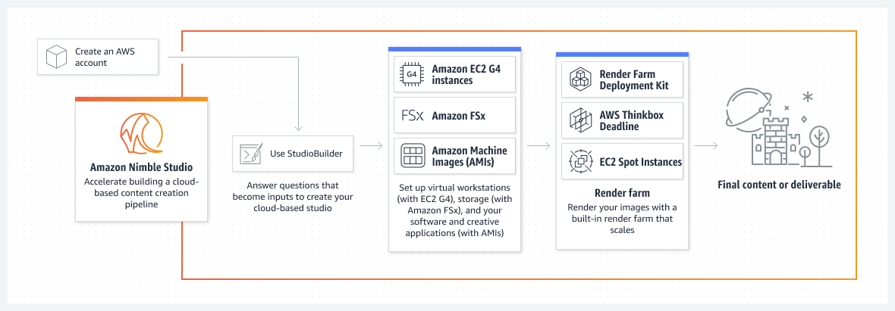
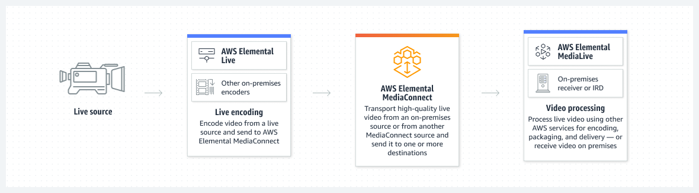
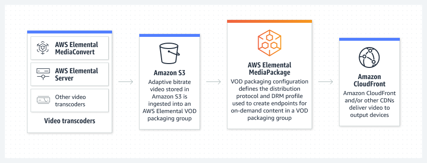

## 미디어(Media)

- 최초 작성 일자: 2023-03-29
- 수정 내역:
    - 2023-03-29: 최초 작성

---

### Amazon Elastic Transcoder

- **사용이 쉽고 확장 가능한 미디어 트랜스코딩**
- AWS Elemental MediaConvert를 통해 비용 절감 및 더 많은 기능 활용
- Amazon Elastic Transcoder는 클라우드에서 미디어를 트랜스코딩하는 서비스다. 
  확장성이 뛰어나고 사용하기 쉬우며 비용 효율적인 방법을 통해 개발자 및 비즈니스에서 소스 형식의 미디어 파일을 스마트폰, 태블릿, PC등의 디바이스에서 재생되는 버전으로 변환할 수 있다.

#### 사용 이유

- **사용 편의성**: AWS Management Console, 서비스 API 또는 SDK를 사용하여 시작할 수 있으며, 시스템 트랜스코딩 프리셋으로 적합한 트랜스코딩 설정을 바로 적용할 수 있다.
- **탄력적인 확장성**: Amazon Elastic Transcoder는 미디어 트랜스코딩 워크로드에 따라 원활하게 확장되도록 설계되었으며, 큰 볼륨의 미디어 파일 및 대용량 파일을 처리할 수 있도록 설계되어 있다.
- **비용 효율성**: Amazon Elastic Transcoder는 콘텐츠 길이 기반 요금 모델을 사용하므로 트랜스코딩할 미디어 출력의 길이(분)에 따라 요금을 지불하게 된다. 
  예를 들어, 동영상의 트랜스코딩된 출력이 30분 분량인 경우 30분의 트랜스코딩에 대해 요금을 지불하게 된다.
- **관리형**: Amazon Elastic Transcoder를 사용하면 분산 클라우드 기반 환경에서 트랜스코딩 소프트웨어 관리가 아니라 콘텐츠에 조금 더 집중할 수 있다.
  이 서비스에서는 시스템 확장 및 운영을 처리하고 코덱을 최신 상태로 유지하는 프로세스를 관리한다.
- **보안**: 사용자 콘텐츠는 사용자가 제어한다. 즉, 자산은 사용자 소유의 Amazon S3 버킷에 있으며 사용자는 IAM 역할을 통해 AWS에 액세스 권한을 부여하게 된다.
  따라서 제어권을 포기하지 ㅇ낳고도 현재의 보안 및 자격 증명 프레임워크에 원활하게 맞출 수 있다.
- **원활한 전송**: Amazon Elastic Transcoder, Amazon S3 및 Amazon CloudFront를 사용하면 콘텐츠를 저장, 트랜스코딩 및 전송할 수 있다.
- **AWS 통합**: Amazon Elastic Transcoder는 AWS에서 엔드 투 엔드 미디어 솔루션을 만드는 데 사용할 수 있는 중요한 미디어 빌딩 블록을 제공한다.
  예를 들어, Amazon Clacier를 사용하여 마스터 콘텐츠를 저장하고, Amazon Elastic Transcoder를 사용하여 Amazon S3에 저장된 마스터 파일을 배포용 변환 파일로 트랜스코딩하여, Amazon CloudFront를 사용하여 이 변환 파일을 인터넷을 통해 대규모로 스트리밍하고, CloudWatch를 사용하여 트랜스코딩 워크플로의 상태를 모니터링할 수 있다.

---

### Amazon Interactive Video Service(IVS)

- **관리형 라이브 동영상 솔루션**
- 매력적인 라이브 스트림과 대화형 동영상 경험 구축

#### 사용 이유

- 관리형 서비스를 통해 라이브 스트림을 생성, 구성하고 시청자에게 전송할 수 있다.
- Twitch에서 사용하는 것과 동일한 라이브 스트리밍 기술과 글로벌 인프라를 사용할 수 있다.
- 3초 미만의 짧은 지연 시간으로 라이브 스트리밍을 전송할 수 있다.
- Amazon IVS Player 및 Broadcast SDK를 사용하여 라이브 스트림을 애플리케이션에 통합할 수 있다.

#### 작동 방식

- Amazon Interactive Video Service(Amazon IVS)는 대화형 동영상 경험을 구축하는 데 사용할 수 있는 관리형 라이브 스트리밍 솔루션이다.
- **관리형 라이브 스트리밍**

- **스트리밍용 관리형 채팅**

#### 사용 사례

- **소셜 채팅룸을 통해 커뮤니티 구축**: 라이브 콘텐츠를 보면서 채팅을 스트리밍할 수 있는 가상의 공간을 추가하여 시청자가 간의 상호 작용을 유도할 수 있다.
- **전자 상거래를 통한 동영상 수익 창출 허용**: 컴패니언 프로모션 요소를 라이브 스트림 콘텐츠와 동기화하여 시청자가 구매 또는 기부하도록 장려한다.
- **설문조사를 사용하여 고객의 의견 파악**: 시간 설정 메타데이터를 사용하는 설문조사 및 투표 애플리케이션으로 동영상 시청자로부터 즉각적인 피드백을 얻는다.
- **실시간 Q&A 제공**: 시청자는 채팅으로 질문하고 답변을 실시간으로 받을 수 있다. 또한 라이브 비디오로 퀴즈 애플리케이션을 구축한다.

---

### Amazon Kinesis Video Streams

- **비디오 스트림 처리 및 분석**
- 재생, 분석 및 기계 학습을 위해 미디어 스트림을 캡처, 처리 및 저장
- Amazon Kinesis Video Streams를 사용하면 분석, ML(기계 학습), 재생 및 기타 처리를 위해 커넥티드 디바이스에서 AWS로 비디오를 쉽고 안전하게 스트리밍할 수 있다.
- Kinesis Video Streams는 수백만 대의 디바이스의 스트리밍 비디오 데이터를 수집하는 데 필요한 모든 인프라를 자동으로 프로비저닝하고 탄력적으로 조정한다.
- 스트림의 비디오 데이터를 안정적으로 저장, 암호화 및 인덱싱하며, 사용하기 쉬운 API를 통해 데이터에 액세스할 수 있다.

#### 사용 이유

- **수백만 개의 디바이스에서 비디오를 스트리밍**: Amazon Kinesis Video Streams는 디바이스가 재생, 저장, 분석, 기계 학습 및 기타 처리를 위해 미디어를 AWS로 쉽고 안전하게 스트리밍할 수 있도록 지원하는 SDK를 제공한다.
- **실시간 비전 및 비디오 지원 앱 구축**: Amazon Rekognition Video와 통합하여 실시간 컴퓨터 비전 기능을 탑재하고 인기 있는 오픈 소스 기계 학습 프레임워크를 사용하여 실시간 비디오 분석 기능을 탑재한 애플리케이션을 손쉽게 구축할 수 있다.
- **라이브 및 녹화된 비디오 스트림 재생**: Kinesis Video Streams의 HTTP Live Streaming(HLS) 기능을 사용하여 라이브 및 녹화된 미디어를 Kinesis 비디오 스트림에서 브라우저 또는 모바일 애플리케이션으로 손쉽게 스트리밍할 수 있다.
- **향상된 재생 또는 기계 학습 애플리케이션을 위한 이미지 추출**: Amazon Kinesis Video Streams는 비디오 스트림에서 이미지를 추출하는 데 도움이 되는 새로운 API 및 SDK를 제공한다.
  이러한 이미지를 썸넹리 또는 향상된 스크러빙과 같은 재생 애플리케이션에 사용하거나 기계 학습 파이프라인에 사용할 수 있다.
- **양방향 실시간 미디어 스트리밍으로 앱 구축**: Amazon Kinesis Video Streams는 웹 브라우저, 모바일 애플리케이션 및 커넥티드 디바이스 간에 양방향 미디어 스트리밍을 위한 오픈 소스 프로젝트인 WebRTC를 지원한다.
- **보안**: Amazon Kinesis Video Streams를 통해 AWS IAM를 사용해 스트림에 대한 액세스를 제어할 수 있다.
- **내구성을 갖춘 검색 가능한 스토리지**: Amazon Kinesis Video Streams는 Amazon S3를 기본 데이터 스토어로 사용하므로 데이터가 내구성과 안정성을 갖춘 상태로 저장된다.
- **관리할 인프라가 없음**: Amazon Kinesis Video Streams는 사용자를 대신해 모든 인프라를 관리한다. 스트림과 사용 애플리케이션 수가 증가해도 구성, 소프트웨어 업데이트, 장애 또는 인프라 규모 조정에 대해 걱정할 필요가 없다.

#### 작동 방식

- **재생, 분석 및 기계 학습을 위해 미디어 스트림을 캡처, 처리 및 저장**

- **아주 짧은 지연 시간의 라이브 스트리밍 및 양방향 실시간 통신을 갖춘 애플리케이션 구축**

#### 사용 사례

- **스마트 홈**: Amazon Kinesis Video Streams를 사용하면 도어벨, 유아 모니터, 웹캠 및 가정용 감시 시스템과 같이 카메라가 장착된 홈 디바이스에서 AWS로 라이브 비디오와 오디오를 손쉽게 스트리밍할 수 있다.

- **스마트 시티**: Amazon Kinesis Video Streams를 사용하면 이러한 대량의 비디오 데이터를 안전하고 비용 효율적으로 수집, 저장 및 분석하여 교통 문제를 해결하고, 범죄를 방지하고, 긴급 구조원을 파견할 수 있다.

- **산업 자동화**: Amazon Kinesis VIdeo Streams를 사용하면 레이더 및 광선 레이더 신호, 온도 프로필, 산업 장비의 깊이 데이터와 같이 시간이 인코딩된 다양한 데이터를 수집할 수 있다.
  그런 다음, 예측 유지 보수 등 산업 자동화 사용 사례에 맞춰 Apache MxNet, TensorFlow 및 OpenCV를 비롯한 선호하는 기계 학습 프레임워크를 사용하여 데이터를 분석할 수 있다.

---

### Amazon Nimble Studio

- **디지털 콘텐츠 제작 스튜디오 빌드**
- 클라우드에서 시각적 콘텐츠를 빠르게 생성

#### 사용 이유

- 가상 워크스테이션, 스토리지, 렌더 팜을 몇 주가 아닌 몇 시간 안에 설정할 수 있다.
- 사용자 권한 부여, 프로젝트 데이터 공유, 프로젝트에 신규 팀 멤버 추가를 간소화할 수 있다.
- 멀리 떨어져 있는 아티스트를 몇 분 안에 온보딩하여 전 세계 최고의 인재와 만날 수 있다.
- 그래픽 집약적인 프로젝트에 아티스트 또는 컴퓨팅 리소스를 추가하여 하나 또는 여러 위치에 스튜디오를 확장할 수 있다.

#### 작동 방식

- Amazon Nimble Studio는 크리에이티브 스튜디오에서 스토리보드 스케치부터 최종 출품에 이르기까지 시각적 효과(VFX), 애니메이션 및 대화형 콘텐츠를 크라우드에서 제작하는 데 도움이 된다.

#### 사용 사례

- **시선을 사로잡는 시각 효과 디자인**: 고도로 복잡한 VFX 작업도 처리할 수 있는 강력한 인프라로 생생한 크리쳐, 몰입 환경 또는 복잡한 시뮬레이션을 만든다.
- **클라우드에서 애니케이션 만들기**: 단편 애니메이션 및 광고부터 장편 영화까지, 모든 분야에서 사용자의 요구에 따라 확장하는 콘텐츠 제작 파이프라인을 개발한다.
- **매력적인 비디오 게임 개발**: 게임 제작 파이프라인을 확장하여 AWS 파트너인 Epic Games, Incredibuild, Perforce 등의 원격 팀과 연결한다.

---

### AWS Elemental MediaConnect

- **안정적이고 안전한 라이브 비디오 전송**

#### 사용 이유

- 표준 IP 전송에 서비스 품질 계층을 추가하여 고품질 동영상을 중단 없이 전송할 수 있다.
- 업계 표준 암호화를 사용하여 라이브 동영상의 보안을 유지하고 배포를 제어할 수 있다.
- 신호 및 흐름 수준에서 복원력을 확보하고 단 하나의 장애 지점 없이 워크플로를 구축할 수 있다.
- 70개의 대상이 있는 일반적인 위성 기본 배포 사용 사례와 비교하여 30% 이상 절감할 수 있다.

#### 작동 방식

- AWS Elemental MediaConnect는 라이브 비디오를 위한 고품질 전송 서비스다. 
  인공위성과 광섬유의 신뢰성 및 보안과 IP 기반 네트워크의 유연성, 민첩성 및 경제성을 모두 확보할 수 있다.

#### 사용 사례

- **고가치 라이브 브로드캐스트 관리**: 문제 식별 및 동영상 전달 신뢰 유지를 위한 브로드캐스트 표준 알림을 통해 실시간으로 중요한 비디오 품질 지표를 확보한다.
- **원격 프로덕션 애플리케이션 연결**: AWS Cloud Digital Interface(CDI) 워크로드를 사용하여 클라우드에서 실행되는 프로덕션 전환기, 그래픽 엔진 및 기타 구성 요소를 연결한다.
- **안전하고 안정적인 콘텐츠 수집**: 권한이 있는 고객만 콘텐츠에 액세스할 수 있도록 업계 표준 암호화를 사용하여 라이브 비디오를 보호한다.
- **Zixi SDK를 사용하여 비디오 스트리밍**: 전용 인프라나 특수 장치 없이 신호를 전 세계 다른 AWS 계정에 배포한다.

---

### AWS Elemental MediaConvert

- **파일 기반 비디오 콘텐츠 변환**
- 비디오 파일을 처리하여 온디맨드 콘텐츠의 배포 또는 아카이브 준비

#### 사용 이유

- 브로드캐스트급 동영상 및 오디오 기능을 통해 고품질 동영상 출력을 생성할 수 있다.
- 트랜스코딩 인프라 관리에 시간이나 리소스를 할애하지 않고도 원하는 동영상 처리 설정으로 작업을 제출할 수 있다.
- 처리하는 동영상의 길이와 사용하는 기능을 기준으로 비용을 지불하면 된다.

#### 작동 방식

- AWS Elemental MediaConvert는 브로드캐스트 수준의 기능을 제공하는 파일 기반 비디오 트랜스코딩 서비스다.
  브로드캐스트 및 다중 화면 전송을 위한 대규모 라이브 스트림 콘텐츠를 생성한다.

#### 사용 사례

- **비디오 하이라이트 클립 생성**: 인공 지능 및 기계 학습 모델로 인사이트를 수집하여 스포츠 이벤트 관련 클립을 생성한다.
- **입력에 구애받지 않는 고품질 동영상 생성**: 자동 품질 기반 비트레이트(QVBR)를 사용하여 사람의 개입 없이 콘텐츠 복잡성 및 인코딩 파라미터를 기반으로 적절한 품질 수준을 설정한다.
- **4K HDR 미디어 자산 제공**: 오버더톱(OTT) 전달용 4K HDR 비디오를 준비하여 HDR 및 SDR 적응형 비트레이트 출력을 생성한다.

---

### AWS Elemental MediaLive

- **라이브 비디오 콘텐츠 변환**
- 어느 디바이스로든 브로드캐스트 및 스트리밍할 수 있도록 라이브 비디오를 인코딩

#### 사용 이유

- 향상된 동영상 및 오디오 기능에 대한 지원을 통해 브로드캐스트 품질의 라이브 스트림을 생성할 수 있다.
- 동영상 인코딩 인프라의 프로비저닝을 자동화하여 라이브 채널을 몇 분 만에 배포할 수 있다.
- 여러 가용 영역에서 리소스를 관리하고 라이브 채널 중단 없이 문제를 감지 및 해결할 수 있다.
- 인프라 인코딩에 대한 초기 투자를 하지 않고 사용한 서비스에 대해서만 지불하면 된다.

#### 작동 방식

- AWS Elemental MediaLive는 브로드캐스트 TV 및 인터넷 연결 디바이스로 전송할 고화질 스트림을 생성하는 브로드캐스트급 라이브 비디오 처리 서비스다.

#### 사용 사례

- **HD 또는 UHD 비디오 전송**: AWS Elemental MediaLive에 비디오를 전송하기 위한 소형의 휴대용 AWS Elemental Link HD 및 UHD 디바이스를 사용하여 시청자에게 비디오를 전달한다.
- **입력을 예약하거나 동적으로 전환**: 여러 비디오 입력을 추가하고 일정 기능을 사용하여 전환하거나, 필요에 따라 입력 전환 작업을 만들어 동적으로 전환한다.
- **채널 자동 배포**: AWS Cloud Development Kit(CDK)를 사용하여 채널을 생성하고 .mp4 파일을 루프 처리하는 미디어 인프라를 만든다.

---

### AWS Elemental MediaPackage

- **비디오 오리지네이션 및 패키징**
- 인터넷 전송을 위한 비디오 준비 및 보호

#### 사용 이유

- 콘텐츠를 패키징하고 다양한 동영상 재생 디바이스에 배포할 수 있다.
- 여러 가용 영역에서 리소스를 자동으로 관리하고 스트림 중단 없이 문제를 감지 및 해결할 수 있다.
- 시청자를 위해 DVR과 같은 환경을 구성하고 다양한 디지털 권한 관리(DRM) 제공업체를 제공한다.
- Amazon CloudFront 콘텐츠 전송 네트워크(CDN) 및 AWS Elemental MediaLive와 통합할 수 있다.

#### 작동 방식

- AWS Elemental MediaPackage는 비디오 콘텐츠를 준비 및 보호하고 다양한 커넥티드 디바이스에 배포된다.
- 이 서비스는 AWS Elemental MediaLive와 같은 인코더에서 단일 비디오 입력을 가져와서 여러 스트리밍 형식으로 패키징한 다음 시청자 요구 사항에 따라 자동으로 출력을 조정한다.

- **라이브 패키징**

- **비디오 온디맨드(VOD) 패키징**

#### 사용 사례

- **AWS 기반 라이브 스트림**: 몇 번의 클릭만으로 여러 AWS 미디어 서비스와 Amazon CloudFront를 결합한다.
- **VOD 라이브러리의 오리진 생성**: Secure Packager and Encoder Key Exchange(SPEKE) API를 통해 패키징 및 타사 DRM 공급자와의 통합을 시기적절하게 제공한다.
- **CDN 인증 구성**: 무단 사용이나 CDN 우회를 통해 콘텐츠에 직접 액세스하는 공격자로부터 콘텐츠를 보호한다.

---

### AWS Elemental MediaStore

- **미디어 스토리지 및 간단한 HTTP 오리진**
- 라이브 스트리밍 미디어 워크플로를 위한 비디오 자산을 저장 및 전송

#### 사용 이유

- 일관된 서비스 품질을 갖춘 대규모 고품질 미디어 워크로드에 맞게 최적화된 콘텐츠를 제공할 수 있다.
- 로드가 증가해도 시청 환경의 품질에 부정적인 영향을 주지 않도록 자동으로 확장할 수 있다.
- AWS IAM를 사용하여 세분화된 액세스 제어를 지정할 수 있다.

#### 작동 방식

- AWS Elemental MediaStore는 미디어에 최적화된 스토리지 서비스로, 라이브 스트리밍 동영상 콘텐츠를 전송하는 데 필요한 성능, 일관성 및 짧은 지연 시간을 제공한다.

#### 사용 이유

- **미디어 수집 가속화**: Amazon CloudFront 배포를 통해 어디에서나 비디오 콘텐츠를 푸시하여 AWS Elemental MediaStore 컨테이너에 수집한다.
- **지연 시간이 짧은 스트림 생성**: 고품질 이미지 및 디지털 권한 관리(DRM) 통합을 사용하면 청크 인코딩을 사용하여 AWS Elemental Live에서 짧은 지연 시간으로 비디오를 전송할 수 있다.
- **라이브 스트리밍 플랫폼 구축**: 특히 콘텐츠가 플랫폼에 업로드될 때 짧은 지연 시간으로 스트리밍 서비스의 라이브 비디오를 전송한다.

---

### AWS Elemental MediaTailor

- **비디오 개인화 및 수익화**
- 선형 채널 어셈블리 및 개인화된 광고 삽입 서비스

#### 사용 이유

- 인코딩된 기존 콘텐츠를 사용하여 적은 실행 비용으로 라이브 스트림을 생성할 수 있다.
- 관련 프로그램 콘텐츠 및 개인화된 광고를 전송하여 시청자 참여를 증가시킬 수 있다.
- 프로그램 콘텐츠와 광고 시간 사이에 버퍼링 없이 시청자에게 TV와 같은 원활한 시청 환경을 제공할 수 있다.
- 개인화된 광고 및 어셈블된 선형 채널을 통해 수익 창출 기회를 최적화할 수 있다.

#### 작동 방식

- AWS Elemental MediaTailor는 채널 어셈블리 및 개인화된 광고 삽입 서비스다.
- 비디오 제공업체는 이 서비스를 통해 기존 비디오 콘텐츠를 사용하여 선형 Over-The-Top(OTT) 채널을 생성할 수 있다.
- 이후 개인화된 광고로 이러한 채널 또는 다른 라이브 스트림을 현대화할 수 있다.

- **채널 어셈블리와 광고 삽입**

- **개인화된 광고 삽입**

#### 사용 사례

- **선형 채널 시작**: VOD 라이브러리를 사용하여 채널 어셈블리를 통해 비용 효율적인 방식으로 라이브 채널을 빠르게 실행한다.
- **정확한 광고 지표 보고 수신**: 데이터 손실이나 노출 손실로 인한 수익 감소 없이 개인화된 광고를 실행하고 정확한 광고 조회수 지표를 확보한다.
- **스트림용 VOD 및 라이브 콘텐츠 결합**: 개인화된 광고가 있는 VOD 및 라이브 비디오 콘텐츠를 여러 플랫폼에 배포되는 새로운 스트림에 예약한다.

---

### AWS Elemental Application & Software

- **온프레미스 미디어 솔루션**
- 비디오 처리 및 전송을 위한 온프레미스 솔루션
- AWS Elemental Appliances and Software 솔루션은 데이터 센터, 코로케이션 공간 또는 온프레미스 시설에 고급 비디오 프로세싱 및 전송 기술을 제공한다.
- AWS Elemental Appliances and Software를 배포하여 온프레미스에서 비디오 자산을 인코딩, 패키징 및 전송하고 원활하게 클라우드 기반 비디오 인프라에 연결할 수 있다.
- AWS 클라우드 미디어 솔루션과 간편하게 통합되도록 설계된 AWS Elemental Appliances and Software는 물리적 카메라 및 라우터 인터페이스, 관리형 네트워크 전송 또는 네트워크 대역폭 제약을 수용하기 위해 온프레미스에서 유지되어야 하는 비디오 워크로드를 지원한다.
- AWS Elemental Live, Conductor Live 및 Statmux는 배포 가능한 어플라이언스 또는 자체 하드웨어에 설치하는 AWS 라이선스 소프트웨어의 두 가지 형태로 제공된다.

#### 사용 이유

- **유연한 비디오 솔루션**: 기존 인프라를 중단시키지 않고 필요한 곳에 비디오 처리 및 전송 솔루션을 배포한다.
- **새로운 기능을 쉽게 통합**: 소프트웨어 업데이트를 통해 새로운 비디오 및 오디오 코덱을 비롯한 새롭고 업데이트된 기능이 쉽게 도입되어 이를 통해 새로운 소프트웨어나 하드웨어를 구입할 필요 없이 비디오 솔루션의 효율성, 품질 및 기능을 계속해서 극대화할 수 있다.
- **AWS Media Services와 함께 작동하도록 설계**: AWS Elemental Appliances and Software는 AWS Cloud에서 브로드캐스트 및 Over-The-Top 비디오를 전송, 준비, 처리 및 전달하는 Amazon Media Services와 함께 작동하도록 설계되었다.
- **고품질 보기 환경**: 새롭고 입증된 기술을 활용하여 라이브 또는 온디맨드 비디오를 위한 브로드캐스트 수준의 환경을 제공한다.
- **신뢰할 수 있는 서비스 제공**: 고가용성 기능이 내장된 미션 크리티컬 스트림을 위해 복원력 있는 비디오 인프라를 유지한다. 
  지속적인 신호 흐름과 중단 없는 서비스 전송을 달성해야 하는 중복성 수준을 제어한다.
- **리소스 극대화**: 뛰어난 리소스 활용을 위해 빠르고 효율적으로 비디오 콘텐츠를 처리한다.
  고유한 소프트웨어 아키텍처를 사용하여 라이브 또는 온디맨드 콘텐츠의 성능을 극대화하고 압축을 최적화할 수 있으므로 적은 리소스와 적은 네트워크 대역폭으로 더 많은 비디오를 처리할 수 있다.

---

### AWS Thinkbox Deadline

- **렌더 팜 관리자**
- 확장 가능하고 유연한 컴퓨팅 렌더링 관리

#### 사용 이유

- 온프레미스 자산 파일을 Amazon S3에 자동으로 동기화하여 클라우드에서 가용성을 보장한다.
- 로컬 서버와 동기화하고, 렌더링이 시작되기 전에 데이터 전송을 관리하고, 요금 할당을 위해 계정과 인스턴스에 태그를 지정한다.
- 사용 기반 소프트웨어 라이선스를 구매하거나 기존 라이선스를 사용하거나 두 가지를 조합하여 타사 디지털 콘텐츠를 생성할 수 있다.
- Amazon EC2 스팟 인스턴스를 활용하여 온디맨드 가격 대비 최대 90%를 절약할 수 있다.

#### 작동 방식

- AWS Thinkbox Deadline은 렌더 팜을 위한 유연한 컴퓨팅 관리 소프트웨어다.

#### 사용 사례

- **확장 가능하고 유연한 렌더 팜 생성**: 하이브리드 또는 클라우드 기반 렌더팜을 생성하고 AWS Portal을 사용하여 몇 분 만에 수천 개의 코어로 확장한다.
- **렌더 팜 사용자 지정**: Python과 같은 친숙한 프로그래밍 언어를 사용하는 렌더 팜 배포 키트(RFDK)로 렌더 팜을 구축, 조정 및 배포한다.
- **큰 프레임 분할**: Jigsaw 도구를 사용하면 고해상도 이미지를 여러 시스템에 배포하여 더 빠르게 렌더링할 수 있다.
- **일반적인 사후 렌더링 작업 자동화**: 렌더링 파이프라인에서 QuickTime 비디오, 썸네일 및 기타 산출물을 체계적으로 생성 및 처리하여 사용자의 시간을 확보한다.

---

### AWS Thinkbox Frost

- **입자 메시를 더 빠르게 생성**
- 여러 소스에서 파티클 메시 구축

#### 사용 이유

- isosurface 및 지오메트리 복제 기술을 사용하여 여러 소스에서 단일 메시를 생성한다.
- 과도한 메모리 사용 없이 몇 초 만에 수백만 개의 포인트에서 폴리곤 메쉬를 만든다.
- Autodesk 3ds Max와 호환되는 입자 메시지를 만든다.

#### 작동방식

- AWS Thinkbox Frost를 사용하면 등가면 및 지오메트리 복제 기술을 사용하여 입자 메시를 신속하게 구축할 수 있다.

---

### AWS Thinkbox Krakatoa

- **프로덕션 등급 볼류메트릭 렌더링**
- 프로덕션 등급 체적 측정 렌더링

#### 사용 이유

- 방대한 양의 파티클을 처리하고 렌더링하여 먼지, 연기, 바다 거품과 같은 자연 현상을 만든다.
- 전용 고급 그래픽 가속기가 없는 랩톱 및 렌더 노드를 포함하여 대부분의 Windows 또는 Linux 시스템에서 실행할 수 있다.
- Autodesk 3ds Max, Autodesk Maya 및 Cinema 4D와 함께 사용하거나 독립 실행형 입자 렌더러로 사용할 수 있다.
- 최종 이미지에 대한 심층 제어를 위해 여러 입자별 데이터 채널 및 광산란 모델을 지원한다.

#### 작동 방식

- AWS Thinkbox Krakatoa는 방대한 양의 입자를 수집, 캐싱, 변환, 수정, 음영 처리 및 렌더링하기 위한 파이프라인을 제공한다.

---

### AWS Thinkbox Sequoia

- **포인트 클라우드 데이터 지오메트리**
- 포인트 클라우드 처리 및 메싱 소프트웨어

#### 사용 이유

- 기본적으로 AWS Thinkbox Deadline과 통합하여 여러 컴퓨팅 노드에서 포인트 클라우드 및 메시 처리를 구현한다.
- 사용자 상호 작용 및 데이터 처리를 비동기식으로 관리하여 대량 계산 중에도 상호 작용을 보장한다.
- 수밀 또는 단면 메시를 생성하고 분리된 아일랜드를 제거하여 불필요한 메시를 정리한다.
- 광범위한 산업 표준 포인트 데이터 형식을 가져오고 변환하고 내보내고 더 쉽게 일괄 변환할 수 있다.

#### 작동 방식

- AWS Thinkbox Sequoia는 레이저 스캐너, 사진 측량법 및 기타 소스에서 얻은 포인트 클라우드 데이터에서 지오메트리를 생성한다.

#### 사용 사례

- **포인트 클라우드 데이터 검토**: Windows, macOS 또는 Linux 플랫폼과 호환되는 모든 하드웨어에서 대규모 포인트 클라우드 데이터 세트를 탐색한다.
- **통합 메시 만들기**: 메시 표면에서 포인트 클라우드를 생성하여 어러 개의 작은 부품을 연속 메시로 통합하기 위한 메시-포인트-메시 워크플로를 허용한다.
- **다른 메쉬 형태 만들기**: 하나 이상의 포인트 클라우드 데이터 소스에서 단일 메쉬 또는 다중 메쉬 세그먼트를 생성한다.
- **포인트 데이터 변환**: 포인트 클라우드 데이터를 컴팩트하고 빠르게 액세스할 수 있는 중간 캐시 형식인 사양 기반 프로그램 검토 도구 형식으로 변환한다.

---

### AWS Thinkbox Stoke

- **Autodesk용 입자 시뮬레이터**
- Autodesk 3ds Max를 위한 입자 시뮬레이션 단순화

#### 사용 이유

- 경쟁 유체 역학 플러그인에 비해 Autodesk 3ds Max용 입자 시뮬레이션을 더 빠르게 생성한다.
- 프로그래밍 또는 스크립팅 경험이 없는 아티스트가 확장 가능한 절차적 지오메트리 수정자를 쉽게 사용할 수 있다.
- 노드 기반 이미지 합성 애플리케이션과 유사한 아티스트 친화적인 채널 편집 워크플로우에 대한 액세스를 사용자에게 제공한다.
- Autodesk 3ds Max SDK에서 사용할 수 없는 최적화된 형상 및 입자 조회 작업에 액세스한다.

#### 작동 방식

- AWS Thinkbox Stoke는 대용량 입자 구름 생성을 간소화하고 가속화한다.

#### 사용 사례

- **여러 입력 소스 지원**: PRT 및 RealFlow BIN과 같은 형식과 FumeFX, Paticle Flow, cebas thinkingParticles 및 3ds Max Force Space Warps의 시뮬레이션을 활성화한다.
- **필드 조작**: 업계 표준 형식을 사용하여 속도 필드, 필드 데이터 로드 및 저장을 포함한 새 필드를 만들고 시뮬레이션한다.
- **현장 데이터 통합**: 필드 데이터를 Particle Flow, MassFX, Hair and Fur, Materials, 대부분의 렌더러 및 기타 시스템과 같은 3ds Max 하위 시스템과 결합한다.
- **AWS Thinkbox Krakatoa 대용량 입자 렌더러에 연결**: AWS Thinkbox Krakatoa 및 PRT 객체, Magma 및 Delete 수정자, Particle Data Viewer를 비롯한 다양한 구성 요소와 호환 가능하게 작동한다.

---

### AWS Thinkbox XMesh

- **애니메이션 기하학 파일 최적화**
- 애니메이션 장면 지오메트리를 위한 파일 로딩 속도 향상

#### 사용 이유

- 느리거나 큰 애니메이션 3D 지오메트리 자산 파일을 최적화한다.
- Autodesk 3ds Max, Autodesk Maya 및 The Foundry's Nuke와 같은 널리 사용되는 응용 프로그램을 지원한다.
- 프레임 간에 일관된 채널 데이터를 공유하고 시간 경과에 따른 데이터 중복을 제거한다.

#### 작동 방식

- AWS Thinkbox XMesh는 대규모 애니메이션 지오메트리 자산의 파일 업로드를 가속화한다.

---

### 참고한 자료

- [Amazon Elastic Transcoder](https://aws.amazon.com/ko/elastictranscoder/?nc2=h_ql_prod_ms_et)
- [Amazon Interactive Video Service](https://aws.amazon.com/ko/ivs/?nc2=h_ql_prod_ms_ivs)
- [Amazon Kinesis Video Streams](https://aws.amazon.com/ko/kinesis/video-streams/?nc2=h_ql_prod_ms_kvs&amazon-kinesis-video-streams-resources-blog.sort-by=item.additionalFields.createdDate&amazon-kinesis-video-streams-resources-blog.sort-order=desc)
- [Amazon Nimble Studio](https://aws.amazon.com/ko/nimble-studio/?nc2=h_ql_prod_ms_ns)
- [AWS Elemental MediaConnect](https://aws.amazon.com/ko/mediaconnect/?nc2=h_ql_prod_ms_emc)
- [AWS Elemental MediaConvert](https://aws.amazon.com/ko/mediaconvert/?nc2=h_ql_prod_ms_emcv)
- [AWS Elemental MediaPackage](https://aws.amazon.com/ko/mediapackage/?nc2=h_ql_prod_ms_emp)
- [AWS Elemental MediaStore](https://aws.amazon.com/ko/mediastore/?nc2=h_ql_prod_ms_ems)
- [AWS Elemental MediaTailor](https://aws.amazon.com/ko/mediatailor/?nc2=h_ql_prod_ms_emt)
- [AWS Elemental Appliances & Software](https://aws.amazon.com/ko/elemental-appliances-software/?nc2=h_ql_prod_ms_eas)
- [AWS Thinkbox Deadline](https://aws.amazon.com/ko/thinkbox-deadline/?nc2=h_ql_prod_ms_td)
- [AWS Thinkbox Frost](https://aws.amazon.com/ko/thinkbox-frost/?nc2=h_ql_prod_ms_tf)
- [AWS Thinkbox Krakatoa](https://aws.amazon.com/ko/thinkbox-krakatoa/?nc2=h_ql_prod_ms_tk)
- [AWS Thinkbox Sequoia](https://aws.amazon.com/ko/thinkbox-sequoia/?nc2=h_ql_prod_ms_tse)
- [AWS Thinkbox Stoke](https://aws.amazon.com/ko/thinkbox-stoke/?nc2=h_ql_prod_ms_tst)
- [AWS Thinkbox XMesh](https://aws.amazon.com/ko/thinkbox-xmesh/?nc2=h_ql_prod_ms_tx)