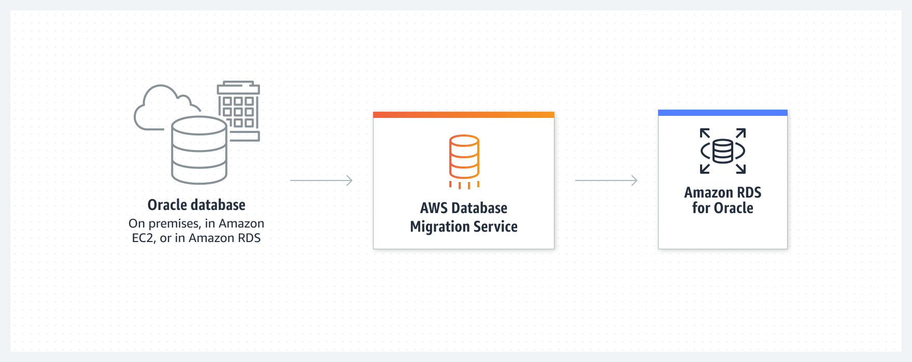

## 마이그레이션 및 전송(Migration & Transmission)

- 최초 작성 일자: 2023-03-29
- 수정 내역:
  - 2023-03-29: 최초 작성

---

### AWS Migration Hub

- **단일 위치에서 마이그레이션 추적**
- 마이그레이션과 현대화를 간소화하는 데 필요한 도구을 찾을 수 있다.

#### 사용 이유

- 단일 위치에서 필수 검색, 분석, 계획 도구에 액세스하여 마이그레이션 계획을 수립할 수 있다.
- 자동화된 마이그레이션 팩토리를 구축하여 AWS로의 마이그레이션을 가속화할 수 있다.
- AWS 전문 지식을 활용하여 마이그레이션을 계획하고 비즈니스 목표를 달성할 수 있다.
- 특정 요구 사항을 해결하기 위해 입증된 워크플로 템플릿을 사용하여 시간을 절약할 수 있다.

#### 작동 방식

- AWS Migration Hub는 서버 및 애플리케이션 인벤토리 데이터를 수집하여 AWS로의 마이그레이션을 평가, 계획 추적하는 데 사용할 수 있는 중앙 위치를 제공한다.
- Migration Hub는 마이그레이션 이후 애플리케이션 현대화를 가속화하는 데 도움이 될 수 있다.

#### 사용 사례

- **마이그레이션 평가 및 계획**: 애플리케이션을 검색하여 마이그레이션 가능 여부를 결정하고 현대화 전략 권장 사항을 검토한다.
- **AWS로 리프트 앤 시프트 마이그레이션 자동화**: 대규모 엔터프라이즈 애플리케이션을 마이그레이션하고 서로 다른 도구의 종속성을 관리하는 것과 관련된 많은 수동 작업이 없어진다.
- **레거시 애플리케이션 리펙토링**: 애플리케이션 리펙토링을 조기 달성하고, 개발을 단순화하며, 기존 애플리케이션과 마이크로서비스를 하나의 애플리케이션으로 관리한다.

---

### AWS Application Discovery Service

- **온프레미스 애플리케이션을 검색하여 마이그레이션 간소화**
- 온프레미스 서버 인벤토리 및 동작을 검색하여 클라우드 마이그레이션을 계획

#### 사용 이유

- 서버 사용률 및 네트워크 연결 데이터를 수집하여 세부적인 마이그레이션 계획을 수립할 수 있다.
- 온프레미스 인벤토리의 포괄적인 스냅샷을 생성하여 AWS 전문가와 협력하고 마이그레이션 여정을 가속화할 수 있다.
- 검색 데이터를 AWS Migration Hub와 같은 다른 AWS 서비스와 통합하여 여러 마이그레이션 태스크를 지원할 수 있다.
- AWS로 전송하고 서비스의 데이터 스토어 내에 저장된 수집 데이터를 암호화하여 보호할 수 있다.

#### 작동 방식

- AWS Application Discovery Service를 사용하면 온프레미스 데이터 센터에 대한 정보를 수집하여 클라우드 마이그레이션 프로젝트를 계획하는 데 도움이 된다.

#### 사용 사례

- **온프레미스 서버 인벤토리 파악**: 인벤토리 검색을 수행하여 서버 호스트 이름, IP 및 MAC 주소, 주요 리소스 할당 세부 정보를 수집하여 마이그레이션을 가속화한다.
- **네트워크 통신 패턴 매핑**: 애플리케이션과 서버 간의 연결을 검사하여 알 수 없는 서버를 찾아내고, 종속성을 더 잘 이해하며, 이동 그룹을 설정한다.
- **마이그레이션 활용**: 사용 데이터를 수집하여 적절한 크기의 Amazon EC2 인스턴스를 생성하고 Migration Hub에서 마이그레이션을 계획한다.

---

### AWS Application Migration Service(MGN)

- **온프레미스 및 클라우드 기반 애플리케이션을 이전하여 개선**

#### 사용 이유

- 지원되는 운영 체제를 실행하는 소스 인프라에서 애플리케이션을 마이그레이션할 수 있다.
- 재해 복구 및 운영 체제 또는 라이선스 변환과 같은 옵션을 통해 마이그레이션 중에 애플리케이션을 현대화할 수 있다.
- 애플리케이션 복제 프로세스 전반에 걸쳐 정상적인 비즈니스 운영을 유지할 수 있다.
- 애플리케이션별 스킬에 투자하지 않고도 다양한 애플리케이션에 대한 하나의 도구를 사용하여 비용을 절감할 수 있다.

#### 작동 방식

- AWS Application Migration Service는 소스 서버를 AWS에서 기본적으로 실행되도록 자동으로 변환하여, 시간이 오래 걸리고 오류가 발생하기 쉬운 수동 프로세스를 최소화한다.
- 기본/사용자 지정 최적화 옵션을 통해 애플리케이션 현대화를 간소화한다.

#### 사용 사례

- **온프레미스 애플리케이션**: 물리적 서버, VMware vSphere, Microsoft Hyper-V 및 기타 온프레미스 인프라에서 실행되는 SAP, Oracle 및 SQL Server와 같은 애플리케이션을 마이그레이션한다.
- **클라우드 기반 애플리케이션**: 다른 퍼블릭 클라우드에서 실행되는 애플리케이션을 AWS로 마이그레이션한다. 
- **AWS 리전 사이**: AWS 리전, 가용 영역 또는 계정에서 Amazon EC2 워크로드를 보다 쉽게 마이그레이션하여 비즈니스, 복원성 및 규정 준수 요구 사항을 충족한다.
- **애플리케이션 현대화**: 맞춤형 현대화 조치를 적용하거나 교차 리전 재해 복구, CentOS 변환, SUSE Linux 구독 변환과 같은 기본 작업을 선택함으로써 애플리케이션을 최적화한다.

---

### AWS Database Migration Service

- **최소한의 가동 중단으로 데이터베이스 마이그레이션**
- 가동 중지 시간을 최소화하면서 80만 개 이상의 데이터베이스를 안전하게 마이그레이션할 수 있는 솔루션.

#### 사용 이유

- 데이터베이스 및 분석 워크로드를 검색, 평가, 변환하고 자동화 마이그레이션을 통해 AWS로 마이그레이션할 수 있다.
- 다중 AZ와 지속적인 데이터 복제 및 모니터링을 통해 마이그레이션 프로세스 중에 고가용성을 유지하고 가동 중단 시간을 최소화할 수 있다.
- Oracle, SQL Server, PostgreSQL, MySQL, MongoDB, MariaDB, 기타 데이터베이스 및 오픈 소스 데이터베이스 엔진에서 동종 및 이기종 데이터베이스 마이그레이션을 지원한다.
- 적은 비용으로 테라바이트 크기의 데이터베이스를 마이그레이션할 수 있다. 마이그레이션 프로세스 중에 사용한 컴퓨팅 리소스와 추가 로그 스토리지에 대한 비용만 지불하면 된다.

#### 작동 방식

- AWS Database Migration Service(AWS DMS)는 데이터베이스 및 분석 워크로드를 AWS로 빠르고 안전하게 이동하여 가동 중단 시간 및 데이터 손실을 방지하는 데 도움이 되는 관리형 마이그레이션 및 복제 서비스로, 20개 이상의 데이터베이스 및 분석 엔진 간의 마이그레이션을 지원한다.
- **다른 종류의 데이터베이스 마이그레이션**
  

- **같은 종류의 데이터베이스 마이그레이션**
  

#### 사용 사례

- **관리형 데이터베이스로의 이동**: 간소화된 마이그레이션 프로세스를 통해 레거시 또는 온프레미스 데이터베이스에서 관리형 클라우드 서비스로 마이그레이션하여 개발자에게 혁신할 수 있는 시간을 제공한다.
- **라이선스 비용에서 벗어나 비즈니스 성장 가속화**: 목적별 데이터베이스로 현대화하여 1/10의 비용으로 모든 사용 사례에 대해 더 빠르게 혁신하고 구축한다.
- **백업 파일 복제**: 가동 중지 시간 및 데이터 손실을 최소화하기 위해 비즈니스 크리티컬 데이터베이스 및 데이터 저장소의 중복 파일을 생성한다.
- **데이터 마트와의 통합 개선**: 데이터 레이크를 구축하고 데이터 저장소의 변경 데이터에 대한 실시간 처리를 수행한다.

---

### AWS DataSync

- **간단하고 빠른 온라인 데이터 전송**
- 안전한 데이터 마이그레이션의 간소화 및 가속화

#### 사용 이유

- 데이터 암호화 및 데이터 무결성 검증을 포함하여 포괄적인 보안을 통해 AWS로 데이터를 안전하게 검색하고 마이그레이션한다.
- 데이터 로드가 늘어나면서 원활하게 크기를 조정하는 완전관리형 서비스를 통해 마이그레이션 계획 수립을 간소화하고 고가의 온프레미스 데이터 이동 비용을 절감한다.
- 대역폭 제한, 마이그레이션 예약, 태스크 필터링을 통해 손쉽게 데이터 이동 워크로드를 관리한다.
- 데이터 복제 또는 아카이브를 위해 파일 및 객체 데이터를 클라우드로 빠르게 마이그레이션한다.

#### 작동 방식

- **온프레미스와 AWS 간 데이터 전송**: AWS DataSync는 온프레미스와 AWS 스토리지 서비스 사이에서 데이터 이동을 자동화 및 가속화하는 안전한 온라인 서비스다.
  DataSync는 NFS 공유, Server Message Block(SMB) 공유, Hadoop 분산 파일 시스템(HDFS), 자체 관리형 객체 스토리지 등 여러 파일 시스템 간에 데이터를 복사할 수 있다.

- **AWS 스토리지 서비스 간 데이터 전송**: AWS DataSync는 애플리케이션 데이터를 쉽게 복제, 아카이브 또는 공유할 수 있도록 AWS 스토리지 서비스 사이에서 데이터를 전송하는 데에도 사용된다.

- **AWS와 기타 위치 간 데이터 전송**: AWS DataSync는 다른 퍼블릭 클라우드와 AWS 스토리지 서비스 간의 데이터 이동을 지원한다.

#### 사용 사례

- **데이터 마이그레이션**: 빠르게 AWS로 파일 및 객체 데이터를 이동한다. 이동 중 암호화 및 포괄적인 데이터 검증을 통해 데이터를 보안한다.
- **데이터 보호**: S3 스토리지 클래스를 포함하여 비용 효율적인 AWS 스토리지 서비스로 안전하게 데이터를 복제한다.
- **콜드 데이터 아카이브**: Amazon S3 Glacier 아카이브 스토리지 클래스로 직접 데이터를 이동하여 온프레미스 스토리지 비용을 절감한다.
- **하이브리드 데이터 워크플로 관리**: 중요한 하이브리드 워크플로를 가속화하도록 온프레미스 시스템 및 AWS 사이에서 데이터를 원활하게 이동한다.

---

### AWS Mainframe Modernization

- **메인프레임 워크로드 마이그레이션, 현대화, 운영 및 실행**

#### 사용 이유

- 애플리케이션을 마이그레이션하고 현대화하여 기존 메인프레임의 하드웨어 및 인건비를 제거한다.
- 레거시 애플리케이션을 리팩터링하고 변환하기 위한 인프라, 소프트웨어 및 도구를 사용하여 전체 마이그레이션을 분할하고 관리한다.
- 초기 비용 없이 메인프레임 현대화 환경에서 마이그레이션된 애플리케이션을 배포, 실행 및 운영한다.

#### 작동 방식

- AWS Mainframe Modernization 메인프레임 애플리케이션을 마이그레이션, 현대화 및 실행하기 위한 인프라와 소프트웨어를 제공하는 관리형 도구 세트다.

#### 사용 사례

- **자동화된 리팩토링**: 최신 웹 프레임워크 및 클라우드 DevOps 모범 사례를 사용하여 AWS Blu Age를 사용하여 레거시 언어 애플리케이션ㅇ르 민첩한 Java 기반 서비스로 변환하는 것을 자동화한다.
- **리플랫폼**: 통합 Micro Focus 도구 체인으로 COBOL 및 PL/I 애플리케이션을 마이그레이션하여 프로그래밍 언어를 보존하는 동시에 클라우드 DevOps 기본 운영으로 민첩성을 위해 인프라와 프로세스를 현대화한다.
- **데이터 복제**: AWS Mainframe Modernization 서비스와 다양한 AWS 서비스를 활용하여 데이터 기반 혁신 및 사용 사례를 실현하는 통합된 Precisely replication을 사용하여 메인프레임 데이터를 실시간으로 AWS에 복제한다.
- **파일 전송**: 통합 Model9 솔루션으로 메인프레임 데이터 세트 및 파일을 전송하여 AWS 메인프레임 현대화 서비스 및 객체 스토리지로의 마이그레이션 및 현대화 프로젝트를 가속화하고 단순화한다.

---

### AWS Snow Family

- **데이터를 AWS 안팎으로 마이그레이션하는 물리적 장치**
- 페타바이트급 데이터를 AWS로 이전하거나 엣지에서 데이터를 처리

#### 사용 이유

- 페타바이트급 데이터를 오프라인에서 비용 효율적으로 이전할 수 있도록 특별히 구축된 디바이스다. 
  Snow 디바이스를 대여하여 데이터를 클라우드로 이전할 수 있다.
- 극한의 조건에서 현장 테스트를 마쳤으며 탁월한 보안 및 견고함을 갖춘 컴퓨팅 및 스토리지 호환 디바이스다.
- 다양한 디바이스 옵션 중에서 공간 또는 중량 제약이 있는 환경, 이동성 및 유연한 네트워킹 옵션에 최적화된 디바이스를 선택할 수 있다.

#### 주요 기능

- **간편한 관리 및 모니터링**: AWS OpsHub라는 보조 그래픽 사용자 인터페이스(GUI)를 사용하여 Snow 디바이스를 손쉽게 설정하고 관리할 수 있다.
- **NFS 엔드포인트**: 애플리케이션은 NFS 탑재 지점으로서 Snow 패밀리 디바이스와 연동될 수 있다.
- **온보드 컴퓨팅**: Snow Family 디바이스에는 엣지에서 데이터를 수집 및 처리하는 컴퓨팅 리소스가 있다. 
  디바이스는 Amazon EC2, AWS IoT Greengrass, Amazon EKS Anywhere에서의 Kubernetes 배포를 지원할 수 있다.
- **암호화**: AWS Snow Family 디바이스로 이전된 모든 데이터는 AWS KMS에서 관리하는 256비트 암호화 키를 사용해 자동으로 암호화된다.
- **변조 방지 및 변조 추적**: AWS Snow 디바이스에는 하드웨어 신뢰 루트를 제공하는 신뢰 플랫폼 모듈(TPM)이 탑재되어 있다.
  사용된 각 디바이스는 항상 검사되므로 디바이스의 무결성이 보장되고 데이터의 기밀성이 보호된다.
- **엔드 투 엔드 추적**: 각 디바이스에는 E 잉크 배송 레이블이 부착되어 있다. 
  Amazon SNS 텍스트 메시지 및 AWS 콘솔을 통해 반환 시 간편하게 추적하고 레이블을 자동으로 업데이트할 수 있다.
- **안전한 삭제**: 데이터 마이그레이션 작업이 완료되고 확인되면 AWS가 미디어 삭제에 대한 National Institute of Standards and Technology(NIST) 지침에 따라 디바이스의 소프트웨어 삭제를 수행한다.

#### 서비스 모델

- **AWS Snowcone**: AWS Snowcone은 휴대가 가능한 가장 작은 디바이스다. 견고하고 안전하며 기존 데이터 센터 외부에서 사용할 수 있도록 특별히 설계되었다.
- **AWS Snowball**: AWS Snowball은 컴퓨팅 최적화 디바이스 또는 스토리지 최적화 디바이스로 제공된다. 모든 디바이스는 극한의 조건에서 사용할 수 있고 변조 방지 기능이 포함되어 있으며 고도로 안전하다.
- **AWS Snowmobile**: AWS Snowmobile은 극도로 많은 양의 데이터를 AWS로 이전할 때 사용되는 엑사바이트급 데이터 마이그레이션 디바이스다.

---

### AWS Transfer Family

- **완전관리형 SFTP, FTPS 및 FTP 서비스**
- 단순하고 안전하며 확장 가능한 파일 전송을 통해 데이터를 손쉽게 관리하고 공유

#### 사용 이유

- 기존 인증 시스템을 사용하여 파일 전송을 손쉽게 관리하고 몇 시간 안에 전송 워크플로를 현대화할 수 있다.
- 안전관리형 로우코드 서비스를 통해 Amazon S3 또는 Amazon EFS에 정보를 저장하고 워크플로를 관리하며 자동화된 이벤트 기반 태스크를 트리거할 수 있다.
- 액세스 제어를 통해 수천 명의 동시 사용자를 지원하고 각 사업부 사용자를 위한 비즈니스 간(B2B) 팡리 전송을 빠르게 확장할 수 있다.
- 데이터 암호화, VPC 및 FIPS 엔드포인트, 규정 준수 인증등과 관련된 보안 요구 사항을 충족할 수 있다.

#### 작동 방식

- AWS Transfer Family는 SFTP, FTPS, FTP 및 AS2 프로토콜을 사용하여 AWS 스토리지 서비스로의 반복적인 B2B 파일 전송을 안전하게 조정한다.

- **SFTP, FTPS 및 FTP**: SFTP, FTPS 및 FTP 프로토콜을 사용하여 Amazon S3 및 Amazon EFS의 파일 전송 워크플로를 원활하게 마이그레이션하고 자동화하며 모니터링한다.

- **Applicability Statement 2(AS2)**: AS2 프로토콜을 사용하여 Amazon S3의 파일 전송을 지원하는 AWS Transfer Family의 완전관리형 서비스를 통해 파트너, 공급업체 및 고객 간의 빠르고 안전하게 파일을 전송한다.

#### 사용 사례

- **관리형 파일 전송 현대화**: PCI, PII 또는 HIPPA와 같은 규제 데이터에 대한 금융 기관 및 의료 기관의 보안 파일 전송을 현대화한다.
- **데이터 레이크 확장을 통한 인사이트 확보**: 일반적인 비즈니스 애플리케이션과 IoT 디바이스를 분석 및 데이터 처리를 위한 데이터 레이크에 연결하여 인사이트를 지원한다.
- **거래 파트너 네트워크 전반에 걸친 협업 개선**: 공급망 거래 파트너 전반에 걸친 협업과 연결성을 개선하여 ERP, TMI 또는 기타 시스템을 포함한 비즈니스 애플리케이션 전체의 실시간 인사이트를 촉진한다.
- **콘텐츠 배포 비즈니스 확장**: 다수의 연결 옵션을 통해 구독자 접근 범위를 확장한다. 기본 제공되는 세분화된 액세스 제어를 적용하여 매출을 보호할 수 있다.

---

### 마이그레이션 평가기

- **클라우드 마이그레이션에 관한 비즈니스 사례 생성**
- 데이터를 기반으로 AWS에 대한 비즈니스 사례 구축

#### 사용 이유

- 맞춤형 평가를 통해 클라우드 마이그레이션에 대한 의사 결정을 신속하게 진행하여 비용을 최대 50% 절감할 수 있다.
- 과도하게 프로비저닝된 온프레미스 인스턴스를 찾아내고 비용 효율적인 AWS 대안에 대한 권장 사항을 제공받을 수 있다.
- 마이그레이션 전문가로 구성된 전담팀의 전문 지식을 제공받아 AWS로의 마이그레이션을 위한 데이터 중심 비즈니스 사례를 구축할 수 있다.
- 기존 라이선스를 파악하고 기존 보유 라이선스 사용(BYOL) 및 라이선스 포함(LI) 옵션의 비용을 비교하여 마이그레이션 계획을 효율적으로 수립할 수 있다.

#### 작동 방식

- 마이그레이션 평가기는 AWS로의 마이그레이션에 댛나 데이터 기반 비즈니스 사례를 구축하는 데 필요한 인사이트를 제공하므로 마이그레이션 여정의 다음 단계를 정의하는 데 도움이 된다.

#### 사용 사례

- **모든 단계의 마이그레이션 계획 진행**: 보완적인 Agentless Collector를 설치하여 광범위한 검색을 수행하거나, 기존 인벤토리가 있는 경우 내보내기 파일을 안전하게 업로드한다.
- **AWS 로드맵 구축**: 현재 온프레미스 공간의 스냅샷을 만들어 라이선스를 미세 조정하고, 서버 종속성을 확인하고, 여러 마이그레잇녀 시나리오에 대한 가시성을 확보한다.
- **클라우드 비용 추정 및 절감**: 현재 상태를 분석하고, 대상 상태를 정의하고, 예상 클라우드 비용으로 마이그레이션 준비 계획을 개발하여 재무 비즈니스 목표를 더 빨리 달성한다.

---

### 참고한 자료

- [AWS Migration Hub](https://aws.amazon.com/ko/migration-hub/?nc2=h_ql_prod_mt_mh)
- [AWS Application Discovery Service](https://aws.amazon.com/ko/application-discovery/?nc2=h_ql_prod_mt_ads)
- [AWS Application Migration Service](https://aws.amazon.com/ko/application-migration-service/?nc2=h_ql_prod_mt_ams)
- [AWS Database Migration Service(DMS)](https://aws.amazon.com/ko/dms/?nc2=h_ql_prod_mt_dbms)
- [AWS DataSync](https://aws.amazon.com/ko/datasync/?nc2=h_ql_prod_mt_ds)
- [AWS Mainframe Modernization](https://aws.amazon.com/ko/mainframe-modernization/?nc2=h_ql_re_mi)
- [AWS Snow Family](https://aws.amazon.com/ko/snow/?nc2=h_ql_prod_mt_sno)
- [AWS Transfer Family](https://aws.amazon.com/ko/aws-transfer-family/?nc2=h_ql_prod_mt_sftp)
- [Migration Evaluator](https://aws.amazon.com/ko/migration-evaluator/?nc2=h_ql_prod_mt_tso)