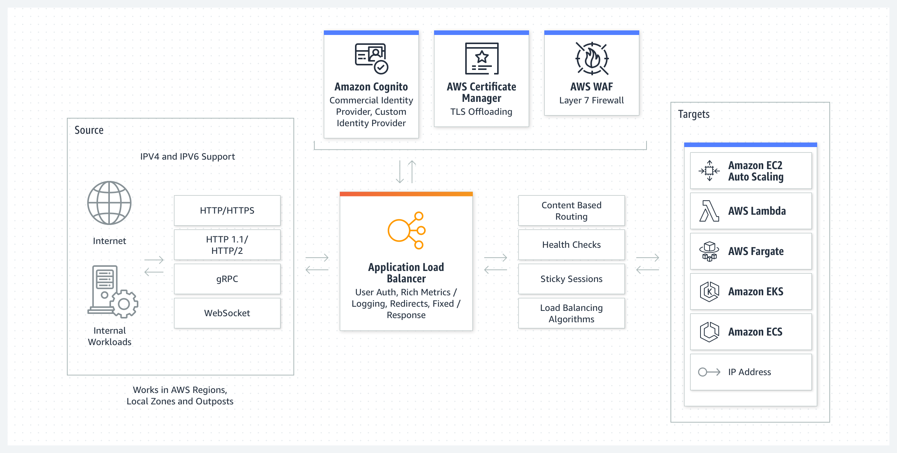

## 네트워킹 및 콘텐츠 전송(Networking & Content Transmission)

- 최초 작성 일자: 2023-03-29
- 수정 내역:
    - 2023-03-29: 최초 작성

---

### Amazon Virtual Private Cloud(VPC)

- **격리된 클라우드 리소스**
- 논리적으로 격리된 가상 네트워크에서 AWS 리소스를 정의하고 시작

#### 사용 이유

- 연결을 보호 및 모니터링하고, 트래픽을 차단하며, 가상 네트워크 니부의 인스턴스 액세스를 제한한다.
- 가상 네트워크를 설정, 관리 및 검증하는 데 소요되는 시간을 줄인다.
- 자체 IP 주소 범위를 선택하고, 서브넷을 생성한 후 라우팅 테이블을 구성하여 가상 네트워크 사용자 지정할 수 있다.

#### 작동 방식

- Amazon VPC를 사용하면 리소스 배치, 연결 및 보안을 포함하여 가상 네트워킹 환경을 완전히 제어할 수 있다.
- AWS 서비스 콘솔에서 VPC를 설정하여 시작하고, Amazon EC2 및 Amazon RDS 인스턴스와 같은 리소스를 VPC에 추가한다.
- 마지막으로 VPC가 계정, 가용 영역 또는 AWS 리전에서 서로 통신하는 방법을 정의한다.

#### 사용 사례

- **단순한 웹 사이트 또는 블로그 시작**: 인바운드 및 아웃바운드 연결에 규칙을 적용하여 웹 애플리케이션 보안 태세를 개선한다.
- **멀티 티어 웹 애플리케이션 호스팅**: 웹 서버, 애플리케이션 서버 및 데이터베이스 간의 네트워크 연결 및 제한 사항을 정의한다.
- **하이브리드 연결 생성**: AWS 서비스와 온프레미스에서 호환되는 VPC 네트워크를 구축하고 관리한다.

---

### Amazon API Gateway

- **API 구축, 배포 및 관리**
- 모든 규모의 API를 생성, 유지 관리 및 보호

- Amazon API Gateway는 어떤 규모에서든 개발자가 API를 손쉽게 생성, 게시, 유지 관리, 모니터링 및 보안 유지할 수 있도록 하는 완전관리형 서비스다.
- API는 애플리케이션이 백엔드 서비스의 데이터, 비즈니스 로직 또는 기능에 액세스할 수 있는 "정문" 역할을 한다.
- API Gateway를 사용하면 실시간 양방향 통신 애플리케이션이 가능하도록 하는 RESTful API 및 WebSocket API를 작성할 수 있다.
- API Gateway는 트래픽 관리, CORS 지원, 권한 부여 및 액세스 제어, 제한, 모니터링 및 API 버전 관리 등 최대 수십만 개의 동시 API 호출을 수신 및 처리하는 데 관계된 모든 작업을 처리한다.

#### 사용 이유

- **효율적인 API 개발**: API Gateway를 사용하여 동일한 API의 여러 버전을 동시에 실행하면 새로운 버전을 빠르게 반복, 테스트 및 릴리즈할 수 있다.
- **어떤 규모에서도 뛰어난 성능**: Amazon CloudFront를 사용하는 엣지 로케이션의 글로벌 네트워크를 활용하여 최종 사용자에게 API 요청 및 응답에 대해 가장 짧은 지연 시간을 제공한다.
- **규모에 따른 비용 절감**: API Gateway는 API 요청에 대해 계층화된 요금 모델을 제공한다.
- **간편한 모니터링**: Amazon CloudWatch를 사용하여 서비스에 대한 호출을 시작적으로 모니터링할 수 있는 API 게이트웨이 대시보드에서 성능 지표와 API 호출, 데이터 지연 시간 및 오류 발생률에 대한 정보를 모니터링한다.
- **유연한 보안 제어**: AWS IAM과 Amazon Cognito를 사용하여 API에 대한 액세스 권한을 부여한다. OAuth 토큰을 사용하는 경우 API Gateway가 기본 OIDC 및 OAuth2 지원을 제공한다.
- **RESTful API 옵션**: HTTP API 또는 REST API를 사용하여 RESTful API를 생성한다. HTTP API는 다수의 사용 사례에 대해 API를 구축하는 가장 좋은 방법이다.

#### 종류

##### RESTful API

- HTTP API를 사용하여 서버리스 워크로드 및 HTTP 백엔드에 최적화된 RESTful API를 구축한다.
- HTTP API는 API 프록시 기능만 필요한 API를 구축할 때 가장 적합하다.

##### WEBSOCKET API

- WebSocket API를 사용하여 채팅 앱 및 스트리밍 대시보드와 같은 실시간 양방향 통신 애플리케이션을 구축한다.
- API Gatewway는 백엔드 서비스와 클라이언트 간의 메시지 전송을 처리하기 위해 지속적인 연결을 유지한다.

#### 작동 방식

---

### Amazon CloudFront

- **글로벌 콘텐츠 전송 네트워크**
- 낮은 대기 시간과 높은 전송 속도로 안전하게 콘텐츠 전송

#### 사용 이유

- 자동화된 네트워크 매핑 및 인텔리전스 라우팅을 사용하여 전 세계에 분포된 450여 개의 접속 지점(POP)을 통해 데이터를 전송해 대기 시간을 줄인다.
- 트래픽 암호화와 액세스 제어를 통해 보안을 개선하고 AWS Shield Standard를 사용하여 추가 요금 없이 DDos 공격으로부터 보호한다.
- 통합된 요청, 사용자 지정 가능한 요금 옵션, AWS 오리진에서 데이터 송신 시 무료 요금으로 비용을 절감한다.
- 비용, 성능 및 보안의 균형을 맞추도록 서버리스 컴퓨팅 기능을 사용하여 AWS 콘텐츠 전송 네트워크(CDN) 엣지에서 실행하는 코드를 사용자 지정한다.

#### 작동 방식

- Amazon CLoudFront는 뛰어난 성능, 보안 및 개발자 편의를 위해 구축된 콘텐츠 전송 네트워크(CDN) 서비스다.

#### 사용 사례

- **빠르고 안전한 웹 사이트 전송**: 특별히 구축된 데이터 압축, 엣지 컴퓨팅 기능 및 필드 레벨 암호화를 사용하여 전 세계에서 밀리초 단위로 시청자에게 도달한다.
- **동적 콘텐츠 전송 및 API 가속화**: 엣지 종료 및 WebSockets를 지원하는 다양한 기능의 목적별 AWS 글로벌 네트워크 인프라를 통해 동적 웹 콘텐츠 전송을 최적화한다.
- **라이브 및 온디맨드 비디오 스트리밍**: AWS Media Service 및 AWS Elemental 통합을 바탕으로 빠르게 스트림을 시작하고 일관되게 재생하며 모든 종류의 디바이스에 높은 품질의 비디오를 전송한다.
- **패치 및 업데이트 배포**: 높은 전송 속도로 소프트웨어, 게임 패치 및 IoT 무선 업데이트(OTA)를 전송하도록 자동으로 크기를 조정한다.

---

### Amazon Route 53

- **확장 가능한 도메인 네임 시스템(DNS)**
- 최종 사용자를 인터넷 애플리케이션으로 라우팅하는 안정적이고 비용 효율적인 방법

#### 사용 이유

- 전 세계에 분산된 도메인 이름 시스템(DNS) 서버 및 자동 크기 조정을 통해 최종 사용자를 사용자의 사이트에 안정적으로 라우팅할 수 있다.
- 도메인 이름 등록 및 간단한 시각적 트래픽 흐름 도구를 사용하여 DNS 라우팅을 몇 분 내에 설정할 수 있다.
- DNS 라우팅 정책을 사용자 지정하여 대기 시간을 줄이고 애플리케이션 가용성을 개선하며 규정 준수를 유지할 수 있다.

#### 작동 방식

- Amazon Route 53은 가용성과 확장성이 뛰어난 도메인 이름 시스템(DNS) 웹 서비스다.
- Route 53은 사용자 요청을 AWS 또는 온프레미스에서 실행되는 인터넷 애플리케이션에 연결한다.

#### 사용 사례

- **글로벌 네트워크 트래픽 관리**: 사용하기 쉬운 글로벌 DNS 기능으로 레코드 및 정책 간에 복잡한 라우팅 관계를 생성하고 시각화하며 크기를 조정한다.
- **고가용성 애플리케이션 구축**: 트래픽을 다른 가용 영역 또는 리전으로 리디렉션하여 애플리케이션 복구에 대한 응답을 사전 정의하고 자동화하도록 라우팅 정책을 설정한다.
- **프라이빗 DNS 설정**: Amazon VPC에 사용자 지정 도메인 이름을 할당하고 액세스한다. DNS 데이터를 퍼블릭 인터넷에 노출하지 ㅇ낳고 내부 AWS 리소스 및 서버를 사용한다.

---

### AWS App Mesh

- **마이크로서비스 모니터링 및 제어**
- 모든 서비스를 위한 애플리케이션 수준의 네트워킹

#### 사용 이유

- 운영을 간소화하고, 사용자 지정 트래픽 라우팅 규칙을 구현하고, 서비스 간 트래픽 흐름을 구성 및 표준화할 수 있다.
- 애플리케이션에서 지표, 로그, 추적을 포착하여 문제를 신속하게 식별 및 격리하고 애플리케이션을 최적화할 수 있다.
- 인증 제어 및 서비스 간 암호화된 요청을 통해 프라이빗 네트워크 내에서도 네트워크 보안을 강화할 수 있다.

#### 작동 방식

- AWS App Mesh는 애플리케이션 수준 네트워킹을 제공한다. 따라서 여러 유형의 컴퓨팅 인프라에 걸친 서비스 간 통신을 지원할 수 있다.

---

### AWS Cloud Map

- **클라우드 리소스를 위한 서비스 검색**
- AWS Cloud Map은 클라우드 리소스 검색 서비스로, Cloud Map을 사용하면 애플리케이션 리소스의 사용자 지정 이름을 정의할 수 있으며 동적으로 변화하는 이러한 리소스의 업데이트된 위치를 유지 관리한다.
- Cloud Map은 리소스 상태를 지속적으로 확인하여 위치가 최신인지 확인한다. 이후 애플리케이션은 애플리케이션 버전 및 배포 환경에 따라 필요한 리소스 위치에 대해 레지스트리를 쿼리할 수 있다.

#### 사용 이유

- **애플리케이션 가용성 향상**: Cloud Map은 애플리케이션의 모든 IP 기반 구성 요소의 상태를 모니터링하고 필요 또는 제거 시 각 마이크로서비스의 위치를 동적으로 업데이트한다.
  이를 통해 애플리케이션은 리소스의 최신 위치만을 검색하게 되어 애플리케이션에 대한 가용성이 증가한다.
- **개발자 생산성 향상**: Cloud Map은 사용자 지정 이름으로 정의할 수 있는 모든 애플리케이션 서비스에 대한 단일 레지스트리를 제공한다.
  이를 통해, 개발팀에서는 지속적으로 리소스 이름 및 위치 정보를 저장, 추적 및 업데이트 하거나 애플리케이션 코드 내에서 직접 변경할 필요가 없다.

#### 작동 방식

#### 사용 사례

- **서비스 검색**: Cloud Map은 서비스 이름 및 위치의 단일 최신 레지스트리를 제공하며, 이를 통해 마이크로서비스에서 손쉬운 검색이 가능하다.
- **지속적 통합 및 전달**: 여러 환경, 리전 및 버전에 걸친 애플리케이션 코드 배포 시 여러 구성 파일에 모든 서비스의 위치를 업데이트해야 한다. Cloud Map은 서비스 이름 및 위치의 최신 레지스트리를 유지 관리한다.
- **자동화된 상태 모니터링**: Cloud Map은 자동화된 상태 확인을 통해 정상적인 리소스만 최신 리소스를 유지함으로써 아카이빙을 지원한다. 이를 통해 트래픽이 항상 정상적인 엔드포인트에만 제공된다.

---

### AWS Cloud WAN

- **글로벌 광역 네트워크를 쉽게 구축, 관리 및 모니터링**

#### 사용 이유

- AWS완 온프레미스 네트워크를 통합하여 복잡성을 줄인다.
- 네트워크를 분할하여 일상적인 데이터에서 민감한 네트워크 트래픽을 분리하여 보안을 강화한다.
- 단일 대시보드에서 전체 네트워크를 확인한다.
- AWS global network를 사용하여 위치와 리소스를 연결한다.

#### 작동 방식

- AWS Cloud WAN은 클릭 몇 번으로 글로벌 네트워크를 구축하여 지점, 데이터 센터 및 Amazon VPC를 연결할 수 있는 중앙 대시보드를 제공한다.
- 네트워크 정책을 사용하여 한 위치에서 네트워크 관리 및 보안 작업을 자동화할 수 있다.
- Cloud WAN은 온프레미스 및 AWS 네트워크에 대한 전체 보기를 생성하여 네트워크 상태, 보안 및 성능의 모니터링을 지원한다.

#### 사용 사례

- **글로벌 네트워크 구축**: 선택한 로컬 네트워크 공급자를 사용하여 AWS 연결한 다음 AWS 글로벌 네트워크를 사용하여 위치와 VPC를 연결한다.
- **클라우드와 온프레미스 환경을 연결**: 온프레미스 데이터 센터, 지점 사무실 및 클라우드 리소스를 연결하여 WAN을 클라우드로 확장한다.
- **네트워크 시각화 및 제어**: 단일 위치에서 네트워크를 구성하고 성능 및 상태를 모니터링하여 일상 작업을 자동화한다.

---

### AWS Direct Connect

- **AWS로의 전용 네트워크 연결**

#### 사용 이유

- AWS에 직접 연결하고 퍼블릭 인터넷을 우회하여 애플리케이션 성능을 개선한다.
- 여러 암호화 옵션을 통해 네트워크와 AWS 사이를 이동할 때 데이터를 보안한다.
- AWS에서 송신되는 데이터 비율을 줄여 네트워킹 비용을 절감한다.

#### 작동 방식

- AWS Direct Connect 클라우드 서비스는 AWS 리소스에 대한 최단 경로다.
- 전송하는 동안 네트워크 트래픽은 AWS 글로벌 네트워크에 남아있으며 퍼블릭 인터넷에 닿지 않기 때문에, 병목이 발생하거나 대기 시간이 예기치 않게 증가할 가능성이 줄어든다.
- 새 연결을 생성할 때 AWS Direct Connect 제공 파트너가 제공하는 호스팅 연결을 선택하거나 AWS에서 전용 연결을 선택하고 전 세계 100개 이상의 AWS Direct Connect 위치에 배포할 수 있다.
- AWS Direct Connect SiteLink를 사용하면 AWS Direct Connect 위치 간에 데이터를 전송하여 글로벌 네트워크의 데이터 센터와 사무실 사이에서 프라이빗 네트워크 연결을 생성할 수 있다.

#### 사용 사례

- **하이브리드 네트워크 구축**: AWS와 온프레미스 네트워크를 연결하여 성능의 저하 없이 여러 환경에 걸친 애플리케이션을 구축할 수 있다.
- **기존 네트워크 확장**: 네트워크를 AWS Direct Connect에 연결하면 SiteLink를 사용하여 위치 간에 데이터를 보낼 수 있다. 
  SiteLink를 사용할 때 데이터는 위치 간 최단 경로를 통해 이동한다.
- **대규모 데이터 집합 관리**: 실시간 분석, 신속한 데이터 백업 또는 방송 미디어 처리를 위해 대규모로 원활하고 안정적인 데이터 전송을 보장한다.

---

### AWS Global Accelerator

- **애플리케이션 가용성 및 성능 개선**
- AWS 글로벌 네트워크를 사용하여 애플리케이션의 가용성, 성능, 보안을 개선한다.

#### 사용 이유

- 애플리케이션의 네트워크 성능을 최대 60%까지 향상할 수 있다.
- 다중 리전 아키텍처에 빠른 장애 조치를 제공함으로써, 애플리케이션의 가용성을 유지할 수 있다.
- DNS 캐시 종속성을 제거하여 결정형 라우팅이 가능해진다.
- 리전 대신 엣지에서 DDoS 공격으로부터 애플리케이션을 보호할 수 있다.

#### 작동 방식

- AWS Global Accelerator는 퍼블릭 애플리케이션의 가용성, 성능 및 보안을 개선하는 데 유용한 네트워킹 서비스다.
- Global Accelerator는 애플리케이션 엔드포인트로의 고정 진입점 역할을 하는 두 개의 글로벌 정적 공용 IP(예: Application Load Balancer, Network Load Balancer 등)를 제공한다.

#### 사용 사례

- **글로벌 트래픽 관리자**: 트래픽 다이얼을 사용하여 트래픽을 가장 가까운 리전으로 라우팅하거나 리전 간에 빠른 장애 조치를 지원한다.
- **API 가속화**: 엣지에서 TCP 종료를 활용하여 API 워크로드를 최대 60%까지 가속화한다.
- **글로벌 정적 IP**: 엔터프라이즈 방화벽 및 IoT 사용 사례에서 허용 목록 생성을 간소화한다.
- **지연 시간이 짧은 게임 및 미디어 워크로드**: 맞춤형 라우팅을 사용하여 트래픽을 EC2 인스턴스 플릿으로 최종 라우팅한다.

---

### AWS Private 5G

- **프라이빗 셀룰러 네트워크를 쉽게 배포, 관리 및 확장**
- 사설 모바일 네트워크 배포, 관리 및 확장
- 4G LET 및 5G와 같은 모바일 네트워크 기술은 기존 네트워크를 더 높은 대역폭, 더 낮은 대기 시간 및 점검 더 많은 장치에 대한 안정적인 장거리 커버리지로 보강한다.
- AWS Private 5G를 사용하면 사설 네트워크의 보안, 세분화된 애플리케이션 및 장치 제어를 유지하면서 사설 모바일 네트워크를 구축하여 4G LTE 또는 5G의 기술적 이점을 활용할 수 있다.

#### 사용 이유

- 사설 모바일 네트워크의 높은 안정성과 짧은 대기 시간으로 수백 대의 장치와 기계를 연결한다.
- 긴 계획 주기, 복잡한 통합 및 자동 설정 없이 며칠 만에 네트워크를 가동하고 실행한다.
- 기존 IT 정책과 통합된 연결된 모든 장치에 대한 세분화된 액세스 제어로 네트워크를 보호한다.
- 필요에 따라 용량을 확장하고 사용한 용량과 처리량에 대해서만 비용을 지불한다.

#### 작동 방식

- AWS Private 5G는 AWS에서 제공하는 모든 필수 하드웨어 및 소프트웨어를 사용하여 프라이빗 모바일 네트워크를 보다 쉽게 배포, 운영 및 확장할 수 있게 해주는 관리형 서비스다.

#### 사용 사례

- **스마트 제조 시설 운영**: 제조 시설 내에서 자율 로봇, 차량, 레거시 기계 또는 엣지 게이트웨이를 연결하여 산업 네트워크 서비스 수준 지표를 달성한다.
- **물리적 시설에서 보안 애플리케이션 지원**: 예측 가능한 대역폭을 위해 사설 모바일 네트워크를 사용하여 비디오 카메라, 지문 스캐너 또는 자동 번호판 스캐너를 연결한다.
- **안정적인 캠퍼스 연결 제공**: 학생 및 교직원 연결을 위해 학생 숙소 또는 캠퍼스 일부에 대한 실외 무선 액세스를 활성화한다.
- **작업자 생산성 애플리케이션 지원**: 안정적인 적용 범위와 이동성을 위해 창고 및 항구와 같은 실외 위치에서 디지털 데이터 입력을 위해 직원 태블릿 또는 핸드헬드 장치를 연결한다.

---

### AWS PrivateLink

- **AWS에서 호스팅되는 서비스에 안전하게 액세스**
- 데이터를 인터넷에 노출하지 않고 VPC와 AWS 서비스 간에 연결을 설정한다.

#### 사용 이유

- 서비스형 소프트웨어(SaaS) 애플리케이션과 데이터를 교환할 경우 프라이빗 IP 주소를 사용하여 트래픽의 보안을 유지할 수 있다.
- 간소화된 네트워크 및 방화벽 규칙과 감소된 데이터 출력 및 NAT 비용을 연결할 수 있다.
- AWS Direct Connect 또는 VPN을 통해 PrivateLink를 결합하여 클라우드 마이그레이션을 가속화할 수 있다.
- 유럽-미국 프라이버시 실드, PCI, 기타 규제를 준수하면서 SaaS 서비스를 제공할 수 있다.

#### 작동 방식

- AWS PrivateLink는 퍼블릭 인터넷에 트래픽을 노출하지 않고도 VPC, 지원되는 AWS 서비스 및 온프레미스 네트워크 간에 프라이빗 연결을 제공한다.
- PrivateLink로 구동되는 인터페이스 VPC 엔트포인트는 AWS 파트너가 호스팅하는 서비스 및 AWS Marketplace에서 제공되는 지원 솔루션에 연결된다.

#### 사용 사례

- **안전한 AWS 서비스 액세스**: VPC 및 온프레미스에서 AWS 서비스에 연결하고, 중용 데이터를 안전하고 확장 가능한 비공개 방식으로 전송한다.
- **규제 준수 유지**: 고객 레코드와 같은 민감한 데이터가 인터넷을 통과하지 못하도록 하여 HIPAA, EU/US Privacy Shield 및 PCI와 같은 규정을 준수한다.
- **하이브리드 클라우드로 마이그레이션**: AWS에서 호스팅되는 SaaS 애플리케이션에 온프레미스 애플리케이션과 데이터를 안전하게 연결하고 하이브리드 클라우드 아키텍처를 구현한다.
- **APN에서 SaaS 서비스 제공**: AWS 파트너는 프라이빗 네트워크에서 직접 호스팅되지만 클라우드 및 온프레미스에서도 안전하게 액세스할 수 있는 서비스를 제공한다.

---

### AWS Transit Gateway

- **VPC 및 계정 연결을 손쉽게 확장**
- Amazon VPC, AWS 계정 및 온프레미스 네트워크를 단일 게이트웨이에 연결

#### 사용 이유

- 아키텍처를 간소화하여 복잡성이 증가하는 아키텍처를 관리할 수 있다.
- 가상 프라이빗 클라우드 및 엣지 연결에 대해 더 나은 가시성을 확보하고 보다 효과적으로 제어할 수 있다.
- AWS 글로벌 프라이빗 네트워크의 리전 간 피어링 암호화를 통해 보안을 개선할 수 있다.
- 온프레미스 재무 및 동영상 멀티캐스트 애플리케이션을 클라우드에 리프트 앤드 시프트할 수 있다.

#### 작동 방식

- AWS Transit Gateway는 중앙 허브를 통해 Amazon VPC와 온프레미스 네트워크를 연결한다. 이 연결은 복잡한 피어랑 관계를 제거하여 네트워크를 간소화한다.
- Transit Gateway는 고도로 확장 가능한 클라우드 라우터 역할을 한다. 새로운 연결은 한 번만 만들어진다.

#### 사용 사례

- **전 세계에 애플리케이션 제공**: 피어링 연결을 관리하거나 라우팅 테이블을 업데이트할 필요 없이 수천 개의 Amazon VPC에서 애플리케이션을 구축, 배포 관리한다.
- **글로벌 규모로 빠르게 확장**: 리전 간 피어링을 사용하여 리전 간에 VPC, 도메인 이름 시스템(DNS), Microsoft Active Directory, IPS/IDS를 공유한다.
- **수요 급증에 원활하게 대응**: Amazon VPC, AWS 계정, 가상 프라이빗 네트워크(VPN) 용량, Amazon Direct Connect 게이트웨이를 빠르게 추가하여 예상치 못한 수요를 충족한다.
- **AWS에서 멀티캐스트 애플리케이션 호스팅**: 사용자 지정 하드웨어를 구매하고 유지 관리할 필요 없이 온ㄴ디맨드 애플리케이션을 호스팅한다.

---

### AWS Verified Access

- **VPN없이 기업 애플리케이션에 대한 보안 액세스 제공**

#### 사용 이유

- 각 액세스 요청을 사전 정의된 요구 사항에 따라 실시간으로 평가하여 보안 태세를 개선한다.
- VPN 없이 기업 애플리케이션에 대한 가상 액세스를 통해 원활한 사용자 경험을 제공한다.
- ID 데이터 및 디바이스 포스처(Device Posture) 기반의 조건을 적용하여 각 애플리케이션에 대해 고유한 액세스 정책을 정의한다.

#### 작동 방식

- AWS 제로 트러스트 가이드 원칙에 기반하여 구축된 AWS Verified Access는 액세스를 허용하기 전에 모든 애플리케이션을 빠짐 없이 검증한다.
- Verified Access는 VPN을 사용할 필요가 없어 최종 사용자의 원격 접속 경험을 간소화하고 IT 관리자의 관리 복잡성을 줄여 준다.

#### 사용 사례

- **분산된 사용자의 보안 유지**: Verified Access는 사전 정의된 보안 요구 사항에 따라 실시간으로 각 요청을 평가하여 애플리케이션에 대한 보안 액세스를 제공한다.
- **기업 애플리케이션 액세스 관리**: IT 관리자는 사용자 ID 및 디바이스 보안 상태와 같은 보안 신호 입력을 사용하여 일련의 세분화된 액세스 정책을 구축할 수 있다.
- **중앙화된 액세스 로그**: Verified Access는 액세스 요청과 로그 요청 데이터를 평가하여 보안 및 연결 인시던트에 대한 분석과 응답을 가속화한다.

---

### AWS VPN

- **네트워크 리소스에 안전하게 액세스**
- 온프레미스 네트워크를 클라우드까지 확장하고 어디에서든 안전하게 액세스한다.
- AWS Virtual Private Network 솔루션은 온프레미스 네트워크, 원격 사무실, 클라이언트 디바이스 및 AWS 글로벌 네트워크 사이에서 보안 연결을 설정한다.
- AWS VPN은 AWS Site-to-Site VPN 및 AWS Client VPN이라는 두 가지 서비스로 구성된다.
- 이 서비스를 함께 결합하여 네트워크 트래픽을 보호하는 탄력적인 고가용성 관리형 클라우드 VPN 솔루션을 제공한다.

#### AWS Client VPN

- AWS Client VPN은 완전관리형의 탄력적 VPN 서비스로서, 사용자 요구 사항에 맞추어 자동으로 확장하거나 축소할 수 있다.
- 이 서비스는 클라우드 VPN 솔루션이므로, 하드웨어나 소프트웨어 기반 솔루션을 설치 및 관리하거나 한 번에 지원할 원격 사용자 수를 예측하지 않아도 된다.

##### 사용 이유

- **완전관리형**: AWS Client VPN은 단일 콘솔에서 모든 연결을 모니터링하는 동안 배포, 용량 프로비저닝 및 서비스 업데이트를 자동으로 관리한다.
- **어드밴스드 인증**: 많은 조직이 VPN 솔루션으로 Multi-Factor Authentication(MFA)이 필요하다. AWS Client VPN은 이러한 인증 방식과 다른 인증 방법을 모두 지원한다.
- **탄력성**: 기존의 온프레미스 VPN 서비스는 이러한 서비스를 실행하는 하드웨어의 용량에 따라 제한한다.
  AWS Client VPN은 사용자 요구 사항에 맞추어 탄력적으로 확장하거나 축소할 수 있는 종량과금제 클라우드 VPN 서비스다.
- **원격 액세스**: 온프레미스 VPN 서비스와 달리, AWS Client VPN에서는 단일 VPN 연결을 통해 사용자를 AWS 및 온프레미스 네트워크에 연결할 수 있다.

##### 작동 방식

##### 사용 사례

- **빠른 원격 액세스 확장**: 예기치 않은 사건으로 인해 많은 직원들은 원격으로 작업할 수도 있다. 이로 인해 VPN 연결 및 트래픽에 피크가 발생하여 성능 또는 사용자의 가용성이 저하될 수 있다.
  AWS Client VPN은 탄력적으로 작동하며, 피크 요구 사항을 처리하기 위해 자동으로 확장된다. 피크가 지나가면 사용하지 않은 용량에 대한 요금을 지불하지 않도록 축소한다.
- **임시 작업자를 위한 VPN 액세스를 손쉽게 배포 및 제거**: AWS Client VPN을 사용하면 새로운 사용자에게 특정 AWS 및 온프레미스 네트워크에 대한 액세스 권한을 손쉽게 부여할 수 있다.
  액세스 권한을 부여하기 위해 사용자를 Active Directory 그룹에 추가하고 해당 그룹에 대한 액세스 규칙을 설정한다. 계약이 만료된 경우 액세스 권한은 쉽게 제거할 수 있다.
- **클라우드 또는 온프레미스에서 애플리케이션에 쉽게 액세스**: AWS Client VPN은 사용자에게 온프레미스와 AWS 애플리케이션에 대한 보안 액세스를 제공한다. 애플리케이션이 온프레미스에서 클라우드로 이전하는 클라우드 마이그레이션 중에 특히 유용하다.
  AWS Client VPN을 통해 사용자는 마이그레이션이 진행 중이거나 마이그레이션 후에 애플리케이션에 대한 액세스 방법을 변경할 필요가 없다.

#### AWS Site-to-Site VPN

- AWS Site-to-Site VPN에서는 데이터 센터 또는 지점과 AWS 클라우드 리소스 사이에서 보안 연결을 생성한다. 
- 글로벌로 분산된 애플리케이션에 대해 AWS Global Accelerator와 함께 Accelerated Site-to-Site VPN 옵션을 사용하여 성능을 향상시킬 수 있다.

##### 사용 이유

- **뛰어난 가용성**: AWS Site-to-Site VPN은 AWS 글로벌 네트워크 내 여러 가용 영역에서 2개 터널을 사용하여 고가용성을 지원한다.
  주요 트래픽은 첫 번째 터널을 통해 스트리밍하고 두 번째 터널은 중복을 위해 사용할 수 있다. 즉, 터널 하나가 중단되어도 트래픽은 계속 전달된다.
- **보안**: AWS Site-to-Site VPN을 통해 온프레미스 서버에 연결하는 것과 동일한 방식으로 Amazon VPC 또는 AWS Transit Gateway에 연결할 수 있다.
  AWS Site-to-Site VPN은 IP 보안(IPsec) 및 TLS(전송 계층 보안) 터널과의 안전한 프라이빗 세션을 설정한다.
- **강력한 모니터링**: AWS Site-to-Site VPN은 로컬 및 원격 네트워크 상태를 시각적으로 보여주고 Amazon CloudWatch와의 통합을 통해 VPN 연결의 안정성과 성능을 모니터링한다.
  또한, Site-to-Site VPN은 AWS Transit Gateway Network Manager와 통합되어 SD-WAN, AWS Transit Gateway 및 AWS Direct Connect 서비스를 포함한 AWS 네트워크와 온프레미스에 대한 전체적인 보기를 제공한다.
- **애플리케이션 가속화**: Accelerated Site-to-Site VPN 옵션을 AWS Global Accelerator와 함께 사용하면 VPN 연결 성능을 개선할 수 있다.
  AWS Global Accelerator는 성능이 가장 뛰어난 가장 가까운 AWS 네트워크 엔드포인트에 트래픽을 지능적으로 라우팅하는 데 사용된다.

##### 작동 방식

##### 사용 사례

- **기업 네트워크를 클라우드로 확장**: 네트워크와 AWS 클라우드 사이의 Site-to-Site VPN 연결을 통해 애플리케이션을 클라우드로 더 쉽게 이전할 수 있다.
  기업 방화벽을 통해 Amazon VPC를 호스팅하고 이러한 애플리케이션에 대한 사용자 액세스 방식을 변경하지 않고도 IT 리소스를 원활하게 이전할 수 있다.
- **원격 위치 사이에서 보안 통신**: AWS Site-to-Site VPN 연결을 사용하여 여러 원격 위치 사이에서 안전하게 통신할 수 있다.

---

### Elastic Load Balancing

- **수신 트래픽을 여러 대상에 걸쳐 분산**
- 네트워크 트래픽을 분산하여 애플리케이션 확장성 개선

#### 사용 이유

- 통합된 인증서 관리, 사용자 인증 및 SSL/TLS 복호화를 통해 애플리케이션을 보안한다.
- 고가용성 및 자동 크기 조정으로 애플리케이션을 지원한다.
- 실시간으로 애플리케이션 상태 및 성능을 모니터링하고 병목 현상을 파악하며 SLA 규정 준수를 유지 관리한다.

#### 작동 방식

- Elastic Load Balancing(ELB)은 하나 이상의 가용 영역(AZ)에 있는 여러 대상 및 가상 어플라이언스에서 들어오는 애플리케이션 트래픽을 자동으로 분산한다.

- **Application Load Balancer**

- **Gateway Load Balancer**

- **Network Load Balancer**

#### 사용 사례

- **서버리스 및 컨테이너로 애플리케이션 현대화**: 복잡한 API Gateway 구성 없이 수요를 충족하도록 현대적 애플리케이션 크기를 조정한다.
- **하이브리드 클라우드 네트워크 확장성 개선**: 단일 로드 밸런서를 사용하여 AWS와 온프레미스 리소스에서 로드 밸런스를 조정한다.
- **기존 네트워크 어플라이언스 유지**: 클라우드의 규모 및 유연성을 활용하면서 선호하는 공급 업체의 네트워크 어플라이언스를 배포한다.

---

### 참고한 자료

- [Amazon Virtual Private Cloud](https://aws.amazon.com/ko/vpc/?nc2=h_ql_prod_nt_avpc)
- [Amazon API Gateway](https://aws.amazon.com/ko/api-gateway/?nc2=h_ql_prod_nt_apig)
- [Amazon CloudFront](https://aws.amazon.com/ko/cloudfront/?nc2=h_ql_prod_nt_cf)
- [Amazon Route53](https://aws.amazon.com/ko/route53/?nc2=h_ql_prod_nt_r53)
- [Amazon App Mesh](https://aws.amazon.com/ko/app-mesh/?nc2=h_ql_prod_nt_appm)
- [AWS Cloud Map](https://aws.amazon.com/ko/cloud-map/?nc2=h_ql_prod_nt_cm)
- [AWS Cloud WAN](https://aws.amazon.com/ko/cloud-wan/?nc2=h_ql_prod_nt_cw)
- [AWS Direct Connect](https://aws.amazon.com/ko/directconnect/?nc2=h_ql_prod_nt_dc)
- [AWS Global Accelerator](https://aws.amazon.com/ko/global-accelerator/?nc2=h_ql_prod_nt_gla)
- [AWS Private 5G](https://aws.amazon.com/ko/private5g/?nc2=h_ql_re_nw)
- [AWS PrivateLink](https://aws.amazon.com/ko/privatelink/?nc2=h_ql_prod_nt_pl)
- [AWS Transit Gateway](https://aws.amazon.com/ko/transit-gateway/?nc2=h_ql_prod_nt_tg)
- [Zero Trust on AWS](https://aws.amazon.com/ko/security/zero-trust/)
- [AWS Verified Access](https://aws.amazon.com/ko/verified-access/?nc2=h_ql_prod_nt_va)
- [AWS VPN](https://aws.amazon.com/ko/vpn/?nc2=h_ql_prod_nt_avpn)
- [Amazon Elastic Load Balancer](https://aws.amazon.com/ko/elasticloadbalancing/?nc2=h_ql_prod_nt_elb)