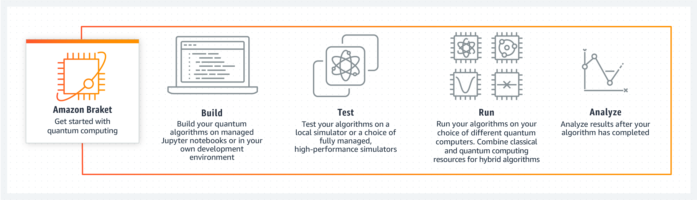

## 양자 기술(Quantum Technologies)

- 최초 작성 일자: 2023-03-30
- 수정 내역:
    - 2023-03-30: 최초 작성

---

### Amazon Braket

- **양자 컴퓨팅을 사용한 탐색 및 실험**

#### 사용 이유

- 일관된 개발 도구 집합을 사용하여 다양한 유형의 양자 컴퓨터와 순환 시뮬레티어로 손쉽게 작업한다.
- 양자 및 클래식 워크로드 모두에 대한 간단한 요금 책정 및 관리 제어를 통해 신뢰할 수 있는 클라우드에서 양자 프로젝트를 구축한다.
- 관리할 기존 인프라 없이 양자 컴퓨터에 우선적으로 액세스하여 하이브리드 양자-클래식 알고리즘을 더 빠르게 실행한다.
- 전문 안내와 기술 지원을 통해 빠르게 혁신하거나 Amazon Quantum Solutions Lab의 컨설턴트와 협업한다.

#### 작동 방식

- Amazon Braket은 양자 컴퓨팅을 위한 과학 연구 및 소프트웨어 개발 속도를 높이기 위해 설계된 완전관리형 양자 컴퓨팅 서비스다.

#### 사용 사례

- **연구 양자 컴퓨팅 알고리즘**: AWS Cloud Credit for Research Program에서 알고리즘 개발 및 지원을 위한 도구를 통해 과학 발견을 가속화한다.
- **다양한 양자 하드웨어 테스트**: 초전ㄴ도, 트랩 이온, 중성 원자 및 광자 디바이스에 쉽게 액세스하여 양자 하드웨어 연구의 한계를 뛰어 넘는다.
- **보다 빠른 양자 소프트웨어 구축**: Amazon Brket의 소프트웨어 개발 키트(SDK), 간단한 요금 및 워크플로 관리를 통해 양자 컴퓨팅을 위한 소프트웨어의 시장 출시 시간을 단축한다.
- **오픈 소스 소프트웨어 개발**: 새로운 양자 애플리케이션을 기고하고 개발을 단순하게 할 소프트웨어 기능, 도구 또는 플러그인에 영향을 미친다.

---

### Amazon Quantum Solutions Lab

- **양자 컴퓨팅 전문가와 협업**
- 전문가와 협력하여 양자 솔루션 개발 가속화
- Amazon Quantum Solutions Lab 계약은 양자 컴퓨팅, 기계 학습, 최적화 및 고성능 컴퓨팅 분야의 선도적인 전문가와 협력할 수 있는 공동 연구 프로그램이다.
- 이 프로그램은 비즈니스를 위한 가장 유망한 양자 컴퓨팅 애플리케이션을 연구 및 식별하고 양자를 준비하는 데 도움이 된다.

#### 작동 방식

- **개념 증명 구축**: 비즈니스에 특정한 대상 사용 사례를 식별하고 거꾸로 작업하여 양자 프로토타입 및 최신 클래식 솔루션을 개발한다.
- **프로세스를 반복**: 양자 및 기존 하드웨어 한계를 계속 테스트한다. AWS 전문 지식과 서비스를 사용하여 현재 사용 가능한 솔루션의 잠재적 이점을 찾는다.
- **장기적으로 혁신**: 새로운 접근법을 공동으로 발견하고 IP를 개발한다. 양자 하드웨어의 발전에 대비하여 애플리케이션을 벤치마킹한다.

#### 사용 사례

- **로봇 경로 최적화**: BMW Group은 Amazon Quantum Solutions Lab과 협력하여 여러 제약 조건으로 로봇 동작을 최적화하는 알고리즘을 개발했다.
  AWS와 함께 로봇 동작 실행 시간이 10% 향상되었음을 보여주었다.
- **사기 감지**: Amazon Quantum Solutions Lab은 하이브리드 양자 어닐링 기술을 사용하여 그래프 기반 사기 탐지의 가능성을 시연했다.
- **바이너리 페인트 샵**: Volkswagen Group과 Amazon Quantum Solutions Lab은 Quantum Approximate Optimization을 사용하여 임의의 차량 순서로 도장할 소수의 차량에 대한 PoC에서 도장 교체 횟수를 초과하였다.

---

### 사용 기술

- [AWS Cloud Credit for Research](https://aws.amazon.com/ko/government-education/research-and-technical-computing/cloud-credit-for-research/?pg=ln&sec=uc)
- [Amazon Braket](https://aws.amazon.com/ko/braket/?nc1=h_ls#)
- [Amazon Quantum Solutions Lab](https://aws.amazon.com/ko/quantum-solutions-lab/?nc2=h_ql_prod_qt_qsl)