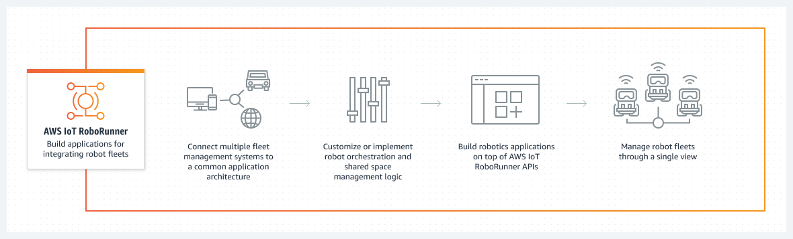
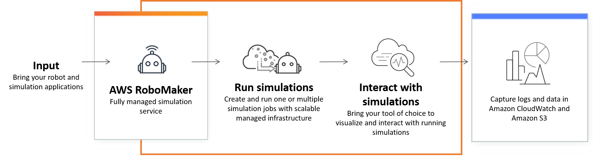

## 로보틱스(Robotics)

- 최초 작성 일자: 2023-03-30
- 수정 내역:
  - 2023-03-30: 최초 작성

---

### AWS Iot RoboRunner

- **로봇 플릿의 원활한 연동을 돕는 애플리케이션 구축**
- 로봇 플릿이 원활하게 함께 작동하는 데 도움이 되는 애플리케이션 구축

#### 사용 이유

- 다양한 공급업체의 모바일 로봇 간의 원활한 협업을 통해 새로운 자동화 사용 사례를 잠금 해제한다.
- 공통 아키텍처를 사용하여 서로 다른 차량 관리 시스템을 빠르고 안전하게 통합한다.
- 단일 디스플레이 내에서 다중 공급업체 제품군을 관리하는 애플리케이션 구축의 복잡성을 줄인다.

#### 작동 방식

- AWS IoT RoboRunner는 여러 공급업체의 로봇 시스템을 통합하고 차량 관리 애플리케이션을 구축하기 위한 인프라를 제공한다.

#### 사용 사례

- **로봇 상호 운용성 촉진**: 확장 가능하고 유연한 로봇 자동화 인프라를 사용하여 여러 공급업체의 다양한 로봇 유형을 통합한다.
- **공유 공간 관리 구현**: 공유 공간에서 다중 공급업체 로봇을 조율하여 자재 취급 프로세스 및 운영 흐름을 가속화한다.
- **단일 시스템을 통한 로봇 모니터링**: AWS IoT RoboRunner API를 사용하여 단일 통합 디스플레이에서 로봇 위치 및 상태 모니터링과 같은 애플리케이션을 구축한다.

---

### AWS RoboMaker

- **로보틱스 애플리케이션 개발, 테스트 및 배포**
- 로보틱스 시뮬레이션 실행, 크기 조정 및 자동화

#### 사용 이유

- 단일 API 호출을 사용하여 대규모 병렬 시뮬레이션을 실행한다.
- 시뮬레이션 워크로드를 비용 효율적으로 크기 조정하고 자동화한다.
- 사용자 정의된 무작위 3D 가상 환경을 손쉽게 생성한다.

#### 작동 방식

- AWS RoboMaker는 인프라를 관리하지 않고도 로봇 개발 시뮬레이션을 실행, 크기 조정 및 자동화할 수 있는 클라우드 기반 시뮬레이션 서비스다.

#### 사용 사례

- **자동화된 회귀 테스트**: 지속적 통합 및 전달(CI/CD) 파이프라인 내에서 테스트를 자동화한다.
- **강화 학습 모델 훈련**: 대량의 반복 실험을 통해 강화 학습 모델을 훈련한다.
- **멀티 로봇 테스트**: 테스트를 위해 플릿 관리 소프트웨어에 대한 다중 동시 시뮬레이션을 연결한다.

---

### 참고한 자료

- [AWS IoT RoboRunner](https://aws.amazon.com/ko/roborunner/?nc2=h_ql_prod_ro_rr)
- [AWS RoboMaker](https://aws.amazon.com/ko/robomaker/?nc2=h_ql_prod_ro_rm)