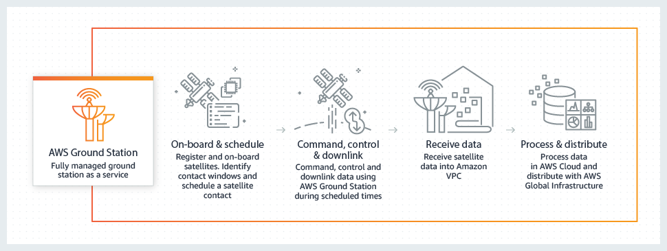

## 위성(Satellite)

- 최초 작성 일자: 2023-03-30
- 수정 내역:
  - 2023-03-30: 최초 작성

---

### AWS Ground Station

- **서비스로서의 완전관리형 그라운드 스테이션**
- 완전관리형 Ground Station as a Service를 통해 손쉽게 인공위성을 제어하고 데이터 수집
- AWS Ground Station은 자체 그라운드 스테이션 인프라를 구축하거나 괸리할 걱정없이 인공위성 통신을 제어하고 데이터를 처리하며 작업을 확장할 수 있는 완전관리형 서비스다.
- 인공위성은 날씨 예측, 지표면 이미지, 통신, 비디오 브로드캐스트를 비롯해 다양한 용도로 사용된다.
- 그라운드 스테이션은 전 세계 인공위성 네트워크의 핵심을 구축한다.
- AWS Ground Station을 사용하면 지연 시간이 짧은 글로벌 광섬유 네트워크를 포함하여 AWS 서비스 및 AWS 글로벌 인프라에 직접 액세스할 수 있다.
  예를 들어, Amazon S3를 사용하여 다운로드한 데이터를 저장하고, Amazon Kinesis Data Streams를 사용해 인공위성의 데이터 수집을 관리하고, Amazon SageMaker를 사용해 데이터 세트에 적용되는 맞춤형 기계 학습 애플리케이션을 빌드할 수 있다.
- 사용한 실제 안테나 시간에 대해서만 요금을 지불하고 전 세계에 분포된 지상국을 활용하여 필요할 때 필요한 장소에서 데이터를 다운로드함으로써 지상국 운영 비용을 80%까지 절감할 수 있다.

#### 사용 이유

- **Ground Station as a Service**: AWS Ground Station은 글로벌 AWS 인프라 지역 네트워크에 인접한 그라운드 스테이션으로 이루어진 글로벌 네트워크를 제공한다.
  사용자는 더 이상 자체적인 인공위성 그라운드 스테이션을 구입, 임대, 구축, 확장 또는 관리하는 것에 대해 걱정할 필요가 없다.
- **신뢰할 수 있는 보안**: AWS 고객은 보안에 가장 민감한 조직의 요구 사항에 부합하도록 구축된 시설 및 네트워크 아키텍처의 혜택을 누릴 수 있다.
  AWS Ground Station은 추가 비용 없이 프리미엄 데이터 보안 및 물리적 보안을 제공한다.
- **사용량에 따라 지불**: AWS Ground Station을 사용하면 실제로 사용한 안테나 시간에 대해서만 요금이 부과된다. 
  요금을 한 번만 지불하면 글로벌 AWS Ground Station 네트워크의 모든 안테나를 사용할 수 있다.
- **더 빠른 데이터 다운로드**: 지리적으로 다양한 AWS Ground Station 각각의 위치에 있는 여러 개의 안테나를 사용하면 즉시 처리할 수 있도록 위성 데이터를 AWS 리전으로 직접 다운링크할 수 있다.
- **즉각적인 데이터 처리**: AWS Ground Station은 오래 대기할 필요 없이 저 비용으로 AWS 서비스에 액세스하고 데이터를 저장 및 처리할 수 있도록 AWS 인프라 리전에 인접한 인공위성 안테나를 제공한다.
- **셀프 서비스 일정 예약**: AWS Management Console 및 API를 사용하여 인공위성 접촉을 쉽게 예약할 수 있다.

#### 작동 방식

---

### 참고한 자료

- [AWS Ground Station](https://aws.amazon.com/ground-station/?nc1=h_ls)