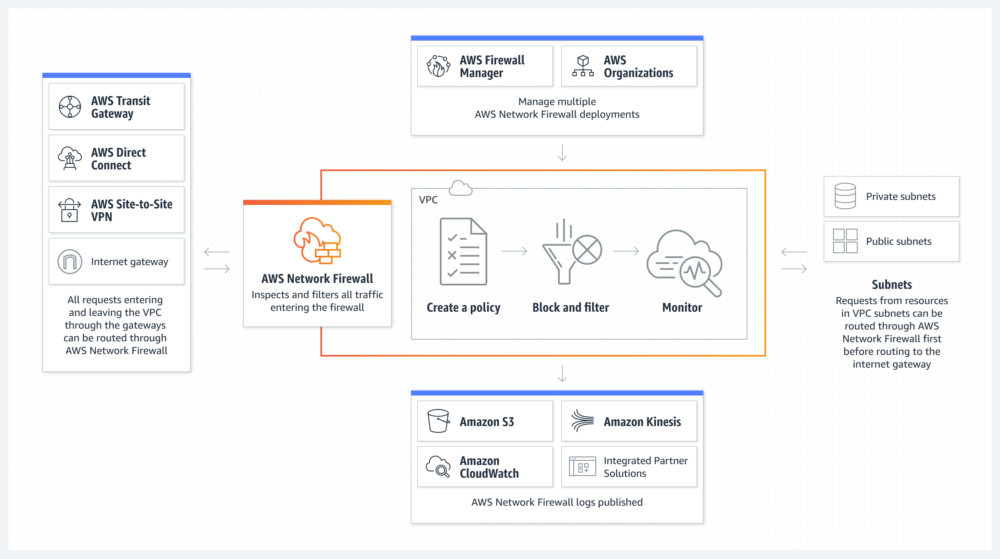

## 보안, 자격 증명 및 규정 준수(Security, Identity & Compliance)

- 최초 작성 일자: 2023-04-02
- 수정 내역:
  - 2023-04-02: 최초 작성

---

### AWS Identity and Access Management(IAM)

- **서비스 및 리소스에 대한 액세스를 안전하게 관리**
- AWS 서비스 및 리소스에 대한 액세스와 ID를 안전하게 관리

#### 사용 이유

- 인력 및 워크로드에 대한 가드레일과 세분화된 액세스 제어를 설정하고 관리한다.
- 단일 AWS 계정에서 ID를 관리하거나 중앙에서 여러 AWS 계정에 ID를 연결한다.
- AWS 리소스에 액세스하는 워크로드에 대한 임시 보안 인증 정보를 부여한다.
- 액세스를 지속적으로 분석하여 여정에 적합한 최소 권한을 설정한다.

#### 작동 방식

- AWS Identity and Access Management(IAM)를 사용하면 AWS의 서비스 및 리소스에 액세스할 수 있는 주체를 지정하고 세분화된 권한을 중앙에서 관리하며 액세스 권한을 분석하여 AWS 전체의 권한을 세분화할 수 있다.

#### 사용 사례

- **세분화된 권한을 적용하고 속성 기반 액세스 제어를 통해 조정**: 속성 기반 액세스 제어를 사용하여 부서, 직무 및 팀 이름과 같은 사용자 속성을 기준으로 세분화된 권한을 만든다.
- **계정별 액세스를 관리하거나 AWS 계정 및 애플리케이션의 액세스 규모를 조정**: IAM으로 계정별 아이덴티티를 관리하거나 AWS IAM Identity Center를 사용하여 AWS 전체에서 다중 계정 액세스 및 애플리케이션 할당을 제공한다.
- **AWS에서 전사적 예방 가드레일 설정**: 서비스 제어 정책(SCPs)을 사용하여 IAM 사용자 및 역할에 대한 권한 가드레일을 설정하고 AWS Organizations의 계정에 대한 데이터 경계를 구현한다.
- **최소 권한을 중심으로 적절한 권한 설정, 확인 및 규모 지정**: 권한 관리를 간소화하고 교차 계정 결과를 사용하여 최소 권한을 위한 정책을 설정 및 확인하고 세분화한다.

---

### Amazon Cognito

- **앱을 위한 자격 증명 관리**
- 안전하고 마찰 없는 확장 가능한 고객 ID 및 액세스 관리 구현

#### 사용 이유

- 비용 효율적이고 사용자 정의 가능한 플랫폼을 통해 마찰 없는 고객 자격 증명 및 액세스 관리(CIAM)를 제공할 수 있다.
- 적응형 인증, 지원 규정 준수, 데이터 레지던시 요구 사항과 같은 보안 기능을 추가할 수 있다.
- 신뢰할 수 있는 완전관리형 고성능 아이덴티티 스토어를 사용하여 수백만 명의 사용자 수준으로 확장할 수 있다.
- OIDC 또는 SAML 2.0을 사용하여 로그인을 연동하고 광범위한 AWS 서비스 및 제품 그룹에 연결할 수 있다.

#### 작동 방식

- Amazon Cognito를 사용하면 사용자 가입 및 로그인 기능을 추가하고 웹 및 모바일 애플리케이션에 대한 액세스를 제어할 수 있다.
- Amazon Cognito는 수백만 명의 사용자 규모로 확장되고 소셜 및 엔터프라이즈 아이덴티티 페더레이션을 지원하며 고급 보안 기능으로 소비자와 비즈니스를 보호하는 ID 스토어를 제공한다.
- Amazon Cognito는 개방형 ID 표준을 기반으로 구축되었기 때문에 다양한 규정 준수 규제를 지원하고 프론트엔드 및 백엔드 개발 리소스와 통합된다.

#### 사용 사례

- **유연한 인증으로 고객 참여 유도**: 고객이 직접 또는 소셜 또는 엔터프라이즈 ID 제공자를 통해 사용자의 브랜딩이 포함된 호스팅 UI에 로그인할 수 있다.
- **B2B ID 관리**: 비즈니스에 다양한 수준의 정책 및 테넌트 격리를 제공하는 다양한 멀티 테넌시 옵션을 사용한다.
- **안전한 머신 대 머신 인증**: 안전한 마이크로서비스 기반 최신 애플리케이션을 개발하고 애플리케이션을 백엔드 리소스 및 웹 서비스에 보다 쉽게 연결할 수 있다.
- **AWS 리소스에 대한 역할 기반 액세스 가능**: Amazon S3, Amazon DynamoDB 및 AWS Lambda와 같은 AWS 서비스에 대해 안전하게 역할 기반으로 액세스할 수 있다.

---

### Amazon Detective

- **잠재적 보안 문제 조사**
- 잠재적인 보안 문제를 조사하기 위해 보안 데이터를 분석하고 시각화한다.

#### 사용 이유

- 사용자 및 리소스 상호 작용의 통합 보기를 통해 잠재적인 보안 문제를 확인한다.
- AWS에서 실행되는 보안 관련 관계를 자동으로 요약하는 그래프 모델로 시간과 노력을 절약한다.
- 간소화된 시각화를 통해 보안 결과를 조사하고 대응한다.

#### 작동 방식

- Amazon Detective는 조사 프로세스를 간소화하고 보안 팀이 더 빠르고 효과적인 조사를 수행하도록 돕는다.
- Amazon Detective 사전 구축된 데이터 집계, 요약 및 컨텍스트를 사용하여 가능한 보안 문제의 특성과 범위를 신속하게 분석하고 결정할 수 있다.

#### 사용 사례

- **보안 결과 분류**: AWS Identity and Access Management(IAM) 역할, 사용자, IP 주소 및 AWS 계정을 조사하여 의심스러운 결과를 확인하거나 반증한다.
- **인시던트 조사**: 관련 과거 활동 패턴을 분석하여 악성 활동의 범위, 그 영향 및 근본적인 원인을 파악한다.
- **위협 추적**: Amazon EC2 인스턴스와 같은 특정 리소스에 집중하고 관련 활동의 상세한 시각화를 검토한다.

---

### Amazon GuardDuty

- **관리형 위협 탐지 서비스관리형 위협 탐지 서비스**
- 지능형 위협 탐지로 AWS 계정을 보호

#### 사용 이유

- AWS 계정, 인스턴스, 컨테이너 워크로드, 사용자, 데이터베이스 및 스토리지에서 잠재적 위협 요소를 지속적으로 모니터링할 수 있다.
- 이상 탐지, 기계 학습, 동작 모델링 및 AWS와 선도적인 서드 파티의 위협 인텔리전스 피드를 사용하여 위협을 빠르게 노출할 수 있다.
- 자동 대응을 시작하여 위협을 조기에 완화할 수 있다.

#### 작동 방식

- Amazon GuardDuty는 AWS 계정 및 워크로드에서 악의적 활동을 모니터링하고 상세한 보안 결과를 제공하여 가시성 및 해결을 촉진하는 위협 탐지 서비스다.

#### 사용 사례

- **보안 운영 가시성 개선**: 손상된 보안 인증 정보, Amazon S3 내 비정상적인 데이터 액세스, Amazon Aurora의 의심스러운 로그인 및 악의적인 것으로 알려진 IP 주소에서의 API 호출 등에 대한 인사이트를 확보한다.
- **보안 전문가의 조사 지원**: 컨텍스트, 메타데이터 및 영향을 받은 리소스 세부 정보가 포함된 이벤트 결과를 받고 GuardDuty 콘솔을 Amazon Detective와 통합하여 근본 원인을 파악한다.
- **맬웨어가 포함된 파일 식별**: Amazon EBS를 스캔하여 Amazon EC2에서 실행되는 인스턴스 및 컨테이너 워크로드에 의심스러운 동작을 야기하는 맬웨어가 포함되었을 수 있는 파일을 찾는다.
- **보안 결과에 대한 유용한 정보를 라우팅**: Amazon Security Hub와 Amazon EventBridge를 통합하여 기본 설정된 운영 도구로 결과를 라우팅한다.

---

### Amazon Inspector

- **취약성 관리 자동화**
- 규모에 맞는 지속적인 자동 취약성 관리

#### 사용 이유

- 클릭 한 번으로 AWS 워크로드에서 소프트웨어 취약성과 의도하지 않은 네트워크 노출을 즉시 발견하고 스캔한다.
- Amazon EC2, AWS Lambda 함수 및 Amazon ECR의 컨테이너 이미지에 대한 취약성 관리 솔루션을 하나의 완전관리형 서비스로 통합한다.
- 고도로 정확한 Inspector 위험 점수를 사용하여 문제 해결의 우선순위를 효율적으로 지정한다.
- Amazon EventBridge 및 AWS Security Hub 통합으로 MTTR(평균 문제 해결 시간) 취약성을 줄이고 워크플로를 간소화한다.

#### 작동 방식

- Amazon Inspector는 소프트웨어 취약성 및 의도하지 않은 네트워크 노출에 대해 AWS 워크로드를 지속적으로 스캔하는 자동화된 취약성 관리 서비스다.

#### 사용 사례

- **컴퓨팅 워크로드의 취약성을 신속하게 발견**: 취약성을 자동으로 발견하고 거의 실시간으로 해당 팀에 신속하게 결과를 전달하여 즉각적인 조치를 취할 수 있도록 한다.
- **패치 수정 우선순위 지정**: 취약한 리소스의 우선 위를 지정하고 해결하는 데 도움이 되는 컨텍스트 기반 위험 점수를 생성하기 위해 네트워크 접근성과 같은 요소와 결합된 최신 CVE(Common Vulnerabilities and Exposures) 정보를 사용한다.
- **규정 준수 요구 사항 충족**: Amazon Inspector 스캔으로 NIST CSF, PCI DSS 및 기타 규정에 대한 규정 준수 요구 사항 및 모범 사례를 지원한다.
- **더 빠르게 제로 데이 취약성 식별**: 50여 개의 취약성 인텔리전스 소스로 제로 데이 취약성을 신속하게 식별하여 MTTR을 가속화한다.

---

### Amazon Macie

- **민감한 데이터를 대규모로 검색 및 보호**

#### 사용 이유

- 민감한 데이터 검색을 규모에 따라 자동화할 수 있다.
- Amazon S3에 저장된 민감한 데이터에 대해 비용 효율적인 가시성을 확보할 수 있다.
- Amazon S3 버킷 인벤토리의 보안 및 액세스 제어를 평가할 수 있다.
- Amazon S3에서 발견된 민감한 데이터에 대한 정보를 실천 가능한 보고 형식으로 제공함으로써 분류 시간을 단축해준다.

#### 작동 방식

- Amazon Macie는 데이터 보안 및 데이터 프라이버시 서비스로서, 기계 학습(ML) 및 패턴 일치를 활용하여 민감한 데이터를 검색하고 보호한다.

#### 사용 사례

- **데이터 보안 태세 강화**: S3 환경 전반에서 민감한 데이터를 검색하여 가시성을 높이고 데이터 보안 리스크를 자동으로 해결한다.
- **규정 준수를 위한 민감한 데이터 검색**: 민감한 데이터가 검색되고 보호되는지 확인하는 데이터 분석을 예약한다.
- **마이그레이션 중에 민감한 데이터 보호**: 데이터 수집 중에 민감한 데이터가 적절하게 보호되었는지 확인한다.
- **비즈니스 크리티컬 데이터의 가시성 개선**: S3 버킷에 저장된 모든 중요 데이터를 자동으로 지속적으로 모니터링한다.

---

### Amazon Security Lake

- **클릭 몇 번으로 보안 데이터를 자동으로 중앙 집중화**
- 몇 단계로 보안 데이터를 자동으로 중앙 집중화

#### 사용 이유

- 보안 데이터에 대한 제어권과 소유권을 유지하면서 선호하는 분석 도구를 사용할 수 있다.
- 모든 계정과 리전에서 클라우드 및 온프레미스 소스의 데이터 가시성을 한 곳으로 집중시킬 수 있다.
- 데이터를 개방적 표준으로 정규화하여 더욱 효율적으로 공유하고 여러 분석 도구에 함께 사용할 수 있다.
- 보안 데이터를 개선, 관리함으로써 스토리지와 쿼리의 효율성을 높일 수 있다.

#### 작동 방식

- Amazon Security Lake는 클라우드, 온프레미스 및 사용자 지정 소스의 보안 데이터를 계정에 저장된 중앙의 목적별 데이터 레이크에 자동 수집한다.
- Security Lake를 사용하면 조직 전반의 보안 데이터를 보다 완벽하게 이해할 수 있으며, 워크로드, 애플리케이션 및 데이터 보호 방식도 개선할 수 있다.
- Security Lake에는 개방형 표준인 Open Cybersecurity Schema Framework(OCSF)가 채택되었다.
- OCSF를 지원하므로 이 서비스는 AWS 및 광범위한 엔터프라이즈 보안 데이터 소스의 보안 데이터를 정규화하고 결합할 수 있다.

#### 사용 사례

- **다년간의 보안 데이터를 빠르게 분석**: Amazon S3 버킷에 수년간 축적된 클라우드, 온프레미스 및 사용자 지정 데이터를 중앙 집중화하고 원하는 도구를 사용하여 보안 분석을 수행한다.
- **페타바이트 규모의 데이터에 대한 온디맨드 분석 지원**: 데이터 레이크를 구축하여 보안 조사 및 신속한 인시던트 대응 시나리오를 지원한다.
- **맞춤형 분석을 통해 데이터 검토**: 보안 팀이 맞춤형 분석 모델을 사용하여 의심스러운 활동을 조사하고 대응할 수 있도록 광범위한 가시성을 제공한다.
- **중앙 집중식 데이터에 선호하는 도구 사용**: 데이터를 복제할 필요 없이 선호하는 분석 도구를 사용하여 조직의 여러 팀이 데이터에 액세스하는 프로세스를 간소화한다.

---

### Amazon Verified Permissions

- **애플리케이션에 대한 권한과 승인을 세부적으로 조정**
- 맞춤형 애플리케이션 내에서 세부 권한 및 권한 부여를 관리한다.

#### 사용 이유

- 승인과 비즈니스 로직을 분리함으로써 애플리케이션 개발을 가속화한다.
- 중앙 집중형 권한 및 정책 수명 주기 관리를 통해 시간과 리소스를 절약한다.
- 해당 권한이 의도대로 작동하는지 확인하기 위한 자동화된 분석을 사용하여 대규모 규정 준수 감사를 단순화한다.
- 동적인 실시간 승인 결정으로 제로 트러스트 아키텍처를 지원하는 애플리케이션을 구축한다.

#### 작동 방식

- Amazon Verified Permissions는 맞춤형 애플리케이션을 위한 확장 가능하며 세분화된 권한 관리 및 인증 서비스다.
- 이 서비스는 맞춤형 애플리케이션에 대한 세부 권한을 중앙에서 관리하며, 개발자가 애플리케이션 내에서 사용자 작업을 승인하도록 지원한다.
- Amazon Verified Permissions는 Cedar 정책 언어를 사용하여 애플리케이션 사용자의 세부 권한을 정의한다.

#### 사용 사례

- **세분화된 권한 부여 모델 정의**: 템플릿을 사용하여 정책을 생성하고 Amazon API Gateway와 AWS AppSync내에서 해당 제어 설정을 적용한다.
- **애플리케이션 내에서 세분화된 권한 부여**: 관리자가 전체 애플리케이션에 적용되는 정책을 생성할 수 있으며, 개발자는 데이터 및 리소스에 액세스할 수 있는 권한을 사용자에게 부여할 수 있다.
- **여러 애플리케이션에서 권한 감사**: Amazon Verified Permissions를 사용하여 정책 모델 변경 사항을 검토하고 권한 부여 요청을 모니터링한다.
- **정책 관리 시스템을 중앙 집중화**: 정책 기반 액세스 제어를 생성하고 중앙에서 저장하며, 밀리초 단위의 빠른 처리 속도로 애플리케이션 지연 시간 요구 사항을 충족한다.

---

### AWS Artifact

- **AWS의 규정 준수 보고서에 대한 온디맨드 액세스**
- AWS 및 (평가판) ISV 보안 및 규정 준수 보고서에 액세스

#### 사용 이유

- 셀프 서비스 포털에서 AWS 및 Independent Software Vendor(ISV) 규정 준수 보고서에 온디맨드 방식으로 액세스할 수 있어 시간을 절약한다.
- AWS와의 규정 준수 계약을 온디맨드로 동의하고 해지하고 다운로드한다.
- AWS의 규정 준수 및 보안 태세를 파악하여 워크로드 배포의 자신감을 높일 수 있다.

#### 작동 방식

- AWS Artifact는 자신에게 해당되는 규정 준수와 관련된 정보를 제공하는 신뢰할 수 있는 중앙 리소스다.
- AWS Marketplace에서 제품을 판매하는 ISV와 AWS의 보안 및 규정 준수 보고서에 온디맨드로 액세스할 수 있다.

#### 사용 사례

- **AWS 보안 및 규정 준수 태세 이해**: 포괄적인 리소스에서 감사자가 발행한 보고서, 자격 증명, 인증서 및 기타 AWS의 서드 파티 증명 자료를 활용할 수 있다.
- **선택한 온라인 계약을 대규모로 관리**: AWS와의 계약을 검토, 동의 및 관리하고 조직 내의 현재 및 미래 계쩡에 적용한다.
- **서드 파티 보안 및 규정 준수 정보 액세스**: AWS Marketplace에서 제품을 판매하는 ISV의 보안 및 규정 준수 보고서에 대한 온디맨드 액세스를 통해 실사를 수행한다.

---

### AWS Audit Manager

- **AWS 사용량의 지속적인 감사**
- AWS 사용량을 지속적으로 감사하여 위험 및 규정 준수 평가를 간소화

#### 사용 이유

- 사전 구축된 프레임워크와 사용자 지정 프레임워크를 통해 AWS 사용량 및 제어를 매핑할 수 있다.
- 자동화된 증거 수집을 통해 시간을 절약하고 제어가 제대로 작동하는지 확인하는 데 집중할 수 있다.
- 팀 간 협업을 간소화하고 읽기 전용 권한을 통해 감사의 무결성을 보장할 수 있다.

#### 작동 방식

- AWS Audit Manager를 사용하면 미리 구축된 사용자 지정 프레임워크와 자동화된 증거 수집을 통해 규정 준수 요구 사항을 AWS 사용량 데이터에 매핑할 수 있다.

#### 사용 사례

- **수동 증거 수집에서 자동 증거 수집으로 전환**: 자동화된 증거 수집을 이용하면 증거를 수집, 검토 및 관리할 필요가 없다.
- **규정 준수를 평가하기 위한 지속적인 감사**: 자동으로 증거를 수집하고, 규정 준수 상태를 모니터링하며, 제어를 미세 조정하여 위험을 사전에 줄인다.
- **내부 위험 평가 배포**: 사전 구축된 프레임워크를 처음부터 사용자 지정한 다음 평가를 시작하여 자동으로 증거를 수집한다.

---

### AWS Certificate Manager

- **SSL/TLS 인증서 프로비저닝, 관리 및 배포**
- AWS 서비스 및 연결된 리소스를 통해 SSL/TLS 인증서를 프로비저닝하고 관리

#### 사용 이유

- 인증서 획득 프로세스를 간소화할 수 있다.
- ACM 통합 서비스를 통해 무료 인증서를 사용할 수 있다.
- 관리형 인증서를 갱신할 수 있다.
- 인증서에 키 관리를 사용할 수 있다.

#### 작동 방식

- AWS Certificate Manager(ACM)를 사용하면 AWS 서비스 및 연결된 내부 리소스에 사용할 공인 및 사설 SSL/TLS 인증서를 프로비저닝, 관리 및 배포할 수 있다.
- ACM은 SSL/TLS 인증서를 구매, 업로드 및 갱신하는 데 드는 시간 소모적인 수동 프로세스를 대신 처리해준다.

#### 사용 사례

- **웹 사이트 보호 및 보안**: 웹사이트 또는 애플리케이션에 대한 트래픽을 안전하게 차단할 수 있도록 인증서를 프로비저닝하고 관리한다.
- **내부 리소스 보호**: 프라이빗 네트워크상에서 서버, 모바일 및 IoT 디바이스, 애플리케이션 등 연결된 리소스 간 통신을 보호한다.
- **가동 시간 향상**: 자동 인증서 관리를 통해 인증서 갱신 등의 SSL/TLS 인증서 유지 관리 작업을 수행한다.

---

### AWS CloudHSM

- **규제 준수를 위한 하드웨어 기반 키 스토리지**
- AWS의 단일 테넌트 하드웨어 보안 모듈(HSM) 관리

#### 사용 이유

- 전용 FIPS 140-2 레벨 3 단일 테넌트 HSM 인스턴스에서 암호화 키를 생성하고 사용할 수 있다.
- 높은 신뢰성과 짧은 지연 시간으로 워크로드를 배포하고 규정 준수를 충족할 수 있도록 지원한다.
- 시간당 비용을 지불하고, 필요 없을 때 HSM을 백업하고 종료할 수 있다.
- HSM를 클러스터에 추가하고 제거하여 HSM 용량을 관리하고 비용을 제어할 수 있다.

#### 작동 방식

- AWS CloudHSM은 데이터 보안에 대한 기업, 계약 및 규제 관련 규정 준수 요구 사항을 충족하는 데 도움이 된다.

#### 사용 사례

- **저장 데이터 암호화**: 데이터를 보호하고 규정을 준수한다.
- **웹 서버용 SSL 처리 오프로드**: SSL 및 TLS를 사용하여 인터넷을 통해 웹 서비스 ID를 확보하고 보안 HTTPS 연결을 설정한다.
- **발행 CA의 개인 키 보호**: 개인 키를 보호 및 보관하고 인증서 요청에 서명하여 발행 인증 기관(CA)으로서 안전하게 조치할 수 있다.
- **Oracle 데이터베이스용 TDE 활성화**: 지원되는 Oracle 데이터베이스 서버에 대한 투명한 데이터 암호화(TDE) 암호화 키를 저장한다.

---

### AWS Directory Service

- **Active Directory 호스팅 및 관리**
- 완전관리형 Microsoft Active Directory 서비스로 효율성 개선

#### 사용 이유

- 운영, 가용성, 유지 보수, 온프레미스 워크로드 관리를 간소화할 수 있다.
- 디렉터리 인식 워크로드를 AWS로 안전하게 마이그레이션하여 출시 기간을 단축할 수 있다.
- AWS 리소스에 액세스할 수 있는 기존 보안 인증 정보를 사용하여 마찰 없는 사용자 환경을 제공할 수 있다.
- 향상된 Active Directory(AD) 모니터링, 로깅, 네트워킹을 통해 보안 태세 및 복원력을 개선할 수 있다.

#### 작동 방식

- AWS Directory Service for Microsoft Active Directory(AWS Managed Microsoft AD)는 디렉터리 인식 워크로드 및 AWS 리소스에 관리형 AD on AWS를 사용할 수 있도록 한다.

#### 사용 사례

- **관리형 서비스로 관리 작업을 간소화**: 패치, 소프트웨어 업데이트, 자동 도메인 컨트롤러 교체가 포함된 고가용성의 관리형 인프라로 이동한다.
- **디렉터리 인식 워크로드 마이그레이션**: Microsoft AD 인식 및 비 Microsoft 디렉터리 인식 워크로드를 온디맨드 방식으로 사용할 수 있도록 하여 출시 기간을 단축할 수 있다.
- **온프레미스 보안 인증 통합**: Amazon Connect, Amazon QuickSight, Amazon WorkSpaces 및 타사 비즈니스 애플리케이션과 같은 AWS 리소스에 대한 원활한 사용자 액세스를 제공한다.
- **디렉터리 글로벌 확장**: 여러 AWS 리전 및 AWS 계정 간에 단일 디렉터리를 배포하여 AD 인식 애플리케이션 및 AWS 서비스에 액세스한다.

---

### AWS Firewall Manager

- **중앙에서 방화벽 규칙 관리**
- 계정 전체의 방화벽 규칙을 중앙에서 구성하고 관리

#### 사용 이유

- 중앙의 관리 계정을 사용하여 여러 AWS 계정의 방화벽 규칙을 관리할 수 있다.
- 애플리케이션에 사전 구성된 WAF 규칙과 같은 관리형 규칙을 계정 간에 배포할 수 있다.
- 정의된 보안 정책을 기존 및 새로 생성된 리소스 간에 자동으로 적용할 수 있다.
- 기준 보안 그룹 규칙을 중앙 집중식으로 배포하여 Virtual Private Cloud(VPC)를 보호할 수 있다.

#### 작동 방식

- AWS Firewall Manager는 AWS Organizations의 여러 계정과 애플리케이션에 대한 방화벽 규칙을 중앙에서 구성하고 관리할 수 있는 보안 관리 서비스다.
- Firewall Manager를 사용하면 새로운 애플리케이션이 생성될 때 이러한 애플리케이션 및 리소스가 공통 보안 규칙 세트를 손쉽게 준수하도록 할 수 있다.

#### 사용 사례

- **EC2 인스턴스에서 호스팅되는 애플리케이션 보호**: 공통 보안 그룹 정책을 사용하여 기본 보안 그룹 규칙 집합을 시행하고 애플리케이션별 규칙도 배포한다.
- **데이터 보호를 위해 대규모 도구 배포**: AWS Organizations 구조의 계쩡 및 VPC에 공통 보안 정책을 사용하여 방화벽을 생성, 구성 및 유지 관리한다.
- **지속적인 리소스 감사**: 사용되지 않거나 중복된 보안 그룹을 감사 및 정리하고, 보안 그룹 규칙을 감사 및 제어하여 고위험 규칙을 식별한다.

---

### AWS Key Management Service(AWS KMS)

- **암호화 키의 제어 및 생성 관리**
- 데이터를 암호화하거나 디지털 서명할 때 사용하는 키를 생성 및 제어

#### 사용 이유

- 중앙에서 키를 관리하고 통합 서비스 및 애플리케이션 전체의 정책을 단일 지점에서 정의한다.
- AWS Encryption SDK 데이터 암호화 라이브러리를 사용하여 애플리케이션 내의 데이터를 암호화한다.
- 비대칭 키 페어를 사용하여 디지털 서명을 검증하는 서명 작업을 수행한다.
- 메시지 무결성 및 신뢰성을 확인하는 해시 기반 메시지 인증 코드(HMAC)를 안전하게 생성한다.

#### 작동 방식

- AWS Key Management Service(AWS KMS)를 사용하면 애플리케이션과 AWS 서비스 전체에서 암호화 키를 생성, 관리 및 제어할 수 있다.

#### 사용 사례

- **저장 데이터 보호**: AWS KMS에서 사용자가 제어하고 관리하는 KMS 키를 사용하여 서버 측 암호화를 활성화한다.
- **데이터 암호화 및 복호화**: AWS Encryption SDK를 사용하여 애플리케이션의 암호화 작업을 안전하게 처리한다.
- **디지털 서명의 서명 및 확인**: AWS KMS에서 비대칭 KMS 키를 사용하여 서명 작업을 보호한다.
- **HMAC을 사용하여 JSON 웹 토큰 검증**: AWS KMS를 사용하여 메시지 무결성 및 인증을 확인하기 위한 HMAC을 생성한다.

---

### AWS Network Firewall

- **VPC 보호를 위한 네트워크 보안**
- VPC 전반에 네트워크 방화벽 보안 배포

#### 사용 이유

- 네트워크 방화벽을 자동으로 확장하여 관리형 인프라를 보호할 수 있다.
- 수천 개의 사용자 정의 규칙을 정의할 수 있는 유연한 방화벽 엔진으로 고유한 워크로드를 보호할 수 있다.
- 기존 계정과 VPC의 보안 정책을 한 곳에서 관리하고 새로운 계정에 필수 정책을 자동으로 적용할 수 있다.

#### 작동 방식

- AWS Network Firewall을 사용하면 네트워크 트래픽을 세부적으로 제어하는 방화벽 규칙을 정의할 수 있다. 
- Network Firewall은 AWS Firewall Manager와 연동되므로, Network Firewall 규칙을 기반으로 정책을 구축한 후 해당 정책을 중앙에서 Virtual Private Cloud(VPC) 및 계정 전반에 적용할 수 있다.

#### 사용 사례

- **VPC 간 트래픽 검사**: VPC 간 트래픽을 검사하고 이를 제어하여 민감한 애플리케이션 또는 개별 사업부 워크로드를 호스팅하는 네트워크를 논리적으로 분리한다.
- **아웃바운드 트래픽 필터링**: 아웃바운드 트래픽 필터링 기능을 배포하여 데이터 손실을 방지하고 규정 준수 요구 사항을 충족하며 알려진 맬웨어 커뮤니케이션을 차단한다.
- **인바운드 인터넷 트래픽 침입 방지**: 상태 유지 검사, 프로토콜 탐지 등의 기능을 사용하여 활성 트래픽 흐름을 검사한다.
- **AWS Direct Connect 및 VPN 트래픽 보안**: Direct Connect와 VPN 트래픽을 AWS Transit Gateway에서 지원하는 클라이언트 디바이스 및 온프레미스 환경으로부터 보호한다.

---

### AWS Private CA

- **리소스를 식별하고 데이터를 보호하기 위한 사설 인증서 생성**

#### 사용 이유

- 서버, 애플리케이션, 사용자, 디바이스 및 컨테이너를 포함한 내부 리소스를 식별하고 보호하기 위한 다용도 인증서 및 인증 기관(CA) 구성을 생성한다.
- 견고한 보안 기반에서 구축하여 데이터를 보호하고 리소스를 식별하며 규제 및 규정 준수 요구 사항을 충족한다.
- API 호출, AWS CLI 명령 또는 AWS CloudFormation 템플릿을 사용하여 CA 및 인증서 관리를 자동화하여 중단을 방지하고 가동 시간을 개선한다.

#### 작동 방식

- AWS Private Certificate Authority(AWS Private CA)는 조직에서 사설 인증서를 사용하여 애플리케이션 및 디바이스를 보호하는 데 도움이 되는 고가용성의 다용도 CA다.

#### 사용 사례

- **인증서 발급 자동화 및 조정**: API 및 SDK를 사용하여 내부 서버, 컨테이너, 사용자, 인스턴스 및 IoT 디바이스를 식별하고 보호하기 위한 인증서를 발급한다.
- **Kubernetes용 보안 TLS 설정**: Kubernetes 클러스터의 전송 중 데이터와 포드 간 통신을 암호화한다.
- **프라이빗 네트워크에 TLS 및 상호 TLS 사용**: AWS의 리소스와 AWS 외부의 온프레미스 프라이빗 네트워크에 TLS를 사용한다.
- **보안 서비스 메시 생성**: 서비스 메시의 마이크로서비스 간 통신을 인증하고 암호화한다.

---

### AWS Resource Access Manager

- **AWS 리소스를 공유하는 간단하고 안전한 서비스**
- 여러 계정에서 AWS 리소스를 간편하고 안전하게 공유

#### 사용 이유

- 공유된 리소스 전반에서 보안 및 액세스 제어를 간소화할 수 있다.
- 중앙 계정에서 조직 내의 AWS 리소스 관리를 간소화할 수 있다.
- 리소스를 한 번 생성하고 여러 계정에서 공유하여 오버헤드 및 비용을 줄일 수 있다.

#### 작동 방식

- AWS RAM을 사용하면 지원되는 리소스 유형에 대해 AWS 계정 전체에서, 조직 또는 조직 단위(OU) 내에서 IAM 역할 및 사용자와 안전하게 리소스를 공유할 수 있다.

#### 사용 사례

- **다중 계정 환경에서 리소스 공유**: 계정 간에 Amazon VPC 서브넷과 같은 기본 인프라를 공유하여 여러 계정에서 동일한 서브넷에 애플리케이션 리소스를 배포할 수 있다.
- **리소스 액세스 권한 중앙 관리**: 사설 인증 기관처럼 리소스를 중앙에서 관리하여 여러 계정 간에 인증서가 발급되도록 하여 비용을 관리하고 운영 부담을 경감한다.
- **공유 리소스에 대한 최소 권한**: AWS RAM 관리형 권한을 사용하여 공유 리소스 작업을 완료하는 데 필요한 권한을 최소로 부여한다.

---

### AWS Secrets Manager

- **보안 정보를 교체, 관리 및 검색**
- 보안 암호의 수명 주기를 중앙에서 관리

#### 사용 이유

- 데이터베이스 보안 인증 정보 및 API 키와 같은 보안 정보를 안전하게 암호화하고 중앙 집중식으로 감사할 수 있다.
- 세분화된 AWS Identity and Access Management(IAM) 및 리소스 기반 정책을 사용하여 보안 정보에 대한 액세스를 관리할 수 있다.
- 보안 정보를 자동으로 교체하여 보안 및 규정 준수 요구 사항을 충족할 수 있다.
- 보안 정보를 복제하여 재해 복구 시나리오 및 다중 리전 애플리케이션을 지원할 수 있다.

#### 작동 방식

- AWS Secrets Manager는 수명 주기에 걸쳐 데이터베이스 보안 인증 정보, API 키 및 기타 보안 암호를 관리, 검색 및 교체하는 데 도움이 된다.

#### 사용 사례

- **안전한 보안 암호 저장**: 보안 인증 정보, API 키, 기타 보안 암호를 중앙에서 저장하고 관리한다.
- **세분화된 정책을 통해 액세스 관리**: AWS IAM 권한 정책을 사용하여 보안 암호에 대한 액세스를 관리한다.
- **보안 암호 교체 자동화**: 활성 애플리케이션을 재배포하거나 중단하지 않고 온디맨드 또는 일정에 따라 보안 암호를 교체한다.
- **비밀 사용 감사 및 모니터링**: AWS 로깅, 모니터링 및 알림 서비스와 보안 암호를 통합한다.

---

### AWS Security Hub

- **통합된 보안 및 규정 준수 센터**
- AWS 보안 검사 자동화 및 보안 경고 중앙 집중화

#### 사용 이유

- 한 번의 클릭으로 보안 모범 사례에서 벗어나는 부분을 감지한다.
- AWS 및 파트너 서비스에서 표준화된 데이터 형식으로 보안 결과를 자동으로 집계한다.
- 자동화된 대응 및 수정 조치를 통해 평균 해결 시간을 가속화한다.

#### 작동 방식

- AWS Security Hub는 보안 모범 사례를 확인하고, 경고를 집계하고, 자동화된 수정을 활성화하는 클라우드 보안 태세 관리 서비스다.

#### 사용 사례

- **클라우드 보안 태세 관리(CSPM) 수행**: 전문가가 큐레이팅한 보안 제어 모음을 기반으로 한 자동화된 검사로 위험을 줄이고 CIS, PCI DSS 등과 같은 일반적인 프레임워크에 대한 기본 매핑 기능으로 규정 준수 관리를 간소화한다.
- **보안 오케스트레이션, 자동화 및 대응(SOAR) 워크플로 시작**: Security Hub를 EventBridge와 통합하여 자동으로 결과를 보강하거나 개선하거나 티켓팅 시스템으로 전송한다.
- **통합을 간소화하여 시간 및 비용 절약**: AWS 서비스와 다운스트림 도구 간의 통합을 강화하고 결과를 정규화하여 보안 정보 및 이벤트 관리(SIEM), 티케팅, 기타 도구로의 데이터 수집을 간소화하고 능률화한다.
- **보안 결과의 상관 관계를 분석하여 새로운 인사이트 발견**: 계정 및 리소스별로 다양한 보안 결과를 조사, 상관 관계 분석, 집계하여 중앙 보안 팀 및 DevSecOps 팀의 대응 및 문제 해결 작업의 우선 순위 결정을 향상시킨다.

---

### AWS Shield

- **DDoS 보호**
- 관리형 DDos 보호 기능을 통해 애플리케이션 가용성과 응답성을 최대화

#### 사용 이유

- 정교한 네트워크 수준의 DDoS(Distributed Denial of Service) 이벤트를 자동으로 감지하고 완화할 수 있다.
- Shield Response Team(SRT) 프로토콜 또는 AWS WAF와의 통합을 통해 DDoS 위험으로부터 애플리케이션을 보호하도록 사용자 지정할 수 있다.
- AWS 리소스에 영향을 주는 DDoS 이벤트에 대해 가시성, 인사이트, 비용 절감을 확보할 수 있다.

#### 작동 방식

- AWS Shield는 AWS에서 실행되는 애플리케이션을 보호하는 관리형 DDoS 보호 서비스다.

#### 사용 사례

- **특정 레이어에서 자동으로 불량 트래픽 스크러빙**: SYN 플러드, UDP 플러드, 기타 반사 공격으로부터 애플리케이션과 API를 보호한다.
- **애플리케이션 가동 중지 시간 및 지연 시간 최소화**: 결정론적 패킷 필터링 및 우선 순위 기반 트래픽 형성과 같은 인라인 완화 조치를 배포하여 기본 네트워크 계층 공격을 차단한다.
- **최대 1,000개의 리소스 유형 모니터링 및 보호**: AWS 계정별로 각 리소스 유형에 대한 자동 감지, 완화, 보호를 활성화한다.

---

### AWS IAM Identity Center(AWS Single Sign-On의 후속 서비스)

- **AWS 계정 및 앱에 대한 Single Sign-On 액세스 관리**
- 여러 AWS 계정과 애플리케이션에 대한 인력의 액세스 권한을 중앙에서 관리

#### 사용 이유

- AWS 전체에서 사용할 인력의 ID를 한 번만 생성하거나 연결한다.
- 여러 AWS 계정에 대한 인력의 액세스 권한을 중앙에서 관리한다.
- 일반적인 직무 또는 사용자 속성을 기반으로 사용자 권한을 할당한다.
- 클라우드 애플리케이션에 대한 Single Sign-On 액세스를 제공한다.

#### 작동 방식

- AWS IAM Identity Center(AWS Single Sign-On의 후속 서비스)는 인력의 ID를 안전하게 생성하거나 연결하고 AWS 계정 및 애플리케이션 전체에서 이들의 액세스 권한을 중앙에서 관리하는 데 도움이 된다.
- IAM Identity Center는 모든 규모 및 유형의 조직에서 AWS 내 인력의 인증 및 권한 부여에 사용할 수 있는 권장 접근 방식이다.

#### 사용 사례

- **AWS 계정에 대한 다중 계정 액세스 지원**: 사용자가 디렉터리 보안 인증 정보를 사용하여 AWS CLI, AWS SDK 또는 AWS Console 모바일 애플리케이션을 통해 Single Sign-On을 할 수 있으므로 일관된 인증 경험이 제공된다.
- **AWS 애플리케이션에 대한 Single Sign-On 액세스 지원**: IAM Identity Center는 구성 없는 인증과 권한 부여를 목적으로 Amazon SageMaker Studio, AWS Systems Manager Change Manager 및 AWS IoT SiteWise와 같은 애플리케이션에 통합되었다.
  통합된 애플리케이션은 애플리케이션 내에서 리소스를 공유하고 협업할 수 있도록 동일한 사용자 및 그룹 보기를 공유한다.
- **Amazon EC2 Windows 인스턴스에 대한 Single Sign-On 액세스 지원**: 기존 회사 사용자 이름, 암호 및 MFA 디바이스를 사용하여 Amazon EC2 Windows 인스턴스에 안전하게 액세스할 수 있다.
  관리자 보안 인증 정보를 공유하거나 보안 인증 정보에 여러 번 액세스하거나 원격 액세스를 클라이언트 소프트웨어를 구성하지 않아도 된다.
  IAM Identity Center를 사용하면, 중앙에서 다수의 AWS 계정에 대해 대규모로 EC2 Windows 인스턴스에 대한 액세스 권한을 부여하고 취소할 수 있다.
- **클라우드 기반 애플리케이션에 대한 Single Sign-On 액세스 활성화**: IAM Identity Center 애플리케이션 구성 마법사를 사용하여 SAML 2.0 지원 애플리케이션에 대한 Single Sign-On 액세스를 보다 쉽게 구성할 수 있다.
  또한, IAM Identity Center는 Salesforce, Box, Microsoft 365등의 여러 클라우드 애플리케이션에 대해 사전 구성된 설정을 제공한다.

---

### AWS WAF

- **악성 웹 트래픽 필터링**
- 일반적인 익스플로잇으로부터 웹 애플리케이션 보호

#### 사용 이유

- 관리형 규칙으로 시간을 단축하여 애플리케이션을 구축하는 데 더 많은 시간을 들일 수 있다.
- 일반 및 퍼베이시브 봇을 보다 쉽게 모니터링하거나, 차단하거나 속도 제한할 수 있다.
- 지표를 내보내는 방법을 세부적으로 제어하여 웹 트래픽 가시성을 향상시킬 수 있다.

#### 작동 방식

- AWS WAF는 가용성에 영향을 미치거나 보안을 훼손하거나 과도한 리소스를 소비할 수 있는 일반적인 웹 익스플로잇 및 봇으로부터 애플리케이션을 보호하도록 도와준다.

#### 사용 사례

- **웹 트래픽 필터링**: IP 주소, HTTP 헤더 및 본문, 사용자 지정 URI와 같은 조건을 기준으로 웹 요청을 필터링하는 규칙을 생성한다.
- **계정 탈취 사기 방지**: 손상된 보안 인증을 사용한 사용자 계정 무단 액세스 방지를 위해 애플리케이션의 로그인 페이지를 모니터링한다.
- **API를 사용한 AWS WAF 관리**: 규칙을 자동으로 생성 및 유지하고 개발 및 설계 프로세스에 규칙을 통합한다.

---

### 참고한 자료

- [AWS Identity & Access Management](https://aws.amazon.com/ko/iam/?nc2=h_ql_prod_se_iam)
- [Service control polices(SCPs)](https://docs.aws.amazon.com/organizations/latest/userguide/orgs_manage_policies_scps.html)
- [Amazon Cognito](https://aws.amazon.com/ko/cognito/?nc2=h_ql_prod_se_cog)
- [Amazon Detective](https://aws.amazon.com/ko/detective/?nc2=h_ql_prod_se_ad)
- [Amazon GuardDuty](https://aws.amazon.com/ko/guardduty/?nc2=h_ql_prod_se_gd)
- [Amazon Inspector](https://aws.amazon.com/ko/inspector/?nc2=h_ql_prod_se_in)
- [Amazon Macie](https://aws.amazon.com/ko/macie/?nc2=h_ql_prod_se_ma)
- [Open Cybersecurity Schema Framework](https://github.com/ocsf)
- [Amazon Security Lake](https://aws.amazon.com/ko/security-lake/?nc2=h_ql_prod_se_sl)
- [Amazon Verified Permissions](https://aws.amazon.com/ko/verified-permissions/?nc2=h_ql_prod_se_vp)
- [AWS Artifact](https://aws.amazon.com/ko/artifact/?nc2=h_ql_prod_se_ar)
- [AWS Audit Manager](https://aws.amazon.com/ko/audit-manager/?nc2=h_ql_prod_se_aud)
- [AWS Certificate Manager](https://aws.amazon.com/ko/certificate-manager/?nc2=h_ql_prod_se_cm)
- [AWS CloudHSM](https://aws.amazon.com/ko/cloudhsm/?nc2=h_ql_prod_se_chsm)
- [AWS Directory Service](https://aws.amazon.com/ko/directoryservice/?nc2=h_ql_prod_se_ds)
- [AWS Firewall Manager](https://aws.amazon.com/ko/firewall-manager/?nc2=h_ql_prod_se_fm)
- [AWS Key Management Service](https://aws.amazon.com/ko/kms/?nc2=h_ql_prod_se_kms)
- [AWS Network Firewall](https://aws.amazon.com/ko/network-firewall/?nc2=h_ql_prod_se_netf)
- [AWS Private Certificate Authority](https://aws.amazon.com/ko/private-ca/?nc2=h_ql_prod_se_pca)
- [AWS Resource Access Manager](https://aws.amazon.com/ko/ram/?nc2=h_ql_prod_se_ram)
- [AWS Secrets Manager](https://aws.amazon.com/ko/secrets-manager/?nc2=h_ql_prod_se_sm)
- [AWS Security Hub](https://aws.amazon.com/ko/security-hub/?nc2=h_ql_prod_se_sh)
- [AWS Shield](https://aws.amazon.com/ko/shield/?nc2=h_ql_prod_se_shi#)
- [AWS IAM Identity Center](https://aws.amazon.com/ko/iam/identity-center/?nc2=h_ql_prod_se_sso)
- [AWS WAF](https://aws.amazon.com/ko/waf/?nc2=h_ql_prod_se_waf)